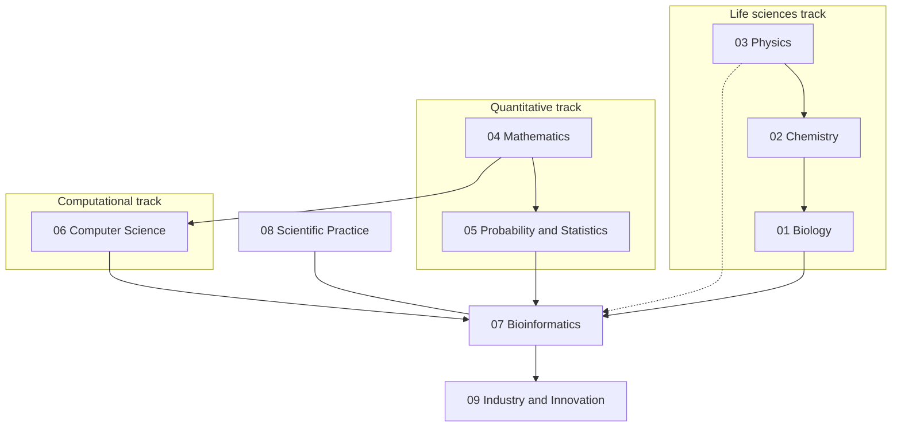
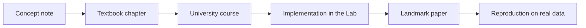

---
aliases:
  - Syllabus
  - Learning Path
tags:
  - type/system
---

# Curriculum

The syllabus of a personal Bachelor (L1 → L3) in bioinformatics, extended to the M1 core. It is a **graph of subjects**, not a list of courses: three tracks (life sciences, quantitative, computational) advance in parallel and converge on bioinformatics.

> [!abstract] How to read this page
> 1. **Map**: the nine domains and their subdomains. Each subdomain has a MOC (its syllabus) listing concepts in learning order.
> 2. **Stages**: what to study together, stage by stage, and which Lab project validates each stage.
> 3. **Progress**: open [[Dashboard.base|Dashboard]]; it aggregates the `mastery` of every note.

## Design principles

1. **Convergent, not exhaustive.** Each discipline is studied to the depth bioinformatics needs: biology, statistics, algorithms and bioinformatics to L3/M1; mathematics to targeted L2/L3; chemistry to L2 with biochemistry to L3; physics to targeted L1/L2 plus biophysics. The weights come from comparing real programs: see [[Curriculum Benchmark]].
2. **One pass per concept.** A concept is written once and deepened from L1 to L3 inside the same note, as university programs revisit DNA or probability every year at a higher level.
3. **Just-in-time mathematics.** Each mathematical tool is attached to the biological problem that needs it.
4. **Theory → implementation → application.** A concept is not mastered until it has been implemented (mastery 3) and applied to real data (mastery 4). The [[Bioinformatics Lab]] repositories are where that happens.

## Map

| Domain | Target | Subdomains (each is a folder with its MOC) |
|---|---|---|
| [[Biology]] | L3 | [[Cell Biology]] · [[Molecular Biology]] · [[Genetics]] · [[Evolution]] · [[Microbiology]] · [[Physiology]] · [[Biotechnology]] |
| [[Chemistry]] | L2, biochemistry L3 | [[General Chemistry]] · [[Organic Chemistry]] · [[Biochemistry]] · [[Physical Chemistry]] |
| [[Physics]] | L1/L2 targeted, biophysics L3 | [[Mechanics]] · [[Thermodynamics]] · [[Electromagnetism]] · [[Waves and Optics]] · [[Statistical Physics]] · [[Biophysics]] |
| [[Mathematics]] | L2/L3 targeted | [[Mathematical Foundations]] · [[Calculus]] · [[Linear Algebra]] · [[Discrete Mathematics]] · [[Differential Equations]] · [[Optimization]] · [[Mathematical Modeling]] |
| [[Probability and Statistics]] | L3 | [[Probability]] · [[Descriptive Statistics]] · [[Statistical Inference]] · [[Linear Models]] · [[Multivariate Analysis]] · [[Bayesian Statistics]] · [[Stochastic Processes]] · [[Statistical Learning]] |
| [[Computer Science]] | L3 targeted | [[Programming]] · [[Data Structures]] · [[Algorithms]] · [[String Algorithms]] · [[Scientific Computing]] · [[Databases]] · [[Computer Systems]] · [[Software Engineering]] |
| [[Bioinformatics]] | L3/M1 | [[Bioinformatics Foundations]] · [[Sequence Analysis]] · [[NGS Data Analysis]] · [[Genomics]] · [[Transcriptomics]] · [[Proteomics]] · [[Structural Bioinformatics]] · [[Phylogenetics]] · [[Population Genomics]] · [[Systems Biology]] · [[Bioinformatics Engineering]] |
| [[Scientific Practice]] | L3 | [[Scientific Method]] · [[Experimental Design]] · [[Reproducibility]] · [[Research Data Management]] · [[Scientific Literature]] · [[Research Ethics]] |
| [[Industry and Innovation]] | L3/M1 | [[Industry Landscape]] · [[Drug Discovery]] · [[Clinical Genomics]] · [[Regulation and Standards]] · [[Innovation and Entrepreneurship]] |

## Stages

A stage is the union of the `Stage N` sections of every subdomain MOC. Inside a stage, study the tracks **in parallel** (a few hours of each per week) and close the stage with its Lab projects. Numbers are concepts to learn; links open the stage section of each syllabus.

### Stage 1 - Foundations

Level: ≈ L1. 341 concepts. The vocabulary and the basic tools of every track. Programming is reviewed, not relearned.

| Track | Subdomains (concepts) |
|---|---|
| Life sciences | [[Cell Biology#Stage 1 - Foundations (L1)\|Cell Biology]] (13) · [[Molecular Biology#Stage 1 - Foundations (L1)\|Molecular Biology]] (17) · [[Genetics#Stage 1 - Foundations (L1)\|Genetics]] (18) · [[Evolution#Stage 1 - Foundations (L1)\|Evolution]] (7) · [[Microbiology#Stage 1 - Foundations (L1)\|Microbiology]] (5) · [[Physiology#Stage 1 - Foundations (L1)\|Physiology]] (7) · [[Biotechnology#Stage 1 - Foundations (L1)\|Biotechnology]] (6) · [[General Chemistry#Stage 1 - Foundations (L1)\|General Chemistry]] (22) · [[Organic Chemistry#Stage 1 - Foundations (L1)\|Organic Chemistry]] (13) · [[Biochemistry#Stage 1 - Foundations (L1)\|Biochemistry]] (11) · [[Physical Chemistry#Stage 1 - Foundations (L1)\|Physical Chemistry]] (14) · [[Mechanics#Stage 1 - Foundations (L1)\|Mechanics]] (11) · [[Thermodynamics#Stage 1 - Foundations (L1)\|Thermodynamics]] (8) · [[Electromagnetism#Stage 1 - Foundations (L1)\|Electromagnetism]] (9) · [[Waves and Optics#Stage 1 - Foundations (L1)\|Waves and Optics]] (8) · [[Statistical Physics#Stage 1 - Foundations (L1)\|Statistical Physics]] (3) · [[Biophysics#Stage 1 - Foundations (L1)\|Biophysics]] (3) |
| Quantitative | [[Mathematical Foundations#Stage 1 - Foundations (L1)\|Mathematical Foundations]] (11) · [[Calculus#Stage 1 - Foundations (L1)\|Calculus]] (14) · [[Linear Algebra#Stage 1 - Foundations (L1)\|Linear Algebra]] (8) · [[Discrete Mathematics#Stage 1 - Foundations (L1)\|Discrete Mathematics]] (7) · [[Mathematical Modeling#Stage 1 - Foundations (L1)\|Mathematical Modeling]] (2) · [[Probability#Stage 1 - Foundations (L1)\|Probability]] (16) · [[Descriptive Statistics#Stage 1 - Foundations (L1)\|Descriptive Statistics]] (15) · [[Statistical Inference#Stage 1 - Foundations (L1)\|Statistical Inference]] (8) |
| Computational | [[Programming#Stage 1 - Foundations (L1)\|Programming]] (11) · [[Data Structures#Stage 1 - Foundations (L1)\|Data Structures]] (8) · [[Algorithms#Stage 1 - Foundations (L1)\|Algorithms]] (9) · [[String Algorithms#Stage 1 - Foundations (L1)\|String Algorithms]] (2) · [[Scientific Computing#Stage 1 - Foundations (L1)\|Scientific Computing]] (3) · [[Databases#Stage 1 - Foundations (L1)\|Databases]] (4) · [[Computer Systems#Stage 1 - Foundations (L1)\|Computer Systems]] (6) · [[Software Engineering#Stage 1 - Foundations (L1)\|Software Engineering]] (7) |
| Integration | [[Bioinformatics Foundations#Stage 1 - Foundations (L1)\|Bioinformatics Foundations]] (12) · [[Sequence Analysis#Stage 1 - Foundations (L1)\|Sequence Analysis]] (8) · [[Scientific Method#Stage 1 - Foundations (L1)\|Scientific Method]] (9) · [[Scientific Literature#Stage 1 - Foundations (L1)\|Scientific Literature]] (6) |

Validated by: [[01-dna-engine]] · [[02-sequence-translation]].

### Stage 2 - Core

Level: ≈ L2. 514 concepts. Mechanisms and core methods: the largest stage. Sequence analysis starts here, on top of dynamic programming and probability.

| Track | Subdomains (concepts) |
|---|---|
| Life sciences | [[Cell Biology#Stage 2 - Core (L2)\|Cell Biology]] (6) · [[Molecular Biology#Stage 2 - Core (L2)\|Molecular Biology]] (11) · [[Genetics#Stage 2 - Core (L2)\|Genetics]] (13) · [[Evolution#Stage 2 - Core (L2)\|Evolution]] (9) · [[Microbiology#Stage 2 - Core (L2)\|Microbiology]] (10) · [[Physiology#Stage 2 - Core (L2)\|Physiology]] (6) · [[Biotechnology#Stage 2 - Core (L2)\|Biotechnology]] (7) · [[General Chemistry#Stage 2 - Core (L2)\|General Chemistry]] (4) · [[Organic Chemistry#Stage 2 - Core (L2)\|Organic Chemistry]] (13) · [[Biochemistry#Stage 2 - Core (L2)\|Biochemistry]] (19) · [[Physical Chemistry#Stage 2 - Core (L2)\|Physical Chemistry]] (12) · [[Mechanics#Stage 2 - Core (L2)\|Mechanics]] (4) · [[Thermodynamics#Stage 2 - Core (L2)\|Thermodynamics]] (4) · [[Electromagnetism#Stage 2 - Core (L2)\|Electromagnetism]] (5) · [[Waves and Optics#Stage 2 - Core (L2)\|Waves and Optics]] (7) · [[Statistical Physics#Stage 2 - Core (L2)\|Statistical Physics]] (11) · [[Biophysics#Stage 2 - Core (L2)\|Biophysics]] (13) |
| Quantitative | [[Mathematical Foundations#Stage 2 - Core (L2)\|Mathematical Foundations]] (2) · [[Calculus#Stage 2 - Core (L2)\|Calculus]] (7) · [[Linear Algebra#Stage 2 - Core (L2)\|Linear Algebra]] (15) · [[Discrete Mathematics#Stage 2 - Core (L2)\|Discrete Mathematics]] (10) · [[Differential Equations#Stage 2 - Core (L2)\|Differential Equations]] (9) · [[Optimization#Stage 2 - Core (L2)\|Optimization]] (6) · [[Mathematical Modeling#Stage 2 - Core (L2)\|Mathematical Modeling]] (6) · [[Probability#Stage 2 - Core (L2)\|Probability]] (14) · [[Descriptive Statistics#Stage 2 - Core (L2)\|Descriptive Statistics]] (9) · [[Statistical Inference#Stage 2 - Core (L2)\|Statistical Inference]] (18) · [[Linear Models#Stage 2 - Core (L2)\|Linear Models]] (9) · [[Multivariate Analysis#Stage 2 - Core (L2)\|Multivariate Analysis]] (9) · [[Bayesian Statistics#Stage 2 - Core (L2)\|Bayesian Statistics]] (7) · [[Stochastic Processes#Stage 2 - Core (L2)\|Stochastic Processes]] (8) · [[Statistical Learning#Stage 2 - Core (L2)\|Statistical Learning]] (9) |
| Computational | [[Programming#Stage 2 - Core (L2)\|Programming]] (7) · [[Data Structures#Stage 2 - Core (L2)\|Data Structures]] (8) · [[Algorithms#Stage 2 - Core (L2)\|Algorithms]] (10) · [[String Algorithms#Stage 2 - Core (L2)\|String Algorithms]] (13) · [[Scientific Computing#Stage 2 - Core (L2)\|Scientific Computing]] (13) · [[Databases#Stage 2 - Core (L2)\|Databases]] (9) · [[Computer Systems#Stage 2 - Core (L2)\|Computer Systems]] (9) · [[Software Engineering#Stage 2 - Core (L2)\|Software Engineering]] (6) |
| Integration | [[Bioinformatics Foundations#Stage 2 - Core (L2)\|Bioinformatics Foundations]] (10) · [[Sequence Analysis#Stage 2 - Core (L2)\|Sequence Analysis]] (18) · [[NGS Data Analysis#Stage 2 - Core (L2)\|NGS Data Analysis]] (11) · [[Genomics#Stage 2 - Core (L2)\|Genomics]] (11) · [[Transcriptomics#Stage 2 - Core (L2)\|Transcriptomics]] (6) · [[Proteomics#Stage 2 - Core (L2)\|Proteomics]] (7) · [[Structural Bioinformatics#Stage 2 - Core (L2)\|Structural Bioinformatics]] (8) · [[Phylogenetics#Stage 2 - Core (L2)\|Phylogenetics]] (10) · [[Population Genomics#Stage 2 - Core (L2)\|Population Genomics]] (4) · [[Systems Biology#Stage 2 - Core (L2)\|Systems Biology]] (4) · [[Bioinformatics Engineering#Stage 2 - Core (L2)\|Bioinformatics Engineering]] (6) · [[Scientific Method#Stage 2 - Core (L2)\|Scientific Method]] (7) · [[Experimental Design#Stage 2 - Core (L2)\|Experimental Design]] (13) · [[Reproducibility#Stage 2 - Core (L2)\|Reproducibility]] (7) · [[Research Data Management#Stage 2 - Core (L2)\|Research Data Management]] (10) · [[Scientific Literature#Stage 2 - Core (L2)\|Scientific Literature]] (10) · [[Research Ethics#Stage 2 - Core (L2)\|Research Ethics]] (5) |

Validated by: [[03-genome-diff]] · [[04-alignment-engine]] · [[05-sequence-search]] · [[06-mutation-lab]].

### Stage 3 - Advanced

Level: ≈ L3. 429 concepts. Omics, evolution models, statistics for real data, and the professional context.

| Track | Subdomains (concepts) |
|---|---|
| Life sciences | [[Cell Biology#Stage 3 - Advanced (L3)\|Cell Biology]] (5) · [[Molecular Biology#Stage 3 - Advanced (L3)\|Molecular Biology]] (5) · [[Genetics#Stage 3 - Advanced (L3)\|Genetics]] (4) · [[Evolution#Stage 3 - Advanced (L3)\|Evolution]] (11) · [[Microbiology#Stage 3 - Advanced (L3)\|Microbiology]] (3) · [[Physiology#Stage 3 - Advanced (L3)\|Physiology]] (4) · [[Biotechnology#Stage 3 - Advanced (L3)\|Biotechnology]] (5) · [[Biochemistry#Stage 3 - Advanced (L3)\|Biochemistry]] (4) · [[Biophysics#Stage 3 - Advanced (L3)\|Biophysics]] (8) |
| Quantitative | [[Linear Algebra#Stage 3 - Advanced (L3)\|Linear Algebra]] (6) · [[Discrete Mathematics#Stage 3 - Advanced (L3)\|Discrete Mathematics]] (6) · [[Differential Equations#Stage 3 - Advanced (L3)\|Differential Equations]] (7) · [[Optimization#Stage 3 - Advanced (L3)\|Optimization]] (9) · [[Mathematical Modeling#Stage 3 - Advanced (L3)\|Mathematical Modeling]] (8) · [[Probability#Stage 3 - Advanced (L3)\|Probability]] (4) · [[Statistical Inference#Stage 3 - Advanced (L3)\|Statistical Inference]] (7) · [[Linear Models#Stage 3 - Advanced (L3)\|Linear Models]] (9) · [[Multivariate Analysis#Stage 3 - Advanced (L3)\|Multivariate Analysis]] (6) · [[Bayesian Statistics#Stage 3 - Advanced (L3)\|Bayesian Statistics]] (9) · [[Stochastic Processes#Stage 3 - Advanced (L3)\|Stochastic Processes]] (8) · [[Statistical Learning#Stage 3 - Advanced (L3)\|Statistical Learning]] (21) |
| Computational | [[Programming#Stage 3 - Advanced (L3)\|Programming]] (2) · [[Data Structures#Stage 3 - Advanced (L3)\|Data Structures]] (5) · [[Algorithms#Stage 3 - Advanced (L3)\|Algorithms]] (7) · [[String Algorithms#Stage 3 - Advanced (L3)\|String Algorithms]] (9) · [[Scientific Computing#Stage 3 - Advanced (L3)\|Scientific Computing]] (4) · [[Databases#Stage 3 - Advanced (L3)\|Databases]] (4) · [[Computer Systems#Stage 3 - Advanced (L3)\|Computer Systems]] (4) · [[Software Engineering#Stage 3 - Advanced (L3)\|Software Engineering]] (1) |
| Integration | [[Sequence Analysis#Stage 3 - Advanced (L3)\|Sequence Analysis]] (8) · [[NGS Data Analysis#Stage 3 - Advanced (L3)\|NGS Data Analysis]] (8) · [[Genomics#Stage 3 - Advanced (L3)\|Genomics]] (19) · [[Transcriptomics#Stage 3 - Advanced (L3)\|Transcriptomics]] (15) · [[Proteomics#Stage 3 - Advanced (L3)\|Proteomics]] (7) · [[Structural Bioinformatics#Stage 3 - Advanced (L3)\|Structural Bioinformatics]] (14) · [[Phylogenetics#Stage 3 - Advanced (L3)\|Phylogenetics]] (15) · [[Population Genomics#Stage 3 - Advanced (L3)\|Population Genomics]] (14) · [[Systems Biology#Stage 3 - Advanced (L3)\|Systems Biology]] (16) · [[Bioinformatics Engineering#Stage 3 - Advanced (L3)\|Bioinformatics Engineering]] (10) · [[Scientific Method#Stage 3 - Advanced (L3)\|Scientific Method]] (3) · [[Experimental Design#Stage 3 - Advanced (L3)\|Experimental Design]] (4) · [[Reproducibility#Stage 3 - Advanced (L3)\|Reproducibility]] (5) · [[Research Data Management#Stage 3 - Advanced (L3)\|Research Data Management]] (9) · [[Scientific Literature#Stage 3 - Advanced (L3)\|Scientific Literature]] (5) · [[Research Ethics#Stage 3 - Advanced (L3)\|Research Ethics]] (13) · [[Industry Landscape#Stage 3 - Advanced (L3)\|Industry Landscape]] (11) · [[Drug Discovery#Stage 3 - Advanced (L3)\|Drug Discovery]] (20) · [[Clinical Genomics#Stage 3 - Advanced (L3)\|Clinical Genomics]] (20) · [[Regulation and Standards#Stage 3 - Advanced (L3)\|Regulation and Standards]] (14) · [[Innovation and Entrepreneurship#Stage 3 - Advanced (L3)\|Innovation and Entrepreneurship]] (14) |

Validated by: [[07-evolution-simulator]] · [[08-phylogenetic-engine]] · [[09-genome-browser]] · [[10-genomic-pipeline]].

### Stage 4 - Frontier

Level: ≈ M1. 76 concepts. Frontier topics that lead to a specialization and to research papers.

| Track | Subdomains (concepts) |
|---|---|
| Quantitative | [[Differential Equations#Stage 4 - Frontier (M1)\|Differential Equations]] (1) · [[Mathematical Modeling#Stage 4 - Frontier (M1)\|Mathematical Modeling]] (1) · [[Linear Models#Stage 4 - Frontier (M1)\|Linear Models]] (1) · [[Multivariate Analysis#Stage 4 - Frontier (M1)\|Multivariate Analysis]] (4) · [[Bayesian Statistics#Stage 4 - Frontier (M1)\|Bayesian Statistics]] (4) · [[Stochastic Processes#Stage 4 - Frontier (M1)\|Stochastic Processes]] (2) · [[Statistical Learning#Stage 4 - Frontier (M1)\|Statistical Learning]] (4) |
| Computational | [[Algorithms#Stage 4 - Frontier (M1)\|Algorithms]] (1) · [[String Algorithms#Stage 4 - Frontier (M1)\|String Algorithms]] (2) · [[Scientific Computing#Stage 4 - Frontier (M1)\|Scientific Computing]] (1) |
| Integration | [[Sequence Analysis#Stage 4 - Frontier (M1)\|Sequence Analysis]] (1) · [[NGS Data Analysis#Stage 4 - Frontier (M1)\|NGS Data Analysis]] (1) · [[Genomics#Stage 4 - Frontier (M1)\|Genomics]] (3) · [[Transcriptomics#Stage 4 - Frontier (M1)\|Transcriptomics]] (7) · [[Proteomics#Stage 4 - Frontier (M1)\|Proteomics]] (4) · [[Structural Bioinformatics#Stage 4 - Frontier (M1)\|Structural Bioinformatics]] (6) · [[Phylogenetics#Stage 4 - Frontier (M1)\|Phylogenetics]] (6) · [[Population Genomics#Stage 4 - Frontier (M1)\|Population Genomics]] (7) · [[Systems Biology#Stage 4 - Frontier (M1)\|Systems Biology]] (5) · [[Bioinformatics Engineering#Stage 4 - Frontier (M1)\|Bioinformatics Engineering]] (2) · [[Research Ethics#Stage 4 - Frontier (M1)\|Research Ethics]] (2) · [[Drug Discovery#Stage 4 - Frontier (M1)\|Drug Discovery]] (2) · [[Clinical Genomics#Stage 4 - Frontier (M1)\|Clinical Genomics]] (2) · [[Regulation and Standards#Stage 4 - Frontier (M1)\|Regulation and Standards]] (6) · [[Innovation and Entrepreneurship#Stage 4 - Frontier (M1)\|Innovation and Entrepreneurship]] (1) |

Validated by: specialization projects, after the ten Lab projects. Candidate specializations: genomics, transcriptomics and single-cell, proteomics, structural bioinformatics, systems biology, population genomics, computational drug discovery, biomedical data science.

> [!tip] Weights
> 1360 concepts in total: 341 in Stage 1, 514 in Stage 2, 429 in Stage 3, 76 in Stage 4. Biology, statistics, algorithms and bioinformatics carry the weight; physics stops at Stage 2 except [[Biophysics]], and [[Industry and Innovation]] only starts at Stage 3.

## From concept to paper

From Stage 3 onward, each major topic is followed to the literature:

## References

The subject list, its ordering and the relative weights are derived from the programs compared in [[Curriculum Benchmark]].
