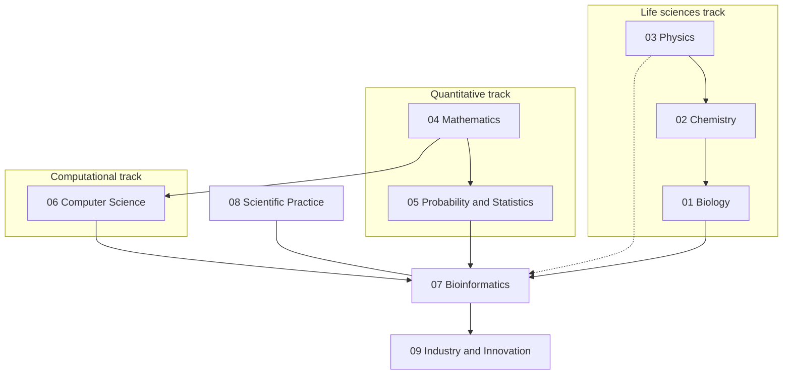
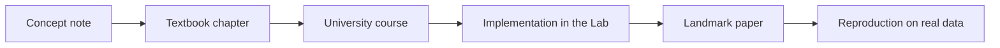

---
aliases:
  - Syllabus
  - Learning Path
tags:
  - type/system
---

# Curriculum

The syllabus of a personal Bachelor (L1 → L3) in bioinformatics, extended to the M1 core. It is a **graph of subjects**, not a list of courses: three tracks (life sciences, quantitative, computational) advance in parallel and converge on bioinformatics.

> [!abstract] How to read this page
> 1. **Map**: the nine domains and their subdomains. Each subdomain has a MOC (its syllabus) listing concepts in learning order.
> 2. **Stages**: what to study together, stage by stage, and which Lab project validates each stage.
> 3. **Progress**: open [[Dashboard.base|Dashboard]]; it aggregates the `mastery` of every note.

## Design principles

1. **Convergent, not exhaustive.** Each discipline is studied to the depth bioinformatics needs: biology, statistics, algorithms and bioinformatics to L3/M1; mathematics to targeted L2/L3; chemistry to L2 with biochemistry to L3; physics to targeted L1/L2 plus biophysics. The weights come from comparing real programs: see [[Curriculum Benchmark]].
2. **One pass per concept.** A concept is written once and deepened from L1 to L3 inside the same note, as university programs revisit DNA or probability every year at a higher level.
3. **Just-in-time mathematics.** Each mathematical tool is attached to the biological problem that needs it.
4. **Theory → implementation → application.** A concept is not mastered until it has been implemented (mastery 3) and applied to real data (mastery 4). The [[Bioinformatics Lab]] repositories are where that happens.

## Map

| Domain | Target | Subdomains (each is a folder with its MOC) |
|---|---|---|
| [[Biology]] | L3 | [[Cell Biology]] · [[Molecular Biology]] · [[Genetics]] · [[Evolution]] · [[Microbiology]] · [[Physiology]] · [[Biotechnology]] |
| [[Chemistry]] | L2, biochemistry L3 | [[General Chemistry]] · [[Organic Chemistry]] · [[Biochemistry]] · [[Physical Chemistry]] |
| [[Physics]] | L1/L2 targeted, biophysics L3 | [[Mechanics]] · [[Thermodynamics]] · [[Electromagnetism]] · [[Waves and Optics]] · [[Statistical Physics]] · [[Biophysics]] |
| [[Mathematics]] | L2/L3 targeted | [[Mathematical Foundations]] · [[Calculus]] · [[Linear Algebra]] · [[Discrete Mathematics]] · [[Differential Equations]] · [[Optimization]] · [[Mathematical Modeling]] |
| [[Probability and Statistics]] | L3 | [[Probability]] · [[Descriptive Statistics]] · [[Statistical Inference]] · [[Linear Models]] · [[Multivariate Analysis]] · [[Bayesian Statistics]] · [[Stochastic Processes]] · [[Statistical Learning]] |
| [[Computer Science]] | L3 targeted | [[Programming]] · [[Data Structures]] · [[Algorithms]] · [[String Algorithms]] · [[Scientific Computing]] · [[Databases]] · [[Computer Systems]] · [[Software Engineering]] |
| [[Bioinformatics]] | L3/M1 | [[Bioinformatics Foundations]] · [[Sequence Analysis]] · [[NGS Data Analysis]] · [[Genomics]] · [[Transcriptomics]] · [[Proteomics]] · [[Structural Bioinformatics]] · [[Phylogenetics]] · [[Population Genomics]] · [[Systems Biology]] · [[Bioinformatics Engineering]] |
| [[Scientific Practice]] | L3 | [[Scientific Method]] · [[Experimental Design]] · [[Reproducibility]] · [[Research Data Management]] · [[Scientific Literature]] · [[Research Ethics]] |
| [[Industry and Innovation]] | L3/M1 | [[Industry Landscape]] · [[Drug Discovery]] · [[Clinical Genomics]] · [[Regulation and Standards]] · [[Innovation and Entrepreneurship]] |

## Stages

A stage is roughly one academic year of a double-major student, compressed because programming is already mastered. Within a stage, study the tracks **in parallel**: a few hours of biology, of quantitative work and of computation each week, joined by the stage's Lab projects.

### Stage 1 - Foundations

Level: ≈ L1.

| Track | Study | Validated by |
|---|---|---|
| Life sciences | [[Cell Biology]] · [[Molecular Biology]] (Stage 1) · [[Genetics]] (Stage 1) · [[General Chemistry]] | [[01-dna-engine]] |
| Quantitative | [[Mathematical Foundations]] · [[Calculus]] (Stage 1) · [[Probability]] (Stage 1) · [[Descriptive Statistics]] | [[02-sequence-translation]] |
| Computational | [[Programming]] · [[Data Structures]] · [[Algorithms]] (Stage 1) | |
| Integration | [[Bioinformatics Foundations]] · [[Scientific Method]] | |

### Stage 2 - Core

Level: ≈ L2.

| Track | Study | Validated by |
|---|---|---|
| Life sciences | [[Molecular Biology]] (Stage 2) · [[Genetics]] (Stage 2) · [[Evolution]] · [[Biochemistry]] · [[Organic Chemistry]] · [[Thermodynamics]] | [[03-genome-diff]] |
| Quantitative | [[Linear Algebra]] · [[Discrete Mathematics]] · [[Probability]] (Stage 2) · [[Statistical Inference]] | [[04-alignment-engine]] |
| Computational | [[Algorithms]] (Stage 2) · [[String Algorithms]] · [[Databases]] · [[Computer Systems]] | [[05-sequence-search]] |
| Integration | [[Sequence Analysis]] · [[Experimental Design]] · [[Scientific Literature]] | [[06-mutation-lab]] |

### Stage 3 - Advanced

Level: ≈ L3.

| Track | Study | Validated by |
|---|---|---|
| Life sciences | [[Molecular Biology]] (Stage 3) · [[Microbiology]] · [[Physiology]] · [[Biotechnology]] · [[Physical Chemistry]] · [[Biophysics]] | [[07-evolution-simulator]] |
| Quantitative | [[Differential Equations]] · [[Optimization]] · [[Mathematical Modeling]] · [[Linear Models]] · [[Multivariate Analysis]] · [[Bayesian Statistics]] · [[Stochastic Processes]] | [[08-phylogenetic-engine]] |
| Computational | [[Scientific Computing]] · [[Software Engineering]] | [[09-genome-browser]] |
| Integration | [[NGS Data Analysis]] · [[Genomics]] · [[Phylogenetics]] · [[Population Genomics]] · [[Reproducibility]] · [[Research Data Management]] | [[10-genomic-pipeline]] |

### Stage 4 - Bioinformatics core

Level: ≈ L3/M1.

[[Transcriptomics]] · [[Proteomics]] · [[Structural Bioinformatics]] · [[Systems Biology]] · [[Statistical Learning]] · [[Bioinformatics Engineering]] · [[Research Ethics]] · [[Industry and Innovation]]. Then a specialization (genomics, transcriptomics and single-cell, proteomics, structural bioinformatics, systems biology, population genomics, computational drug discovery, biomedical data science) and the reading of research papers.

## From concept to paper

From Stage 3 onward, each major topic is followed to the literature:

## References

The subject list, its ordering and the relative weights are derived from the programs compared in [[Curriculum Benchmark]].
