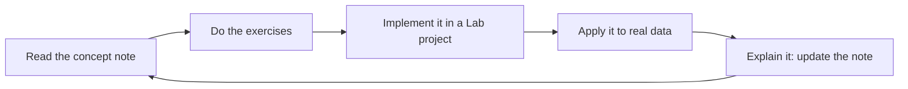

---
aliases:
  - Start Here
tags:
  - type/system
---

# Home

> [!abstract]
> A self-directed Bachelor in bioinformatics: learn the science, implement it, apply it to real data.

## Start here

1. [[Curriculum]]: the map, the stages and what to study now.
2. [[Conventions]]: how notes, tags and properties work.
3. [[Dashboard.base|Dashboard]]: your progress, from the `mastery` of every note.

## Domains

| Life sciences | Quantitative | Computational | Integration |
|---|---|---|---|
| [[Biology]] | [[Mathematics]] | [[Computer Science]] | [[Bioinformatics]] |
| [[Chemistry]] | [[Probability and Statistics]] | | [[Scientific Practice]] |
| [[Physics]] | | | [[Industry and Innovation]] |

## Other entry points

- [[Bioinformatics Lab]]: the code projects that validate each stage.
- [[Sources.base|Sources]]: every course, book, paper and database, by kind and tier.
- [[Glossary.base|Glossary]]: every concept with its aliases.
- [[Curriculum Benchmark]]: how real university programs shaped this curriculum.
- [[Roadmap]] and [[Learning Log]].

## The learning loop

