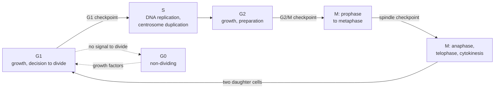

---
aliases:
  - Cell Division Cycle
  - Cycle cellulaire
  - Interphase
  - G1 Phase
  - S Phase
  - G2 Phase
  - M Phase
  - G0 Phase
  - Cell Cycle Checkpoint
  - Restriction Point
  - Cyclin
  - Cyclin-Dependent Kinase
  - CDK
tags:
  - type/concept
  - domain/biology
  - domain/bioinformatics
  - level/L1
  - level/L2
  - level/L3
mastery: 0
prerequisites:
  - "[[Eukaryote]]"
  - "[[Chromosome]]"
  - "[[DNA Replication]]"
  - "[[Enzyme]]"
related:
  - "[[Mitosis]]"
  - "[[Meiosis]]"
  - "[[Cytoskeleton]]"
  - "[[Apoptosis]]"
  - "[[Cancer]]"
  - "[[Tumor Suppressor Gene]]"
  - "[[Oncogene]]"
  - "[[DNA Repair]]"
  - "[[Cell Signaling]]"
  - "[[Exponential Growth]]"
  - "[[Flow Cytometry]]"
  - "[[Microarray]]"
  - "[[Single-Cell RNA Sequencing]]"
projects: []
sources:
  - "[[Biology 2e (OpenStax)]]"
  - "[[Molecular Biology of the Cell (Alberts)]]"
  - "[[The Cell (Cooper)]]"
  - "[[Spellman 1998 - Comprehensive Identification of Cell Cycle-Regulated Genes of the Yeast Saccharomyces cerevisiae]]"
---

# Cell Cycle

> [!abstract]
> The cell cycle is the ordered sequence of growth, DNA replication and division by which one cell becomes two; checkpoints let it move on only when the previous step is complete.

## Definition

The **cell cycle** is the series of events by which a cell duplicates its contents and divides in two.[^alberts17] In eukaryotes it has four phases: **G1** (first gap), **S** (DNA synthesis), **G2** (second gap) and **M** (mitosis and cytokinesis); G1, S and G2 together form **interphase**.[^os10][^alberts17] A control system built on **cyclin-dependent kinases** (Cdks) triggers each transition, and **checkpoints** halt the cycle when conditions are not met.[^os103][^alberts17]

## Why it matters

- **Expression data of dividing cells contain the cycle.** In a genome-wide microarray time course of synchronized yeast cultures, Spellman and colleagues identified 800 genes whose transcript levels oscillate with the cycle, more than half of them responding to the G1 cyclin Cln3p or the B-type cyclin Clb2p.[^spellman] Finding periodic genes is a time-series problem (Exercise 5).
- **Single-cell data are snapshots of an unsynchronized cycle.** Each cell of a [[Single-Cell RNA Sequencing]] dataset is caught in one phase, so proliferating cells spread along a cyclic axis of expression that must be recognized before clusters are interpreted ([[Single-Cell Clustering]]). Snapshot proportions are also biased toward early phases (Mathematical representation).
- **DNA content tells the phase.** A diploid G1 cell holds 2C of DNA, a G2 or M cell 4C, an S-phase cell something in between, so a histogram of DNA per cell measured by [[Flow Cytometry]] shows how a population is distributed over the cycle.[^alberts17] Sequencing depth in S-phase cells even reveals which regions replicate early (Exercise 6).
- **Cancer is a disease of cycle control.** Brakes of the cycle such as p53 and Rb are products of [[Tumor Suppressor Gene|tumor suppressor genes]], and overactive growth signals come from [[Oncogene|oncogenes]] ([[Cancer]]).[^os10][^alberts17]

## Core (L1)



| Phase | Main events | DNA per cell | Chromatids per chromosome | Duration in a 24 h human cell |
|---|---|---|---|---:|
| G1 | growth, protein synthesis, decision to divide | 2C | 1 | about 9 h |
| S | DNA replication, centrosome duplication | 2C → 4C | 1 → 2 | about 10 h |
| G2 | growth, preparation for mitosis | 4C | 2 | about 4.5 h |
| M | mitosis, then cytokinesis | 4C → 2C per daughter | 2 → 1 | about 0.5 h |

Events from OpenStax and Alberts;[^os10][^alberts17] durations are those of rapidly dividing human cells in culture with a 24 h cycle.[^os103] C is the DNA content of one haploid genome ([[Ploidy]]). Cycle length varies widely between cell types. Cells that stop dividing leave G1 for a non-dividing state, **G0**: some temporarily, others, such as mature heart muscle and nerve cells, permanently.[^os10]

### Checkpoints

A checkpoint is a point where the cycle can stop until conditions are satisfied.[^os103] Three are central:[^os103][^alberts17]

1. **G1 checkpoint**, called the restriction point in animal cells and Start in yeast: is the cell large enough, are nutrients and growth signals present, is the DNA intact? Once past it, the cell is committed to divide.[^cooper]
2. **G2/M checkpoint**: has all the DNA been replicated, without damage? Only then does mitosis begin.
3. **Spindle checkpoint**, at the transition from metaphase to anaphase: is every chromosome attached to the spindle? Only then are sister chromatids separated ([[Mitosis]]).

Together they make sure that each daughter cell receives one complete, intact copy of the genome.

### The engine: cyclins and Cdks

- **Cdks** are protein kinases, enzymes that phosphorylate target proteins, and they are active only when bound to a **cyclin**.[^os103][^alberts17]
- Cdk levels stay roughly constant, while each cyclin is made and destroyed at set times, so each cyclin-Cdk complex is active in its own window of the cycle.[^alberts17]
- Different complexes trigger different events: G1/S-Cdks commit the cell to a new cycle, S-Cdks start DNA replication, M-Cdks start mitosis.[^alberts17]
- To finish mitosis, the **anaphase-promoting complex** (APC/C) marks proteins for destruction by ubiquitination: securin, whose loss lets sister chromatids separate, and the M cyclins, whose loss lets the cell leave mitosis.[^alberts17]

**Brakes.** Negative regulators stop the cycle when something is wrong:[^os103][^alberts17]

- **Rb** (retinoblastoma protein) binds and inhibits E2F transcription factors, which switch on the genes needed for S phase; phosphorylation of Rb by G1 Cdks releases them.
- **p53** accumulates after DNA damage and induces **p21**, a Cdk inhibitor that halts the cycle; if the damage cannot be repaired, p53 can trigger cell death ([[DNA Repair]], [[Apoptosis]]).

## Deeper (L2)

### Switches that only go one way

- **Abrupt entry into mitosis.** M-Cdk is held inactive by inhibitory phosphates added by the Wee1 kinase until the Cdc25 phosphatase removes them; active M-Cdk activates more Cdc25, a positive feedback that makes M-Cdk activity rise explosively once a threshold is crossed.[^alberts17]
- **Irreversible exit.** Cyclins and securin are destroyed by proteolysis, so the cell cannot slip back; it must make them again in the next cycle.[^alberts17]
- **Replication once and only once.** Replication origins are prepared ("licensed") in G1 and fired in S; Cdk activity blocks relicensing until the next G1, so no DNA is copied twice ([[DNA Replication]]).[^alberts17]
- **Checkpoints are signaling pathways.** DNA damage activates protein kinases that stabilize p53 and inhibit Cdc25, stopping the cycle in G1 or G2; unattached kinetochores send a signal that blocks the APC/C, holding the cell before anaphase ([[Mitosis#Deeper (L2)]]).[^alberts17]

### Control from outside the cell

Animal cells divide only when told to. Mitogens, extracellular signal proteins, act through receptors and signaling cascades to raise G1-Cdk activity, which phosphorylates Rb and frees E2F to switch on S-phase genes; without mitogens, cells withdraw into G0 ([[Cell Signaling]]).[^alberts17]

### How the controls were found

Yeast *cdc* (cell-division-cycle) mutants arrest at a specific stage when grown at a high, restrictive temperature; collecting them identified many control genes.[^alberts17] Such arrests are still used to synchronize cultures: the Spellman time courses combined α-factor arrest, elutriation and the arrest of a *cdc15* temperature-sensitive mutant.[^spellman]

## Advanced (L3)

- **Periodic genes.** The three synchronization methods gave independent time courses, and periodicity and correlation algorithms selected the 800 genes that met an objective minimum criterion for cell-cycle regulation.[^spellman] The count follows from that chosen criterion: another threshold or score would select another list, which is why Exercise 5 attaches a permutation test to a toy periodicity score ([[Microarray]], [[Correlation]]).
- **Snapshots overrepresent young cells.** In an exponentially growing, unsynchronized population there are twice as many newborn cells as cells about to divide, so the fraction of cells in a phase is not the fraction of time spent in it (Mathematical representation). Durations inferred from flow cytometry or single-cell data must correct for this.
- **Replication timing in sequencing data.** Different regions of a chromosome replicate at different times during S phase.[^alberts] In S-phase cells, early regions have already been copied while late ones have not, so their read depth relative to G1 cells is higher: a replication-timing profile can be read from sequencing depth (Exercise 6). The same effect can make S-phase cells look like copy-number changes in single-cell DNA sequencing ([[Sequencing Coverage]], [[Copy Number Variation]]).
- **Cancer genomes.** Losing a brake (p53, Rb) or gaining a growth signal lets cells divide without control and accumulate further mutations; cancer genomics catalogs these drivers ([[Tumor Suppressor Gene]], [[Oncogene]], [[Cancer]]).[^os10][^alberts17]

## Mathematical representation

- **Cycle time.** $T = T_{G1} + T_S + T_{G2} + T_M$. In steady exponential growth where every cell divides after time $T$, the population is $N(t) = N_0\, 2^{t/T}$ ([[Exponential Growth]]).
- **Age distribution.** Let $a \in [0, T)$ be the time since a cell's birth. Cells of age $a$ at time $t$ were born at time $t - a$, when the birth rate was proportional to $N(t - a) \propto 2^{-a/T}$. Normalizing over $[0, T)$, the age density is
$$n(a) = \frac{2 \ln 2}{T}\, 2^{-a/T}, \qquad 0 \le a < T,$$
with $n(0) = 2\, n(T)$: each dividing cell yields two newborns.
- **Phase fractions.** A phase occupying ages $[a_1, a_2)$ holds the fraction
$$F = \int_{a_1}^{a_2} n(a)\, da = 2^{1 - a_1/T} - 2^{1 - a_2/T},$$
larger than its time share $(a_2 - a_1)/T$ for early phases and smaller for late ones.
- **Inverting.** The fraction of cells younger than $a$ is $F(a) = 2 - 2^{1 - a/T}$, so phase boundaries follow from measured cumulative fractions: $a = T\,\big(1 - \log_2(2 - F(a))\big)$. For M, the last phase, $F_M = 2^{T_M/T} - 1$, i.e. $T_M = T \log_2(1 + F_M)$.
- **Variable cycle times.** If cycle times vary, with growth rate $\lambda$ and $P(\text{cycle} > a)$ the probability that a cell has not yet divided at age $a$, the age density becomes proportional to $e^{-\lambda a}\, P(\text{cycle} > a)$: still decreasing, so young cells stay overrepresented.
- **Periodicity score.** For a gene measured at times $t_1, \dots, t_m$ with values centered as $x_i$, project on a sinusoid of period $T$: $A = \sum_i x_i \cos(2\pi t_i/T)$ and $B = \sum_i x_i \sin(2\pi t_i/T)$. With samples evenly spread over whole periods, the sine and cosine vectors are orthogonal with squared norm $m/2$, so the fraction of variance explained by the best-fitting sinusoid is
$$\rho = \frac{2\,(A^2 + B^2)}{m \sum_i x_i^2} \in [0, 1],$$
and its peak time is $t^* = \frac{T}{2\pi} \operatorname{atan2}(B, A) \bmod T$. This is a toy score in the spirit of Fourier analysis, not the criterion of Spellman and colleagues.

## Computational representation

Phase durations are stored as numbers per phase, expression time courses as one vector per gene. The code computes snapshot fractions for the 24 h human cycle (G1 gets more cells than its share of time, M fewer); `periodicity` is used in Exercise 5.

```python
import math


def snapshot_fractions(durations: dict[str, float]) -> dict[str, float]:
    """Phase fractions of an exponentially growing population (same durations in every cell)."""
    T = sum(durations.values())
    fractions, age = {}, 0.0
    for phase, d in durations.items():
        fractions[phase] = 2 ** (1 - age / T) - 2 ** (1 - (age + d) / T)
        age += d
    return fractions


def durations_from_fractions(fractions: dict[str, float], T: float) -> dict[str, float]:
    """Inverse of snapshot_fractions: phase durations from measured fractions and cycle time."""
    durations, cumulative, start = {}, 0.0, 0.0
    for phase, f in fractions.items():
        cumulative += f
        end = T * (1 - math.log2(2 - cumulative))
        durations[phase], start = end - start, end
    return durations


def periodicity(times: list[float], values: list[float], period: float) -> tuple[float, float]:
    """Variance share of the best sinusoid of this period, and its peak time (even sampling)."""
    m = len(values)
    mean = sum(values) / m
    x = [v - mean for v in values]
    A = sum(xi * math.cos(2 * math.pi * t / period) for xi, t in zip(x, times))
    B = sum(xi * math.sin(2 * math.pi * t / period) for xi, t in zip(x, times))
    rho = 2 * (A * A + B * B) / (m * sum(xi * xi for xi in x))
    return rho, (math.atan2(B, A) * period / (2 * math.pi)) % period


human = {"G1": 9.0, "S": 10.0, "G2": 4.5, "M": 0.5}       # hours, 24 h human cell cycle
for phase, f in snapshot_fractions(human).items():
    print(f"{phase:2}  share of time {human[phase] / 24:.3f}   share of cells {f:.3f}")
```

```text
G1  share of time 0.375   share of cells 0.458
S   share of time 0.417   share of cells 0.387
G2  share of time 0.188   share of cells 0.141
M   share of time 0.021   share of cells 0.015
```

## Worked example

> [!example] Phase durations from a DNA-content snapshot (invented measurement)
> An unsynchronized culture doubles every 24 h. Its DNA histogram shows 46 % of cells at 2C (G1), 40 % between 2C and 4C (S) and 14 % at 4C (G2 and M).
> 1. **Naive reading**: durations proportional to fractions, $0.46 \times 24 = 11.0$ h for G1, 9.6 h for S, 3.4 h for G2/M.
> 2. **Correct for age structure**: end of G1 at $24\,(1 - \log_2(2 - 0.46)) = 9.0$ h; end of S at $24\,(1 - \log_2(2 - 0.86)) = 19.5$ h.
> 3. **Result**: G1 9.0 h, S 10.4 h, G2/M 4.5 h, as `durations_from_fractions({"G1": 0.46, "S": 0.40, "G2/M": 0.14}, 24)` returns. The naive reading overestimated G1 by 2 h and underestimated G2/M by 1 h, because a growing population is enriched in young cells.

## Common misconceptions

> [!warning] "Interphase is a resting phase"
> Interphase is when the cell grows and replicates its DNA; it fills most of the cycle. The non-dividing state is G0.[^os10]

> [!warning] "Cyclins are the kinases"
> Cyclins are regulatory partners without kinase activity; the kinases are the Cdks, which need a cyclin to work.[^alberts17]

> [!warning] "S phase doubles the number of chromosomes"
> S phase doubles the DNA and gives each chromosome two sister chromatids, but the chromosome count, by centromeres, stays the same: 46 in a human cell ([[Chromosome]]).[^os10]

## Exercises

> [!question] Exercise 1 (L1)
> Name the phase, or the checkpoint, for each event: (a) DNA replication; (b) duplication of the centrosome; (c) condensation of chromosomes; (d) separation of sister chromatids; (e) the decision to divide in response to growth factors; (f) the check that all DNA has been replicated.

> [!success]- Solution
> (a) S. (b) S. (c) M, prophase. (d) M, anaphase, after the spindle checkpoint is satisfied. (e) G1, at the restriction point. (f) The G2/M checkpoint, at the end of G2.

> [!question] Exercise 2 (L1)
> In a flow cytometer, the DNA signal of G1 cells is 100 units. Predict the signal of a cell in mid S phase, in G2, in metaphase, in G0, and of a cell that completed mitosis without cytokinesis (two nuclei, now in G1).

> [!success]- Solution
> Mid S: about 150, anywhere between 100 and 200. G2: 200. Metaphase: 200, since the DNA is replicated and not yet divided. G0: 100. Binucleate cell: 200, as much DNA as a G2 cell, but in two G1 nuclei; DNA content alone cannot tell them apart.

> [!question] Exercise 3 (L2)
> Predict what happens: (a) cells lacking functional p53 are irradiated; (b) a mutant M cyclin cannot be destroyed; (c) a drug prevents spindle microtubules from forming; (d) the gene for Rb is deleted.

> [!success]- Solution
> (a) The damage no longer induces p21, so cells pass the G1 checkpoint with damaged DNA and replicate it, which fixes mutations. (b) M-Cdk stays active and the cell cannot leave mitosis. (c) Kinetochores stay unattached, the spindle checkpoint keeps the APC/C off, and cells arrest before anaphase. (d) E2F is never held back, so S-phase genes are switched on without the mitogen-controlled brake.[^os103][^alberts17]

> [!question] Exercise 4 (L2)
> An invented cell type has $T = 20$ h with G1 = 8 h, S = 7 h, G2 = 4 h and M = 1 h. Compute the fraction of cells in each phase of an exponentially growing culture, and estimate $T_M$ from the mitotic fraction with and without the age correction.

> [!success]- Solution
> With $F = 2^{1 - a_1/T} - 2^{1 - a_2/T}$: G1 $2 - 2^{0.6} = 0.484$, S $2^{0.6} - 2^{0.25} = 0.327$, G2 $2^{0.25} - 2^{0.05} = 0.154$, M $2^{0.05} - 1 = 0.035$, against time shares 0.40, 0.35, 0.20 and 0.05. From the mitotic fraction, $T_M = 20 \log_2(1.035) = 1.0$ h exactly, while the naive $0.035 \times 20 = 0.71$ h underestimates it by 30 %.

> [!question] Exercise 5 (L3, Python)
> Four invented genes were measured every 10 min over two 60-min cycles. Using `periodicity` from the code above, compute $\rho$ and a permutation p-value (2000 random reorderings of each gene's values). Which genes are periodic? If 6,000 genes were tested, what would this procedure's smallest attainable p-value imply?

> [!success]- Solution
> ```python
> import random
>
> data = {  # invented expression, sampled every 10 min over two 60-min cycles
>     "gene_1": [9.1, 7.6, 4.9, 2.8, 3.2, 5.9, 8.8, 7.9, 5.3, 3.1, 2.9, 6.2],
>     "gene_2": [5.2, 4.8, 5.5, 4.9, 5.1, 5.4, 4.7, 5.0, 5.3, 4.6, 5.2, 4.9],
>     "gene_3": [3.0, 5.1, 7.9, 9.2, 7.4, 4.6, 2.9, 5.4, 8.1, 8.8, 7.0, 4.2],
>     "gene_4": [6.1, 3.9, 5.8, 6.6, 4.1, 5.0, 6.9, 4.4, 3.8, 6.0, 5.5, 4.7],
> }
> times = list(range(0, 120, 10))
> rng = random.Random(42)
> for name, values in data.items():
>     rho, peak = periodicity(times, values, 60)
>     shuffled = values[:]
>     null = []
>     for _ in range(2000):                                 # permutation null: destroy time order
>         rng.shuffle(shuffled)
>         null.append(periodicity(times, shuffled, 60)[0])
>     p = (1 + sum(r >= rho for r in null)) / (1 + len(null))
>     print(f"{name}: rho = {rho:.2f}, peak {peak:4.1f} min, permutation p = {p:.4f}")
> ```
> ```text
> gene_1: rho = 0.98, peak  3.4 min, permutation p = 0.0005
> gene_2: rho = 0.00, peak 30.0 min, permutation p = 0.9955
> gene_3: rho = 0.99, peak 28.5 min, permutation p = 0.0005
> gene_4: rho = 0.02, peak 43.4 min, permutation p = 0.8931
> ```
> Genes 1 and 3 are periodic and peak about 25 minutes apart, like two waves of the cycle; genes 2 and 4 are noise around a constant. Their p-value, 0.0005, is the smallest this test can give, $1/2001$. Over 6,000 genes, a Bonferroni threshold would be $0.05/6000 \approx 8 \times 10^{-6}$, out of reach: genome-wide screens need more permutations, an analytic null or false-discovery-rate control ([[Multiple Testing Correction]]).

> [!question] Exercise 6 (L3, Python)
> Invented read counts in ten windows of one chromosome come from S-phase cells and from G1 cells. Normalize for library size, compute $\log_2$ of the depth ratio and classify each window as early, mid or late replicating, with thresholds of ±0.15. Why does the ratio carry timing information?

> [!success]- Solution
> ```python
> import math
>
> s_phase = [1520, 1490, 1610, 1180, 980, 1010, 1550, 1240, 950, 1010]   # invented reads per window
> g1_phase = [1000, 980, 1040, 1010, 990, 1020, 1000, 1030, 980, 1010]
> s_total, g_total = sum(s_phase), sum(g1_phase)
> classes = {"early": [], "mid": [], "late": []}
> for i, (s, g) in enumerate(zip(s_phase, g1_phase), start=1):
>     log_ratio = math.log2((s / s_total) / (g / g_total))       # depth ratio, library size removed
>     label = "early" if log_ratio > 0.15 else "late" if log_ratio < -0.15 else "mid"
>     classes[label].append((i, round(log_ratio, 2)))
> for label, windows in classes.items():
>     print(label, windows)
> ```
> ```text
> early [(1, 0.29), (2, 0.29), (3, 0.31), (7, 0.31)]
> mid [(4, -0.09), (8, -0.05)]
> late [(5, -0.33), (6, -0.33), (9, -0.36), (10, -0.32)]
> ```
> A region copied early in S phase is already duplicated in most S-phase cells, so it contributes more reads than in G1 cells; a late region is still single-copy in most of them. G1 cells provide the baseline that removes mappability and GC biases common to both libraries. The thresholds are arbitrary: timing is a continuum, and real profiles are smoothed along the chromosome.

## Mastery checklist

- [ ] 1 Recognized: I can name G1, S, G2, M and G0 and the three checkpoints.
- [ ] 2 Understood: I can explain how cyclins, Cdks, the APC/C, Rb and p53 order the cycle and stop it when something is wrong.
- [ ] 3 Practiced: I can compute snapshot fractions and correct phase durations, and score periodic genes in code.
- [ ] 4 Applied: I scored cell-cycle phases in a real single-cell dataset, or reanalyzed a periodic-gene time course such as the Spellman data.
- [ ] 5 Explained: I can teach why snapshots are biased, how checkpoint failure leads to cancer, and why periodic-gene lists depend on the method.

## References

[^os10]: [[Biology 2e (OpenStax)]], ch. 10 "Cell Reproduction" (interphase and its phases, G0, the mitotic phase, cancer and the cell cycle).
[^os103]: [[Biology 2e (OpenStax)]], section 10.3 "Control of the Cell Cycle" (cycle length of rapidly dividing human cells: G1 about 9 h, S 10 h, G2 4.5 h, M 0.5 h; G1, G2 and M checkpoints; cyclins and Cdks; Rb, p53 and p21).
[^alberts17]: [[Molecular Biology of the Cell (Alberts)]], 4th ed. (2002), ch. 17 "The Cell Cycle and Programmed Cell Death" (phases and DNA content, Start and checkpoints, cyclin-Cdk complexes, APC/C and securin, Wee1 and Cdc25, replication once per cycle, mitogens and the Rb-E2F pathway, p53 and p21, yeast *cdc* mutants).
[^alberts]: [[Molecular Biology of the Cell (Alberts)]], 4th ed. (2002), treatment of the timing of chromosome replication during S phase.
[^cooper]: [[The Cell (Cooper)]], 2nd ed. (2000), treatment of the eukaryotic cell cycle and its regulators (the restriction point).
[^spellman]: [[Spellman 1998 - Comprehensive Identification of Cell Cycle-Regulated Genes of the Yeast Saccharomyces cerevisiae]], *Molecular Biology of the Cell* 9(12):3273-3297.
