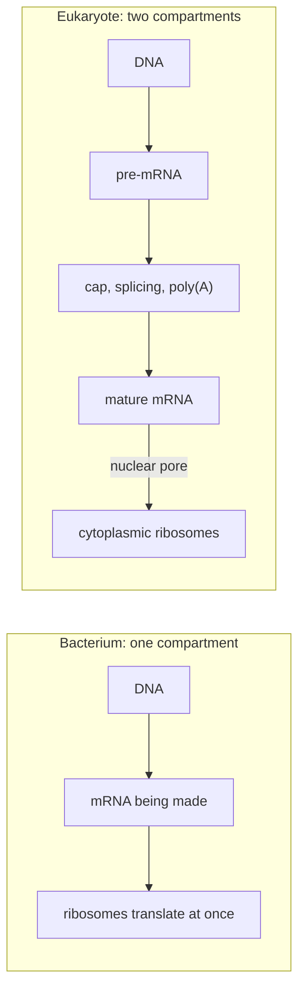

---
aliases:
  - Nucleus
  - Nuclear Envelope
  - Nuclear Pore
  - Nuclear Pore Complex
  - NPC
  - Nucleolus
  - Noyau cellulaire
tags:
  - type/concept
  - domain/biology
  - domain/bioinformatics
  - level/L1
  - level/L2
  - level/L3
mastery: 0
prerequisites:
  - "[[Eukaryote]]"
  - "[[Organelle]]"
  - "[[Cell Membrane]]"
  - "[[Transcription]]"
  - "[[Translation]]"
related:
  - "[[Prokaryote]]"
  - "[[Chromosome]]"
  - "[[Chromatin]]"
  - "[[RNA Processing]]"
  - "[[Messenger RNA]]"
  - "[[Ribosome]]"
  - "[[Endomembrane System]]"
  - "[[Protein Targeting]]"
  - "[[Nonsense-Mediated Decay]]"
  - "[[Mitochondrion]]"
projects: []
sources:
  - "[[Biology 2e (OpenStax)]]"
  - "[[Molecular Biology of the Cell (Alberts)]]"
  - "[[The Cell (Cooper)]]"
  - "[[Anatomy and Physiology 2e (OpenStax)]]"
  - "[[Gene Ontology]]"
  - "[[Nagy 1998 - A Rule for Termination-Codon Position Within Intron-Containing Genes]]"
  - "[[Nurk 2022 - The Complete Sequence of a Human Genome]]"
---

# Cell Nucleus

> [!abstract]
> The nucleus is the double-membrane compartment that holds a eukaryotic cell's chromosomes: genes are transcribed and their RNAs processed inside it, while proteins are made outside it, and pores in its envelope control what crosses.

## Definition

The **cell nucleus** is the organelle of eukaryotic cells that contains the nuclear genome, packaged as [[Chromatin|chromatin]]. It is enclosed by the **nuclear envelope**, two concentric membranes perforated by **nuclear pore complexes**, the only channels through which molecules pass between nucleus and cytoplasm. Its most visible internal structure, the **nucleolus**, is where ribosomal RNA is made and ribosomal subunits are assembled.[^os4][^alberts12][^cooper]

## Why it matters

- **Most genes of a eukaryote are nuclear.** A eukaryotic [[Reference Genome]] is essentially the nuclear [[Chromosome|chromosomes]], plus a small organelle genome ([[Mitochondrion]]).
- **The nucleus explains spliced reads.** Because pre-mRNAs are capped, spliced and polyadenylated in the nucleus before export, cellular RNA exists both as unprocessed nuclear precursors and as mature mRNAs.[^alberts] RNA-seq reads that span exon-exon junctions must be aligned with gaps ([[Spliced Read Alignment]]); reads in introns come from RNA not yet processed (Exercise 5).
- **Localization is annotated.** The Gene Ontology describes *where* a gene product acts in its cellular component aspect, next to molecular function and biological process;[^go] "nucleus" is one of the most common answers, predicted from sequence signals ([[Protein Targeting]]).
- **Nuclear events leave rules that code can apply.** Splicing marks where exons were joined, and the [[Nonsense-Mediated Decay]] rule used by variant annotation tools is stated relative to the last exon-exon junction.[^alberts][^nagy]

## Core (L1)

![[cell-nucleus-structure.svg]]

**The nuclear envelope.** Two membranes surround the nucleus. The **outer nuclear membrane** is continuous with the membrane of the endoplasmic reticulum (ER) and, like it, carries ribosomes; the space between the two membranes (perinuclear space) is continuous with the ER lumen, so the envelope is part of the [[Endomembrane System]]. The **inner nuclear membrane** is lined by the **nuclear lamina**, a meshwork of intermediate filament proteins (lamins) that supports the envelope ([[Cytoskeleton]]).[^alberts12][^os4]

**Nuclear pores.** Nuclear pore complexes are large protein assemblies that span both membranes; a typical mammalian nucleus has 3000 to 4000 of them.[^alberts12] Traffic goes both ways: proteins made in the cytosol but needed in the nucleus (histones, DNA and RNA polymerases, gene regulatory proteins) are imported, while mRNAs, tRNAs and ribosomal subunits are exported.[^cooper][^alberts12]

**Chromatin.** The DNA inside is packaged with proteins as chromatin. Between divisions, chromosomes are decondensed and are not individually visible under the light microscope; they condense for division ([[Mitosis]]).[^os4]

**The nucleolus.** The nucleolus is a region of the nucleus, not bounded by a membrane, built around the genes for ribosomal RNA. There rRNA is transcribed and processed and combined with ribosomal proteins imported from the cytoplasm; the assembled subunits are exported through the pores to the cytoplasm, where they form [[Ribosome|ribosomes]].[^os4][^alberts]

**Why separate transcription from translation?** In a [[Prokaryote|prokaryote]], with no nucleus, ribosomes bind an mRNA and start translating it while it is still being transcribed. In a [[Eukaryote|eukaryote]], [[Transcription]] and [[RNA Processing]] happen in the nucleus and [[Translation]] in the cytoplasm, so only finished mRNAs reach ribosomes.[^os15][^alberts] Eukaryotic genes are interrupted by introns: if ribosomes could reach a pre-mRNA before splicing, they would translate intron sequence into aberrant proteins. The envelope gives the cell time to finish, check and export each RNA, and adds control steps (processing, export) between gene and protein.[^alberts]



## Deeper (L2)

### Selective traffic through the pore

Small molecules diffuse through the pores freely; larger proteins diffuse more and more slowly as their size increases, so large proteins and RNA-protein complexes cross only by **active, signal-dependent transport**.[^alberts12][^cooper]

- **Import.** Proteins destined for the nucleus carry a **nuclear localization signal** (NLS), typically one or two short stretches rich in the positively charged amino acids lysine (K) and arginine (R); the signal of the SV40 virus large T antigen, `PKKKRKV`, is the classic example. Nuclear import receptors bind the signal and carry the cargo through the pore.[^alberts12]
- **Export.** Proteins with a **nuclear export signal** are carried out by export receptors; RNAs leave as RNA-protein complexes.[^alberts12]
- **Direction.** The small GTPase **Ran** sets the direction: Ran is mostly bound to GTP in the nucleus and to GDP in the cytosol, and this asymmetry makes receptors load cargo on one side and release it on the other.[^alberts12]
- **Folded cargo.** Proteins cross the nuclear pore in their folded state, unlike proteins imported into mitochondria, which must be unfolded ([[Mitochondrion#Deeper (L2)]]).[^alberts12]

### mRNA leaves only when finished

Processing and export are coupled: an mRNA is exported after capping, splicing and polyadenylation, while incompletely processed transcripts are retained in the nucleus and degraded.[^alberts] Export is therefore a quality-control checkpoint of [[Gene Expression]].

### The nucleolus and rRNA genes

The large rRNAs are transcribed by RNA polymerase I from many tandem copies of the rRNA genes as one precursor, which is cleaved into the 18S, 5.8S and 28S rRNAs; the 5S rRNA is made elsewhere in the nucleus by RNA polymerase III. In humans the rRNA gene clusters lie on five chromosomes (13, 14, 15, 21 and 22), and the nucleolus forms around them.[^alberts] These are the acrocentric chromosomes, whose short arms were among the last parts of the human genome to be sequenced, in the first gapless assembly.[^nurk]

### The envelope comes and goes

In animal cells the nuclear envelope breaks down at the start of [[Mitosis]], when lamins are phosphorylated and the lamina disassembles, and re-forms around each set of daughter chromosomes at the end.[^alberts12]

## Advanced (L3)

- **Splicing leaves a mark that translation reads.** Because splicing happens in the nucleus before the first ribosome arrives, the cell can compare the position of a stop codon with the positions of former introns: in mammals, a stop codon lying more than 50-55 nucleotides upstream of the last exon-exon junction usually triggers decay of the mRNA ([[Nonsense-Mediated Decay]]).[^nagy][^alberts] Annotation pipelines start from this rule to predict whether a [[Nonsense Mutation]] yields a truncated protein or no protein.[^nagy]
- **Nuclear and cytoplasmic RNA differ.** Nuclear RNA is enriched in unspliced precursors, cytoplasmic RNA in mature mRNAs.[^alberts] An RNA library made from isolated nuclei therefore carries a higher fraction of intronic reads than a whole-cell library, which changes how reads should be counted ([[Transcript Quantification]], Exercise 5).
- **The nucleus is organized.** Each interphase chromosome tends to occupy its own region of the nucleus rather than being randomly entangled.[^alberts] Its three-dimensional folding is measured genome-wide by [[Hi-C]] (M1).
- **Not every cell has one nucleus.** Mammalian red blood cells lose their nucleus as they mature,[^ap] while skeletal muscle fibers form by cell fusion and contain many nuclei.[^alberts] A cell-level count of "one genome per nucleus" is therefore an assumption to check, for example when reads per cell are interpreted in [[Single-Cell RNA Sequencing]].

## Mathematical representation

**A two-compartment model of RNA.** Let $N(t)$ and $C(t)$ be the numbers of copies of one RNA species in the nucleus and the cytoplasm. Transcription produces it in the nucleus at rate $k_s$ (copies per unit time); processing and export move each nuclear copy out with rate constant $k_e$; cytoplasmic copies are degraded with rate constant $k_d$ (nuclear degradation ignored):

$$\frac{dN}{dt} = k_s - k_e N, \qquad \frac{dC}{dt} = k_e N - k_d C.$$

Setting both derivatives to zero gives the steady state $N^* = k_s / k_e$ and $C^* = k_s / k_d$, so the nuclear fraction is

$$f_{\mathrm{nuc}} = \frac{N^*}{N^* + C^*} = \frac{k_d}{k_e + k_d}.$$

It does not depend on $k_s$: a fast-exported, stable RNA is mostly cytoplasmic, and slowing export (smaller $k_e$) raises the nuclear fraction. This is a model, not a measurement: real RNAs are also degraded in the nucleus.

**Sequence signals as words.** A protein is a word over the 20-letter amino acid alphabet; a localization signal is a property of a short subword. A toy rule for a basic signal: a window $w$ of length 6 is "basic" if $\#_K(w) + \#_R(w) \ge 4$. Real predictors learn such rules from annotated proteins ([[Protein Targeting]]).

## Computational representation

Localization is stored as annotation (for example Gene Ontology cellular component terms) and predicted from sequence. The snippet implements the toy basic-window rule and the compartment model.

```python
def basic_regions(protein: str, width: int = 6, min_basic: int = 4) -> list[tuple[int, int, str]]:
    """Toy nuclear-signal finder: merge windows of `width` residues holding >= min_basic K or R.
    Returns 1-based inclusive (start, end, segment). A teaching heuristic, not a predictor."""
    regions = []
    for i in range(len(protein) - width + 1):
        if sum(aa in "KR" for aa in protein[i:i + width]) >= min_basic:
            start, end = i + 1, i + width
            if regions and start <= regions[-1][1] + 1:      # overlaps the previous window
                start = regions[-1][0]
                regions.pop()
            regions.append((start, end))
    return [(s, e, protein[s - 1:e]) for s, e in regions]


def nuclear_fraction(k_export: float, k_decay: float) -> float:
    """Steady-state fraction of an RNA species inside the nucleus (see Mathematical representation)."""
    return k_decay / (k_export + k_decay)


# Invented sequences; the first carries the SV40 large T antigen signal PKKKRKV.
proteins = {
    "toy_nuclear": "MSDEALPKKKRKVEDPGSTEWL",
    "toy_cytosolic": "MSDEALPGTSLAVEDPGSTEWL",
}
for name, seq in proteins.items():
    print(name, basic_regions(seq))
print(round(nuclear_fraction(k_export=0.2, k_decay=0.01), 3))   # toy rates, per minute
print(round(nuclear_fraction(k_export=0.02, k_decay=0.01), 3))  # export slowed 10-fold
```

```text
toy_nuclear [(6, 14, 'LPKKKRKVE')]
toy_cytosolic []
0.048
0.333
```

## Worked example

> [!example] Where is this protein made, and where does it work?
> Follow a histone, a DNA-packaging protein that works in the nucleus.[^alberts12]
> 1. **Gene → pre-RNA.** The histone gene is transcribed in the nucleus; the RNA is processed there ([[RNA Processing]]).
> 2. **Export.** The finished mRNA leaves through a nuclear pore as an RNA-protein complex.
> 3. **Translation.** Cytosolic ribosomes, themselves assembled from subunits built in the nucleolus, translate it in the cytoplasm.
> 4. **Import.** The new histone is carried back into the nucleus by import receptors through a pore.
> 5. **Balance sheet.** One gene product crossed the envelope twice, once as RNA (out) and once as protein (in). In a bacterium, the same protein would be made next to the DNA it binds, with no crossing at all.

## Common misconceptions

> [!warning] "The nuclear envelope is one membrane, like the plasma membrane"
> It is two membranes. The outer one is continuous with the ER, and the space between them is continuous with the ER lumen.[^alberts12]

> [!warning] "The nucleolus is a small organelle with its own membrane"
> It has no membrane. It is a region of the nucleus organized around the rRNA genes and defined by what happens there.[^os4][^alberts]

> [!warning] "Nuclear pores are open holes"
> Small molecules pass freely, but large proteins and RNAs cross only with the right signals and transport receptors; the pore is a selective gate.[^alberts12]

> [!warning] "Proteins that work in the nucleus are made in the nucleus"
> All proteins are synthesized by ribosomes in the cytoplasm; nuclear proteins are imported afterwards.[^alberts12][^cooper]

## Exercises

> [!question] Exercise 1 (L1)
> For each molecule, say whether it crosses the nuclear envelope inward, outward or not at all: a histone, an mRNA, a tRNA, a large ribosomal subunit, a ribosomal protein, the DNA of chromosome 1.

> [!success]- Solution
> Inward: histone and ribosomal protein (both made in the cytoplasm). Outward: mRNA, tRNA and the ribosomal subunit (assembled in the nucleolus). Not at all: chromosomal DNA stays in the nucleus.

> [!question] Exercise 2 (L1)
> Explain why a bacterial mRNA can be translated while it is still being transcribed, but a eukaryotic one cannot.

> [!success]- Solution
> In bacteria DNA and ribosomes share one compartment, so ribosomes bind the 5' end of the growing mRNA. In eukaryotes transcription happens inside the nucleus and ribosomes are outside; the RNA must first be processed and exported, which physically separates the two processes in space and time.

> [!question] Exercise 3 (L2)
> A cytosolic protein is fused to the sequence `PKKKRKV`. Predict where the fusion protein accumulates. Then predict the location if the protein's own nuclear export signal is also active, and explain what a researcher measures to decide.

> [!success]- Solution
> The NLS directs import, so the fusion accumulates in the nucleus. With both an NLS and an export signal the protein shuttles; its steady-state location depends on the relative rates of import and export, the same logic as the compartment model with $k_e$ and an import rate. One measures the nuclear and cytoplasmic signal (for example fluorescence) and their ratio.

> [!question] Exercise 4 (L2)
> In the two-compartment model, an RNA has $k_e = 0.2$ and $k_d = 0.01$ per minute (toy values). Compute its nuclear fraction. What export rate would put half of the copies in the nucleus?

> [!success]- Solution
> $f_{\mathrm{nuc}} = 0.01 / 0.21 \approx 0.048$: about 5% nuclear. Half nuclear means $k_d / (k_e + k_d) = 1/2$, so $k_e = k_d = 0.01$ per minute, a 20-fold slower export.

> [!question] Exercise 5 (L3, Python)
> A gene has exons at 1-200, 501-650 and 901-1100 (1-based, invented). Classify reads as exonic, junction (split alignment), intronic or exon-intron, and compare the unspliced fraction of an invented whole-cell library and an invented nuclei library.

> [!success]- Solution
> ```python
> EXONS = [(1, 200), (501, 650), (901, 1100)]   # invented gene model, 1-based inclusive
>
>
> def classify(blocks: list[tuple[int, int]]) -> str:
>     """blocks: aligned segments of one read. Two or more blocks = a spliced alignment."""
>     if len(blocks) > 1:
>         return "junction"
>     s, e = blocks[0]
>     in_exon = any(xs <= s and e <= xe for xs, xe in EXONS)
>     touches_exon = any(s <= xe and xs <= e for xs, xe in EXONS)
>     return "exonic" if in_exon else ("intronic" if not touches_exon else "exon-intron")
>
>
> libraries = {   # invented reads (start, end blocks)
>     "whole_cell": [[(20, 119)], [(151, 200), (501, 550)], [(560, 659)], [(950, 1049)],
>                    [(601, 650), (901, 950)], [(300, 399)], [(1000, 1099)], [(40, 139)]],
>     "nuclei":     [[(20, 119)], [(250, 349)], [(700, 799)], [(180, 279)],
>                    [(151, 200), (501, 550)], [(400, 499)], [(820, 919)], [(950, 1049)]],
> }
> for name, reads in libraries.items():
>     labels = [classify(r) for r in reads]
>     unspliced = sum(l in ("intronic", "exon-intron") for l in labels) / len(labels)
>     print(name, labels, round(unspliced, 2))
> ```
> Output:
> ```text
> whole_cell ['exonic', 'junction', 'exon-intron', 'exonic', 'junction', 'intronic', 'exonic', 'exonic'] 0.25
> nuclei ['exonic', 'intronic', 'intronic', 'exon-intron', 'junction', 'intronic', 'exon-intron', 'exonic'] 0.62
> ```
> Junction reads prove splicing happened; intronic and exon-intron reads come from unprocessed RNA, which is retained in the nucleus. A quantifier that counts only exonic and junction reads would discard most of the nuclei library, so nuclear data should be counted over whole genes, introns included.

## Mastery checklist

- [ ] 1 Recognized: I can name the nuclear envelope, nuclear pores, lamina, chromatin and nucleolus.
- [ ] 2 Understood: I can explain why eukaryotes separate transcription from translation, and what crosses the pores in each direction.
- [ ] 3 Practiced: I can solve the compartment model and classify reads as exonic, spliced or intronic in code.
- [ ] 4 Applied: I can explain the intronic-read fraction of a real nuclear RNA-seq library, and check the GO cellular component annotations of a gene.
- [ ] 5 Explained: I can teach signal-dependent transport, the role of Ran, and how nuclear RNA processing underlies spliced alignment and NMD prediction.

## References

[^os4]: [[Biology 2e (OpenStax)]], ch. 4 "Cell Structure" (the nucleus, nuclear envelope, chromatin and nucleolus).
[^os15]: [[Biology 2e (OpenStax)]], ch. 15 "Genes and Proteins" (transcription in prokaryotes and eukaryotes, RNA processing, translation).
[^alberts12]: [[Molecular Biology of the Cell (Alberts)]], 4th ed. (2002), ch. 12 "Intracellular Compartments and Protein Sorting" (nuclear envelope and lamina, nuclear pore complexes, nuclear localization and export signals, Ran).
[^alberts]: [[Molecular Biology of the Cell (Alberts)]], 4th ed. (2002), treatment of RNA processing and export, the nucleolus and the rRNA genes, the organization of interphase chromosomes, mRNA surveillance, and muscle cell fusion.
[^cooper]: [[The Cell (Cooper)]], 2nd ed. (2000), section "The Nuclear Envelope and Traffic between the Nucleus and the Cytoplasm".
[^ap]: [[Anatomy and Physiology 2e (OpenStax)]], treatment of blood (erythrocytes).
[^go]: [[Gene Ontology]], the three aspects of the ontology (molecular function, cellular component, biological process).
[^nagy]: [[Nagy 1998 - A Rule for Termination-Codon Position Within Intron-Containing Genes]], *Trends in Biochemical Sciences* 23(6):198-199.
[^nurk]: [[Nurk 2022 - The Complete Sequence of a Human Genome]], *Science* 376:44-53.
