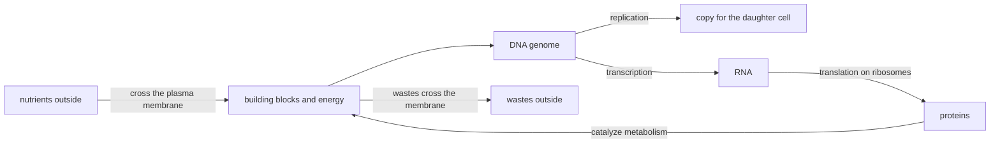

---
aliases:
  - Cells
  - Cell Theory
  - Cellule
  - Théorie cellulaire
tags:
  - type/concept
  - domain/biology
  - domain/bioinformatics
  - level/L1
  - level/L2
  - level/L3
mastery: 0
prerequisites:
  - "[[Lipid]]"
  - "[[Protein]]"
  - "[[Nucleotide]]"
related:
  - "[[Prokaryote]]"
  - "[[Eukaryote]]"
  - "[[Cell Membrane]]"
  - "[[Organelle]]"
  - "[[Microscopy]]"
  - "[[Ribosome]]"
  - "[[Central Dogma]]"
  - "[[Genome]]"
  - "[[Virus]]"
  - "[[Tree of Life]]"
  - "[[Cell Type]]"
  - "[[Single-Cell RNA Sequencing]]"
  - "[[Order-of-Magnitude Estimation]]"
  - "[[Poisson Distribution]]"
projects: []
sources:
  - "[[Biology 2e (OpenStax)]]"
  - "[[Molecular Biology of the Cell (Alberts)]]"
  - "[[Woese 1977 - Phylogenetic Structure of the Prokaryotic Domain]]"
  - "[[Physical Biology of the Cell (Phillips)]]"
  - "[[Gene Ontology]]"
  - "[[Anatomy and Physiology 2e (OpenStax)]]"
---

# Cell

> [!abstract]
> A cell is the smallest unit of life: a membrane-bounded drop of water in which a DNA genome is copied, read into RNA and translated by ribosomes into proteins. Every organism is one cell or many, and every cell comes from another cell.

## Definition

A **cell** is the basic structural and functional unit of living organisms: a compartment bounded by a plasma membrane that contains cytoplasm, a DNA genome and ribosomes, and that reproduces by growing and dividing.[^os41][^os42][^alberts1] The **cell theory** states that all living things are composed of one or more cells, that the cell is the basic unit of life, and that new cells arise from existing cells.[^os41]

## Why it matters

- **Every measurement is made on cells.** A bulk RNA or protein sample averages many cells; single-cell methods keep them apart. Reading either kind of data means knowing what a cell contains and how many molecules it holds ([[Transcriptomics]], [[Single-Cell RNA Sequencing]], [[Cell Type]]).
- **Shared machinery means comparable genes.** All cells store information in DNA and translate RNA into protein in the same way,[^alberts1] so the genes of this core machinery can be compared from bacteria to humans. Comparing ribosomal RNA across organisms is how the three primary lines of descent, today's three domains of life, were found ([[16S Ribosomal RNA]], [[Tree of Life]]).[^woese]
- **Location is an annotation.** The cellular component aspect of the Gene Ontology records *where* in the cell a gene product acts, next to its molecular function and biological process ([[Gene Ontology Annotation]]).[^go]
- **Small volumes mean small numbers.** In an *E. coli* cell, a concentration of 1 nM corresponds to about one molecule.[^pboc1] Counts per cell are therefore often small integers that vary by chance from cell to cell, which shapes single-cell data (Mathematical representation, Exercise 5).

## Core (L1)

### The cell theory

With few exceptions, cells cannot be seen with the naked eye; the cell theory grew with the microscope ([[Microscopy]]).[^os41]

- **1665.** In *Micrographia*, Robert Hooke called "cells" the box-like structures he saw in cork.[^os41]
- **1670s.** Antony van Leeuwenhoek, grinding his own lenses, discovered bacteria and protozoa.[^os41]
- **Late 1830s.** The botanist Matthias Schleiden and the zoologist Theodor Schwann proposed the unified cell theory; Rudolf Virchow later made important contributions to it.[^os41]

Its three statements:[^os41]

1. All living things are made of one or more cells.
2. The cell is the basic unit of life.
3. New cells arise from existing cells.

The third statement is the one bioinformatics uses most: every cell inherits its genome from a mother cell, so genomes form lineages that can be compared and arranged in trees ([[Phylogenetic Tree]]).

### What every cell shares

All cells have four components:[^os42]

| Component | What it is | What it does |
|---|---|---|
| Plasma membrane | a lipid bilayer with embedded proteins ([[Cell Membrane]]) | separates the inside from the environment and controls what crosses |
| Cytoplasm | the jelly-like cytosol and everything suspended in it | hosts metabolism and protein synthesis |
| DNA | the genetic material ([[DNA]], [[Genome]]) | stores the hereditary information, copied before division |
| Ribosomes | RNA-protein machines ([[Ribosome]]) | synthesize proteins |

Alberts lists the deeper "universal features" behind this table: every cell stores its hereditary information in DNA, copies it by templated polymerization, transcribes parts of it into RNA, translates RNA into protein in the same way, uses proteins as catalysts, needs free energy, builds itself from the same basic molecular building blocks, and is enclosed in a plasma membrane across which nutrients and wastes must pass.[^alberts1] In one picture, the [[Central Dogma]] running inside a membrane:



### Two cell plans, three domains

- **[[Prokaryote|Prokaryotic cells]]** have no nucleus and no membrane-bound organelles; their DNA lies in a region of the cytoplasm, the nucleoid. They measure 0.1 to 5.0 µm across.[^os42]
- **[[Eukaryote|Eukaryotic cells]]** keep their DNA in a nucleus and divide their cytoplasm into membrane-bound [[Organelle|organelles]]. They measure 10 to 100 µm.[^os42]

Prokaryotes are not one group. Comparing ribosomal RNA, Woese and Fox found three primary lines of descent: the typical bacteria, the archaebacteria (now **Archaea**), and the line leading to the cytoplasm of eukaryotic cells.[^woese] Two of the three domains of life are prokaryotic ([[Bacteria]], [[Archaea]], [[Tree of Life]]).

![[cell-size-scale.svg]]

### Why cells are small

Nutrients enter and wastes leave through the surface, but they are used and produced by the volume. As a cell grows, its volume grows faster than its surface, so its surface-area-to-volume ratio falls; a small cell exchanges material with its environment, and moves it inside itself, more easily than a large one.[^os42] The Mathematical representation turns this into a formula.

## Deeper (L2)

### One cell or many

Bacteria and yeasts live as single cells; a plant or an animal is a society of cells that divide the work between tissues ([[Tissue]]). All the cells of one individual carry essentially the same genome; they differ in which genes they express ([[Gene Expression]], [[Cell Differentiation]]).[^alberts]

### How little does a cell need?

The bacterium *Mycoplasma genitalium* lives with a genome of about 580 kb carrying 468 genes, evidence that a cell can work with fewer than 500 genes ([[Genome]]).[^alberts1]

### Borderline cases

- **Viruses are not cells.** They have no plasma membrane, no internal organelles and no metabolism of their own, and they do not divide: they multiply only inside a host cell, using its machinery ([[Virus]]).[^osvir]
- **Mitochondria are not cells either**, although they carry DNA and ribosomes: they arise only from preexisting mitochondria inside a eukaryotic cell, and most of their proteins are encoded in the nucleus ([[Mitochondrion]]).[^alberts14]
- **A cell can lose its genome.** Human red blood cells (erythrocytes) lose their nucleus as they mature;[^ap] they remain cells but can no longer divide.

## Advanced (L3)

- **Universal features imply common ancestry.** The shared machinery is the evidence that all present-day cells descend from a common ancestral cell.[^alberts1] Molecules present in every cell, with the same function everywhere, such as rRNA, can then be compared across all of life to reconstruct its history.[^woese]
- **Numbers, not concentrations.** Inside a bacterium-sized volume, 1 nM is about one molecule,[^pboc1] so low concentrations mean a few molecules. Molecule counts then behave like random draws: in the simplest model they follow a [[Poisson Distribution]], whose relative fluctuations shrink only as $1/\sqrt{\lambda}$ (Mathematical representation). This is why per-cell measurements are noisy and contain many zeros even when every cell has the same underlying expression level (Exercise 5).
- **The cell as a row of data.** Single-cell methods turn each cell into one row of a cell-by-gene count matrix ([[Single-Cell RNA Sequencing]]); deciding which rows are real, intact cells is [[Single-Cell Quality Control]], and naming them is [[Cell Type Annotation]].

## Mathematical representation

**Surface-to-volume ratio.** For a sphere of radius $r$, the surface is $S = 4\pi r^2$ and the volume $V = \frac{4}{3}\pi r^3$, so

$$\frac{S}{V} = \frac{3}{r}.$$

For any shape of linear size $L$, $S \propto L^2$ and $V \propto L^3$, so $S/V \propto 1/L$: doubling a cell's size halves the membrane available per unit of cytoplasm.

**From concentration to copy number.** A molar concentration $c$ (mol L⁻¹) in a volume $V$ (L) contains on average

$$\lambda = c\,V\,N_A$$

molecules, with $N_A = 6.022 \times 10^{23}$ mol⁻¹ (Avogadro constant) and $1\ \mu\mathrm{m}^3 = 10^{-15}$ L. For $V = 1\ \mu\mathrm{m}^3$ and $c = 1$ nM, $\lambda \approx 0.6$.

**Counting noise.** If each of many molecules is independently present in a given cell, the count $K$ is approximately Poisson with mean $\lambda$:

$$P(K = k) = \frac{e^{-\lambda}\lambda^k}{k!}, \qquad P(K = 0) = e^{-\lambda}, \qquad \mathrm{CV} = \frac{\sqrt{\mathrm{Var}(K)}}{\mathbb{E}[K]} = \frac{1}{\sqrt{\lambda}}.$$

A species with $\lambda = 0.6$ is absent from $e^{-0.6} \approx 55\%$ of cells; with $\lambda = 60$, the coefficient of variation (CV) is about 13%.

## Computational representation

Cells enter code as numbers: geometry, volumes and copy numbers (here), and rows of counts in single-cell matrices (Exercise 5).

```python
import math

N_A = 6.022e23  # Avogadro constant, per mol


def sphere(radius_um: float) -> tuple[float, float]:
    """Surface (um^2) and volume (um^3) of a sphere."""
    return 4 * math.pi * radius_um ** 2, 4 / 3 * math.pi * radius_um ** 3


def molecules(conc_molar: float, volume_um3: float) -> float:
    """Expected number of molecules at a molar concentration in a volume (1 um^3 = 1e-15 L)."""
    return conc_molar * volume_um3 * 1e-15 * N_A


for r in (0.5, 5.0, 50.0):                      # radius in um
    s, v = sphere(r)
    print(f"r = {r:4.1f} um   S/V = {s / v:4.2f} per um   V = {v:9.1f} um^3")

for name, vol in (("1 um^3 (bacterium-sized)", 1.0), ("20 um diameter cell", sphere(10.0)[1])):
    print(f"{name}: 1 nM = {molecules(1e-9, vol):.1f} molecules")
```

```text
r =  0.5 um   S/V = 6.00 per um   V =       0.5 um^3
r =  5.0 um   S/V = 0.60 per um   V =     523.6 um^3
r = 50.0 um   S/V = 0.06 per um   V =  523598.8 um^3
1 um^3 (bacterium-sized): 1 nM = 0.6 molecules
20 um diameter cell: 1 nM = 2522.5 molecules
```

A hundredfold increase in radius divides $S/V$ by 100 and multiplies the volume by a million.

## Worked example

> [!example] One protein at 10 nM, in two cells
> 1. **Bacterium-sized cell**, $V = 1\ \mu\mathrm{m}^3$: $\lambda = 10^{-8} \times 10^{-15} \times 6.022 \times 10^{23} \approx 6$ molecules.
> 2. **Eukaryotic cell**, a sphere of diameter 20 µm (within the 10 to 100 µm range): $V = \frac{4}{3}\pi\,10^3 \approx 4189\ \mu\mathrm{m}^3$, so $\lambda \approx 25{,}000$ molecules.
> 3. **Noise.** Under the Poisson model, the bacterial count has $\mathrm{CV} = 1/\sqrt{6} \approx 0.41$ and is zero in $e^{-6} \approx 0.25\%$ of cells; the eukaryotic count has $\mathrm{CV} \approx 0.006$.
> 4. **Reading.** The same concentration is a handful of molecules in one cell and tens of thousands in the other: "concentration" is an average that only makes sense when the count is large.

## Common misconceptions

> [!warning] "Every cell has a nucleus"
> Prokaryotic cells have none: their DNA lies in the nucleoid.[^os42] Some eukaryotic cells lose theirs, such as human red blood cells as they mature.[^ap]

> [!warning] "Viruses are the smallest cells"
> Viruses are not cells at all: no membrane-bounded cytoplasm, no metabolism of their own, no division.[^osvir]

> [!warning] "Cytoplasm and cytosol are the same thing"
> The cytoplasm is the whole region between the plasma membrane and the nucleus, organelles included; the cytosol is the gel-like fluid in which the organelles are suspended.[^os43]

## Exercises

> [!question] Exercise 1 (L1)
> State the three statements of the cell theory, then list the four components shared by all cells and say what would fail without each one.

> [!success]- Solution
> All living things are made of cells; the cell is the basic unit of life; cells arise from existing cells. Without a plasma membrane, nothing separates the cell from its environment; without cytoplasm, there is no medium for metabolism; without DNA, no hereditary information to copy and read; without ribosomes, no proteins, hence no enzymes.

> [!question] Exercise 2 (L1)
> Which of these are cells: an *E. coli* bacterium, an influenza virus particle, a yeast, a mature human red blood cell, a mitochondrion, a cell from a plant leaf? Which of the cells can divide?

> [!success]- Solution
> Cells: *E. coli*, the yeast, the red blood cell and the leaf cell. Not cells: the virus (no membrane-bounded cytoplasm or metabolism) and the mitochondrion (an organelle that arises only inside a eukaryotic cell). *E. coli*, the yeast and the leaf cell carry a genome and can divide; the mature red blood cell has lost its nucleus and cannot.

> [!question] Exercise 3 (L2)
> A spherical cell doubles its radius. By what factors do its surface, its volume and its surface-to-volume ratio change? Relate the answer to the size limit of cells.

> [!success]- Solution
> Surface $\times 4$, volume $\times 8$, $S/V \times \frac{1}{2}$. The volume, which consumes nutrients and makes wastes, grows twice as fast as the surface that exchanges them, so exchange per unit volume halves. Dividing restores a high $S/V$.

> [!question] Exercise 4 (L2)
> (a) What concentration corresponds to exactly one molecule in a volume of 1 µm³? (b) A transcription factor is present at 5 nM; how many copies are in a 1 µm³ bacterium and in a 20 µm diameter cell?

> [!success]- Solution
> (a) $c = 1/(V N_A) = 1/(10^{-15} \times 6.022 \times 10^{23}) \approx 1.66 \times 10^{-9}$ M, about 1.7 nM. (b) $5 \times 0.602 \approx 3$ copies in the bacterium; $5 \times 2522.5 \approx 12{,}600$ in the larger cell.

> [!question] Exercise 5 (L3, Python)
> Simulate 1,000 identical cells in which three invented genes have mean counts 0.6, 6 and 60. For each gene, compare the observed coefficient of variation and fraction of zero counts with the Poisson model, and explain what the zeros mean.

> [!success]- Solution
> ```python
> import math
> import random
>
>
> def poisson(mean: float, rng: random.Random) -> int:
>     """Poisson draw: number of unit-rate exponential arrivals before time `mean`."""
>     count, t = 0, rng.expovariate(1.0)
>     while t < mean:
>         count += 1
>         t += rng.expovariate(1.0)
>     return count
>
>
> rng = random.Random(1)
> means = {"gene_a": 0.6, "gene_b": 6.0, "gene_c": 60.0}      # invented, identical in every cell
> cells = [[poisson(m, rng) for m in means.values()] for _ in range(1000)]
> for j, (gene, m) in enumerate(means.items()):
>     col = [row[j] for row in cells]
>     mean = sum(col) / len(col)
>     sd = math.sqrt(sum((x - mean) ** 2 for x in col) / (len(col) - 1))
>     zeros = sum(x == 0 for x in col) / len(col)
>     print(f"{gene}: mean {mean:5.2f}  CV {sd / mean:.2f} (model {1 / math.sqrt(m):.2f})  "
>           f"zeros {zeros:.2f} (model {math.exp(-m):.2f})")
> print(cells[:4])
> ```
> Output:
> ```text
> gene_a: mean  0.63  CV 1.27 (model 1.29)  zeros 0.54 (model 0.55)
> gene_b: mean  5.93  CV 0.41 (model 0.41)  zeros 0.00 (model 0.00)
> gene_c: mean 59.62  CV 0.13 (model 0.13)  zeros 0.00 (model 0.00)
> [[1, 8, 63], [0, 4, 74], [0, 3, 54], [0, 4, 60]]
> ```
> Every simulated cell has the same expected expression, yet gene_a is absent from about half of them. A zero in a per-cell count is therefore not proof that a gene is off in that cell: at low means it is the expected outcome of sampling a few molecules. The rows of `cells` are a toy cell-by-gene matrix.

## Mastery checklist

- [ ] 1 Recognized: I can state the cell theory and name the four components every cell shares.
- [ ] 2 Understood: I can contrast prokaryotic and eukaryotic cells, explain why cells are small, and say why viruses are not cells.
- [ ] 3 Practiced: I can compute surface-to-volume ratios, copy numbers from concentrations and Poisson noise in code.
- [ ] 4 Applied: I estimated copy numbers for real proteins and related them to the zero counts of a real single-cell dataset.
- [ ] 5 Explained: I can teach why shared machinery implies common ancestry and why per-cell data are dominated by counting noise at low copy numbers.

## References

[^os41]: [[Biology 2e (OpenStax)]], section 4.1 "Studying Cells" (cells and the naked eye, history of the cell theory and its three statements).
[^os42]: [[Biology 2e (OpenStax)]], section 4.2 "Prokaryotic Cells" (the four components common to all cells, prokaryotic and eukaryotic cell sizes, surface-area-to-volume ratio).
[^os43]: [[Biology 2e (OpenStax)]], section 4.3 "Eukaryotic Cells" (cytoplasm and cytosol).
[^osvir]: [[Biology 2e (OpenStax)]], chapter "Viruses" (viruses as acellular entities that replicate only inside host cells).
[^alberts1]: [[Molecular Biology of the Cell (Alberts)]], 4th ed. (2002), ch. 1 "Cells and Genomes", sections "The Universal Features of Cells on Earth" and "The Diversity of Genomes and the Tree of Life" (Table 1-1, *Mycoplasma genitalium*).
[^alberts]: [[Molecular Biology of the Cell (Alberts)]], 4th ed. (2002), treatment of the constancy of the genome across the cells of an organism.
[^alberts14]: [[Molecular Biology of the Cell (Alberts)]], 4th ed. (2002), ch. 14 "Energy Conversion: Mitochondria and Chloroplasts" (growth and division of mitochondria, nuclear-encoded mitochondrial proteins).
[^woese]: [[Woese 1977 - Phylogenetic Structure of the Prokaryotic Domain]], *PNAS* 74:5088-5090.
[^pboc1]: [[Physical Biology of the Cell (Phillips)]], 2nd ed., ch. 1 "Why: Biology by the Numbers" (1 nM is about one molecule in an *E. coli* cell).
[^go]: [[Gene Ontology]], the three aspects of the ontology (molecular function, cellular component, biological process).
[^ap]: [[Anatomy and Physiology 2e (OpenStax)]], treatment of blood (erythrocytes).
