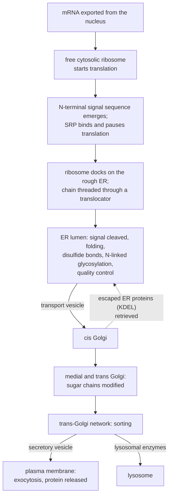

---
aliases:
  - Secretory Pathway
  - Endoplasmic Reticulum
  - ER
  - Rough ER
  - Golgi Apparatus
  - Golgi
  - Vesicular Transport
  - Système endomembranaire
tags:
  - type/concept
  - domain/biology
  - domain/bioinformatics
  - level/L1
  - level/L2
  - level/L3
mastery: 0
prerequisites:
  - "[[Organelle]]"
  - "[[Cell Membrane]]"
  - "[[Cell Nucleus]]"
  - "[[Ribosome]]"
  - "[[Translation]]"
related:
  - "[[Protein Targeting]]"
  - "[[Membrane Transport]]"
  - "[[Membrane Protein]]"
  - "[[Post-Translational Modification]]"
  - "[[Cytoskeleton]]"
  - "[[Cell Signaling]]"
  - "[[Mitochondrion]]"
projects: []
sources:
  - "[[Biology 2e (OpenStax)]]"
  - "[[Molecular Biology of the Cell (Alberts)]]"
  - "[[Molecular Cell Biology (Lodish)]]"
  - "[[Anatomy and Physiology 2e (OpenStax)]]"
---

# Endomembrane System

> [!abstract]
> The endomembrane system is the set of connected membrane compartments (endoplasmic reticulum, Golgi apparatus, vesicles, lysosomes, plasma membrane) through which a eukaryotic cell makes, modifies, sorts and ships proteins and lipids, for instance to secrete them.

## Definition

The **endomembrane system** is the group of membranes and membrane-bound compartments of a eukaryotic cell that exchange material, either through direct continuity or by transport vesicles: the nuclear envelope, the **endoplasmic reticulum** (ER), the **Golgi apparatus**, lysosomes, vesicles and vacuoles, and the plasma membrane. Mitochondria and chloroplasts are not part of it.[^os44] The **secretory pathway** is its outward route: ER → Golgi → vesicles → cell surface.[^alberts-vt]

## Why it matters

- **Signal peptides are sequence features.** Whether a protein enters this system is decided by a signal written in its own sequence, usually a hydrophobic stretch near the N-terminus.[^alberts12] Predicting signal peptides and membrane-spanning segments from sequence is a standard annotation step ([[Protein Targeting]], [[Membrane Protein]], [[Gene Annotation]]).
- **Modifications change what a mass spectrometer sees.** Proteins that pass through the ER and Golgi are glycosylated and often cleaved, so the mature protein differs from the translated [[Open Reading Frame]] ([[Post-Translational Modification]]).[^alberts12][^alberts-vt]
- **Glycosylation sites are motifs.** N-linked sugars are added only at Asn-X-Ser/Thr, a pattern that code can scan ([[Sequence Motif]]); only sites exposed in the ER lumen are used.[^alberts12]
- **Secreted proteins are what we measure in blood.** Hormones, antibodies and many diagnostic markers are secreted proteins made by this pathway ([[Proteomics]]).

## Core (L1)

**Follow one secreted protein**, from gene to outside the cell.[^alberts12][^alberts-vt][^os44]



1. **Start in the cytosol.** All proteins begin on cytosolic ribosomes. A protein bound for secretion has an **ER signal sequence**, a run of hydrophobic amino acids near its N-terminus.[^alberts12]
2. **Targeting to the ER.** As the signal emerges from the ribosome, the **signal-recognition particle** (SRP) binds it and slows translation, then docks the ribosome on an SRP receptor in the ER membrane. The growing chain is threaded through a protein translocator into the ER lumen while it is made (co-translational translocation). Ribosomes bound to the ER in this way make it look "rough".[^alberts12]
3. **In the ER.** A signal peptidase removes the signal sequence. The protein folds with the help of chaperones, forms disulfide bonds, and receives a preformed oligosaccharide on asparagine residues (N-linked glycosylation). Misfolded proteins are retained and eventually degraded.[^alberts12]
4. **To the Golgi.** Transport vesicles bud from the ER and fuse with the **cis** face of the Golgi, a stack of flattened cisternae. Proteins move through it toward the **trans** face while their sugar chains are trimmed and extended.[^alberts-vt][^os44]
5. **Sorting and secretion.** In the trans-Golgi network, proteins are sorted: lysosomal enzymes are tagged and sent to lysosomes, others go to the plasma membrane. **Constitutive secretion** releases proteins continuously; **regulated secretion** stores them in secretory vesicles until a signal triggers fusion with the plasma membrane (**exocytosis**).[^alberts-vt]

**The smooth ER** lacks bound ribosomes; it makes lipids and, in some cells, detoxifies compounds or stores calcium.[^os44]

## Deeper (L2)

### Topology: the lumen is "outside"

The lumen of the ER, Golgi and vesicles is topologically equivalent to the outside of the cell: once a protein has crossed the ER membrane, it never crosses another membrane on the secretory pathway, it only travels inside vesicles. When a vesicle fuses with the plasma membrane, its content is released outside, and a membrane protein's lumenal domain ends up facing the extracellular space.[^alberts12] Membrane proteins are inserted into the ER membrane during translation, their orientation fixed by hydrophobic signal and stop-transfer segments; a membrane-spanning α helix needs a hydrophobic stretch of roughly 20 amino acids ([[Membrane Protein]]).[^alberts12][^alberts]

### Sorting signals

The default route of a soluble protein that enters the ER is secretion. Staying or going elsewhere requires a signal:[^alberts-vt][^alberts12]

| Signal | Where | Effect |
|---|---|---|
| hydrophobic N-terminal signal sequence | N-terminus | entry into the ER |
| Lys-Asp-Glu-Leu (KDEL) | C-terminus of soluble ER proteins | retrieval from the Golgi back to the ER |
| mannose 6-phosphate (added in the Golgi) | sugar chain of lysosomal enzymes | delivery to lysosomes |
| Asn-X-Ser/Thr, X not Pro | anywhere in the lumenal part | site of N-linked glycosylation |

### How the route was discovered

Pulse-chase experiments labeled newly made proteins in pancreatic cells for a few minutes with a radioactive amino acid, then followed the label over time: it appeared first over the rough ER, then over the Golgi, then in secretory vesicles, and finally outside the cell.[^lodish] The Worked example models such an experiment.

### The reverse route

Cells also take material in: endocytic vesicles form from the plasma membrane and deliver their content to endosomes and lysosomes, where it is digested.[^alberts-vt][^os44]

## Advanced (L3)

- **From sequence to route.** Because the route is written in the sequence (signal sequence, transmembrane segments, KDEL, glycosylation sites),[^alberts12][^alberts-vt] much of it can be predicted from the protein sequence alone; [[Protein Targeting]] covers the predictors. A toy version is Exercise 5.
- **The annotated protein is not the mature protein.** The signal peptide is removed, and prohormones are further cleaved in secretory vesicles; insulin, for example, is made as a precursor (proinsulin) that is cut to the active hormone.[^alberts-vt][^lodish] Peptides identified in [[Bottom-Up Proteomics]] therefore never include the signal peptide of a secreted protein, and database entries annotate these processing events separately from the sequence.
- **Glycosylation is heterogeneous.** The Golgi modifies sugar chains step by step, so one protein exists as many glycoforms, which spreads its mass ([[Mass Spectrometry]], [[Post-Translational Modification]]).[^alberts-vt]
- **Membrane traffic needs tracks and motors.** Vesicles move along microtubules, pulled by motor proteins ([[Cytoskeleton]], [[Molecular Motor]]).[^alberts16]

## Mathematical representation

**The secretory pathway as a linear compartment chain.** A pulse of labeled protein passes through compartments $X_1$ (ER), $X_2$ (Golgi), $X_3$ (secretory vesicles), then leaves the cell. If each compartment is left at a first-order rate $k_j$ (per unit time), with all $k_j$ distinct and $X_1(0) = 1$:

$$\frac{dX_1}{dt} = -k_1 X_1, \qquad \frac{dX_j}{dt} = k_{j-1} X_{j-1} - k_j X_j \quad (j \ge 2).$$

The solution (Bateman's formula) is

$$X_j(t) = \Big(\prod_{i=1}^{j-1} k_i\Big) \sum_{i=1}^{j} \frac{e^{-k_i t}}{\prod_{m \le j,\, m \ne i} (k_m - k_i)},$$

and the secreted fraction is $1 - \sum_j X_j(t)$. For the Golgi, $X_2(t) = \frac{k_1}{k_2 - k_1}\left(e^{-k_1 t} - e^{-k_2 t}\right)$, which peaks at $t^* = \frac{\ln(k_2/k_1)}{k_2 - k_1}$ (set $dX_2/dt = 0$). This is the same mathematics as a chain of radioactive decays or a one-way [[Markov Chain]].

**Sequence rules as patterns.** The glycosylation site is the regular expression `N[^P][ST]` ([[Regular Expression]]); KDEL is a suffix test.

## Computational representation

Sequence features of the pathway, computed with toy rules on invented sequences (the hydrophobic set and the threshold of 7 are teaching choices, not a published predictor).

```python
import re

HYDROPHOBIC = set("AILMFVW")   # a toy set of strongly hydrophobic residues


def longest_hydrophobic_run(seq: str) -> int:
    best = run = 0
    for aa in seq:
        run = run + 1 if aa in HYDROPHOBIC else 0
        best = max(best, run)
    return best


def features(protein: str) -> dict:
    return {
        "er_signal_candidate": longest_hydrophobic_run(protein[:30]) >= 7,   # toy rule
        "kdel_retrieval": protein.endswith("KDEL"),
        "n_glyc_sequons": [m.start() + 1 for m in re.finditer(r"(?=N[^P][ST])", protein)],
    }


toy = {  # invented sequences
    "secreted": "MKLLVALLLAGSAFAQDNETLWKKNGTSPEQVNPSA",
    "er_resident": "MKVLLAFIVLGSAQAEDNKTWEPQRSGLKDEL",
    "cytosolic": "MSDKPEQTNGSEKRDLPEQANPTSGE",
}
for name, seq in toy.items():
    print(name, features(seq))
```

```text
secreted {'er_signal_candidate': True, 'kdel_retrieval': False, 'n_glyc_sequons': [18, 25]}
er_resident {'er_signal_candidate': True, 'kdel_retrieval': True, 'n_glyc_sequons': [18]}
cytosolic {'er_signal_candidate': False, 'kdel_retrieval': False, 'n_glyc_sequons': [9]}
```

`NPS` at position 33 of the secreted toy protein is not reported, because proline is excluded. The cytosolic protein has a sequon (`NGS`) that will never be glycosylated: it never enters the ER lumen.

## Worked example

> [!example] A pulse-chase experiment in numbers (invented rates)
> A pulse of labeled protein starts in the ER. Rates of exit (per minute): ER 0.10, Golgi 0.08, secretory vesicles 0.05.
> ```python
> import math
>
>
> def chain_amounts(rates: list[float], t: float) -> list[float]:
>     """Linear chain X1 -> X2 -> ... -> Xn -> out with distinct first-order rate constants.
>     Returns the fraction of a pulse in each compartment at time t, plus the fraction released."""
>     amounts = []
>     for j in range(len(rates)):
>         prefactor = math.prod(rates[:j])
>         total = 0.0
>         for i in range(j + 1):
>             denom = math.prod(rates[m] - rates[i] for m in range(j + 1) if m != i)
>             total += math.exp(-rates[i] * t) / denom
>         amounts.append(prefactor * total)
>     amounts = [x if abs(x) > 1e-12 else 0.0 for x in amounts]   # remove rounding noise
>     return amounts + [1 - sum(amounts)]
>
>
> rates = [0.10, 0.08, 0.05]   # invented, per minute: leave ER, leave Golgi, leave secretory vesicles
> print("t_min   ER   Golgi  vesicles  secreted")
> for t in (0, 10, 20, 40, 80, 160):
>     print(f"{t:5d}", " ".join(f"{x:6.2f}" for x in chain_amounts(rates, t)))
> ```
> ```text
> t_min   ER   Golgi  vesicles  secreted
>     0   1.00   0.00   0.00   0.00
>    10   0.37   0.41   0.19   0.04
>    20   0.14   0.33   0.35   0.18
>    40   0.02   0.11   0.32   0.54
>    80   0.00   0.01   0.08   0.91
>   160   0.00   0.00   0.00   1.00
> ```
> Read the table as the autoradiographs of the historical experiment: the label peaks in the ER at once, in the Golgi around 10 minutes ($t^* = \ln(0.8)/(-0.02) \approx 11.2$ min), in vesicles later, and accumulates outside. The order of the peaks reveals the order of the compartments.

## Common misconceptions

> [!warning] "Secretory proteins are made inside the ER"
> They are made by cytosolic ribosomes that attach to the ER membrane only while translating a protein with an ER signal sequence; the chain is threaded into the lumen as it grows.[^alberts12]

> [!warning] "The Golgi apparatus makes proteins"
> The Golgi modifies (mainly the sugar chains), sorts and packages proteins made on the rough ER.[^alberts-vt][^os44]

> [!warning] "Vesicles carry proteins across membranes"
> Cargo stays inside the lumen of vesicles and compartments; it crossed a membrane only once, when entering the ER.[^alberts12]

> [!warning] "Mitochondria belong to the endomembrane system"
> They do not exchange vesicles with it, and they import their proteins from the cytosol by a different mechanism ([[Mitochondrion#Deeper (L2)]]).[^os44][^alberts12]

## Exercises

> [!question] Exercise 1 (L1)
> Put in order the places visited by an antibody secreted by a plasma cell: Golgi, cytosolic ribosome, secretory vesicle, rough ER lumen, extracellular space, ER-Golgi transport vesicle.

> [!success]- Solution
> Cytosolic ribosome → rough ER lumen → ER-Golgi transport vesicle → Golgi → secretory vesicle → extracellular space.

> [!question] Exercise 2 (L1)
> A receptor has a domain in the ER lumen during its synthesis. On which side of the plasma membrane will that domain face once the receptor reaches the cell surface? Why?

> [!success]- Solution
> Outside the cell. The ER lumen is topologically equivalent to the extracellular space; the orientation set in the ER is kept through vesicle budding and fusion.

> [!question] Exercise 3 (L2)
> Predict the fate of: (a) a secreted protein whose signal sequence is deleted; (b) a secreted protein with KDEL added at its C-terminus; (c) a cytosolic protein given an N-terminal ER signal sequence; (d) a secreted glycoprotein whose Asn in `NGT` is replaced by Gln.

> [!success]- Solution
> (a) It stays in the cytosol. (b) It enters the ER and is retrieved from the Golgi back to the ER, so it accumulates there. (c) It enters the ER and, lacking other signals, is secreted by default. (d) It is still secreted but lacks the sugar chain at that site.

> [!question] Exercise 4 (L2)
> In the compartment model with $k_1 = 0.10$ and $k_2 = 0.08$ per minute, derive the time at which the Golgi holds the most label. What happens to $t^*$ if Golgi exit becomes much faster ($k_2 \to \infty$)?

> [!success]- Solution
> $dX_2/dt = \frac{k_1}{k_2 - k_1}(-k_1 e^{-k_1 t} + k_2 e^{-k_2 t}) = 0$ gives $t^* = \frac{\ln(k_2/k_1)}{k_2 - k_1} = \frac{\ln 0.8}{-0.02} \approx 11.2$ min. As $k_2 \to \infty$, $t^* \to 0$ and the peak height $\to 0$: a compartment that empties instantly is never seen to hold the label.

> [!question] Exercise 5 (L3, Python)
> Extend the toy rules: call a hydrophobic run of at least 7 residues within the first 30 positions an ER signal, and a run of at least 18 residues after position 30 a candidate transmembrane segment. Classify four invented sequences.

> [!success]- Solution
> ```python
> HYDROPHOBIC = set("AILMFVW")   # the same toy set as above
>
>
> def hydrophobic_runs(seq: str, min_len: int) -> list[tuple[int, int]]:
>     """1-based inclusive (start, end) of runs of at least min_len hydrophobic residues."""
>     runs, start = [], None
>     for i, aa in enumerate(seq + "*"):            # sentinel closes a final run
>         if aa in HYDROPHOBIC and start is None:
>             start = i
>         elif aa not in HYDROPHOBIC and start is not None:
>             if i - start >= min_len:
>                 runs.append((start + 1, i))
>             start = None
>     return runs
>
>
> def toy_route(seq: str) -> str:
>     n_terminal = [r for r in hydrophobic_runs(seq, 7) if r[0] <= 30]
>     internal = [r for r in hydrophobic_runs(seq, 18) if r[0] > 30]
>     if not n_terminal and not internal:
>         return "cytosol (no ER signal)"
>     if internal:
>         return "ER, then membrane (internal hydrophobic segment)"
>     return "ER lumen, then " + ("back to ER (KDEL)" if seq.endswith("KDEL") else "secretion")
>
>
> toy = {  # invented sequences
>     "A": "MKLLVALLLAGSAFAQDNETLWKKNGTSPEQVNPSA",
>     "B": "MKLLVALLLAGSAFAQDNETLWKKNGTSPEQVNPSAGSDEKLAVLIAFLVMWAILLVFLGRKRSEEDQTKPS",
>     "C": "MKVLLAFIVLGSAQAEDNKTWEPQRSGLKDEL",
>     "D": "MSDKPEQTNGSEKRDLPEQANPTSGE",
> }
> for name, seq in toy.items():
>     print(name, hydrophobic_runs(seq, 7), toy_route(seq))
> ```
> Output:
> ```text
> A [(3, 10)] ER lumen, then secretion
> B [(3, 10), (42, 59)] ER, then membrane (internal hydrophobic segment)
> C [(3, 10)] ER lumen, then back to ER (KDEL)
> D [] cytosol (no ER signal)
> ```
> B shows why real predictors must tell a cleavable N-terminal signal from a membrane-spanning segment: both are hydrophobic, and their position, length and flanking residues decide. The fixed thresholds here would misclassify many real proteins.

## Mastery checklist

- [ ] 1 Recognized: I can name the compartments of the endomembrane system and the route of a secreted protein.
- [ ] 2 Understood: I can explain co-translational targeting by SRP, topology, and the sorting signals of the table.
- [ ] 3 Practiced: I can solve the compartment model and scan sequences for signals and glycosylation sites in code.
- [ ] 4 Applied: I compared the database sequence of a real secreted protein with its mature form (signal peptide, glycosylation sites).
- [ ] 5 Explained: I can teach how the route is encoded in sequence, and why sequence-based predictions of route and modification can fail.

## References

[^os44]: [[Biology 2e (OpenStax)]], section 4.4 "The Endomembrane System and Proteins".
[^alberts12]: [[Molecular Biology of the Cell (Alberts)]], 4th ed. (2002), ch. 12 "Intracellular Compartments and Protein Sorting" (ER signal sequences, SRP, co-translational translocation, signal peptidase, N-linked glycosylation at Asn-X-Ser/Thr, ER quality control, insertion and topology of membrane proteins, KDEL, import into mitochondria).
[^alberts-vt]: [[Molecular Biology of the Cell (Alberts)]], 4th ed. (2002), treatment of vesicular traffic in the secretory and endocytic pathways (ER-to-Golgi transport, retrieval, the Golgi cisternae, lysosomal sorting by mannose 6-phosphate, constitutive and regulated secretion, proteolytic processing in secretory vesicles, endocytosis).
[^alberts]: [[Molecular Biology of the Cell (Alberts)]], 4th ed. (2002), treatment of membrane proteins (membrane-spanning α helices).
[^alberts16]: [[Molecular Biology of the Cell (Alberts)]], 4th ed. (2002), ch. 16 "The Cytoskeleton" (motor proteins moving membrane organelles along microtubules).
[^lodish]: [[Molecular Cell Biology (Lodish)]], 4th ed. (2000), treatment of protein secretion (pulse-chase labeling of pancreatic secretory cells, processing of proinsulin).
