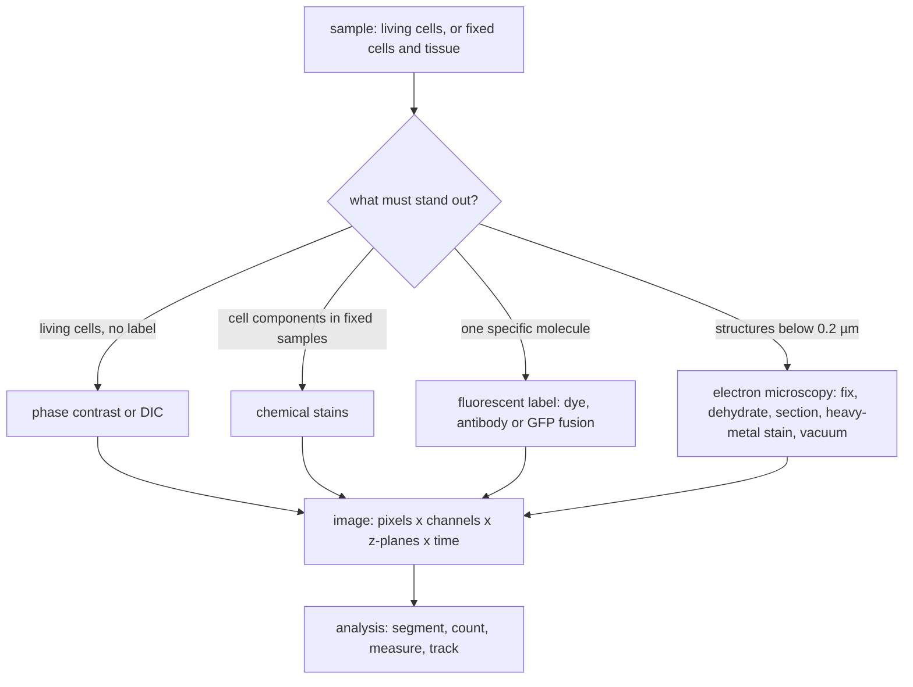

---
aliases:
  - Light Microscopy
  - Electron Microscopy
  - Light Microscope
  - Electron Microscope
  - Transmission Electron Microscopy
  - Scanning Electron Microscopy
  - Microscopie
tags:
  - type/technique
  - domain/biology
  - domain/physics
  - level/L1
  - level/L2
mastery: 0
prerequisites:
  - "[[Cell]]"
  - "[[Electromagnetic Wave]]"
related:
  - "[[Diffraction]]"
  - "[[Diffraction Limit]]"
  - "[[Fluorescence]]"
  - "[[Fluorescence Microscopy]]"
  - "[[Confocal Microscopy]]"
  - "[[Super-Resolution Microscopy]]"
  - "[[Cryo-Electron Microscopy]]"
  - "[[Organelle]]"
  - "[[Connected Component]]"
  - "[[Spatial Transcriptomics]]"
projects: []
sources:
  - "[[Biology 2e (OpenStax)]]"
  - "[[Molecular Biology of the Cell (Alberts)]]"
  - "[[University Physics (OpenStax)]]"
  - "[[Watson 1953 - Molecular Structure of Nucleic Acids]]"
  - "[[NobelPrize.org]]"
---

# Microscopy

> [!abstract]
> Microscopy makes cells and their parts visible by forming a magnified image of them. What it can show is limited by resolution, the smallest separation it can distinguish, and by contrast, whether a structure stands out from what surrounds it.

## Purpose

What does a cell look like, where is a given structure or molecule inside it, and how does it change over time? With few exceptions cells cannot be seen with the naked eye,[^os41] and most of their parts are smaller still. The microscope made the cell theory possible ([[Cell]]) and remains the direct way to look at cell structure.

## Why it matters

- **Size decides the instrument.** Structures larger than about 0.2 µm, such as nuclei and mitochondria, can be resolved with light; membranes and macromolecular complexes need electrons.[^alberts-mic]
- **Fluorescence links a gene to a place.** A fluorescent protein fused to a protein of interest shows where the product of a gene goes in a living cell,[^alberts-mic] the kind of evidence behind localization annotations and the predictors trained on them ([[Gene Ontology Annotation]], [[Protein Targeting]]).
- **Images are data.** A micrograph is an array of numbers: counting, segmenting and measuring objects in it is computation (Analysis below), with the same graph algorithms used elsewhere in bioinformatics ([[Connected Component]]).
- **Electrons also give structures.** Electron microscopy of frozen, unstained macromolecules, combined over many images, yields three-dimensional reconstructions ([[Cryo-Electron Microscopy]]).[^alberts-mic]

## Principle

### Magnification is not resolution (L1)

**Magnification** enlarges the image; **resolution** (resolving power) is the ability to show two adjacent structures as separate.[^os41] Light is a wave and is diffracted by the opening of the lens: the image of a point is not a point but a small bright disk surrounded by faint rings, the Airy pattern ([[Diffraction]]).[^up] Two points closer than the width of that disk blur into one, however much the image is magnified. The limit of resolution is

$$d = \frac{0.61\,\lambda}{n\sin\theta} = \frac{0.61\,\lambda}{\mathrm{NA}},$$

where $\lambda$ is the wavelength of the light, $n$ the refractive index of the medium between specimen and objective lens (air or immersion oil), $\theta$ half the angular width of the cone of rays collected by the objective, and $\mathrm{NA} = n\sin\theta$ its **numerical aperture**.[^alberts-mic] With violet light ($\lambda = 0.4$ µm) and $\mathrm{NA} = 1.4$, $d$ is just under 0.2 µm: the practical limit of light microscopy.[^alberts-mic]

![[rayleigh-resolution-profiles.svg]]

By the Rayleigh criterion, two points are just resolved when the center of one diffraction pattern falls on the first dark ring of the other.[^up] At that separation the recorded intensity dips to about 74% between the two peaks; closer, the dip vanishes (computed in the L2 section below).

### Contrast (L1)

Most cell components are nearly transparent and colorless, so an unprocessed image shows little.[^os41][^alberts-mic] Three remedies:

1. **Stains.** Dyes bind particular components of fixed specimens; staining usually kills the cells.[^os41][^alberts-mic]
2. **Optical contrast.** Phase-contrast and differential-interference-contrast (DIC) microscopes turn small differences in refractive index between cell parts into differences in brightness, so living, unstained cells can be watched.[^alberts-mic]
3. **Fluorescence.** A fluorescent molecule absorbs light of one wavelength and emits light of a longer wavelength; filters pass only the emitted light, so labeled molecules glow on a dark background. Labels are fluorescent dyes, antibodies coupled to dyes, or fluorescent proteins such as GFP fused to a protein of interest ([[Fluorescence]], [[Fluorescence Microscopy]]). A confocal microscope rejects out-of-focus light to record sharp optical sections ([[Confocal Microscopy]]).[^alberts-mic]

### Electrons instead of light (L1)

An electron microscope forms its image with a beam of electrons, whose wavelength is far shorter than that of light: about 0.004 nm at an accelerating voltage of 100,000 V, for a theoretical resolution near 0.002 nm.[^alberts-mic] Lens aberrations limit real instruments to about 0.1 nm, and specimen preparation, contrast and radiation damage limit biological objects to about 2 nm, still about 100 times better than light.[^alberts-mic]

- **No living cells.** The electron beam needs a vacuum, so specimens are fixed, dehydrated and usually stained with heavy metals: the cells are dead.[^os41][^alberts-mic]
- **Transmission EM (TEM)** sends the beam through a thin section and shows internal structures; **scanning EM (SEM)** scans the beam over a surface and shows its relief.[^os41][^alberts-mic]

![[cell-size-scale.svg]]

Figure values: cell sizes,[^os42] mitochondria,[^alberts14] membrane thickness,[^os51] DNA width,[^watson] wavelengths and resolution limits.[^alberts-mic]

### What each method can and cannot show (L1)

| Method | Resolution | Living cells? | Can show | Cannot show |
|---|---|---|---|---|
| Bright-field, stained | about 0.2 µm | no | cells, nuclei, tissue organization | unstained components; details closer than 0.2 µm |
| Phase contrast, DIC | about 0.2 µm | yes | living cells moving and dividing, nuclei, large organelles | which molecules are where |
| Fluorescence, confocal | about 0.2 µm | yes, with fluorescent proteins | where a labeled molecule is and how it moves; several labels in different colors | unlabeled structures; two labeled molecules closer than about 0.2 µm |
| TEM | about 2 nm on biological samples | no | membranes, ribosomes, the inside of organelles | dynamics; which molecule is which, without a specific label |
| SEM | surface detail | no | cell surfaces and shapes | interiors |

(Values and properties from the sections above.[^os41][^alberts-mic]) Fluorescence methods that beat the 0.2 µm limit are covered under History and variants.

### The numbers behind the Rayleigh limit (L2)

Fraunhofer diffraction by a circular aperture gives the intensity of the Airy pattern at radius $r$ from the image of a point (derivation in [[Diffraction Limit]]):

$$I(v) = I_0\left[\frac{2 J_1(v)}{v}\right]^2, \qquad v = \frac{2\pi\,\mathrm{NA}\,r}{\lambda},$$

where $J_1$ is the Bessel function of the first kind of order 1 and $I_0$ the central intensity. The first dark ring is the first zero of $J_1$, $v_0 = 3.8317$, at $r = \frac{3.8317}{2\pi}\frac{\lambda}{\mathrm{NA}} = 0.61\,\frac{\lambda}{\mathrm{NA}}$: the Rayleigh distance. Two points at that distance give, at their midpoint, $2 I(v_0/2)$:

```python
import math


def rayleigh_um(wavelength_um: float, na: float) -> float:
    """Smallest resolvable separation in um: d = 0.61 * wavelength / NA."""
    return 0.61 * wavelength_um / na


def bessel_j1(x: float, terms: int = 40) -> float:
    """Bessel function J1 from its power series (accurate for the small arguments used here)."""
    return sum((-1) ** m / (math.factorial(m) * math.factorial(m + 1)) * (x / 2) ** (2 * m + 1)
               for m in range(terms))


def airy(v: float) -> float:
    """Normalized Airy intensity [2 J1(v) / v]^2, with v in optical units."""
    return 1.0 if v == 0 else (2 * bessel_j1(v) / v) ** 2


for lam in (0.40, 0.55):                       # wavelength in um
    print(lam, [round(rayleigh_um(lam, na), 2) for na in (0.25, 0.95, 1.40)])

V0 = 3.8317                                    # first zero of J1: the first dark ring
print(round(V0 / (2 * math.pi), 3))            # its radius in units of wavelength / NA
for sep in (1.5, 1.0, 0.5):                    # separation in units of the Rayleigh distance
    xs = [i / 100 for i in range(-600, 601)]
    profile = [airy(abs(x - sep * V0 / 2)) + airy(abs(x + sep * V0 / 2)) for x in xs]
    print(sep, round(profile[600] / max(profile), 3))
```

```text
0.4 [0.98, 0.26, 0.17]
0.55 [1.34, 0.35, 0.24]
0.61
1.5 0.142
1.0 0.735
0.5 1.0
```

A low-aperture objective (NA 0.25) resolves only about 1 µm; an oil objective (NA 1.4) reaches 0.17 to 0.24 µm. The midpoint-to-peak ratio is 0.14 at 1.5 $d$, 0.735 at $d$, and 1.0 at $0.5\,d$, where the two points form a single peak.

## Protocol overview



## Data produced

- **Arrays of intensities.** A digital micrograph is a two-dimensional array of pixel values. Fluorescence adds one channel per label, optical sections add z-planes and time-lapse adds time points, so one experiment is a five-dimensional array (time, channel, z, y, x).
- **Size.** Data volume multiplies along every axis. With an illustrative camera of 2048 × 2048 pixels at 16 bits, one image is 8 MiB; 3 channels × 20 z-planes × 100 time points make 6,000 images, about 47 GiB.
- **Error profile.** Blur set by the resolution limit, noise, uneven background, and fading of fluorophores under illumination (photobleaching, which is also used on purpose to measure diffusion in membranes);[^alberts-mem] for electron micrographs, artifacts of fixation, dehydration and staining.[^alberts-mic]
- **Pixel size versus resolution.** Pixels much larger than $d$ waste the optics; pixels much smaller than $d$ add data but no detail.

## Analysis

The usual chain is: correct the background, **segment** (separate object pixels from background, for example with a threshold), **label** connected groups of object pixels as objects, then **measure** them (count, area, intensity, shape) and, for movies, track them. Labeling is a [[Connected Component]] search on the grid of pixels:

```python
# Invented 8-bit fluorescence image (pixel intensities); pixel size 0.2 um (illustrative).
IMAGE = [
    [10, 12, 11, 10, 9, 10, 11, 10, 12, 10],
    [11, 180, 200, 15, 10, 12, 10, 160, 170, 11],
    [12, 190, 210, 14, 11, 10, 12, 175, 165, 10],
    [10, 14, 13, 12, 10, 11, 10, 12, 150, 12],
    [11, 10, 12, 10, 140, 150, 12, 11, 10, 10],
    [10, 11, 10, 12, 145, 160, 13, 10, 11, 12],
]
PIXEL_UM = 0.2


def label_objects(image: list[list[int]], threshold: int) -> list[list[tuple[int, int]]]:
    """Threshold the image, then group foreground pixels into 4-connected objects."""
    rows, cols = len(image), len(image[0])
    seen, objects = set(), []
    for r in range(rows):
        for c in range(cols):
            if image[r][c] < threshold or (r, c) in seen:
                continue
            stack, pixels = [(r, c)], []
            seen.add((r, c))
            while stack:                                   # flood fill from (r, c)
                y, x = stack.pop()
                pixels.append((y, x))
                for ny, nx in ((y + 1, x), (y - 1, x), (y, x + 1), (y, x - 1)):
                    if (0 <= ny < rows and 0 <= nx < cols and (ny, nx) not in seen
                            and image[ny][nx] >= threshold):
                        seen.add((ny, nx))
                        stack.append((ny, nx))
            objects.append(pixels)
    return objects


for threshold in (100, 155):
    objects = label_objects(IMAGE, threshold)
    print(threshold, len(objects), [round(len(p) * PIXEL_UM ** 2, 2) for p in objects])
```

```text
100 3 [0.16, 0.2, 0.16]
155 3 [0.16, 0.16, 0.04]
```

The count is stable but the areas are not: the dimmer third object shrinks from 0.16 to 0.04 µm² when the threshold rises. Measured sizes depend on segmentation choices, and objects closer than the resolution limit merge into one component whatever the threshold.

## Worked example

> [!example] Can I see it, and with what?
> Take $d \approx 0.2$ µm for light and about 2 nm for electrons on biological samples.[^alberts-mic]
> 1. **Two mitochondria 1 µm apart**, each 0.5 to 1 µm wide:[^alberts14] 1 µm > 0.2 µm, so light resolves them, in living cells with a fluorescent label.
> 2. **The thickness of the plasma membrane**, 5 to 10 nm:[^os51] far below 0.2 µm, so light shows only a boundary line; well above 2 nm, so TEM resolves it.
> 3. **The DNA double helix**, about 2 nm wide, with 0.34 nm between base pairs:[^watson] its width is at the limit for biological EM; single base pairs are beyond it.
> 4. **Two GFP-labeled proteins 50 nm apart in a living cell.** Light detects their glow but shows one spot (50 nm < 200 nm); EM could resolve 50 nm but not in a living cell. This gap is what super-resolution fluorescence methods were built for.[^nobel]

## Limitations and biases

> [!warning] Diffraction sets a floor
> Light cannot resolve details closer than about 0.2 µm, whatever the magnification.[^alberts-mic]

> [!warning] Preparation changes the specimen
> Fixation, dehydration, sectioning and staining show dead, altered material; electron microscopy never shows a living cell.[^os41][^alberts-mic]

> [!warning] A label is not the molecule
> Fluorescence reports where the dye, antibody or fusion tag is. Whether a tagged protein goes where the untagged one goes is a claim to check, not an assumption.

> [!warning] An image is a sample
> A few fields of view, chosen by eye, at one time point, may not represent the whole population of cells ([[Experimental Design]]).

## Common misconceptions

> [!warning] "More magnification shows more detail"
> Beyond the resolution limit, magnifying only enlarges the blur. A 2,000× image taken with NA 0.25 shows less detail than a 400× image taken with NA 1.4.

> [!warning] "If I can see a single molecule glow, light microscopy resolves molecules"
> Detecting is not resolving. One fluorescent molecule appears as a diffraction-limited spot about 0.2 µm wide, and two molecules closer than that merge into one spot (Principle, L2).

> [!warning] "Electron microscopy is better in every way"
> It resolves about 100 times finer,[^alberts-mic] but its specimens are dead,[^os41] and without a specific label it does not say which molecule is which.

## History and variants

- **1665 and 1670s.** Hooke names "cells" in cork; van Leeuwenhoek discovers bacteria and protozoa with his own lenses.[^os41]
- **Light microscopy variants.** Phase contrast and DIC for living cells; fluorescence with dyes, antibodies and GFP; confocal optical sectioning ([[Confocal Microscopy]]).[^alberts-mic]
- **Electron microscopy variants.** TEM and SEM; cryo-electron microscopy of frozen macromolecules ([[Cryo-Electron Microscopy]]).[^alberts-mic][^os41]
- **Beyond the diffraction limit.** Optical microscopy was long held unable to resolve better than half the wavelength of light. Stimulated emission depletion (STED, Hell, 2000) and single-molecule methods (Betzig and Moerner) circumvent this limit with fluorescent molecules, work recognized by the 2014 Nobel Prize in Chemistry ([[Super-Resolution Microscopy]]).[^nobel]

## Exercises

> [!question] Exercise 1 (L1)
> Two particles 0.1 µm apart are imaged at 1,500× with an oil objective of NA 1.4 in green light ($\lambda = 0.55$ µm). Are they seen as two? Would a higher magnification help?

> [!success]- Solution
> $d = 0.61 \times 0.55 / 1.4 \approx 0.24$ µm $> 0.1$ µm: one blurred spot. More magnification enlarges that spot without separating it; only a shorter wavelength, a higher NA, electrons or a super-resolution method can.

> [!question] Exercise 2 (L1)
> Choose a method for each task: (a) follow a living cell through division; (b) find which organelle holds protein X in living cells; (c) see the bilayer of the plasma membrane; (d) image the shapes of bacteria on a surface; (e) reconstruct the 3D shape of a purified ribosome.

> [!success]- Solution
> (a) Phase contrast or DIC. (b) Fluorescence with a GFP fusion, plus a marker of a known organelle in another color. (c) TEM: 5 to 10 nm is far below the light limit. (d) SEM. (e) Cryo-electron microscopy of many frozen particles combined into a 3D reconstruction.

> [!question] Exercise 3 (L2)
> Explain the 74% dip at the Rayleigh separation from the Airy formula. What is $I(v_0/2)$, and why is the total at each source position equal to 1?

> [!success]- Solution
> At the midpoint each pattern is evaluated at $v_0/2 \approx 1.916$, where $I \approx 0.368$ (half of the printed 0.735), so the sum is about 0.735. At each source, one pattern contributes its maximum, 1, and the other contributes $I(v_0) = 0$, since $v_0$ is a zero of $J_1$. Hence the ratio 0.735, the 74% of the figure.

> [!question] Exercise 4 (L2, Python)
> Using `label_objects` and `IMAGE` from the Analysis section, count the objects and their sizes in pixels for thresholds from 100 to 200 in steps of 20. Over which range is the result stable, and what does that say about reporting a cell count?

> [!success]- Solution
> ```python
> for threshold in range(100, 201, 20):
>     objects = label_objects(IMAGE, threshold)
>     print(threshold, len(objects), [len(p) for p in objects])
> ```
> Output:
> ```text
> 100 3 [4, 5, 4]
> 120 3 [4, 5, 4]
> 140 3 [4, 5, 4]
> 160 3 [4, 4, 1]
> 180 1 [4]
> 200 1 [2]
> ```
> The count is stable from 100 to 140, where the threshold sits between background (about 10) and the dimmest object pixels (140); sizes start to shrink at 160 and two objects vanish at 180. A count is only meaningful with its segmentation parameters, and a robust analysis checks that conclusions survive a range of thresholds. The neighbourhood rule is a second such choice: with diagonal (8-) connectivity, two objects touching at a corner become one.

## Mastery checklist

- [ ] 1 Recognized: I can name what light, fluorescence and electron microscopes measure, and their resolution limits.
- [ ] 2 Understood: I can explain resolution with the Rayleigh criterion and the three ways to create contrast.
- [ ] 3 Practiced: I can compute $d$ for an objective and segment and count objects in an image in code.
- [ ] 4 Applied: I processed a real multichannel image stack (segmentation, counts, intensities) and reported my threshold and connectivity choices.
- [ ] 5 Explained: I can choose a method for a question and explain its artifacts, and when super-resolution or electron microscopy is needed.

## References

[^os41]: [[Biology 2e (OpenStax)]], section 4.1 "Studying Cells" (cells and the naked eye, magnification and resolving power, light microscopes and staining, electron microscopes, scanning and transmission EM, Hooke and van Leeuwenhoek).
[^os42]: [[Biology 2e (OpenStax)]], section 4.2 "Prokaryotic Cells" (sizes of prokaryotic and eukaryotic cells).
[^os51]: [[Biology 2e (OpenStax)]], section 5.1 "Components and Structure" (thickness of the plasma membrane).
[^alberts-mic]: [[Molecular Biology of the Cell (Alberts)]], 4th ed. (2002), treatment of microscopy (the resolution limit $0.61\lambda/(n\sin\theta)$ and the 0.2 µm limit of light microscopes, the wavelengths of visible light, phase-contrast and DIC microscopy, staining, fluorescence microscopy with antibodies and GFP, confocal microscopy, electron wavelength and resolution, specimen preparation, scanning EM, cryoelectron microscopy and 3D reconstruction).
[^alberts-mem]: [[Molecular Biology of the Cell (Alberts)]], 4th ed. (2002), treatment of membrane structure (fluorescence recovery after photobleaching).
[^alberts14]: [[Molecular Biology of the Cell (Alberts)]], 4th ed. (2002), ch. 14 "Energy Conversion: Mitochondria and Chloroplasts" (mitochondria as elongated cylinders 0.5 to 1 µm in diameter).
[^up]: [[University Physics (OpenStax)]], Volume 3, Unit 1 "Optics" (diffraction by a circular aperture, the Airy disk, the Rayleigh criterion).
[^watson]: [[Watson 1953 - Molecular Structure of Nucleic Acids]], *Nature* (helix diameter about 20 Å, 3.4 Å between base pairs).
[^nobel]: [[NobelPrize.org]], press release of the Nobel Prize in Chemistry 2014 (super-resolved fluorescence microscopy).
