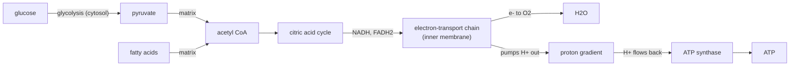

---
aliases:
  - Mitochondria
  - Mitochondrial Matrix
  - Cristae
  - Mitochondrie
tags:
  - type/concept
  - domain/biology
  - domain/bioinformatics
  - level/L1
  - level/L2
  - level/L3
mastery: 0
prerequisites:
  - "[[Organelle]]"
  - "[[Eukaryote]]"
  - "[[Cell Membrane]]"
  - "[[ATP]]"
  - "[[Genome]]"
related:
  - "[[Mitochondrial DNA]]"
  - "[[Oxidative Phosphorylation]]"
  - "[[Citric Acid Cycle]]"
  - "[[Glycolysis]]"
  - "[[Membrane Potential]]"
  - "[[Genetic Code]]"
  - "[[Protein Targeting]]"
  - "[[Apoptosis]]"
  - "[[Cell Nucleus]]"
  - "[[Bacteria]]"
  - "[[Sequencing Coverage]]"
projects: []
sources:
  - "[[Biology 2e (OpenStax)]]"
  - "[[Molecular Biology of the Cell (Alberts)]]"
  - "[[Anderson 1981 - Sequence and Organization of the Human Mitochondrial Genome]]"
  - "[[NCBI Genetic Codes]]"
  - "[[HTS Format Specifications]]"
---

# Mitochondrion

> [!abstract]
> A mitochondrion is a double-membrane organelle that converts the energy of food molecules into ATP, and it still carries a small genome of its own, the trace of its origin as a bacterium living inside another cell.

## Definition

**Mitochondria** are organelles of most eukaryotic cells, bounded by an outer and a highly folded inner membrane, in which the oxidation of sugars and fats is coupled to the synthesis of [[ATP]] (cellular respiration). They contain their own DNA and ribosomes, grow and divide from preexisting mitochondria, and are thought to descend from bacteria engulfed by an ancestral eukaryotic cell (endosymbiosis).[^os4][^alberts14]

## Why it matters

- **A second genome in every dataset.** A eukaryotic genome includes the DNA of its mitochondria as well as the nuclear chromosomes,[^alberts14] and variant files hold mitochondrial calls next to nuclear ones ([[Genome]], [[Mitochondrial DNA]]).[^hts]
- **A different codon table.** Vertebrate mitochondrial genes must be translated with NCBI table 2, in which UGA is Trp and AGA/AGG are stops ([[Genetic Code]]).[^ncbi]
- **A different ploidy model.** The VCF specification writes mitochondrial genotypes as haploid calls,[^hts] yet a cell holds many mtDNA copies that need not be identical, so variant fractions, not diploid genotypes, describe them (Exercise 5).
- **Copy number shows up as coverage.** Because each cell carries many mtDNA copies, mitochondrial reads have much higher depth than nuclear reads, and the depth ratio estimates copies per cell ([[Sequencing Coverage]], Mathematical representation).
- **Localization prediction.** Most mitochondrial proteins are encoded in the nucleus and imported thanks to an N-terminal signal, which sequence-based predictors look for ([[Protein Targeting]]).[^alberts12]

## Core (L1)

![[mitochondrion-structure.svg]]

**Two membranes, two compartments.** The **outer membrane** contains channel proteins (porins) and is permeable to small molecules; the **inner membrane** is impermeable to ions and is folded into **cristae**, which greatly increase its area. They delimit the **intermembrane space** and the innermost **matrix**.[^alberts14][^os4]

**Energy conversion, in three steps.**[^alberts14][^os-u2]

1. In the cytosol, glycolysis splits glucose into pyruvate ([[Glycolysis]]).
2. In the matrix, pyruvate and fatty acids are oxidized to CO₂; the [[Citric Acid Cycle|citric acid cycle]] transfers their high-energy electrons to the carriers NADH and FADH₂.
3. In the inner membrane, the electron-transport chain passes these electrons to O₂, forming water, and uses the energy released to pump protons (H⁺) out of the matrix. Protons flowing back in through **ATP synthase** drive the synthesis of ATP from ADP and phosphate. This coupling through a proton gradient is **chemiosmosis** ([[Oxidative Phosphorylation]]).



**Its own small genome.** Mitochondria contain DNA, usually several copies per organelle, plus their own ribosomes and tRNAs.[^alberts14] The human mitochondrial genome, sequenced in 1981, is a 16,569 bp molecule with 37 genes: 2 rRNAs, 22 tRNAs and 13 protein-coding genes.[^anderson] The 13 proteins are subunits of the respiratory chain and ATP synthase; all other mitochondrial proteins, the large majority, are encoded in the [[Cell Nucleus|nucleus]], made in the cytosol and imported.[^alberts14]

**Endosymbiotic origin.** The evidence that mitochondria descend from free-living bacteria:[^alberts14]

- they have their own genome and their own protein-synthesis machinery, with ribosomes that resemble bacterial ones;
- they are never made from scratch: they grow and divide, like bacteria;
- their genes are related to bacterial genes.

Over evolution, most genes of the ancestral bacterium were lost or moved to the nuclear genome, leaving the small genomes seen today.[^alberts14]

## Deeper (L2)

### The proton-motive force

The gradient across the inner membrane has two components: an electrical potential (the matrix is negative) and a pH difference (the matrix is more alkaline). Both push protons back into the matrix, and together they form the **proton-motive force** that ATP synthase converts into chemical bond energy ([[Membrane Potential]]).[^alberts14] ATP synthase is a rotary machine: proton flow turns part of the enzyme, and the rotation drives ATP synthesis.[^alberts14] The Mathematical representation turns the two components into one number.

### A genetic system of its own

- **Compact genome.** Human mtDNA has almost no noncoding sequence between genes, uses a reduced set of 22 tRNAs, and reads some codons differently from the nuclear code.[^alberts14][^anderson] NCBI table 2 lists the vertebrate mitochondrial differences.[^ncbi]
- **Non-Mendelian inheritance.** Mitochondria are passed on through the cytoplasm, not by meiosis; in humans and many other organisms, mitochondrial genes are inherited from the mother ([[Mendelian Inheritance]]).[^alberts14]
- **Mixtures of genomes.** A cell holds many mtDNA copies, which can differ; the proportions can drift as organelles divide and are shared out at cell division ([[Mitochondrial DNA]]).[^alberts14]

### Protein import

Proteins destined for the matrix are made in the cytosol with an N-terminal **signal sequence** that forms an amphipathic helix. Translocator complexes in the outer and inner membranes recognize it; the protein crosses both membranes **unfolded**, and the signal is usually cleaved in the matrix.[^alberts12] Import into the nucleus, by contrast, takes folded proteins ([[Cell Nucleus#Deeper (L2)]]).

### More than ATP

Mitochondria also take part in the decision to die: in the intrinsic pathway of [[Apoptosis]], proteins such as cytochrome c released from the intermembrane space activate the cell's death program.[^alberts17]

## Advanced (L3)

- **Gene transfer shaped two genomes.** Because genes moved from the mitochondrion to the nucleus during evolution, different eukaryotic lineages keep different gene sets in their mitochondria.[^alberts14] Nuclear-encoded mitochondrial proteins are found by sequence signals and homology, not by looking in mtDNA.
- **Reads from a circular, high-copy genome.** Positions on mtDNA live on a circle, so a feature can cross the numbering origin ([[Genomic Coordinate System]]). High copy number gives very deep coverage, so low-frequency variants are measurable; conversely, a depth ratio well above the nuclear one is expected, not an artifact (Mathematical representation).
- **Heteroplasmy is a fraction.** When a cell's mtDNA copies differ,[^alberts14] a mitochondrial variant is described by the fraction of copies that carry it, and that fraction can differ between cells and samples (Exercise 5). A diploid caller, which expects allele fractions near 0, 0.5 or 1 ([[Ploidy]]), misreads such data; mitochondrial variant analysis is its own task ([[Mitochondrial DNA]], [[Variant Calling]]).
- **Organelle genomes as markers.** Because it is inherited through the mother only,[^alberts14] human mtDNA follows maternal lineages, a property that [[Molecular Evolution]] and [[Human Evolution]] studies can exploit.

## Mathematical representation

**Proton-motive force.** Let $\Delta\psi$ be the magnitude of the membrane potential across the inner membrane (matrix negative, in volts) and $\Delta\mathrm{pH} = \mathrm{pH}_{\mathrm{matrix}} - \mathrm{pH}_{\mathrm{IMS}} > 0$. The free energy released when one mole of protons returns to the matrix is

$$\Delta G = -\left(F\,\Delta\psi + 2.303\,RT\,\Delta\mathrm{pH}\right) = -F\,\Delta p, \qquad \Delta p = \Delta\psi + \frac{2.303\,RT}{F}\,\Delta\mathrm{pH},$$

where $F = 96{,}485$ C mol⁻¹ is the Faraday constant, $R = 8.314$ J mol⁻¹ K⁻¹ the gas constant and $T$ the absolute temperature. At $T = 310$ K, $2.303\,RT/F \approx 61.5$ mV: one pH unit is worth about 61.5 mV of potential. The two terms are the electrical and the chemical parts of the gradient described in L2 ([[Membrane Potential]], [[Gibbs Free Energy]]).

**Copies per cell from coverage.** If the nuclear genome is diploid, sequencing depth is proportional to copy number, and $\bar d_{\mathrm{nuc}}$ and $\bar d_{\mathrm{mt}}$ are the mean depths on autosomes and on mtDNA, then

$$c_{\mathrm{mt}} \approx 2\,\frac{\bar d_{\mathrm{mt}}}{\bar d_{\mathrm{nuc}}}$$

mtDNA copies per cell (average over the sampled cells). The heteroplasmy fraction at a site is $h = a / (a + r)$, with $a$ and $r$ the counts of reads carrying the alternative and reference base.

## Computational representation

In files, the mitochondrial genome is one more named sequence next to the chromosomes (for humans a circle of 16,569 bp).[^anderson] The snippet computes a proton-motive force with illustrative (not measured) values, and copy number and heteroplasmy from invented read depths.

```python
import math

R, F = 8.314, 96485.0          # gas constant J/(mol K), Faraday constant C/mol


def proton_motive_force(delta_psi_mV: float, delta_pH: float, T: float = 310.0) -> float:
    """Driving force in mV for a proton entering the matrix.
    delta_psi_mV: magnitude of the membrane potential (matrix negative);
    delta_pH: pH(matrix) - pH(intermembrane space), positive when the matrix is more alkaline."""
    return delta_psi_mV + 1000 * math.log(10) * R * T / F * delta_pH


def free_energy_per_proton(pmf_mV: float) -> float:
    """kJ released per mole of protons flowing back into the matrix."""
    return -F * pmf_mV / 1000 / 1000


def mtdna_copies_per_cell(depth_mt: float, depth_autosomal: float, autosome_copies: int = 2) -> float:
    """Copies of mtDNA per cell from mean read depths (diploid nuclear genome by default)."""
    return autosome_copies * depth_mt / depth_autosomal


pmf = proton_motive_force(delta_psi_mV=150, delta_pH=0.8)      # illustrative values
print(round(1000 * math.log(10) * R * 310 / F, 1), "mV per pH unit at 37 C")
print(round(pmf, 1), "mV;", round(free_energy_per_proton(pmf), 1), "kJ/mol H+")
print(mtdna_copies_per_cell(depth_mt=6000, depth_autosomal=30))  # invented depths
print(round(1200 / 6000, 2))                                    # alt fraction at one chrM site
```

```text
61.5 mV per pH unit at 37 C
199.2 mV; -19.2 kJ/mol H+
400.0
0.2
```

## Worked example

> [!example] One whole-genome sample, two genomes (invented numbers)
> A human blood sample is sequenced to a mean depth of 30× on the autosomes; the mitochondrial contig has a mean depth of 6,000×.
> 1. **Copy number.** $c_{\mathrm{mt}} \approx 2 \times 6000 / 30 = 400$ copies per cell on average.
> 2. **A variant.** At one mitochondrial position, 1,200 of 6,000 reads carry the alternative base: $h = 0.2$.
> 3. **Interpretation.** On an autosome, 20% of reads would suggest an artifact or contamination, since a diploid genotype predicts 0, 50% or 100%. On mtDNA it is a plausible heteroplasmy: about one copy in five carries the variant.
> 4. **Translation.** If the position lies in a protein-coding gene, its effect must be predicted with table 2, not table 1 ([[Genetic Code]]).[^ncbi]

## Common misconceptions

> [!warning] "Mitochondria produce energy"
> Energy is not created; mitochondria convert the chemical energy of food molecules into the energy of ATP bonds, through an intermediate proton gradient.[^alberts14]

> [!warning] "Mitochondrial proteins are encoded by mitochondrial DNA"
> Human mtDNA encodes only 13 proteins.[^anderson] Most mitochondrial proteins are nuclear-encoded and imported.[^alberts14]

> [!warning] "mtDNA behaves like one more chromosome"
> It is present in many copies per cell, inherited through the cytoplasm (maternally in humans), not shared out by meiosis, and its copies can differ within a cell.[^alberts14]

> [!warning] "The inner membrane is folded to hold more DNA"
> The cristae increase the area of the membrane that carries the electron-transport chain and ATP synthase; mtDNA sits in the matrix.[^alberts14]

## Exercises

> [!question] Exercise 1 (L1)
> Give the cell compartment of each step: glycolysis, citric acid cycle, electron transport, ATP synthesis by ATP synthase, transcription of mtDNA.

> [!success]- Solution
> Glycolysis: cytosol. Citric acid cycle: matrix. Electron transport: inner membrane. ATP synthase: inner membrane (catalytic head facing the matrix). mtDNA transcription: matrix, where mtDNA lies.

> [!question] Exercise 2 (L1)
> List three observations that support the endosymbiotic origin of mitochondria.

> [!success]- Solution
> Mitochondria have their own DNA and ribosomes (resembling bacterial ones); they arise only by growth and division of preexisting mitochondria; their genes are related to bacterial genes.

> [!question] Exercise 3 (L2)
> With $\Delta\psi = 150$ mV and $\Delta\mathrm{pH} = 0.8$ (illustrative values) at 37 °C, compute $\Delta p$ and $\Delta G$ per mole of protons. What fraction of the force is electrical?

> [!success]- Solution
> $\Delta p = 150 + 61.5 \times 0.8 = 199.2$ mV; $\Delta G = -96{,}485 \times 0.1992$ J/mol $\approx -19.2$ kJ/mol. Electrical share: $150 / 199.2 \approx 75\%$.

> [!question] Exercise 4 (L3)
> A gene annotation pipeline predicts a nuclear gene's start codon 30 codons too far downstream. Explain why the predicted protein may be classified as cytosolic although the real protein works in the matrix.

> [!success]- Solution
> Matrix proteins are imported thanks to an N-terminal signal sequence.[^alberts12] A start codon placed 30 codons too late removes the first 30 residues, which is where that signal lies. The predictor sees no targeting signal and calls the protein cytosolic: localization predictions are only as good as the gene model's N-terminus.

> [!question] Exercise 5 (L3, Python)
> Two invented samples from one person give autosomal depth, mitochondrial depth and read counts at one mitochondrial site: blood (32×, 3,200×, 2,890 ref and 310 alt) and muscle (28×, 9,800×, 6,370 ref and 3,430 alt). Compute copies per cell and the variant fraction with an approximate 95% interval ($p \pm 1.96\sqrt{p(1-p)/n}$), and interpret.

> [!success]- Solution
> ```python
> from math import sqrt
>
> samples = {  # invented: mean autosomal depth, mean chrM depth, (ref, alt) reads at one chrM site
>     "blood": (32, 3200, (2890, 310)),
>     "muscle": (28, 9800, (6370, 3430)),
> }
> for name, (d_auto, d_mt, (ref, alt)) in samples.items():
>     n = ref + alt
>     p = alt / n
>     half = 1.96 * sqrt(p * (1 - p) / n)          # normal approximation to the binomial
>     print(name, round(2 * d_mt / d_auto), round(p, 3), (round(p - half, 3), round(p + half, 3)))
> ```
> Output:
> ```text
> blood 200 0.097 (0.087, 0.107)
> muscle 700 0.35 (0.341, 0.359)
> ```
> Copy number differs between tissues, and so does the variant fraction; the two intervals do not overlap. One person, one mtDNA variant, two heteroplasmy levels: a single diploid genotype could not describe this.

## Mastery checklist

- [ ] 1 Recognized: I can draw a mitochondrion with its two membranes, cristae, matrix and DNA.
- [ ] 2 Understood: I can explain chemiosmosis, the endosymbiotic evidence and why most mitochondrial proteins are imported.
- [ ] 3 Practiced: I can compute a proton-motive force, a copy number from depths and a heteroplasmy fraction.
- [ ] 4 Applied: on a real BAM file I compared chrM and autosomal depth, and translated a mitochondrial gene with table 2.
- [ ] 5 Explained: I can teach why mtDNA breaks the assumptions of diploid, Mendelian, standard-code analyses.

## References

[^os4]: [[Biology 2e (OpenStax)]], ch. 4 "Cell Structure" (mitochondria: double membrane, cristae, matrix, own DNA and ribosomes).
[^os-u2]: [[Biology 2e (OpenStax)]], Unit 2 "The Cell" (cellular respiration: glycolysis, citric acid cycle, oxidative phosphorylation).
[^alberts14]: [[Molecular Biology of the Cell (Alberts)]], 4th ed. (2002), ch. 14 "Energy Conversion: Mitochondria and Chloroplasts" (membranes and compartments, chemiosmotic coupling and the proton-motive force, ATP synthase, the genetic systems of mitochondria, their bacterial origin, growth and division, and cytoplasmic inheritance).
[^alberts12]: [[Molecular Biology of the Cell (Alberts)]], 4th ed. (2002), ch. 12 "Intracellular Compartments and Protein Sorting" (import of proteins into mitochondria).
[^alberts17]: [[Molecular Biology of the Cell (Alberts)]], 4th ed. (2002), ch. 17 "The Cell Cycle and Programmed Cell Death" (release of cytochrome c in apoptosis).
[^anderson]: [[Anderson 1981 - Sequence and Organization of the Human Mitochondrial Genome]], *Nature* 290:457-465.
[^ncbi]: [[NCBI Genetic Codes]], translation table 2 (vertebrate mitochondrial code).
[^hts]: [[HTS Format Specifications]], VCF specification, genotype field `GT` (haploid calls on the mitochondrion).
