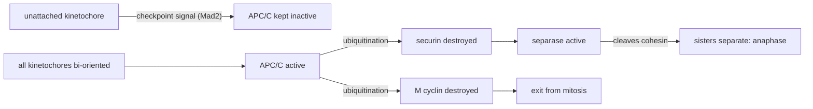

---
aliases:
  - Mitose
  - Mitotic Spindle
  - Kinetochore
  - Prophase
  - Prometaphase
  - Metaphase
  - Anaphase
  - Telophase
  - Cytokinesis
tags:
  - type/concept
  - domain/biology
  - domain/bioinformatics
  - level/L1
  - level/L2
  - level/L3
mastery: 0
prerequisites:
  - "[[Cell Cycle]]"
  - "[[Chromosome]]"
  - "[[DNA Replication]]"
  - "[[Cytoskeleton]]"
related:
  - "[[Meiosis]]"
  - "[[Cell Nucleus]]"
  - "[[Ploidy]]"
  - "[[Mutation]]"
  - "[[Somatic Mutation]]"
  - "[[Copy Number Variation]]"
  - "[[Cancer]]"
  - "[[Tumor Suppressor Gene]]"
  - "[[Phylogenetic Tree]]"
  - "[[Prokaryote]]"
projects: []
sources:
  - "[[Biology 2e (OpenStax)]]"
  - "[[Molecular Biology of the Cell (Alberts)]]"
  - "[[The Cell (Cooper)]]"
---

# Mitosis

> [!abstract]
> Mitosis is the division of a eukaryotic nucleus in which the two copies of every chromosome made in S phase are pulled to opposite poles, so that each daughter cell receives one complete set, identical to the mother cell's.

## Definition

**Mitosis** is the division of the nucleus during M phase: the replicated chromosomes, each made of two **sister chromatids**, are separated by the **mitotic spindle** into two daughter nuclei with the same number and kind of chromosomes as the parent nucleus. It is usually followed by **cytokinesis**, the division of the cytoplasm.[^os10][^alberts18] Somatic cell cycles therefore produce diploid daughter cells with identical genetic complements, whereas [[Meiosis]] halves the chromosome number.[^cooper]

## Why it matters

- **"One genome per person" rests on it.** Sequencing one sample to represent a person assumes that the person's cells share one genome, because they descend from the zygote by mitosis. The exceptions, new mutations made at each division and chromosomes gained or lost, are what [[Somatic Mutation]] analysis and [[Somatic Variant Calling]] look for (L3).
- **Cancer genomes record mitotic errors.** Many cancer cells carry abnormal numbers of chromosomes,[^alberts-cancer] which appear as whole-chromosome or arm-level gains and losses in copy-number profiles ([[Copy Number Variation]], [[Cancer]]).
- **Karyotypes are mitotic.** Chromosomes are most condensed during mitosis, and the human karyotype is the display of the 46 chromosomes at mitosis ([[Chromosome]]).[^alberts4]
- **Cell lineages are trees.** Each division is a branching point, so mutations shared by cells reveal their common ancestry: reconstructing lineages from single-cell genomes is phylogenetics applied to cells ([[Phylogenetic Tree]], Exercise 5).

## Core (L1)

![[mitosis-stages.svg]]

**Before mitosis.** During S phase each chromosome was replicated into two identical sister chromatids, held together along their length by cohesin proteins, and the centrosome was duplicated ([[Cell Cycle]]).[^alberts17][^alberts18]

**The stages.**[^os10][^alberts18]

1. **Prophase.** Chromosomes condense into compact, visible structures. The two centrosomes move apart and the mitotic spindle starts to assemble between them.
2. **Prometaphase.** The nuclear envelope breaks down ([[Cell Nucleus#Deeper (L2)]]). Spindle microtubules capture the chromosomes at their **kinetochores**, protein complexes assembled on the centromere of each sister chromatid.
3. **Metaphase.** Chromosomes line up at the equator of the spindle, the **metaphase plate**, the two sister kinetochores of each chromosome attached to opposite poles.
4. **Anaphase.** Cohesion between sisters is released all at once; the sister chromatids, now independent chromosomes, are pulled to opposite poles, and the poles move apart.
5. **Telophase.** A nuclear envelope reassembles around each set of chromosomes, which decondense.
6. **Cytokinesis.** In animal cells a contractile ring of actin and myosin pinches the cell in two ([[Cytoskeleton]]); in plant cells, vesicles from the Golgi apparatus fuse at the former metaphase plate into a cell plate, the future cell wall ([[Endomembrane System]]).

**Counting through mitosis** (human cell; chromosomes are counted by centromeres, see [[Chromosome#Worked example]]):

| Stage | Chromosomes | Chromatids | DNA |
|---|---:|---:|---:|
| G1 | 46 | 46 | 2C |
| G2, prophase, metaphase | 46 | 92 | 4C |
| anaphase (whole cell) | 92 | 92 | 4C |
| each daughter, back in G1 | 46 | 46 | 2C |

### Why the daughters are genetically identical

1. **Copying.** Each sister chromatid was made by replicating the same DNA molecule, with about one error per 10⁹ nucleotides after proofreading and mismatch repair ([[DNA Replication]]).[^alberts-rep]
2. **Pairing of the copies.** Cohesion keeps the two sisters together until anaphase, so the cell keeps track of which two chromatids are copies of each other.[^alberts17]
3. **Bi-orientation.** The two sister kinetochores attach to opposite spindle poles, so at anaphase each pole receives exactly one chromatid of every chromosome.[^alberts18]
4. **Checking.** The spindle checkpoint delays anaphase until every chromosome is attached this way ([[Cell Cycle]]).[^alberts17]
5. **Homologs act independently.** In mitosis homologous chromosomes line up individually, not in pairs.[^os11] Each is copied and split on its own, so both daughters keep the maternal and the paternal homolog of every pair, and a heterozygous genotype stays heterozygous (Worked example).

The result: each daughter receives the chromosome set the mother cell had before replication.[^cooper]

## Deeper (L2)

### The spindle

Three classes of microtubules build the spindle: **kinetochore microtubules** attach the chromosomes, **interpolar microtubules** overlap at the equator and push the poles apart, and **astral microtubules** radiate toward the cell cortex and position the spindle.[^alberts18] Segregation has two parts: in **anaphase A**, kinetochore microtubules shorten and pull the chromatids to the poles; in **anaphase B**, the poles themselves move apart, driven by motor proteins acting on interpolar and astral microtubules ([[Molecular Motor]]).[^alberts18]

### The anaphase switch

Cohesin rings link the sisters from S phase onward. **Separase** cleaves cohesin, but it is held inactive by **securin**. When every kinetochore is attached, the APC/C ubiquitinates securin, which is destroyed; separase is released and cuts cohesin, and all sisters separate at once. Unattached kinetochores generate a signal, involving the protein Mad2, that keeps the APC/C off: this is the spindle checkpoint.[^alberts17]



### Correcting wrong attachments

A correctly bi-oriented chromosome is pulled toward both poles, which puts its kinetochores under tension; tension stabilizes their attachments, while attachments that produce no tension, such as both sisters bound to one pole, are released and tried again.[^alberts18]

### Variations

Plant cells have no centrosomes yet build a spindle, and divide their cytoplasm with a cell plate.[^os45][^os10] Prokaryotes do not undergo mitosis: they divide by binary fission ([[Prokaryote]]).[^os10]

## Advanced (L3)

- **Nearly identical.** With about one error per 10⁹ nucleotides copied[^alberts-rep] and 3.2 × 10⁹ nucleotides per haploid human genome,[^alberts4] each daughter inherits on average about 6 new replication errors (Mathematical representation). Over the many divisions from zygote to adult, the cells of a body become a mosaic of slightly different genomes, the origin of somatic mutations ([[Somatic Mutation]], [[Mutation Rate]]).
- **Lineages from mutations.** A mutation that arises in one cell is inherited by all its descendants and by no other cell, so the sets of cells sharing mutations are nested or disjoint, like clades of a tree. In a tumor, mutations present in every cancer cell were already in its founder cell ([[Cancer]], Exercise 5).
- **Missegregation.** A chromosome whose sisters go to the same pole leaves one daughter with three copies and the other with one; repeated errors produce aneuploid lineages, common in cancer.[^alberts-cancer] Read-depth profiles reveal these gains and losses ([[Copy Number Variation]]).
- **Loss of heterozygosity.** In a cell with one mutant copy of a tumor suppressor gene, the normal copy can be lost by missegregation, by mitotic recombination or by deletion, leaving no functional copy: a classic second hit ([[Tumor Suppressor Gene]]).[^alberts-cancer]
- **Failed cytokinesis doubles ploidy.** If mitosis is completed but cytokinesis fails, one cell holds two nuclei and twice the chromosome sets, a route to tetraploid cells ([[Ploidy]]).

## Mathematical representation

- **A cell as a multiset of chromosomes.** Write a diploid G1 cell as $P = \{C_1^{m}, C_1^{p}, \dots, C_n^{m}, C_n^{p}\}$, the maternal ($m$) and paternal ($p$) homolog of each of the $n$ chromosome pairs ($n = 23$ in humans). Replication maps each $C$ to a pair of sisters $(C, C')$, with $C' = C$ if copying is perfect. Mitosis gives one sister of each pair to each daughter, so the daughters are $D_1 = D_2 = P$, whichever sister goes where.
- **Errors per division.** Replication makes one new strand for every old one, and each daughter receives, for every chromosome, a double helix with one old and one new strand: $L = 2 \times 3.2 \times 10^9 = 6.4 \times 10^9$ newly made nucleotides. With independent errors at rate $\mu$, the number of new errors in a daughter is $E \sim \mathrm{Binomial}(L, \mu) \approx \mathrm{Poisson}(\lambda = L\mu)$ ([[Poisson Distribution]]). For $\mu = 10^{-9}$, $\lambda = 6.4$ and $P(E = 0) = e^{-6.4} \approx 0.0017$: practically no division is error-free at the nucleotide level.
- **Missegregation.** If each of the $2n$ chromosomes missegregates independently with probability $p$ per division, a division is error-free with probability $(1 - p)^{2n}$, and a lineage of $g$ divisions stays euploid with probability $(1 - p)^{2ng} \approx e^{-2npg}$.
- **Lineages as trees.** Each division doubles the number of cells, so at least $\log_2 N$ rounds of division separate the zygote from a body of $N$ cells. A mutation's carrier set is a clade: two carrier sets $A$ and $B$ fit one tree only if $A \subseteq B$, $B \subseteq A$ or $A \cap B = \emptyset$.

## Computational representation

A cell is a list of (chromosome, sequence) pairs. The simulation replicates every chromosome, sends one sister to each daughter, and optionally adds replication errors and missegregation, at rates exaggerated so that they appear in a small toy genome.

```python
import random
from collections import Counter

BASES = "ACGT"


def replicate(seq: str, mu: float, rng: random.Random) -> tuple[str, str]:
    """Two sister chromatids. Toy error model: each new copy carries substitutions at rate mu."""
    def copy() -> str:
        if mu == 0:
            return seq
        return "".join(rng.choice(BASES.replace(b, "")) if rng.random() < mu else b for b in seq)
    return copy(), copy()


def mitosis(cell: list[tuple[str, str]], mu: float, p_mis: float, rng: random.Random):
    """cell: list of (chromosome name, sequence). Replicate, then give one sister of each
    chromosome to each daughter; with probability p_mis both sisters go to the same daughter."""
    d1, d2 = [], []
    for name, seq in cell:
        s1, s2 = replicate(seq, mu, rng)
        if rng.random() < p_mis:
            rng.choice([d1, d2]).extend([(name, s1), (name, s2)])
        else:
            d1.append((name, s1))
            d2.append((name, s2))
    return d1, d2


def substitutions(mother, daughter) -> int:
    """Differences between corresponding chromosomes of two euploid cells (same order)."""
    return sum(a != b for (_, s), (_, t) in zip(mother, daughter) for a, b in zip(s, t))


rng = random.Random(5)
# Invented toy diploid cell: two chromosome pairs (m = maternal, p = paternal homolog), 500 bp each.
cell = [(f"chr{c}{h}", "".join(rng.choice(BASES) for _ in range(500))) for c in (1, 2) for h in "mp"]

d1, d2 = mitosis(cell, mu=0.0, p_mis=0.0, rng=rng)
print("perfect division, daughters identical to the mother:", d1 == cell and d2 == cell)

mu = 1e-3                                  # exaggerated error rate, so that errors are visible
errors = [substitutions(cell, mitosis(cell, mu, 0.0, rng)[0]) for _ in range(5000)]
print(f"new errors per daughter: mean {sum(errors) / len(errors):.2f}, expected {mu * 2000:.2f}")

p = 0.02                                   # exaggerated missegregation rate per chromosome
names = Counter(name for name, _ in cell)
aneuploid = sum(Counter(n for n, _ in mitosis(cell, 0.0, p, rng)[0]) != names for _ in range(20_000))
print(f"aneuploid divisions: {aneuploid / 20_000:.4f}, expected {1 - (1 - p) ** len(cell):.4f}")
```

```text
perfect division, daughters identical to the mother: True
new errors per daughter: mean 2.00, expected 2.00
aneuploid divisions: 0.0751, expected 0.0776
```

Both simulated rates agree with the formulas within sampling error (for the last one, about $\pm 0.002$).

## Worked example

> [!example] A heterozygous locus through mitosis
> A cell is heterozygous `A`/`a` at a locus on chromosome 7: `A` on the maternal homolog, `a` on the paternal one.
> 1. **G1.** Two copies of the locus: `A` (maternal chromosome 7) and `a` (paternal chromosome 7).
> 2. **After S phase.** Four copies: `A` on both sisters of the maternal homolog, `a` on both sisters of the paternal homolog.
> 3. **Metaphase.** The two homologs sit on the plate independently, each with its sisters facing opposite poles.
> 4. **Anaphase.** Each pole receives one `A` chromatid and one `a` chromatid.
> 5. **Daughters.** Both are `A`/`a`, like the mother. In meiosis I, by contrast, the two homologs separate, `A` to one cell and `a` to the other ([[Meiosis]]).

## Common misconceptions

> [!warning] "Homologous chromosomes pair up in mitosis"
> They line up individually; pairing of homologs is specific to meiosis.[^os11]

> [!warning] "Mitosis halves the chromosome number"
> Mitosis keeps it: 46 chromosomes before, 46 in each daughter. Halving is the job of meiosis.[^cooper]

> [!warning] "Mitosis and cell division are the same thing"
> Mitosis divides the nucleus; cytokinesis divides the cytoplasm, a separate process.[^os10] When cytokinesis fails, one cell ends up with two nuclei.

> [!warning] "The daughters are perfectly identical"
> Nearly. Each daughter carries a handful of new replication errors, and chromosomes occasionally missegregate (Mathematical representation).

## Exercises

> [!question] Exercise 1 (L1)
> Put in order and name the stage of each event: (a) sister chromatids are pulled to opposite poles; (b) nuclear envelopes reassemble; (c) chromosomes condense; (d) the nuclear envelope breaks down and kinetochores are captured; (e) chromosomes are aligned at the equator; (f) a contractile ring pinches the cell.

> [!success]- Solution
> (c) prophase → (d) prometaphase → (e) metaphase → (a) anaphase → (b) telophase → (f) cytokinesis.

> [!question] Exercise 2 (L1)
> An invented species has $2n = 6$. Give the numbers of chromosomes, chromatids and DNA content (in C) in G1, at metaphase, at anaphase (whole cell) and in each daughter.

> [!success]- Solution
> G1: 6 chromosomes, 6 chromatids, 2C. Metaphase: 6, 12, 4C. Anaphase: 12, 12, 4C, since separated sisters count as chromosomes. Each daughter: 6, 6, 2C.

> [!question] Exercise 3 (L2)
> Predict the outcome: (a) a spindle poison prevents kinetochores from being attached; (b) cohesin is lost prematurely in G2; (c) cytokinesis fails after a normal mitosis; (d) both sister kinetochores of one chromosome stay attached to the same pole.

> [!success]- Solution
> (a) The checkpoint keeps the APC/C off, so cells arrest before anaphase. (b) Sisters are no longer held as pairs and cannot be reliably bi-oriented, so chromosomes segregate at random and daughters become aneuploid. (c) One cell with two nuclei and twice the normal DNA: a tetraploid cell. (d) Both chromatids go to one daughter: one daughter is trisomic ($2n + 1$), the other monosomic ($2n - 1$) for that chromosome.

> [!question] Exercise 4 (L2)
> Assume an illustrative missegregation probability $p = 10^{-3}$ per chromosome per division in a human cell ($2n = 46$). Compute the probability (a) that one division is error-free; (b) that a lineage of 40 divisions has no error. (c) What value of $p$ would keep (b) at 0.99 or more?

> [!success]- Solution
> (a) $(1 - 10^{-3})^{46} \approx 0.955$. (b) $0.955^{40} = (1 - 10^{-3})^{1840} \approx 0.159$, close to $e^{-1.84}$. (c) $(1 - p)^{1840} \ge 0.99$ gives $p \le 1 - 0.99^{1/1840} \approx 5.5 \times 10^{-6}$. Long lineages amplify small per-division error rates, which is why a checkpoint that catches single errors matters.

> [!question] Exercise 5 (L3, Python)
> Six somatic mutations were found in five single cells (invented data below). Check that the carrier sets fit a division tree, write the tree in Newick format, then add a mutation `m7` found in cells `c2` and `c4` and list the mutations it conflicts with.

> [!success]- Solution
> ```python
> cells = ["c1", "c2", "c3", "c4", "c5"]
> mutations = {  # invented somatic mutations: the single cells in which each one was found
>     "m1": {"c1", "c2", "c3", "c4", "c5"},
>     "m2": {"c1", "c2", "c3"},
>     "m3": {"c1", "c2"},
>     "m4": {"c4", "c5"},
>     "m5": {"c3"},
>     "m6": {"c5"},
> }
>
>
> def compatible(a: set, b: set) -> bool:
>     """Two mutations fit one division tree if their carrier sets are nested or disjoint."""
>     return a <= b or b <= a or not (a & b)
>
>
> def newick(group: frozenset, clades: set) -> str:
>     """Children of a group: its largest proper sub-clades, plus cells in none of them."""
>     inside = [c for c in clades if c < group]
>     top = [c for c in inside if not any(c < d for d in inside)]
>     covered = set().union(*top)
>     parts = sorted([newick(c, clades) for c in top] + list(group - covered))
>     return parts[0] if len(parts) == 1 else "(" + ",".join(parts) + ")"
>
>
> clades = {frozenset(s) for s in mutations.values()}
> print(all(compatible(a, b) for a in clades for b in clades))
> print(newick(frozenset(cells), clades) + ";")
> mutations["m7"] = {"c2", "c4"}
> print([m for m in mutations if not compatible(mutations[m], mutations["m7"])])
> ```
> ```text
> True
> (((c1,c2),c3),(c4,c5));
> ['m2', 'm3', 'm4']
> ```
> `m1` is in every cell: it arose in their common ancestor. `m2` and `m3` mark successive divisions of one branch, `m4` the other branch, and `m5`, `m6` single cells. `m7` cannot be placed on this tree: it is a sequencing or genotyping error, a mutation that arose twice, or a mutation lost from some cells (for example by a deletion). Real lineage reconstruction weighs these possibilities with error models ([[Phylogenetic Tree]]).

## Mastery checklist

- [ ] 1 Recognized: I can name the stages of mitosis and say what happens in each.
- [ ] 2 Understood: I can explain why the daughters are identical: replication, cohesion, bi-orientation, checkpoint, homologs acting independently.
- [ ] 3 Practiced: I can count chromosomes, chromatids and DNA content through mitosis, and simulate errors and missegregation.
- [ ] 4 Applied: I interpreted whole-chromosome gains and losses in a real tumor copy-number profile, or built a lineage tree from somatic mutations.
- [ ] 5 Explained: I can teach the anaphase switch and the spindle checkpoint, and why "identical daughters" is only approximately true.

## References

[^os10]: [[Biology 2e (OpenStax)]], ch. 10 "Cell Reproduction" (the mitotic phase: karyokinesis and cytokinesis, the stages of mitosis, the cell plate of plant cells, binary fission of prokaryotes).
[^os11]: [[Biology 2e (OpenStax)]], section 11.1 "The Process of Meiosis" (comparison with mitosis: chromosomes line up individually in mitosis).
[^os45]: [[Biology 2e (OpenStax)]], section 4.5 "The Cytoskeleton" (plant cells lack centrosomes).
[^alberts4]: [[Molecular Biology of the Cell (Alberts)]], 4th ed. (2002), ch. 4 "DNA and Chromosomes" (mitotic chromosomes and the human karyotype; about 3.2 × 10⁹ nucleotides per haploid human genome).
[^alberts17]: [[Molecular Biology of the Cell (Alberts)]], 4th ed. (2002), ch. 17 "The Cell Cycle and Programmed Cell Death" (sister chromatid cohesion, securin, separase, the APC/C and the spindle checkpoint).
[^alberts18]: [[Molecular Biology of the Cell (Alberts)]], 4th ed. (2002), ch. 18 "The Mechanics of Cell Division" (stages of M phase, kinetochores, the three classes of spindle microtubules, anaphase A and B, tension and attachment, cytokinesis).
[^alberts-rep]: [[Molecular Biology of the Cell (Alberts)]], 4th ed. (2002), treatment of replication fidelity (overall error rate after proofreading and mismatch repair, as in [[DNA Replication]]).
[^alberts-cancer]: [[Molecular Biology of the Cell (Alberts)]], 4th ed. (2002), treatment of cancer (abnormal chromosome numbers in cancer cells, loss of heterozygosity of tumor suppressor genes).
[^cooper]: [[The Cell (Cooper)]], 2nd ed. (2000), section "Meiosis and Fertilization" (somatic cell cycles yield diploid daughter cells with identical genetic complements; meiosis halves the chromosome number).
