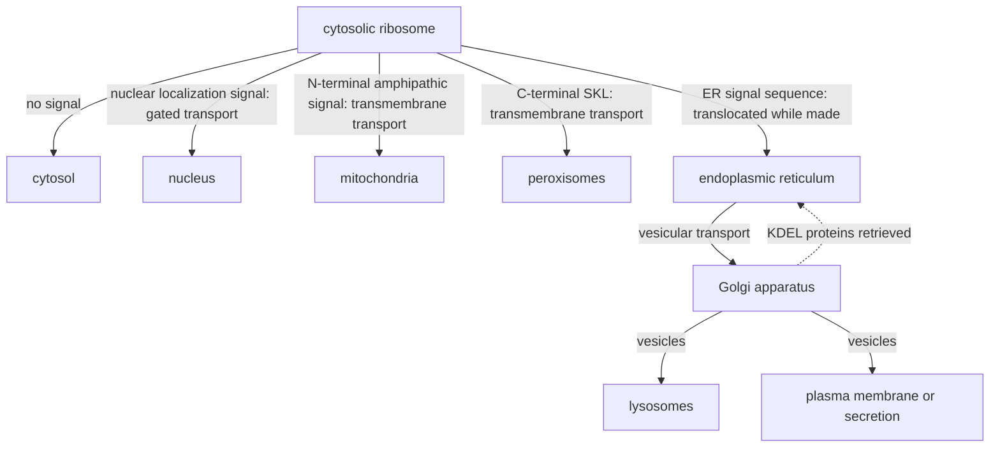

---
aliases:
  - Organelles
  - Membrane-Bound Organelle
  - Cellular Compartment
  - Organite
tags:
  - type/concept
  - domain/biology
  - domain/bioinformatics
  - level/L1
  - level/L2
  - level/L3
mastery: 0
prerequisites:
  - "[[Cell]]"
  - "[[Eukaryote]]"
  - "[[Cell Membrane]]"
related:
  - "[[Cell Nucleus]]"
  - "[[Mitochondrion]]"
  - "[[Endomembrane System]]"
  - "[[Cytoskeleton]]"
  - "[[Ribosome]]"
  - "[[Protein Targeting]]"
  - "[[Gene Ontology Annotation]]"
  - "[[Biological Ontology]]"
  - "[[Directed Acyclic Graph]]"
  - "[[Microscopy]]"
projects: []
sources:
  - "[[Biology 2e (OpenStax)]]"
  - "[[Molecular Biology of the Cell (Alberts)]]"
  - "[[Gene Ontology]]"
  - "[[Anderson 1981 - Sequence and Organization of the Human Mitochondrial Genome]]"
---

# Organelle

> [!abstract]
> Organelles are the specialized compartments of a eukaryotic cell, most of them enclosed by membranes, each in charge of a set of tasks: storing the genome, making proteins and lipids, converting energy, digesting and detoxifying.

## Definition

An **organelle** ("little organ") is a structure inside a cell that carries out a specific function. In the strict sense used in this vault, it is a **membrane-enclosed compartment** of a eukaryotic cell: nucleus, endoplasmic reticulum, Golgi apparatus, lysosomes, peroxisomes, vesicles and vacuoles, mitochondria and chloroplasts. Prokaryotes have no membrane-bound organelles.[^os42][^os43] Some texts also call organelles structures without a membrane, such as ribosomes or the centrosome; this note lists them separately.

## Why it matters

- **Location is an annotation.** The cellular component aspect of the Gene Ontology states where a gene product acts, with an evidence code for each annotation ([[Gene Ontology Annotation]]).[^go] "Nucleus", "mitochondrion" and "endoplasmic reticulum" are such terms.
- **Addresses are written in sequences.** Proteins are made in the cytosol and reach their organelle thanks to sorting signals in their sequence,[^alberts12] which localization predictors read ([[Protein Targeting]]).
- **Some organelles carry genomes.** Mitochondria and chloroplasts keep their own DNA,[^os43] so assemblies contain organelle records next to the nuclear chromosomes ([[Mitochondrion]], [[Genome]]).
- **Compartments can be sequenced separately.** Isolating one compartment changes what is measured: nuclear RNA, for instance, is rich in unspliced precursors ([[Cell Nucleus#Advanced (L3)]]).[^alberts]

## Core (L1)

![[eukaryotic-cell-organelles.svg]]

| Organelle | Membranes | Main function | Animal | Plant |
|---|---|---|---|---|
| [[Cell Nucleus\|Nucleus]] | 2 (nuclear envelope with pores) | holds the chromosomes; transcription and RNA processing; ribosome assembly in the nucleolus | yes | yes |
| Rough endoplasmic reticulum | 1 | makes and folds secreted and membrane proteins, on bound ribosomes | yes | yes |
| Smooth endoplasmic reticulum | 1 | makes lipids, detoxifies, stores calcium ions | yes | yes |
| Golgi apparatus | 1 | modifies, sorts and packages proteins and lipids | yes | yes |
| Lysosome | 1 | digests macromolecules and worn-out organelles with enzymes that work at acidic pH | yes | no: the vacuole digests |
| Vesicles and vacuoles | 1 | store and transport material; the large central vacuole of plant cells regulates water content | small ones | large central vacuole |
| Peroxisome | 1 | oxidizes fatty acids and amino acids, detoxifies, breaks down the hydrogen peroxide these reactions make | yes | yes |
| [[Mitochondrion]] | 2 | cellular respiration: converts the energy of food molecules into ATP | yes | yes |
| Chloroplast | 2, plus internal thylakoids | photosynthesis | no | yes |

Sources: animal and plant organelles and their functions,[^os43] endomembrane compartments.[^os44] The ER, Golgi, lysosomes and vesicles form one system that ships proteins and lipids ([[Endomembrane System]]).

Structures without a membrane, often listed with the organelles:[^os43]

- **Ribosomes** make proteins, free in the cytosol or bound to the rough ER; prokaryotes have them too ([[Ribosome]]).
- **The centrosome**, near the nucleus of animal cells, organizes microtubules and contains a pair of centrioles ([[Cytoskeleton]]).
- **The nucleolus** is a region of the nucleus, not a separate compartment ([[Cell Nucleus]]).

> [!tip] Four jobs
> Group the table by job: **information** (nucleus), **manufacturing and shipping** (rough and smooth ER, Golgi, vesicles), **energy** (mitochondria, chloroplasts), **breakdown and detoxification** (lysosomes, peroxisomes, vacuoles).

## Deeper (L2)

### How much space each compartment takes

In a liver cell (hepatocyte), the compartments occupy very different shares of the volume:[^alberts12]

| Compartment | % of cell volume |
|---|---:|
| Cytosol | 54 |
| Mitochondria | 22 |
| Rough ER cisternae | 9 |
| Smooth ER and Golgi cisternae | 6 |
| Nucleus | 6 |
| Peroxisomes | 1 |
| Lysosomes | 1 |
| Endosomes | 1 |

About half of the cell is cytosol, and more than a fifth is mitochondria.

### How each organelle gets its proteins

Almost all proteins are made on cytosolic ribosomes, so each organelle must import its own. Proteins move between compartments in three ways:[^alberts12]

1. **Gated transport** through the nuclear pores, between cytosol and nucleus.
2. **Transmembrane transport** by protein translocators across a membrane: into the ER, mitochondria, plastids and peroxisomes.
3. **Vesicular transport** from one compartment to the next along the secretory and endocytic routes, for example from ER to Golgi.

Each route reads a **sorting signal** in the protein:[^alberts12]

| Destination | Typical signal |
|---|---|
| ER | a hydrophobic stretch near the N-terminus |
| Retention in the ER lumen | Lys-Asp-Glu-Leu (KDEL) at the C-terminus |
| Mitochondrial matrix | an N-terminal signal that folds into an amphipathic helix |
| Nucleus | a short stretch rich in Lys and Arg, such as `PKKKRKV` |
| Peroxisome | Ser-Lys-Leu (SKL) at the C-terminus |
| Cytosol | no signal |



Details: [[Cell Nucleus#Deeper (L2)]] (pores), [[Mitochondrion#Deeper (L2)]] (import), [[Endomembrane System]] (vesicles), and the prediction side in [[Protein Targeting]].

### Organelles come from organelles

A cell cannot build a membrane-enclosed organelle from scratch: the information carried by the organelle itself, such as its membrane and its import machinery, is needed. When a cell divides, it passes on its organelles, which grow and divide.[^alberts12] Mitochondria and chloroplasts carry part of that information as their own DNA ([[Mitochondrion]]).[^alberts14]

## Advanced (L3)

- **Localization as a graph.** Cellular component terms are organized in a graph of terms and relations, not a flat list ([[Biological Ontology]], [[Directed Acyclic Graph]]).[^go] A gene product annotated to a specific term (nucleolus) is implicitly located in the broader terms it belongs to (nucleus, organelle): counting genes per term requires propagating annotations up the graph (Computational representation).
- **Evidence matters.** Annotations carry evidence codes, and automatically predicted localizations are not experimental evidence; filter by evidence when it matters.[^go]
- **One protein, several places.** A protein with both a nuclear import and an export signal shuttles between nucleus and cytoplasm ([[Cell Nucleus]], Exercise 3), and a gene product can carry several cellular component annotations.[^go] Localization prediction is therefore a multi-label problem.
- **Few organelle genes, many organelle proteins.** Human mitochondrial DNA encodes only 13 proteins;[^anderson] the rest of the mitochondrial proteome is imported ([[Mitochondrion]]), so organelle proteomes are mostly inferred from nuclear genes.

## Mathematical representation

**Volume shares.** If compartment $k$ occupies a fraction $f_k$ of a cell of volume $V$, with $\sum_k f_k = 1$, its volume is $V_k = f_k V$. Dividing by the volume $v$ of one organelle estimates their number, $n_k \approx f_k V / v$; for a cylinder of diameter $a$ and length $\ell$, $v = \pi (a/2)^2 \ell$.

**Annotation propagation.** Let the ontology be a directed acyclic graph $G = (T, E)$ whose edges point from a term to its parents (relations *is_a* or *part_of*), and let $\mathrm{anc}(t)$ be the set of terms reachable from $t$. If a gene $g$ is directly annotated to the set $A(g) \subseteq T$, its propagated annotation is

$$\bar A(g) = A(g) \cup \bigcup_{t \in A(g)} \mathrm{anc}(t),$$

and the number of genes at term $u$ is $n(u) = |\{g : u \in \bar A(g)\}|$. Propagation guarantees $n(\text{parent}) \ge n(\text{child})$ for every edge.

## Computational representation

Annotation databases store localization as terms of an ontology graph rather than as free text. A toy version, with propagation:

```python
# Invented, GO-like cellular component graph: term -> parent terms (is_a or part_of)
PARENTS = {
    "cellular component": [],
    "organelle": ["cellular component"],
    "membrane-bounded organelle": ["organelle"],
    "non-membrane-bounded organelle": ["organelle"],
    "nucleus": ["membrane-bounded organelle"],
    "nucleolus": ["non-membrane-bounded organelle", "nucleus"],   # is_a, part_of
    "mitochondrion": ["membrane-bounded organelle"],
    "mitochondrial matrix": ["mitochondrion"],                      # part_of
    "cytosol": ["cellular component"],
}
ANNOTATIONS = {  # invented genes -> terms they are directly annotated to
    "gene1": {"nucleolus"},
    "gene2": {"mitochondrial matrix"},
    "gene3": {"cytosol", "nucleus"},
    "gene4": {"mitochondrion"},
}


def ancestors(term: str) -> set[str]:
    """All terms reachable by following parent edges (depth-first search)."""
    found, stack = set(), [term]
    while stack:
        for parent in PARENTS[stack.pop()]:
            if parent not in found:
                found.add(parent)
                stack.append(parent)
    return found


def genes_per_term(propagate: bool) -> dict[str, int]:
    counts = dict.fromkeys(PARENTS, 0)
    for terms in ANNOTATIONS.values():
        closed = set(terms)
        if propagate:
            for t in terms:
                closed |= ancestors(t)
        for t in closed:
            counts[t] += 1
    return counts


direct, propagated = genes_per_term(False), genes_per_term(True)
for term in PARENTS:
    print(f"{term:31s} {direct[term]}  {propagated[term]}")
```

```text
cellular component              0  4
organelle                       0  4
membrane-bounded organelle      0  4
non-membrane-bounded organelle  0  1
nucleus                         1  2
nucleolus                       1  1
mitochondrion                   1  2
mitochondrial matrix            1  1
cytosol                         1  1
```

Without propagation, no gene is counted under "organelle", although three of the four genes are in one: direct counts answer "annotated exactly here", propagated counts answer "located here or in a part or kind of it", the question that term enrichment analyses ask.

## Worked example

> [!example] How many mitochondria in a liver cell? An estimate
> 1. **Volume share.** Mitochondria occupy 22% of a hepatocyte's volume.[^alberts12]
> 2. **Cell volume.** Take an illustrative cell of 5,000 µm³ (an assumption, not a measurement): mitochondria fill $0.22 \times 5000 = 1100$ µm³, the cytosol 2,700 µm³, the nucleus 300 µm³.
> 3. **One mitochondrion.** Model it as a cylinder 0.75 µm wide, within the usual 0.5 to 1 µm,[^alberts14] and 3 µm long (illustrative): $v = \pi \times 0.375^2 \times 3 \approx 1.33$ µm³.
> 4. **Count.** $n \approx 1100 / 1.33 \approx 830$ mitochondria. The answer scales with every assumption: doubling the assumed length halves it. An estimate is a model, and its assumptions must be stated with it.

## Common misconceptions

> [!warning] "Bacteria have small versions of the same organelles"
> Prokaryotes have no membrane-bound organelles at all; their DNA lies in the nucleoid.[^os42]

> [!warning] "Plant cells have chloroplasts instead of mitochondria"
> Plant cells have both: chloroplasts capture light energy, mitochondria carry out cellular respiration.[^os43]

> [!warning] "Each protein belongs to exactly one organelle"
> Sorting signals can send one protein to several places, or make it shuttle between them, and annotations reflect this with several terms per gene product.[^alberts12][^go]

## Exercises

> [!question] Exercise 1 (L1)
> Match each function to an organelle: ATP production by respiration; photosynthesis; modifying and sorting proteins; digesting macromolecules in animal cells; breaking down hydrogen peroxide; making lipids; storing the chromosomes.

> [!success]- Solution
> Mitochondrion; chloroplast; Golgi apparatus; lysosome; peroxisome; smooth ER; nucleus.

> [!question] Exercise 2 (L1)
> Which organelles are surrounded by two membranes? Which contain DNA? What do the two lists suggest?

> [!success]- Solution
> Two membranes: nucleus (nuclear envelope), mitochondria, chloroplasts. DNA: the same three. Mitochondria and chloroplasts carry their own genomes, a trace of their bacterial ancestry ([[Mitochondrion]]); the nucleus holds the cell's main genome.

> [!question] Exercise 3 (L2)
> Predict the location of each invented protein: (a) a C-terminus ending in SKL; (b) an N-terminal hydrophobic stretch and a C-terminal KDEL; (c) an internal `PKKKRKV`; (d) no sorting signal.

> [!success]- Solution
> (a) Peroxisome. (b) ER lumen: it enters the ER and is retrieved there from the Golgi. (c) Nucleus. (d) Cytosol.

> [!question] Exercise 4 (L2)
> Using the hepatocyte table, compute the volume of the rough ER, the nucleus and the lysosomes in the illustrative 5,000 µm³ cell. What fraction of the cell is enclosed by organelle membranes?

> [!success]- Solution
> Rough ER: $0.09 \times 5000 = 450$ µm³; nucleus 300 µm³; lysosomes 50 µm³. Everything but the cytosol: $100\% - 54\% = 46\%$ of the cell lies inside membrane-enclosed compartments.

> [!question] Exercise 5 (L3, Python)
> A localization predictor assigns a new invented gene, `gene5`, to "nucleolus". Using `PARENTS`, `ANNOTATIONS`, `ancestors` and `genes_per_term` from above, list the terms that `gene5` implies and recount. Why is `gene5` counted under "membrane-bounded organelle" although the nucleolus has no membrane?

> [!success]- Solution
> ```python
> ANNOTATIONS["gene5"] = {"nucleolus"}            # invented prediction for a new gene
> print(sorted({"nucleolus"} | ancestors("nucleolus")))
> counts = genes_per_term(propagate=True)
> print(counts["nucleolus"], counts["nucleus"], counts["membrane-bounded organelle"], counts["organelle"])
> ```
> Output:
> ```text
> ['cellular component', 'membrane-bounded organelle', 'non-membrane-bounded organelle', 'nucleolus', 'nucleus', 'organelle']
> 2 3 5 5
> ```
> The path nucleolus *part_of* nucleus *is_a* membrane-bounded organelle makes `gene5` located in a part of a membrane-bounded organelle. Propagation follows the meaning of each relation, so the count under a broad term answers "in it or in one of its parts", not "enclosed by its own membrane". Reading an ontology count correctly requires knowing which relations were propagated.

## Mastery checklist

- [ ] 1 Recognized: I can name the main organelles on a diagram of an animal and a plant cell.
- [ ] 2 Understood: I can map each organelle to its function and explain how proteins reach it.
- [ ] 3 Practiced: I can propagate annotations over a toy ontology and estimate organelle numbers from volume shares.
- [ ] 4 Applied: I retrieved the cellular component annotations of real genes, with their evidence codes, and compared them with a localization prediction.
- [ ] 5 Explained: I can teach why localization is a multi-label, graph-structured annotation and how sorting signals make it predictable.

## References

[^os42]: [[Biology 2e (OpenStax)]], section 4.2 "Prokaryotic Cells" (no membrane-bound organelles in prokaryotes).
[^os43]: [[Biology 2e (OpenStax)]], section 4.3 "Eukaryotic Cells" (organelles of animal and plant cells and their functions: nucleus, ribosomes, mitochondria, peroxisomes, vesicles and vacuoles, centrosome, lysosomes, chloroplasts, central vacuole).
[^os44]: [[Biology 2e (OpenStax)]], section 4.4 "The Endomembrane System and Proteins" (rough and smooth ER, Golgi apparatus, lysosomes).
[^alberts12]: [[Molecular Biology of the Cell (Alberts)]], 4th ed. (2002), ch. 12 "Intracellular Compartments and Protein Sorting" (relative volumes of the compartments of a hepatocyte; gated, transmembrane and vesicular transport; typical sorting signals including KDEL and SKL; organelles are not made from scratch).
[^alberts14]: [[Molecular Biology of the Cell (Alberts)]], 4th ed. (2002), ch. 14 "Energy Conversion: Mitochondria and Chloroplasts" (mitochondria 0.5 to 1 µm in diameter, their growth, division and genomes).
[^alberts]: [[Molecular Biology of the Cell (Alberts)]], 4th ed. (2002), treatment of RNA processing and export (incompletely processed transcripts retained in the nucleus).
[^anderson]: [[Anderson 1981 - Sequence and Organization of the Human Mitochondrial Genome]], *Nature* 290:457-465 (13 protein-coding genes).
[^go]: [[Gene Ontology]], cellular component aspect, the graph of terms and relations, annotations and evidence codes.
