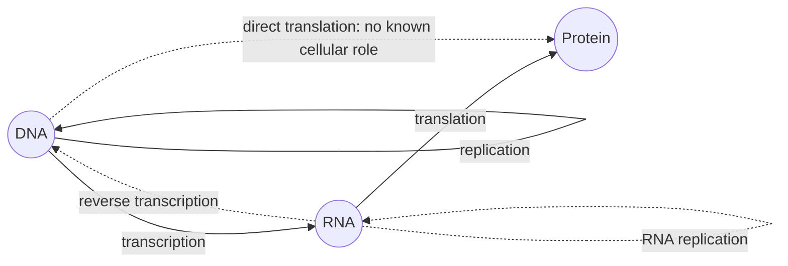

---
aliases:
  - Central Dogma of Molecular Biology
  - Dogme central
  - Dogme central de la biologie moléculaire
tags:
  - type/concept
  - domain/biology
  - domain/bioinformatics
  - level/L1
  - level/L2
  - level/L3
mastery: 0
prerequisites:
  - "[[DNA]]"
  - "[[RNA]]"
  - "[[Protein]]"
related:
  - "[[Reverse Transcription]]"
  - "[[DNA Replication]]"
  - "[[Transcription]]"
  - "[[Translation]]"
  - "[[Genetic Code]]"
  - "[[Gene Expression]]"
  - "[[Non-Coding RNA]]"
projects:
  - "[[02-sequence-translation]]"
sources:
  - "[[Crick 1958 - On Protein Synthesis]]"
  - "[[Crick 1970 - Central Dogma of Molecular Biology]]"
  - "[[Biology 2e (OpenStax)]]"
  - "[[Molecular Biology of the Cell (Alberts)]]"
---

# Central Dogma

> [!abstract]
> The central dogma says which way genetic information can be copied between DNA, RNA and protein: between nucleic acids and from nucleic acid to protein, but never back out of a protein.

## Definition

The **central dogma of molecular biology**, stated by Francis Crick in a 1957 lecture published in 1958 and restated in 1970, concerns the residue-by-residue transfer of **sequence information** between the three biopolymers. It says that sequence information can pass from nucleic acid to nucleic acid and from nucleic acid to protein, but not from protein to protein or from protein to nucleic acid: in Crick's words, "once 'information' has passed into protein it cannot get out again".[^crick1958][^crick1970]

## Why it matters

- It is the map of bioinformatics data: the genome (DNA), the transcriptome (RNA) and the proteome (protein) are the three layers of [[Genomics]], [[Transcriptomics]] and [[Proteomics]].
- It fixes the direction of prediction. A protein sequence can be predicted from DNA by applying the [[Genetic Code]] to an [[Open Reading Frame]]; a DNA sequence cannot be recovered from a protein, only a set of candidates (see Mathematical representation).
- Its "special" transfers are everyday tools and threats: reverse transcription turns RNA into cDNA for RNA-seq, and retroviruses such as HIV replicate through it.[^alberts]

## Core (L1)

In every cell, three transfers carry the information of the genome:[^openstax][^alberts]

| Transfer | Process | Machine |
|---|---|---|
| DNA → DNA | [[DNA Replication]] | DNA polymerase |
| DNA → RNA | [[Transcription]] | RNA polymerase |
| RNA → protein | [[Translation]] | ribosome, with tRNAs |

The word "information" is precise here: it means the **order of residues** (bases or amino acids), copied by templating or decoding. Energy and matter flow in every direction in the cell; sequence information does not.[^crick1958]



Solid arrows: general transfers, in all cells. Dashed: special transfers, in particular cases. No arrow leaves protein.[^crick1970]

## Deeper (L2)

**Crick 1958: two hypotheses, not one.** In "On Protein Synthesis", Crick proposed the **sequence hypothesis** (the base sequence of a nucleic acid specifies the amino acid sequence of a protein, which in turn determines how it folds) and, separately, the **central dogma** (the prohibition on transfers out of protein).[^crick1958] The genetic code itself was not yet known ([[Genetic Code]]).

**Crick 1970: the nine transfers.** With three polymers there are $3 \times 3 = 9$ possible transfers. Crick sorted them into three classes:[^crick1970]

| Class | Transfers | Where they occur |
|---|---|---|
| General | DNA → DNA, DNA → RNA, RNA → protein | all cells |
| Special | RNA → RNA, RNA → DNA, DNA → protein | specific cases (see below) |
| Unknown (the dogma says they do not occur) | protein → protein, protein → DNA, protein → RNA | none |

Special transfers in biology:[^alberts]

- **RNA → RNA**: RNA [[Virus|viruses]] copy their genomes with RNA-dependent RNA polymerases.
- **RNA → DNA**: **reverse transcriptase** copies RNA into DNA ([[Reverse Transcription]]) in retroviruses and in retrotransposons, mobile elements that spread through an RNA intermediate ([[Transposable Element]]); **telomerase** uses its own RNA as template to extend chromosome ends ([[DNA Replication#Deeper (L2)]]).
- **DNA → protein**: no known role in cells; Crick listed it as a special case, not a general one.[^crick1970]

The 1970 paper was written after Temin and Baltimore reported RNA-directed DNA synthesis in RNA tumor viruses, to clarify what the dogma had claimed all along: RNA → DNA was permitted; only transfers **out of protein** were excluded.[^crick1970]

## Advanced (L3)

What the dogma does **not** say, and why apparent exceptions are not exceptions:

- **"Every gene makes a protein."** No: rRNA, tRNA and many other RNAs are final products ([[RNA]], [[Non-Coding RNA]]). The dogma restricts which transfers are possible, not which must happen.[^crick1970]
- **Prions.** A misfolded prion protein converts normal copies of the same protein to its shape.[^alberts] What propagates is a **conformation**, not a residue sequence: no amino acid sequence is copied, so no forbidden transfer occurs.
- **RNA editing.** Some RNAs have bases changed or inserted after transcription.[^alberts] Enzymes modify RNA chemically, but they do not copy a protein sequence into RNA, so this is not protein → RNA transfer.
- **Epigenetics.** Methylation and chromatin states change which genes are expressed, and some are inherited through cell divisions, but they do not rewrite sequence ([[Epigenetics]]).
- **Reverse transcription in genome history.** Retrotransposons, copied from RNA back into DNA, have shaped large parts of eukaryotic genomes.[^alberts] Sequence information does flow backwards from RNA to DNA, which the dogma allows.

The durable core is therefore narrow and strong: **no known mechanism copies a protein's sequence into another molecule**. A modern description of [[Gene Expression]] adds regulation, RNA processing and non-coding RNAs around this core rather than replacing it.

## Mathematical representation

- Alphabets: $\Sigma_D = \{A,C,G,T\}$, $\Sigma_R = \{A,C,G,U\}$, $\Sigma_P$ = the 20 amino acids plus a stop symbol $*$.
- Maps on sequences (written 5' → 3'):
  - replication: $s \mapsto \mathrm{rc}(s)$ ([[DNA#Mathematical representation]]);
  - transcription of a template strand $t$: $\tau(t) = u(\mathrm{rc}(t))$, where $u$ replaces T by U;
  - translation: $\lambda(r_1 r_2 \dots r_{3m}) = g(r_1 r_2 r_3)\, g(r_4 r_5 r_6) \dots$, with the codon map $g : \Sigma_R^3 \to \Sigma_P$ given by the [[Genetic Code]].
- $g$ maps $4^3 = 64$ codons onto 21 symbols, so it is **not injective**. Writing $d(a) = |g^{-1}(a)|$ (the number of codons for $a$), a protein $p = a_1 \dots a_m$ has exactly
$$|\lambda^{-1}(p)| = \prod_{i=1}^{m} d(a_i)$$
coding sequences. Information is lost at translation, which is why the protein → nucleic acid direction cannot be a function.
- The dogma as a graph: let $G = (V, E)$ with $V = \{\text{DNA}, \text{RNA}, \text{protein}\}$ and $(x, y) \in E$ if a sequence transfer $x \to y$ exists. The dogma states that protein has **out-degree 0**: $\{(\text{protein}, y) : y \in V\} \cap E = \varnothing$.

## Computational representation

Each transfer is a sequence transformation, and a pipeline composes them. The codon table is stored as a compact 64-letter string (NCBI translation table 1, codons in TCAG order); its content is explained in [[Genetic Code]].[^alberts]

```python
from collections import Counter
from math import prod

# Crick (1970): the nine possible transfers between the three polymers.
TRANSFERS = {
    ("DNA", "DNA"): "general", ("DNA", "RNA"): "general", ("RNA", "protein"): "general",
    ("RNA", "RNA"): "special", ("RNA", "DNA"): "special", ("DNA", "protein"): "special",
    ("protein", "protein"): "unknown", ("protein", "DNA"): "unknown", ("protein", "RNA"): "unknown",
}

# Standard genetic code (NCBI table 1), codons enumerated in TCAG order.
BASES = "TCAG"
AMINO = "FFLLSSSSYY**CC*WLLLLPPPPHHQQRRRRIIIMTTTTNNKKSSRRVVVVAAAADDEEGGGG"
CODE = {a + b + c: AMINO[16 * i + 4 * j + k]
        for i, a in enumerate(BASES) for j, b in enumerate(BASES) for k, c in enumerate(BASES)}
DEGENERACY = Counter(CODE.values())  # codons per amino acid (or stop, '*')

DNA_COMP = str.maketrans("ACGT", "TGCA")


def transcribe(coding_strand: str) -> str:
    """mRNA has the coding-strand sequence with U for T (template = its reverse complement)."""
    return coding_strand.replace("T", "U")


def reverse_transcribe(rna: str) -> str:
    """First-strand cDNA, written 5'->3': reverse complement of the RNA in the DNA alphabet."""
    return rna.replace("U", "T").translate(DNA_COMP)[::-1]


def translate(mrna: str) -> str:
    dna = mrna.replace("U", "T")
    return "".join(CODE[dna[i:i + 3]] for i in range(0, len(dna) - 2, 3))


def n_back_translations(protein: str) -> int:
    """How many coding sequences give this protein: information lost by translation."""
    return prod(DEGENERACY[aa] for aa in protein)


print(sorted(k for k, v in TRANSFERS.items() if v == "unknown"))
mrna = transcribe("ATGTGGAAATAG")  # toy gene, coding strand 5'->3'
print(mrna, translate(mrna), reverse_transcribe(mrna))
print(n_back_translations(translate(mrna)), len(CODE), len(DEGENERACY))
```

```text
[('protein', 'DNA'), ('protein', 'RNA'), ('protein', 'protein')]
AUGUGGAAAUAG MWK* CTATTTCCACAT
6 64 21
```

There is deliberately no `protein_to_dna` function: the best one can write is a generator over $\lambda^{-1}(p)$.

## Worked example

> [!example] Following one toy gene through the dogma
> Toy gene (invented), coding strand `5'-ATGTGGAAATAG-3'`.
> ```text
> coding strand   5'-ATG TGG AAA TAG-3'
> template strand 3'-TAC ACC TTT ATC-5'
> mRNA            5'-AUG UGG AAA UAG-3'
> protein            Met Trp Lys Stop
> ```
> 1. **Transcription** (DNA → RNA): RNA polymerase reads the template 3' → 5' and builds `AUGUGGAAAUAG`, identical to the coding strand with U for T ([[Transcription]]).
> 2. **Translation** (RNA → protein): [[Codon|codons]] are read in frame from AUG: Met, Trp, Lys, then the stop codon UAG ends the chain ([[Translation]]).
> 3. **Reverse transcription** (RNA → DNA): copying the mRNA gives the cDNA `CTATTTCCACAT` (5' → 3'), which is the template strand: the round trip recovers the gene.
> 4. **No way back from protein.** Met and Trp have 1 codon each, Lys 2, stop 3, so $1 \times 1 \times 2 \times 3 = 6$ DNA sequences encode `MWK*`. The protein alone cannot tell which one was the gene.

## Common misconceptions

> [!warning] "The central dogma is 'DNA makes RNA makes protein'"
> That slogan describes the general transfers only. Crick's dogma is a **prohibition**: sequence information never leaves protein. It explicitly left room for RNA → RNA and RNA → DNA.[^crick1970]

> [!warning] "Reverse transcriptase disproved the central dogma"
> RNA → DNA was classed as a possible special transfer, and Crick's 1970 paper states that it does not contradict the dogma. Only a protein → nucleic acid or protein → protein transfer would.[^crick1970]

> [!warning] "Prions and epigenetics violate the dogma"
> Both transmit a **state** (a protein fold, a chromatin mark), not a residue-by-residue sequence. They are important non-genetic inheritance mechanisms, but not transfers out of protein in Crick's sense.[^crick1970][^alberts]

> [!warning] "'Dogma' means it is beyond question"
> The name is historical; the claim is empirical. Crick stressed that finding a single present-day cell able to carry out one of the unknown transfers would shake the foundations of molecular biology.[^crick1970] No such mechanism is known.

## Exercises

> [!question] Exercise 1 (L1)
> For each general transfer, give the process name and the enzyme or machine that performs it.

> [!success]- Solution
> DNA → DNA: replication, DNA polymerase. DNA → RNA: transcription, RNA polymerase. RNA → protein: translation, the ribosome (with tRNAs as adaptors).

> [!question] Exercise 2 (L1)
> A retrovirus such as HIV has an RNA genome that becomes integrated into host DNA. List, in order, the transfers from infecting RNA to new viral proteins and new viral genomes.

> [!success]- Solution
> RNA → DNA (reverse transcriptase makes a DNA copy, which integrates into a host chromosome); DNA → RNA (host RNA polymerase transcribes the provirus into mRNAs and new genomic RNA); RNA → protein (host ribosomes translate viral mRNAs). The integrated DNA is also copied with the host genome (DNA → DNA).[^alberts]

> [!question] Exercise 3 (L2)
> Classify each case as general transfer, special transfer, or not a sequence transfer: (a) telomerase extending a chromosome end; (b) replication of an RNA virus genome; (c) propagation of a prion; (d) editing of a base in an mRNA by an enzyme.

> [!success]- Solution
> (a) Special, RNA → DNA: telomerase copies its internal RNA template into DNA. (b) Special, RNA → RNA. (c) Not a sequence transfer: a conformation propagates, the amino acid sequence is unchanged. (d) Not a transfer of sequence **from** protein: the enzyme chemically changes one base; no protein sequence is copied into the RNA.

> [!question] Exercise 4 (L2, Python)
> How many DNA coding sequences give the toy peptide `MSLRW*`? Compute it with the degeneracy counts of the standard code.

> [!success]- Solution
> ```python
> from collections import Counter
> from math import prod
>
> AMINO = "FFLLSSSSYY**CC*WLLLLPPPPHHQQRRRRIIIMTTTTNNKKSSRRVVVVAAAADDEEGGGG"
> DEGENERACY = Counter(AMINO)  # each character of AMINO is one codon's product
>
>
> def n_back_translations(protein: str) -> int:
>     return prod(DEGENERACY[aa] for aa in protein)
>
>
> print(DEGENERACY["M"], DEGENERACY["S"], DEGENERACY["L"], DEGENERACY["R"], DEGENERACY["W"], DEGENERACY["*"])
> print(n_back_translations("MSLRW*"))
> ```
> Output: `1 6 6 6 1 3` then `648` ($1 \times 6 \times 6 \times 6 \times 1 \times 3$). Six residues already allow 648 genes: back-translation is a combinatorial explosion.

> [!question] Exercise 5 (L3, Python)
> Show on 1,000 random toy coding strands of 30 nt that reverse transcription of the transcript returns the template strand, and explain why this holds for every sequence.

> [!success]- Solution
> ```python
> import random
>
> DNA_COMP = str.maketrans("ACGT", "TGCA")
>
>
> def transcribe(coding_strand):
>     return coding_strand.replace("T", "U")
>
>
> def reverse_transcribe(rna):
>     return rna.replace("U", "T").translate(DNA_COMP)[::-1]
>
>
> rng = random.Random(1)
> ok = True
> for _ in range(1000):
>     coding = "".join(rng.choice("ACGT") for _ in range(30))
>     template = coding.translate(DNA_COMP)[::-1]
>     ok &= reverse_transcribe(transcribe(coding)) == template
> print(ok)
> ```
> Output: `True`. Proof: the transcript is $u(x)$ for coding strand $x$, and reverse transcription computes $\mathrm{rc}(u^{-1}(u(x))) = \mathrm{rc}(x)$, which is the template strand. Tests only illustrate; the algebra proves it.

> [!question] Exercise 6 (L3, Python)
> Assume all 64 codons are equally frequent. Compute, in bits, the entropy of a codon, the entropy of the encoded amino acid (or stop), and the information lost by translation, $H(\text{codon} \mid \text{amino acid})$.

> [!success]- Solution
> ```python
> from collections import Counter
> from math import log2
>
> AMINO = "FFLLSSSSYY**CC*WLLLLPPPPHHQQRRRRIIIMTTTTNNKKSSRRVVVVAAAADDEEGGGG"
> deg = Counter(AMINO)
>
> h_codon = log2(64)                                       # 64 equiprobable codons
> h_lost = sum(log2(deg[aa]) for aa in AMINO) / 64         # H(codon | amino acid)
> h_aa = -sum(d / 64 * log2(d / 64) for d in deg.values())  # H(amino acid or stop)
> print(round(h_codon, 3), round(h_lost, 3), round(h_aa, 3), round(h_codon - h_lost, 3))
> ```
> Output: `6.0 1.782 4.218 4.218`. A codon carries 6 bits; about 1.78 bits per codon are discarded by translation, and $H(\text{aa}) = H(\text{codon}) - H(\text{codon} \mid \text{aa})$ checks out because the amino acid is a function of the codon. That lost information is exactly what a protein → DNA transfer would have to invent ([[Shannon Entropy]]).

## Mastery checklist

- [ ] 1 Recognized: I can state the central dogma and name replication, transcription and translation.
- [ ] 2 Understood: I can explain Crick's general, special and forbidden transfers and why reverse transcription and prions do not contradict him.
- [ ] 3 Practiced: I can implement transcription, reverse transcription, translation and back-translation counting.
- [ ] 4 Applied: I built the DNA → RNA → protein pipeline of [[02-sequence-translation]] and ran it on a real gene.
- [ ] 5 Explained: I can explain the dogma as a statement about information, with its formal and historical limits.

## References

[^crick1958]: [[Crick 1958 - On Protein Synthesis]], *Symposia of the Society for Experimental Biology*.
[^crick1970]: [[Crick 1970 - Central Dogma of Molecular Biology]], *Nature*.
[^openstax]: [[Biology 2e (OpenStax)]], ch. 15 "Genes and Proteins".
[^alberts]: [[Molecular Biology of the Cell (Alberts)]], 4th ed. (2002).
