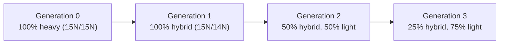

---
aliases:
  - Replication
  - Semi-Conservative Replication
  - Réplication de l'ADN
tags:
  - type/concept
  - domain/biology
  - domain/bioinformatics
  - level/L1
  - level/L2
  - level/L3
mastery: 0
prerequisites:
  - "[[DNA]]"
  - "[[Nucleotide]]"
  - "[[Enzyme]]"
related:
  - "[[Central Dogma]]"
  - "[[DNA Repair]]"
  - "[[Mutation]]"
  - "[[Cell Cycle]]"
  - "[[Polymerase Chain Reaction]]"
  - "[[Sanger Sequencing]]"
  - "[[Next-Generation Sequencing]]"
projects:
  - "[[06-mutation-lab]]"
  - "[[07-evolution-simulator]]"
sources:
  - "[[Biology 2e (OpenStax)]]"
  - "[[Molecular Biology of the Cell (Alberts)]]"
  - "[[The Cell (Cooper)]]"
  - "[[Watson 1953 - Molecular Structure of Nucleic Acids]]"
  - "[[Meselson 1958 - The Replication of DNA in Escherichia coli]]"
  - "[[Burgers 2017 - Eukaryotic DNA Replication Fork]]"
  - "[[Lobry 1996 - Asymmetric Substitution Patterns in the Two DNA Strands of Bacteria]]"
  - "[[Saiki 1988 - Primer-Directed Enzymatic Amplification of DNA]]"
  - "[[Sanger 1977 - DNA Sequencing with Chain-Terminating Inhibitors]]"
  - "[[Shendure 2008 - Next-Generation DNA Sequencing]]"
---

# DNA Replication

> [!abstract]
> Before a cell divides it copies its DNA: the two strands come apart and each one is used as a template to build a new partner, so each daughter molecule keeps one old strand and gains one new one.

## Definition

**DNA replication** is the synthesis of two DNA duplexes from one. The parental strands separate and each serves as the template for a new complementary strand, built 5' → 3' by DNA polymerases; each daughter duplex therefore contains one parental and one new strand (**semi-conservative** replication).[^meselson][^alberts]

## Why it matters

- Errors that escape proofreading and repair become [[Mutation|mutations]], the raw material of the variants found by [[Variant Calling]] and the mutation-rate parameter of evolutionary simulations.[^alberts]
- [[Polymerase Chain Reaction|PCR]] and sequencing are replication in a tube: a primer, dNTPs and a DNA polymerase. [[Sanger Sequencing]] stops extension with dideoxynucleotides; sequencing-by-synthesis platforms read one added base per cycle ([[Next-Generation Sequencing]]).[^saiki][^sanger][^shendure]
- Replication is asymmetric between strands, and that asymmetry leaves a compositional signal (GC skew) that locates bacterial replication origins from sequence alone.[^lobry]

## Core (L1)

> [!info] Copying was built into the structure
> Watson and Crick ended their 1953 paper by noting that the specific pairing they postulated "immediately suggests a possible copying mechanism for the genetic material".[^watson]

**Semi-conservative, as shown by Meselson and Stahl (1958).** They grew *E. coli* in a medium containing heavy nitrogen (¹⁵N), transferred the cells to normal ¹⁴N medium, and separated DNA by density in a cesium chloride gradient. After one generation all DNA formed a single band of intermediate (hybrid) density; after two generations, equal amounts of hybrid and light DNA. This excluded conservative replication (which predicts heavy and light bands after one generation) and dispersive replication (which predicts a single band at every generation).[^meselson]



**The replication fork.**[^openstax][^alberts]

![[replication-fork.svg]]

1. **Initiation** at a replication **origin**; two forks move away from it in opposite directions (bidirectional replication, forming a "bubble").
2. **Helicase** unwinds the duplex; **single-strand binding proteins** keep the exposed strands apart; **topoisomerase** relieves the over-winding ahead of the fork.
3. **Primase** makes a short **RNA primer**: DNA polymerases cannot start a chain, they only extend an existing 3'-OH.
4. **DNA polymerase** adds nucleotides to the 3' end, so every new strand grows **5' → 3'**, antiparallel to its template.
5. The **leading strand** is made continuously toward the fork. The **lagging strand** runs the other way, so it is made discontinuously, away from the fork, as **Okazaki fragments**, each starting from its own primer.
6. Primers are removed and replaced by DNA; **DNA ligase** seals the remaining nicks.

## Deeper (L2)

**The machinery** (bacteria after [^alberts], eukaryotes after [^burgers]):

| Function | Bacteria (*E. coli*) | Eukaryotes |
|---|---|---|
| Recognize origin | DnaA at the single origin *oriC* | origin recognition complex (ORC) at many origins |
| Unwind | DnaB helicase | CMG helicase (Cdc45, MCM2-7, GINS) |
| Protect single strands | SSB | RPA |
| Prime | DnaG primase | Pol α-primase |
| Processivity clamp | β clamp, loaded by the clamp loader | PCNA, loaded by RFC |
| Main synthesis | DNA polymerase III | Pol ε (leading), Pol δ (lagging) |
| Remove primers, fill gaps | DNA polymerase I | Pol δ strand displacement, FEN1 nuclease |
| Seal nicks | DNA ligase | DNA ligase I |

**Why RNA primers?** A polymerase that could start chains from nothing could not check its first nucleotides. Starting on an RNA primer, which is later removed, keeps every nucleotide of the final DNA subject to proofreading.[^alberts]

**Fidelity is layered.**[^alberts]

| Step | Errors per nucleotide (approx.) |
|---|---|
| Base selection by the polymerase | 1 in 10⁵ |
| + 3' → 5' exonuclease proofreading | improves about 100-fold |
| + strand-directed mismatch repair | improves about 100-fold more |
| Overall | about 1 in 10⁹ |

Mismatch repair must know which strand is new; residual errors become permanent after the next round of replication ([[DNA Repair]], [[Mutation]]).

**Prokaryotes vs eukaryotes.**[^alberts][^cooper][^openstax]

| Feature | Bacteria | Eukaryotes |
|---|---|---|
| Chromosome | usually one, circular | several, linear |
| Origins | one per chromosome | many per chromosome |
| Timing | initiation controlled at the single origin | S phase only; each origin fires at most once per cycle ([[Cell Cycle]]) |
| Template | naked DNA | chromatin: nucleosomes removed ahead and reassembled behind the fork ([[Chromatin]]) |
| Okazaki fragments | about 1000 to 2000 nt | about 100 to 200 nt |
| Ends | none (circle) | telomeres, maintained by telomerase |

**Once per cycle.** In eukaryotes, helicases are loaded onto origins ("licensed") in G1 but activated only in S phase, and relicensing is blocked until the next cycle, so no segment is copied twice.[^alberts]

**Telomeres and the end-replication problem.** At the end of a linear chromosome, the last lagging-strand primer leaves a gap that polymerase cannot fill, so each round would shorten the chromosome. **Telomerase**, a reverse transcriptase carrying its own RNA template ([[Reverse Transcription]]), extends the 3' end with tandem repeats, `(TTAGGG)n` in humans ([[Central Dogma#Deeper (L2)]]). Many somatic cells have little telomerase, so their telomeres shorten with divisions.[^alberts]

## Advanced (L3)

- **The eukaryotic fork today.** The CMG helicase translocates along the leading-strand template; Pol ε synthesizes the leading strand and Pol δ the lagging strand, and Okazaki fragments are matured by Pol δ strand displacement, FEN1 cleavage and ligase I. Check eukaryotic polymerase roles against such recent reviews rather than against older textbooks.[^burgers]
- **Replication writes its signature into genomes.** In bacteria, leading and lagging strands accumulate different substitution patterns, so the strand read 5' → 3' is enriched in G over C on one side of the origin and depleted on the other; the **GC skew** $(G - C)/(G + C)$ changes sign at the origin and the terminus.[^lobry] Scanning the cumulative skew is a classic origin-finding algorithm (Exercise 6).
- **From error rate to mutation load.** With an overall error rate $\mu$ per nucleotide, a copy of $L$ nucleotides carries on average $L\mu$ new errors (Mathematical representation). This is the quantity mutation simulators draw from ([[Mutation]], [[Poisson Distribution]]).
- **Replication as technology.** PCR replaces helicase with heat: cycles of denaturation, primer annealing and extension by a heat-stable polymerase (Taq, from *Thermus aquaticus*) double the target at each cycle, with the primers fixing its ends.[^saiki][^alberts] Sanger sequencing adds chain-terminating dideoxynucleotides; sequencing-by-synthesis uses reversible terminators read cycle by cycle.[^sanger][^shendure] All inherit the rules above: a primer is required, and synthesis runs 5' → 3'.

## Mathematical representation

- **Meselson-Stahl.** Start from fully heavy DNA and grow $g \ge 1$ generations in light medium. Under semi-conservative replication the fractions of molecules are
$$f_{\text{heavy}}(g) = 0, \qquad f_{\text{hybrid}}(g) = \frac{2}{2^g} = 2^{1-g}, \qquad f_{\text{light}}(g) = 1 - 2^{1-g},$$
because the 2 original strands always sit in 2 distinct molecules out of $2^g$. Conservative replication predicts $f_{\text{heavy}} = 2^{-g}$, $f_{\text{light}} = 1 - 2^{-g}$; dispersive replication predicts a single band with heavy-isotope fraction $2^{-g}$.
- **Replication errors.** Let $\mu$ be the per-nucleotide error probability, errors independent, and $L$ the number of nucleotides copied. The number of errors $E$ follows
$$E \sim \mathrm{Binomial}(L, \mu) \approx \mathrm{Poisson}(\lambda = L\mu), \qquad P(E = 0) = (1-\mu)^L \approx e^{-L\mu},$$
the approximation being excellent when $\mu$ is small and $L$ large ([[Binomial Distribution]]).
- **PCR growth.** With $N_0$ template molecules and efficiency $\varepsilon \in [0, 1]$ per cycle, after $n$ cycles $N_n = N_0 (1 + \varepsilon)^n$. Ideal doubling for 30 cycles gives $2^{30} = 1{,}073{,}741{,}824$ copies per molecule; at $\varepsilon = 0.9$, $1.9^{30} \approx 2.3 \times 10^8$.
- **Okazaki fragments.** Each fork makes one lagging strand, and across the genome the lagging strands cover one strand-equivalent, so a genome of length $L$ needs about $L / \ell$ fragments of mean length $\ell$.

## Computational representation

Replication is naturally simulated as copying a template with a per-base error probability. The model below ignores the mechanics (forks, strands) and keeps what matters for sequence data: which bases come out wrong.

```python
def band_fractions(g: int, model: str) -> tuple[float, float, float]:
    """(heavy, hybrid, light) fractions of DNA molecules after g generations in 14N medium."""
    if g == 0:
        return (1.0, 0.0, 0.0)
    if model == "semi-conservative":
        return (0.0, 2 / 2**g, 1 - 2 / 2**g)
    if model == "conservative":
        return (1 / 2**g, 0.0, 1 - 1 / 2**g)
    raise ValueError(model)  # dispersive: one band whose 15N fraction is 1/2**g


for g in range(4):
    print(g, band_fractions(g, "semi-conservative"), band_fractions(g, "conservative"))
```

```text
0 (1.0, 0.0, 0.0) (1.0, 0.0, 0.0)
1 (0.0, 1.0, 0.0) (0.5, 0.0, 0.5)
2 (0.0, 0.5, 0.5) (0.25, 0.0, 0.75)
3 (0.0, 0.25, 0.75) (0.125, 0.0, 0.875)
```

```python
import math
import random

PAIR = {"A": "T", "C": "G", "G": "C", "T": "A"}


def replicate(template: str, mu: float, rng: random.Random) -> tuple[str, int]:
    """New strand complementary to `template` (base by base), each position wrong with probability mu."""
    new, errors = [], 0
    for base in template:
        correct = PAIR[base]
        if rng.random() < mu:
            new.append(rng.choice([b for b in "ACGT" if b != correct]))
            errors += 1
        else:
            new.append(correct)
    return "".join(new), errors


rng = random.Random(42)
template = "".join(rng.choice("ACGT") for _ in range(1_000))  # toy template
mu, trials = 1e-3, 2_000  # exaggerated error rate so errors are visible
counts = [replicate(template, mu, rng)[1] for _ in range(trials)]
lam = len(template) * mu
print(f"mean errors {sum(counts) / trials:.3f}  expected {lam:.3f}")
print(f"error-free copies {counts.count(0) / trials:.3f}  Poisson e^-lambda {math.exp(-lam):.3f}")
```

```text
mean errors 0.971  expected 1.000
error-free copies 0.367  Poisson e^-lambda 0.368
```

A fixed seed makes the run reproducible. Choosing the wrong base uniformly is a simplifying assumption; a richer model would use a substitution matrix and sequence context ([[Mutation]]).

## Worked example

> [!example] Meselson-Stahl, strand by strand
> Write each duplex as its two strands, H (¹⁵N, heavy) or L (¹⁴N, light). Every replication separates the strands and pairs each with a new L strand.
> ```text
> generation 0:  H|H
> generation 1:  H|L   L|H                  -> 2/2 hybrid
> generation 2:  H|L   L|L   L|L   L|H      -> 2/4 hybrid, 2/4 light
> generation 3:  2 hybrid + 6 light         -> 2/8 hybrid, 6/8 light
> ```
> 1. The two original H strands are never destroyed and never reunited, so exactly 2 molecules stay hybrid at every generation.
> 2. The total doubles, so the hybrid fraction halves: $2/2^g$.
> 3. Observed after one generation: one hybrid band only, so conservative replication (H|H + L|L) is excluded; after two, two bands, so dispersive replication (always one band) is excluded.[^meselson]

## Common misconceptions

> [!warning] "The lagging strand is synthesized 3' → 5'"
> No DNA polymerase synthesizes 3' → 5'. The lagging strand is made 5' → 3' like the other, but in short pieces pointing away from the fork, which is why it is discontinuous.[^alberts]

> [!warning] "Leading and lagging are properties of a DNA strand"
> They are properties of a strand **at a given fork**. Because forks leave an origin in both directions, the same parental strand templates leading synthesis at one fork and lagging synthesis at the other.[^alberts]

> [!warning] "Replication starts at one end of the chromosome"
> It starts at internal origins and proceeds in both directions; a eukaryotic chromosome uses many origins, otherwise copying it would take far too long.[^alberts][^openstax]

> [!warning] "Proofreading makes replication error-free"
> Proofreading and mismatch repair reduce errors to roughly 1 in 10⁹ per nucleotide, not to zero. Over genomes of billions of base pairs and many divisions, residual errors are a main source of new mutations.[^alberts]

## Exercises

> [!question] Exercise 1 (L1)
> Predict the bands after three generations in ¹⁴N under the semi-conservative, conservative and dispersive models.

> [!success]- Solution
> Semi-conservative: 25% hybrid, 75% light (two bands). Conservative: 12.5% heavy, 87.5% light (two bands, one heavy). Dispersive: a single band whose ¹⁵N fraction is $1/8$, between light and hybrid. `band_fractions(3, ...)` gives the first two.

> [!question] Exercise 2 (L1)
> Put in order the events that produce one Okazaki fragment and join it to the previous one: ligase seals the nick; primase makes a primer; helicase exposes template; polymerase extends the primer; the previous fragment's primer is replaced by DNA.

> [!success]- Solution
> Helicase exposes template → primase makes a primer → polymerase extends it, away from the fork, until it reaches the previous fragment → the previous fragment's primer is replaced by DNA → ligase seals the nick.

> [!question] Exercise 3 (L2)
> A fork moves to the right through this toy duplex (invented). Which strand templates the leading strand? Write the first 5 nucleotides of each new strand made on the left part, with orientations.
> ```text
> 5'-ATGCCGTTAG-3'
> 3'-TACGGCAATC-5'
> ```

> [!success]- Solution
> A new strand grows 5' → 3', antiparallel to its template. On the **bottom** strand (3' → 5' left to right) the new strand runs 5' → 3' left to right, toward the fork: **leading**, `5'-ATGCC...-3'`. On the **top** strand the new strand runs 5' → 3' right to left, away from the fork: **lagging**, made in fragments, whose first 5 positions read `3'-TACGG...-5'` under the template.

> [!question] Exercise 4 (L2, Python)
> Using the Okazaki fragment sizes in Deeper (L2), estimate the number of fragments per replication for *E. coli* (4,639,221 bp, see [[DNA]]) and for a diploid human genome ($2 \times 3.055 \times 10^9$ bp).

> [!success]- Solution
> ```python
> for name, L, sizes in [("E. coli", 4_639_221, (1000, 2000)), ("human diploid", 2 * 3.055e9, (100, 200))]:
>     print(name, [f"{L / s:.3g}" for s in sizes])
> ```
> Output: `E. coli ['4.64e+03', '2.32e+03']` and `human diploid ['6.11e+07', '3.06e+07']`. About 2,300 to 4,600 fragments for *E. coli*, 30 to 60 million for a human cell: every one needs a primer, its removal and a ligation.

> [!question] Exercise 5 (L3, Python)
> With overall error rates $\mu = 10^{-9}$ and $10^{-10}$, compute the expected number of new errors per genome replication and the probability of an error-free copy, for *E. coli* and a diploid human genome. What do the results imply?

> [!success]- Solution
> ```python
> import math
>
> for name, L in [("E. coli", 4_639_221), ("human diploid", 2 * 3.055e9)]:
>     for mu in (1e-9, 1e-10):
>         lam = L * mu
>         print(f"{name:13s} mu={mu:.0e} expected errors {lam:.4f}  P(no error) {math.exp(-lam):.4f}")
> ```
> ```text
> E. coli       mu=1e-09 expected errors 0.0046  P(no error) 0.9954
> E. coli       mu=1e-10 expected errors 0.0005  P(no error) 0.9995
> human diploid mu=1e-09 expected errors 6.1100  P(no error) 0.0022
> human diploid mu=1e-10 expected errors 0.6110  P(no error) 0.5428
> ```
> A bacterium almost always copies its genome perfectly, while a human cell division typically introduces a few new errors: at the scale of a large genome, even extreme fidelity produces mutations every division. This is the Poisson model used by [[06-mutation-lab]] and [[07-evolution-simulator]].

> [!question] Exercise 6 (L3, Python)
> Write `cumulative_skew(seq)` (the running value of #G − #C) and return the positions where it is minimal. Run it on the toy sequence `TCCACTCATCAGTGGAAGGT` and explain why the minimum points to an origin in a real bacterial genome.

> [!success]- Solution
> ```python
> def cumulative_skew(seq: str) -> list[int]:
>     """skew[i] = (#G - #C) in seq[:i]; skew[0] = 0."""
>     skew = [0]
>     for base in seq:
>         skew.append(skew[-1] + (base == "G") - (base == "C"))
>     return skew
>
>
> def min_skew_positions(seq: str) -> list[int]:
>     skew = cumulative_skew(seq)
>     low = min(skew)
>     return [i for i, s in enumerate(skew) if s == low]
>
>
> toy = "TCCACTCATCAGTGGAAGGT"  # toy: C-rich half, then G-rich half
> print(cumulative_skew(toy))
> print(min_skew_positions(toy))
> ```
> Output: `[0, 0, -1, -2, -2, -3, -3, -4, -4, -4, -5, -5, -4, -4, -3, -2, -2, -2, -1, 0, 0]` and `[10, 11]`. The skew falls while C dominates and rises once G dominates, so it is lowest after 10 or 11 bases, exactly where the C-rich half ends. In a bacterial genome, the strand you read has the sequence of the lagging strand on one side of the origin and of the leading strand on the other; leading strands are enriched in G over C, so the cumulative skew bottoms out near the origin.[^lobry]

## Mastery checklist

- [ ] 1 Recognized: I can say what semi-conservative means and name helicase, primase, polymerase and ligase.
- [ ] 2 Understood: I can explain leading vs lagging strands, Okazaki fragments, the need for primers and the Meselson-Stahl logic.
- [ ] 3 Practiced: I can derive the band fractions, the Poisson error model and the skew algorithm, and code them.
- [ ] 4 Applied: I used replication error rates to simulate mutations in [[06-mutation-lab]] or [[07-evolution-simulator]], or located the origin of a real bacterial genome from its skew.
- [ ] 5 Explained: I can explain fidelity layers, telomeres, prokaryote vs eukaryote differences and how PCR and sequencing reuse the machinery.

## References

[^watson]: [[Watson 1953 - Molecular Structure of Nucleic Acids]], *Nature*.
[^meselson]: [[Meselson 1958 - The Replication of DNA in Escherichia coli]], *PNAS*.
[^openstax]: [[Biology 2e (OpenStax)]], ch. 14 "DNA Structure and Function".
[^alberts]: [[Molecular Biology of the Cell (Alberts)]], 4th ed. (2002).
[^cooper]: [[The Cell (Cooper)]], 2nd ed. (2000).
[^burgers]: [[Burgers 2017 - Eukaryotic DNA Replication Fork]], *Annual Review of Biochemistry* (Burgers and Kunkel).
[^lobry]: [[Lobry 1996 - Asymmetric Substitution Patterns in the Two DNA Strands of Bacteria]], *Molecular Biology and Evolution*.
[^saiki]: [[Saiki 1988 - Primer-Directed Enzymatic Amplification of DNA]], *Science*.
[^sanger]: [[Sanger 1977 - DNA Sequencing with Chain-Terminating Inhibitors]], *PNAS*.
[^shendure]: [[Shendure 2008 - Next-Generation DNA Sequencing]], *Nature Biotechnology* (Shendure and Ji).
