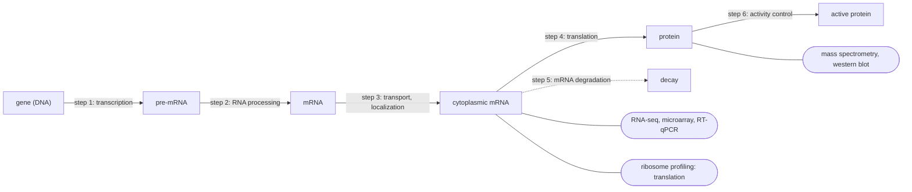

---
aliases:
  - Expression Level
  - Gene Expression Level
  - Expression génique
  - Expression des gènes
tags:
  - type/concept
  - domain/biology
  - domain/bioinformatics
  - domain/statistics
  - level/L1
  - level/L2
  - level/L3
mastery: 0
prerequisites:
  - "[[Gene]]"
  - "[[Central Dogma]]"
  - "[[Transcription]]"
  - "[[Messenger RNA]]"
  - "[[Translation]]"
related:
  - "[[Gene Regulation]]"
  - "[[Transcriptome]]"
  - "[[RNA Sequencing]]"
  - "[[Count Normalization]]"
  - "[[Log Fold Change]]"
  - "[[Differential Expression Analysis]]"
  - "[[Quantitative Polymerase Chain Reaction]]"
  - "[[Microarray]]"
  - "[[Proteomics]]"
  - "[[Stochastic Gene Expression]]"
projects: []
sources:
  - "[[Biology 2e (OpenStax)]]"
  - "[[Molecular Biology of the Cell (Alberts)]]"
  - "[[Gerstein 2007 - What Is a Gene, Post-ENCODE]]"
  - "[[Mortazavi 2008 - Mapping and Quantifying Mammalian Transcriptomes by RNA-Seq]]"
  - "[[Wang 2009 - RNA-Seq - A Revolutionary Tool for Transcriptomics]]"
  - "[[Wagner 2012 - Measurement of mRNA Abundance Using RNA-seq Data]]"
  - "[[Livak 2001 - Analysis of Relative Gene Expression Data Using Real-Time Quantitative PCR]]"
  - "[[Brazma 2001 - Minimum Information About a Microarray Experiment]]"
  - "[[Ingolia 2009 - Genome-Wide Analysis in Vivo of Translation with Nucleotide Resolution Using Ribosome Profiling]]"
  - "[[Schwanhäusser 2011 - Global Quantification of Mammalian Gene Expression Control]]"
  - "[[Li 2014 - System Wide Analyses Have Underestimated Protein Abundances]]"
  - "[[Leek 2010 - Tackling the Widespread and Critical Impact of Batch Effects]]"
  - "[[Modern Statistics for Modern Biology (Holmes)]]"
  - "[[Galaxy Training Network - Training Material]]"
---

# Gene Expression

> [!abstract]
> Gene expression is how much of its product, RNA or protein, a gene makes in a given cell at a given time. Cells with the same genome differ because they express different genes, and bioinformatics measures expression mostly by counting RNA molecules.

## Definition

**Gene expression** is the process by which the information of a gene is used to make its functional product: a protein, or a functional RNA such as an rRNA or a tRNA.[^os16][^alberts] The **expression level** of a gene is the amount of that product, or of its mRNA intermediate, in a sample: usually measured relative to other genes or other samples, sometimes as molecules per cell.[^alberts][^schwan] Because modern definitions of a gene rest on its functional products, a non-coding RNA gene is expressed when its RNA is made, and a gene with several transcripts has several products to quantify.[^gerstein]

## Why it matters

- **It is what functional genomics measures.** An RNA-seq experiment ends as a gene by sample table of read counts ([[Count Matrix]]), the input of differential expression, clustering and co-expression analyses ([[Transcriptomics]], [[Differential Expression Analysis]], [[Gene Co-Expression Network]]).[^gtn][^holmes]
- **Every number has a unit.** Raw counts, CPM, TPM and fold changes answer different questions; RPKM, once standard, turned out to be inconsistent between samples (L2).[^mortazavi][^wagner]
- **RNA is not protein.** Transcriptomics measures one layer; how much of protein variation mRNA levels explain is a quantitative question with a debated answer (L3).[^schwan][^li2014]
- **Measurements carry the lab with them.** Processing date, reagent lots and personnel change measured expression and can masquerade as biology when they line up with the groups compared ([[Batch Effect]]).[^leek] Expression data are reusable only with their experimental description, the lesson of the MIAME checklist ([[Minimum Information About a Microarray Experiment]]).[^brazma]

## Core (L1)

### Same genome, different expression

The cells of an organism carry essentially the same genome, yet a neuron and a liver cell make different proteins: each cell type expresses a different subset of its genes ([[Cell Type]], [[Cell Differentiation]]).[^os16][^alberts] Some genes, needed by every cell, are expressed nearly everywhere; others only in particular cell types or conditions.[^alberts] Expression also changes with time and environment, which is why it is always reported for a given sample and condition.

### Where expression is controlled, where it is measured

Prokaryotes control expression mainly at transcription; eukaryotes at several levels: epigenetic, transcriptional, post-transcriptional, translational and post-translational.[^os16] The reference text lists six steps at which a eukaryotic cell can control how much active product a gene yields.[^alberts] The diagram places them along the [[Central Dogma]], with the techniques that measure each layer:



(Control steps after [^alberts]; the mechanisms are the subject of [[Gene Regulation]].)

### Measuring expression at a glance

| Layer | Technique | What is read out | Typical unit |
|---|---|---|---|
| mRNA, a few genes | RT-qPCR ([[Quantitative Polymerase Chain Reaction]]) | cycle at which amplified cDNA crosses a fluorescence threshold | fold change relative to a reference gene and a control sample[^livak] |
| mRNA, predefined genes | [[Microarray]] | fluorescence of labelled cDNA bound to complementary probes | signal intensity, often as log ratios[^alberts][^brazma] |
| RNA, genome-wide | [[RNA Sequencing]] | sequencing reads assigned to genes or transcripts | counts, CPM, TPM[^mortazavi][^wagner] |
| translation | ribosome profiling | ribosome-protected mRNA fragments | footprints per gene or per codon[^ingolia] |
| protein | western blot; [[Mass Spectrometry]] ([[Proteomics]]) | antibody signal; peptide identification and signal intensity | relative intensity, or copies per cell after calibration[^alberts][^schwan] |

Almost every expression value is **relative**: to another sample, to a reference gene, or to the total of a sequencing library. "Gene X is highly expressed" means nothing until the comparison is stated.

## Deeper (L2)

### From RNA molecules to read counts

In RNA-seq, RNA is extracted, usually enriched for mRNA (for example by poly(A) selection), copied into cDNA by reverse transcriptase ([[Reverse Transcription]]), fragmented and sequenced. Reads are aligned to a genome or transcriptome and counted per gene: how often each gene is represented is a digital measure of its expression, which also reveals previously unknown transcripts.[^mortazavi][^gtn] Compared with earlier methods, RNA-seq measures transcripts and isoforms more precisely.[^wang] The steps are the syllabus of [[Transcriptomics]] ([[Spliced Read Alignment]], [[Count Matrix]]).

The count of a gene depends on three factors, only one of them biological:[^mortazavi][^wagner]

1. **the number of RNA molecules** of that gene in the sample (the quantity of interest);
2. **their length**, because a longer transcript is cut into more fragments and yields more reads;
3. **the sequencing depth**, the total number of reads of the library.

### Units

| Unit | Definition (Mathematical representation) | Corrects for | Typical use |
|---|---|---|---|
| raw count | reads assigned to the gene | nothing | input of count-based statistical tests[^holmes] |
| CPM | count per million reads of the library | depth | comparing one gene across samples, filtering low counts |
| RPKM | reads per kilobase of transcript per million mapped reads | depth and length | historical unit of the first RNA-seq papers[^mortazavi] |
| TPM | length-normalized counts rescaled to sum to one million | length, then expresses proportions | comparing genes within a sample; relative molar abundance[^wagner] |
| log2 fold change | $\log_2$ of the ratio between two conditions | nothing by itself | effect size of a change ([[Log Fold Change]]) |

RPKM divides each count by the gene length and by the total number of reads of the library; that total is not length-corrected, so the RPKM values of a sample do not sum to a constant. TPM divides the length-corrected counts by their own sum instead, so every sample sums to $10^6$ and a TPM value reads as "transcripts of this gene per million transcripts".[^wagner] Neither is the input of differential expression tests, which model raw counts and estimate their own scaling factors ([[Count Normalization]], [[Size Factor Estimation]]).[^holmes] Fold changes $B/A$ are compared on the $\log_2$ scale, where a doubling is $+1$ and a halving $-1$ ([[Logarithm]]); a small **pseudocount** avoids $\log 0$ for unexpressed genes, at the cost of shrinking the fold changes of weakly expressed ones.

### Targeted and array methods

**RT-qPCR.** RNA is reverse-transcribed into cDNA, then a gene-specific region is amplified by PCR while a fluorescent signal is recorded at every cycle. The **threshold cycle** $C_T$ is the cycle at which the signal crosses a fixed threshold: the more template at the start, the earlier. With 100 % efficiency the product doubles every cycle, so one cycle of difference means a two-fold difference in starting amount. The $2^{-\Delta\Delta C_T}$ method compares the target gene with a reference gene within each sample, then the treated sample with a calibrator; it assumes efficiencies close to 100 % and similar for both genes, and a reference gene unaffected by the treatment.[^livak]

**Microarrays.** A microarray carries thousands of DNA probes at known positions; labelled cDNA from a sample hybridizes to complementary probes, and the fluorescence of each spot measures how much of that RNA was present ([[Nucleic Acid Hybridization]]).[^alberts] It can only measure what the probes were designed for, whereas sequencing also detects unknown transcripts.[^mortazavi] MIAME defined the information needed to interpret such data: design, samples, arrays, hybridizations, measurements and normalization.[^brazma]

**Protein level.** A western blot separates proteins by electrophoresis and detects one of them with an antibody; mass spectrometry identifies many proteins at once from their peptides.[^alberts] Protein abundance can be estimated from peptide signal intensities and converted into copies per cell with calibration ([[Label-Free Quantification]]).[^schwan]

## Advanced (L3)

### How well does mRNA predict protein?

Schwanhäusser and colleagues measured the abundance and turnover of both mRNAs and proteins for more than 5,000 genes in mouse fibroblasts. mRNA and protein levels correlated with $R^2 \approx 0.41$, mRNA and protein half-lives were uncorrelated, and a kinetic model attributed most of the control of protein levels to translation.[^schwan] A corrigendum later fixed a scaling error in the protein copy numbers, and a reanalysis argued that measurement error lowers the observed correlation: for 4,212 genes, mRNA levels explain at least 56 % of protein variation, and about 81 % by a second strategy.[^schwan][^li2014] Two lessons: mRNA is informative about protein but not a substitute, because translation and degradation rates differ between genes ([[Translation#Advanced (L3)]]); and a correlation between two noisy measurements underestimates the true relationship ([[Measurement Error]]).

The kinetic model behind such studies is two linear [[Ordinary Differential Equation|differential equations]] (Mathematical representation). It predicts **time lags**: after a change in transcription, mRNA approaches its new level on the time scale of its own half-life, protein on the scale of the protein half-life, which is longer when the protein is more stable than its mRNA, so mRNA and protein measured at the same moment can disagree even when the protein will eventually follow (Exercise 5).

### Counts are noisy, relative and sensitive to batches

- **Noise.** Sequencing samples reads from a library, and biological replicates differ more than sampling alone predicts. Counts are therefore modelled with the negative binomial distribution, whose variance $\mu + \alpha\mu^2$ exceeds the Poisson variance $\mu$ ([[Negative Binomial Distribution]], [[Overdispersion]], [[Dispersion Estimation]]).[^holmes] Estimating $\alpha$ requires [[Biological Replicate|biological replicates]].
- **Composition.** CPM and TPM are shares of a fixed total. If one gene takes up much more of the library, every other gene loses share and looks down-regulated even if its number of molecules did not change. Median-of-ratios size factors assume that most genes do not change and scale each sample by the median of its ratios to a pseudo-reference, which resists a few strong changes ([[Size Factor Estimation]], [[Compositional Data Analysis]], Exercise 4).[^holmes]
- **Batches.** When batch and condition are confounded, no statistical correction can separate them; design (randomization, balanced batches) is the remedy ([[Batch Effect]], [[Batch Effect Correction]]).[^leek]
- **Mixtures.** A bulk sample averages over its cells: if a tissue contains a fraction $\pi_k$ of cell type $k$ expressing a gene at level $e_k$, the bulk level is $\sum_k \pi_k e_k$, so a change in cell-type proportions looks like a change in expression ([[Single-Cell RNA Sequencing]], [[Cell-Type Deconvolution]]).

### Other layers of expression

- **Translation** is measured by ribosome profiling, which counts ribosome footprints on each mRNA ([[Ribosome#Advanced (L3)]]).[^ingolia]
- **Isoforms**: one gene can produce several transcripts, so expression can be quantified per gene or per transcript, with different answers ([[Alternative Splicing]], [[Transcript Quantification]]).[^wang]

## Mathematical representation

**Count matrix.** $X = (x_{gj})$ with genes $g = 1, \dots, G$ and samples $j = 1, \dots, n$; library size $N_j = \sum_g x_{gj}$; $\ell_g$ the transcript length in bases.

**Units** (RPKM as introduced with the first mouse RNA-seq transcriptomes,[^mortazavi] TPM as advocated to replace it[^wagner]):
$$\mathrm{CPM}_{gj} = \frac{x_{gj}}{N_j}\,10^6, \qquad \mathrm{RPKM}_{gj} = \frac{x_{gj}}{(\ell_g/10^3)\,(N_j/10^6)}, \qquad \mathrm{TPM}_{gj} = \frac{x_{gj}/\ell_g}{\sum_k x_{kj}/\ell_k}\,10^6.$$

Derivations: $\mathrm{TPM}_{gj} = 10^6\,\mathrm{RPKM}_{gj} / \sum_k \mathrm{RPKM}_{kj}$, so $\sum_g \mathrm{TPM}_{gj} = 10^6$ in every sample, whereas $\sum_g \mathrm{RPKM}_{gj} = 10^9 \sum_g (x_{gj}/\ell_g) / N_j$ depends on the sample. If fragments are drawn uniformly along transcripts, $\mathbb{E}[x_{gj}] \propto m_{gj}\,\ell_g$ where $m_{gj}$ is the number of molecules, hence $\mathrm{TPM}_{gj} \approx 10^6\, m_{gj} / \sum_k m_{kj}$: TPM estimates molar proportions.

**Fold change.** With normalized values $y_{gA}, y_{gB}$ and pseudocount $c > 0$, $\mathrm{LFC}_g = \log_2 \dfrac{y_{gB} + c}{y_{gA} + c}$.

**Count model.** $x_{gj} \sim \mathrm{NB}(\mu_{gj}, \alpha_g)$ with $\mu_{gj} = s_j\, q_{gj}$ and $\operatorname{Var}(x_{gj}) = \mu_{gj} + \alpha_g \mu_{gj}^2$, where $s_j$ is a size factor, $q_{gj}$ a normalized expression and $\alpha_g$ the dispersion; $\alpha_g = 0$ gives the Poisson model. The median-of-ratios estimate is $\hat{s}_j = \operatorname{median}_g \, x_{gj} \big/ \big(\prod_{k=1}^{n} x_{gk}\big)^{1/n}$, over genes with no zero count.[^holmes]

**qPCR.** If $N_0$ template copies are amplified with efficiency $E$ ($E = 1$: doubling), after $c$ cycles $N_c = N_0 (1 + E)^c$. The threshold $N_\theta$ is reached at $C_T = \log(N_\theta / N_0) / \log(1 + E)$. With $\Delta C_T = C_T^{\text{target}} - C_T^{\text{ref}}$ and $\Delta\Delta C_T = \Delta C_T^{\text{treated}} - \Delta C_T^{\text{calibrator}}$, the relative expression is $(1 + E)^{-\Delta\Delta C_T}$, which is $2^{-\Delta\Delta C_T}$ for $E = 1$.[^livak]

**Kinetics.** With $m$ mRNAs and $p$ proteins per cell, transcription rate $k_m$, translation rate $k_p$ per mRNA and degradation rate constants $\delta_m, \delta_p$:
$$\frac{dm}{dt} = k_m - \delta_m m, \qquad \frac{dp}{dt} = k_p m - \delta_p p,$$
with steady state $m^* = k_m/\delta_m$ and $p^* = k_p k_m / (\delta_m \delta_p)$, and half-lives $t_{1/2} = \ln 2 / \delta$. This is the type of model used to estimate synthesis and degradation rates at genome scale.[^schwan] The protein level depends on four rates; RNA-seq measures $m^* = k_m/\delta_m$, which combines only two of them.

## Computational representation

A count matrix is a tab-separated table, genes in rows and samples in columns; transcript lengths come from the annotation ([[GFF Format]]). RPKM, TPM and log fold changes in standard-library Python, on invented data (CPM appears in Exercise 4):

```python
import math

# Invented toy count matrix: reads assigned to each gene in two samples, and gene lengths (bp).
LENGTH = {"geneA": 1_000, "geneB": 4_000, "geneC": 500, "geneD": 2_000}
COUNTS = {
    "ctrl":    {"geneA": 100, "geneB": 400, "geneC": 50, "geneD": 450},
    "treated": {"geneA": 400, "geneB": 800, "geneC": 100, "geneD": 700},
}


def rpkm(counts: dict[str, int], length: dict[str, int]) -> dict[str, float]:
    total = sum(counts.values())
    return {g: c / (length[g] / 1e3) / (total / 1e6) for g, c in counts.items()}


def tpm(counts: dict[str, int], length: dict[str, int]) -> dict[str, float]:
    rate = {g: c / length[g] for g, c in counts.items()}      # reads per base: proportional to molecules
    total = sum(rate.values())
    return {g: r / total * 1e6 for g, r in rate.items()}


def log2_fold_change(a: float, b: float, pseudocount: float = 0.5) -> float:
    return math.log2((b + pseudocount) / (a + pseudocount))


for name, counts in COUNTS.items():
    t, r = tpm(counts, LENGTH), rpkm(counts, LENGTH)
    print(name, "library", sum(counts.values()),
          "| TPM", {g: round(v) for g, v in t.items()}, "sum", round(sum(t.values())),
          "| RPKM sum", round(sum(r.values())))

t0, t1 = tpm(COUNTS["ctrl"], LENGTH), tpm(COUNTS["treated"], LENGTH)
print({g: round(log2_fold_change(t0[g], t1[g]), 2) for g in LENGTH})
```

Output:

```text
ctrl library 1000 | TPM {'geneA': 190476, 'geneB': 190476, 'geneC': 190476, 'geneD': 428571} sum 1000000 | RPKM sum 525000
treated library 2000 | TPM {'geneA': 347826, 'geneB': 173913, 'geneC': 173913, 'geneD': 304348} sum 1000000 | RPKM sum 575000
{'geneA': 0.87, 'geneB': -0.13, 'geneC': -0.13, 'geneD': -0.49}
```

TPM sums to $10^6$ in both samples; RPKM sums to different totals, the inconsistency pointed out by Wagner and colleagues.[^wagner] Real libraries have tens of millions of reads; the arithmetic is the same.

## Worked example

> [!example] Reading the toy count matrix correctly (invented data)
> Counts, control sample: geneA 100, geneB 400, geneC 50, geneD 450; lengths 1, 4, 0.5 and 2 kb.
>
> 1. **Raw counts mislead within a sample.** geneB has four times more reads than geneA, but it is four times longer: 100 reads per kb each. geneC (50 reads, 0.5 kb) is also at 100 reads per kb. Per molecule, A, B and C are equally expressed; geneD (225 reads per kb) is the most abundant.
> 2. **TPM.** Reads per kb sum to $100 + 100 + 100 + 225 = 525$, so $\mathrm{TPM}_A = 100/525 \times 10^6 \approx 190{,}476$ and $\mathrm{TPM}_D = 225/525 \times 10^6 \approx 428{,}571$: geneD makes about 43 % of these transcripts.
> 3. **Raw counts mislead between samples.** The treated library has 2,000 reads instead of 1,000, so every raw count rises. After normalization (reads per kb $400, 200, 200, 350$, total 1,150), only geneA increases: $347{,}826 / 190{,}476 \approx 1.83$, $\log_2 \approx 0.87$.
> 4. **But are B, C and D really down?** Their TPM fell ($\log_2$ fold changes $-0.13$, $-0.13$, $-0.49$) partly because geneA took a bigger share of the total. TPM cannot tell a true decrease from a loss of share; that is the composition problem of L3 and the reason differential expression tools estimate their own size factors.

## Common misconceptions

> [!warning] "A read count is an expression level"
> A count mixes the number of molecules with transcript length and sequencing depth. Compare genes within a sample only after length normalization, and samples only after depth normalization.[^mortazavi][^wagner]

> [!warning] "TPM values can be compared between any two samples"
> TPM values are proportions of each sample's total. A few very abundant transcripts, or a different library protocol, shift all the others. For differential expression, model raw counts with size factors.[^holmes]

> [!warning] "The mRNA level tells the protein level"
> They correlate, but translation and protein turnover differ between genes,[^schwan][^li2014] and protein changes lag behind mRNA changes when proteins are long-lived (Exercise 5).

## Exercises

> [!question] Exercise 1 (L1)
> For each measurement, give the layer of expression it measures (RNA, translation or protein) and whether it is genome-wide: (a) RNA-seq of a tumour; (b) RT-qPCR of one gene; (c) a western blot; (d) ribosome profiling; (e) mass spectrometry of a cell lysate. What does "expressed" mean for a tRNA gene?

> [!success]- Solution
> (a) RNA, genome-wide. (b) RNA, one gene. (c) Protein, one protein. (d) Translation, genome-wide. (e) Protein, many proteins at once. A tRNA gene makes no protein: it is expressed when its RNA is transcribed and processed into a functional tRNA, so its expression is an RNA amount.[^gerstein]

> [!question] Exercise 2 (L2)
> Invented mean $C_T$ values: control, target 26.2 and reference 18.0; heat shock, target 24.0 and reference 18.1. Compute the relative expression of the target by $2^{-\Delta\Delta C_T}$, then with an amplification efficiency of 90 %. Which assumptions does the answer rest on?

> [!success]- Solution
> Control $\Delta C_T = 26.2 - 18.0 = 8.2$; heat $\Delta C_T = 24.0 - 18.1 = 5.9$; $\Delta\Delta C_T = -2.3$, so $2^{2.3} \approx 4.92$-fold induction. With $E = 0.9$: $1.9^{2.3} \approx 4.38$ (`print(round(2 ** 2.3, 2), round(1.9 ** 2.3, 2))`). The estimate is sensitive to efficiency. It assumes efficiencies near 100 % and equal for both genes, and a reference gene whose expression heat shock does not change.[^livak] Replicate wells are [[Technical Replicate|technical replicates]]; a biological conclusion needs independent samples ([[Biological Replicate]]).

> [!question] Exercise 3 (L2)
> A sample has 3 genes: X, 300 reads, 3 kb; Y, 300 reads, 1 kb; Z, 400 reads, 2 kb. Compute CPM and TPM for each gene. Which gene has the most reads, and which the most transcripts? If P goes from 10 to 40 TPM and Q from 40 to 10, what is the mean $\log_2$ fold change of the two?

> [!success]- Solution
> Library size 1,000: CPM X = 300,000, Y = 300,000, Z = 400,000. Reads per kb: 100, 300, 200 (total 600), so TPM X ≈ 166,667, Y = 500,000, Z ≈ 333,333. Z has the most reads, but Y, the shortest, has the most transcripts. For P and Q, $\log_2$ FC $= +2$ and $-2$, mean 0; the arithmetic mean of the raw ratios (4 and 0.25) would wrongly suggest an average 2.1-fold increase.

> [!question] Exercise 4 (L3, Python)
> Invented data: both libraries have 10,000 reads, and in the cells only geneA changed (8 times more molecules). Show that CPM-based fold changes make the four unchanged genes look down-regulated, and that median-of-ratios size factors recover the truth. When would this method fail?

> [!success]- Solution
> ```python
> import math
> from statistics import median
>
> counts = {"geneA": (1000, 4706), "geneB": (2000, 1176), "geneC": (3000, 1765),
>           "geneD": (1500, 882), "geneE": (2500, 1471)}
>
>
> def size_factors(counts):
>     """Median-of-ratios: each sample's median ratio of counts to the per-gene geometric mean."""
>     n = len(next(iter(counts.values())))
>     geo = {g: math.exp(sum(math.log(c) for c in cs) / n) for g, cs in counts.items()}
>     return [median(cs[j] / geo[g] for g, cs in counts.items()) for j in range(n)]
>
>
> totals = [sum(cs[j] for cs in counts.values()) for j in range(2)]
> sf = size_factors(counts)
> print("size factors:", [round(s, 3) for s in sf])
> print({g: (round(math.log2((b / totals[1]) / (a / totals[0])), 2) + 0.0,     # CPM-based
>            round(math.log2((b / sf[1]) / (a / sf[0])), 2) + 0.0)             # size-factor-based
>        for g, (a, b) in counts.items()})
> ```
>
> ```text
> size factors: [1.304, 0.767]
> {'geneA': (2.23, 3.0), 'geneB': (-0.77, 0.0), 'geneC': (-0.77, 0.0), 'geneD': (-0.77, 0.0), 'geneE': (-0.77, 0.0)}
> ```
>
> geneA's share of the library rose from 10 % to 47 %, so with CPM every other gene lost share ($\log_2$ FC $-0.77$) and geneA's true 8-fold change ($\log_2 = 3$) is underestimated. The median ratio is set by the four unchanged genes, so the size factors absorb the composition shift.[^holmes] The method fails when most genes change in the same direction, because its assumption (most genes unchanged) no longer holds.

> [!question] Exercise 5 (L3, Python)
> Invented parameters: mRNA half-life 2 h, protein half-life 20 h. At $t = 0$ transcription triples. Solving the kinetic model from its old steady state, the protein has covered a fraction $f(t) = 1 - \dfrac{\delta_p e^{-\delta_m t} - \delta_m e^{-\delta_p t}}{\delta_p - \delta_m}$ of its change, and the mRNA a fraction $1 - e^{-\delta_m t}$. When is the protein halfway, and what would an experiment measuring both at $t = 6$ h conclude?

> [!success]- Solution
> ```python
> import math
>
> d_m, d_p = math.log(2) / 2, math.log(2) / 20      # invented half-lives: mRNA 2 h, protein 20 h
>
>
> def protein_done(t: float) -> float:
>     """Fraction of its total change the protein has covered t hours after a step in transcription."""
>     return 1 - (d_p * math.exp(-d_m * t) - d_m * math.exp(-d_p * t)) / (d_p - d_m)
>
>
> t = 0.0
> while protein_done(t) < 0.5:
>     t += 0.01
> print("protein halfway at", round(t, 1), "h")
> print("at 6 h: mRNA", round(1 - math.exp(-d_m * 6), 2), "protein", round(protein_done(6), 2))
> # protein halfway at 23.0 h
> # at 6 h: mRNA 0.88 protein 0.11
> ```
>
> The mRNA is halfway after one mRNA half-life (2 h); the protein needs about 23 h, a little more than its own half-life because it also waits for the mRNA. At 6 h the mRNA has covered 88 % of its change and the protein 11 %: the two measurements disagree although both end 3-fold higher. A low mRNA-protein correlation can come from timing, not only from translational control.

## Mastery checklist

- [ ] 1 Recognized: I can define gene expression and expression level, and name one technique per layer (RNA, translation, protein).
- [ ] 2 Understood: I can explain why cells with one genome differ, where expression is controlled, and why raw counts need length and depth normalization.
- [ ] 3 Practiced: I can compute CPM, TPM, log fold changes, $2^{-\Delta\Delta C_T}$ and median-of-ratios size factors in Python, and simulate the mRNA-protein model.
- [ ] 4 Applied: I took a public RNA-seq count matrix, computed TPM and fold changes for known marker genes, and checked them against the study's conclusions.
- [ ] 5 Explained: I can teach why mRNA and protein disagree, why TPM is compositional, and how batch effects and measurement error distort expression comparisons.

## References

[^os16]: [[Biology 2e (OpenStax)]], ch. 16 "Gene Expression" (regulation of gene expression; levels of control in prokaryotes and eukaryotes).
[^alberts]: [[Molecular Biology of the Cell (Alberts)]], 4th ed. (2002), treatment of the control of gene expression (differential expression among cell types, the steps at which expression can be controlled) and of methods (DNA microarrays, western blotting, mass spectrometry).
[^gerstein]: [[Gerstein 2007 - What Is a Gene, Post-ENCODE]], *Genome Research* 17:669-681 (gene defined by its functional products).
[^mortazavi]: [[Mortazavi 2008 - Mapping and Quantifying Mammalian Transcriptomes by RNA-Seq]], *Nature Methods* 5:621-628.
[^wang]: [[Wang 2009 - RNA-Seq - A Revolutionary Tool for Transcriptomics]], *Nature Reviews Genetics* 10:57-63.
[^wagner]: [[Wagner 2012 - Measurement of mRNA Abundance Using RNA-seq Data]], *Theory in Biosciences* 131:281-285.
[^livak]: [[Livak 2001 - Analysis of Relative Gene Expression Data Using Real-Time Quantitative PCR]], *Methods* 25:402-408.
[^brazma]: [[Brazma 2001 - Minimum Information About a Microarray Experiment]], *Nature Genetics* 29:365-371.
[^ingolia]: [[Ingolia 2009 - Genome-Wide Analysis in Vivo of Translation with Nucleotide Resolution Using Ribosome Profiling]], *Science* 324:218-223.
[^schwan]: [[Schwanhäusser 2011 - Global Quantification of Mammalian Gene Expression Control]], *Nature* 473:337-342, and its 2013 corrigendum.
[^li2014]: [[Li 2014 - System Wide Analyses Have Underestimated Protein Abundances]], *PeerJ* 2:e270.
[^leek]: [[Leek 2010 - Tackling the Widespread and Critical Impact of Batch Effects]], *Nature Reviews Genetics* 11:733-739.
[^holmes]: [[Modern Statistics for Modern Biology (Holmes)]], material on count data from high-throughput sequencing (negative binomial model, size factors, count-based differential expression).
[^gtn]: [[Galaxy Training Network - Training Material]], topic "Transcriptomics" ("1: RNA-Seq reads to counts", "2: RNA-seq counts to genes").
