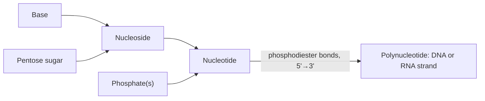

---
aliases:
  - Nucleotides
  - Nucléotide
  - nt
tags:
  - type/concept
  - domain/biology
  - domain/chemistry
  - domain/bioinformatics
  - level/L1
  - level/L2
  - level/L3
mastery: 0
prerequisites:
  - "[[Covalent Bond]]"
  - "[[Hydrogen Bond]]"
  - "[[Carbohydrate]]"
related:
  - "[[Nucleic Acid]]"
  - "[[DNA]]"
  - "[[RNA]]"
  - "[[Base Pairing]]"
  - "[[ATP]]"
  - "[[Amino Acid]]"
projects:
  - "[[01-dna-engine]]"
sources:
  - "[[Biology 2e (OpenStax)]]"
  - "[[Molecular Biology of the Cell (Alberts)]]"
  - "[[Biochemistry (Berg)]]"
  - "[[Cornish-Bowden 1985 - Nomenclature for Incompletely Specified Bases in Nucleic Acid Sequences]]"
  - "[[Sanger 1977 - DNA Sequencing with Chain-Terminating Inhibitors]]"
---

# Nucleotide

> [!abstract]
> A nucleotide is one "letter" of DNA or RNA: a sugar carrying a phosphate and one of a few bases, and chains of nucleotides are the sequences bioinformatics reads.

## Definition

A **nucleotide** is a molecule made of three parts: a **nitrogenous base**, a **five-carbon sugar** (pentose) and one or more **phosphate groups** attached to the sugar's 5' carbon. Nucleotides are the monomers of the [[Nucleic Acid|nucleic acids]] [[DNA]] and [[RNA]]; the same molecule without phosphate is a **nucleoside**.[^openstax][^berg]

## Why it matters

- Every character of a [[FASTA Format|FASTA]] or [[FASTQ Format|FASTQ]] file stands for one nucleotide, or for a set of possible nucleotides (IUPAC codes, below).[^iupac] Lengths are counted in nucleotides (nt) for one strand and base pairs (bp) for a duplex.
- Deoxynucleoside triphosphates (dNTPs) are the building blocks consumed by DNA polymerases, so they are reagents of [[Polymerase Chain Reaction|PCR]] and of sequencing; [[Sanger Sequencing]] relies on dideoxynucleotides, which lack the 3'-OH needed to extend a chain.[^alberts][^sanger]
- Chemically modified nucleotides (5-methylcytosine in DNA, many modified bases in tRNA) carry information beyond the four letters; DNA methylation is a core subject of [[Epigenetics]].[^alberts]
- The choice of encoding (1 byte per letter, 2 bits, 4-bit sets) sets the memory footprint and speed of every sequence tool, from [[K-mer]] counters to genome indexes.

## Core (L1)

![[nucleotide-structure.svg]]

The three parts:[^openstax][^berg]

| Part | DNA | RNA |
|---|---|---|
| Sugar (pentose) | deoxyribose: H on the 2' carbon | ribose: OH on the 2' carbon |
| Bases | A, G, C, T | A, G, C, U |
| Phosphate | on the 5' carbon | on the 5' carbon |

- **Purines** (two fused rings): adenine (A), guanine (G). **Pyrimidines** (one ring): cytosine (C), thymine (T, DNA only), uracil (U, RNA only).[^openstax]
- The sugar carbons are numbered **1' to 5'** ("one prime" to "five prime"); the prime distinguishes them from the atoms of the base. The base is attached to 1', the phosphate to 5', and the 3' carbon carries a free hydroxyl (3'-OH).[^berg]
- **Nucleoside** = base + sugar. **Nucleotide** = nucleoside + phosphate(s). Names follow: adenine (base) → adenosine (nucleoside) → adenosine monophosphate, AMP (nucleotide); with deoxyribose, deoxyadenosine and dAMP; with three phosphates, ATP and dATP.[^berg]
- Nucleotides polymerize through **phosphodiester bonds**: the phosphate on the 5' carbon of one nucleotide links to the 3'-OH of the previous one. The chain therefore has two different ends, a **5' end** (free phosphate) and a **3' end** (free OH), and by convention sequences are written 5' → 3'.[^openstax][^alberts]



> [!tip] Mnemonics
> Purines are **A**, **G**: "**Pur**e **A**s **G**old". Pyrimidines are **C**, **T**, **U**: "**CUT** the **Py**". The purines are the bigger (two-ring) bases, although "pyrimidine" is the longer word.

## Deeper (L2)

- **The glycosidic bond.** The base is joined to C1' of the sugar by an N-glycosidic bond, through N9 of a purine or N1 of a pyrimidine.[^berg]
- **Polymerization chemistry.** A polymerase joins the free 3'-OH of the growing strand to an incoming nucleoside **tri**phosphate, which supplies the energy, and releases pyrophosphate (PPi); hydrolysis of PPi makes the reaction effectively irreversible. Because the activated group is on the incoming nucleotide, nucleic acids grow only 5' → 3' (see [[DNA Replication]] and [[Transcription]]).[^alberts][^berg]
- **Why DNA uses T and RNA uses U.** Cytosine spontaneously deaminates to uracil. Because DNA normally contains no U, a U found in DNA is recognized as damage and removed by repair enzymes; with U as a normal DNA base, this error could not be distinguished from the real letter.[^alberts] See [[DNA Repair]].
- **Why DNA uses deoxyribose.** The 2'-OH of ribose makes RNA susceptible to hydrolysis (for example in alkaline conditions); DNA, lacking it, is chemically more stable, which suits long-term storage of information.[^berg]
- **Nucleotides beyond nucleic acids.** [[ATP]] is the cell's main energy carrier, GTP powers steps of translation and signaling, cyclic AMP is an intracellular signal, and coenzymes such as NAD⁺, FAD and coenzyme A contain nucleotide parts.[^alberts][^berg]

## Advanced (L3)

- **Modified bases.** 5-methylcytosine is a regulated mark in vertebrate DNA ([[DNA Methylation]], [[Epigenetics]]); tRNAs carry many chemically modified nucleotides.[^alberts] Base modifications are invisible in a plain FASTA string: they need dedicated assays or data formats.
- **A mark written into genome statistics.** Methylated cytosine deaminates directly to thymine, a normal base that repair does not flag reliably; over evolution this has depleted the CG dinucleotide in vertebrate genomes, except in "CG islands" that often mark gene promoters ([[CpG Island]]).[^alberts] Counting dinucleotides and comparing observed with expected CG frequency is a classic genome-annotation computation ([[GC Content]], [[Promoter]]).
- **Information content.** With four equiprobable letters, one nucleotide carries at most $\log_2 4 = 2$ bits ([[Shannon Entropy]]); real genomes carry less, because composition is biased and sequence is repetitive, which is why genomes compress.
- **Ambiguity is data.** IUPAC codes let a single string express uncertainty (an unresolved base call, `N`) or variation (a heterozygous A/G site written `R`), so parsers must never assume a four-letter alphabet.[^iupac]

## Mathematical representation

Let $\Sigma_{\text{DNA}} = \{A, C, G, T\}$ and $\Sigma_{\text{RNA}} = \{A, C, G, U\}$ be the nucleotide alphabets.

- **Chemical classes** partition the alphabet: $\text{Pur} = \{A, G\}$, $\text{Pyr} = \{C, T\}$. A substitution $x \to y$ ($x \neq y$) is a **transition** if $x, y$ are in the same class and a **transversion** otherwise: of the $4 \times 3 = 12$ ordered substitutions, 4 are transitions and 8 are transversions (see [[Mutation]]).
- **Complement** is a map $c : \Sigma_{\text{DNA}} \to \Sigma_{\text{DNA}}$ with $c(A) = T,\ c(T) = A,\ c(C) = G,\ c(G) = C$. It is an **involution**: $c(c(x)) = x$ for all $x$, and it maps each purine to a pyrimidine and vice versa.
- **IUPAC codes** are the non-empty subsets of $\Sigma_{\text{DNA}}$: there are $2^4 - 1 = 15$ of them (4 single bases + 11 ambiguity codes).[^iupac] A code $S \subseteq \Sigma_{\text{DNA}}$ matches a base $x$ iff $x \in S$, and its complement is the image set $c(S) = \{c(x) : x \in S\}$.
- **Encoding.** Any bijection $e : \Sigma_{\text{DNA}} \to \{0,1\}^2$ stores a base in $\lceil \log_2 4 \rceil = 2$ bits. With $e(A)=00,\ e(C)=01,\ e(G)=10,\ e(T)=11$, complementing is flipping both bits: $e(c(x)) = e(x) \oplus 11$, where $\oplus$ is bitwise XOR.

## Computational representation

| Representation | Size per base | Alphabet | Used for |
|---|---|---|---|
| Text character (ASCII) | 8 bits | A C G T, IUPAC codes, `-` gap | FASTA, FASTQ, SAM |
| 2-bit code | 2 bits | A C G T only | compact storage, k-mer hashing |
| 4-bit set (one bit per base) | 4 bits | all 15 IUPAC codes | matching with ambiguity |

IUPAC codes (NC-IUB recommendations):[^iupac]

| Code | Bases | Mnemonic | Code | Bases | Mnemonic |
|---|---|---|---|---|---|
| R | A, G | puRine | K | G, T | Keto |
| Y | C, T | pYrimidine | M | A, C | aMino |
| S | C, G | Strong | B | C, G, T | not A |
| W | A, T | Weak | D | A, G, T | not C |
| N | A, C, G, T | aNy | H | A, C, T | not G |
|  |  |  | V | A, C, G | not T (not U) |

A 4-bit set encoding makes IUPAC matching a single bitwise AND:

```python
# IUPAC nucleotide codes: each symbol stands for a set of bases.
IUPAC = {
    "A": "A", "C": "C", "G": "G", "T": "T",
    "R": "AG", "Y": "CT", "S": "CG", "W": "AT", "K": "GT", "M": "AC",
    "B": "CGT", "D": "AGT", "H": "ACT", "V": "ACG", "N": "ACGT",
}
BIT = {"A": 0b0001, "C": 0b0010, "G": 0b0100, "T": 0b1000}  # one bit per base
MASK = {code: sum(BIT[b] for b in bases) for code, bases in IUPAC.items()}
CODE = {mask: code for code, mask in MASK.items()}
PAIR = {"A": "T", "C": "G", "G": "C", "T": "A"}


def matches(code: str, base: str) -> bool:
    """True if the concrete base belongs to the set the IUPAC code stands for."""
    return bool(MASK[code] & BIT[base])


def complement_code(code: str) -> str:
    """Complement of an IUPAC code = the code of the complemented set."""
    return CODE[sum(BIT[PAIR[b]] for b in IUPAC[code])]


print(len(IUPAC), "codes;", sorted(MASK.values()) == list(range(1, 16)))
print({c: complement_code(c) for c in "RYSWKMBDHVN"})
print(matches("R", "G"), matches("Y", "G"))
```

```text
15 codes; True
{'R': 'Y', 'Y': 'R', 'S': 'S', 'W': 'W', 'K': 'M', 'M': 'K', 'B': 'V', 'D': 'H', 'H': 'D', 'V': 'B', 'N': 'N'}
True False
```

The `True` on the first line confirms that the 15 codes are exactly the 15 non-empty 4-bit masks. The 2-bit code packs four bases per byte:

```python
TWO_BIT = {"A": 0b00, "C": 0b01, "G": 0b10, "T": 0b11}
BASES = "ACGT"  # index = 2-bit code


def pack(seq: str) -> int:
    """Pack an A/C/G/T string into one integer, 2 bits per base, first base in the high bits."""
    value = 0
    for base in seq:
        value = (value << 2) | TWO_BIT[base]
    return value


def unpack(value: int, n: int) -> str:
    return "".join(BASES[(value >> 2 * (n - 1 - i)) & 0b11] for i in range(n))


def complement_packed(value: int, n: int) -> int:
    """With A=00, C=01, G=10, T=11, complementing a base is flipping both bits."""
    return value ^ ((1 << 2 * n) - 1)


seq = "GATTACA"  # toy sequence
v = pack(seq)
print(f"{v:0{2 * len(seq)}b}", v)
print(unpack(v, len(seq)), unpack(complement_packed(v, len(seq)), len(seq)))
```

```text
10001111000100 9156
GATTACA CTAATGT
```

## Worked example

> [!example] Reading a toy strand nucleotide by nucleotide
> Toy DNA strand (invented): `5'-GATTACA-3'`.
> 1. **Composition.** G ×1, A ×3, T ×2, C ×1. Purines (A, G) = 4, pyrimidines (C, T) = 3.
> 2. **Ends.** The G on the left carries the free 5' phosphate; the A on the right carries the free 3'-OH. A polymerase could only extend this strand at the right-hand A.
> 3. **Bonds.** 7 nucleotides are joined by 6 phosphodiester bonds.
> 4. **Encoding.** G=10, A=00, T=11, T=11, A=00, C=01, A=00 → `10 00 11 11 00 01 00` = 14 bits (the integer 9156), against 56 bits as ASCII text.
> 5. **Complement.** Flipping every bit gives `01 11 00 00 11 10 11` = `CTAATGT`: the base-by-base complement. Reading the partner strand in its own 5' → 3' direction needs one more step, reversal (see [[DNA]] and [[Reverse Complement]]).

## Common misconceptions

> [!warning] "Nucleoside" and "nucleotide" are synonyms
> A nucleoside has **no** phosphate (base + sugar). Adding one phosphate gives a nucleotide (e.g. adenosine → AMP).[^berg] The distinction matters when reading enzyme substrates: polymerases consume nucleoside **tri**phosphates, not nucleosides.

> [!warning] "Deoxyribose has no oxygen" or "lacks the 3'-OH"
> "Deoxy" means **one** oxygen fewer than ribose, at the **2'** carbon. The 3'-OH is still there and is essential: it is the attachment point for the next nucleotide. A nucleotide lacking the 3'-OH (a dideoxynucleotide) terminates chain growth.[^alberts]

> [!warning] "5' and 3' refer to the bases"
> They are carbons of the **sugar**. The 5' end of a strand is the end whose terminal sugar has a free 5' carbon (usually with phosphate); the 3' end has a free 3'-OH.[^berg]

> [!warning] "A sequence file only contains A, C, G and T"
> Files routinely contain `N` (unknown base), other IUPAC codes, lowercase letters and gap symbols. Code that assumes a four-letter alphabet crashes or silently miscounts.[^iupac]

## Exercises

> [!question] Exercise 1 (L1)
> Name the three components of dATP, then say what you must remove to obtain (a) dAMP, (b) deoxyadenosine, (c) the base alone. Which of these are nucleotides?

> [!success]- Solution
> dATP = adenine + deoxyribose + three phosphates. (a) Remove two phosphates → dAMP. (b) Remove all three phosphates → deoxyadenosine, a **nucleoside**. (c) Remove the sugar too → adenine. Only dATP and dAMP are nucleotides; a nucleotide needs at least one phosphate.

> [!question] Exercise 2 (L1)
> For the toy strand `5'-GUACCA-3'`: is it DNA or RNA? Classify each base as purine or pyrimidine. Which end carries a free 3'-OH?

> [!success]- Solution
> It contains U, so it is **RNA** (and its sugar is ribose). G purine, U pyrimidine, A purine, C pyrimidine, C pyrimidine, A purine: 3 purines, 3 pyrimidines. The free 3'-OH is on the last A (right end), by the 5' → 3' writing convention.

> [!question] Exercise 3 (L2)
> During DNA synthesis, which atoms are joined when a nucleotide is added, what molecule is released, and why does this force synthesis to proceed in one direction only?

> [!success]- Solution
> The 3'-OH of the last nucleotide of the growing chain attacks the innermost phosphate of an incoming dNTP; a phosphodiester bond forms and pyrophosphate (PPi) is released. The reactive triphosphate is carried by the **incoming** nucleotide and the chain offers a 3'-OH, so the chain can only grow at its 3' end: synthesis is 5' → 3'.

> [!question] Exercise 4 (L2, Python)
> Write `expand_iupac(pattern)` returning every concrete DNA sequence an IUPAC pattern stands for. Test it on `ARG` and give the number of sequences for `NNRY` before running the code.

> [!success]- Solution
> Each position multiplies the count by the size of its set: $|N| \cdot |N| \cdot |R| \cdot |Y| = 4 \cdot 4 \cdot 2 \cdot 2 = 64$.
> ```python
> from itertools import product
>
> IUPAC = {
>     "A": "A", "C": "C", "G": "G", "T": "T",
>     "R": "AG", "Y": "CT", "S": "CG", "W": "AT", "K": "GT", "M": "AC",
>     "B": "CGT", "D": "AGT", "H": "ACT", "V": "ACG", "N": "ACGT",
> }
>
>
> def expand_iupac(pattern: str) -> list[str]:
>     return ["".join(p) for p in product(*(IUPAC[c] for c in pattern))]
>
>
> print(expand_iupac("ARG"))
> print(len(expand_iupac("NNRY")))
> ```
> Output: `['AAG', 'AGG']` then `64`. The count grows exponentially with the number of ambiguous positions, which is why tools match ambiguity with bit masks instead of enumerating.

> [!question] Exercise 5 (L3, Python)
> Using the 2-bit code of the Computational representation, write `revcomp_packed(value, n)` that returns the packed **reverse complement** without converting back to text. Check it on `GATTACA`.

> [!success]- Solution
> Pop the last 2-bit group, complement it with XOR `0b11`, push it onto the output; repeat $n$ times.
> ```python
> TWO_BIT = {"A": 0b00, "C": 0b01, "G": 0b10, "T": 0b11}
> BASES = "ACGT"
>
>
> def pack(seq):
>     value = 0
>     for base in seq:
>         value = (value << 2) | TWO_BIT[base]
>     return value
>
>
> def unpack(value, n):
>     return "".join(BASES[(value >> 2 * (n - 1 - i)) & 0b11] for i in range(n))
>
>
> def revcomp_packed(value: int, n: int) -> int:
>     out = 0
>     for _ in range(n):
>         out = (out << 2) | ((value & 0b11) ^ 0b11)  # take the last base, complement it
>         value >>= 2
>     return out
>
>
> v = pack("GATTACA")
> print(unpack(revcomp_packed(v, 7), 7))
> ```
> Output: `TGTAATC`. This choice of codes (complement = bit flip) is what makes reverse complements cheap in k-mer software.

> [!question] Exercise 6 (L3)
> (a) How many bits per symbol does an alphabet of the 15 IUPAC codes plus a gap symbol need? (b) A genome of $3 \times 10^9$ bases (the order of magnitude of a human genome, see [[DNA#Deeper (L2)]]) is stored as ASCII, as 4-bit sets and as 2-bit codes: give the size of each in gigabytes ($10^9$ bytes). (c) What does the 2-bit version lose?

> [!success]- Solution
> (a) 16 symbols → $\log_2 16 = 4$ bits. (b) ASCII: $3 \times 10^9$ bytes = 3.0 GB; 4 bits: $3 \times 10^9 \times 4 / 8$ = 1.5 GB; 2 bits: $3 \times 10^9 \times 2 / 8$ = 0.75 GB. (c) It cannot represent `N` or other ambiguity codes, nor lowercase letters; a compact format must store those positions separately, for example as a list of intervals.

## Mastery checklist

- [ ] 1 Recognized: I can name the three parts of a nucleotide and the four DNA and four RNA bases.
- [ ] 2 Understood: I can explain purine vs pyrimidine, ribose vs deoxyribose, nucleoside vs nucleotide, and why a strand has a 5' and a 3' end.
- [ ] 3 Practiced: I can write IUPAC matching, complement and 2-bit packing in Python without looking, and solve the exercises.
- [ ] 4 Applied: I used these encodings in [[01-dna-engine]] to validate and store real sequences containing `N` and other IUPAC codes.
- [ ] 5 Explained: I can explain why DNA uses T and deoxyribose, and why CG dinucleotides are rare in vertebrate genomes.

## References

[^openstax]: [[Biology 2e (OpenStax)]], Unit 1 "The Chemistry of Life".
[^alberts]: [[Molecular Biology of the Cell (Alberts)]], 4th ed. (2002).
[^berg]: [[Biochemistry (Berg)]], 5th ed. (2002).
[^iupac]: [[Cornish-Bowden 1985 - Nomenclature for Incompletely Specified Bases in Nucleic Acid Sequences]], *Nucleic Acids Research* (NC-IUB recommendations 1984).
[^sanger]: [[Sanger 1977 - DNA Sequencing with Chain-Terminating Inhibitors]], *PNAS*.
