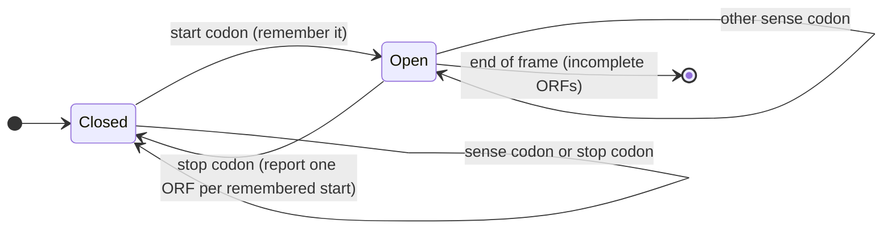

---
aliases:
  - ORF
  - Open Reading Frames
  - ORF Finding
  - Cadre ouvert de lecture
tags:
  - type/concept
  - domain/biology
  - domain/bioinformatics
  - level/L1
  - level/L2
  - level/L3
mastery: 0
prerequisites:
  - "[[Codon]]"
  - "[[Reading Frame]]"
  - "[[Genetic Code]]"
  - "[[Messenger RNA]]"
related:
  - "[[Translation]]"
  - "[[Gene]]"
  - "[[Gene Finding]]"
  - "[[Gene Annotation]]"
  - "[[Geometric Distribution]]"
  - "[[Proteogenomics]]"
  - "[[Nonsense-Mediated Decay]]"
  - "[[Big O Notation]]"
projects:
  - "[[02-sequence-translation]]"
sources:
  - "[[Molecular Biology of the Cell (Alberts)]]"
  - "[[Rosalind]]"
  - "[[NCBI Genetic Codes]]"
  - "[[Blattner 1997 - The Complete Genome Sequence of Escherichia coli K-12]]"
---

# Open Reading Frame

> [!abstract]
> An open reading frame is a stretch of sequence that a ribosome could translate from start to finish: a start codon, then codons without any stop, then a stop codon. Finding all of them in the six frames is the first way to look for genes in raw DNA.

## Definition

An **open reading frame (ORF)** is a segment of a [[Reading Frame|reading frame]] that begins with a start codon and continues, codon by codon, up to and including the first in-frame stop codon, with no stop codon in between. It is a sequence that could in principle be translated into a protein: a computational candidate for a coding sequence, not proof of a gene.[^rosalind][^alberts] Some authors call "open" any stretch between two in-frame stop codons, with or without a start; the choice is part of the definition to state (Deeper section).

## Why it matters

- **The core task of [[02-sequence-translation]].** Given a DNA sequence, list every ORF in the six frames, with coordinates, strand and translation. Rosalind's "Open Reading Frames" problem asks for exactly this, as the set of distinct candidate proteins.[^rosalind]
- **First gene-finding method.** In genomes with few or no introns, such as those of bacteria, a long ORF is a good gene candidate; modern gene finders refine this idea with statistical models ([[Gene Finding]]).[^alberts]
- **Quality control of annotations.** An annotated CDS should be a complete ORF under its translation table, which GenBank records give for each coding sequence; checking it catches truncated records, wrong tables and sequence errors (Exercise 6).[^ncbi]

## Core (L1)

**The ingredients.**[^rosalind][^ncbi][^alberts]

| Element | Standard choice | Note |
|---|---|---|
| start codon | ATG (AUG in RNA) | other tables also allow starts such as GTG or TTG in bacteria ([[Genetic Code#Deeper (L2)]]) |
| body | sense codons only | no stop codon in the frame between start and end |
| stop codon | TAA, TAG or TGA | the first one in frame after the start |
| length | a multiple of 3 | counted in codons, with or without the stop |
| where | any of the six frames | ORFs on the `-` strand are read on the reverse complement |

**Nested ORFs.** Every ATG in a frame before the same stop codon starts its own ORF; they all end at that stop. The **longest** one starts at the first ATG after the previous stop; the others are nested inside it, shorter at the N-terminus. Whether to report all of them or only the longest is a choice.

```text
frame +3 of the worked example (positions 0-based on the + strand)
                 2   5   8   11  14
                 ATG AAA ATG CCC TAG
longest ORF      [M   K   M   P   *]      2..17
nested ORF               [M   P   *]      8..17
```

**Finding all ORFs**, the procedure:

1. Enumerate the six frames of the sequence ([[Reading Frame]]).
2. In each frame, read the codons 5' → 3' and remember the position of every start codon met since the last stop.
3. At a stop codon, each remembered start defines an ORF ending here (the first one is the longest); then forget them all.
4. At the end of the frame, starts still remembered have no stop: they are **incomplete** ORFs, reported only if asked for.
5. Convert the coordinates of minus-strand ORFs to the plus strand.



## Deeper (L2)

**Definitions in use.** Tools and papers make different choices, which change the output a lot:

| Choice | Options | Effect |
|---|---|---|
| start | ATG only; table-specific alternative starts; no start (stop to stop) | alternative starts lengthen or add ORFs; stop-to-stop gives the maximal open stretches |
| nesting | all starts; longest only | all starts can multiply the number of ORFs (Exercise 3) |
| minimum length | none; a fixed number of codons | the main filter against chance ORFs (Advanced section) |
| ends | complete only; also incomplete ORFs running off the sequence | incomplete ORFs matter at contig ends and in reads |
| coordinates | stop included or not; 0- or 1-based; strand-relative or plus-strand | must be stated with every output |

**Alternative starts.** NCBI lists, for each translation table, the codons allowed as starts; in bacterial genomes some genes start with GTG or TTG.[^ncbi] A start codon used as start is read as (formyl)methionine, so every ORF protein begins with M whatever its first codon ([[Translation#Deeper (L2)]]).[^alberts]

**Cost.** Each frame is scanned once, so finding stops and starts takes $O(n)$ time for a sequence of $n$ bases ([[Big O Notation]]). Reporting nested ORFs costs, on top of that, the size of the output, which can grow quadratically: a frame reading $\text{ATG}^k\,\text{TAA}$ has $k$ nested ORFs whose proteins total $k(k+1)/2$ residues (Exercise 3). Keeping only the longest ORF per stop guarantees $O(n)$ output.

**Introns break ORFs.** In eukaryotes the coding sequence of a gene is split by introns, so an ORF scan of genomic DNA finds exon-sized fragments, often in different frames, rather than whole genes.[^alberts] ORF finding works directly on mRNA or cDNA sequences ([[Messenger RNA]]), or on intron-poor genomes; for eukaryotic genomes, gene finders model splice sites as well ([[Gene Finding]]).

## Advanced (L3)

**Chance ORFs: the null model.** In a random sequence with independent, uniform bases, a codon is ATG with probability $1/64$ and a stop with probability $q = 3/64$. The expected number of ORFs with at least $L$ sense codons, counting nested ones, in the six frames of $n$ bases is about

$$E_L \approx 2n \cdot \frac{1}{64} \left(\frac{61}{64}\right)^{L-1},$$

since there are about $2n$ codon positions in six frames ([[Reading Frame#Mathematical representation]]). For $n = 10^6$ and $L = 100$: $E \approx 270$, and a simulation finds 264 (Exercise 5). Scaled to the 4,639,221-bp *E. coli* K-12 chromosome, whose 1997 annotation listed 4,288 protein-coding genes, random sequence of the same length would already produce about 900 ORFs of 100 codons or more (longest per stop), about 1,250 counting nested ones.[^blattner] Length alone cannot separate genes from chance, especially in GC-rich genomes where stops are rarer ([[Genetic Code#Exercises]]); gene finders add codon composition and other evidence ([[Gene Finding]]).

**Short real ORFs.** The converse error is as real: any length threshold discards genuine short proteins, and short ORFs such as upstream ORFs in 5' UTRs lie in the path of scanning ribosomes ([[Messenger RNA#Deeper (L2)]]). Telling them apart from chance ORFs needs evidence beyond the sequence: conservation between species, or peptides detected by mass spectrometry ([[Comparative Genomics]], [[Proteogenomics]]).

**Premature stops.** A nonsense variant creates a stop inside an ORF and shortens it; in eukaryotes the resulting mRNA may be degraded before much truncated protein is made ([[Nonsense-Mediated Decay]], [[Nonsense Mutation]]).[^alberts] Recomputing the ORF of a variant transcript is the first step of predicting such an effect ([[Variant Effect Prediction]]).

**When a real CDS is not an ORF.** Selenocysteine genes have an in-frame UGA; programmed frameshifting joins two frames ([[Reading Frame#Deeper (L2)]]); a gene read with the wrong table shows false stops; partial records lack their start or stop.[^alberts][^ncbi] ORF rules are a default, not a law.

## Mathematical representation

Fix a strand and a frame, with codons $c_0, \dots, c_{m-1}$. Let $S$ be the set of start codons and $T$ the set of stop codons of the translation table.

- An **ORF** is a pair $(a, b)$ with $0 \le a < b < m$, $c_a \in S$, $c_b \in T$ and $c_k \notin T$ for $a \le k < b$. It has $b - a$ sense codons (the protein length) and spans nucleotides $[f + 3a,\ f + 3b + 3)$ of the strand, stop included.
- **Structure.** Let $b_1 < b_2 < \dots$ be the positions of stop codons and $b_0 = -1$. The ORFs ending at $b_i$ are the pairs $(a, b_i)$ with $b_{i-1} < a < b_i$ and $c_a \in S$; the longest has the smallest such $a$. The number of ORFs in the frame is the number of start codons followed, somewhere downstream in the frame, by a stop.
- **Stop-to-stop segments.** Under the null model with independent codons, the number of sense codons between two consecutive stops is geometric: $P(\text{run} = r) = (1 - q)^r q$, mean $(1-q)/q = 61/3 \approx 20.3$ ([[Geometric Distribution]]).
- **Expected ORF count.** A position starts an ORF of at least $L$ sense codons if it is a start codon and the next $L - 1$ codons are not stops. Summing over the $\approx 2n$ codon positions of the six frames and ignoring end effects gives $E_L \approx 2n\, p_S (1-q)^{L-1}$ with $p_S = |S|/64$.

## Computational representation

One left-to-right pass per frame; each ORF is a record with plus-strand coordinates (0-based, half-open, stop included):

```python
from typing import Iterator, NamedTuple

BASES = "TCAG"
CODE = dict(zip((a + b + c for a in BASES for b in BASES for c in BASES),
                "FFLLSSSSYY**CC*WLLLLPPPPHHQQRRRRIIIMTTTTNNKKSSRRVVVVAAAADDEEGGGG"))  # NCBI table 1
COMPLEMENT = str.maketrans("ACGT", "TGCA")


class ORF(NamedTuple):
    strand: str      # "+" or "-"
    frame: int       # 1, 2, 3: offset + 1 from the 5' end of its strand
    start: int       # + strand coordinates, 0-based half-open, stop codon included
    end: int
    protein: str     # translation from the start codon, stop excluded (first residue always M)


def find_orfs(dna: str, starts=frozenset({"ATG"}), nested: bool = True,
              min_codons: int = 1) -> Iterator[ORF]:
    """All start-to-stop ORFs in the six frames, in one left-to-right pass per frame.
    nested=True reports every in-frame start before a stop (they share the stop);
    nested=False keeps only the longest one per stop. min_codons counts sense codons."""
    dna, n = dna.upper(), len(dna)
    for strand, seq in (("+", dna), ("-", dna.translate(COMPLEMENT)[::-1])):
        for f in range(3):
            open_starts = []                       # codon offsets of starts since the last stop
            for i in range(f, n - 2, 3):
                codon = seq[i:i + 3]
                aa = CODE.get(codon, "X")
                if aa == "*":
                    for s in (open_starts if nested else open_starts[:1]):
                        if (i - s) // 3 >= min_codons:
                            prot = "M" + "".join(CODE.get(seq[k:k + 3], "X") for k in range(s + 3, i, 3))
                            a, b = s, i + 3
                            if strand == "-":
                                a, b = n - b, n - a
                            yield ORF(strand, f + 1, a, b, prot)
                    open_starts = []
                elif codon in starts:
                    open_starts.append(i)


toy = "CCATGAAAATGCCCTAGGCTTAAAACATGG"          # invented
for orf in find_orfs(toy):
    print(orf)
print([o.protein for o in find_orfs(toy, nested=False)])

sample = ("AGCCATGTAGCTAACTCAGGTTACATGGGGATGACCCCGCGACTTGGATTAGAGTCTCTTTTGGAATAAG"
          "CCTGAATGATCCGAGTAGCATCTCAG")      # sample dataset of the Rosalind problem "ORF"
print(sorted({o.protein for o in find_orfs(sample)}, key=len, reverse=True))
```

```text
ORF(strand='+', frame=3, start=2, end=17, protein='MKMP')
ORF(strand='+', frame=3, start=8, end=17, protein='MP')
ORF(strand='-', frame=3, start=19, end=28, protein='MF')
['MKMP', 'MF']
['MLLGSFRLIPKETLIQVAGSSPCNLS', 'MGMTPRLGLESLLE', 'MTPRLGLESLLE', 'M']
```

The last line reproduces the four proteins expected for Rosalind's sample dataset.[^rosalind] Differences from the shorter `find_orfs` of [[Genetic Code#Computational representation]]: a configurable start set, nested ORFs, a minimum length and typed records. Codons containing `N` translate to `X` and never count as starts or stops.

## Worked example

> [!example] All ORFs of `5'-CCATGAAAATGCCCTAGGCTTAAAACATGG-3'` (invented, 30 nt)
> 1. **Plus frames.** +1 (`CCA TGA AAA ...`) and +2 (`CAT GAA AAT ...`) contain no ATG codon. +3 reads `ATG AAA ATG CCC TAG GCT TAA AAC ATG`: two starts before the stop TAG (positions 2 and 8), then a second stop TAA with no start before it, then an ATG at 26 that reaches the end without a stop.
> 2. **Plus ORFs.** $(2, 17)$ Met-Lys-Met-Pro and its nested $(8, 17)$ Met-Pro. The ATG at 26 is an incomplete ORF, not reported.
> 3. **Reverse complement**: `CCATGTTTTAAGCCTAGGGCATTTTCATGG`. Frame −3 (offset 2) reads `ATG TTT TAA`: Met-Phe then stop, at offsets 2 to 11, i.e. plus positions $[30 - 11, 30 - 2) = [19, 28)$. Frame −3 also has an ATG at its end (plus positions $[1, 4)$, `CAT` read backwards) without a stop: incomplete.
> 4. **Result.** Three complete ORFs, two if only the longest per stop is kept: `MKMP` and `MF`, as printed above. With 1 to 4 codons, all are far below what chance alone would not produce (Advanced section): ORFs, not genes.

## Common misconceptions

> [!warning] "An ORF is a gene"
> An ORF is a string pattern. Random DNA contains many, many ORFs are never expressed, a gene needs evidence of a functional product, and RNA genes have no ORF ([[Gene#Advanced (L3)]]).[^alberts]

> [!warning] "Every ATG starts an ORF"
> An ATG starts an ORF only if an in-frame stop follows before the sequence ends; and among the ATGs before one stop, only the first gives the longest ORF, the others are nested. A tool's count of ORFs depends on which of these it reports.

> [!warning] "Longer ORF, surely a gene; short ORF, surely not"
> Chance produces long ORFs in large or GC-rich genomes, and real proteins can be short. Length is a score, not a verdict.

## Exercises

> [!question] Exercise 1 (L1)
> Find all ORFs (ATG to stop, nested included) in frame +1 of `ATGAAATAGATGCCCATGTGA`, with their 0-based coordinates and proteins.

> [!success]- Solution
> Codons: ATG AAA TAG ATG CCC ATG TGA. First stop TAG closes the ORF started at 0: $(0, 9)$ `MK`. Before the stop TGA, two starts at 9 and 15: $(9, 21)$ `MPM` and the nested $(15, 21)$ `M`. `find_orfs` returns these three records for frame +1 (and no ORF in the other frames).

> [!question] Exercise 2 (L1)
> Under the ATG-to-stop definition with the standard table, is each sequence an ORF? (a) `ATGAAACCCTAA` (b) `ATGTAAGGGTGA` (c) `ATGAAACCTAG` (d) `GTGAAATAA` (e) `AAATTTTAG`

> [!success]- Solution
> (a) Yes: ATG AAA CCC TAA. (b) No: TAA at codon 2 is an internal stop; only `ATGTAA` is an ORF. (c) No: 11 nt, ATG AAA CCT then `AG`, no in-frame stop: incomplete. (d) Only with a table that allows GTG as start, such as the bacterial one. (e) No start: it is an open stop-to-stop segment, an ORF only under that other definition.

> [!question] Exercise 3 (L2)
> A frame reads $\text{ATG}^k\,\text{TAA}$. How many ORFs are there with and without nesting, and how many protein letters does each option output? Evaluate for $k = 1000$.

> [!success]- Solution
> With nesting, each of the $k$ ATGs starts an ORF ending at TAA; the ORF from the $j$-th ATG has $k - j + 1$ residues, so the output totals $\sum_{j=1}^{k} (k - j + 1) = k(k+1)/2$ letters: 500,500 for $k = 1000$, from a 3,003-nt input. Without nesting: one ORF of $k = 1000$ residues. Output-sensitive algorithms are $O(n + \text{output})$; this input makes the output quadratic in $n$.

> [!question] Exercise 4 (L2, Python)
> Run `find_orfs` on the invented `GTGAAACATATGCCCTGA` with the default start set and with `starts={"ATG", "GTG", "TTG"}`. Explain the difference.

> [!success]- Solution
> ```python
> t = "GTGAAACATATGCCCTGA"
> print([o.protein for o in find_orfs(t)])
> print([o.protein for o in find_orfs(t, starts={"ATG", "GTG", "TTG"})])
> ```
> Output: `['MP']`, then `['MKHMP', 'MP']`. Frame +1 reads GTG AAA CAT ATG CCC TGA. With ATG only, the ORF starts at 9. Allowing GTG adds an ORF from 0, whose first residue is written M because a start codon is read as methionine; the ATG ORF becomes nested inside it. Which start the cell uses is not decided by the sequence alone.

> [!question] Exercise 5 (L3, Python)
> Generate a random 1-Mb sequence (seed 1), count the nested and the longest ORFs of at least 100 sense codons, and compare with $E_L$. Then scale to the *E. coli* K-12 chromosome and compare with its 4,288 annotated protein-coding genes.

> [!success]- Solution
> ```python
> import random
>
> random.seed(1)
> n, L = 1_000_000, 100
> genome = "".join(random.choices("ACGT", k=n))          # random sequence: the null model
> q = 3 / 64
> nested = sum(1 for _ in find_orfs(genome, min_codons=L))
> longest = sum(1 for _ in find_orfs(genome, nested=False, min_codons=L))
> print("nested ORFs >= 100 codons:", nested, "expected", round(2 * n / 64 * (1 - q) ** (L - 1)))
> print("longest ORFs >= 100 codons:", longest)
> ```
> Output: `nested ORFs >= 100 codons: 264 expected 270`, then `longest ORFs >= 100 codons: 195`. The formula fits the simulation. Scaling by $4{,}639{,}221 / 10^6 \approx 4.64$: about 1,250 nested and 900 longest chance ORFs for a random sequence the size of the *E. coli* chromosome, against 4,288 annotated genes.[^blattner] A real genome is not a random sequence, but the comparison shows that a 100-codon threshold alone would admit hundreds of false genes.

> [!question] Exercise 6 (L3, Python)
> Write `cds_problems(cds, table, starts)` that lists why an annotated CDS is not a complete ORF (length, start, final stop, internal stops) under NCBI table 1 or 2. Apply it to the invented records `ATGGCTTGGAAATAA`, `GCTTGGAAATAA`, `ATGGCTTGAAAATAA` (with table 1, then table 2) and `ATGGCTTGGAATAA`, and interpret each result.

> [!success]- Solution
> ```python
> BASES = "TCAG"
> TABLES = {1: "FFLLSSSSYY**CC*WLLLLPPPPHHQQRRRRIIIMTTTTNNKKSSRRVVVVAAAADDEEGGGG",
>           2: "FFLLSSSSYY**CCWWLLLLPPPPHHQQRRRRIIMMTTTTNNKKSS**VVVVAAAADDEEGGGG"}
> CODONS = [a + b + c for a in BASES for b in BASES for c in BASES]
>
>
> def cds_problems(cds: str, table: int = 1, starts=frozenset({"ATG"})) -> list[str]:
>     """Reasons why an annotated CDS is not a complete ORF under a translation table (empty = OK)."""
>     code = dict(zip(CODONS, TABLES[table]))
>     problems = []
>     if len(cds) % 3:
>         problems.append(f"length {len(cds)} not a multiple of 3")
>     codons = [cds[i:i + 3] for i in range(0, len(cds) - 2, 3)]
>     if not codons or codons[0] not in starts:
>         problems.append(f"no start codon ({codons[0] if codons else '-'})")
>     if not codons or code.get(codons[-1]) != "*":
>         problems.append("no final stop codon")
>     internal = [k + 1 for k, c in enumerate(codons[:-1]) if code.get(c) == "*"]
>     if internal:
>         problems.append(f"internal stop at codon {internal}")
>     return problems
>
>
> examples = {                                   # all invented
>     "complete":      ("ATGGCTTGGAAATAA", 1),
>     "5' partial":    ("GCTTGGAAATAA", 1),
>     "internal TGA":  ("ATGGCTTGAAAATAA", 1),
>     "same, table 2": ("ATGGCTTGAAAATAA", 2),
>     "indel error":   ("ATGGCTTGGAATAA", 1),
> }
> for name, (cds, table) in examples.items():
>     print(f"{name:14}", cds_problems(cds, table) or "complete ORF")
> ```
> Output, in order: `complete ORF`; `['no start codon (GCT)']`; `['internal stop at codon [3]']`; `complete ORF`; `['length 14 not a multiple of 3', 'no final stop codon']`. The second record lacks its start: a partial CDS, typical at the edge of a contig. The third has TGA at codon 3: a stop under table 1, but tryptophan under the vertebrate mitochondrial table 2, so it is complete once the right table is used.[^ncbi] The last lost one base: its length is no longer a multiple of 3 and the frame runs past the real stop, the signature of a sequencing indel or a frameshift. A real validator would also allow the table's alternative starts and flag, rather than reject, known exceptions such as selenocysteine.

## Mastery checklist

- [ ] 1 Recognized: I can define an ORF (start codon, no internal stop, stop codon) and say why it is a candidate, not a gene.
- [ ] 2 Understood: I can explain nested versus longest ORFs, alternative starts, incomplete ORFs, and why introns break ORFs in eukaryotic genomic DNA.
- [ ] 3 Practiced: I can find all ORFs of a sequence in six frames by hand and with an $O(n)$ scan, with correct plus-strand coordinates, and I solved Rosalind's ORF problem.
- [ ] 4 Applied: in [[02-sequence-translation]], my ORF finder runs on a real bacterial genome, and I compare its long ORFs with the annotated genes.
- [ ] 5 Explained: I can teach the null model of chance ORFs, the limits of length thresholds, and the cases where true CDSs break ORF rules.

## References

[^rosalind]: [[Rosalind]], problem "Open Reading Frames" (ORF): definition of an ORF as start codon to stop codon without intervening stop, and the sample dataset reproduced above.
[^alberts]: [[Molecular Biology of the Cell (Alberts)]], 4th ed. (2002), treatment of genome sequence analysis (open reading frames as gene candidates), split genes, translation initiation, selenocysteine, and mRNA surveillance.
[^ncbi]: [[NCBI Genetic Codes]], "The Genetic Codes" (NCBI Taxonomy): translation tables, their alternative start codons, and the `/transl_table` qualifier of GenBank coding sequences.
[^blattner]: [[Blattner 1997 - The Complete Genome Sequence of Escherichia coli K-12]], *Science*: 4,639,221 bp and 4,288 annotated protein-coding genes.
