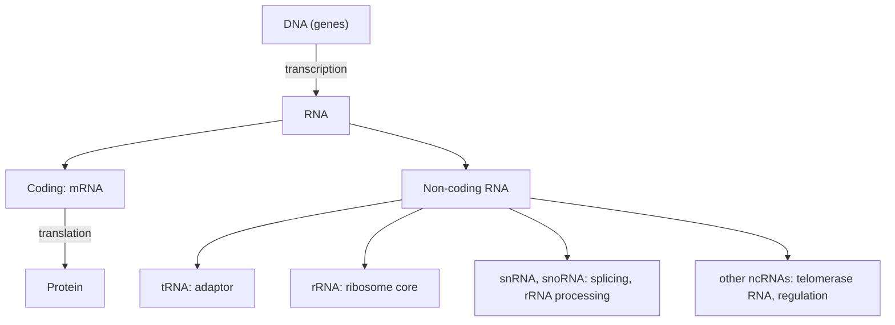

---
aliases:
  - Ribonucleic Acid
  - ARN
  - Acide ribonucléique
tags:
  - type/concept
  - domain/biology
  - domain/bioinformatics
  - level/L1
  - level/L2
  - level/L3
mastery: 0
prerequisites:
  - "[[Nucleotide]]"
  - "[[DNA]]"
related:
  - "[[Central Dogma]]"
  - "[[Transcription]]"
  - "[[Translation]]"
  - "[[RNA Processing]]"
  - "[[Non-Coding RNA]]"
  - "[[Gene Expression]]"
projects:
  - "[[02-sequence-translation]]"
  - "[[bio-core]]"
sources:
  - "[[Biology 2e (OpenStax)]]"
  - "[[Molecular Biology of the Cell (Alberts)]]"
  - "[[Biochemistry (Berg)]]"
  - "[[Gilbert 1986 - The RNA World]]"
  - "[[Zuker 1981 - Optimal Computer Folding of Large RNA Sequences]]"
---

# RNA

> [!abstract]
> RNA is DNA's single-stranded chemical cousin: it copies genetic messages out of DNA, helps turn them into proteins, and folds into shapes that let it do many other jobs.

## Definition

**Ribonucleic acid (RNA)** is a polymer of ribonucleotides (bases A, C, G, U) joined by 3'-5' phosphodiester bonds. It is usually single-stranded and folds by pairing with itself. RNA molecules carry genetic information from DNA (messenger RNA), take part in protein synthesis (transfer and ribosomal RNA) and perform structural, catalytic and regulatory roles.[^openstax][^alberts]

## Why it matters

- **Transcriptomics** measures RNA: [[RNA Sequencing|RNA-seq]], single-cell and long-read transcript studies quantify which RNAs a cell makes ([[Transcriptomics]], [[Gene Expression]]).
- RNA is usually sequenced after being copied into complementary DNA (cDNA) by reverse transcriptase ([[Reverse Transcription]]), so RNA-derived reads and many transcript sequences are written in the DNA alphabet (T, not U).[^alberts]
- Gene annotation distinguishes the genomic DNA from its mature RNA products (exons, splice variants, untranslated regions): see [[RNA Processing]] and [[Gene Annotation]].
- RNA structure prediction by [[Dynamic Programming]] is one of the classic algorithms of bioinformatics.[^zuker]

## Core (L1)

**DNA vs RNA**:[^openstax][^alberts]

| Property | DNA | RNA |
|---|---|---|
| Sugar | deoxyribose (2'-H) | ribose (2'-OH) |
| Bases | A, C, G, **T** | A, C, G, **U** |
| Strands | usually double helix | usually single strand, folded |
| Typical length | whole chromosomes | a gene-sized copy or shorter |
| Main role | long-term storage | message, adaptor, machine, regulator |

**Main types** (in cells, all made by [[Transcription]] of DNA):[^openstax][^alberts]

- **mRNA** ([[Messenger RNA|messenger]]): carries the coding sequence of a gene to the ribosome, where it is read three bases at a time ([[Genetic Code]], [[Translation]]).
- **tRNA** ([[Transfer RNA|transfer]]): short adaptor that carries an amino acid and recognizes a codon through its anticodon.
- **rRNA** (ribosomal): the main structural and catalytic component of the [[Ribosome|ribosome]].
- **Other non-coding RNAs**: for example snRNAs in splicing and snoRNAs in the processing and chemical modification of rRNA; other non-coding RNAs take part in telomere synthesis, X-chromosome inactivation and protein targeting ([[Non-Coding RNA]]).[^alberts]



## Deeper (L2)

![[rna-stem-loop.svg]]

**Secondary structure** ([[RNA Secondary Structure]]). A single strand folds back on itself wherever two segments are complementary in antiparallel orientation. Paired segments form short double helices (**stems**) closed by unpaired **loops**: hairpin loops at the tip of a stem, bulges (unpaired bases on one side), internal loops (on both sides) and multi-branch junctions. Besides A-U and G-C, RNA helices commonly contain **G-U wobble** pairs.[^alberts] tRNA is the textbook example: its pairing pattern draws a cloverleaf, which folds further into an L-shaped 3D structure.[^alberts]

**Chemical stability.** The 2'-OH of ribose can attack the neighboring phosphodiester bond, so RNA is hydrolyzed far more easily than DNA (for example by alkali).[^berg] mRNAs are also degraded by ribonucleases at regulated rates, which lets the cell change the level of a message quickly ([[Gene Regulation]]).[^alberts]

**Eukaryotic mRNA is processed.** The primary transcript receives a 5' cap, loses its introns by splicing and gains a 3' poly(A) tail before export from the nucleus; bacterial mRNA is translated directly, often while still being transcribed.[^alberts] Details in [[RNA Processing]] and [[Alternative Splicing]].

**Catalytic RNA.** Some RNAs are enzymes (ribozymes): self-splicing introns and the RNA subunit of RNase P catalyze reactions, and in the ribosome the peptide bond is formed by rRNA, not by a protein.[^alberts]

## Advanced (L3)

- **The RNA world hypothesis.** Because RNA can both store sequence information and catalyze reactions, it has been proposed that early life relied on RNA alone, before DNA (a more stable store) and proteins (better catalysts) took over; Gilbert named this stage "the RNA world" in 1986.[^gilbert][^alberts] Supporting observations: ribozymes exist today, and the ribosome's catalytic core is RNA.[^alberts] It remains a hypothesis about origins, not an established history.
- **RNA genomes.** Many [[Virus|viruses]] have RNA genomes and copy them with RNA-dependent polymerases, and retroviruses copy their RNA into DNA ([[Central Dogma#Deeper (L2)]]).[^alberts]
- **Predicting structure.** Zuker and Stiegler (1981) computed optimal secondary structures by dynamic programming over nested base pairs, minimizing a free energy built from experimental parameters.[^zuker] The simplest version of this idea maximizes the number of pairs (Exercise 5). Nested structures exclude **pseudoknots**, which occur in real RNAs and require costlier algorithms ([[RNA Secondary Structure Prediction]]).
- **Structure outlives sequence.** Because pairing, not exact sequence, holds a structure together, two homologous RNAs can keep the same fold while differing at paired positions, provided both partners change together (G-C → A-U). Such compensatory changes, found by comparing homologs, are evidence for a conserved structure ([[Molecular Evolution]]).

## Mathematical representation

- An RNA is a word $r = r_1 \dots r_n$ over $\Sigma_{\text{RNA}} = \{A, C, G, U\}$, written 5' → 3'.
- Allowed pairs: $\mathcal{P} = \{AU, UA, GC, CG, GU, UG\}$.
- A **secondary structure** is a set $S$ of index pairs $(i, j)$ with $i < j$ such that: (1) $r_i r_j \in \mathcal{P}$; (2) every position is in at most one pair; (3) hairpin loops have at least $m$ unpaired bases, $j - i > m$ (commonly $m = 3$); (4) pairs are **nested**: for $(i, j), (k, l) \in S$ with $i < k$, either $j < k$ (side by side) or $l < j$ (inside). The forbidden case $i < k < j < l$ is a pseudoknot.
- Nested structures correspond exactly to balanced-parenthesis words over $\{(, ), .\}$: the **dot-bracket** notation.
- **Base-pair maximization** (the [[Nussinov Algorithm|Nussinov]] recurrence). Let $N(i, j)$ be the maximum number of pairs in $r_i \dots r_j$, with $N(i, j) = 0$ when $j - i \le m$. Then
$$N(i,j) = \max\Big\{ N(i+1, j),\; N(i, j-1),\; N(i+1, j-1) + \delta(i,j),\; \max_{i < k < j} \big[N(i,k) + N(k+1,j)\big] \Big\}$$
where $\delta(i,j) = 1$ if $r_i r_j \in \mathcal{P}$ and $-\infty$ otherwise. It runs in $O(n^3)$ time and $O(n^2)$ memory.

## Computational representation

- **Sequence**: FASTA, in $\{A, C, G, U\}$ or, for cDNA-derived data, $\{A, C, G, T\}$. Converting is `seq.replace("T", "U")`.
- **Structure**: dot-bracket string of the same length as the sequence, or an explicit list of pairs.

```python
ALLOWED = {("A", "U"), ("U", "A"), ("G", "C"), ("C", "G"), ("G", "U"), ("U", "G")}


def pairs_from_dot_bracket(structure: str) -> list[tuple[int, int]]:
    """Base pairs (i, j), 0-based, from dot-bracket notation; raises on unbalanced brackets."""
    stack, pairs = [], []
    for j, symbol in enumerate(structure):
        if symbol == "(":
            stack.append(j)
        elif symbol == ")":
            if not stack:
                raise ValueError(f"unmatched ')' at position {j + 1}")
            pairs.append((stack.pop(), j))
        elif symbol != ".":
            raise ValueError(f"unexpected symbol {symbol!r}")
    if stack:
        raise ValueError(f"unmatched '(' at position {stack[-1] + 1}")
    return sorted(pairs)


def check_structure(seq: str, structure: str) -> list[str]:
    report = []
    for i, j in pairs_from_dot_bracket(structure):
        pair = (seq[i], seq[j])
        kind = "wobble" if pair in {("G", "U"), ("U", "G")} else "Watson-Crick"
        report.append(f"{i + 1}-{j + 1} {seq[i]}-{seq[j]} {kind if pair in ALLOWED else 'NOT ALLOWED'}")
    return report


seq, db = "GGUCGAAAGGCC", "((((....))))"  # toy hairpin
print(*check_structure(seq, db), sep="\n")
```

```text
1-12 G-C Watson-Crick
2-11 G-C Watson-Crick
3-10 U-G wobble
4-9 C-G Watson-Crick
```

A stack matches brackets in one pass, $O(n)$: the same algorithm as checking parentheses in code.

## Worked example

> [!example] Why the toy RNA `GGUCGAAAGGCC` folds into a hairpin
> 1. **Look for an inverted repeat.** The 5' segment `GGUC` (positions 1-4) and the 3' segment `GGCC` (positions 9-12) can pair antiparallel: read the 3' segment backwards (12 → 9) under the first one.
> ```text
> 5'  G G U C  -->
>     | | : |        | = Watson-Crick, : = wobble
> 3'  C C G G  <--   (positions 12, 11, 10, 9)
> ```
> 2. **Pairs.** G1-C12, G2-C11, U3-G10 (wobble), C4-G9. Strict DNA-style reverse complementarity would require `GACC` on the 3' side; the wobble pair tolerates G at position 10.
> 3. **Loop.** Positions 5-8 (`GAAA`) stay unpaired: a 4-nucleotide hairpin loop, above the minimum of 3.
> 4. **Dot-bracket.** `((((....))))`, validated by the code above.

## Common misconceptions

> [!warning] "RNA is just a disposable copy of DNA"
> mRNA is a copy, but rRNA and tRNA are end products: their genes never make protein, and rRNA itself catalyzes peptide-bond formation in the ribosome.[^alberts]

> [!warning] "RNA is single-stranded, so it has no structure"
> Single-stranded means one chain, not a floppy one: most of a structured RNA is paired into short helices by intramolecular base pairing, and this structure determines function.[^alberts]

> [!warning] "U only pairs with A"
> In RNA, G-U wobble pairs are common inside helices and also occur between codon and anticodon ([[Genetic Code]]).[^alberts]

> [!warning] "An RNA sequence file always contains U"
> Most RNA sequencing reads a cDNA copy, and many transcript records are stored with T. Treat T and U as the same letter when comparing RNA-derived sequences.[^alberts]

## Exercises

> [!question] Exercise 1 (L1)
> Give three chemical or structural differences between DNA and RNA, and one functional consequence of each.

> [!success]- Solution
> (1) Ribose has a 2'-OH: RNA is less chemically stable, suited to short-lived messages. (2) U replaces T: the cell can treat U in DNA as damage (see [[Nucleotide#Deeper (L2)]]). (3) RNA is usually single-stranded: it can fold into diverse shapes and act as an adaptor or catalyst.

> [!question] Exercise 2 (L1)
> The coding strand of a toy gene is `5'-ATGGCATTC-3'`. Write the mRNA. Which DNA strand served as template?

> [!success]- Solution
> The mRNA has the coding-strand sequence with U for T: `5'-AUGGCAUUC-3'`. The template is the other strand, `3'-TACCGTAAG-5'` (reverse complement `GAATGCCAT` written 5' → 3'). Mechanism in [[Transcription]].

> [!question] Exercise 3 (L2)
> For the structure `((((...))..))` (13 nt), list the base pairs (1-based) and name the two loops.

> [!success]- Solution
> Pairs: 1-13, 2-12, 3-9, 4-8 (the code returns `[(0, 12), (1, 11), (2, 8), (3, 7)]` 0-based). Positions 5-7 form a 3-nucleotide **hairpin loop**. Positions 10-11 are unpaired on the 3' side only, between pairs 3-9 and 2-12: a **bulge**.

> [!question] Exercise 4 (L2, Python)
> Run `check_structure("GGACGAAAGACC", "((((....))))")`. Which pair is impossible, and which single substitution in the 3' arm would repair it with a Watson-Crick pair?

> [!success]- Solution
> Output: `1-12 G-C Watson-Crick`, `2-11 G-C Watson-Crick`, `3-10 A-A NOT ALLOWED`, `4-9 C-G Watson-Crick`. Position 3 is A, so position 10 must be U: `GGACGAAAGUCC` gives an A-U pair.

> [!question] Exercise 5 (L3, Python)
> Implement the base-pair maximization recurrence with a traceback to dot-bracket ($m = 3$). Run it on `GGUCGAAAGGCC` and on the toy `GGGAAACCCAGGGAAACCC`.

> [!success]- Solution
> ```python
> ALLOWED = {("A", "U"), ("U", "A"), ("G", "C"), ("C", "G"), ("G", "U"), ("U", "G")}
>
>
> def nussinov(seq: str, min_loop: int = 3) -> tuple[int, str]:
>     """Maximum number of nested base pairs (Nussinov), with a dot-bracket traceback."""
>     n = len(seq)
>     N = [[0] * n for _ in range(n)]
>     for span in range(min_loop + 1, n):
>         for i in range(n - span):
>             j = i + span
>             best = max(N[i + 1][j], N[i][j - 1])
>             if (seq[i], seq[j]) in ALLOWED:
>                 best = max(best, N[i + 1][j - 1] + 1)
>             for k in range(i + 1, j):
>                 best = max(best, N[i][k] + N[k + 1][j])
>             N[i][j] = best
>     db = ["."] * n
>
>     def trace(i, j):
>         if j - i <= min_loop:
>             return
>         if N[i][j] == N[i + 1][j]:
>             trace(i + 1, j)
>         elif N[i][j] == N[i][j - 1]:
>             trace(i, j - 1)
>         elif (seq[i], seq[j]) in ALLOWED and N[i][j] == N[i + 1][j - 1] + 1:
>             db[i], db[j] = "(", ")"
>             trace(i + 1, j - 1)
>         else:
>             for k in range(i + 1, j):
>                 if N[i][j] == N[i][k] + N[k + 1][j]:
>                     trace(i, k)
>                     trace(k + 1, j)
>                     return
>
>     if n:
>         trace(0, n - 1)
>     return (N[0][n - 1] if n else 0), "".join(db)
>
>
> print(nussinov("GGUCGAAAGGCC"))
> print(nussinov("GGGAAACCCAGGGAAACCC"))
> ```
> Output: `(4, '((((....))))')` and `(6, '(((...))).(((...)))')`. The second sequence has only 6 G and 6 C and no U, so 6 pairs is the maximum; the bifurcation term $N(i,k) + N(k+1,j)$ is what finds two separate hairpins. Real predictors minimize free energy instead, because a maximum number of pairs is not the most stable fold.[^zuker]

> [!question] Exercise 6 (L3)
> Give two observations that support the RNA world hypothesis and one reason it remains a hypothesis.

> [!success]- Solution
> Support: RNA both stores sequence information and catalyzes reactions (ribozymes such as self-splicing introns and RNase P); the ribosome's peptide-bond-forming center is RNA.[^alberts] Limit: these are present-day clues, compatible with an RNA-first origin but not a direct record of it, so the hypothesis explains how things could have happened rather than proving that they did.[^gilbert]

## Mastery checklist

- [ ] 1 Recognized: I can state how RNA differs from DNA and name mRNA, tRNA and rRNA.
- [ ] 2 Understood: I can explain secondary structure (stems, loops, wobble pairs) and why RNA is less stable than DNA.
- [ ] 3 Practiced: I can parse and validate dot-bracket structures and implement base-pair maximization.
- [ ] 4 Applied: I handled real transcript sequences (T vs U, strand, spliced vs genomic) in [[02-sequence-translation]] and modeled RNA in [[bio-core]].
- [ ] 5 Explained: I can explain the RNA world hypothesis with its evidence and limits, and why structure prediction minimizes energy.

## References

[^openstax]: [[Biology 2e (OpenStax)]], Unit 1 "The Chemistry of Life" and ch. 15 "Genes and Proteins".
[^alberts]: [[Molecular Biology of the Cell (Alberts)]], 4th ed. (2002).
[^berg]: [[Biochemistry (Berg)]], 5th ed. (2002).
[^gilbert]: [[Gilbert 1986 - The RNA World]], *Nature* (published as "Origin of life: The RNA world").
[^zuker]: [[Zuker 1981 - Optimal Computer Folding of Large RNA Sequences]], *Nucleic Acids Research* (Zuker and Stiegler).
