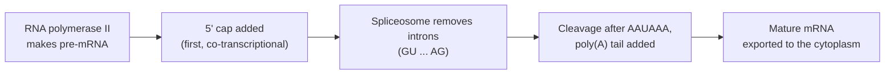

---
aliases:
  - DNA Transcription
  - RNA Synthesis
  - Transcription de l'ADN
tags:
  - type/concept
  - domain/biology
  - domain/bioinformatics
  - level/L1
  - level/L2
  - level/L3
mastery: 0
prerequisites:
  - "[[DNA]]"
  - "[[RNA]]"
  - "[[Base Pairing]]"
  - "[[Central Dogma]]"
related:
  - "[[DNA Replication]]"
  - "[[Translation]]"
  - "[[Gene]]"
  - "[[Promoter]]"
  - "[[RNA Processing]]"
  - "[[Alternative Splicing]]"
  - "[[Gene Expression]]"
  - "[[Gene Regulation]]"
projects:
  - "[[02-sequence-translation]]"
sources:
  - "[[Biology 2e (OpenStax)]]"
  - "[[Molecular Biology of the Cell (Alberts)]]"
  - "[[The Cell (Cooper)]]"
  - "[[Biochemistry (Berg)]]"
  - "[[Crick 1970 - Central Dogma of Molecular Biology]]"
---

# Transcription

> [!abstract]
> Transcription is how a cell copies the sequence of a gene from DNA into RNA, using one DNA strand as a template.

## Definition

**Transcription** is the synthesis of an RNA molecule by an **RNA polymerase** that reads one strand of [[DNA]] (the **template strand**) and assembles ribonucleotides complementary to it. The RNA is therefore antiparallel to the template and has the same sequence as the other strand (the **coding strand**), with U in place of T.[^os15][^alberts] It is the DNA → RNA transfer of the [[Central Dogma]].[^crick70]

## Why it matters

- **Strand and coordinates.** Every gene in a [[GFF Format|GFF]] or [[BED Format|BED]] file has a strand (`+` or `-`). For a `-` gene, the transcript is the reverse complement of the reference sequence shown in the genome FASTA. Getting this wrong silently produces nonsense proteins in [[02-sequence-translation]].
- **Transcriptomics.** RNA sequencing ([[Transcriptomics]]) measures the products of transcription, after [[RNA Processing]]. Because introns are spliced out, reads that cross an exon-exon junction align to the genome in two pieces: aligners for RNA must be splice-aware.
- **Regulatory sequence analysis.** Promoters are short, degenerate motifs upstream of the transcription start site; finding them is a classic [[Sequence Motif]] problem.
- **Isoforms.** [[Alternative Splicing]] makes one [[Gene]] yield several transcripts, so expression can be quantified per gene or per transcript, with different answers.

## Core (L1)

**Template and coding strands.** Only one strand of a gene is read. The template strand is read 3' → 5'; the RNA grows 5' → 3', antiparallel to the template, so its sequence matches the coding strand with U for T.[^os15]

```text
coding strand    5'-ATG GCA TTC GAA TAA-3'   (not read; same letters as the RNA)
template strand  3'-TAC CGT AAG CTT ATT-5'   (read by RNA polymerase)
mRNA             5'-AUG GCA UUC GAA UAA-3'   (complementary to the template)
```

**RNA polymerase** opens a short stretch of the double helix (the transcription bubble), pairs each incoming ribonucleoside triphosphate with the template and adds it to the 3' end of the growing chain. Unlike DNA polymerase, it needs no primer.[^alberts] Which strand serves as template is set gene by gene by the orientation of its promoter, so neighbouring genes can be read from opposite strands.[^alberts]

![[transcription-bubble.svg]]

**Three stages.**[^os15]

1. **Initiation**: the polymerase binds a **[[Promoter]]** upstream of the gene and unwinds the DNA. The first transcribed nucleotide is numbered **+1**; positions upstream are negative (−10, −35), positions downstream positive.
2. **Elongation**: the bubble moves along the gene; behind it the DNA re-forms its double helix and the RNA peels away.
3. **Termination**: a termination signal releases the RNA and the polymerase.

**Products.** Transcription makes messenger RNA (mRNA), which is later translated, and also RNAs that are never translated, such as ribosomal and transfer RNAs ([[Non-Coding RNA]]).[^alberts]

## Deeper (L2)

### Bacteria: one polymerase, sigma factors

In *E. coli* a single RNA polymerase transcribes all genes. Its core enzyme (subunits α, α, β, β') becomes the **holoenzyme** when a **σ factor** binds; σ recognizes the promoter and is needed only for initiation.[^os15] The two conserved promoter elements have consensus sequences **TTGACA** at −35 and **TATAAT** at −10; real promoters match them only approximately.[^os15]

```text
             -35                  -10         +1
5'-......TTGACA.................TATAAT.......A......-3'   coding strand
```

Termination is either **rho-dependent** (the rho protein follows the polymerase and pulls the RNA off) or **rho-independent**, when the RNA folds into a GC-rich hairpin followed by a run of U residues, which destabilizes the complex.[^os15] Because bacteria have no nucleus, ribosomes can start translating an mRNA while it is still being transcribed.[^os15]

### Eukaryotes: three polymerases, general factors, chromatin

| Polymerase | Main products |
|---|---|
| RNA polymerase I | most ribosomal RNAs (28S, 18S, 5.8S) |
| RNA polymerase II | mRNA precursors and several small nuclear RNAs |
| RNA polymerase III | tRNAs, 5S rRNA and other small RNAs |

(Table after [^os15][^alberts].) RNA polymerase II cannot recognize a promoter on its own. **General transcription factors** assemble first: TFIID, through its TATA-binding protein, binds the **TATA box**, an A/T-rich element located roughly 25 to 30 nucleotides upstream of +1; TFIIH later phosphorylates the C-terminal tail of the polymerase, which releases it into elongation.[^alberts][^os15] In cells, activators bound to distant [[Enhancer|enhancers]], the Mediator complex and chromatin-modifying enzymes are also required, because DNA is packed into [[Chromatin]].[^alberts]

### Fidelity

RNA polymerase makes about one error per 10⁴ nucleotides, against about one per 10⁷ for direct copying by DNA polymerase, before mismatch repair lowers the replication error rate further ([[DNA Replication]]). This is tolerable because an RNA is a short-lived working copy: an error affects a few molecules, not the genome of every descendant cell.[^alberts]

### RNA processing (eukaryotes)

A eukaryotic mRNA is first made as a **pre-mRNA** that is modified in the nucleus before export ([[RNA Processing]]).[^os15][^alberts]

- **5' cap**: a 7-methylguanosine joined by an unusual 5'-5' triphosphate bridge, added early in transcription; it protects the RNA and helps ribosomes bind.
- **Splicing**: the **spliceosome** (small nuclear ribonucleoproteins plus proteins) removes **introns** and joins **exons**. Most introns start with **GU** and end with **AG**; a branch-point A attacks the 5' splice site and the intron leaves as a lariat.
- **3' end**: the RNA is cut downstream of an **AAUAAA** signal and a poly(A) polymerase adds a tail of about 200 A residues.



The steps overlap in time: capping and much of the splicing happen while the polymerase is still transcribing.[^alberts]

## Advanced (L3)

**Alternative splicing.** The choice of splice sites is regulated, so one pre-mRNA can yield several mature mRNAs (isoforms) by skipping exons, choosing alternative 5' or 3' splice sites, or retaining introns.[^alberts-reg][^os16] This is one reason why the number of distinct proteins can exceed the number of genes, and why the [[Gene]] is hard to define as "one sequence, one product".

**Consequences for data analysis.**

- A gene model in an annotation file is a set of transcripts, each a list of exon intervals. RNA-seq quantification has to decide which isoform a read came from, which is ambiguous when isoforms share exons.
- Splice junctions follow the GU ... AG rule most of the time, so candidate splice sites can be scored with position-specific models of these short motifs ([[Sequence Motif]]), as in [[Gene Finding]].
- Exon lengths that are not multiples of three matter: skipping such an exon shifts the reading frame of everything downstream (see Exercise 5 and [[Frameshift Mutation]]).
- The same region can be transcribed from both strands. Strand-specific library protocols keep the information of which strand the RNA came from; without it, overlapping antisense genes cannot be told apart.

**Regulation.** How much RNA is made is controlled mainly at initiation, which is why promoters, [[Transcription Factor|transcription factors]] and enhancers dominate [[Gene Regulation]], and why differential expression between conditions is read as a change in transcription (or in RNA stability).[^alberts-reg]

## Mathematical representation

Let $\Sigma_D = \{A, C, G, T\}$ and $\Sigma_R = \{A, C, G, U\}$. Let $\kappa$ be base complementation ($A \leftrightarrow T$, $C \leftrightarrow G$) and, for $s = s_1 \dots s_n$, the reverse complement $\operatorname{rc}(s) = \kappa(s_n) \dots \kappa(s_1)$. Let $\upsilon$ replace every $T$ by $U$.

If $c \in \Sigma_D^n$ is the coding strand written 5' → 3', the template written 5' → 3' is $t = \operatorname{rc}(c)$, and transcription is the map

$$\tau(t) = \upsilon(\operatorname{rc}(t)) = \upsilon(c) \in \Sigma_R^n,$$

using $\operatorname{rc}(\operatorname{rc}(c)) = c$.

**Splicing.** Let $p$ be a pre-mRNA and $E = \{[a_1, b_1), \dots, [a_k, b_k)\}$ its exons, with $a_1 < b_1 \le a_2 < \dots < b_k$ (0-based, half-open). The mature mRNA is the concatenation $m = p[a_1{:}b_1] \, p[a_2{:}b_2] \cdots p[a_k{:}b_k]$, of length $|m| = \sum_{i=1}^{k} (b_i - a_i)$. Introns are the gaps $[b_i, a_{i+1})$; a canonical intron satisfies $p[b_i{:}b_i+2] = GU$ and $p[a_{i+1}-2{:}a_{i+1}] = AG$.

**Errors.** If each nucleotide is wrong independently with probability $\varepsilon$, the number of errors in a transcript of length $L$ is $\text{Binomial}(L, \varepsilon)$, and

$$P(\text{error-free}) = (1 - \varepsilon)^L \approx e^{-\varepsilon L}.$$

With $\varepsilon \approx 10^{-4}$,[^alberts] a 2,000-nt transcript is error-free with probability $\approx 0.82$.

## Computational representation

- A transcript is a string over $\Sigma_R$, but many files store transcript sequences with T; code should accept both.
- Coordinates: GFF is 1-based and inclusive, BED and Python slices are 0-based and half-open. Convert once, at input.
- A `-` strand feature is read as the reverse complement of the reference interval. RNA polymerase then moves toward decreasing genome coordinates.

```python
COMPLEMENT = str.maketrans("ACGT", "TGCA")

def reverse_complement(dna: str) -> str:
    return dna.translate(COMPLEMENT)[::-1]

def transcribe(genome: str, start: int, end: int, strand: str) -> str:
    """RNA made from a feature given GFF-style coordinates (1-based, inclusive) and strand."""
    coding = genome[start - 1:end]          # + strand letters of the feature
    if strand == "-":                       # the gene's coding strand is the - strand
        coding = reverse_complement(coding)
    return coding.replace("T", "U")

def splice(pre_mrna: str, exons: list[tuple[int, int]]) -> str:
    """Keep exons given as 0-based half-open intervals of the pre-mRNA, in order."""
    return "".join(pre_mrna[s:e] for s, e in exons)

genome = "GGCCTTATTCGAATGCCATCGAG"               # invented toy sequence (+ strand)
print(transcribe(genome, 5, 19, "-"))           # AUGGCAUUCGAAUAA
print(transcribe(genome, 5, 19, "+"))           # UUAUUCGAAUGCCAU

pre = transcribe("ATGGCTGGTAAGTATCCTTTCAGAAACTTGA", 1, 31, "+")
print(splice(pre, [(0, 7), (23, 31)]))          # AUGGCUGAAACUUGA
```

## Worked example

> [!example] A gene on the minus strand (invented toy sequence)
> A genome FASTA shows only the `+` strand: `GGCCTTATTCGAATGCCATCGAG`. The annotation says: gene from 5 to 19, strand `-`.
>
> 1. **Extract** positions 5 to 19 (1-based, inclusive) of the `+` strand: `TTATTCGAATGCCAT`.
> 2. **Identify the template.** The gene is on `-`, so its coding strand is the `-` strand and the displayed `+` strand is the **template**.
> 3. **Read the template 3' → 5'**, i.e. from position 19 down to 5: `TACCGTAAGCTTATT`.
> 4. **Pair each base** (A→U, T→A, G→C, C→G): RNA `5'-AUGGCAUUCGAAUAA-3'`.
> 5. **Check** with the shortcut: reverse complement of `TTATTCGAATGCCAT` is `ATGGCATTCGAATAA`; replacing T by U gives the same RNA. It starts with AUG and ends with UAA, which [[Translation]] reads as Met-Ala-Phe-Glu-stop.
>
> Reading the interval as if it were a `+` gene would give `UUAUUCGAAUGCCAU`: a different, wrong RNA.

## Common misconceptions

> [!warning] "The mRNA is complementary to the coding strand"
> It is complementary to the **template** strand and **identical** to the coding strand (U for T). The coding strand is named after this identity, not because it is read.

> [!warning] "One DNA strand is the template for the whole chromosome"
> The template is chosen gene by gene by the promoter orientation. On a genome browser, genes point both ways; for a `-` gene the displayed strand is its template.

> [!warning] "Transcription starts at the start codon"
> Transcription starts at +1, upstream of the AUG, and ends past the stop codon: the 5' and 3' untranslated regions are transcribed but not translated. Start and stop codons are signals for [[Translation]], not for RNA polymerase.

> [!warning] "Introns are cut out of the DNA"
> Introns stay in the genome and are transcribed; they are removed from the pre-mRNA. This is why genomic DNA and a cDNA (copied from mature mRNA) of the same gene differ in length.

## Exercises

> [!question] Exercise 1 (L1)
> A template strand reads `3'-TACGGATTC-5'`. Write the coding strand and the mRNA, with their 5' and 3' ends.

> [!success]- Solution
> Pair each template base (A→U, T→A, G→C, C→G) in the same left-to-right order: mRNA `5'-AUGCCUAAG-3'`. The coding strand has the same sequence with T: `5'-ATGCCTAAG-3'`. Both are antiparallel to the template, so their 5' end faces the template's 3' end.

> [!question] Exercise 2 (L1)
> The `+` strand of a toy genome is `TTACTTAGCCATGGA`. A gene occupies positions 3 to 14 on the `-` strand. Which strand is the template? Give the RNA. Does RNA polymerase move toward increasing or decreasing coordinates?

> [!success]- Solution
> The `-` strand is the coding strand, so the `+` strand is the template. Positions 3 to 14 of `+` are `ACTTAGCCATGG`; reverse complement `CCATGGCTAAGT`; RNA `5'-CCAUGGCUAAGU-3'`. The RNA 5' end corresponds to coordinate 14 and its 3' end to coordinate 3, so the polymerase moves toward **decreasing** coordinates. Checked with `transcribe("TTACTTAGCCATGGA", 3, 14, "-")`.

> [!question] Exercise 3 (L2, Python)
> In the invented bacterial sequence `CAGCGGTTGACTGCAAGATCCGTATCCCTATGATTAGCCGATCCCTTAGC`, find the closest matches to the −35 (TTGACA) and −10 (TATAAT) consensus sequences, and the length of the spacer between them.

> [!success]- Solution
> Slide each consensus along the sequence and keep the window with the fewest mismatches (Hamming distance).
>
> ```python
> def hamming(a: str, b: str) -> int:
>     return sum(x != y for x, y in zip(a, b))
>
> def best_match(seq: str, consensus: str) -> tuple[int, int, str]:
>     """(0-based position, mismatches, site) of the closest match to the consensus."""
>     k = len(consensus)
>     return min(((i, hamming(seq[i:i + k], consensus), seq[i:i + k])
>                 for i in range(len(seq) - k + 1)), key=lambda t: t[1])
>
> promoter = "CAGCGGTTGACTGCAAGATCCGTATCCCTATGATTAGCCGATCCCTTAGC"
> m35, m10 = best_match(promoter, "TTGACA"), best_match(promoter, "TATAAT")
> print(m35, m10, "spacer:", m10[0] - (m35[0] + 6))
> # (6, 1, 'TTGACT') (28, 1, 'TATGAT') spacer: 16
> ```
>
> Both boxes match with one mismatch each, separated by 16 nt. Real promoters are scored the same way, but with position weight matrices instead of a single consensus.

> [!question] Exercise 4 (L2)
> A pre-mRNA is `AUGGCUGGUAAGUAUCCUUUCAGAAACUUGA`. Exon 1 is positions 0 to 7 and exon 2 is 23 to 31 (0-based, half-open). Check that the intron is canonical, give the mature mRNA, and say where the exon-exon junction falls relative to the codons.

> [!success]- Solution
> The intron is `p[7:23]` = `GUAAGUAUCCUUUCAG`: it starts with GU and ends with AG, so it is canonical. Mature mRNA: `AUGGCUG` + `AAACUUGA` = `AUGGCUGAAACUUGA` (15 nt), read as AUG GCU GAA ACU UGA (Met-Ala-Glu-Thr-stop). Exon 1 has 7 nt = 2 codons + 1 nt, so the junction falls **inside** codon 3 (GAA is made of G from exon 1 and AA from exon 2). Exon boundaries do not have to respect codon boundaries.

> [!question] Exercise 5 (L3, Python)
> A gene has four exons of lengths 120, 45, 50 and 150 nt. Exons 2 and 3 are cassette exons: each can be included or skipped independently. List the isoforms, their mRNA lengths, and which ones keep the reading frame of the full-length isoform after the skipped region.

> [!success]- Solution
> Two independent binary choices give $2^2 = 4$ isoforms. The downstream frame is kept only if the skipped length is a multiple of 3.
>
> ```python
> from itertools import product
>
> lengths = {"E1": 120, "E2": 45, "E3": 50, "E4": 150}
> for keep2, keep3 in product([True, False], repeat=2):
>     exons = ["E1"] + ["E2"] * keep2 + ["E3"] * keep3 + ["E4"]
>     skipped = sum(lengths[e] for e in ("E2", "E3") if e not in exons)
>     print("-".join(exons), sum(lengths[e] for e in exons),
>           "frame kept" if skipped % 3 == 0 else "frame shifted")
> # E1-E2-E3-E4 365 frame kept
> # E1-E2-E4 315 frame shifted
> # E1-E3-E4 320 frame kept
> # E1-E4 270 frame shifted
> ```
>
> Skipping exon 2 (45 nt) removes 15 amino acids and keeps the frame; skipping exon 3 (50 nt) shifts the frame of exon 4.

> [!question] Exercise 6 (L3)
> Using an error rate of $10^{-4}$ per nucleotide, compute the probability that a 2,000-nt and a 10,000-nt transcript contain no error. Why does the cell tolerate an error rate so much higher than for replication?

> [!success]- Solution
> $(1 - 10^{-4})^{2000} = 0.8187$ and $(1 - 10^{-4})^{10000} = 0.3679$, matching $e^{-0.2}$ and $e^{-1}$. So most long transcripts carry at least one error. This is tolerated because each gene is transcribed many times and RNAs are short-lived: an error affects a few protein molecules, whereas a replication error is inherited by every descendant cell.[^alberts]

## Mastery checklist

- [ ] 1 Recognized: I can define transcription, template strand, coding strand, promoter and RNA polymerase.
- [ ] 2 Understood: I can explain why the RNA equals the coding strand, the three stages, and how bacterial and eukaryotic transcription differ (σ factor, three polymerases, processing).
- [ ] 3 Practiced: I can transcribe `+` and `-` strand genes from GFF coordinates and splice a pre-mRNA in Python, and I solved the exercises.
- [ ] 4 Applied: in [[02-sequence-translation]], I extract and transcribe real annotated genes on both strands and check them against the database transcript.
- [ ] 5 Explained: I can teach how splicing and strand issues affect RNA-seq analysis, and the limits of consensus-based promoter prediction.

## References

[^os15]: [[Biology 2e (OpenStax)]], ch. 15 "Genes and Proteins" (prokaryotic and eukaryotic transcription, RNA processing).
[^os16]: [[Biology 2e (OpenStax)]], ch. 16 "Gene Expression" (post-transcriptional control, alternative splicing).
[^alberts]: [[Molecular Biology of the Cell (Alberts)]], 4th ed. (2002), treatment of transcription by RNA polymerases and of RNA processing. See also [[The Cell (Cooper)]], 2nd ed. (2000), and [[Biochemistry (Berg)]], 5th ed. (2002), on RNA synthesis and splicing.
[^alberts-reg]: [[Molecular Biology of the Cell (Alberts)]], 4th ed. (2002), treatment of the control of gene expression (transcriptional and post-transcriptional controls).
[^crick70]: [[Crick 1970 - Central Dogma of Molecular Biology]].
