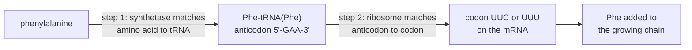

---
aliases:
  - tRNA
  - Transfer Ribonucleic Acid
  - ARN de transfert
  - ARNt
tags:
  - type/concept
  - domain/biology
  - domain/bioinformatics
  - level/L1
  - level/L2
  - level/L3
mastery: 0
prerequisites:
  - "[[RNA]]"
  - "[[Base Pairing]]"
  - "[[Amino Acid]]"
  - "[[Codon]]"
  - "[[Genetic Code]]"
related:
  - "[[Translation]]"
  - "[[Ribosome]]"
  - "[[Messenger RNA]]"
  - "[[Non-Coding RNA]]"
  - "[[RNA Secondary Structure]]"
  - "[[Mitochondrial DNA]]"
  - "[[Nonsense Mutation]]"
  - "[[Gene Annotation]]"
projects: []
sources:
  - "[[Molecular Biology of the Cell (Alberts)]]"
  - "[[Biochemistry (Berg)]]"
  - "[[Biology 2e (OpenStax)]]"
  - "[[An Introduction to Genetic Analysis (Griffiths)]]"
  - "[[Biological Sequence Analysis (Durbin)]]"
  - "[[Introduction to Algorithms (Cormen)]]"
  - "[[Crick 1958 - On Protein Synthesis]]"
  - "[[Chapeville 1962 - On the Role of Soluble Ribonucleic Acid in Coding for Amino Acids]]"
  - "[[Anderson 1981 - Sequence and Organization of the Human Mitochondrial Genome]]"
  - "[[Chan 2021 - tRNAscan-SE 2.0]]"
  - "[[GtRNAdb]]"
---

# Transfer RNA

> [!abstract]
> A transfer RNA is a small folded RNA with two working ends: three bases, the anticodon, that pair with a codon, and a 3' tail that carries the matching amino acid. It is the physical adaptor that turns the genetic code into chemistry.

## Definition

A **transfer RNA (tRNA)** is a small RNA, about 80 nucleotides long, that folds into a compact structure carrying a specific amino acid covalently attached to its 3' end and, at the opposite end, an **anticodon**: three nucleotides that pair, antiparallel, with a codon of an mRNA during [[Translation]].[^alberts][^os15] tRNAs are the **adaptors** Crick postulated in 1957: since a nucleic acid template cannot recognize amino acid side chains directly, he proposed that each amino acid is brought to the template by an adaptor molecule, and that it is the adaptor that fits onto the RNA.[^crick58][^alberts]

## Why it matters

- **A codon table is a summary of tRNAs.** The dictionary used for in silico translation ([[Genetic Code#Computational representation]]) condenses what the cell's charged tRNAs do. When the tRNA set changes, the code can change: human mitochondrial DNA encodes its own 22 tRNAs, and vertebrate mitochondria use a variant table ([[Mitochondrial DNA]]).[^anderson][^alberts]
- **tRNA genes are annotated by structure.** tRNAscan-SE, the standard tool, searches genomes with covariance models that score the conserved cloverleaf pairing together with the sequence, predicts each gene's amino acid (its isotype) from the anticodon and from isotype-specific models, and filters out tRNA-derived repetitive elements that resemble tRNAs.[^chan] Its predictions are collected in GtRNAdb: the human assembly hg38 has 429 high-confidence tRNA genes, one of them for selenocysteine.[^gtrnadb] See [[Gene Annotation]] and [[Stochastic Context-Free Grammar]].
- **Anticodon repertoires are data.** Which anticodons a genome encodes, and in how many gene copies, can be read from GtRNAdb and compared with the codons its genes use ([[Codon Usage Bias]]).[^gtrnadb]
- **Mutant tRNAs rewrite the code locally.** A tRNA whose anticodon mutates can read a stop codon and suppress [[Nonsense Mutation|nonsense mutations]], a classic tool of bacterial genetics (L3).[^griffiths]

## Core (L1)

![[transfer-rna-cloverleaf.svg]]

**Two ends, two jobs.**[^alberts][^berg]

| End | What it is | What it does |
|---|---|---|
| Anticodon | three nucleotides in the loop at the bottom of the cloverleaf | pairs antiparallel with one codon of the mRNA, inside the ribosome |
| 3' acceptor end | single-stranded, ending in CCA | carries the amino acid, linked by an ester bond to the terminal adenosine |

In the folded molecule these two ends lie at opposite tips of an L-shaped structure: the anticodon can sit on the mRNA while the amino acid reaches the site where peptide bonds form ([[Ribosome]]).[^alberts]

**The adaptor works through two recognition steps.**[^alberts]



1. **Charging.** An **aminoacyl-tRNA synthetase** attaches an amino acid to the 3' end of its tRNAs. Most cells have one synthetase per amino acid, twenty in all, each recognizing both its amino acid and every tRNA that should carry it.[^alberts]
2. **Decoding.** In the ribosome, the anticodon of the charged tRNA pairs with the codon. Only this pairing is checked; the amino acid itself is not inspected ([[Translation#Deeper (L2)]]).[^alberts]

The genetic code is therefore implemented jointly by synthetases and tRNAs: a codon "means" phenylalanine because the tRNAs whose anticodons pair with it are the ones that the phenylalanine synthetase charges.

**Reading an anticodon.** The first (5') base of the anticodon pairs with the third (3') base of the codon, the **wobble** position ([[Genetic Code#Wobble]]).[^alberts]

```text
codon      5'- U U C -3'
               | | |
anticodon  3'- A A G -5'    written 5'->3' as GAA
```

**Names.** tRNA^Phe is a tRNA specific for phenylalanine; Phe-tRNA^Phe is the same tRNA charged with its amino acid (an aminoacyl-tRNA).[^berg] Several tRNAs can carry the same amino acid with different anticodons; depending on the species, a cell contains 40 to 60 kinds of tRNA, fewer than the 61 sense codons.[^os15][^alberts]

## Deeper (L2)

### Structure

- **Cloverleaf.** Intramolecular base pairing folds the chain into four stems: the acceptor stem (the 5' and 3' ends paired together), the D arm, the anticodon arm and the TΨC arm, with a variable loop between the last two. The D and TΨC arms are named after modified nucleotides they contain: dihydrouridine, and the sequence ribothymidine, pseudouridine, cytidine.[^berg][^alberts]
- **L-shape.** In three dimensions the acceptor stem stacks on the TΨC stem and the D stem on the anticodon stem, forming two helical arms at right angles; the D and TΨC loops meet at the corner.[^berg]
- **Processing and modification.** tRNAs are transcribed by RNA polymerase III ([[Transcription#Deeper (L2)]]) as larger precursors that are trimmed and then chemically modified; mature tRNAs contain many unusual nucleotides such as inosine, pseudouridine and dihydrouridine ([[Nucleotide#Advanced (L3)]]).[^alberts]

### Charging: where the meaning is assigned

The two-step chemistry (activation with ATP, then transfer) and the editing sites of some synthetases are described in [[Translation#Deeper (L2)]]. What matters here is **recognition**. Synthetases belong to two structurally distinct classes (class I and class II).[^berg] A synthetase identifies its tRNAs through **identity elements**: the anticodon for many tRNAs, but also nucleotides elsewhere, notably in the acceptor stem. For alanine, a single G·U base pair in the acceptor stem is the main determinant: moving it into another tRNA makes that tRNA a substrate for the alanine synthetase.[^berg]

### How we know: the Chapeville experiment

In 1962, Chapeville and colleagues charged tRNA^Cys with cysteine, then converted the attached cysteine into alanine with Raney nickel, without detaching it. In a cell-free system programmed with poly(UG), a template that directs cysteine incorporation, the hybrid Ala-tRNA^Cys inserted **alanine**. The template reads the adaptor, not the amino acid, exactly as the adaptor hypothesis predicted.[^chapeville]

### Wobble and the size of the tRNA set

Pairing at the wobble position is less strict than at the other two:[^alberts]

| 5' base of the anticodon | Pairs with 3' base of the codon |
|---|---|
| U | A or G |
| G | C or U |
| I (inosine) | A, C or U |
| C | G only |

One tRNA can therefore read up to three codons, which is why cells need fewer tRNA kinds than sense codons. Under these rules, 31 anticodons suffice to read the 61 sense codons of the standard code (derived below and computed in Exercise 4); real cells carry more kinds than this minimum.[^os15]

## Advanced (L3)

**Organelles bend the rules.** The human mitochondrial genome encodes only 22 tRNAs, together with 2 rRNAs and 13 proteins.[^anderson] That is below the 31 required by standard wobble, and mitochondria manage it with relaxed codon-anticodon pairing, in which one tRNA can read all four codons of a family.[^alberts] The same organelles use a variant genetic code ([[Genetic Code#Advanced (L3)]]).

**Selenocysteine.** A dedicated tRNA inserts selenocysteine at particular UGA codons, guided by a signal in the mRNA.[^alberts] In the human hg38 high-confidence set, GtRNAdb lists one selenocysteine tRNA gene, with anticodon TCA (written 5'→3' in the DNA alphabet; it pairs with UGA).[^gtrnadb]

**Suppressor tRNAs.** A point mutation in the anticodon of a tRNA gene can make that tRNA read a stop codon. It then inserts its amino acid where a [[Nonsense Mutation]] had created a premature stop, restoring a full-length protein: the nonsense mutation is **suppressed** by a mutation elsewhere in the genome.[^griffiths] Suppression shows, once more, that the anticodon alone dictates where an amino acid goes; its cost is that the suppressor can also read through normal stop codons.[^griffiths]

**Finding tRNA genes.** tRNA sequences vary between families while their pairing pattern is conserved: a change on one side of a stem is often matched by a compensating change on the other ([[RNA#Advanced (L3)]]). Covariance models, probabilistic models built on stochastic context-free grammars, score such paired columns jointly, which sequence-only profiles cannot do.[^durbin] tRNAscan-SE 2.0 combines covariance-model searches (Infernal 1.1), nearly one hundred isotype- and clade-specific models, and a high-confidence filter against tRNA-derived repeats.[^chan] Gene counts therefore depend on the tool version and the assembly, which is why GtRNAdb reports them per assembly.[^gtrnadb]

## Mathematical representation

Let $\kappa$ be Watson-Crick complementation on $\{A, C, G, U\}$ and let a codon be $c = c_1 c_2 c_3$ and an anticodon $a = a_1 a_2 a_3$, both written 5' → 3'.

- **Strict pairing**: $a$ reads $c$ iff $c = \operatorname{rc}(a)$, i.e. $c_1 = \kappa(a_3)$, $c_2 = \kappa(a_2)$, $c_3 = \kappa(a_1)$.
- **Wobble pairing**: $a$ reads $c$ iff $c_1 = \kappa(a_3)$, $c_2 = \kappa(a_2)$ and $c_3 \in W(a_1)$, with $W(U) = \{A, G\}$, $W(G) = \{C, U\}$, $W(I) = \{A, C, U\}$, $W(C) = \{G\}$, $W(A) = \{U\}$. Write $R(a)$ for the set of codons read by $a$.
- **The code as a composition.** Let $T$ be the set of tRNAs, $\alpha(t)$ the anticodon of $t$ and $\sigma(t)$ the amino acid its synthetase attaches (charging). The implemented code is $g(c) = \sigma(t)$ for any $t$ with $c \in R(\alpha(t))$. It is **well defined** only if all tRNAs that read $c$ are charged with the same amino acid, and **complete** only if every sense codon is read by some tRNA.
- **Minimum tRNA set.** For an amino acid with codon set $C_x$, one needs a smallest set $S$ of anticodons with $\bigcup_{a \in S} R(a) = C_x$ and $R(a) \subseteq C_x$: a small instance of set cover, NP-hard in general but trivial here because $|C_x| \le 6$.[^cormen] All codons read by one tRNA share their first two bases and $|R(a)| \le 3$, so if $n_{x,p}$ codons of $x$ start with the dinucleotide $p$,
$$|S_x| \ \ge\ \sum_{p} \left\lceil \frac{n_{x,p}}{3} \right\rceil .$$
For leucine (UUA, UUG and the four CUN codons) the bound is $1 + 2 = 3$. Summed over the 20 amino acids the bound is 31, and the rules above reach it (Exercise 4).

## Computational representation

Anticodons are stored as short strings, written 5' → 3' and often in the DNA alphabet (GtRNAdb writes the selenocysteine anticodon as TCA).[^gtrnadb] tRNAscan-SE reports, for each predicted gene, its coordinates, its anticodon and its predicted isotype.[^chan] The decoding rules fit in a few lines:

```python
BASES = "UCAG"
AAS = "FFLLSSSSYY**CC*WLLLLPPPPHHQQRRRRIIIMTTTTNNKKSSRRVVVVAAAADDEEGGGG"  # NCBI table 1
CODE = {a + b + c: AAS[16 * i + 4 * j + k]
        for i, a in enumerate(BASES) for j, b in enumerate(BASES) for k, c in enumerate(BASES)}
PAIR = {"A": "U", "U": "A", "G": "C", "C": "G"}
# Wobble rules: first (5') anticodon base -> codon third bases it can pair with.
WOBBLE = {"G": "CU", "U": "AG", "I": "UCA", "C": "G", "A": "U"}


def codons_read(anticodon: str) -> set[str]:
    """Codons (5'->3') decoded by an anticodon written 5'->3', e.g. 'GAA' reads UUC and UUU."""
    wobble, middle, last = anticodon
    return {PAIR[last] + PAIR[middle] + third for third in WOBBLE[wobble]}


def amino_acid_of(anticodon: str) -> str | None:
    """The amino acid a tRNA with this anticodon must carry, or None if its codons disagree."""
    meanings = {CODE[c] for c in codons_read(anticodon)}
    return meanings.pop() if len(meanings) == 1 and "*" not in meanings else None


for ac in ("GAA", "UAC", "CAU", "IGC", "IAU", "UAU"):
    print(ac, sorted(codons_read(ac)), amino_acid_of(ac))
```

Output:

```text
GAA ['UUC', 'UUU'] F
UAC ['GUA', 'GUG'] V
CAU ['AUG'] M
IGC ['GCA', 'GCC', 'GCU'] A
IAU ['AUA', 'AUC', 'AUU'] I
UAU ['AUA', 'AUG'] None
```

`None` for UAU is the consistency condition at work: that anticodon would read an isoleucine codon and a methionine codon, so no synthetase could charge it correctly.

## Worked example

> [!example] Which tRNAs decode a toy mRNA? (invented sequence)
> mRNA: `5'-AUG UUU GCA AUA UGG UAA-3'`. For each codon, list the anticodons (5' → 3') that can read it under the wobble rules, using `codons_read` and `amino_acid_of`:
>
> | Codon | Amino acid | Anticodons that read it | Pairing at the wobble position |
> |---|---|---|---|
> | AUG | Met | CAU | C·G, Watson-Crick |
> | UUU | Phe | GAA, AAA | G·U wobble, or A·U |
> | GCA | Ala | UGC, IGC | U·A, or I·A wobble |
> | AUA | Ile | IAU | I·A wobble (UAU is excluded: it would also read Met) |
> | UGG | Trp | CCA | C·G |
> | UAA | stop | none | read by a release factor ([[Translation]]) |
>
> Two points stand out. Isoleucine needs inosine: without it, no anticodon reads AUA without also reading AUG. And stop codons have no tRNA in the standard code, which is exactly the niche that a suppressor tRNA fills.

## Common misconceptions

> [!warning] "The anticodon is the complement of the codon, read in the same direction"
> Pairing is antiparallel. The anticodon of 5'-UUC-3' is 5'-GAA-3', not 5'-AAG-3'. Always write the 5' and 3' ends.

> [!warning] "There is one tRNA per codon"
> Wobble lets one tRNA read up to three codons: 31 anticodons are enough in principle, cells carry 40 to 60 kinds, and a genome can hold hundreds of tRNA **genes** because many kinds are encoded in several copies.[^os15][^gtrnadb]

> [!warning] "The tRNA recognizes its amino acid"
> A tRNA only carries what its synthetase attached. The Chapeville experiment showed that an alanine hung on a cysteine tRNA is inserted at cysteine codons.[^chapeville]

> [!warning] "A synthetase only reads the anticodon"
> Identity elements can lie outside the anticodon; the alanine tRNA is recognized mainly through one base pair of its acceptor stem.[^berg]

## Exercises

> [!question] Exercise 1 (L1)
> Give the anticodon, written 5' → 3', of the tRNA that reads each codon by strict pairing: 5'-AUG-3', 5'-UGG-3', 5'-GCU-3'.

> [!success]- Solution
> Take the reverse complement: CAU, CCA and AGC. For GCU, a tRNA with anticodon 5'-IGC-3' could also read it, through inosine at the wobble position.

> [!question] Exercise 2 (L1)
> Name the two molecular recognition steps that make a tRNA an adaptor, and say which molecule performs each and what it checks.

> [!success]- Solution
> (1) Charging: the aminoacyl-tRNA synthetase checks the amino acid and the tRNA's identity elements, and joins them. (2) Decoding: the ribosome checks the pairing between anticodon and codon, not the amino acid. The meaning of a codon results from both.

> [!question] Exercise 3 (L2)
> In the Chapeville experiment, what would have been observed if the ribosome recognized the amino acid rather than the tRNA? What was observed, and what does it prove?

> [!success]- Solution
> If the amino acid were recognized, the alanine carried by tRNA^Cys would have been placed where alanine codons are, and a cysteine-directing template such as poly(UG) would not have incorporated it. Observed: alanine was incorporated in response to poly(UG). The adaptor's anticodon, not its cargo, is decoded.[^chapeville]

> [!question] Exercise 4 (L3, Python)
> Using the code of the Computational representation, compute the smallest number of anticodons needed to read all 61 sense codons of the standard code under the wobble rules of the table, without any tRNA reading a codon of another meaning. Repeat without inosine. Compare with the 22 tRNAs of human mitochondria.

> [!success]- Solution
> ```python
> from itertools import combinations, product
>
>
> def minimum_trna_set(wobble_bases: str = "GUICA") -> dict[str, list[str] | None]:
>     """Smallest set of anticodons per amino acid that reads all its codons, none of another meaning."""
>     candidates = ["".join(p) for p in product(wobble_bases, "ACGU", "ACGU")]
>     valid = [ac for ac in candidates if amino_acid_of(ac)]
>     best = {}
>     for aa in sorted(set(AAS) - {"*"}):
>         needed = {c for c, a in CODE.items() if a == aa}
>         pool = [ac for ac in valid if amino_acid_of(ac) == aa]
>         for size in range(1, len(needed) + 1):
>             cover = next((s for s in combinations(pool, size)
>                           if set().union(*map(codons_read, s)) == needed), None)
>             if cover:
>                 best[aa] = list(cover)
>                 break
>         else:
>             best[aa] = None          # impossible with these wobble bases
>     return best
>
>
> with_inosine = minimum_trna_set("GUICA")
> print(sum(len(v) for v in with_inosine.values()), with_inosine["L"], with_inosine["I"])
> without = minimum_trna_set("GUCA")
> print([aa for aa, v in without.items() if v is None])
> # 31 ['GAG', 'UAA', 'UAG'] ['IAU']
> # ['I']
> ```
>
> 31 anticodons suffice, matching the lower bound of the Mathematical representation. Without inosine, isoleucine cannot be decoded at all: AUA is only reachable by U at the wobble position, which also reads AUG (Met). Human mitochondria, with 22 tRNAs, are below 31, which is only possible because their pairing rules are more relaxed than the table's.[^anderson][^alberts]

> [!question] Exercise 5 (L3)
> An essential bacterial gene carries a nonsense mutation, UGG (Trp) → UAG. A revertant grows again, but the gene is unchanged; the second mutation maps to a tRNA gene. Propose a tRNA^Tyr anticodon change (tyrosine codons: UAU, UAC) that explains it, and one cost for the cell.

> [!success]- Solution
> tRNA^Tyr has anticodon 5'-GUA-3' (reads UAC and UAU). A single change G → C at the wobble position gives 5'-CUA-3', which reads UAG: tyrosine is inserted at the premature stop and a full-length protein (Tyr instead of Trp at that position) is made. Cost: the mutant tRNA also reads normal UAG stop codons in other genes, producing extended proteins, and if it was the only tRNA^Tyr gene reading UAC the cell would also lose that decoding.[^griffiths]

## Mastery checklist

- [ ] 1 Recognized: I can say what a tRNA is, name its anticodon and its 3' CCA end, and write the anticodon of a codon.
- [ ] 2 Understood: I can explain the two recognition steps (synthetase, ribosome), the cloverleaf and L-shape, and wobble.
- [ ] 3 Practiced: I can implement the wobble rules and compute the minimum tRNA set in Python, and solved the exercises.
- [ ] 4 Applied: I looked up the tRNA genes of a real genome in GtRNAdb (or ran tRNAscan-SE) and related its anticodons to the codon table.
- [ ] 5 Explained: I can teach why the code is implemented by synthetases plus tRNAs, how we know (Chapeville), and why tRNA gene prediction needs structure-aware models.

## References

[^alberts]: [[Molecular Biology of the Cell (Alberts)]], 4th ed. (2002), treatment of tRNAs as adaptors (size, cloverleaf and L-shaped structure, modified nucleotides, wobble pairing), aminoacyl-tRNA synthetases, selenocysteine, and the mitochondrial genetic system.
[^os15]: [[Biology 2e (OpenStax)]], ch. 15 "Genes and Proteins", section on ribosomes and protein synthesis (number of tRNA types per species).
[^berg]: [[Biochemistry (Berg)]], 5th ed. (2002), treatment of tRNA structure (CCA end, arms, L-shape), aminoacyl-tRNA synthetases (two classes, tRNA recognition, the alanine G·U identity element) and aminoacyl-tRNA nomenclature.
[^griffiths]: [[An Introduction to Genetic Analysis (Griffiths)]], molecular genetics part: nonsense mutations and their suppression by mutant tRNAs.
[^durbin]: [[Biological Sequence Analysis (Durbin)]], ch. 10 "RNA structure analysis" (covariance models).
[^cormen]: [[Introduction to Algorithms (Cormen)]], part on NP-completeness and approximation algorithms (the set-covering problem).
[^crick58]: [[Crick 1958 - On Protein Synthesis]], the adaptor hypothesis.
[^chapeville]: [[Chapeville 1962 - On the Role of Soluble Ribonucleic Acid in Coding for Amino Acids]], *PNAS* 48:1086-1092.
[^anderson]: [[Anderson 1981 - Sequence and Organization of the Human Mitochondrial Genome]], *Nature* 290:457-465 (2 rRNAs, 22 tRNAs, 13 protein-coding genes).
[^chan]: [[Chan 2021 - tRNAscan-SE 2.0]], *Nucleic Acids Research* 49(16):9077-9096.
[^gtrnadb]: [[GtRNAdb]], human genome page (hg38, GRCh38), high-confidence tRNA gene set.
