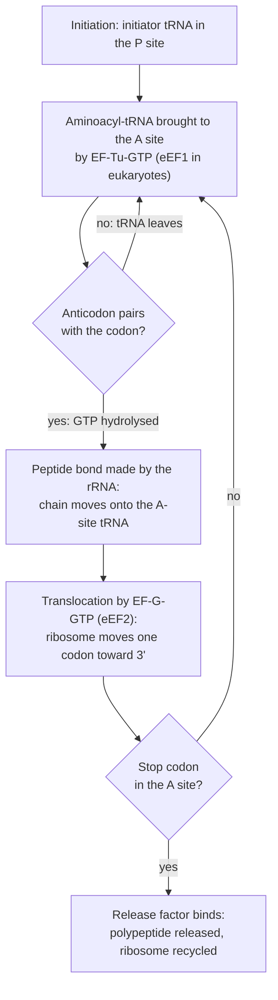

---
aliases:
  - Protein Synthesis
  - mRNA Translation
  - Traduction
tags:
  - type/concept
  - domain/biology
  - level/L1
  - level/L2
  - level/L3
mastery: 0
prerequisites:
  - "[[RNA]]"
  - "[[Amino Acid]]"
  - "[[Transcription]]"
  - "[[Genetic Code]]"
related:
  - "[[Ribosome]]"
  - "[[Transfer RNA]]"
  - "[[Messenger RNA]]"
  - "[[Codon]]"
  - "[[Open Reading Frame]]"
  - "[[Protein]]"
  - "[[Protein Folding]]"
  - "[[Post-Translational Modification]]"
  - "[[Gene Expression]]"
  - "[[Nonsense-Mediated Decay]]"
projects:
  - "[[02-sequence-translation]]"
sources:
  - "[[Biology 2e (OpenStax)]]"
  - "[[Molecular Biology of the Cell (Alberts)]]"
  - "[[Biochemistry (Berg)]]"
  - "[[Crick 1970 - Central Dogma of Molecular Biology]]"
---

# Translation

> [!abstract]
> Translation is how a ribosome reads an mRNA codon by codon and links the matching amino acids, brought by tRNAs, into a protein.

## Definition

**Translation** is the synthesis of a polypeptide whose amino acid sequence is specified by an mRNA: the **ribosome** moves along the mRNA 5' → 3', each codon is recognized by the anticodon of an aminoacyl-**tRNA**, and the amino acids are joined by peptide bonds from the N-terminus to the C-terminus.[^os15][^alberts] It is the RNA → protein transfer of the [[Central Dogma]].[^crick70]

## Why it matters

- **Predicted proteins are translations.** A protein sequence predicted from a genome was never observed as a protein: it is the conceptual translation of an annotated coding sequence with a [[Genetic Code|codon table]] ([[02-sequence-translation]]).
- **Only the coding sequence is translated.** Knowing where translation starts and stops defines the 5' UTR, the CDS and the 3' UTR of every transcript in an annotation file ([[Gene]], [[Gene Annotation]]).
- **Proteomics.** Mass spectrometry identifies peptides by matching them against predicted proteins; post-translational modifications and cleavages make the real protein differ from the conceptual translation ([[Proteomics]]).
- **Expression is not only RNA.** A cell controls how often each mRNA is translated, so mRNA abundance measured by [[Transcriptomics]] is an imperfect proxy for protein abundance ([[Gene Expression]]).[^alberts]
- **Variant effect.** Nonsense and frameshift variants act through translation: premature stops, and in eukaryotes the decay of the mRNA ([[Nonsense-Mediated Decay]], [[Mutation]]).

## Core (L1)

**The players.**[^os15][^alberts]

| Component | Role |
|---|---|
| [[Messenger RNA]] | carries the codons, read 5' → 3' |
| [[Transfer RNA]] (tRNA) | adaptor: an anticodon at one end, the matching amino acid attached at its 3' end |
| Aminoacyl-tRNA synthetases | enzymes that attach each amino acid to its correct tRNAs |
| [[Ribosome]] | two subunits of ribosomal RNA and proteins; holds mRNA and tRNAs, makes the peptide bonds |

The ribosome has three tRNA sites: **A** (aminoacyl: the incoming charged tRNA), **P** (peptidyl: the tRNA holding the growing chain) and **E** (exit: the empty tRNA leaving).[^os15][^alberts]

![[translation-ribosome.svg]]

**Three stages.**[^os15]

1. **Initiation**: the small subunit, an initiator tRNA carrying methionine and the mRNA assemble at the start codon (AUG); the large subunit joins. The initiator tRNA sits in the P site.
2. **Elongation**: a charged tRNA enters the A site if its anticodon pairs with the codon; the chain is transferred onto it (new peptide bond); the ribosome moves one codon toward the 3' end, shifting the tRNAs from A to P and from P to E.
3. **Termination**: a stop codon (UAA, UAG, UGA) enters the A site; no tRNA matches it; a **release factor** binds and the polypeptide is released.

The protein grows from its **N-terminus** (first codon) to its **C-terminus** (last codon before the stop).[^alberts]

## Deeper (L2)

### Charging tRNAs: where the code is really applied

Each aminoacyl-tRNA synthetase recognizes one amino acid and its tRNAs. It first activates the amino acid with ATP (forming aminoacyl-AMP and releasing pyrophosphate), then transfers it to the 3' end of the tRNA. Some synthetases have a separate editing site that removes wrongly attached amino acids. The ribosome checks only codon-anticodon pairing, not the amino acid, so the accuracy of the code depends on the synthetases.[^alberts][^berg]

### Ribosomes

| | Bacteria | Eukaryotes (cytosol) |
|---|---|---|
| Whole ribosome | 70S | 80S |
| Small subunit | 30S (16S rRNA) | 40S (18S rRNA) |
| Large subunit | 50S (23S and 5S rRNA) | 60S (28S, 5.8S and 5S rRNA) |

(S: Svedberg units of sedimentation, which do not add up.) The peptidyl transferase reaction is catalysed by the rRNA of the large subunit: the ribosome is a **ribozyme**.[^alberts]

### Initiation differs between bacteria and eukaryotes

- **Bacteria**: a purine-rich **Shine-Dalgarno** sequence a few nucleotides upstream of the start codon pairs with the 16S rRNA and positions the small subunit. The initiator tRNA carries **N-formylmethionine**. Because each coding sequence has its own ribosome-binding site, a polycistronic mRNA from an operon can be translated into several proteins ([[Gene]]).[^alberts]
- **Eukaryotes**: the small subunit, carrying the initiator Met-tRNA and initiation factors (eIF2 with GTP), binds the **5' cap** and **scans** 5' → 3' to the first AUG in a suitable sequence context. Most eukaryotic mRNAs therefore make one protein.[^alberts]
- **Coupling**: in bacteria, which have no nucleus, ribosomes start translating an mRNA while it is still being transcribed; in eukaryotes the mRNA is processed and exported first ([[Transcription]]).[^os15]

### The elongation cycle and its accuracy



(Diagram after [^alberts][^berg].) GTP hydrolysis by the elongation factors introduces delays during which a wrongly paired tRNA tends to dissociate before it can be used (kinetic proofreading). The overall error rate is about one wrong amino acid per 10⁴.[^alberts]

**Energy.** Charging consumes ATP → AMP + PPi (two high-energy phosphate bonds), and each elongation cycle hydrolyses one GTP for delivery and one for translocation.[^berg] Adding them up gives about four high-energy phosphate bonds per peptide bond.

**Polysomes.** As soon as a ribosome has moved away from the start codon, another can initiate, so an mRNA is usually covered by several ribosomes at once (a **polyribosome** or **polysome**), each making a copy of the protein.[^os15][^alberts]

## Advanced (L3)

**After translation.** A new polypeptide must fold, often helped by chaperones ([[Protein Folding]]), and many proteins are modified covalently (phosphorylation, glycosylation, cleavage and others) before they work ([[Post-Translational Modification]]).[^alberts] The protein found in a cell can therefore differ in mass and sequence from the conceptual translation of its CDS, which matters for [[Proteomics]] searches.

**Quality control.** In eukaryotes, an mRNA with a premature stop codon is recognized when it is translated and degraded by **nonsense-mediated decay**, which limits the production of truncated proteins.[^alberts] Predicting the effect of a nonsense variant therefore requires knowing whether the transcript escapes decay ([[Nonsense-Mediated Decay]]).

**Translational control.** Cells regulate how often an mRNA is translated, for instance by repressor proteins bound near the 5' end or by modifying initiation factors, which lets protein levels change without new transcription.[^alberts] Measuring RNA alone ([[Transcriptomics]]) misses this layer.

**Antibiotics.** Many antibiotics block bacterial ribosomes, exploiting their differences from eukaryotic ones: tetracycline prevents aminoacyl-tRNA binding to the A site, and chloramphenicol blocks the peptidyl transferase reaction; cycloheximide blocks eukaryotic ribosomes, and puromycin causes premature chain release in both.[^alberts] This makes the ribosome a classic drug target ([[Drug Discovery]]).

## Mathematical representation

Let $m \in \Sigma_R^n$ be an mRNA and $g$ the [[Genetic Code]]. Under the scanning model, the start is $s = \min\{i : m_{i}m_{i+1}m_{i+2} = AUG\}$ (0-based). Codons are $c_k = m[s + 3k \,{:}\, s + 3k + 3]$ and translation stops at $K = \min\{k : g(c_k) = *\}$. The protein is

$$p = g(c_0)\, g(c_1) \cdots g(c_{K-1}), \qquad |p| = K,$$

with $K - 1$ peptide bonds.

**Accuracy.** With an independent error probability $\varepsilon$ per amino acid, $P(\text{protein of length } n \text{ is error-free}) = (1-\varepsilon)^n \approx e^{-\varepsilon n}$.

**Cost.** $E \approx 4(n - 1)$ high-energy phosphate bonds for elongation, plus initiation and termination.

**Polysome occupancy.** Let $L$ be the CDS length in codons, $v$ the elongation speed (codons per second) and $\alpha$ the initiation rate (ribosomes per second). A ribosome spends $T = L / v$ on the CDS; if ribosomes do not interfere, the mean number on the mRNA is (Little's law)

$$N = \alpha \, T = \frac{\alpha L}{v},$$

and the protein output rate at steady state is $\alpha$. Initiation, not elongation, sets the output, which is why most translational control acts on initiation.

## Computational representation

- A protein is stored as a string over the 20 one-letter amino acid codes (FASTA), sometimes with a terminal `*` for the stop.
- Conceptual translation is a codon-table lookup ([[Genetic Code#Computational representation]]); the biological details (anticodons, sites, factors) are not represented, but the start rule is: here, the eukaryotic "first AUG" scanning rule.

```python
BASES = "UCAG"
AAS = "FFLLSSSSYY**CC*WLLLLPPPPHHQQRRRRIIIMTTTTNNKKSSRRVVVVAAAADDEEGGGG"   # NCBI table 1
CODE = dict(zip((a + b + c for a in BASES for b in BASES for c in BASES), AAS))
PAIR = str.maketrans("ACGU", "UGCA")

def anticodon(codon: str) -> str:
    """Anticodon written 5'->3' (reverse complement of the codon)."""
    return codon.translate(PAIR)[::-1]

def translate_mrna(mrna: str) -> tuple[str, list[str]]:
    """Scan to the first AUG, then elongate codon by codon until a stop codon.
    Returns the protein and a log of decoding events."""
    start = mrna.find("AUG")
    if start < 0:
        return "", []
    protein, log = "", []
    for i in range(start, len(mrna) - 2, 3):
        codon = mrna[i:i + 3]
        aa = CODE[codon]
        if aa == "*":
            log.append(f"stop {codon} in A site: release factor, peptide released")
            break
        protein += aa
        log.append(f"{codon} -> tRNA anticodon 5'-{anticodon(codon)}-3' brings {aa}")
    return protein, log

mrna = "GGCAUCCAUGGCAUUCGAAUAAGCG"          # invented: 5' UTR, CDS, 3' UTR
protein, log = translate_mrna(mrna)
print(protein)
print(*log, sep="\n")
print("peptide bonds:", len(protein) - 1, "high-energy phosphate bonds:", 4 * (len(protein) - 1))
```

Output:

```text
MAFE
AUG -> tRNA anticodon 5'-CAU-3' brings M
GCA -> tRNA anticodon 5'-UGC-3' brings A
UUC -> tRNA anticodon 5'-GAA-3' brings F
GAA -> tRNA anticodon 5'-UUC-3' brings E
stop UAA in A site: release factor, peptide released
peptide bonds: 3 high-energy phosphate bonds: 12
```

## Worked example

> [!example] Translating a toy mRNA step by step (invented sequence)
> mRNA: `5'-GGCAUCC AUG GCA UUC GAA UAA GCG-3'`.
>
> 1. **Start.** Scanning from the cap, the first AUG is at position 7 (0-based). `GGCAUCC` is the 5' UTR and will not be translated.
> 2. **Initiation.** The initiator Met-tRNA (anticodon 3'-UAC-5') pairs with AUG in the P site; the A site faces GCA.
> 3. **Cycle 1.** Ala-tRNA (anticodon 3'-CGU-5') enters the A site. The peptide bond transfers Met onto Ala-tRNA. Translocation: the Met-Ala-tRNA moves to P, the empty initiator tRNA to E, and UUC enters the A site.
> 4. **Cycle 2.** Phe-tRNA (3'-AAG-5') enters A: this is the moment drawn in the figure above. After the peptide bond and translocation, Met-Ala-Phe hangs on the tRNA in P.
> 5. **Cycle 3.** Glu-tRNA (3'-CUU-5') reads GAA; the chain becomes Met-Ala-Phe-Glu.
> 6. **Termination.** UAA enters the A site; a release factor binds; the tetrapeptide **Met-Ala-Phe-Glu** (N → C) is released. `GCG` is part of the 3' UTR.
>
> Cost of elongation: 3 peptide bonds, about 12 high-energy phosphate bonds.

## Common misconceptions

> [!warning] "The tRNA makes sure it carries the right amino acid"
> A tRNA only pairs with the codon. Matching the amino acid to the tRNA is done earlier, by the aminoacyl-tRNA synthetase; a mischarged tRNA would insert the wrong amino acid without the ribosome noticing.

> [!warning] "Ribosomal proteins make the peptide bond"
> The catalytic centre is made of rRNA; the ribosomal proteins mostly stabilize the structure. The ribosome is a ribozyme.

> [!warning] "Stop codons are read by special tRNAs"
> In the standard code, no tRNA reads UAA, UAG or UGA. Stop codons are recognized by release factors, which are proteins.

> [!warning] "One mRNA makes one protein molecule"
> An mRNA is read by many ribosomes at once (polysomes) and many times during its life. In bacteria, one polycistronic mRNA can even encode several different proteins.

## Exercises

> [!question] Exercise 1 (L1)
> Give the anticodon (with its 5' and 3' ends) of the tRNA that reads the codon 5'-GCA-3'. Which amino acid does it carry?

> [!success]- Solution
> Pairing is antiparallel: codon 5'-G C A-3' pairs with anticodon 3'-C G U-5', i.e. 5'-UGC-3' written in the usual direction. GCA codes for alanine, so the tRNA carries Ala (`anticodon("GCA")` returns `UGC`).

> [!question] Exercise 2 (L1)
> Put in order: release factor binds; initiator tRNA pairs with AUG in the P site; translocation; peptide bond formation; aminoacyl-tRNA enters the A site; large subunit joins.

> [!success]- Solution
> Initiator tRNA pairs with AUG in the P site → large subunit joins → aminoacyl-tRNA enters the A site → peptide bond formation → translocation → (repeat the last three) → release factor binds at a stop codon.

> [!question] Exercise 3 (L2)
> A bacterial operon mRNA carries three coding sequences. Explain why all three can be translated, whereas a eukaryotic ribosome would usually translate only the first. What sequence feature would you look for in front of each bacterial start codon?

> [!success]- Solution
> Bacterial ribosomes are positioned by base pairing between the 16S rRNA and a Shine-Dalgarno sequence just upstream of each start codon, so each coding sequence can recruit ribosomes independently. Eukaryotic small subunits bind the 5' cap and scan to the first suitable AUG, so a downstream coding sequence is normally not reached. Look for a purine-rich Shine-Dalgarno motif a few nucleotides upstream of each ATG.[^alberts]

> [!question] Exercise 4 (L2, Python)
> Estimate the number of high-energy phosphate bonds used by elongation to make a 300-amino-acid protein, and list which steps are not counted.

> [!success]- Solution
> A 300-residue protein has 299 peptide bonds: $4 \times 299 = 1196$ (`print(4 * 299)`). Not counted: charging the initiator tRNA, the GTP used by initiation factors, termination and ribosome recycling, and the energy spent making the mRNA, tRNAs and ribosomes themselves.

> [!question] Exercise 5 (L3, Python)
> With an error rate of $10^{-4}$ per amino acid, what fraction of proteins of 300, 1,000 and 3,000 residues contain no misincorporated amino acid?

> [!success]- Solution
> ```python
> for n in (300, 1000, 3000):
>     print(n, round((1 - 1e-4) ** n, 4))
> # 300 0.9704
> # 1000 0.9048
> # 3000 0.7408
> ```
>
> About a quarter of 3,000-residue proteins carry at least one error. Most such errors are tolerated because a single conservative substitution rarely destroys function, and the cell makes many copies of each protein.

> [!question] Exercise 6 (L3)
> Toy parameters (invented for the exercise): a CDS of 600 codons, an elongation speed of 6 codons per second and an initiation every 20 seconds. How long does one ribosome take to cross the CDS, how many ribosomes are on the mRNA on average, and how many proteins are made per minute? What happens to the output if elongation becomes twice as fast?

> [!success]- Solution
> $T = L/v = 600/6 = 100$ s; $\alpha = 1/20 = 0.05$ s⁻¹; $N = \alpha T = 5$ ribosomes; output $= \alpha = 0.05$ s⁻¹ $= 3$ proteins per minute. Doubling $v$ halves $T$ and $N$ (2.5 ribosomes) but leaves the output at 3 per minute: with non-interfering ribosomes, the initiation rate limits production.

## Mastery checklist

- [ ] 1 Recognized: I can name the roles of mRNA, tRNA, synthetases and ribosome, and the A, P and E sites.
- [ ] 2 Understood: I can explain initiation, elongation and termination, and the bacterial versus eukaryotic differences (Shine-Dalgarno versus cap scanning, coupling, 70S versus 80S).
- [ ] 3 Practiced: I can translate an mRNA from its first AUG in Python, write anticodons, and solved the exercises.
- [ ] 4 Applied: in [[02-sequence-translation]], I translate real coding sequences and explain every difference with the database protein (start codon, table, processing).
- [ ] 5 Explained: I can teach why protein and mRNA levels differ, how accuracy is achieved, and why nonsense mutations are often more severe than expected.

## References

[^os15]: [[Biology 2e (OpenStax)]], ch. 15 "Genes and Proteins" (ribosomes and protein synthesis).
[^alberts]: [[Molecular Biology of the Cell (Alberts)]], 4th ed. (2002), treatment of translation: tRNAs and synthetases, ribosome structure and catalysis, initiation in bacteria and eukaryotes, accuracy, polyribosomes, mRNA surveillance, translational control and inhibitors of protein synthesis.
[^berg]: [[Biochemistry (Berg)]], 5th ed. (2002), treatment of protein synthesis (aminoacyl-tRNA synthetases, elongation factors and GTP use).
[^crick70]: [[Crick 1970 - Central Dogma of Molecular Biology]].
