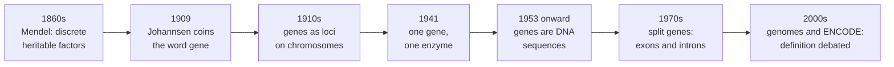

---
aliases:
  - Gène
tags:
  - type/concept
  - domain/biology
  - domain/bioinformatics
  - level/L1
  - level/L2
  - level/L3
mastery: 0
prerequisites:
  - "[[DNA]]"
  - "[[Central Dogma]]"
  - "[[Transcription]]"
  - "[[Translation]]"
related:
  - "[[Allele]]"
  - "[[Chromosome]]"
  - "[[Genome]]"
  - "[[Mendelian Inheritance]]"
  - "[[Promoter]]"
  - "[[Operon]]"
  - "[[RNA Processing]]"
  - "[[Alternative Splicing]]"
  - "[[Non-Coding RNA]]"
  - "[[Open Reading Frame]]"
  - "[[Gene Annotation]]"
  - "[[Gene Finding]]"
projects:
  - "[[bio-core]]"
  - "[[02-sequence-translation]]"
sources:
  - "[[Molecular Cell Biology (Lodish)]]"
  - "[[Biology 2e (OpenStax)]]"
  - "[[An Introduction to Genetic Analysis (Griffiths)]]"
  - "[[Molecular Biology of the Cell (Alberts)]]"
  - "[[Biochemistry (Berg)]]"
  - "[[Beadle 1941 - Genetic Control of Biochemical Reactions in Neurospora]]"
  - "[[Watson 1953 - Molecular Structure of Nucleic Acids]]"
  - "[[Gerstein 2007 - What Is a Gene, Post-ENCODE]]"
  - "[[Lander 2001 - Initial Sequencing and Analysis of the Human Genome]]"
  - "[[IHGSC 2004 - Finishing the Euchromatic Sequence of the Human Genome]]"
  - "[[Ensembl]]"
---

# Gene

> [!abstract]
> A gene is a stretch of DNA that the cell uses to make a functional product, a protein or an RNA, and that is passed from parents to offspring.

## Definition

Molecularly, a **gene** is the whole nucleic acid sequence needed to make one functional product, a polypeptide or an RNA: the transcribed region (exons and introns, including untranslated regions) and the regulatory sequences that control its expression.[^lodish] Genetically, it is the unit of heredity that occupies a position (**locus**) on a [[Chromosome]] and comes in alternative forms, the [[Allele|alleles]].[^os-u3] The two views coincide most of the time, but not always (see L3).[^gerstein]

## Why it matters

- **Annotation is gene models.** A genome is useful only once its genes are located. [[Gene Annotation]] files ([[GFF Format]]) describe each gene as a set of transcripts made of exon intervals, with coding sequences inside them; databases such as Ensembl build these models from evidence.[^ensembl]
- **Genes are the unit of most analyses.** RNA-seq counts are summarized per gene, GWAS hits are assigned to nearby genes, and variants are reported by the gene and transcript they affect ([[Variant Annotation]]).
- **Gene finding.** Predicting genes from raw sequence ([[Gene Finding]]) requires a model of what a gene looks like: start and stop codons, splice sites, typical lengths.
- **Identifiers.** A gene has stable identifiers and a symbol in each database ([[Accession Number]], [[Biological Database]]); mapping between them is a daily task.

## Core (L1)

**Mendel's factors.** Mendel explained his pea crosses by discrete heritable "factors" that come in pairs, separate when gametes form, and do not blend. We now call them genes, and their variants alleles ([[Mendelian Inheritance]]).[^os-u3] Genes were then shown to lie on chromosomes, in a linear order.[^os-u3]

**The molecular gene.** A gene is a segment of [[DNA]]. It is transcribed into RNA ([[Transcription]]); for **protein-coding genes** the mRNA is then translated into a protein ([[Translation]]); for **RNA genes** the RNA itself is the product, such as ribosomal and transfer RNAs ([[Non-Coding RNA]]).[^lodish][^alberts]

**Parts of a eukaryotic protein-coding gene.**[^os15][^alberts]

- a **[[Promoter]]** upstream, where transcription starts;
- **exons**, the pieces kept in the mature mRNA, and **introns**, removed by splicing ([[RNA Processing]]);
- a **5' UTR** and a **3' UTR**: transcribed, kept in the mRNA, but not translated;
- a **coding sequence (CDS)** from the start codon to the stop codon, spread over the exons.

![[gene-structure-eukaryote-operon.svg]]

**Gene, allele, genome.** A gene is a locus with a function; an allele is one version of its sequence; the [[Genome]] is the complete DNA content, genes and everything between them.

## Deeper (L2)

### How the concept changed



(Timeline after the review by Gerstein and colleagues.[^gerstein]) Two steps turned the abstract factor into a molecule. Beadle and Tatum isolated *Neurospora* mutants that could not synthesize a nutrient and showed that each mutation blocked a single enzymatic step: **one gene, one enzyme**.[^beadle][^griffiths] Because many proteins are made of several different polypeptides, the rule was later refined to one gene, one polypeptide.[^griffiths] The double helix then showed how a gene could be stored and copied as a sequence of base pairs.[^watson]

### Prokaryotic versus eukaryotic genes

| | Bacteria | Eukaryotes |
|---|---|---|
| Introns | generally absent: continuous coding sequence | common: coding sequence split into exons |
| Organization | often grouped in **operons**: one promoter, several genes, one polycistronic mRNA | usually one gene, one promoter, one mRNA per transcript |
| Regulation | operators and regulators next to the promoter | promoters plus distant enhancers and chromatin |
| Gene density | compact genomes, mostly coding | genes separated by long intergenic regions |

(Table after [^alberts][^os16][^berg].) The classic operons are the *lac* and *trp* operons of *E. coli*, where genes for the enzymes of one pathway are transcribed together and regulated by one operator ([[Operon]]).[^os16] Genes can lie on either DNA strand, and neighbouring genes may face opposite directions.[^alberts]

### How many genes?

Gene counts depend on definitions and evidence. The draft human genome paper estimated about 30,000 to 40,000 protein-coding genes;[^lander] the analysis of the finished euchromatic sequence lowered this to about 20,000 to 25,000.[^ihgsc] Counts of RNA genes are less settled still, which is why every annotation release reports its own numbers ([[Gene Annotation]]).

## Advanced (L3)

### Why "gene" is hard to define

Genome-scale data, notably the ENCODE pilot project on 1 % of the human genome, strained the classical picture.[^gerstein]

- **One locus, many products**: [[Alternative Splicing]] and alternative promoters make several transcripts, sometimes with different protein products, from one locus.
- **Overlap**: genes can overlap on the same or the opposite strand, or sit inside the introns of other genes.
- **Distant regulation**: enhancers can lie far from the gene they control, even beyond other genes, so "the regulatory sequences of a gene" have no clean boundary.
- **Pervasive transcription**: much of the genome is transcribed, including many RNAs outside annotated genes, some joining exons of neighbouring genes.

Gerstein and colleagues proposed a definition centred on products: a gene is the union of the genomic sequences that encode a coherent set of potentially overlapping functional products (proteins or RNAs). Regulatory regions are associated with genes but deliberately left out of the definition.[^gerstein] Note the contrast with the textbook definition above, which includes regulatory sequences.[^lodish] Neither is "the" answer: always check which convention a database uses.

### The operational gene of bioinformatics

In practice, a gene is what an annotation file says it is: a parent feature grouping transcripts that share exons on the same strand, each transcript listing exons and CDS segments.[^ensembl] In [[GFF Format|GFF3]] the hierarchy is written with `Parent` attributes, and each CDS segment carries a **phase** (0, 1 or 2): the number of bases to skip before the first complete codon of that segment.

```text
seqid  source  type  start  end  score  strand  phase  attributes
toy    .       gene  20     109  .      +       .      ID=toyGene
toy    .       mRNA  20     109  .      +       .      ID=toyGene.t1;Parent=toyGene
toy    .       exon  20     35   .      +       .      Parent=toyGene.t1
toy    .       exon  56     65   .      +       .      Parent=toyGene.t1
toy    .       exon  90     109  .      +       .      Parent=toyGene.t1
toy    .       CDS   26     35   .      +       0      Parent=toyGene.t1
toy    .       CDS   56     65   .      +       2      Parent=toyGene.t1
toy    .       CDS   90     96   .      +       1      Parent=toyGene.t1
```

An [[Open Reading Frame]] is not a gene: it is a computational candidate for a CDS. Many ORFs are not expressed, and many genes (RNA genes) have no ORF at all.

## Mathematical representation

Let $G \in \{A, C, G, T\}^N$ be a chromosome sequence with positions $1, \dots, N$. A **transcript model** on strand $\sigma \in \{+, -\}$ is an ordered list of disjoint exon intervals $t = ([a_1, b_1], \dots, [a_k, b_k])$ with $a_1 \le b_1 < a_2 \le \dots \le b_k$ (1-based, inclusive). Its introns are the gaps $[b_i + 1, a_{i+1} - 1]$, its length is $|t| = \sum_i (b_i - a_i + 1)$, and its sequence is the concatenation $G[a_1..b_1] \cdots G[a_k..b_k]$ (reverse-complemented if $\sigma = -$).

A **gene** in the product-centred sense is a set of transcripts $\{t_1, \dots, t_m\}$ on one strand whose exons overlap; its exonic territory is the union

$$U = \bigcup_{j=1}^{m} \bigcup_{[a, b] \in t_j} [a, b],$$

and its span is $[\min U, \max U]$. For a coding transcript, the CDS is a subset $C \subseteq$ exonic positions with $|C| \equiv 0 \pmod 3$; the phase of the $i$-th CDS segment is $\phi_i = (3 - (\sum_{j<i} \ell_j) \bmod 3) \bmod 3$, where $\ell_j$ is the length of segment $j$.

## Computational representation

- A gene is a small object graph: gene → transcripts → exons and CDS segments, each an interval with strand. [[bio-core]] models it this way.
- Interval arithmetic (lengths, unions, overlaps) is the core operation; see [[Interval Tree]] for fast queries over many genes.
- Always record the coordinate convention (1-based inclusive for GFF, 0-based half-open for BED) and the annotation release.

```python
BASES = "TCAG"
CODE = dict(zip((a + b + c for a in BASES for b in BASES for c in BASES),
                "FFLLSSSSYY**CC*WLLLLPPPPHHQQRRRRIIIMTTTTNNKKSSRRVVVVAAAADDEEGGGG"))

# Invented toy locus, + strand. Features use GFF conventions: 1-based, inclusive.
genome = ("CCTATAAAAGGCGCGCAGTCAGACCATGGCTTCAGGTAAGTTTACTTCTTTTCAGAAGATGAACG"
          "GTGAGTCTGACCCTAACCCTTTAGCTTCTAATGCAATAAAGCCTGGACC")
exons = [(20, 35), (56, 65), (90, 109)]
cds_parts = [(26, 35), (56, 65), (90, 96)]

def fetch(start: int, end: int) -> str:
    return genome[start - 1:end]            # 1-based inclusive -> 0-based slice

def check_gene(exons, cds_parts) -> dict:
    introns = [(a[1] + 1, b[0] - 1) for a, b in zip(exons, exons[1:])]
    cds = "".join(fetch(s, e) for s, e in cds_parts)
    return {
        "transcript_nt": sum(e - s + 1 for s, e in exons),
        "introns": [(s, e, fetch(s, s + 1) + "..." + fetch(e - 1, e)) for s, e in introns],
        "utr5_nt": cds_parts[0][0] - exons[0][0],
        "utr3_nt": exons[-1][1] - cds_parts[-1][1],
        "cds_nt": len(cds),
        "cds_ok": len(cds) % 3 == 0 and cds[:3] == "ATG" and CODE[cds[-3:]] == "*",
        "protein": "".join(CODE[cds[i:i + 3]] for i in range(0, len(cds) - 3, 3)),
    }

for key, value in check_gene(exons, cds_parts).items():
    print(f"{key:14}{value}")
```

Output:

```text
transcript_nt 46
introns       [(36, 55, 'GT...AG'), (66, 89, 'GT...AG')]
utr5_nt       6
utr3_nt       13
cds_nt        27
cds_ok        True
protein       MASEDERF
```

## Worked example

> [!example] Reading a toy gene model (invented 114-nt locus)
> The locus above has a TATA-like element at positions 3 to 9 (`TATAAAA`) and three exons.
>
> 1. **Transcript**: exons 20-35, 56-65 and 90-109, total 16 + 10 + 20 = 46 nt of mature mRNA.
> 2. **Introns**: 36-55 and 66-89, both starting with GT and ending with AG on the coding strand (GU ... AG in the RNA).
> 3. **UTRs**: the CDS starts at 26, so positions 20-25 (6 nt) are the 5' UTR; it ends at 96, so 97-109 (13 nt) are the 3' UTR, which contains the polyadenylation signal `AATAAA` (positions 100-105).
> 4. **CDS**: 10 + 10 + 7 = 27 nt = 9 codons: `ATG GCT TCA G|AA GAT GAA CG|C TTC TAA` (bars mark exon junctions, which fall inside codons 4 and 7). Translation: Met-Ala-Ser-Glu-Asp-Glu-Arg-Phe-stop.
> 5. **Phases**: the first CDS segment starts on a codon (phase 0); after 10 nt, one base of codon 4 is done, so segment 2 must skip 2 bases (phase 2); after 20 nt, segment 3 skips 1 base (phase 1).
>
> The gene, in the textbook sense, also includes the promoter; in the GFF file, the `gene` feature spans only 20-109.

## Common misconceptions

> [!warning] "A gene is the part that codes for protein"
> The CDS is only part of a gene: UTRs and introns are transcribed too, and regulatory sequences are included in the textbook definition. Many genes code for no protein at all (rRNA, tRNA and other RNA genes).

> [!warning] "One gene makes one protein"
> Alternative splicing, alternative start sites and post-translational modification let one gene produce several products. "One gene, one enzyme" was a decisive hypothesis in 1941, not a law.

> [!warning] "Gene and allele are synonyms"
> Everyone has the same set of genes (loci); people differ in their alleles. "The gene for blue eyes" usually means "an allele associated with blue eyes".

> [!warning] "An ORF is a gene"
> An ORF is a stretch without stop codons, found by a program. Random sequence produces short ORFs by chance, and RNA genes have none. A gene is established by evidence of a functional product.

## Exercises

> [!question] Exercise 1 (L1)
> Define in one sentence each: gene, locus, allele, genome. Then say which of them differ between two healthy people.

> [!success]- Solution
> Gene: DNA sequence encoding a functional product. Locus: the position of a gene (or any site) on a chromosome. Allele: one version of the sequence at a locus. Genome: the complete DNA of an organism. Two people share the same genes and loci but carry different alleles at many loci, so their genome sequences differ slightly.

> [!question] Exercise 2 (L1)
> Which parts of a eukaryotic protein-coding gene are present in (a) the pre-mRNA, (b) the mature mRNA, (c) the protein sequence?

> [!success]- Solution
> (a) Everything from +1 to the poly(A) site: 5' UTR, exons, introns, 3' UTR (not the promoter). (b) Exons only, which include the UTRs and the CDS, plus the cap and poly(A) tail added during processing. (c) Only the CDS, translated from the start codon to the codon before the stop.

> [!question] Exercise 3 (L2)
> A pathway needs three enzymes. How many promoters and how many mRNAs would you typically expect if the three genes form a bacterial operon, and if they are three eukaryotic genes? What is the regulatory advantage of the operon?

> [!success]- Solution
> Operon: one promoter, one polycistronic mRNA carrying three coding sequences, each with its own ribosome-binding site. Eukaryotes: three promoters and three mRNAs (at least). The operon switches the three enzymes on and off together with a single regulatory element, which suits a pathway whose steps are always needed together.[^os16]

> [!question] Exercise 4 (L2, Python)
> Write a function that computes the GFF3 phase of each CDS segment from their coordinates, and check it on the toy gene (CDS 26-35, 56-65, 90-96).

> [!success]- Solution
> The phase of a segment is the number of bases still needed to finish the codon started in previous segments.
>
> ```python
> def cds_phases(cds_parts: list[tuple[int, int]]) -> list[int]:
>     """GFF3 phase of each CDS segment: bases to skip before the first complete codon."""
>     phases, done = [], 0
>     for start, end in cds_parts:
>         phases.append((3 - done % 3) % 3)
>         done += end - start + 1
>     return phases
>
> print(cds_phases([(26, 35), (56, 65), (90, 96)]))   # [0, 2, 1]
> ```

> [!question] Exercise 5 (L3, Python)
> A locus on one strand has three transcripts (1-based inclusive exons): T1 = (1-100, 201-300, 401-500), T2 = (1-100, 401-520), T3 = (51-120, 201-300). Under the product-centred definition, compute the gene's exonic territory, its length and its span.

> [!success]- Solution
> The transcripts overlap, so they form one gene; its territory is the union of all exons.
>
> ```python
> def merge(intervals: list[tuple[int, int]]) -> list[tuple[int, int]]:
>     """Union of 1-based inclusive intervals, as a sorted list of disjoint intervals."""
>     merged: list[tuple[int, int]] = []
>     for start, end in sorted(intervals):
>         if merged and start <= merged[-1][1] + 1:
>             merged[-1] = (merged[-1][0], max(merged[-1][1], end))
>         else:
>             merged.append((start, end))
>     return merged
>
> transcripts = {
>     "T1": [(1, 100), (201, 300), (401, 500)],
>     "T2": [(1, 100), (401, 520)],
>     "T3": [(51, 120), (201, 300)],
> }
> exonic = merge([e for exons in transcripts.values() for e in exons])
> span = (min(s for s, _ in exonic), max(e for _, e in exonic))
> print(exonic, sum(e - s + 1 for s, e in exonic), span)
> # [(1, 120), (201, 300), (401, 520)] 340 (1, 520)
> ```
>
> Exonic territory: 1-120, 201-300, 401-520, i.e. 340 bp; span 1-520 (520 bp). No single transcript contains all 340 bp: the gene is a union, not one sequence.

> [!question] Exercise 6 (L3)
> The human protein-coding gene count went from an estimate of 30,000-40,000 (2001) to 20,000-25,000 (2004). Give two reasons why gene counts change between studies and annotation releases, and one consequence for a bioinformatics analysis.

> [!success]- Solution
> Reasons: (1) better data: a finished sequence and more transcript evidence remove spurious or fragmented predictions (one gene split in two was counted twice) and add missed ones; (2) definitions: whether pseudogenes, RNA genes or readthrough transcripts count as genes, and what evidence is required, differ between projects.[^lander][^ihgsc][^gerstein] Consequence: gene-level results (counts, enrichment tests, gene lists) depend on the annotation release, which must be recorded and kept fixed within an analysis.

## Mastery checklist

- [ ] 1 Recognized: I can define gene, allele and locus and name the parts of a eukaryotic gene.
- [ ] 2 Understood: I can explain the history from Mendel's factors to the molecular gene, and contrast operons with split genes.
- [ ] 3 Practiced: I can read a GFF gene model, compute UTR, intron and CDS lengths and phases, and solved the exercises.
- [ ] 4 Applied: in [[bio-core]], I implement a gene / transcript / exon model and load a real gene from an annotation file.
- [ ] 5 Explained: I can explain why the gene is hard to define after ENCODE, and how the chosen definition changes gene counts and analyses.

## References

[^lodish]: [[Molecular Cell Biology (Lodish)]], 4th ed. (2000), molecular definition of a gene.
[^os-u3]: [[Biology 2e (OpenStax)]], Unit 3 "Genetics" (Mendel's experiments, chromosomal theory of inheritance).
[^os15]: [[Biology 2e (OpenStax)]], ch. 15 "Genes and Proteins".
[^os16]: [[Biology 2e (OpenStax)]], ch. 16 "Gene Expression" (prokaryotic gene regulation, operons).
[^alberts]: [[Molecular Biology of the Cell (Alberts)]], 4th ed. (2002), treatment of gene structure, RNA genes and transcription from either strand.
[^berg]: [[Biochemistry (Berg)]], 5th ed. (2002), on eukaryotic genes as mosaics of introns and exons.
[^griffiths]: [[An Introduction to Genetic Analysis (Griffiths)]], 7th ed. (2000), on gene function and the one-gene-one-polypeptide hypothesis.
[^beadle]: [[Beadle 1941 - Genetic Control of Biochemical Reactions in Neurospora]], Beadle GW, Tatum EL, *PNAS* 27(11):499-506.
[^watson]: [[Watson 1953 - Molecular Structure of Nucleic Acids]].
[^gerstein]: [[Gerstein 2007 - What Is a Gene, Post-ENCODE]], Gerstein MB et al., "What is a gene, post-ENCODE? History and updated definition", *Genome Research* 17(6):669-681.
[^lander]: [[Lander 2001 - Initial Sequencing and Analysis of the Human Genome]].
[^ihgsc]: [[IHGSC 2004 - Finishing the Euchromatic Sequence of the Human Genome]], International Human Genome Sequencing Consortium, *Nature* 431:931-945.
[^ensembl]: [[Ensembl]], gene and transcript models.
