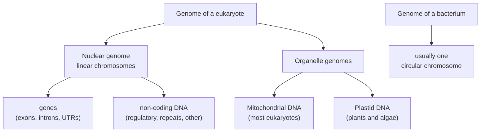

---
aliases:
  - Genomes
  - Génome
  - Genome Size
  - C-Value
  - Nuclear Genome
  - Organelle Genome
tags:
  - type/concept
  - domain/biology
  - domain/bioinformatics
  - level/L1
  - level/L2
  - level/L3
mastery: 0
prerequisites:
  - "[[DNA]]"
  - "[[Gene]]"
  - "[[Chromosome]]"
related:
  - "[[Ploidy]]"
  - "[[Mitochondrial DNA]]"
  - "[[Transposable Element]]"
  - "[[Reference Genome]]"
  - "[[FASTA Format]]"
  - "[[Genomic File Indexing]]"
  - "[[Genome Assembly]]"
  - "[[K-mer Spectrum]]"
  - "[[Gene Annotation]]"
  - "[[Pangenome]]"
  - "[[Comparative Genomics]]"
  - "[[Omics]]"
projects:
  - "[[bio-core]]"
  - "[[09-genome-browser]]"
  - "[[bio-visualization]]"
sources:
  - "[[Molecular Biology of the Cell (Alberts)]]"
  - "[[An Introduction to Genetic Analysis (Griffiths)]]"
  - "[[Biology 2e (OpenStax)]]"
  - "[[Blattner 1997 - The Complete Genome Sequence of Escherichia coli K-12]]"
  - "[[Goffeau 1996 - Life with 6000 Genes]]"
  - "[[Lander 2001 - Initial Sequencing and Analysis of the Human Genome]]"
  - "[[IHGSC 2004 - Finishing the Euchromatic Sequence of the Human Genome]]"
  - "[[Nurk 2022 - The Complete Sequence of a Human Genome]]"
  - "[[Anderson 1981 - Sequence and Organization of the Human Mitochondrial Genome]]"
  - "[[Elliott 2015 - The C-Value Enigma and the Evolution of Eukaryotic Genome Content]]"
  - "[[Fernández 2024 - A 160 Gbp Fork Fern Genome Shatters Size Record for Eukaryotes]]"
  - "[[Bioinformatics Data Skills (Buffalo)]]"
  - "[[Cornish-Bowden 1985 - Nomenclature for Incompletely Specified Bases in Nucleic Acid Sequences]]"
  - "[[NCBI GenBank]]"
  - "[[Ensembl]]"
  - "[[UCSC Genome Browser]]"
  - "[[Genome Reference Consortium]]"
---

# Genome

> [!abstract]
> A genome is the complete DNA of an organism, all its chromosomes plus the small genomes of its organelles, read as one long text of A, C, G and T that ranges from thousands to hundreds of billions of letters.

## Definition

The **genome** of an organism is its complete genetic information, carried in the full DNA sequence of its cells: the nuclear [[Chromosome|chromosomes]] and, in eukaryotes, the DNA of mitochondria and chloroplasts.[^alberts][^griffiths] The **genome size**, or **C-value**, is the amount of DNA in one unreplicated haploid set of nuclear chromosomes (1C).[^elliott] A diploid cell therefore holds about twice the genome size in its nucleus ([[Ploidy]]).

## Why it matters

- **Scale sets the computation.** Genome size decides how many reads a sequencing project needs, how much memory an assembler or an aligner's index uses, and how large every file is (Worked example). Public archives are measured in trillions of bases: GenBank held 34 trillion base pairs in its 2025 update.[^genbank]
- **Reference genomes are the coordinate system.** Reads are mapped to a [[Reference Genome]], variants are reported as differences from it ([[VCF Format]]), and genes are annotated on it ([[Gene Annotation]]). Ensembl alone served more than 4,800 eukaryotic and 31,300 prokaryotic genomes in 2025.[^ensembl]
- **Genomes are data files.** A genome is distributed as [[FASTA Format|FASTA]] with an index for random access ([[Genomic File Indexing]]), and displayed as tracks in a [[Genome Browser]] ([[09-genome-browser]]). [[bio-core]] models it as a typed object.
- **Genome content is a research question.** Why genomes differ so much in size, and what their non-coding DNA does, drives [[Comparative Genomics]], [[Transposable Element]] biology and [[Evolutionary Constraint]].[^elliott]

## Core (L1)

**What a genome contains.**



(Organelle genomes after Alberts; the bacterial chromosome is described in [[Chromosome]].[^alberts]) All the cells of an individual carry essentially the same genome; they differ in which genes they express ([[Gene Expression]], [[Cell Differentiation]]), and rare [[Somatic Mutation|somatic mutations]] are the exception.[^alberts]

**Units.** Genome sizes are counted in base pairs: 1 kb = 10³ bp, 1 Mb = 10⁶ bp, 1 Gb = 10⁹ bp. By convention "the human genome" means one haploid set.

**Genome sizes and gene numbers.**

| Organism | Genome size | Genes | Source |
|---|---|---|---|
| Human mitochondrial DNA | 16,569 bp | 37: 13 protein-coding, 2 rRNA, 22 tRNA | [^anderson] |
| *Mycoplasma genitalium* (bacterium) | about 580 kb | 468 | [^alberts-ch1] |
| *Escherichia coli* K-12 (bacterium) | 4,639,221 bp | 4,288 protein-coding | [^blattner] |
| *Saccharomyces cerevisiae* (budding yeast) | 12,068 kb, 16 chromosomes | 5,885 potential protein-coding, plus RNA genes | [^goffeau] |
| *Homo sapiens* (T2T-CHM13) | 3.055 Gb | about 20,000 to 25,000 protein-coding | [^nurk][^ihgsc] |
| *Paris japonica* (flowering plant) | 148.89 Gb | not annotated | [^fernandez] |
| *Tmesipteris oblanceolata* (fork fern) | 160.45 Gb, largest known in 2024 | not annotated | [^fernandez] |

![[genome-size-log-scale.svg]]

Three lessons from the table:

1. **Genomes span seven orders of magnitude.** From an organelle genome of 16.6 kb to a fern nucleus of 160 Gb; the fern has more than 50 times the DNA of a human.[^fernandez]
2. **Bacteria are compact.** *E. coli* packs about one gene per kilobase: bacterial genomes are mostly coding, with little DNA between genes ([[Gene#Deeper (L2)]]).[^alberts]
3. **In eukaryotes, size does not track gene number.** Humans have only about four times as many protein-coding genes as yeast, in a genome 250 times larger (Exercise 3).[^goffeau][^ihgsc]

## Deeper (L2)

### What is in the human genome

| Component | Share of the genome | Source |
|---|---|---|
| Protein-coding exons | about 34 Mb, 1.2% of the euchromatic genome | [^ihgsc] |
| Untranslated regions of transcripts | about 21 Mb, 0.7% | [^ihgsc] |
| Sequence derived from transposable elements | about half | [^lander] |
| Everything else: introns, regulatory elements, other repeats and intergenic DNA | the remainder (categories overlap) | [^lander][^ihgsc] |

Less than 2% of the human genome codes for protein. About half of it derives from [[Transposable Element|transposable elements]], whose overall activity has declined in the hominid lineage.[^lander] "The human genome size" also depends on what was sequenced: the 2004 finished euchromatic sequence had 2.85 billion nucleotides and 341 gaps,[^ihgsc] while the 2022 telomere-to-telomere assembly measures 3.055 Gb, adding nearly 200 Mb of previously missing sequence.[^nurk]

### The C-value paradox

Eukaryotic genome sizes vary more than 60,000-fold, and the variation is not explained by differences in gene number. Large differences between morphologically similar species were first noticed in the late 1940s and early 1950s; about twenty years later the puzzle was named the **C-value paradox**. The discovery that eukaryotic genomes contain vast quantities of non-protein-coding DNA resolved the paradox. It left the questions now called the **C-value enigma**: which kinds of sequence fill genomes, which of them drive size differences, and how DNA is gained and lost over evolution.[^elliott] The fork fern and the human make the point: 52 times more DNA (Exercise 1), with no reason to expect 52 times more genes.[^fernandez]

### Organelle genomes

Mitochondria and chloroplasts descend from bacteria taken up by an ancestral cell and keep small genomes of their own; most of their proteins are encoded in the nucleus and imported.[^alberts] The human mitochondrial genome is 16,569 bp with 37 genes,[^anderson] about 0.0005% of the nuclear genome size, and its genes are read with a variant genetic code ([[Genetic Code#Advanced (L3)]], [[Mitochondrial DNA]]).

### Genes per genome

Gene counts are estimates that change with evidence and definitions: the *E. coli* annotation of 1997 left 38% of its genes without an attributed function,[^blattner] and the human count fell from the 2001 draft to the finished sequence ([[Gene#Deeper (L2)]]).[^ihgsc] Always report the annotation release with a gene count ([[Gene Annotation]]).

## Advanced (L3)

### Reference genomes as data

A genome used in bioinformatics is a **versioned data object**, not a biological constant.

- **Assemblies have names and versions.** The same human assembly is called GRCh38 or hg38 depending on the resource,[^ucsc] and annotation releases are versioned on top of it; record both with every download.[^ensembl] Coordinates from one assembly are meaningless on another ([[Reference Genome]], [[Genomic Coordinate System]]).
- **References improve.** GRCh38 was the first coordinate-changing update of the human reference since 2009, fixing roughly 1,000 issues; later patches correct it without changing chromosome coordinates.[^grc] T2T-CHM13 is a gapless assembly of every chromosome except Y; it corrected errors in earlier references and added sequence containing 1,956 gene predictions, 99 of them predicted protein-coding.[^nurk] Analyses on older assemblies cannot see these regions.
- **A reference is one genome.** CHM13 comes from an essentially homozygous cell line; one sequence cannot represent human diversity, which is the motivation for [[Pangenome|pangenome]] references.[^nurk] At each position a linear reference holds exactly one allele ([[Allele]]).
- **An assembly is a model of a genome.** It is built from reads ([[Genome Assembly]]); repeats break it into contigs and scaffolds, and stretches of unknown sequence can be written as runs of `N`, the IUPAC symbol for any base.[^cornish] Before assembly, the genome size itself can be estimated from read data ([[K-mer Spectrum]], Exercise 5).
- **A sample may hold many genomes.** Environmental and microbiome samples mix the genomes of many species ([[Metagenomics]]).

### Genome files

A genome FASTA stores one record per chromosome or other sequence: a header line starting with `>` and the name, then the sequence on lines of fixed width.[^buffalo] Repeats are often written in lowercase (soft-masking, see [[Repeat Masking]]), and a companion index lets a tool read any region without loading the whole file.[^buffalo] With a fixed line width, the byte offset of any base is a simple formula (Mathematical representation), which is the idea behind `.fai` indexes ([[Genomic File Indexing]]).

## Mathematical representation

- A haploid genome is a list of sequences $\mathcal{G} = (C_1, \dots, C_m)$ over $\Sigma = \{A, C, G, T, N\}$ (plus lowercase for masking), with lengths $L_i = |C_i|$ and **genome size** $G = \sum_{i=1}^m L_i$. A diploid nucleus contains about $2G$ bases, not counting organelle DNA.
- **Gene density** $\rho = N_{\text{genes}} / G$ and **coding fraction** $f = \frac{1}{G}\sum |\text{CDS}|$ summarize compactness; for *E. coli*, $\rho \approx 0.92$ genes per kb, for human about $0.0074$ (Exercise 3).
- **Sequencing effort.** With $n$ reads of length $\ell$, the mean coverage is $c = n\ell / G$, so a target coverage needs $n = cG/\ell$ reads ([[Lander-Waterman Model]], [[Sequencing Coverage]]).
- **Genome size from k-mers.** Each read of length $\ell$ contains $\ell - k + 1$ k-mers, so the expected depth of a k-mer present once in the genome is $c_k = c\,(\ell - k + 1)/\ell$. If $K$ is the total number of k-mers counted in all reads,
$$\hat{G} = \frac{K}{c_k},$$
with $c_k$ read as the peak of the k-mer depth histogram ([[K-mer Spectrum]]).
- **FASTA byte offset.** If a record's first base is at byte $o$, with $b$ bases per line and $w$ bytes per line ($w = b + 1$ with `\n` line endings), the 0-based base $i$ is at byte
$$\mathrm{off}(i) = o + \left\lfloor i / b \right\rfloor w + (i \bmod b).$$

## Computational representation

The code writes an invented toy assembly as FASTA, builds an index in the spirit of `.fai`, fetches a region by seeking to its byte offset, and reports gaps and masking per record.

```python
import os
import tempfile

# Invented toy assembly: lowercase = soft-masked repeat, N = unknown bases (a gap).
TOY = {
    "chr1": "ACGTACGTTAGCatatatatatGGCCTTAANNNNNNNNNNCGATCGGATCCAGT",
    "chr2": "TTGACCAGTAGGCATCGATcgcgcgcgTTAGGCATGCA",
    "chrM": "GATCCGTAACGGTTACAAGT",
}

def write_fasta(path: str, records: dict[str, str], width: int = 10) -> None:
    """Write records with a fixed line width, as genome FASTA files are."""
    with open(path, "w") as f:
        for name, seq in records.items():
            f.write(f">{name}\n")
            for i in range(0, len(seq), width):
                f.write(seq[i:i + width] + "\n")

def build_index(path: str) -> dict[str, tuple[int, int, int, int]]:
    """name -> (length, byte offset of the first base, bases per line, bytes per line)."""
    index, name, offset = {}, None, 0
    with open(path, "rb") as f:
        for line in f:
            if line.startswith(b">"):
                name = line[1:].split()[0].decode()
                index[name] = [0, offset + len(line), None, None]
            else:
                entry = index[name]
                if entry[2] is None:
                    entry[2], entry[3] = len(line.rstrip(b"\n")), len(line)
                entry[0] += len(line.rstrip(b"\n"))
            offset += len(line)
    return {k: tuple(v) for k, v in index.items()}

def fetch(path: str, index: dict, name: str, start: int, end: int) -> str:
    """Bases start..end (1-based, inclusive), reading only the bytes needed."""
    length, first, bases, width = index[name]
    if not 1 <= start <= end <= length:
        raise ValueError("interval outside the sequence")

    def byte(pos0: int) -> int:              # 0-based base position -> file offset
        return first + (pos0 // bases) * width + pos0 % bases

    with open(path, "rb") as f:
        f.seek(byte(start - 1))
        raw = f.read(byte(end - 1) - byte(start - 1) + 1)
    return raw.replace(b"\n", b"").decode()

path = os.path.join(tempfile.mkdtemp(), "toy.fa")
write_fasta(path, TOY)
index = build_index(path)
for name, entry in index.items():
    seq = TOY[name]
    masked = sum(c.islower() for c in seq) / len(seq)
    print(name, entry, "N:", seq.upper().count("N"), "masked:", round(masked, 3))
print("genome size:", sum(entry[0] for entry in index.values()), "bp")
print(fetch(path, index, "chr1", 21, 45), TOY["chr1"][20:45])
```

```text
chr1 (54, 6, 10, 11) N: 10 masked: 0.185
chr2 (38, 72, 10, 11) N: 0 masked: 0.211
chrM (20, 120, 10, 11) N: 0 masked: 0.0
genome size: 112 bp
atGGCCTTAANNNNNNNNNNCGATC atGGCCTTAANNNNNNNNNNCGATC
```

Two decisions to document in real code: whether genome size counts `N` bases (here it does, as assembly lengths do), and whether organelle records are included in "the genome".

## Worked example

> [!example] How big is a human genome in a computer?
> Take $G = 3.055 \times 10^9$ bp (T2T-CHM13).[^nurk]
> 1. **FASTA text.** One byte per base plus one newline every 60 bases: $3.055 \times 10^9 \times 61/60 \approx 3.11 \times 10^9$ bytes, about 3.1 GB uncompressed.
> 2. **Two bits per base.** Four letters need 2 bits: $3.055 \times 10^9 / 4 \approx 7.6 \times 10^8$ bytes, about 764 MB (without `N` runs or masking, which need extra storage).
> 3. **A diploid cell.** About $2G = 6.11 \times 10^9$ bp of nuclear DNA.
> 4. **Sequencing at 30× with 150 bp reads.** $n = cG/\ell = 30 \times 3.055 \times 10^9 / 150 \approx 6.1 \times 10^8$ reads.
> 5. **Compared with *E. coli*** (4,639,221 bp):[^blattner] the same 30× needs about $9.3 \times 10^5$ reads, 658 times fewer.

## Common misconceptions

> [!warning] "A bigger genome means a more complex organism"
> Genome size varies more than 60,000-fold among eukaryotes and is not explained by gene number;[^elliott] a fern holds more than 50 times the DNA of a human.[^fernandez] This is the C-value paradox.

> [!warning] "The genome is the set of genes"
> Protein-coding exons are about 1.2% of the human euchromatic genome,[^ihgsc] and about half of the genome derives from transposable elements.[^lander] The genome is all the DNA; the genes are a small part of it in most eukaryotes.

> [!warning] "The reference genome is a normal human's genome"
> It is a versioned assembly of one genome (CHM13 for T2T), essentially homozygous and not representative of human diversity.[^nurk] At every position it holds one allele, which may be rare in a population ([[Allele]]).

> [!warning] "Genome size is the amount of DNA in a cell"
> Genome size (C-value) is one haploid set.[^elliott] A human body cell holds two sets in its nucleus, twice that during G2, plus mitochondrial DNA.

## Exercises

> [!question] Exercise 1 (L1)
> Using the table in Core, compute how many times larger the human genome is than the *E. coli* genome, how many times larger the fork fern genome is than the human genome, and the mitochondrial genome as a fraction of the human nuclear genome.

> [!success]- Solution
> $3.055 \times 10^9 / 4{,}639{,}221 \approx 658$; $160.45 / 3.055 \approx 52.5$; $16{,}569 / 3.055 \times 10^9 \approx 5.4 \times 10^{-6}$, i.e. 0.0005%.

> [!question] Exercise 2 (L1)
> Protein-coding exons cover about 34 Mb of the human genome.[^ihgsc] (a) What fraction of 3.055 Gb is that? (b) Exome sequencing targets these exons: how many 150 bp reads give 100× mean coverage of 34 Mb, compared with 30× of the whole genome?

> [!success]- Solution
> (a) $34 \times 10^6 / 3.055 \times 10^9 \approx 1.1\%$ (the source's 1.2% is relative to the euchromatic 2.85 Gb). (b) $100 \times 34 \times 10^6 / 150 \approx 2.3 \times 10^7$ reads, against $6.1 \times 10^8$ for 30× of the genome: about 27 times fewer reads, at the price of seeing only exons ([[Exome Sequencing]]).

> [!question] Exercise 3 (L2, Python)
> Compute genes per Mb and kb per gene for the organisms of the Core table that have a gene count (take 22,500 for human). What do the numbers say about genome organization?

> [!success]- Solution
> ```python
> genomes = {
>     "human mtDNA": (16_569, 37),
>     "M. genitalium": (580_000, 468),
>     "E. coli K-12": (4_639_221, 4_288),
>     "S. cerevisiae": (12_068_000, 5_885),
>     "H. sapiens": (3.055e9, 22_500),
> }
> for name, (size, genes) in genomes.items():
>     print(f"{name:14} {genes / (size / 1e6):9.1f} genes per Mb  {size / genes / 1e3:8.1f} kb per gene")
> ```
> ```text
> human mtDNA       2233.1 genes per Mb       0.4 kb per gene
> M. genitalium      806.9 genes per Mb       1.2 kb per gene
> E. coli K-12       924.3 genes per Mb       1.1 kb per gene
> S. cerevisiae      487.7 genes per Mb       2.1 kb per gene
> H. sapiens           7.4 genes per Mb     135.8 kb per gene
> ```
> Organelle and bacterial genomes are dense: about one gene per kilobase or less, so almost no room for non-coding DNA. Yeast is about half as dense. Human has one gene per 136 kb on average: introns, intergenic DNA and repeats dominate. Gene density, not size, separates compact from expanded genomes.

> [!question] Exercise 4 (L3, Python)
> Show that `fetch` from the code above returns exactly `seq[start-1:end]` for every interval of every toy record when the file is written with a line width of 7 instead of 10.

> [!success]- Solution
> ```python
> path = os.path.join(tempfile.mkdtemp(), "toy.fa")
> write_fasta(path, TOY, width=7)            # another line width
> index = build_index(path)
> checks = [fetch(path, index, name, s, e) == seq[s - 1:e]
>           for name, seq in TOY.items()
>           for s in range(1, len(seq) + 1) for e in range(s, len(seq) + 1)]
> print(all(checks), len(checks))
> ```
> Output: `True 2436`. The 2,436 intervals are all $\binom{L+1}{2}$ intervals of the three records ($1{,}485 + 741 + 210$). The offset formula depends only on the line width stored in the index, which is why indexed FASTA requires every line of a record (except the last) to have the same length.

> [!question] Exercise 5 (L3, Python)
> Simulate an invented random genome of 20,000 bp, sample error-free 100 bp reads at 30× coverage, count 21-mers, find the peak of the k-mer depth histogram and estimate the genome size. Compare with the expected peak $c_k$.

> [!success]- Solution
> ```python
> import random
> from collections import Counter
>
> random.seed(7)
> G, read_len, coverage, k = 20_000, 100, 30, 21
> genome = "".join("ACGT"[int(random.random() * 4)] for _ in range(G))   # invented random genome
> n_reads = coverage * G // read_len
> reads = []
> for _ in range(n_reads):                     # error-free reads from random positions
>     start = int(random.random() * (G - read_len + 1))
>     reads.append(genome[start:start + read_len])
>
> counts = Counter(r[i:i + k] for r in reads for i in range(read_len - k + 1))
> spectrum = Counter(counts.values())          # depth -> number of distinct k-mers
> peak = max((d for d in spectrum if d > 3), key=lambda d: spectrum[d])
> total = sum(counts.values())
> print(n_reads, total, peak, round(total / peak))
> ```
> Output: `6000 480000 23 20870`. Expected $c_k = 30 \times 80/100 = 24$; the observed peak is 23 because read placement is random (Poisson-like depth), so the estimate is 4% high. With real data, sequencing errors add a spike of low-depth k-mers (hence `d > 3`), heterozygosity adds a peak at half depth ([[Ploidy]]), and repeats add high-depth k-mers ([[K-mer Spectrum]]).

## Mastery checklist

- [ ] 1 Recognized: I can define genome, genome size (C-value) and organelle genome, and give the order of magnitude of bacterial, yeast and human genomes.
- [ ] 2 Understood: I can explain the C-value paradox, the composition of the human genome and why gene counts change.
- [ ] 3 Practiced: I can compute gene densities and sequencing requirements, index a FASTA file and fetch a region by byte offset.
- [ ] 4 Applied: in [[bio-core]] and [[09-genome-browser]], I load a real reference assembly, report its sequences, lengths and masked fraction, and record its assembly and annotation versions.
- [ ] 5 Explained: I can explain why a reference genome is a versioned model of one genome, what telomere-to-telomere assemblies and pangenomes change, and how genome size is estimated before assembly.

## References

[^alberts]: [[Molecular Biology of the Cell (Alberts)]], 4th ed. (2002), treatment of genomes, the genetic systems of mitochondria and plastids, and the constancy of the genome across the cells of an organism.
[^alberts-ch1]: [[Molecular Biology of the Cell (Alberts)]], 4th ed. (2002), ch. 1 "Cells and Genomes", section "The Diversity of Genomes and the Tree of Life", Table 1-1 "Some Genomes That Have Been Completely Sequenced".
[^griffiths]: [[An Introduction to Genetic Analysis (Griffiths)]], 7th ed. (2000), treatment of genomes and genomics.
[^elliott]: [[Elliott 2015 - The C-Value Enigma and the Evolution of Eukaryotic Genome Content]], *Philosophical Transactions of the Royal Society B*.
[^fernandez]: [[Fernández 2024 - A 160 Gbp Fork Fern Genome Shatters Size Record for Eukaryotes]], *iScience* 27(6):109889.
[^anderson]: [[Anderson 1981 - Sequence and Organization of the Human Mitochondrial Genome]], *Nature* 290:457-465.
[^blattner]: [[Blattner 1997 - The Complete Genome Sequence of Escherichia coli K-12]], *Science*.
[^goffeau]: [[Goffeau 1996 - Life with 6000 Genes]], *Science*.
[^lander]: [[Lander 2001 - Initial Sequencing and Analysis of the Human Genome]], *Nature* (abstract: transposable elements).
[^ihgsc]: [[IHGSC 2004 - Finishing the Euchromatic Sequence of the Human Genome]], *Nature* 431:931-945 (gene count, coding exons and UTR coverage, gaps).
[^nurk]: [[Nurk 2022 - The Complete Sequence of a Human Genome]], *Science* 376:44-53.
[^buffalo]: [[Bioinformatics Data Skills (Buffalo)]], treatment of FASTA files and indexed FASTA.
[^cornish]: [[Cornish-Bowden 1985 - Nomenclature for Incompletely Specified Bases in Nucleic Acid Sequences]], the IUPAC codes, including N.
[^genbank]: [[NCBI GenBank]], GenBank 2025 update (size of the archive).
[^ensembl]: [[Ensembl]], Ensembl 2025 (number of genomes; release and assembly versioning).
[^ucsc]: [[UCSC Genome Browser]], 2025 update (human GRCh38/hg38 assembly).
[^grc]: [[Genome Reference Consortium]], assembly releases and patches; GRCh38 paper (Schneider et al. 2017, *Genome Research*).
