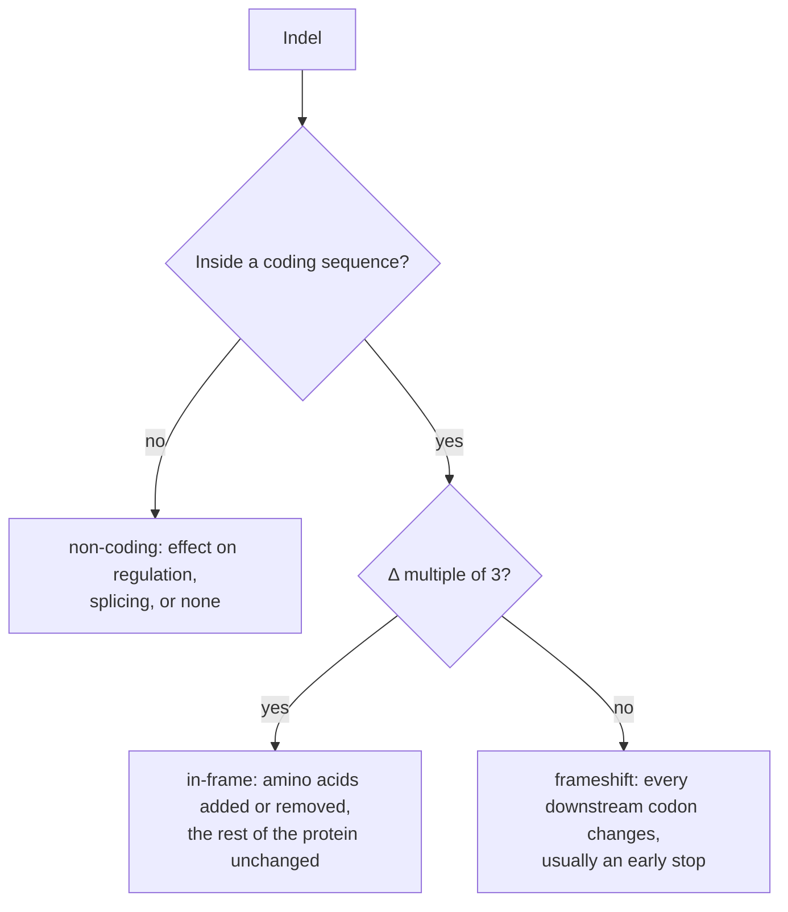

---
aliases:
  - InDel
  - Insertion-Deletion
  - Small Insertion
  - Small Deletion
  - Insertion-délétion
tags:
  - type/concept
  - domain/biology
  - domain/bioinformatics
  - level/L1
  - level/L2
  - level/L3
mastery: 0
prerequisites:
  - "[[Mutation]]"
  - "[[DNA Replication]]"
  - "[[Reading Frame]]"
  - "[[Genetic Code]]"
related:
  - "[[Frameshift Mutation]]"
  - "[[Point Mutation]]"
  - "[[Structural Variant]]"
  - "[[Genetic Variant]]"
  - "[[Variant Normalization]]"
  - "[[VCF Format]]"
  - "[[Variant Calling]]"
  - "[[Edit Distance]]"
  - "[[Gap Penalty]]"
  - "[[Read Mapping]]"
  - "[[Variant Nomenclature]]"
projects:
  - "[[03-genome-diff]]"
  - "[[06-mutation-lab]]"
sources:
  - "[[An Introduction to Genetic Analysis (Griffiths)]]"
  - "[[Crick 1961 - General Nature of the Genetic Code for Proteins]]"
  - "[[Ensembl]]"
  - "[[HTS Format Specifications]]"
  - "[[Tan 2015 - Unified Representation of Genetic Variants]]"
  - "[[den Dunnen 2016 - HGVS Recommendations for the Description of Sequence Variants]]"
  - "[[Richards 2015 - Standards and Guidelines for the Interpretation of Sequence Variants]]"
  - "[[Shendure 2008 - Next-Generation DNA Sequencing]]"
---

# Indel

> [!abstract]
> An indel is a small insertion or deletion of bases in a DNA sequence; its length decides whether a coding sequence keeps its reading frame, and inside repeats its position is ambiguous, which makes indels the hardest small variants to represent and to call.

## Definition

An **indel** is a mutation that inserts one or more nucleotides into a sequence, deletes them from it, or does both at the same site.[^griffiths] The term is used for small events; large deletions and duplications of chromosome segments belong to [[Structural Variant|structural variants]]. HGVS nomenclature distinguishes deletions (`del`), insertions (`ins`), duplications (`dup`, an insertion that copies the adjacent sequence) and deletion-insertions (`delins`).[^hgvs] Like every variant in sequencing data, an indel is described **relative to a reference**: a "deletion" means that the sample lacks bases present in the reference.

## Why it matters

- **Edit operations.** Comparing two sequences means finding substitutions, insertions and deletions ([[Edit Distance]], [[Sequence Alignment]]); [[03-genome-diff]] reports each indel with its coordinates and its effect on codons.
- **Reading frame.** In a coding sequence, an indel whose length is not a multiple of 3 is a `frameshift_variant` (HIGH impact); one whose length is a multiple of 3 is an `inframe_insertion` or `inframe_deletion` (MODERATE).[^ensembl] [[06-mutation-lab]] shows both ([[Frameshift Mutation]]).
- **Representation is not unique.** In a repeat, the same indel can be written at several positions, so two call sets can disagree only in notation; normalization fixes one representation before comparing or annotating.[^tan]
- **Hard to call.** Indels concentrate in homopolymers and tandem repeats, exactly where sequencing and alignment are least reliable (see L3).

## Core (L1)

### Insertions, deletions and length

```text
reference   ATG GCT GAA CGT TAA
deletion    ATG GC- GAA CGT TAA      1 nt deleted: net change -1
insertion   ATG GCT GAA aCG TTA A    1 nt inserted (a): net change +1
in-frame    ATG --- GAA CGT TAA      3 nt deleted: one codon removed
```

(Invented toy sequence; dashes mark deleted bases, lowercase an inserted one, and the insertion regroups every downstream base.) What matters for a coding sequence is the **net length change** $\Delta$ = inserted − deleted bases:



The triplet logic was established with indels: Crick, Brenner and colleagues added or removed single bases in a phage gene with the acridine dye proflavin; one or two changes destroyed the gene, three together restored it.[^crick61] Details in [[Frameshift Mutation]].

### Where indels come from

Many indels arise where a sequence repeats itself. During [[DNA Replication]] in a run of identical bases or a tandem repeat, the new strand can slip and loop out, adding or removing units; intercalating agents such as acridines also cause insertions and deletions.[^griffiths]

## Deeper (L2)

### Representation in VCF

A VCF record gives `POS`, the 1-based position of the first base of `REF`, and the alleles `REF` and `ALT`. For an insertion or deletion one allele would be empty, so both alleles include the **reference base just before the event** (the anchor or padding base), and `POS` points to it.[^hts]

```text
CHROM  POS  REF  ALT        reference  ...G C A T T G...   (positions 10-15, invented)
chr1   12   AT   A          deletion of one T of the run at 13-14
chr1   13   T    TGG        insertion of GG after 13
```

### One indel, several positions

In a run of identical bases, deleting any copy gives the same sequence: the event has no single position.

![[indel-equivalent-positions.svg]]

The rule behind it (0-based, deletion of $\ell$ bases starting at $i$): shifting the deletion one base to the right gives the same sequence if and only if $s_i = s_{i+\ell}$ (proof in the Mathematical representation). A deletion can therefore slide along a homopolymer, or along a tandem repeat by whole units, and every position is a correct description.

### Normalization

Tan, Abecasis and Kang defined a canonical VCF form: an entry is **left-aligned** if its position is the smallest among all entries of the same allele length that represent the same variant; **parsimonious** if its alleles are the shortest possible; **normalized** if and only if it is both.[^tan] They showed that tools represented variants inconsistently, which magnifies the discrepancies between call sets and complicates filtering and duplicate removal.[^tan] Normalizing before comparing, merging or annotating is standard ([[Variant Normalization]]).

Clinical nomenclature goes the other way. The HGVS **3' rule** describes a variant that could sit at several positions at its most 3' position.[^hgvs] In the figure, VCF writes `POS=3 REF=GA ALT=G` and HGVS writes `c.9del`: the same deletion, placed at opposite ends of the run. Pipelines that produce both must shift the indel when converting ([[Variant Nomenclature]]).

## Advanced (L3)

### Why indels are harder to call than substitutions

Three problems pile up at the same places, homopolymers and tandem repeats:

1. **Biology.** Replication slippage makes repeats indel hotspots,[^griffiths] so true indels are frequent exactly there.
2. **Technology.** Some platforms make indel errors in homopolymers. In pyrosequencing (454), the length of a homopolymer is read from the intensity of a light signal, and insertion-deletion errors in homopolymers were its main error type.[^shendure] A true 1-bp deletion and a sequencing error then look alike.
3. **Computation.** The position is ambiguous (above), and an indel near the end of a read is cheaper to explain with mismatches or by clipping the read end than with a gap (Exercise 5). Reads carrying the same indel can be aligned in different ways, one motivation for callers that realign or reassemble all reads of a region together ([[Variant Calling]], [[Read Mapping]]).

### In-frame does not mean harmless

An in-frame indel removes or adds amino acids and can break a domain. Clinical guidelines count protein length changes from in-frame indels in a non-repeat region as moderate evidence of pathogenicity (PM4), and in-frame indels in a repetitive region without known function as supporting evidence of a benign effect (BP3).[^richards]

## Mathematical representation

Let $s = s_0 s_1 \dots s_{n-1}$ be a sequence (0-based).

- **Deletion** of $\ell$ bases at $i$: $\operatorname{del}(s, i, \ell) = s_{0..i-1}\, s_{i+\ell..n-1}$. **Insertion** of a word $u$ before $i$: $\operatorname{ins}(s, i, u) = s_{0..i-1}\, u\, s_{i..n-1}$.
- **Net change** of a VCF record: $\Delta = |\mathrm{ALT}| - |\mathrm{REF}|$. In a coding sequence the record keeps the frame if and only if $\Delta \equiv 0 \pmod 3$.
- **Shift lemma.** $\operatorname{del}(s, i, \ell) = \operatorname{del}(s, i+1, \ell) \iff s_i = s_{i+\ell}$.

  *Proof.* The two results share the prefix $s_{0..i-1}$ and the suffix $s_{i+\ell+1..n-1}$. Between them, the first result has the single base $s_{i+\ell}$ and the second has $s_i$. They are equal if and only if these bases are. ∎

- **Consequence.** The set of starts giving the same deletion is an interval $[i_{\min}, i_{\max}]$; the left-aligned representation uses $i_{\min}$, the HGVS 3' rule uses $i_{\max}$. Inside a run of $r$ identical bases, a 1-base deletion has $r$ equivalent positions.

## Computational representation

```python
def apply_variant(seq: str, pos: int, ref: str, alt: str) -> str:
    """Apply a VCF-style variant (1-based pos of the first REF base) to a sequence."""
    assert seq[pos - 1:pos - 1 + len(ref)] == ref, "REF does not match the reference"
    return seq[:pos - 1] + alt + seq[pos - 1 + len(ref):]

def frame_effect(ref: str, alt: str) -> str:
    delta = len(alt) - len(ref)
    return "substitution" if delta == 0 else "in-frame" if delta % 3 == 0 else "frameshift"

def normalize(seq: str, pos: int, ref: str, alt: str) -> tuple[int, str, str]:
    """Left-align and trim a variant so that one change has one representation."""
    while True:
        if ref and alt and ref[-1] == alt[-1]:        # drop a shared last base
            ref, alt = ref[:-1], alt[:-1]
        elif not ref or not alt:                      # an allele is empty: add the base on the left
            pos -= 1
            ref, alt = seq[pos - 1] + ref, seq[pos - 1] + alt
        else:
            break
    while len(ref) > 1 and len(alt) > 1 and ref[0] == alt[0]:   # drop shared first bases
        ref, alt, pos = ref[1:], alt[1:], pos + 1
    return pos, ref, alt

def equivalent_deletions(seq: str, start: int, length: int) -> list[int]:
    """1-based first deleted base of every deletion giving the same sequence as seq[start:start+length]."""
    target = seq[:start - 1] + seq[start - 1 + length:]
    return [i + 1 for i in range(len(seq) - length + 1) if seq[:i] + seq[i + length:] == target]

ref_seq = "ATGAAAAAAGCTTAA"                       # invented toy CDS: Met-Lys-Lys-Ala-stop
calls = [(3, "GA", "G"), (6, "AA", "A"), (8, "AAG", "AG"), (9, "AG", "G")]   # four callers, one deletion
for call in calls:
    print(call, apply_variant(ref_seq, *call), normalize(ref_seq, *call), frame_effect(*call[1:]))
print(equivalent_deletions(ref_seq, 4, 1))

repeat = "GGCACACATT"                               # invented: a (CA)3 tandem repeat
print(equivalent_deletions(repeat, 3, 2), normalize(repeat, 7, "CAT", "T"))
```

Output:

```text
(3, 'GA', 'G') ATGAAAAAGCTTAA (3, 'GA', 'G') frameshift
(6, 'AA', 'A') ATGAAAAAGCTTAA (3, 'GA', 'G') frameshift
(8, 'AAG', 'AG') ATGAAAAAGCTTAA (3, 'GA', 'G') frameshift
(9, 'AG', 'G') ATGAAAAAGCTTAA (3, 'GA', 'G') frameshift
[4, 5, 6, 7, 8, 9]
[3, 4, 5, 6, 7] (2, 'GCA', 'G')
```

The loop first trims a shared last base, or extends both alleles one base to the left when one of them is empty, until the alleles end differently; then it trims shared first bases while keeping at least one base in each allele. `normalize` needs the reference sequence: normalization is impossible from the VCF line alone.

## Worked example

> [!example] Four callers, one deletion (invented data)
> Reference CDS `ATG AAA AAA GCT TAA` (Met-Lys-Lys-Ala-stop), positions 1-based. A sample lacks one A of the run at positions 4-9.
>
> 1. **Four valid records.** `3 GA→G`, `6 AA→A`, `8 AAG→AG` and `9 AG→G` all produce `ATGAAAAAGCTTAA`. A naive comparison of VCF lines would count four different variants.
> 2. **Normalize.** Each record reduces to `POS=3 REF=GA ALT=G`: parsimonious (one anchor base, one deleted base) and left-aligned (the leftmost of the six equivalent positions).
> 3. **HGVS.** With `c.1` at the A of ATG, the run occupies c.4 to c.9; the 3' rule gives `c.9del`.
> 4. **Effect.** $\Delta = -1$: a frameshift. The new reading frame is `ATG AAA AAG CTT AA...` (Met-Lys-Lys-Leu...), and the rest of the protein depends on the sequence downstream ([[Frameshift Mutation]]).

## Common misconceptions

> [!warning] "An indel has one true position"
> Inside a homopolymer or a tandem repeat, all placements give the same sequence. VCF (left-aligned) and HGVS (3' rule) pick different, equally correct ends.

> [!warning] "Two VCF files agree if their lines are identical"
> The same indel can be written in several valid records. Compare call sets only after normalization.[^tan]

> [!warning] "A deletion in my sample means DNA was lost"
> It means the sample lacks bases that the reference has. If the reference carries the derived allele, the historical event was an insertion in the reference lineage.

> [!warning] "In-frame indels are harmless"
> They keep the downstream frame but add or remove residues, which can disrupt a domain; guidelines weigh them differently inside and outside repeats (PM4, BP3).[^richards]

## Exercises

> [!question] Exercise 1 (L1)
> In a coding sequence, classify these net length changes: −1, +3, −4, +2, −6, +5.

> [!success]- Solution
> −1, −4, +2, +5: frameshift (not multiples of 3). +3 and −6: in-frame (one codon added, two codons removed).

> [!question] Exercise 2 (L1)
> Reference `ACGTACGT` (invented, positions 1-based). Write a VCF record for the insertion of `TT` right after position 4. Is it normalized?

> [!success]- Solution
> The anchor is the T at position 4: `POS=4 REF=T ALT=TTT`. It is not left-aligned: the result `ACGTTTACGT` has a run of three T, and the insertion can be placed before the reference T. `normalize("ACGTACGT", 4, "T", "TTT")` returns `(3, 'G', 'GTT')`, which gives the same sequence.

> [!question] Exercise 3 (L2)
> In `GGCACACATT` (invented), one `CA` unit of the repeat is deleted. List the equivalent placements, the normalized VCF record and the HGVS genomic description with the 3' rule.

> [!success]- Solution
> Deleting 2 bases starting at positions 3, 4, 5, 6 or 7 all give `GGCACATT` (`equivalent_deletions(repeat, 3, 2)`). Normalized VCF: `POS=2 REF=GCA ALT=G`. HGVS, most 3' placement: `g.7_8del`. By the shift lemma, the deletion slides while $s_i = s_{i+2}$, i.e. along the CA repeat.

> [!question] Exercise 4 (L2, Python)
> Using `normalize` and `ref_seq` from the code above, normalize the records `(6, "AA", "A")`, `(8, "AAG", "AG")`, `(1, "ATGA", "ATG")` and `(5, "A", "AA")`, and count the distinct variants.

> [!success]- Solution
> ```python
> records = [(6, "AA", "A"), (8, "AAG", "AG"), (1, "ATGA", "ATG"), (5, "A", "AA")]
> normalized = {normalize(ref_seq, *rec) for rec in records}
> print(sorted(normalized))
> # [(3, 'G', 'GA'), (3, 'GA', 'G')]
> ```
>
> Four records, two variants: three descriptions of the same 1-A deletion, and a 1-A insertion in the same run. Deduplication must happen after normalization.

> [!question] Exercise 5 (L3)
> An aligner scores match +1, mismatch −4, opening a gap −6, and can clip the end of a read at no cost (invented scores). A read carries a 1-base deletion followed by its last $k$ bases. (a) For which $k$ does the gapped alignment beat an ungapped one in which the $k$ bases all mismatch? (b) For which $k$ does it beat clipping the $k$ bases? (c) What changes if the deletion lies in a homopolymer that continues to the end of the read?

> [!success]- Solution
> With $m$ matched bases before the deletion: gapped $= m + k - 6$; ungapped $= m - 4k$; clipped $= m$. (a) $m + k - 6 > m - 4k \iff k > 1.2$, so $k \ge 2$. (b) $m + k - 6 > m \iff k > 6$, so $k \ge 7$. Within 6 bases of the read end, the indel is clipped away and invisible in this read. (c) Shifted by one base inside a run, the $k$ bases still match: the ungapped alignment costs nothing, and the deletion disappears even for large $k$. Callers therefore need reads where the indel is internal, and they reconsider all reads of a region together.

> [!question] Exercise 6 (L3)
> A draft bacterial genome assembled from pyrosequencing reads shows a conserved gene with a 1-bp deletion in a run of eight A, which causes a frameshift. Before calling the gene a pseudogene, what would you check?

> [!success]- Solution
> That the deletion is real and not a homopolymer error of the platform:[^shendure] read support on both strands, the distribution of run lengths among reads, and ideally reads from another technology or a PCR and Sanger check. Also check that the call is normalized and compare the gene with close relatives: a frameshift in a gene that is intact in every relative, at a homopolymer, is more likely an artefact.

## Mastery checklist

- [ ] 1 Recognized: I can define insertions, deletions and delins, and relate indel length to the reading frame.
- [ ] 2 Understood: I can explain the VCF anchor base, why indel position is ambiguous in repeats, and the difference between VCF left alignment and the HGVS 3' rule.
- [ ] 3 Practiced: I can apply, left-normalize and classify indels in Python, and prove the shift lemma.
- [ ] 4 Applied: in [[03-genome-diff]], I output normalized indels in VCF with their frame effect and compare them with another tool's calls.
- [ ] 5 Explained: I can explain why indels in homopolymers are hard to call (biology, technology, alignment) and why in-frame indels are not automatically benign.

## References

[^griffiths]: [[An Introduction to Genetic Analysis (Griffiths)]], 7th ed. (2000), treatment of gene mutation (insertions and deletions, replication slippage in repeats, intercalating mutagens).
[^hgvs]: [[den Dunnen 2016 - HGVS Recommendations for the Description of Sequence Variants]], DNA-level variant types and the 3' rule.
[^ensembl]: [[Ensembl]], Variant Effect Predictor, "Calculated variant consequences" (`frameshift_variant`, `inframe_insertion`, `inframe_deletion`).
[^tan]: [[Tan 2015 - Unified Representation of Genetic Variants]], *Bioinformatics* 31(13):2202-2204.
[^crick61]: [[Crick 1961 - General Nature of the Genetic Code for Proteins]], *Nature* 192:1227-1232.
[^hts]: [[HTS Format Specifications]], VCF specification (fixed fields `POS`, `REF`, `ALT`).
[^shendure]: [[Shendure 2008 - Next-Generation DNA Sequencing]], *Nature Biotechnology* 26(10):1135-1145, on the 454 pyrosequencing platform.
[^richards]: [[Richards 2015 - Standards and Guidelines for the Interpretation of Sequence Variants]], criteria PM4 and BP3.
