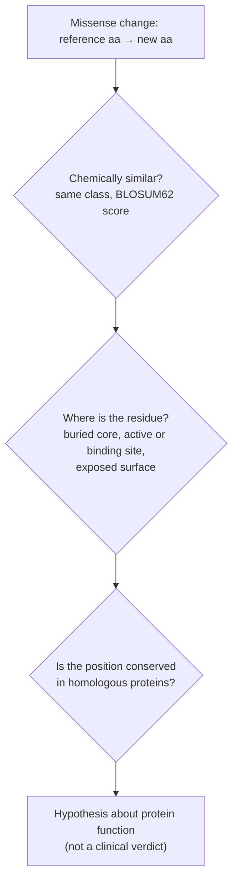

---
aliases:
  - Missense Variant
  - missense_variant
  - Mutation faux-sens
tags:
  - type/concept
  - domain/biology
  - domain/bioinformatics
  - level/L1
  - level/L2
  - level/L3
mastery: 0
prerequisites:
  - "[[Point Mutation]]"
  - "[[Genetic Code]]"
  - "[[Codon]]"
  - "[[Amino Acid]]"
related:
  - "[[Mutation]]"
  - "[[Silent Mutation]]"
  - "[[Nonsense Mutation]]"
  - "[[Substitution Matrix]]"
  - "[[Protein Structure]]"
  - "[[Variant Annotation]]"
  - "[[Variant Effect Prediction]]"
  - "[[Variant Classification]]"
  - "[[Variant Nomenclature]]"
  - "[[Molecular Evolution]]"
projects:
  - "[[06-mutation-lab]]"
  - "[[03-genome-diff]]"
sources:
  - "[[An Introduction to Genetic Analysis (Griffiths)]]"
  - "[[Molecular Biology of the Cell (Alberts)]]"
  - "[[Biochemistry (Berg)]]"
  - "[[Henikoff 1992 - Amino Acid Substitution Matrices from Protein Blocks]]"
  - "[[Biological Sequence Analysis (Durbin)]]"
  - "[[ClinVar]]"
  - "[[den Dunnen 2016 - HGVS Recommendations for the Description of Sequence Variants]]"
  - "[[Richards 2015 - Standards and Guidelines for the Interpretation of Sequence Variants]]"
  - "[[Ensembl]]"
  - "[[Molecular Evolution (Yang)]]"
---

# Missense Mutation

> [!abstract]
> A missense mutation changes one codon into a codon for another amino acid: the protein keeps its length but carries one substituted residue, with an effect that ranges from none to severe.

## Definition

A **missense mutation** is a nucleotide substitution in a coding sequence that turns a sense codon into a codon for a **different amino acid**, not into a stop codon.[^griffiths] Ensembl's Variant Effect Predictor calls this consequence `missense_variant`: one or more bases changed, a different amino acid sequence, the length preserved.[^ensembl] It is one of the effect classes of a [[Point Mutation]], next to [[Silent Mutation|silent]] and [[Nonsense Mutation|nonsense]] changes ([[Mutation#Core (L1)]]).

## Why it matters

- **The commonest coding outcome.** Under a uniform model, 392 of the 549 single-base changes of sense codons (71 %) are missense ([[Mutation#Mathematical representation]]).
- **The label says little about the effect.** Annotation gives missense a MODERATE impact, between LOW for synonymous and HIGH for stop-gained or frameshift variants.[^ensembl] Predictors that score missense changes exist, and clinical guidelines accept them only as supporting evidence.[^richards]
- **Same logic as protein alignment.** A substitution matrix such as BLOSUM62 ([[Substitution Matrix]]), used to score protein alignments, is a table of which replacements related proteins tolerate: a first quantitative handle on missense severity.[^henikoff]
- **Evolution and structure.** Comparing amino-acid-changing and synonymous substitution rates detects selection ([[Molecular Evolution]]);[^yang] placing a changed residue on a 3D structure is a core use of [[Structural Bioinformatics]].
- **Lab.** [[06-mutation-lab]] shows the codon and amino acid change of each substitution, and [[03-genome-diff]] propagates variants to proteins. Both report the **molecular consequence only**, never a clinical prediction.

## Core (L1)

### Predicting the amino acid change

With the 0-based position $i$ of the substitution in the coding sequence (the A of ATG is 0):

1. **Find the codon**: codon number $k = \lfloor i/3 \rfloor + 1$ (Met is codon 1), position in the codon $j = i \bmod 3$.
2. **Substitute** the base at position $j$ of that codon.
3. **Read** the old and the new codon in the [[Genetic Code]].
4. **Compare**: another amino acid (not a stop) means missense.

GAG → GTG turns Glu into Val. The protein change is written `p.Glu2Val` (short form `E2V`): reference amino acid, position counted with the initiator Met as 1, new amino acid.[^hgvs]

### Amino acid classes

The 20 [[Amino Acid|amino acids]] are grouped by the chemistry of their side chains.[^alberts][^berg]

| Class | Amino acids | Side chain at pH 7 |
|---|---|---|
| Nonpolar | Gly G, Ala A, Val V, Leu L, Ile I, Pro P, Phe F, Met M, Trp W, Cys C | uncharged, hydrophobic |
| Uncharged polar | Ser S, Thr T, Asn N, Gln Q, Tyr Y | uncharged, forms hydrogen bonds |
| Acidic | Asp D, Glu E | negatively charged |
| Basic | Lys K, Arg R, His H | positively charged (His only partly) |

A few borderline residues (Gly, Cys, Tyr, His, Trp) are placed differently from one textbook to another; this table follows Alberts. A replacement inside a class (Asp → Glu, Leu → Ile) is called **conservative**; one across classes (Glu → Val: a negative charge replaced by a hydrophobic side chain) is **non-conservative**.

### Reasoning about severity



Three questions, each needing more data: how different the two amino acids are; where the residue sits (nonpolar side chains tend to be buried inside water-soluble proteins, polar and charged ones on the surface[^berg]); and whether homologous proteins keep it. Computational predictors combine exactly these ingredients: conservation, location in the protein and the biochemistry of the substitution.[^richards]

### A real case: sickle-cell hemoglobin

The sickle-cell allele of the β-globin gene (HBB) is a missense change: codon GAG becomes GTG, glutamate becomes valine.[^griffiths][^berg] ClinVar lists it as `NM_000518.5(HBB):c.20A>T (p.Glu7Val)`, rs334, also known by its classical name Glu6Val; one copy gives sickle-cell trait, two copies sickle-cell anemia.[^clinvar] The valine lies on the protein surface: in deoxygenated hemoglobin it creates a hydrophobic patch that sticks to a neighboring molecule, so hemoglobin S polymerizes into fibers that deform red blood cells.[^berg] One charged-to-hydrophobic replacement at an exposed position is enough.

## Deeper (L2)

### One base change reaches only some amino acids

Synonymous codons share bases, so a single substitution cannot reach every other amino acid. GAG (Glu) reaches Lys, Gln, Ala, Gly, Val and Asp (and a stop, TAG), never Trp or Phe. Over the whole code, an amino acid reaches between 5 (Trp) and 12 (Arg, Ser) of the 19 others in one step, 7.5 on average (a short computation over the codon table). The reachable changes are also biased toward similar amino acids: of the 392 one-step missense changes, 40.3 % stay within a class, against 31.1 % of all 380 ordered pairs of distinct amino acids (Exercise 4), in line with the robustness of the code ([[Genetic Code#Robustness to mutations]]).

### Substitution matrices, a preview

A substitution matrix scores each pair of amino acids with a log-odds ratio: how much more often the pair is aligned in related proteins than expected by chance.[^durbin] The BLOSUM matrices were counted in about 2,000 blocks of aligned segments from more than 500 groups of related proteins; for BLOSUM62, segments at least 62 % identical are clustered so that close relatives do not dominate the counts. Scores are rounded to half-bit units.[^henikoff] The one-step changes of Glu:

| Change | Classes | BLOSUM62 |
|---|---|---:|
| Glu → Asp | acidic → acidic | +2 |
| Glu → Gln | acidic → polar | +2 |
| Glu → Lys | acidic → basic | +1 |
| Glu → Ala | acidic → nonpolar | −1 |
| Glu → Gly | acidic → nonpolar | −2 |
| Glu → Val | acidic → nonpolar | −2 |

The matrix refines the classes: Gln is the amide of Glu[^berg] and scores high although it is "polar", and even Glu → Lys, a charge reversal, is accepted more often than chance. A matrix averages over all positions of many proteins, so it gives a prior, not a verdict on one site: the sickle-cell Glu → Val scores −2 like any other Glu → Val.

### Special residues

Gly has a single hydrogen atom as side chain, which gives the backbone unusual flexibility; the side chain of Pro is bonded to its own backbone nitrogen, which makes it rigid and disrupts α helices; two Cys can be joined by a disulfide bond.[^berg] A change to or from these residues can alter structure more than its class suggests.

### Several bases, one codon

VEP's missense class also covers multi-base changes that keep the length, such as GAG → GTC (Glu → Val).[^ensembl] If a caller reports the same event as two single-base records, each one annotated alone gives another answer (GAG → GTG is Val, GAG → GAC is Asp). The protein consequence depends on which bases lie on the same chromosome ([[Haplotype]]) and on how the variant is represented ([[Variant Normalization]]).

## Advanced (L3)

### From molecular consequence to interpretation

Clinical guidelines reason at the level of the amino acid change. The same amino acid change as an established pathogenic variant, whatever the nucleotide change, is strong evidence (criterion PS1); a different missense change at a residue where another one is pathogenic is moderate evidence (PM5). Agreement of computational predictors counts only as supporting evidence (PP3 for a damaging effect, BP4 for a benign one).[^richards] Codon arithmetic matters here: Val (GTG) → Leu arises from GTG → CTG or GTG → TTG, two nucleotide variants with one protein change. [[Variant Effect Prediction]] and [[Variant Classification]] take this further; [[06-mutation-lab]] stops at the molecular consequence.

### Selection on missense changes

Molecular evolution compares the rate of non-synonymous substitutions per non-synonymous site, $d_N$, with the synonymous rate $d_S$: $\omega = d_N/d_S < 1$ indicates purifying selection removing amino acid changes, $\omega = 1$ neutral evolution, $\omega > 1$ positive selection.[^yang] Missense changes are the raw material of $d_N$ ([[Molecular Evolution]]).

## Mathematical representation

Let $g : \mathcal{C} \to \mathcal{A} \cup \{*\}$ be the genetic code on the 64 codons ([[Genetic Code#Mathematical representation]]). A substitution at 0-based position $i$ of a coding sequence hits codon $c$ at position $j = i \bmod 3$ and gives $c'$, equal to $c$ except $c'_j = b \ne c_j$. It is **missense** if and only if

$$g(c) \ne *, \qquad g(c') \ne *, \qquad g(c') \ne g(c).$$

- **Neighbourhood**: $N(c) = \{c' : d_H(c, c') = 1\}$, with $d_H$ the Hamming distance; $|N(c)| = 9$.
- **Reachable amino acids**: $R(a) = \{g(c') : c \in g^{-1}(a),\ c' \in N(c)\} \setminus \{a, *\}$; for example $R(\text{Glu}) = \{\text{Lys, Gln, Ala, Gly, Val, Asp}\}$.
- **Classes**: $\kappa : \mathcal{A} \to \{\text{nonpolar, polar, acidic, basic}\}$; a change $a \to b$ is conservative if $\kappa(a) = \kappa(b)$.
- **BLOSUM score**: with $q_{ab}$ the frequency with which $a$ and $b$ are aligned in the blocks (ordered pairs, so $q_{ab} = q_{ba}$) and $p_a$ the background frequency of $a$,

$$s(a, b) = \operatorname{round}\left(2 \log_2 \frac{q_{ab}}{p_a\, p_b}\right),$$

positive when the pair is aligned more often than chance.[^henikoff]

## Computational representation

A consumer of VCF files needs the transcript (CDS sequence and strand) to compute this; the output is a consequence term plus an HGVS protein change. By hand, with the standard library:

```python
BASES = "TCAG"
CODE = dict(zip((a + b + c for a in BASES for b in BASES for c in BASES),
                "FFLLSSSSYY**CC*WLLLLPPPPHHQQRRRRIIIMTTTTNNKKSSRRVVVVAAAADDEEGGGG"))
THREE = dict(zip("ACDEFGHIKLMNPQRSTVWY*",
                 "Ala Cys Asp Glu Phe Gly His Ile Lys Leu Met Asn Pro Gln Arg Ser Thr Val Trp Tyr Ter".split()))
CLASS = {**dict.fromkeys("GAVLIPFMWC", "nonpolar"), **dict.fromkeys("STNQY", "polar"),
         **dict.fromkeys("DE", "acidic"), **dict.fromkeys("KRH", "basic")}
# BLOSUM62 (Henikoff 1992), half-bit units, rows and columns in this order:
AA = "ARNDCQEGHILKMFPSTWYV"
ROWS = """
 4 -1 -2 -2  0 -1 -1  0 -2 -1 -1 -1 -1 -2 -1  1  0 -3 -2  0
-1  5  0 -2 -3  1  0 -2  0 -3 -2  2 -1 -3 -2 -1 -1 -3 -2 -3
-2  0  6  1 -3  0  0  0  1 -3 -3  0 -2 -3 -2  1  0 -4 -2 -3
-2 -2  1  6 -3  0  2 -1 -1 -3 -4 -1 -3 -3 -1  0 -1 -4 -3 -3
 0 -3 -3 -3  9 -3 -4 -3 -3 -1 -1 -3 -1 -2 -3 -1 -1 -2 -2 -1
-1  1  0  0 -3  5  2 -2  0 -3 -2  1  0 -3 -1  0 -1 -2 -1 -2
-1  0  0  2 -4  2  5 -2  0 -3 -3  1 -2 -3 -1  0 -1 -3 -2 -2
 0 -2  0 -1 -3 -2 -2  6 -2 -4 -4 -2 -3 -3 -2  0 -2 -2 -3 -3
-2  0  1 -1 -3  0  0 -2  8 -3 -3 -1 -2 -1 -2 -1 -2 -2  2 -3
-1 -3 -3 -3 -1 -3 -3 -4 -3  4  2 -3  1  0 -3 -2 -1 -3 -1  3
-1 -2 -3 -4 -1 -2 -3 -4 -3  2  4 -2  2  0 -3 -2 -1 -2 -1  1
-1  2  0 -1 -3  1  1 -2 -1 -3 -2  5 -1 -3 -1  0 -1 -3 -2 -2
-1 -1 -2 -3 -1  0 -2 -3 -2  1  2 -1  5  0 -2 -1 -1 -1 -1  1
-2 -3 -3 -3 -2 -3 -3 -3 -1  0  0 -3  0  6 -4 -2 -2  1  3 -1
-1 -2 -2 -1 -3 -1 -1 -2 -2 -3 -3 -1 -2 -4  7 -1 -1 -4 -3 -2
 1 -1  1  0 -1  0  0  0 -1 -2 -2  0 -1 -2 -1  4  1 -3 -2 -2
 0 -1  0 -1 -1 -1 -1 -2 -2 -1 -1 -1 -1 -2 -1  1  5 -2 -2  0
-3 -3 -4 -4 -2 -2 -3 -2 -2 -3 -2 -3 -1  1 -4 -3 -2 11  2 -3
-2 -2 -2 -3 -2 -1 -2 -3  2 -1 -1 -2 -1  3 -3 -2 -2  2  7 -1
 0 -3 -3 -3 -1 -2 -2 -3 -3  3  1 -2  1 -1 -2 -2  0 -3 -1  4"""
BLOSUM62 = {(a, b): int(s) for a, row in zip(AA, ROWS.split("\n")[1:])
            for b, s in zip(AA, row.split())}

def missense_effect(cds: str, pos: int, alt: str) -> dict:
    """Effect of the substitution cds[pos] -> alt (0-based) on its codon."""
    k, j = divmod(pos, 3)                        # codon index, position in codon
    ref_codon = cds[3 * k:3 * k + 3]
    alt_codon = ref_codon[:j] + alt + ref_codon[j + 1:]
    a, b = CODE[ref_codon], CODE[alt_codon]
    kind = "silent" if a == b else "nonsense" if b == "*" else "stop-loss" if a == "*" else "missense"
    out = {"codon": f"{ref_codon}>{alt_codon}", "change": f"p.{THREE[a]}{k + 1}{THREE[b]}", "kind": kind}
    if kind == "missense":
        out["classes"] = f"{CLASS[a]}>{CLASS[b]}"
        out["conservative"] = CLASS[a] == CLASS[b]
        out["blosum62"] = BLOSUM62[a, b]
    return out

cds = "ATGGAGCTGAAAGGTTGGTAA"      # invented toy CDS: Met-Glu-Leu-Lys-Gly-Trp-stop
for pos, alt in [(4, "T"), (5, "C"), (6, "A"), (13, "C"), (10, "G")]:
    print(pos, alt, missense_effect(cds, pos, alt))
```

Output:

```text
4 T {'codon': 'GAG>GTG', 'change': 'p.Glu2Val', 'kind': 'missense', 'classes': 'acidic>nonpolar', 'conservative': False, 'blosum62': -2}
5 C {'codon': 'GAG>GAC', 'change': 'p.Glu2Asp', 'kind': 'missense', 'classes': 'acidic>acidic', 'conservative': True, 'blosum62': 2}
6 A {'codon': 'CTG>ATG', 'change': 'p.Leu3Met', 'kind': 'missense', 'classes': 'nonpolar>nonpolar', 'conservative': True, 'blosum62': 2}
13 C {'codon': 'GGT>GCT', 'change': 'p.Gly5Ala', 'kind': 'missense', 'classes': 'nonpolar>nonpolar', 'conservative': True, 'blosum62': 0}
10 G {'codon': 'AAA>AGA', 'change': 'p.Lys4Arg', 'kind': 'missense', 'classes': 'basic>basic', 'conservative': True, 'blosum62': 2}
```

## Worked example

> [!example] Five substitutions in one toy coding sequence (invented)
> CDS `ATG GAG CTG AAA GGT TGG TAA` → Met-Glu-Leu-Lys-Gly-Trp-stop; positions 0-based.
>
> 1. **pos 4, A → T**: codon 2 GAG → GTG, `p.Glu2Val`. Acidic to nonpolar: non-conservative, BLOSUM62 −2. At an exposed position this is the sickle-cell kind of change.
> 2. **pos 5, G → C**: GAG → GAC, `p.Glu2Asp`. Both acidic, BLOSUM62 +2: the charge is kept, the side chain is one CH₂ group shorter.[^berg]
> 3. **pos 6, C → A**: codon 3 CTG → ATG, `p.Leu3Met`. Both nonpolar, +2.
> 4. **pos 13, G → C**: codon 5 GGT → GCT, `p.Gly5Ala`. Same class, score 0: the class hides that Gly is special (flexible backbone); the matrix is neutral.
> 5. **pos 10, A → G**: codon 4 AAA → AGA, `p.Lys4Arg`. Both basic, +2: a replacement that related proteins often accept.
>
> Ranking by the matrix gives a first hypothesis (1 is the most suspicious). Without the protein's structure and conservation, and without clinical evidence, none of these labels predicts disease.

## Common misconceptions

> [!warning] "A missense mutation damages the protein"
> Many are tolerated: the positive BLOSUM scores record replacements that related proteins accept.[^henikoff] The effect depends on the two amino acids, the position in the fold and the function of the site.

> [!warning] "Same class means harmless"
> The classes are coarse. Every missense change of Trp to Cys, Gly or Leu stays "nonpolar" yet scores −2 in BLOSUM62 (Exercise 2), and at a conserved active-site residue even a similar amino acid may not work. Treat class and matrix as priors.

> [!warning] "The position in the paper is the position in my file"
> HGVS counts the initiator Met as residue 1, so the sickle-cell change is `p.Glu7Val`, while the classical hemoglobin name, which does not count it, is Glu6Val.[^hgvs][^clinvar] Check the numbering before comparing positions.

## Exercises

> [!question] Exercise 1 (L1)
> Give the amino acid change, the classes and whether it is conservative: (a) AAA → AGA, (b) CAT → CCT, (c) TGT → TAT. (d) In the toy CDS `ATGGAGCTGAAAGGTTGGTAA`, which of G → C at position 16 and G → A at position 17 (0-based) is missense?

> [!success]- Solution
> (a) Lys → Arg, basic → basic: conservative (BLOSUM62 +2). (b) His → Pro, basic → nonpolar: non-conservative (−2), and Pro is rigid. (c) Cys → Tyr, nonpolar → polar: non-conservative (−2), and a Cys involved in a disulfide bond would be lost. (d) Both hit codon 6, TGG (Trp): TGG → TCG is `p.Trp6Ser`, missense (−3); TGG → TGA is `p.Trp6Ter`, a [[Nonsense Mutation]]. `missense_effect(cds, 16, "C")` and `missense_effect(cds, 17, "A")` confirm.

> [!question] Exercise 2 (L2)
> List the amino acids that Trp (single codon TGG) can become by one substitution, with their BLOSUM62 scores. What is special about Trp?

> [!success]- Solution
> The nine neighbours of TGG: AGG, CGG (Arg, −3), GGG (Gly, −2), TCG (Ser, −3), TTG (Leu, −2), TGC, TGT (Cys, −2), and TAG, TGA (stops). Trp reaches only 5 amino acids, the fewest of all, every one with a negative score, and 2 of its 9 changes are nonsense. Its single codon and large aromatic side chain make almost any change drastic.

> [!question] Exercise 3 (L2, Python)
> Using `CODE`, `BASES`, `THREE` and `BLOSUM62` from the code above, write `one_step_changes(codon)` listing the missense changes reachable from a codon, best score first. Run it on GAG.

> [!success]- Solution
> ```python
> def one_step_changes(codon: str) -> list[tuple[str, str, int]]:
>     """Missense changes reachable from a sense codon by one base change, best BLOSUM62 first."""
>     out = {codon[:j] + b + codon[j + 1:] for j in range(3) for b in BASES if b != codon[j]}
>     rows = [(new, THREE[CODE[new]], BLOSUM62[CODE[codon], CODE[new]]) for new in out
>             if CODE[new] not in ("*", CODE[codon])]
>     return sorted(rows, key=lambda r: (-r[2], r[0]))
>
> for row in one_step_changes("GAG"):
>     print(row)
> # ('CAG', 'Gln', 2)
> # ('GAC', 'Asp', 2)
> # ('GAT', 'Asp', 2)
> # ('AAG', 'Lys', 1)
> # ('GCG', 'Ala', -1)
> # ('GGG', 'Gly', -2)
> # ('GTG', 'Val', -2)
> ```
>
> Seven missense neighbours (Asp twice, through GAC and GAT); the eighth and ninth neighbours are GAA (silent) and TAG (stop).

> [!question] Exercise 4 (L3, Python)
> Compare the 392 one-step missense changes of the standard code with all 380 ordered pairs of distinct amino acids: mean BLOSUM62 score and fraction within a class. Interpret.

> [!success]- Solution
> ```python
> from statistics import mean
>
> one_step = [(CODE[c], CODE[c[:j] + b + c[j + 1:]])
>             for c in CODE if CODE[c] != "*"
>             for j in range(3) for b in BASES if b != c[j]]
> one_step = [(a, b) for a, b in one_step if b not in ("*", a)]        # missense only
> all_pairs = [(a, b) for a in AA for b in AA if a != b]
> for name, pairs in (("one-step missense", one_step), ("all ordered pairs", all_pairs)):
>     print(f"{name:18} n={len(pairs):3}  mean BLOSUM62={mean(BLOSUM62[p] for p in pairs):+.2f}"
>           f"  same class={mean(CLASS[a] == CLASS[b] for a, b in pairs):.3f}")
> # one-step missense  n=392  mean BLOSUM62=-0.62  same class=0.403
> # all ordered pairs  n=380  mean BLOSUM62=-1.43  same class=0.311
> ```
>
> Changes reachable by one base are, on average, between more similar amino acids than random pairs. Point mutations are therefore less disruptive than random amino acid replacements would be: another face of the code's robustness ([[Genetic Code#Robustness to mutations]]). The matrix is estimated from real proteins, so part of this agreement also reflects which changes evolution has kept.

> [!question] Exercise 5 (L3)
> A known pathogenic variant changes Val (GTG) to Leu by GTG → CTG. A new patient carries GTG → TTG at the same codon. (a) What is the protein change? (b) Which ACMG/AMP criterion does this touch? (c) What does [[06-mutation-lab]] report?

> [!success]- Solution
> (a) TTG is also Leu: the same Val → Leu change, reached through a different nucleotide change. (b) PS1, "same amino acid change as a previously established pathogenic variant regardless of nucleotide change", strong evidence that must still be combined with other criteria.[^richards] (c) Only the molecular consequence: codon GTG → TTG, missense Val → Leu, nonpolar → nonpolar, BLOSUM62 +1. It gives no clinical classification.

## Mastery checklist

- [ ] 1 Recognized: I can define a missense mutation and tell it apart from silent and nonsense changes.
- [ ] 2 Understood: I can predict the amino acid change of a substitution, name the classes involved and say whether it is conservative.
- [ ] 3 Practiced: I can compute codon, protein change, class and BLOSUM62 score in Python and reproduce the one-step statistics.
- [ ] 4 Applied: in [[06-mutation-lab]] and [[03-genome-diff]], I annotate the missense variants of a real gene with HGVS protein changes and matrix scores.
- [ ] 5 Explained: I can explain why class, matrix, structure and conservation give hypotheses, not a clinical verdict, and how guidelines use amino acid changes (PS1, PM5, PP3, BP4).

## References

[^griffiths]: [[An Introduction to Genetic Analysis (Griffiths)]], 7th ed. (2000), treatment of gene mutation and its effects on the protein, including the sickle-cell mutation.
[^ensembl]: [[Ensembl]], Variant Effect Predictor, "Calculated variant consequences" (`missense_variant` and impact categories).
[^richards]: [[Richards 2015 - Standards and Guidelines for the Interpretation of Sequence Variants]], computational predictions and criteria PS1, PM5, PP3 and BP4.
[^henikoff]: [[Henikoff 1992 - Amino Acid Substitution Matrices from Protein Blocks]], *PNAS* 89(22):10915-10919.
[^hgvs]: [[den Dunnen 2016 - HGVS Recommendations for the Description of Sequence Variants]], protein-level descriptions.
[^alberts]: [[Molecular Biology of the Cell (Alberts)]], 4th ed. (2002), presentation of the 20 amino acids grouped by side chain.
[^berg]: [[Biochemistry (Berg)]], 5th ed. (2002), treatment of amino acid side chains, protein folding, and hemoglobin S in sickle-cell anemia.
[^clinvar]: [[ClinVar]], variation 15333, `NM_000518.5(HBB):c.20A>T (p.Glu7Val)`.
[^durbin]: [[Biological Sequence Analysis (Durbin)]], ch. 2 "Pairwise alignment" (substitution scores as log-odds ratios).
[^yang]: [[Molecular Evolution (Yang)]], detection of natural selection from non-synonymous and synonymous rates.
