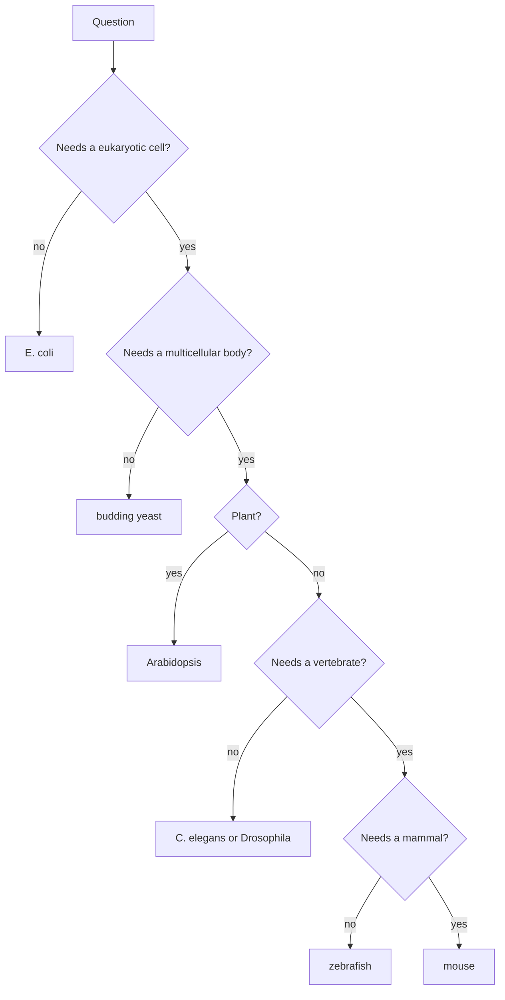

---
aliases:
  - Model Organisms
  - Model Species
  - Organisme modèle
tags:
  - type/concept
  - domain/biology
  - domain/bioinformatics
  - level/L1
  - level/L2
  - level/L3
mastery: 0
prerequisites:
  - "[[Gene]]"
  - "[[Genome]]"
  - "[[Prokaryote]]"
  - "[[Eukaryote]]"
related:
  - "[[Biological Database]]"
  - "[[Ortholog]]"
  - "[[Gene Annotation]]"
  - "[[Genetic Screen]]"
  - "[[Common Descent]]"
  - "[[Mendelian Inheritance]]"
  - "[[Sex-Linked Inheritance]]"
projects: []
sources:
  - "[[Molecular Biology of the Cell (Alberts)]]"
  - "[[The Cell (Cooper)]]"
  - "[[Biology 2e (OpenStax)]]"
  - "[[Blattner 1997 - The Complete Genome Sequence of Escherichia coli K-12]]"
  - "[[Goffeau 1996 - Life with 6000 Genes]]"
  - "[[Meselson 1958 - The Replication of DNA in Escherichia coli]]"
  - "[[Nirenberg 1961 - Cell-Free Protein Synthesis and Synthetic Polyribonucleotides]]"
  - "[[Beadle 1941 - Genetic Control of Biochemical Reactions in Neurospora]]"
  - "[[Mendel 1866 - Experiments in Plant Hybridization]]"
  - "[[Alliance of Genome Resources 2019 - Building a Modern Data Ecosystem for Model Organism Databases]]"
  - "[[Oliver 2016 - Model Organism Databases]]"
  - "[[Gene Ontology]]"
  - "[[NCBI GenBank]]"
---

# Model Organism

> [!abstract]
> A model organism is a species studied so intensively, because it is easy to grow and to manipulate genetically, that what we learn from it serves as a guide to many other species, and whose knowledge is gathered in its own curated database.

## Definition

A **model organism** is a species chosen for detailed study because it is convenient to grow and to analyse genetically, and because living things share so many basic mechanisms that results obtained in it can be transferred to other organisms, including humans.[^alberts][^cooper] Each major model organism has a research community, collections of strains and mutants, and a **model organism database** (MOD) where specialists curate its genome, genes, mutants and functions.[^alliance]

## Why it matters

- **Most functional annotation comes from a few species.** Gene Ontology knowledge is biased toward the small number of model organisms in which most experiments were done.[^go] A human gene of unknown function is usually interpreted through its [[Ortholog|orthologs]] in yeast, fly, worm or mouse ([[Gene Annotation]]).
- **Each organism has its own database, identifiers and conventions.** Mapping gene identifiers and names between databases is routine work ([[Biological Database]], [[Accession Number]]). The Alliance of Genome Resources was created to give several model organism databases shared programmatic access and comparable pages.[^alliance]
- **Reference genomes.** Model organisms were among the milestones of early genomics: *E. coli* K-12 (4,639,221 bp, 4,288 protein-coding genes) and budding yeast, the first complete eukaryotic genome (12,068 kb on 16 chromosomes, 5,885 potential protein-coding genes).[^blattner][^goffeau] Their compact, well-annotated genomes make convenient first data sets.

## Core (L1)

| Organism | What it is | Why it is studied | Database |
|---|---|---|---|
| *Escherichia coli* | bacterium | fast, simple growth; replication, the genetic code and gene regulation were worked out in it[^meselson][^nirenberg][^os16] | genome records in [[NCBI GenBank]][^blattner] |
| *Saccharomyces cerevisiae* | budding yeast, a single-celled eukaryote | eukaryotic cell biology (cell cycle, secretion) with microbial ease; first eukaryotic genome[^alberts][^goffeau] | SGD[^alliance] |
| *Caenorhabditis elegans* | small nematode worm | transparent body, development followed cell by cell[^alberts][^cooper] | WormBase[^alliance] |
| *Drosophila melanogaster* | fruit fly | the classic animal of genetics since Morgan's white-eyed flies; genes controlling development[^os12][^alberts] | FlyBase[^alliance] |
| *Danio rerio* | zebrafish | vertebrate with transparent embryos that develop outside the mother[^alberts][^cooper] | ZFIN[^alliance] |
| *Mus musculus* | mouse | mammal whose genes can be inactivated or modified to model human disease[^alberts][^cooper] | MGD[^alliance] |
| *Arabidopsis thaliana* | small flowering plant | short life cycle, small genome: the reference plant[^alberts][^cooper] | TAIR[^oliver] |

Their common job is to collect the knowledge about each organism's genes, scattered across papers and experiments, and to offer it in human-readable and computation-ready formats.[^alliance]



The tree is a first approximation: the real choice also weighs existing mutants, tools and expertise (L2).

## Deeper (L2)

### What makes a good model

The recurring criteria are practical: short generation time, small size and cheap culture, many offspring, a sequenced genome, and tools to make and study mutants (forward genetic screens, targeted gene inactivation) ([[Genetic Screen]]).[^alberts][^cooper] The community matters as much as the biology: strain collections, standard protocols and a database make every new experiment cheaper than in a species studied from scratch.

### Why results transfer

All living things share ancestry, and core machinery (replication, transcription, translation, the cell cycle) is conserved across eukaryotes and often across all life; many human genes have recognizable counterparts in yeast, worms and flies.[^alberts] A mechanism found in a model is therefore a strong hypothesis for its orthologs elsewhere ([[Common Descent]], [[Ortholog]]).

### Models change with questions

Mendel's garden pea founded transmission genetics;[^mendel] the bread mould *Neurospora* gave the one-gene-one-enzyme result;[^beadle] *E. coli* extracts decoded the first codon.[^nirenberg] Each model rose because it made a question tractable, which is why the list above is a toolbox, not a hierarchy.

### The databases join forces

In 2016, six model organism databases (SGD, WormBase, FlyBase, ZFIN, MGD and RGD, the rat database) and the Gene Ontology Consortium formed the Alliance of Genome Resources, to harmonize data and give shared access across organisms.[^alliance]

## Advanced (L3)

- **Annotation transfer is inference.** Copying a function from a fly ortholog to a human gene assumes the function was conserved. The more a term describes a molecular activity rather than an organism-level process, the more plausible the transfer: a fly gene annotated to "wing development" says little about a human protein (Exercise 3).
- **Knowledge is skewed.** Because annotations come mostly from a few organisms, genes without well-studied orthologs look "unannotated", which is absence of evidence, not evidence of absence. Enrichment analyses of human gene lists inherit this bias ([[Gene Set Enrichment Analysis]]).[^go]
- **Databases are infrastructure that must be paid for.** Their sustainability depends on funders' policies, and cutting curation has been argued to be economically unsound as well as scientifically damaging.[^oliver] Citing the databases you use is part of keeping them alive.
- **Beyond the classic list.** Cheap sequencing lets any species become a genomic model for its question, but without decades of mutants, curation and a community, a new genome remains mostly sequence plus predicted genes ([[Gene Finding]], [[Gene Annotation]]).

## Mathematical representation

There is no formula for "model organism"; the useful formalization is annotation transfer. Let $H$ be the set of human genes, $S$ a set of model species, $o_s(h)$ the ortholog of $h \in H$ in species $s$ (if any), and $A_s(g)$ the set of experimentally supported terms of gene $g$ in the database of $s$. The candidate annotation of $h$ with its support is

$$\hat A(h) = \bigcup_{s \in S} A_s(o_s(h)), \qquad \mathrm{support}(t, h) = \big|\{ s \in S : t \in A_s(o_s(h)) \}\big|,$$

and the **coverage** of a gene set is the fraction of $h$ with $\hat A(h) \ne \varnothing$. Requiring $\mathrm{support} \ge k$ trades coverage for reliability.

## Computational representation

Orthology tables and annotation files are joined on gene identifiers; the join is a dictionary lookup per species.

```python
from collections import Counter

# Invented toy data: gene identifiers and annotations are made up for illustration.
orthologs = {                       # human gene -> its orthologs in three model organisms
    "HUMAN_G1": {"yeast": "Y_G1", "fly": "F_G1", "mouse": "M_G1"},
    "HUMAN_G2": {"fly": "F_G2", "mouse": "M_G2"},
    "HUMAN_G3": {"mouse": "M_G3"},
    "HUMAN_G4": {},                 # no ortholog found
}
annotations = {                     # experimentally supported terms in each organism's database
    "Y_G1": {"DNA repair"},
    "F_G1": {"DNA repair", "cell cycle"},
    "M_G1": {"DNA repair"},
    "F_G2": {"wing development"},
    "M_G2": set(),
    "M_G3": set(),
}


def transferred_terms(human_gene: str) -> Counter:
    """Candidate functions for a human gene: each term counted once per supporting species."""
    support = Counter()
    for species, ortholog in orthologs[human_gene].items():
        support.update(annotations.get(ortholog, set()))
    return support


for gene in orthologs:
    print(gene, dict(transferred_terms(gene)))
annotated = sum(bool(transferred_terms(g)) for g in orthologs)
print(f"{annotated}/{len(orthologs)} human genes receive at least one candidate function")
```

```text
HUMAN_G1 {'DNA repair': 3, 'cell cycle': 1}
HUMAN_G2 {'wing development': 1}
HUMAN_G3 {}
HUMAN_G4 {}
2/4 human genes receive at least one candidate function
```

Real pipelines add identifier versions, one-to-many orthology and evidence codes ([[Orthology Inference]]).

## Worked example

> [!example] Choosing organisms for one research programme
> A human gene, mutated in a kidney disease, encodes a protein of unknown function.
> 1. **Is there an ortholog in yeast?** If yes, yeast mutants can be screened quickly for what the protein does inside a cell (secretion, cell cycle...).
> 2. **Does the function need tissues?** Zebrafish embryos are transparent and develop outside the mother, so organ formation can be watched live.[^alberts]
> 3. **Does the disease need a mammal?** A mouse carrying an inactivated or patient-like allele tests the link between gene and disease.[^alberts]
> 4. **Before starting**, read the gene pages in SGD, ZFIN and MGD: existing mutants and phenotypes may already answer part of the question.[^alliance]

## Common misconceptions

> [!warning] "Model organisms are chosen because they resemble humans"
> Most are chosen because they are tractable. *E. coli* differs from humans in almost every visible way, yet it revealed how DNA is copied and how codons are read, mechanisms shared by all cells.[^meselson][^nirenberg]

> [!warning] "What is true in the mouse is true in humans"
> A result in a model is a hypothesis for other species. Conservation is gene by gene and process by process, and must be checked.

> [!warning] "All model organism data sit in one database"
> Each organism has its own curated database with its own identifiers and nomenclature; the Alliance harmonizes part of them, not all.[^alliance]

## Exercises

> [!question] Exercise 1 (L1)
> Name the model organism database of budding yeast, the nematode, the fruit fly, zebrafish and mouse. Which consortium brought them together, and in which year?

> [!success]- Solution
> SGD, WormBase, FlyBase, ZFIN and MGD. With RGD and the Gene Ontology Consortium, they formed the Alliance of Genome Resources in 2016.[^alliance]

> [!question] Exercise 2 (L2)
> Which organism would you choose for: (a) screening thousands of mutants for defects in eukaryotic cell division; (b) filming blood vessel formation in a living vertebrate embryo; (c) testing whether losing a gene causes a disease in a mammal; (d) finding genes controlling flowering time? Justify each choice.

> [!success]- Solution
> (a) Budding yeast: a single-celled eukaryote with fast growth and easy genetics. (b) Zebrafish: transparent embryos that develop outside the mother. (c) Mouse: a mammal in which genes can be inactivated. (d) *Arabidopsis*: the reference plant, with a short life cycle. In each case, also check the organism's database for existing mutants.

> [!question] Exercise 3 (L2, Python)
> Using `orthologs`, `annotations` and `transferred_terms` from the code above, write `supported_terms(gene, min_species=2)` keeping only the terms supported by at least two species. What happens to HUMAN_G1 and HUMAN_G2, and why is that desirable here?

> [!success]- Solution
> ```python
> def supported_terms(human_gene: str, min_species: int = 2) -> set[str]:
>     """Keep only the terms supported by orthologs in at least min_species organisms."""
>     return {term for term, n in transferred_terms(human_gene).items() if n >= min_species}
>
>
> print({gene: supported_terms(gene) for gene in orthologs})
> # {'HUMAN_G1': {'DNA repair'}, 'HUMAN_G2': set(), 'HUMAN_G3': set(), 'HUMAN_G4': set()}
> ```
>
> HUMAN_G1 keeps "DNA repair" (three species agree) and loses "cell cycle" (fly only). HUMAN_G2 loses "wing development", a fly-specific process that should not be transferred to a human gene. The price is coverage: only 1 of 4 genes keeps an annotation.

> [!question] Exercise 4 (L3)
> An enrichment analysis of 200 human genes, up-regulated in a tumour, finds no enriched term, and 60 of the genes have no functional annotation at all. Give two reasons, linked to model organisms, why this does not show that the 60 genes are unimportant, and one way to learn more about them.

> [!success]- Solution
> (1) Annotation is biased toward genes studied in a few model organisms;[^go] genes without a well-studied ortholog stay unannotated whatever their importance. (2) Genes specific to vertebrates or mammals have no yeast, worm or fly ortholog, so only mouse or zebrafish work, or human data, can annotate them. To learn more: look for orthologs in all model organism databases (a mouse or zebrafish mutant phenotype may exist), and use human data such as expression, protein domains and variant associations.

## Mastery checklist

- [ ] 1 Recognized: I can name the seven classic model organisms and one reason each is used.
- [ ] 2 Understood: I can explain the criteria that make a good model and why results transfer between species.
- [ ] 3 Practiced: I can name each organism's database and implement annotation transfer through an orthology table.
- [ ] 4 Applied: I annotated a real human gene list through its orthologs in several model organism databases and recorded the evidence for each transferred term.
- [ ] 5 Explained: I can teach the limits of transfer, the bias of functional knowledge toward model organisms and why curated databases need sustained support.

## References

[^alberts]: [[Molecular Biology of the Cell (Alberts)]], 4th ed. (2002), introduction to model organisms and the conservation of genes between them.
[^cooper]: [[The Cell (Cooper)]], 2nd ed. (2000), experimental models in cell biology.
[^os12]: [[Biology 2e (OpenStax)]], ch. 12 "Mendel's Experiments and Heredity" (Morgan's white-eyed *Drosophila*).
[^os16]: [[Biology 2e (OpenStax)]], ch. 16 "Gene Expression" (the *lac* and *trp* operons of *E. coli*).
[^blattner]: [[Blattner 1997 - The Complete Genome Sequence of Escherichia coli K-12]], *Science* 277:1453-1462.
[^goffeau]: [[Goffeau 1996 - Life with 6000 Genes]], *Science* 274(5287).
[^meselson]: [[Meselson 1958 - The Replication of DNA in Escherichia coli]].
[^nirenberg]: [[Nirenberg 1961 - Cell-Free Protein Synthesis and Synthetic Polyribonucleotides]], *PNAS* 47(10):1588-1602.
[^beadle]: [[Beadle 1941 - Genetic Control of Biochemical Reactions in Neurospora]], *PNAS* 27(11):499-506.
[^mendel]: [[Mendel 1866 - Experiments in Plant Hybridization]].
[^alliance]: [[Alliance of Genome Resources 2019 - Building a Modern Data Ecosystem for Model Organism Databases]], *Genetics* 213(4):1189-1196.
[^oliver]: [[Oliver 2016 - Model Organism Databases]], *BMC Biology*.
[^go]: [[Gene Ontology]], caveat on the bias of annotations toward model organisms.
