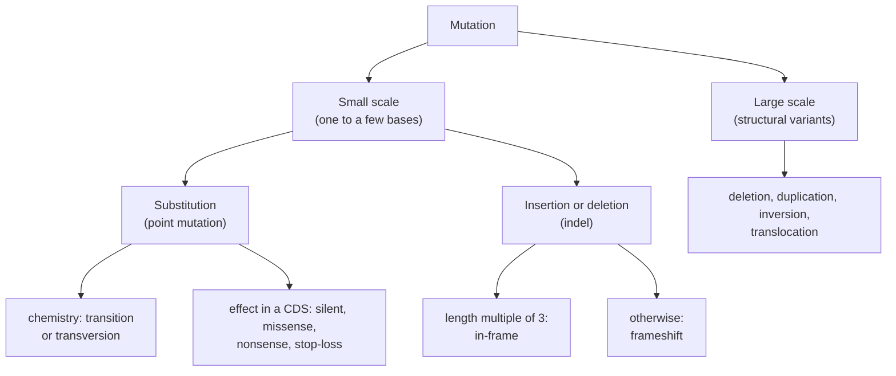

---
aliases:
  - Gene Mutation
  - Mutation génétique
tags:
  - type/concept
  - domain/biology
  - domain/bioinformatics
  - level/L1
  - level/L2
  - level/L3
mastery: 0
prerequisites:
  - "[[DNA]]"
  - "[[DNA Replication]]"
  - "[[Genetic Code]]"
  - "[[Gene]]"
related:
  - "[[Point Mutation]]"
  - "[[Silent Mutation]]"
  - "[[Missense Mutation]]"
  - "[[Nonsense Mutation]]"
  - "[[Frameshift Mutation]]"
  - "[[Indel]]"
  - "[[Structural Variant]]"
  - "[[Single Nucleotide Polymorphism]]"
  - "[[Genetic Variant]]"
  - "[[DNA Repair]]"
  - "[[Mutation Rate]]"
  - "[[Somatic Mutation]]"
  - "[[Variant Calling]]"
  - "[[Variant Annotation]]"
projects:
  - "[[03-genome-diff]]"
  - "[[06-mutation-lab]]"
  - "[[bio-core]]"
sources:
  - "[[An Introduction to Genetic Analysis (Griffiths)]]"
  - "[[Biology 2e (OpenStax)]]"
  - "[[Molecular Biology of the Cell (Alberts)]]"
  - "[[Kong 2012 - Rate of De Novo Mutations and the Importance of Father's Age to Disease Risk]]"
  - "[[Richards 2015 - Standards and Guidelines for the Interpretation of Sequence Variants]]"
  - "[[Kimura 1968 - Evolutionary Rate at the Molecular Level]]"
  - "[[Ensembl]]"
---

# Mutation

> [!abstract]
> A mutation is a permanent change in the DNA sequence, from a single swapped letter to the rearrangement of a whole chromosome segment.

## Definition

A **mutation** is a heritable change in the nucleotide sequence of a genome: it is copied at every later replication, into all the descendants of the cell in which it arose.[^griffiths][^os14] It is classified by **size** (point mutation, insertion or deletion, structural rearrangement), by **cause** (spontaneous or induced), by the **cells** it affects (germline or somatic) and by its **effect** on the gene product.[^griffiths]

## Why it matters

- **Variant calling.** Resequencing a genome and comparing it with a reference lists the differences ([[Variant Calling]]), stored in [[VCF Format]]. Each record is the trace of a past mutation.
- **Consequence prediction.** Tools such as Ensembl's Variant Effect Predictor report, for each variant, the affected transcript and its molecular consequence (synonymous, missense, stop gained, frameshift...).[^ensembl] [[03-genome-diff]] and [[06-mutation-lab]] rebuild that logic from the [[Genetic Code]].
- **Cancer genomics.** Tumours are compared with normal tissue of the same patient to find somatic mutations ([[Somatic Mutation]]).
- **Evolution.** Mutation creates all genetic variation; models of sequence evolution give transitions and transversions different rates ([[Molecular Evolution]], [[Phylogenetics]]).

## Core (L1)

**Types by size.**[^griffiths][^os14]



**Effects in a coding sequence.** Because the [[Genetic Code]] is read in triplets, the same kind of change can have very different consequences.[^os14][^griffiths]

| Class | What changes | Example (toy CDS below) |
|---|---|---|
| [[Silent Mutation]] (synonymous) | codon changes, amino acid does not | GAG → GAA, Glu → Glu |
| [[Missense Mutation]] | one amino acid replaced by another | GAG → GTG, Glu → Val |
| [[Nonsense Mutation]] | a sense codon becomes a stop codon | TGG → TAG, Trp → stop |
| [[Frameshift Mutation]] | an [[Indel]] of length not divisible by 3 shifts the reading frame | 1-nt deletion: new codons, early stop |

![[mutation-types-codons.svg]]

**Germline and somatic.** A mutation in a germ cell (egg, sperm or their precursors) can be transmitted to the next generation. A mutation in any other cell (somatic) is passed only to that cell's descendants in the same body; it is not inherited by offspring, but it can contribute to cancer.[^os14]

**Spontaneous and induced.** Mutations arise spontaneously, from replication errors and chemical decay of DNA, or are induced by mutagens such as ultraviolet light and certain chemicals.[^os14][^griffiths]

## Deeper (L2)

### Transitions and transversions

A **transition** replaces a purine by the other purine (A ↔ G) or a pyrimidine by the other pyrimidine (C ↔ T). A **transversion** exchanges a purine and a pyrimidine.[^griffiths] There are 2 transition pairs and 4 transversion pairs, so if all substitutions were equally likely, transversions would be twice as frequent.

![[transitions-transversions.svg]]

### Where mutations come from

- **Replication errors.** DNA polymerase occasionally inserts a wrong base; most errors are corrected by proofreading and mismatch repair ([[DNA Replication]], [[DNA Repair]]); those that escape become mutations after the next round of replication.[^alberts] In repeated sequences, the new strand can slip and loop out, producing small insertions or deletions.[^griffiths]
- **Spontaneous chemical damage.** In each human cell, about 5,000 purines are lost per day by depurination and about 100 cytosines per day are deaminated to uracil. Deamination of 5-methylcytosine gives thymine, a normal base that repair cannot recognize as foreign, which makes methylated CpG sites mutation hotspots (C → T transitions).[^alberts]
- **Mutagens.** Ultraviolet light joins adjacent pyrimidines (thymine dimers); alkylating agents and base analogs cause mispairing; intercalating agents such as acridines cause insertions and deletions; ionizing radiation breaks both strands.[^griffiths][^alberts][^os14]

### Structural variants

Large rearrangements of chromosome segments: **deletions**, **duplications** (which change copy number), **inversions** and **translocations** between chromosomes.[^griffiths] They can remove or duplicate whole genes, or join pieces of two genes ([[Structural Variant]]).

### Rates

In humans, whole-genome sequencing of parent-offspring trios estimated a germline rate of about $1.2 \times 10^{-8}$ per nucleotide per generation, with the number of new mutations in a child increasing with the father's age (about two more per year).[^kong] Rates per site are tiny, but genomes are large and populations numerous, so at the scale of a population new mutations in any given gene are routine (see Exercise 6).

## Advanced (L3)

### Mutation, variant, polymorphism

"Mutation" names both the **process** and a **new change** relative to a parent. What sequencing observes is a **difference from a reference genome**, a [[Genetic Variant]]; a variant that is common in a population is called a polymorphism, and the single-base kind is a [[Single Nucleotide Polymorphism]]. Clinical guidelines recommend replacing both "mutation" and "polymorphism" by "variant", qualified by its clinical significance: pathogenic, likely pathogenic, uncertain significance, likely benign or benign.[^richards]

### Molecular consequence is not clinical significance

The classes in this note (silent, missense, nonsense, frameshift) describe what happens to the protein **sequence**. They do not say whether the change harms the organism:

- a **missense** change can be neutral (a similar amino acid, a tolerant position) or devastating;
- a **silent** change can still act, for example by disrupting splicing: clinical guidelines accept a synonymous variant as benign evidence only when splicing predictions show no impact;[^richards]
- a **nonsense** change can lead to degradation of the mRNA or to a truncated protein, depending on where the premature stop lies in the transcript ([[Nonsense-Mediated Decay]]);[^alberts-nmd]
- most of the genome is not coding sequence, and the neutral theory holds that most molecular changes that spread in populations have little effect on fitness.[^kimura]

Interpreting a variant clinically combines population frequency, segregation in families, functional data and computational evidence under explicit criteria.[^richards] This is why [[06-mutation-lab]] reports the **molecular consequence only** and states that it is not a clinical prediction.

### Mutation spectra

Real mutations are not uniform: C → T transitions at CpG sites are enriched because of methylcytosine deamination,[^alberts] and each mutagen leaves a characteristic spectrum (UV, for instance, acts on adjacent pyrimidines).[^griffiths] Comparing an observed spectrum with the uniform expectation below is a first step toward inferring which processes generated a set of mutations, for example in a tumour.

## Mathematical representation

Let $\Sigma = \{A, C, G, T\}$, $R = \{A, G\}$ (purines), $Y = \{C, T\}$ (pyrimidines). A **substitution** at position $i$ of a sequence $s$ is a pair $(b, b')$ with $b = s_i$, $b' \ne b$. It is a **transition** if $\{b, b'\} \subseteq R$ or $\{b, b'\} \subseteq Y$, and a **transversion** otherwise. Of the 12 ordered substitutions, 4 are transitions and 8 transversions, so under a uniform model $P(\text{Ts}) = 1/3$ and the ratio Ts/Tv $= 1/2$.

**Effect under a uniform point-mutation model** (the model of [[06-mutation-lab]]). Take the 61 sense codons, each of the 3 positions, each of the 3 alternative bases: $61 \times 9 = 549$ equally likely substitutions. Applying the standard code $g$ gives:

| Effect | Count | Probability |
|---|---:|---:|
| silent, $g(c') = g(c)$ | 134 | 0.244 |
| missense, $g(c') \notin \{g(c), *\}$ | 392 | 0.714 |
| nonsense, $g(c') = *$ | 23 | 0.042 |

Transitions are silent more often than transversions (62/183 = 0.339 against 72/366 = 0.197).

**Counting new mutations.** With a per-site rate $\mu$ and $L$ sites, the number of new mutations in one transmitted genome copy is approximately $\text{Poisson}(\lambda)$ with $\lambda = \mu L$, so $P(k) = e^{-\lambda} \lambda^k / k!$ and $P(\ge 1) = 1 - e^{-\lambda}$.

**Indels.** An insertion or deletion of length $\ell$ keeps the frame if and only if $\ell \equiv 0 \pmod 3$.

## Computational representation

- A small variant is stored as `CHROM POS REF ALT` in [[VCF Format]] (1-based). For indels, VCF includes an unchanged anchor base before the event; the code below uses a simplified form without it.
- Classifying a coding variant = apply it to the CDS, translate reference and mutant, compare. Frameshifts are detected by length before translating.

```python
BASES = "TCAG"
CODE = dict(zip((a + b + c for a in BASES for b in BASES for c in BASES),
                "FFLLSSSSYY**CC*WLLLLPPPPHHQQRRRRIIIMTTTTNNKKSSRRVVVVAAAADDEEGGGG"))
PURINES, PYRIMIDINES = set("AG"), set("CT")

def translate(cds: str) -> str:
    return "".join(CODE[cds[i:i + 3]] for i in range(0, len(cds) - 2, 3))

def substitution_type(ref: str, alt: str) -> str:
    same_class = {ref, alt} <= PURINES or {ref, alt} <= PYRIMIDINES
    return "transition" if same_class else "transversion"

def classify(cds: str, pos: int, ref: str, alt: str) -> str:
    """Molecular effect of one variant in a coding sequence.
    pos is 0-based; ref/alt as in a simplified VCF without the anchor base ("" = nothing)."""
    assert cds[pos:pos + len(ref)] == ref, "ref does not match the sequence"
    mutant = cds[:pos] + alt + cds[pos + len(ref):]
    if (len(alt) - len(ref)) % 3:
        return "frameshift"
    if len(ref) != len(alt):
        return "in-frame indel"
    before, after = translate(cds), translate(mutant)
    if before == after:
        return f"silent ({substitution_type(ref, alt)})"
    i = next(k for k, (a, b) in enumerate(zip(before, after)) if a != b)
    kind = "nonsense" if after[i] == "*" else "stop-loss" if before[i] == "*" else "missense"
    return f"{kind} {before[i]}{i + 1}{after[i]} ({substitution_type(ref, alt)})"

def ts_tv(pairs: list[tuple[str, str]]) -> dict[str, int]:
    counts = {"transition": 0, "transversion": 0}
    for ref, alt in pairs:
        counts[substitution_type(ref, alt)] += 1
    return counts

cds = "ATGGAGTGGCTGAAATAA"                     # invented toy CDS: Met-Glu-Trp-Leu-Lys-stop
variants = [(5, "G", "A"), (4, "A", "T"), (7, "G", "A"), (3, "G", ""), (9, "CTG", "")]
for v in variants:
    print(v, classify(cds, *v))
print(ts_tv([(r, a) for _, r, a in variants if len(r) == len(a) == 1]))
```

Output:

```text
(5, 'G', 'A') silent (transition)
(4, 'A', 'T') missense E2V (transversion)
(7, 'G', 'A') nonsense W3* (transition)
(3, 'G', '') frameshift
(9, 'CTG', '') in-frame indel
{'transition': 2, 'transversion': 1}
```

The protein-change notation `E2V` (reference amino acid, position, new amino acid) follows the usual convention of counting the initiator Met as position 1.

## Worked example

> [!example] Five variants in one toy coding sequence (invented)
> Reference CDS: `ATG GAG TGG CTG AAA TAA` → Met-Glu-Trp-Leu-Lys-stop. Positions are 0-based.
>
> 1. **pos 5, G → A.** Codon 2 GAG → GAA. Both code for Glu: **silent**. G and A are purines: **transition**.
> 2. **pos 4, A → T.** Codon 2 GAG → GTG = Val: **missense E2V**. Purine to pyrimidine: **transversion**. (The sickle-cell allele of human β-globin is a Glu → Val missense change of this kind.[^griffiths])
> 3. **pos 7, G → A.** Codon 3 TGG → TAG = stop: **nonsense W3***, protein truncated to Met-Glu. Transition.
> 4. **pos 3, delete G.** Length 1 is not a multiple of 3: **frameshift**. New codons from codon 2 on: `ATG AGT GGC TGA` → Met-Ser-Gly-stop, an unrelated tail and an early stop.
> 5. **pos 9, delete CTG.** Length 3: **in-frame deletion** of codon 4. Protein Met-Glu-Trp-Lys: one amino acid missing, the rest unchanged.
>
> None of these labels says whether the variant causes disease.

## Common misconceptions

> [!warning] "Mutations are harmful"
> Many mutations have no detectable effect (in non-coding DNA, or synonymous), a few are harmful, and some are beneficial; without mutation there would be no evolution. The neutral theory holds that most changes fixed at the molecular level are selectively neutral.[^kimura]

> [!warning] "A silent mutation has no effect"
> "Silent" means the amino acid sequence is unchanged. The DNA and RNA did change, and this can affect splicing or other RNA-level signals.[^richards]

> [!warning] "Mutation and SNP are the same thing"
> A mutation is an event (or a new change); a SNP is a single-base variant that is common in a population, the long-term result of an old mutation that spread. A new, private single-base change in one patient is a single-nucleotide variant, not a polymorphism.

> [!warning] "Every insertion or deletion causes a frameshift"
> Only indels whose length is not a multiple of 3, and only inside a coding sequence. A 3-nt deletion removes one amino acid (or changes two codons into one) and keeps the frame.

## Exercises

> [!question] Exercise 1 (L1)
> Classify each change by effect and by chemistry: (a) GAA → GAG, (b) UAC → UAA, (c) CUU → CCU.

> [!success]- Solution
> (a) Glu → Glu: silent; A → G: transition. (b) Tyr → stop: nonsense; C → A: transversion. (c) Leu → Pro: missense; U → C: transition (both pyrimidines). Checked with the codon table and `substitution_type`.

> [!question] Exercise 2 (L1)
> A person has a UV-induced mutation in a skin cell, and another mutation in a sperm precursor cell. Which one can be passed to their children? Which one can contribute to a skin cancer?

> [!success]- Solution
> Only the germline mutation (sperm precursor) can be transmitted to offspring. The somatic skin mutation is copied into the descendants of that skin cell only; it cannot be inherited, but it can contribute to cancer in that tissue.[^os14]

> [!question] Exercise 3 (L2, Python)
> Using `ts_tv` from the code above, for the substitutions C>T, G>A, A>G, T>C, G>T, C>A, A>C, C>T, G>A, T>G, count transitions and transversions and compute the Ts/Tv ratio. Compare with the uniform expectation and propose a biological explanation for the difference.

> [!success]- Solution
> ```python
> pairs = [("C", "T"), ("G", "A"), ("A", "G"), ("T", "C"), ("G", "T"),
>          ("C", "A"), ("A", "C"), ("C", "T"), ("G", "A"), ("T", "G")]
> counts = ts_tv(pairs)
> print(counts, counts["transition"] / counts["transversion"])
> # {'transition': 6, 'transversion': 4} 1.5
> ```
>
> Ts/Tv = 1.5, three times the uniform expectation of 0.5. Transitions are chemically easier to produce, and deamination of (methyl)cytosine specifically creates C → T (and G → A on the other strand) transitions,[^alberts] so real data are enriched in transitions.

> [!question] Exercise 4 (L2, Python)
> Toy CDS `ATGAAACCCGGGTTTTAA` (Met-Lys-Pro-Gly-Phe-stop). Using `classify` from the code above, classify: pos 5 A>G; pos 4 A>T; pos 3 A>T; pos 15 T>C; insertion of C at pos 6; deletion of CCC at pos 6.

> [!success]- Solution
> ```python
> cds = "ATGAAACCCGGGTTTTAA"
> for v in [(5, "A", "G"), (4, "A", "T"), (3, "A", "T"), (15, "T", "C"), (6, "", "C"), (6, "CCC", "")]:
>     print(v, classify(cds, *v))
> # (5, 'A', 'G') silent (transition)
> # (4, 'A', 'T') missense K2I (transversion)
> # (3, 'A', 'T') nonsense K2* (transversion)
> # (15, 'T', 'C') stop-loss *6Q (transition)
> # (6, '', 'C') frameshift
> # (6, 'CCC', '') in-frame indel
> ```
>
> The stop-loss case (TAA → CAA) is a class the table above did not list: the ribosome reads on into the 3' UTR until it meets another stop, extending the protein.

> [!question] Exercise 5 (L3, Python)
> Reusing `CODE`, `BASES` and `PURINES` from the code above, reproduce the uniform-model table of the Mathematical representation: count silent, missense and nonsense outcomes among the 549 single-base substitutions of sense codons, separately for transitions and transversions.

> [!success]- Solution
> ```python
> from collections import Counter
>
> def spectrum(code: dict[str, str]) -> Counter:
>     """Count (substitution type, effect) over all single-base changes of all sense codons."""
>     counts = Counter()
>     for codon, aa in code.items():
>         if aa == "*":
>             continue
>         for pos in range(3):
>             for b in BASES:
>                 if b == codon[pos]:
>                     continue
>                 new = code[codon[:pos] + b + codon[pos + 1:]]
>                 effect = "silent" if new == aa else "nonsense" if new == "*" else "missense"
>                 kind = "Ts" if (codon[pos] in PURINES) == (b in PURINES) else "Tv"
>                 counts[kind, effect] += 1
>     return counts
>
> s = spectrum(CODE)
> total = sum(s.values())
> for effect in ("silent", "missense", "nonsense"):
>     n = s["Ts", effect] + s["Tv", effect]
>     print(f"{effect:9}{n:4}  {n / total:.3f}")
> for kind in ("Ts", "Tv"):
>     n = s[kind, "silent"] + s[kind, "missense"] + s[kind, "nonsense"]
>     print(kind, n, f"silent {s[kind, 'silent'] / n:.3f}")
> # silent    134  0.244
> # missense  392  0.714
> # nonsense   23  0.042
> # Ts 183 silent 0.339
> # Tv 366 silent 0.197
> ```
>
> Under uniform mutation, about a quarter of coding substitutions are silent. Because real mutation is transition-biased and transitions are more often silent, the real silent fraction is higher than this uniform estimate: the code and the mutation process interact.

> [!question] Exercise 6 (L3)
> Using $\mu = 1.2 \times 10^{-8}$ per nucleotide per generation,[^kong] compute (a) the expected number of new mutations in a 3,000-nt coding region of one transmitted genome copy and the probability of at least one; (b) the expected number of new mutations in that region across 10⁶ births (two transmitted copies each). (c) [[06-mutation-lab]] classifies one of them as missense: can it say whether it is pathogenic?

> [!success]- Solution
> (a) $\lambda = 1.2 \times 10^{-8} \times 3000 = 3.6 \times 10^{-5}$; $P(\ge 1) = 1 - e^{-\lambda} \approx 3.6 \times 10^{-5}$. (b) $2 \times 10^6 \times 3.6 \times 10^{-5} = 72$ new mutations in that region per million births: rare per person, routine per population. (c) No. Missense is a molecular consequence; pathogenicity requires population, family, functional and computational evidence combined under clinical criteria.[^richards]

## Mastery checklist

- [ ] 1 Recognized: I can define mutation and name point mutations, indels and structural variants, and germline versus somatic.
- [ ] 2 Understood: I can explain silent, missense, nonsense and frameshift effects, transitions versus transversions, and the main causes of mutation.
- [ ] 3 Practiced: I can classify a variant by translating reference and mutant sequences, and count transitions and transversions in Python.
- [ ] 4 Applied: in [[03-genome-diff]] and [[06-mutation-lab]], I report each variant of a real gene with its codon and protein consequence.
- [ ] 5 Explained: I can explain why molecular consequence is not clinical significance, and how mutation rate, spectrum and the genetic code shape observed variation.

## References

[^griffiths]: [[An Introduction to Genetic Analysis (Griffiths)]], 7th ed. (2000), treatment of gene mutation (types, spontaneous and induced mutation, mutagens) and of chromosome rearrangements.
[^os14]: [[Biology 2e (OpenStax)]], ch. 14 "DNA Structure and Function" (DNA repair and mutations).
[^alberts]: [[Molecular Biology of the Cell (Alberts)]], 4th ed. (2002), treatment of DNA repair: spontaneous depurination and deamination, 5-methylcytosine, radiation damage.
[^kong]: [[Kong 2012 - Rate of De Novo Mutations and the Importance of Father's Age to Disease Risk]], Kong A et al., *Nature* 488:471-475.
[^richards]: [[Richards 2015 - Standards and Guidelines for the Interpretation of Sequence Variants]], Richards S et al., ACMG/AMP joint consensus recommendation, *Genetics in Medicine* 17(5):405-424.
[^alberts-nmd]: [[Molecular Biology of the Cell (Alberts)]], 4th ed. (2002), on nonsense-mediated mRNA decay.
[^kimura]: [[Kimura 1968 - Evolutionary Rate at the Molecular Level]].
[^ensembl]: [[Ensembl]], Variant Effect Predictor.
