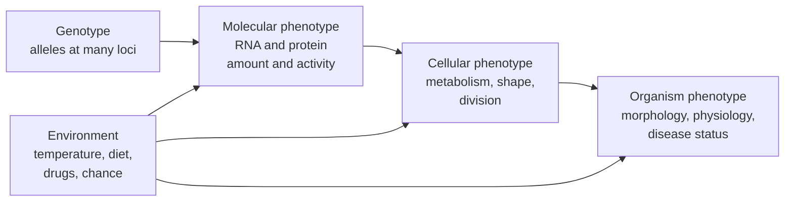

---
aliases:
  - Phenotypes
  - Phénotype
  - Trait
  - Norm of Reaction
  - Reaction Norm
  - Genotype-by-Environment Interaction
tags:
  - type/concept
  - domain/biology
  - domain/bioinformatics
  - domain/statistics
  - level/L1
  - level/L2
  - level/L3
mastery: 0
prerequisites:
  - "[[Genotype]]"
  - "[[Allele]]"
  - "[[Gene Expression]]"
related:
  - "[[Dominance]]"
  - "[[Mendelian Inheritance]]"
  - "[[Quantitative Trait]]"
  - "[[Heritability]]"
  - "[[Genetic Disease]]"
  - "[[Epistasis]]"
  - "[[Genome-Wide Association Study]]"
  - "[[Expression Quantitative Trait Locus]]"
  - "[[Pharmacogenomics]]"
projects: []
sources:
  - "[[Biology 2e (OpenStax)]]"
  - "[[An Introduction to Genetic Analysis (Griffiths)]]"
  - "[[Principles of Population Genetics (Hartl)]]"
  - "[[Relling 2011 - Clinical Pharmacogenetics Implementation Consortium]]"
  - "[[Popejoy 2016 - Genomics Is Failing on Diversity]]"
---

# Phenotype

> [!abstract]
> A phenotype is what can be observed or measured about an organism, from pod colour to an enzyme's activity; it results from the genotype, the environment, and the way the two interact.

## Definition

The **phenotype** is the set of observable traits expressed by an organism; the **genotype** is the underlying genetic makeup, including alleles that are not visible in the phenotype.[^os12] A phenotype is not fixed by the genotype alone: it develops from the interaction of the genotype with the environment, and the pattern of phenotypes that one genotype produces across a range of environments is its **norm of reaction**.[^griffiths]

## Why it matters

- **Phenotypes are the response variable of genetic studies.** A [[Genome-Wide Association Study]] or a [[Quantitative Trait Locus]] scan tests genotypes against a measured phenotype; a poorly defined or badly measured phenotype weakens every downstream result.
- **Molecular phenotypes are data.** Expression levels, protein abundances or methylation levels measured by omics technologies are phenotypes too, and can be mapped to genotypes ([[Expression Quantitative Trait Locus]], [[Gene Expression]]).
- **Clinical genomics links phenotype and genotype in both directions.** A patient's phenotype guides which variants to prioritize ([[Variant Prioritization]]); in pharmacogenomics, guidelines translate a genotype into a prescribing action, a predicted drug-response phenotype ([[Pharmacogenomics]]).[^relling]
- **Models must include the environment.** Covariates such as age, sex, treatment or batch are part of the phenotype model, and genotype-by-environment interaction can make a genetic effect appear, vanish or reverse (Advanced).

## Core (L1)

**Characteristic, trait, phenotype.** A heritable feature such as pod colour is a characteristic; its variants (yellow, green) are traits.[^os12] An organism's phenotype is the collection of its traits, at every level: the appearance of a plant, the activity of an enzyme, a disease status.

**Same phenotype, different genotypes.** Mendel crossed true-breeding plants with yellow pods and plants with green pods: all hybrid offspring had yellow pods, phenotypically identical to the yellow parent although their genotype was different (heterozygous instead of homozygous).[^os12] Which allele shows in a heterozygote is the topic of [[Dominance]]; how the traits reappear in later generations is [[Mendelian Inheritance]].

**From genotype to phenotype.** Alleles act through the products of genes, at several levels:



**Same genotype, different phenotypes.** Genetically identical organisms raised in different environments can differ. Griffiths illustrates this with cuttings of yarrow plants (*Achillea*), clones of one genotype grown in different environments, and with *Drosophila* carrying the small-eye alleles Infrabar or Ultrabar, whose number of eye facets responds differently to rearing temperature: each genotype has its own norm of reaction.[^griffiths]

![[reaction-norm-schematic.svg]]

## Deeper (L2)

### Kinds of phenotypes

| Kind | Examples | Encoding in data | Vault notes |
|---|---|---|---|
| Discrete (qualitative) | pod colour, presence of a disease | categories, case or control | [[Mendelian Inheritance]], [[Genetic Disease]] |
| Continuous (quantitative) | height, blood pressure, yield | a real number with units | [[Quantitative Trait]] |
| Molecular | transcript level, enzyme activity | a measurement per gene or molecule | [[Gene Expression]], [[Expression Quantitative Trait Locus]] |

Quantitative traits are modelled as the combined effect of genotype and environment (Advanced).[^hartl]

### When genotype does not predict phenotype

- **Dominance**: heterozygotes may look like one homozygote ([[Dominance]]).[^os12]
- **Penetrance and expressivity**: carriers of a disease genotype may not all show the phenotype (incomplete penetrance), or may show it to different degrees (variable expressivity) ([[Genetic Disease]]).[^griffiths]
- **Interactions between genes**: the effect of one locus can depend on the genotype at another ([[Epistasis]]).
- **Environment and chance**: the norm of reaction (Core) and developmental noise.

### Norms of reaction and genotype-by-environment interaction

A norm of reaction plots the phenotype of one genotype against an environmental variable. If the norms of different genotypes are **parallel**, genotype and environment act additively: each genotype shifts the phenotype by a constant amount in every environment. If they are **not parallel**, there is a **genotype-by-environment interaction** (G×E): the difference between genotypes depends on the environment, and when norms cross, the ranking of genotypes reverses.[^griffiths] In the figure, genotype 3 is best in the low environment and worst in the high one.

## Advanced (L3)

- **Partitioning phenotypic variance.** For a quantitative trait, the phenotypic value is modelled as a genetic value plus an environmental deviation, so that, when genotype and environment are independent and do not interact, the phenotypic variance splits as $V_P = V_G + V_E$ ([[Quantitative Trait]]).[^hartl] The ratio $V_G / V_P$ is the broad-sense [[Heritability]]. With G×E, a third term $V_{G \times E}$ appears, and the split depends on which genotypes and environments were sampled (Exercise 5).
- **"Genes or environment?" is often the wrong question.** With crossing norms of reaction, almost all phenotypic variation can come from the interaction, with no main effect of either factor (code below). Asking how much of a trait is "due to genes" is then meaningless without specifying the environments.
- **Phenotypes as data.** A phenotype used in analysis is a measurement protocol: a definition, units, a time point, covariates, and an encoding (binary, ordinal, continuous). Controlled vocabularies make phenotypes comparable across studies ([[Biological Ontology]]). Misclassifying some controls as cases, or measuring with error, dilutes the difference between genotype groups and lowers the power of association tests ([[Statistical Power]]).
- **Phenotype prediction.** Predicting a phenotype from a genotype, as polygenic scores do, inherits all the above: genetic effects, allele frequencies and linkage patterns differ between populations, so scores built in one ancestry transfer poorly to others ([[Polygenic Risk Score]]).[^popejoy]

## Mathematical representation

- A phenotype is a function of genotype and environment: $y = f(g, e) + \varepsilon$, where $g$ is the genotype, $e$ the environment and $\varepsilon$ a residual (measurement error, developmental noise).
- **Norm of reaction** of genotype $g$: the function $e \mapsto f(g, e)$. In a linear model $f(g, e) = \alpha_g + \beta_g e$, each genotype has an intercept $\alpha_g$ and a slope $\beta_g$ (its plasticity).
- **Additivity versus interaction.** In the model $y = \mu + G_g + E_e + (GE)_{ge} + \varepsilon$, parallel norms mean $(GE)_{ge} = 0$ for all $g, e$, i.e. all slopes $\beta_g$ equal. Norms of genotypes $g_1, g_2$ cross between environments $e_1, e_2$ when $f(g_1, e_1) - f(g_2, e_1)$ and $f(g_1, e_2) - f(g_2, e_2)$ have opposite signs.
- **Variance decomposition** (balanced design, $n$ replicates per cell, $a$ genotypes, $b$ environments): the total sum of squares splits exactly as $SS_T = SS_G + SS_E + SS_{GE} + SS_{\text{res}}$, with $SS_G = nb\sum_g (\bar{y}_{g\cdot} - \bar{y})^2$, $SS_E = na\sum_e (\bar{y}_{\cdot e} - \bar{y})^2$ and $SS_{GE} = n\sum_{g,e} (\bar{y}_{ge} - \bar{y}_{g\cdot} - \bar{y}_{\cdot e} + \bar{y})^2$, where bars denote means ([[Analysis of Variance]]).

## Computational representation

A phenotype dataset is a table: one row per individual (or clone) with its genotype, environment and measured value. The code simulates invented crossing norms of reaction, prints the ranking of genotypes in each environment and decomposes the phenotypic variation.

```python
import random
from statistics import mean


def simulate(norms, envs, n=5, sd=3, seed=1):
    """Invented data: phenotype = base + slope * environment + noise, n clones per cell."""
    random.seed(seed)
    return [(g, e, base + slope * e + random.gauss(0, sd))
            for g, (base, slope) in norms.items() for e in envs for _ in range(n)]


def cell_means(data):
    cells = {(g, e) for g, e, _ in data}
    return {c: mean(y for g, e, y in data if (g, e) == c) for c in cells}


def shares(data):
    """Fractions of the total sum of squares due to G, E, GxE and residual (balanced design)."""
    cell = cell_means(data)
    gs, es = sorted({g for g, _ in cell}), sorted({e for _, e in cell})
    n = len(data) // len(cell)
    grand = mean(y for *_, y in data)
    gm = {g: mean(cell[g, e] for e in es) for g in gs}
    em = {e: mean(cell[g, e] for g in gs) for e in es}
    ss = {"G": n * len(es) * sum((m - grand) ** 2 for m in gm.values()),
          "E": n * len(gs) * sum((m - grand) ** 2 for m in em.values()),
          "GxE": n * sum((cell[g, e] - gm[g] - em[e] + grand) ** 2 for g in gs for e in es)}
    total = sum((y - grand) ** 2 for *_, y in data)
    ss["residual"] = total - sum(ss.values())
    return {k: round(v / total, 3) for k, v in ss.items()}


crossing = {"G1": (30, 20), "G2": (45, 5), "G3": (72, -20)}   # invented reaction norms
data = simulate(crossing, [0, 1, 2])
cells = cell_means(data)
for e in (0, 1, 2):
    means = {g: round(cells[g, e], 1) for g in crossing}
    print("environment", e, means, "ranking:", sorted(means, key=means.get, reverse=True))
print(shares(data))
```

```text
environment 0 {'G1': 30.6, 'G2': 47.0, 'G3': 73.2} ranking: ['G3', 'G2', 'G1']
environment 1 {'G1': 48.7, 'G2': 51.3, 'G3': 51.3} ranking: ['G2', 'G3', 'G1']
environment 2 {'G1': 68.8, 'G2': 55.7, 'G3': 33.7} ranking: ['G1', 'G2', 'G3']
{'G': 0.011, 'E': 0.007, 'GxE': 0.955, 'residual': 0.027}
```

The ranking of genotypes reverses between the low and high environments (G2 and G3 tie in the middle one), and 95.5% of the variation is interaction: averaged over environments, the genotypes hardly differ, and averaged over genotypes, the environments hardly differ.

## Worked example

> [!example] Reading a norm-of-reaction table (invented data)
> Mean phenotype of three clonal genotypes in three environments, from the code above:
>
> | Genotype | low | medium | high | slope per step |
> |---|---:|---:|---:|---:|
> | G1 | 30.6 | 48.7 | 68.8 | about +19 |
> | G2 | 47.0 | 51.3 | 55.7 | about +4 |
> | G3 | 73.2 | 51.3 | 33.7 | about −20 |
>
> 1. **Plasticity.** G1 and G3 change a lot with the environment, in opposite directions; G2 is nearly insensitive.
> 2. **Interaction.** The slopes differ, so the norms are not parallel: there is G×E.
> 3. **Ranking.** G3 > G2 > G1 in the low environment, G1 > G2 > G3 in the high one. "Which genotype has the highest phenotype?" has no answer without an environment.
> 4. **Main effects.** Genotype means over all environments are 49.4, 51.3 and 52.7: nearly equal. A study averaging over environments would conclude that genotype barely matters, although it matters a lot in every single environment.

## Common misconceptions

> [!warning] "The genotype determines the phenotype"
> A genotype determines a norm of reaction, a range of possible phenotypes across environments.[^griffiths] Different genotypes can also give the same phenotype, as a heterozygote and a dominant homozygote do.[^os12]

> [!warning] "A trait is either genetic or environmental"
> Every phenotype develops from both. The question "how much is genetic?" only has a meaning for variation in a given population and set of environments, and even then G×E can make it ill-posed (Advanced).[^hartl]

> [!warning] "Phenotype means visible appearance"
> Any measurable property is a phenotype: an enzyme's activity, a transcript's abundance, a drug response or a disease status.[^os12] Molecular phenotypes are the phenotypes most often measured in bioinformatics.

> [!warning] "High heritability means the environment cannot change the trait"
> Heritability describes the share of variance due to genetic differences in the environments studied; a new environment can shift the whole distribution or reorder genotypes ([[Heritability]]).[^hartl]

## Exercises

> [!question] Exercise 1 (L1)
> Classify each item as genotype or phenotype: (a) yellow pods, (b) heterozygous at the pod-colour locus, (c) `0/1` at a site of a VCF file, (d) the activity of an enzyme in a blood sample, (e) the expression level of a gene measured by RNA sequencing, (f) response to a drug.

> [!success]- Solution
> Genotype: (b), (c). Phenotype: (a), (d), (e), (f): all are measured properties of the organism, at the organism, biochemical, molecular and clinical levels.

> [!question] Exercise 2 (L1)
> In Mendel's cross, hybrids from yellow-pod and green-pod parents all have yellow pods. When hybrids are crossed together, which genotypes and phenotypes appear, and in which proportions?

> [!success]- Solution
> Each hybrid is heterozygous and produces two kinds of gametes in equal proportions. Offspring genotypes: 1/4 homozygous yellow, 1/2 heterozygous, 1/4 homozygous green; phenotypes: 3/4 yellow (the two first genotypes look alike) and 1/4 green. Two genotypes share one phenotype, which is why the phenotypic ratio (3:1) differs from the genotypic ratio (1:2:1) ([[Mendelian Inheritance]]).

> [!question] Exercise 3 (L2)
> Using the worked-example table, which genotype would you choose for the high environment? For an environment that varies unpredictably between low and high from year to year? Justify.

> [!success]- Solution
> High environment: G1 (68.8). Unpredictable environment: G2, whose phenotype varies least (47.0 to 55.7) and never ranks last, while G1 and G3 each rank last in one extreme. Choosing a genotype means choosing a norm of reaction, not a value.

> [!question] Exercise 4 (L2, Python)
> With `simulate` and `shares` from the code above, decompose the variation of three invented genotypes with **parallel** norms, `{"G1": (30, 10), "G2": (45, 10), "G3": (60, 10)}`, over environments 0, 1, 2. Compare with the crossing case.

> [!success]- Solution
> ```python
> parallel = {"G1": (30, 10), "G2": (45, 10), "G3": (60, 10)}
> print("parallel, 3 environments:", shares(simulate(parallel, [0, 1, 2])))
> ```
> Output: `parallel, 3 environments: {'G': 0.711, 'E': 0.266, 'GxE': 0.001, 'residual': 0.021}`. With parallel norms, genotype and environment effects add up and the interaction share is essentially zero; with crossing norms it was 0.955. Only in the additive case does "the share of variation due to genotype" have a stable meaning.

> [!question] Exercise 5 (L3, Python)
> Keep the crossing norms but sample only the low environment (`[0]`). Compute the shares and the broad-sense heritability $V_G / V_P$ (use the G share). Compare with the value over three environments and explain.

> [!success]- Solution
> ```python
> crossing = {"G1": (30, 20), "G2": (45, 5), "G3": (72, -20)}
> print("crossing, low environment only:", shares(simulate(crossing, [0])))
> ```
> Output: `crossing, low environment only: {'G': 0.978, 'E': 0.0, 'GxE': 0.0, 'residual': 0.022}`. In a single environment, 97.8% of the variation is between genotypes: a "heritability" near 1. Over three environments, the genotype share was 1.1%. The same genotypes and the same biology give opposite answers, because heritability is a property of a population in a set of environments, not of the trait ([[Heritability]]).[^hartl]

## Mastery checklist

- [ ] 1 Recognized: I can define phenotype, trait and norm of reaction, and tell phenotype from genotype.
- [ ] 2 Understood: I can explain why the same genotype can give different phenotypes and different genotypes the same phenotype (dominance, penetrance, environment).
- [ ] 3 Practiced: I can simulate norms of reaction and decompose phenotypic variation into genotype, environment and interaction.
- [ ] 4 Applied: I prepared a real phenotype table (definitions, units, covariates) for an association or expression analysis and justified its encoding.
- [ ] 5 Explained: I can explain G×E, why heritability depends on the environments sampled, and the limits of predicting phenotypes from genotypes.

## References

[^os12]: [[Biology 2e (OpenStax)]], ch. 12 "Mendel's Experiments and Heredity" (phenotype and genotype, characteristics and traits, the pod-colour cross).
[^griffiths]: [[An Introduction to Genetic Analysis (Griffiths)]], 7th ed. (2000), treatment of genotype, phenotype and environment (norm of reaction, the *Achillea* and *Drosophila* eye-size examples) and of penetrance and expressivity.
[^hartl]: [[Principles of Population Genetics (Hartl)]], quantitative traits part (partition of phenotypic variance, heritability).
[^relling]: [[Relling 2011 - Clinical Pharmacogenetics Implementation Consortium]], *Clinical Pharmacology and Therapeutics* 89(3):464-467.
[^popejoy]: [[Popejoy 2016 - Genomics Is Failing on Diversity]], *Nature* 538:161-164.
