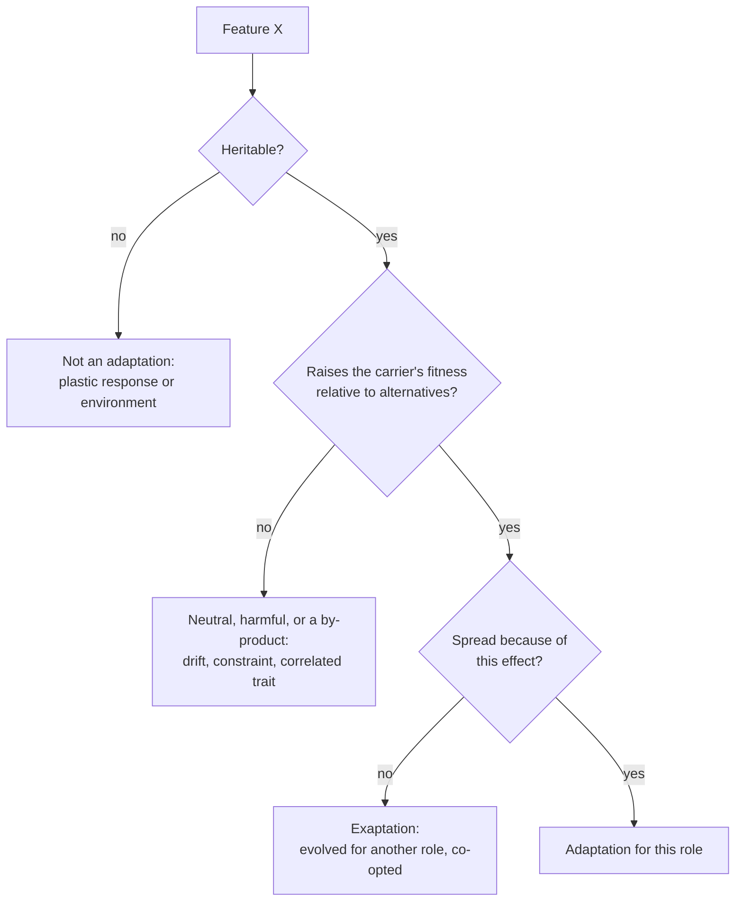

---
aliases:
  - Adaptive Evolution
  - Adaptation (évolution)
  - Good of the Species Fallacy
tags:
  - type/concept
  - domain/biology
  - level/L1
  - level/L2
  - level/L3
mastery: 0
prerequisites:
  - "[[Natural Selection]]"
  - "[[Fitness]]"
related:
  - "[[Convergent Evolution]]"
  - "[[Positive Selection]]"
  - "[[Neutral Theory of Molecular Evolution]]"
  - "[[Simpson's Paradox]]"
projects: []
sources:
  - "[[Evolution (Futuyma)]]"
  - "[[Biology 2e (OpenStax)]]"
  - "[[On the Origin of Species (Darwin)]]"
  - "[[Kimura 1968 - Evolutionary Rate at the Molecular Level]]"
---

# Adaptation

> [!abstract]
> An adaptation is a heritable feature that spread because it helped its carriers leave more offspring than the alternatives did; it is the product of natural selection on individuals, not a solution designed for the good of the species.

## Definition

An **adaptation** is a heritable feature that became prevalent in a population because it increased the [[Fitness|fitness]] of its carriers relative to alternative features, in the environment in which it evolved. **Adaptation** also names the process: evolution by [[Natural Selection|natural selection]] toward a better match between organisms and their environment.[^futuyma][^os19]

## Why it matters

- **"Functional" is a hypothesis.** Calling a gene variant, a duplicated gene or a regulatory change an adaptation is a claim that selection spread it. Genomics tests that claim with signatures of selection ([[Positive Selection]], [[Selection Scan]]), not with a plausible story.
- **Neutral by default.** Most molecular differences between species may be neutral,[^kimura] so annotating every difference as adaptive is the genomic form of the "everything is an adaptation" error ([[Neutral Theory of Molecular Evolution]]).
- **Watching it happen.** In microbial evolution experiments, adaptation can be followed by sequencing populations over thousands of generations ([[Experimental Evolution]]).

## Core (L1)

**The product of selection.** A trait becomes an adaptation by the steps of Darwin's argument: variants arise, some are heritable, and those that make their carriers reproduce more increase in frequency ([[Natural Selection#Core (L1)]]). Adaptation is relative to an environment: the dark form of the peppered moth was favoured in soot-darkened woods, the light form on clean bark.[^os19]

**Not because of need.** Organisms do not adapt because they need to or try to. Variants arise at random with respect to need, and the ones that happen to work better spread.[^futuyma]

**Not for the good of the species.** Selection compares the reproduction of individuals within a population. A heritable trait that lowers its carrier's reproduction relative to others in the same population declines, even if the species as a whole would benefit from it.[^futuyma] Imagine an invented population in which some individuals restrain their reproduction so as not to exhaust the food supply: individuals without restraint leave more offspring, and their type spreads; the restraint disappears although it helped everyone. Darwin already wrote that a feature formed for the exclusive good of another species would be incompatible with his theory.[^darwin]



## Deeper (L2)

**Not every feature is an adaptation.** Alternatives to test before concluding:[^futuyma]

- **Neutral change**, fixed by drift rather than selection;[^kimura]
- **By-products** of selection on another, correlated trait;
- **Constraints** of development and history: a lineage can only modify the structures it inherited;
- **Exaptations**: features that evolved for one role and were later co-opted for another, such as feathers, present in dinosaurs before powered flight evolved.

**Adaptations are compromises.** A feature serves several functions at once, trade-offs limit how well it serves each, and it fits the environment of the past, which may have changed. Adaptation therefore does not mean optimality.[^futuyma]

**Evidence for adaptation.** A claim gains weight from the match between structure and function, from the independent evolution of similar features in similar environments ([[Convergent Evolution]]), from measurements of selection in the field, and from experiments.[^futuyma]

## Advanced (L3)

**Levels of selection.** Selection can act at several levels at once: among genes, individuals or groups. Group-level benefits evolve only when the advantage of groups rich in a trait outweighs the disadvantage of the trait within each group. Help directed at relatives is explained by kin selection: an allele for helping spreads when the benefit to relatives, weighted by relatedness, exceeds the cost to the helper (Hamilton's rule, $r b > c$).[^futuyma]

The public-good model below makes the "for the good of the species" error precise: within one group, altruists always lose, and selection lowers the group's mean fitness. Between groups, altruism can still increase globally, a case of [[Simpson's Paradox]], but only if groups differ enough in their composition.

**Adaptation in sequences.** Adaptive changes leave signatures such as an excess of amino-acid-changing substitutions or reduced diversity around a recently selected site ([[Positive Selection]], [[Selective Sweep]]). Reciprocal adaptation between interacting species or residues is [[Coevolution]].

## Mathematical representation

**Public good in one group.** Let $x$ be the fraction of altruists. Each altruist pays a cost $c$; every member, altruist or not, receives a benefit $b\,x$ proportional to the number of altruists. Relative fitnesses:

$$w_{\text{alt}} = 1 + b x - c, \qquad w_{\text{self}} = 1 + b x, \qquad \bar w = x\,w_{\text{alt}} + (1-x)\,w_{\text{self}} = 1 + (b - c)\,x.$$

Since $w_{\text{alt}} - w_{\text{self}} = -c < 0$ for every $x$, the haploid recursion $x' = x\,w_{\text{alt}} / \bar w$ gives $x' < x$: altruists decline. If $b > c$, $\bar w$ falls as $x$ falls: **selection lowers the mean fitness of the group.**

**Several groups.** For equal-size groups with altruist fractions $x_g$, mean $\bar x$ and between-group variance $V$, summing the change within groups and the differential growth of groups gives

$$\bar w\,\Delta \bar x = (b - c)\,V - c\left[\bar x(1 - \bar x) - V\right] = b\,V - c\,\bar x(1 - \bar x).$$

Altruism increases globally iff $b\,\dfrac{V}{\bar x(1-\bar x)} > c$, which has the form of Hamilton's rule with the standardized between-group variance in the role of relatedness.

## Computational representation

```python
def public_good_step(x: float, b: float = 0.5, c: float = 0.1) -> tuple[float, float]:
    """One generation in one group: altruists (fraction x) pay c, everyone gains b * x."""
    w_alt, w_self = 1 + b * x - c, 1 + b * x
    w_bar = x * w_alt + (1 - x) * w_self            # = 1 + (b - c) * x
    return x * w_alt / w_bar, w_bar

x = 0.9
for t in range(101):
    x_next, w_bar = public_good_step(x)
    if t in (0, 10, 25, 50, 100):
        print(f"t={t:3d}  altruists={x:.3f}  mean fitness={w_bar:.3f}")
    x = x_next

# Two groups, one generation: within-group decline, global increase (Simpson's paradox)
groups = [(100, 0.2), (100, 0.8)]                    # (size, altruist fraction), invented
alt_before = sum(n * x for n, x in groups) / sum(n for n, _ in groups)
alt_after = total_after = 0.0
for n, x in groups:
    x_next, w_bar = public_good_step(x)
    print(f"group x={x}: -> {x_next:.3f}, grows x{w_bar:.2f}")
    alt_after += n * w_bar * x_next
    total_after += n * w_bar
print(f"global altruist fraction: {alt_before:.3f} -> {alt_after / total_after:.3f}")
```

Output:

```text
t=  0  altruists=0.900  mean fitness=1.360
t= 10  altruists=0.814  mean fitness=1.325
t= 25  altruists=0.581  mean fitness=1.232
t= 50  altruists=0.129  mean fitness=1.051
t=100  altruists=0.001  mean fitness=1.000
group x=0.2: -> 0.185, grows x1.08
group x=0.8: -> 0.788, grows x1.32
global altruist fraction: 0.500 -> 0.517
```

In one group, the altruists vanish and mean fitness drops from 1.36 to 1.00: the group ends worse off. With two very different groups, the altruist-rich group grows faster and the global fraction rises although it falls inside each group.

## Worked example

> [!example] The two-group case by hand ($b = 0.5$, $c = 0.1$, invented)
> 1. **Group 1** ($x = 0.2$): $w_{\text{alt}} = 1 + 0.1 - 0.1 = 1.0$, $w_{\text{self}} = 1.1$, $\bar w = 0.2 \times 1.0 + 0.8 \times 1.1 = 1.08$, so $x' = 0.2/1.08 = 0.185$.
> 2. **Group 2** ($x = 0.8$): $w_{\text{alt}} = 1.3$, $w_{\text{self}} = 1.4$, $\bar w = 1.04 + 0.28 = 1.32$, so $x' = 1.04/1.32 = 0.788$.
> 3. **Global**: altruist offspring $100 \times 0.2 \times 1.0 + 100 \times 0.8 \times 1.3 = 124$, out of $108 + 132 = 240$: $\bar x' = 0.517 > 0.5$.
> 4. **Formula check**: $V = 0.09$, $\bar x(1 - \bar x) = 0.25$, $b V - c\,\bar x(1-\bar x) = 0.045 - 0.025 = 0.02$, and $\Delta \bar x = 0.02 / 1.2 = 0.0167$, matching $0.517 - 0.5$.
> 5. **Reading**: the global increase depends on groups staying very different. If the groups mix and re-form at random, $V$ shrinks and within-group selection wins.

## Common misconceptions

> [!warning] "Organisms evolve the traits they need"
> Need does not produce variants. Variation arises at random with respect to need, and selection spreads what happens to work.[^futuyma]

> [!warning] "Every trait, every sequence difference, is an adaptation"
> Drift, by-products, constraints and exaptation all produce features without selection for their current role;[^futuyma] most molecular differences may be neutral.[^kimura]

> [!warning] "Animals behave for the good of the species"
> Selection favours what raises an individual's reproduction relative to its competitors. Group benefits evolve only under the conditions of the Advanced section, and help among relatives is explained by kin selection.[^futuyma]

## Exercises

> [!question] Exercise 1 (L1)
> Rewrite each statement in terms of selection, or explain why it is wrong: (a) "Bacteria became resistant in order to survive the antibiotic"; (b) "Old individuals die to make room for the young, for the good of the species".

> [!success]- Solution
> (a) Resistant variants existed or arose by mutation, independently of the antibiotic; under the drug they left more descendants, so their frequency rose. (b) A heritable tendency to die early that lowers the carrier's reproduction would be outcompeted by variants that live and reproduce longer; "for the good of the species" is not a mechanism. Ageing needs another explanation.

> [!question] Exercise 2 (L2)
> In the public-good model, show that $w_{\text{alt}} - w_{\text{self}}$ does not depend on $x$, and conclude about the fate of altruists within one group.

> [!success]- Solution
> $w_{\text{alt}} - w_{\text{self}} = (1 + bx - c) - (1 + bx) = -c$. Altruists are always behind by $c$, so by the haploid recursion their fraction decreases every generation whatever $b$: within a group, the benefit is shared by everyone and only the cost is private.

> [!question] Exercise 3 (L3, Python)
> With two equal groups at $\bar x = 0.5$ and fractions $0.5 \pm d$, find for which $d$ the global altruist fraction increases ($b = 0.5$, $c = 0.1$). Compare with the formula.

> [!success]- Solution
> ```python
> def global_change(groups, b=0.5, c=0.1):
>     before = sum(n * x for n, x in groups) / sum(n for n, _ in groups)
>     alt = tot = 0.0
>     for n, x in groups:
>         x_next, w_bar = public_good_step(x, b, c)
>         alt += n * w_bar * x_next
>         tot += n * w_bar
>     return alt / tot - before
>
> for d in (0.0, 0.1, 0.2, 0.3, 0.4, 0.5):
>     print(d, f"{global_change([(100, 0.5 - d), (100, 0.5 + d)]):+.4f}")
> # 0.0 -0.0208
> # 0.1 -0.0167
> # 0.2 -0.0042
> # 0.3 +0.0167
> # 0.4 +0.0458
> # 0.5 +0.0833
> ```
>
> With $V = d^2$, the condition $b\,d^2 > c \times 0.25$ gives $d > \sqrt{0.05} = 0.224$: the sign changes between 0.2 and 0.3, as observed.

> [!question] Exercise 4 (L3)
> A protein differs between human and mouse at 30 amino-acid positions. A colleague concludes that these differences are adaptations to each species' way of life. What is the alternative, and how would you test it?

> [!success]- Solution
> The alternative is neutral evolution: substitutions that did not change fitness, fixed by drift at a rate set by the mutation rate.[^kimura] Test it against a neutral expectation, for example by comparing the rate of amino-acid-changing substitutions with the rate of synonymous ones, which are closer to neutral ([[Molecular Evolution]], [[Positive Selection]]). Only an excess over the neutral expectation supports adaptation.

## Mastery checklist

- [ ] 1 Recognized: I can define adaptation as both a feature and a process.
- [ ] 2 Understood: I can explain why adaptations are not produced by need, are not perfect, and do not evolve for the good of the species.
- [ ] 3 Practiced: I can run the public-good model and compute when altruism spreads between groups.
- [ ] 4 Applied: I can distinguish a selection test from an adaptive story when reading a genomics paper.
- [ ] 5 Explained: I can teach exaptation, levels of selection and Hamilton's rule, and why neutrality is the default for sequence differences.

## References

[^futuyma]: [[Evolution (Futuyma)]], 5th ed. (2023), adaptation, levels of selection and kin selection (chapter numbers not verified).
[^os19]: [[Biology 2e (OpenStax)]], ch. 19 "The Evolution of Populations", section "Adaptive Evolution" (peppered moth).
[^darwin]: [[On the Origin of Species (Darwin)]], 1st ed. (1859).
[^kimura]: [[Kimura 1968 - Evolutionary Rate at the Molecular Level]], *Nature* 217:624-626.
