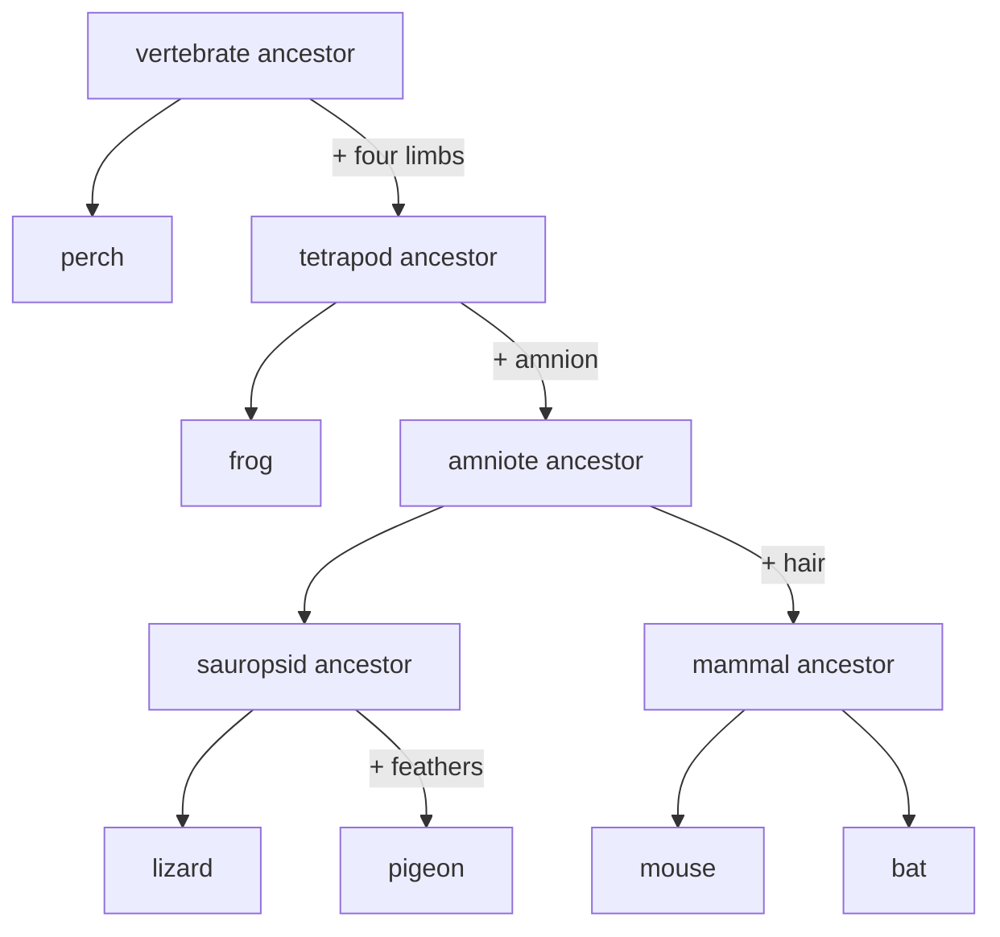

---
aliases:
  - Descent with Modification
  - Universal Common Ancestry
  - Ascendance commune
  - Descendance avec modification
tags:
  - type/concept
  - domain/biology
  - domain/bioinformatics
  - level/L1
  - level/L2
  - level/L3
mastery: 0
prerequisites:
  - "[[DNA]]"
  - "[[Genetic Code]]"
  - "[[Mutation]]"
related:
  - "[[Natural Selection]]"
  - "[[Tree of Life]]"
  - "[[Convergent Evolution]]"
  - "[[Sequence Homology]]"
  - "[[Phylogenetic Tree]]"
projects:
  - "[[08-phylogenetic-engine]]"
sources:
  - "[[Biology 2e (OpenStax)]]"
  - "[[Evolution (Futuyma)]]"
  - "[[On the Origin of Species (Darwin)]]"
  - "[[Molecular Biology of the Cell (Alberts)]]"
  - "[[Algorithms on Strings, Trees, and Sequences (Gusfield)]]"
  - "[[Theobald 2010 - A Formal Test of the Theory of Universal Common Ancestry]]"
---

# Common Descent

> [!abstract]
> All living things are relatives: follow any two species back in time and their lineages meet in a common ancestor, and all known life traces back to one ancestral population.

## Definition

**Common descent** is the thesis that species descend, with modification, from ancestral species, so that any two species share a **most recent common ancestor** (MRCA). In its strongest form, **universal common ancestry**, all known organisms descend from a single ancestral population.[^darwin][^futuyma][^os18] It is a claim about history (who descends from whom), distinct from the mechanisms that cause the modification ([[Natural Selection]], [[Genetic Drift]]).

## Why it matters

- **Homology is the working assumption of sequence analysis.** A [[BLAST]] hit, a [[Multiple Sequence Alignment]] or a [[Substitution Matrix]] makes sense only if the sequences descend from common ancestral sequences ([[Sequence Homology]]).
- **Annotation transfer and model organisms.** What is learned about a gene in yeast or mouse is transferred to its human [[Ortholog|ortholog]] because both copies descend from one ancestral gene.
- **Trees.** Phylogenetic methods reconstruct the genealogy that common descent asserts ([[Phylogenetic Tree]], [[08-phylogenetic-engine]]); dating its nodes is the job of the [[Molecular Clock]]. Characters that do not fit one tree point to [[Convergent Evolution]] or [[Horizontal Gene Transfer]], which a bioinformatician must detect rather than average away.

## Core (L1)

**Darwin's picture.** Darwin argued that species were not created separately but are modified descendants of earlier species; the only figure of *On the Origin of Species* is a diagram of lineages branching and diverging.[^darwin] Living species are therefore cousins, not ancestors of one another: humans and chimpanzees share a common ancestor, and neither descends from the other.[^futuyma]

**Weighing the evidence.** Independent lines of evidence support common descent.[^os18][^futuyma]

| Line of evidence | What it shows | Strength | Limit |
|---|---|---|---|
| Fossils | Past organisms differ from living ones, are ordered in time by rock layers, and include series of intermediate forms (the horse lineage) | The only direct record of past forms and of time | Very incomplete: few organisms fossilize, soft parts rarely do |
| Anatomy and embryology | **Homologous structures** (the same set of bones in the forelimbs of humans, bats, birds and whales, used for different functions); **vestigial structures** (wings of flightless birds, hind-leg bones of whales); similar early embryos | "Same parts, different uses": a pattern explained by inheritance, not by function | Similar shapes can also evolve independently ([[Convergent Evolution]]) |
| Molecules | All cells store information in [[DNA]], decode it with ribosomes and a nearly universal [[Genetic Code]];[^alberts] gene sequences show the same branching pattern | Quantitative: thousands of independent characters per genome, testable statistically | Horizontal transfer and convergence add conflicting signal |
The weight of the case comes from agreement: fossils, anatomy and molecules, gathered independently, group organisms in the same nested way.[^futuyma]

**Nested groups.** A novelty that appears in an ancestor is inherited by all its descendants, so novelties define groups within groups.[^os20]



## Deeper (L2)

**The testable prediction.** Descent predicts a **nested hierarchy**: the set of species carrying one inherited novelty either contains, is contained in, or is disjoint from the set carrying another ({mouse, bat} ⊂ amniotes ⊂ tetrapods). Darwin already argued that the natural classification of organisms into groups within groups is explained by descent.[^darwin] Independent origins of each species, or traits assorted at random, predict no such nesting.

**Shared conventions weigh most.** Similarity forced by function (any flying animal needs a wing surface) is weak evidence of kinship. Similarity in features that could have been otherwise is strong: a whale's flipper need not contain a bat's set of bones. At the molecular level the codon assignments are such a convention: variant codes exist and work ([[Genetic Code#Advanced (L3)]]), yet bacteria, archaea and eukaryotes share one standard table with minor, lineage-specific variants, the molecular counterpart of the shared forelimb.

**Real data are not perfectly nested.** Convergence and reversals ([[Convergent Evolution]]), [[Horizontal Gene Transfer]] and [[Incomplete Lineage Sorting]] all produce characters that conflict with the species tree. Phylogenetic methods therefore look for the tree that best explains imperfect data ([[Maximum Parsimony]], [[Maximum Likelihood Phylogenetics]]), and sequence similarity is read as evidence of homology only when it exceeds chance ([[Sequence Homology]]).

## Advanced (L3)

**Universal common ancestry as a statistical hypothesis.** Theobald compared, by model selection, a single common ancestor of all life with models in which the three domains arose independently, using sequences of universally conserved proteins; common ancestry was favoured by a very large margin.[^theobald] The method was later criticized for relying on aligned sequences (see the source note), so read it as strong support from one framework rather than as a proof ([[Model Selection]]).

**Genes versus organisms.** When genes move between lineages, each gene still has a genealogy, but different genes of one genome can have different histories: near the base of the [[Tree of Life]] the history of organisms is partly a network. Within a species, gene copies trace back to common ancestors at different times ([[Coalescent Theory]]). "The common ancestor" therefore depends on which gene is followed; universal common ancestry is a statement about the core machinery shared by all cells.

## Mathematical representation

A genealogy is a rooted tree $T = (V, E)$ with root $\rho$ and leaf set $X$ (present-day taxa). Each node $v \neq \rho$ has one parent $\pi(v)$, and its ancestors are $\operatorname{anc}(v) = \{v, \pi(v), \pi^2(v), \dots, \rho\}$. The most recent common ancestor of leaves $a, b$ is the node of $\operatorname{anc}(a) \cap \operatorname{anc}(b)$ farthest from $\rho$. Universal common ancestry means one root for all leaves, so the intersection is never empty. The **clade** of $v$, $C(v) \subseteq X$, is the set of leaves descending from $v$. For any two nodes, $C(u)$ and $C(v)$ are nested or disjoint.

**Binary characters.** Let $M \in \{0,1\}^{n \times m}$ record, for $n$ taxa and $m$ characters, the presence (1) of a derived state, the ancestral state being 0, and let $O_j = \{i : M_{ij} = 1\}$. A rooted tree on which every character arises exactly once and is never lost (a **perfect phylogeny**) exists if and only if, for every pair $j, k$, the sets $O_j$ and $O_k$ are nested or disjoint.[^gusfield] A pair that overlaps without nesting proves that at least one of the two characters is homoplastic or was transferred.

## Computational representation

A tree can be stored as a dictionary of parent pointers ([[Tree (Data Structure)]]); the [[Newick Format]] is the usual file format. The code below finds MRCAs and checks the nested-or-disjoint condition on toy characters (the anatomical states are textbook facts; the encoding is ours).

```python
PARENT = {                      # child -> parent (toy genealogy of six vertebrates)
    "perch": "Vertebrata", "Tetrapoda": "Vertebrata",
    "frog": "Tetrapoda", "Amniota": "Tetrapoda",
    "Sauropsida": "Amniota", "Mammalia": "Amniota",
    "lizard": "Sauropsida", "pigeon": "Sauropsida",
    "mouse": "Mammalia", "bat": "Mammalia",
}

def ancestors(node: str) -> list[str]:
    path = [node]
    while path[-1] in PARENT:
        path.append(PARENT[path[-1]])
    return path

def mrca(a: str, b: str) -> str:
    anc_b = set(ancestors(b))
    return next(x for x in ancestors(a) if x in anc_b)

TAXA = ["perch", "frog", "lizard", "pigeon", "mouse", "bat"]
CHARACTERS = {                  # 1 = derived state present; the perch keeps the ancestral 0
    "four limbs":     "011111",
    "amnion":         "001111",
    "feathers":       "000100",
    "hair":           "000011",
    "powered flight": "000101",
}

def taxa_with(bits: str) -> frozenset[str]:
    return frozenset(t for t, b in zip(TAXA, bits) if b == "1")

def compatible(x: str, y: str) -> bool:
    """Two characters fit one tree (ancestor all 0) iff their sets are nested or disjoint."""
    a, b = taxa_with(x), taxa_with(y)
    return a <= b or b <= a or not a & b

print(mrca("bat", "mouse"), mrca("bat", "pigeon"), mrca("bat", "perch"))
names = list(CHARACTERS)
for i, c1 in enumerate(names):
    for c2 in names[i + 1:]:
        if not compatible(CHARACTERS[c1], CHARACTERS[c2]):
            print("conflict:", c1, "|", c2)
```

Output:

```text
Mammalia Amniota Vertebrata
conflict: hair | powered flight
```

## Worked example

> [!example] Locating a conflict in the toy data
> 1. **MRCA of bat and pigeon.** Ancestors of bat: bat, Mammalia, Amniota, Tetrapoda, Vertebrata. Ancestors of pigeon: pigeon, Sauropsida, Amniota, ... The first shared node is **Amniota**: a bat is as closely related to a pigeon as to a lizard.
> 2. **Check the characters pairwise.** Hair = {mouse, bat} is nested in amnion = {lizard, pigeon, mouse, bat}, which is nested in four limbs: compatible. Powered flight = {pigeon, bat} meets hair in {bat} only, and neither set contains the other: **incompatible**.
> 3. **Which one is homoplastic?** Hair agrees with every other character; flight conflicts with hair alone. Anatomy settles it: a bird wing is a feathered arm, a bat wing a skin membrane stretched between elongated fingers, so flight arose twice.[^os20] Removing flight leaves a perfectly nested set (Exercise 3).

## Common misconceptions

> [!warning] "Humans descend from chimpanzees"
> Living species are not ancestors of one another. Humans and chimpanzees share an ancestor that was neither a human nor a chimpanzee.[^futuyma]

> [!warning] "Any similarity is evidence of common ancestry"
> Similarity can arise independently. What counts is nested, detailed, functionally arbitrary similarity, and for sequences similarity beyond chance ([[Sequence Homology]]).

## Exercises

> [!question] Exercise 1 (L1)
> Assign each observation to a line of evidence and say what it shows: (a) the same bones in a whale flipper and a bat wing; (b) hind-leg bones inside whales; (c) a time-ordered series of horse fossils; (d) UUU codes for phenylalanine in *E. coli* and in humans.

> [!success]- Solution
> (a) Anatomy, homologous structures: one inherited bone plan modified for swimming and flying. (b) Anatomy, vestigial structure: a remnant of legs inherited from four-legged ancestors. (c) Fossils: intermediate forms ordered in time. (d) Molecular: a shared arbitrary convention of the genetic code, inherited from a common ancestor.

> [!question] Exercise 2 (L2)
> Five invented taxa T1 to T5 carry derived states: c1 = {T2, T3, T4, T5}, c2 = {T4, T5}, c3 = {T2, T3}, c4 = {T3, T4}. Which pairs are compatible? Draw the tree implied by c1 to c3 and interpret c4.

> [!success]- Solution
> c1, c2, c3 are pairwise nested or disjoint, giving `(T1,((T2,T3),(T4,T5)))`. c4 overlaps c2 in {T4} and c3 in {T3} without nesting: it conflicts with both. On the tree, c4 needs two gains (in T3 and in T4) or a gain and a loss: it is homoplastic, or the tree is wrong for that gene.

> [!question] Exercise 3 (L2, Python)
> With the code above, write `all_compatible(chars)` and show that the characters become perfectly nested once "powered flight" is removed.

> [!success]- Solution
> ```python
> def all_compatible(chars: dict[str, str]) -> bool:
>     bits = list(chars.values())
>     return all(compatible(x, y) for i, x in enumerate(bits) for y in bits[i + 1:])
>
> kept = {name: bits for name, bits in CHARACTERS.items() if name != "powered flight"}
> print(all_compatible(CHARACTERS), all_compatible(kept))   # False True
> ```
>
> The four remaining sets (four limbs ⊃ amnion ⊃ hair, and feathers disjoint from hair) are the clades of the Mermaid tree. No character groups lizard with pigeon, so this data set leaves that node unresolved without contradicting it.

> [!question] Exercise 4 (L3)
> Why is a shared genetic code stronger evidence of universal common ancestry than the shared use of DNA? Why do variant codes not weaken the argument?

> [!success]- Solution
> DNA might be the only practical chemistry for heredity, so independent origins could converge on it. Codon assignments are a convention: variant codes show that other assignments work, so sharing one table signals inheritance, as a shared spelling mistake signals a copied manuscript. Variant codes are few, differ from the standard table at a handful of codons, and are confined to particular lineages (mostly mitochondria, [[Genetic Code#Advanced (L3)]]): they look like modifications of one ancestral code, which is what descent predicts.

## Mastery checklist

- [ ] 1 Recognized: I can define common descent, MRCA and universal common ancestry.
- [ ] 2 Understood: I can weigh fossil, anatomical, biogeographical and molecular evidence, including their limits.
- [ ] 3 Practiced: I can compute MRCAs on a parent-pointer tree and test characters for nestedness in Python.
- [ ] 4 Applied: in [[08-phylogenetic-engine]], I treat conflicting characters as signals of homoplasy or transfer, not as noise.
- [ ] 5 Explained: I can teach why nested, arbitrary similarity is the core evidence, and what Theobald's test does and does not show.

## References

[^darwin]: [[On the Origin of Species (Darwin)]], 1st ed. (1859).
[^futuyma]: [[Evolution (Futuyma)]], 5th ed. (2023), evidence for evolution and the history of life (chapter numbers not verified).
[^os18]: [[Biology 2e (OpenStax)]], ch. 18 "Evolution and the Origin of Species" (evidence of evolution: fossils, anatomy and embryology, biogeography, molecular biology).
[^os20]: [[Biology 2e (OpenStax)]], ch. 20 "Phylogenies and the History of Life" (shared characters; homologous and analogous structures).
[^alberts]: [[Molecular Biology of the Cell (Alberts)]], 4th ed. (2002), ch. 1 "Cells and Genomes".
[^gusfield]: [[Algorithms on Strings, Trees, and Sequences (Gusfield)]], ch. 17 "Strings and Evolutionary Trees" (perfect phylogeny for binary characters).
[^theobald]: [[Theobald 2010 - A Formal Test of the Theory of Universal Common Ancestry]], *Nature* 465:219-222.
