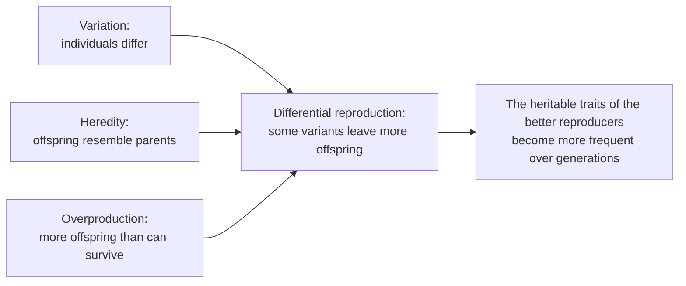

---
aliases:
  - Selection
  - Darwinian Selection
  - Sélection naturelle
  - Directional Selection
  - Stabilizing Selection
  - Disruptive Selection
  - Diversifying Selection
tags:
  - type/concept
  - domain/biology
  - domain/bioinformatics
  - level/L1
  - level/L2
  - level/L3
mastery: 0
prerequisites:
  - "[[Common Descent]]"
  - "[[Allele]]"
  - "[[Genotype]]"
  - "[[Phenotype]]"
  - "[[Mutation]]"
  - "[[Mendelian Inheritance]]"
related:
  - "[[Fitness]]"
  - "[[Adaptation]]"
  - "[[Allele Frequency]]"
  - "[[Genetic Drift]]"
  - "[[Hardy-Weinberg Equilibrium]]"
  - "[[Wright-Fisher Model]]"
  - "[[Fixation Probability]]"
  - "[[Neutral Theory of Molecular Evolution]]"
  - "[[Purifying Selection]]"
  - "[[Positive Selection]]"
  - "[[Balancing Selection]]"
  - "[[Heritability]]"
projects:
  - "[[07-evolution-simulator]]"
  - "[[bio-simulation]]"
sources:
  - "[[On the Origin of Species (Darwin)]]"
  - "[[Biology 2e (OpenStax)]]"
  - "[[Evolution (Futuyma)]]"
  - "[[Principles of Population Genetics (Hartl)]]"
  - "[[Kimura 1968 - Evolutionary Rate at the Molecular Level]]"
---

# Natural Selection

> [!abstract]
> When individuals differ in heritable traits and those differences change how many offspring they leave, the traits of the better reproducers become more common every generation: that sorting is natural selection.

## Definition

**Natural selection** is the differential survival and reproduction of individuals caused by differences in their phenotypes; when those differences are heritable, it changes the genetic composition of the population from one generation to the next.[^futuyma][^os19] It is one of the evolutionary forces that change [[Allele Frequency|allele frequencies]], together with [[Mutation]], [[Genetic Drift]] and migration ([[Gene Flow]]).[^hartl]

## Why it matters

- **Reading conservation.** Sites where change is harmful stay conserved across species; conservation scores and the ratio of nonsynonymous to synonymous substitution rates are measurements of selection ([[Purifying Selection]], [[Positive Selection]], [[Evolutionary Constraint]]).
- **Resistance.** In a population of bacteria, viruses or tumour cells exposed to a drug, any variant that leaves more descendants rises in frequency at the rate the recursion below predicts; sequencing the population over time measures that rise ([[Fitness]]).
- **Simulation.** The one-locus recursion is the deterministic core of [[07-evolution-simulator]]; [[Genetic Drift]] and the [[Wright-Fisher Model]] add randomness on top of it.
- **The null model.** Kimura argued that most molecular changes fixed in evolution are neutral,[^kimura] so detecting selection in genomes means rejecting a neutral model ([[Neutral Theory of Molecular Evolution]], [[Selection Scan]]).

## Core (L1)

### Darwin's argument

Darwin and Wallace presented the idea together in 1858, and Darwin developed it in *On the Origin of Species* the following year.[^os18][^darwin] The argument has three premises and a consequence:[^darwin][^futuyma]



Three consequences follow.

- **Selection sorts, it does not create.** New variants arise by [[Mutation]] and recombination at random with respect to the organism's needs; selection changes the frequencies of variants that already exist.[^futuyma]
- **Heredity is required.** A difference acquired during life (muscles built by exercise) is not transmitted, so selecting on it changes nothing in the next generation.[^futuyma]
- **Populations evolve, individuals do not.** Selection acts on individuals' phenotypes; the evolutionary change is a change in the population's composition.[^os19]

### Three modes on a continuous trait

How selection reshapes a trait distribution depends on which values reproduce best.[^os19]

| Mode | Favoured | Effect on the distribution | Example |
|---|---|---|---|
| **Directional** | one extreme | the mean shifts | peppered moths in industrial England: as soot darkened tree bark, birds spotted light moths more easily and the dark form increased |
| **Stabilizing** | intermediate values | the variance shrinks, the mean stays | forest mice whose fur matches the brown floor survive; lighter and darker mice are taken by predators |
| **Disruptive** (diversifying) | both extremes | the variance grows, two peaks can appear | a route to [[Speciation]] when the two extremes also mate assortatively |

Selection can also depend on the frequency of a type or on mating success (frequency-dependent and sexual selection),[^os19] which can maintain variation instead of removing it ([[Balancing Selection]]).

![[selection-modes-distributions.svg]]

## Deeper (L2)

### One locus, two alleles, haploid

Consider a haploid population (bacteria, or a single gene copy followed through generations) with allele $A$ at frequency $p$ and allele $a$ at $q = 1 - p$. Let their relative fitnesses be $w_A = 1 + s$ and $w_a = 1$ ([[Fitness]] defines them). After selection, each allele's share is its frequency weighted by its fitness, divided by the mean fitness:[^hartl]

$$p' = \frac{p\,w_A}{p\,w_A + q\,w_a} = \frac{p(1+s)}{1+ps}.$$

Three properties follow by algebra.

1. **Speed is proportional to variation.** $\Delta p = p' - p = \dfrac{s\,p\,q}{1 + s\,p} \approx s\,p\,q$ for small $s$: change is slow when $A$ is rare, fastest near $p = 1/2$, slow again near fixation.
2. **The odds grow geometrically.** $\dfrac{p'}{q'} = (1+s)\dfrac{p}{q}$, so the trajectory is a logistic curve with a closed form (Mathematical representation). From 1 % to 99 % takes about 924 generations at $s = 0.01$ and 96 at $s = 0.1$.
3. **It is deterministic.** $p$ approaches 1 but never reaches it. In a finite population chance decides the fate of rare alleles ([[Genetic Drift]], [[Fixation Probability]]).

![[haploid-selection-trajectories.svg]]

In diploids, selection acts on genotypes, and dominance changes the speed: a rare recessive allele hides in heterozygotes. The diploid recursion is in [[Fitness#Deeper (L2)]].

### Selection on a quantitative trait

Let a trait $z$ have frequency distribution $f(z)$ and let $w(z)$ be the fitness of value $z$. The distribution among the selected parents is $f^*(z) = w(z)\,f(z) / \bar w$, with $\bar w = \sum_z w(z) f(z)$. The **selection differential** $S$ is the difference between the mean of $f^*$ and the mean of $f$. How much of $S$ reappears in the offspring depends on how much of the variation is heritable ([[Heritability]]).[^hartl]

## Advanced (L3)

**Selection versus drift.** In a finite population each generation is a random sample of the previous one, so frequencies also change by chance. Selection dominates when $|s|$ is large compared with $1/N$, where $N$ is the (effective) population size; when $|s|$ is much smaller than $1/N$ the allele behaves as nearly neutral.[^hartl] Kimura argued from the high rate of amino-acid substitution that most molecular changes are fixed by drift, not by selection.[^kimura] This is why tests for selection in genomes are tests against neutrality ([[Effective Population Size]], [[Neutral Theory of Molecular Evolution]]).

**Selection in genomes.** The three modes have molecular counterparts studied at the end of the learning path: removal of harmful changes, which creates conservation ([[Purifying Selection]]); spread of advantageous changes, seen as excess nonsynonymous change or [[Selective Sweep|selective sweeps]] ([[Positive Selection]]); and maintenance of several alleles ([[Balancing Selection]]).

**What selection is not.** It has no foresight: it acts on the variation present, in the current environment. It favours whatever increases an individual's reproduction relative to others in its population, which is not the same as what benefits the species ([[Adaptation]]).

## Mathematical representation

**Haploid model.** $p_t$ and $q_t = 1 - p_t$ are the frequencies of $A$ and $a$ at generation $t$; $w_A = 1 + s$, $w_a = 1$; $\bar w_t = p_t w_A + q_t w_a = 1 + s p_t$. Then $p_{t+1} = p_t (1+s) / \bar w_t$, and since the odds are multiplied by $1+s$ each generation,

$$\ln\frac{p_t}{q_t} = \ln\frac{p_0}{q_0} + t \ln(1+s) \quad\Longrightarrow\quad p_t = \frac{p_0 (1+s)^t}{p_0 (1+s)^t + q_0}.$$

The number of generations from $p_0$ to $p_1$ is

$$T = \frac{\operatorname{logit}(p_1) - \operatorname{logit}(p_0)}{\ln(1+s)}, \qquad \operatorname{logit}(p) = \ln\frac{p}{1-p}.$$

**Quantitative trait.** With mean $\mathbb{E}[z]$ before selection, the mean after selection is $\mathbb{E}^*[z] = \mathbb{E}[z\,w]/\bar w$, so

$$S = \mathbb{E}^*[z] - \mathbb{E}[z] = \frac{\operatorname{Cov}(z, w)}{\bar w}.$$

The mean moves only if trait and fitness covary (directional selection). Stabilizing selection ($w$ peaked at the mean) reduces the variance with $S \approx 0$; disruptive selection ($w$ lowest at the mean) increases it.

## Computational representation

The recursion is a loop over generations; the modes are a reweighting of a distribution by a fitness function. Standard library only.

```python
import math

def next_p(p: float, s: float) -> float:
    """One generation of haploid selection: A has relative fitness 1 + s, a has 1."""
    return p * (1 + s) / (1 + s * p)

def trajectory(p0: float, s: float, generations: int) -> list[float]:
    ps = [p0]
    for _ in range(generations):
        ps.append(next_p(ps[-1], s))
    return ps

def generations_needed(p0: float, p1: float, s: float) -> float:
    """Closed form: the log-odds of A grow by ln(1 + s) per generation."""
    logit = lambda p: math.log(p / (1 - p))
    return (logit(p1) - logit(p0)) / math.log(1 + s)

for s in (0.01, 0.05, 0.1, -0.05):
    traj = trajectory(0.01 if s > 0 else 0.5, s, 1000)
    print(f"s={s:+.2f}", [round(traj[t], 4) for t in (0, 50, 100, 200, 500, 1000)])
for s in (0.01, 0.1):
    t_iter = next(t for t, p in enumerate(trajectory(0.01, s, 5000)) if p >= 0.99)
    print(f"s={s}: 1% -> 99% in {generations_needed(0.01, 0.99, s):.1f} generations "
          f"(iteration first reaches 0.99 at t={t_iter})")

# Modes of selection on a quantitative trait (invented distribution of body-size classes)
SIZES = list(range(1, 10))
COUNTS = [1, 4, 10, 18, 22, 18, 10, 4, 1]

def moments(weights):
    total = sum(weights)
    mean = sum(z * w for z, w in zip(SIZES, weights)) / total
    var = sum(w * (z - mean) ** 2 for z, w in zip(SIZES, weights)) / total
    return round(mean, 2), round(var, 2)

FITNESS = {                                   # survival probability as a function of size z
    "directional": lambda z: 0.1 * z,
    "stabilizing": lambda z: math.exp(-(z - 5) ** 2 / 4),
    "disruptive":  lambda z: 1 - 0.9 * math.exp(-(z - 5) ** 2 / 4),
}
print("before     ", moments(COUNTS))
for mode, w in FITNESS.items():
    survivors = [c * w(z) for z, c in zip(SIZES, COUNTS)]
    print(f"{mode:<11}", moments(survivors), [round(x, 1) for x in survivors])
```

Output:

```text
s=+0.01 [0.01, 0.0163, 0.0266, 0.0688, 0.5939, 0.9953]
s=+0.05 [0.01, 0.1038, 0.5705, 0.9943, 1.0, 1.0]
s=+0.10 [0.01, 0.5425, 0.9929, 1.0, 1.0, 1.0]
s=-0.05 [0.5, 0.0714, 0.0059, 0.0, 0.0, 0.0]
s=0.01: 1% -> 99% in 923.6 generations (iteration first reaches 0.99 at t=924)
s=0.1: 1% -> 99% in 96.4 generations (iteration first reaches 0.99 at t=97)
before      (5.0, 2.5)
directional (5.5, 2.25) [0.1, 0.8, 3.0, 7.2, 11.0, 10.8, 7.0, 3.2, 0.9]
stabilizing (5.0, 1.13) [0.0, 0.4, 3.7, 14.0, 22.0, 14.0, 3.7, 0.4, 0.0]
disruptive  (5.0, 4.53) [1.0, 3.6, 6.7, 5.4, 2.2, 5.4, 6.7, 3.6, 1.0]
```

The three fitness functions reproduce the table of the Core section: the mean moves only under directional selection, the variance halves under stabilizing selection and nearly doubles, with two peaks, under disruptive selection. In [[07-evolution-simulator]], `next_p` becomes the deterministic step to which binomial sampling is added ([[Wright-Fisher Model]]).

## Worked example

> [!example] A resistance allele under a drug (invented numbers)
> A resistance allele is at $p_0 = 0.01$ in a bacterial population; under the drug, resistant cells have relative fitness $1.2$ ($s = 0.2$).
>
> 1. **After 10 generations.** Odds $= \frac{0.01}{0.99} \times 1.2^{10} = 0.0101 \times 6.19 = 0.0625$, so $p_{10} = 0.0625 / 1.0625 = 0.0589$. The allele is still rare: early on, $\Delta p \approx s p q$ is tiny.
> 2. **Majority.** $T = \frac{\operatorname{logit}(0.5) - \operatorname{logit}(0.01)}{\ln 1.2} = \frac{0 + 4.595}{0.1823} = 25.2$: the allele is the majority after 26 generations.
> 3. **Near fixation.** From 0.01 to 0.99 the log-odds must rise by $2 \times 4.595$: $T = 50.4$, so 51 generations. Iterating `next_p` gives the same: $p_{10} = 0.0589$, first $p \ge 0.5$ at $t = 26$, first $p \ge 0.99$ at $t = 51$.
> 4. **Reading.** Half of the time to near fixation is spent going from 1 % to 50 %, the phase in which the allele is hardest to detect in a sample and most exposed to chance loss.

## Common misconceptions

> [!warning] "Selection creates the variants a population needs"
> Mutations arise at random with respect to need; selection only changes the frequencies of variants that already exist.[^futuyma] A population without a resistant variant cannot be selected for resistance.

> [!warning] "Survival of the fittest means the strongest survive"
> Selection is about reproduction relative to the other members of the population, not about strength or longevity ([[Fitness]]).

> [!warning] "Individuals evolve by natural selection"
> An individual's genotype does not change; selection changes which genotypes make up the next generation.[^os19]

> [!warning] "Every difference between species was selected"
> Many molecular differences are best explained by mutation and drift without selection;[^kimura] a selective explanation must beat the neutral one.

## Exercises

> [!question] Exercise 1 (L1)
> Name the mode of selection in each invented scenario: (a) after a drought leaves only hard seeds, birds with deeper beaks survive better; (b) newborns of intermediate weight survive better than very light or very heavy ones; (c) in a bird population feeding on small soft and large hard seeds, small-billed and large-billed birds feed efficiently while intermediate bills handle neither seed well.

> [!success]- Solution
> (a) Directional: one extreme is favoured, the mean beak depth rises. (b) Stabilizing: the intermediate is favoured, the variance shrinks. (c) Disruptive: both extremes are favoured, the distribution can become bimodal.

> [!question] Exercise 2 (L1)
> Plants in a garden given fertilizer grow taller than unfertilized plants, and only the tall plants are allowed to set seed. Will the next generation be taller? Which premise of Darwin's argument does this test?

> [!success]- Solution
> Not if the height difference is caused by the fertilizer: the variation is environmental, not heritable, so the offspring of tall plants resemble the population average. Selection happened (differential reproduction) but no evolution follows because the heredity premise fails.

> [!question] Exercise 3 (L2)
> With $p = 0.1$ and $s = 0.5$, compute $p'$ in the haploid model by hand, and the change $\Delta p$.

> [!success]- Solution
> $p' = \frac{0.1 \times 1.5}{1 + 0.1 \times 0.5} = \frac{0.15}{1.05} = 0.1429$, so $\Delta p = 0.0429$. Check: $\frac{s p q}{1 + s p} = \frac{0.5 \times 0.1 \times 0.9}{1.05} = 0.0429$.

> [!question] Exercise 4 (L2, Python)
> Using `generations_needed`, compute the generations from $p = 0.001$ to $0.5$ and from $0.5$ to $0.999$ for $s = 0.01$ and $s = 0.1$. Explain the symmetry.

> [!success]- Solution
> ```python
> for s in (0.01, 0.1):
>     print(s, round(generations_needed(0.001, 0.5, s), 1), round(generations_needed(0.5, 0.999, s), 1))
> # 0.01 694.1 694.1
> # 0.1 72.5 72.5
> ```
>
> $\operatorname{logit}(0.001) = -\operatorname{logit}(0.999)$ and $\operatorname{logit}(0.5) = 0$: the log-odds grow linearly, so equal logit distances take equal times. Going from 0.1 % to 50 % takes as long as from 50 % to 99.9 %, and the time scales as $1/\ln(1+s) \approx 1/s$.

> [!question] Exercise 5 (L3, Python)
> Compare the exact change $p' - p$ with the approximation $s p q$ for $s = 0.02$ at $p = 0.001, 0.5, 0.999$. What does the size of $\Delta p$ at $p = 0.001$ imply in a population of $N = 10^4$ individuals?

> [!success]- Solution
> ```python
> for p in (0.001, 0.5, 0.999):
>     exact = next_p(p, 0.02) - p
>     print(f"p={p}: exact={exact:.4e}  s*p*q={0.02 * p * (1 - p):.4e}")
> # p=0.001: exact=1.9980e-05  s*p*q=1.9980e-05
> # p=0.5: exact=4.9505e-03  s*p*q=5.0000e-03
> # p=0.999: exact=1.9589e-05  s*p*q=1.9980e-05
> ```
>
> The approximation overestimates by the factor $1 + sp$, which matters only when $sp$ is not small. At $p = 0.001$ in a population of $10^4$, the allele is carried by 10 individuals and selection adds about $2 \times 10^{-5} \times 10^4 = 0.2$ copies per generation, far less than the random fluctuation in the number of offspring of 10 individuals. A new beneficial allele is therefore often lost by chance before selection takes over ([[Genetic Drift]], [[Fixation Probability]]).

> [!question] Exercise 6 (L3, Python)
> Prove $S = \operatorname{Cov}(z, w)/\bar w$ and check it numerically on the directional case of the code.

> [!success]- Solution
> $\mathbb{E}^*[z] = \sum_z z\,w(z) f(z) / \bar w = \mathbb{E}[zw]/\mathbb{E}[w]$, so $S = \frac{\mathbb{E}[zw] - \mathbb{E}[z]\mathbb{E}[w]}{\mathbb{E}[w]} = \frac{\operatorname{Cov}(z,w)}{\bar w}$.
>
> ```python
> w = FITNESS["directional"]
> N = sum(COUNTS)
> Ez = sum(z * c for z, c in zip(SIZES, COUNTS)) / N
> Ew = sum(w(z) * c for z, c in zip(SIZES, COUNTS)) / N
> Ezw = sum(z * w(z) * c for z, c in zip(SIZES, COUNTS)) / N
> print(round((Ezw - Ez * Ew) / Ew, 4))   # 0.5
> ```
>
> The survivors' mean is 5.5 against 5.0 before selection: $S = 0.5$, as the covariance formula gives. Under the symmetric stabilizing and disruptive functions, $\operatorname{Cov}(z, w) = 0$ and the mean does not move.

## Mastery checklist

- [ ] 1 Recognized: I can state Darwin's argument and name the three modes of selection.
- [ ] 2 Understood: I can explain why selection needs heritable variation, and how each mode changes a trait distribution.
- [ ] 3 Practiced: I can derive and iterate $p' = p(1+s)/(1+ps)$ and compute times between frequencies in Python.
- [ ] 4 Applied: in [[07-evolution-simulator]], I implement the deterministic selection step and check it against the closed form.
- [ ] 5 Explained: I can teach when selection beats drift, why most molecular change may be neutral, and how selection is detected in genomes.

## References

[^darwin]: [[On the Origin of Species (Darwin)]], 1st ed. (1859).
[^os18]: [[Biology 2e (OpenStax)]], ch. 18 "Evolution and the Origin of Species" (Darwin, Wallace and natural selection).
[^os19]: [[Biology 2e (OpenStax)]], ch. 19 "The Evolution of Populations", section "Adaptive Evolution" (stabilizing, directional and diversifying selection; frequency-dependent and sexual selection).
[^futuyma]: [[Evolution (Futuyma)]], 5th ed. (2023), natural selection and adaptation (chapter numbers not verified).
[^hartl]: [[Principles of Population Genetics (Hartl)]], 4th ed. (2006), treatment of natural selection (one-locus selection models, selection and drift, quantitative traits).
[^kimura]: [[Kimura 1968 - Evolutionary Rate at the Molecular Level]], *Nature* 217:624-626.
