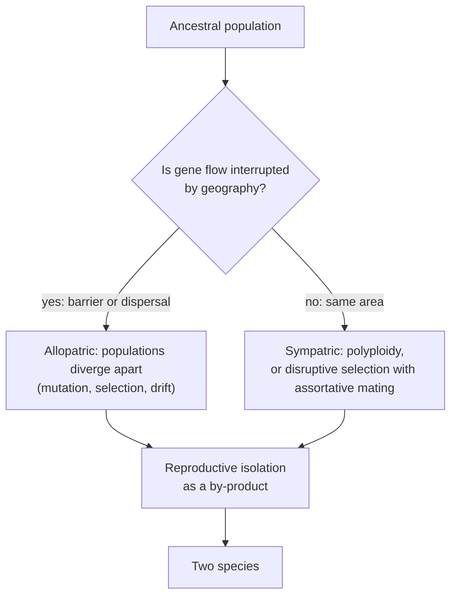

---
aliases:
  - Spéciation
  - Biological Species Concept
  - BSC
  - Allopatric Speciation
  - Sympatric Speciation
  - Reproductive Isolation
tags:
  - type/concept
  - domain/biology
  - domain/bioinformatics
  - level/L1
  - level/L2
  - level/L3
mastery: 0
prerequisites:
  - "[[Natural Selection]]"
  - "[[Common Descent]]"
  - "[[Meiosis]]"
  - "[[Ploidy]]"
related:
  - "[[Gene Flow]]"
  - "[[Ortholog]]"
  - "[[Tree of Life]]"
  - "[[Incomplete Lineage Sorting]]"
  - "[[Gene Tree Reconciliation]]"
  - "[[Microbial Taxonomy]]"
projects: []
sources:
  - "[[Biology 2e (OpenStax)]]"
  - "[[Evolution (Futuyma)]]"
---

# Speciation

> [!abstract]
> Speciation is the splitting of one species into two: populations stop exchanging genes, diverge, and end up unable to produce fertile hybrids together.

## Definition

**Speciation** is the process by which one lineage splits into two or more species. Under the **biological species concept** (BSC), a species is a group of natural populations whose members can interbreed and produce viable, fertile offspring, and which is reproductively isolated from other such groups. Speciation is then the evolution of **reproductive isolation**.[^os18][^futuyma]

## Why it matters

- **Orthology is defined by speciation.** Two genes are orthologs when they diverged at a speciation event, paralogs when they diverged at a duplication ([[Ortholog]], [[Sequence Homology]]); reconciling gene trees with species trees labels each node as one or the other ([[Gene Tree Reconciliation]]).
- **Species in databases.** For bacteria and archaea, which reproduce asexually, the BSC does not apply, and species are delimited operationally, increasingly from genome similarity ([[Microbial Taxonomy]], [[Taxonomic Classification]]).

## Core (L1)

### Reproductive isolation

Barriers that keep species apart are classified by when they act relative to fertilization.[^os18]

| Type | Barrier | Effect |
|---|---|---|
| Prezygotic | habitat | the species live or breed in different places |
| | temporal | they breed at different times (season, time of day) |
| | behavioral | courtship signals are not recognized |
| | mechanical | reproductive structures do not fit |
| | gametic | sperm cannot fertilize the other species' eggs |
| Postzygotic | hybrid inviability | hybrid embryos do not develop or survive |
| | hybrid sterility | hybrids survive but are sterile (the mule, from a horse and a donkey) |

### Two geographic modes

**Allopatric speciation**: a population is divided by a geographic barrier (vicariance) or a few individuals colonize a distant area (dispersal). Without [[Gene Flow|gene flow]], the separated populations diverge by mutation, selection and drift, and reproductive isolation appears as a by-product. When dispersal is followed by divergence into many species adapted to different niches, the result is an adaptive radiation, such as Darwin's finches on the Galápagos.[^os18]

**Sympatric speciation**: divergence within a single area, without geographic separation. A major route is **polyploidy**: an error during [[Meiosis|meiosis]] produces gametes with extra chromosome sets. In **autopolyploidy** the extra sets come from one species; in **allopolyploidy** a hybrid between two species doubles its chromosomes. Polyploids are reproductively isolated from their parents at once, and polyploid speciation is common in plants.[^os18]



## Deeper (L2)

**Why a polyploid is isolated at once.** A tetraploid crossed with its diploid parent gives triploid offspring; in a triploid, each chromosome type has three copies, which cannot be split evenly between two cells at meiosis, so the gametes are unbalanced and the triploid is sterile.[^os18] See the worked example.

**Limits of the biological species concept.** It cannot be applied to asexual organisms or to fossils, and many good species exchange genes occasionally. Other concepts define species by morphology or by membership in a distinct lineage of a phylogeny (phylogenetic species concepts).[^futuyma] Sympatric speciation without polyploidy requires disruptive selection together with assortative mating, and how often it happens is debated.[^futuyma]

## Advanced (L3)

**Genetics of isolation: Dobzhansky-Muller incompatibilities.** Hybrid sterility or inviability does not require any allele to be harmful in its own species; incompatibilities accumulate faster than divergence itself (toy model below). Suppose lineage 1 fixes a derived allele at locus A and lineage 2 a derived allele at locus B, each compatible with its own genetic background. The two derived alleles have never been together in one genome; in a hybrid they meet and may interact badly ([[Epistasis]]).[^futuyma]

**Species, genes and genomes.** Speciation with some gene flow leaves genomes that are mosaics: regions involved in isolation diverge while others keep being exchanged. Gene trees then differ along the genome, which is why species trees are now estimated from many loci together ([[Incomplete Lineage Sorting]], [[Coalescent Theory]]).[^futuyma]

## Mathematical representation

**Interbreeding as a graph.** Let populations be vertices and draw an edge between two populations when crosses between them give fertile offspring in nature. The relation is reflexive and symmetric but not necessarily transitive: A may interbreed with B and B with C while A and C cannot. Gene flow passes through intermediates, so a species under the BSC corresponds to a **connected component** of this graph ([[Connected Component]], [[Graph Traversal]]). Chains of populations whose ends no longer interbreed (ring species) show the ambiguity: one component, yet two isolated ends.[^futuyma]

**Toy Dobzhansky-Muller model.** If lineage 1 has fixed $k_1$ derived alleles and lineage 2 has fixed $k_2$, there are $k_1 k_2$ cross-lineage pairs never tested by selection ($K^2/4$ for $K = k_1 + k_2$ substitutions split evenly). If each of these untested pairs is independently incompatible with probability $p$,

$$P(\text{hybrid fully compatible}) = (1 - p)^{k_1 k_2} \approx e^{-p\,k_1 k_2},$$

which decays like $e^{-pK^2/4}$ for $K$ substitutions split evenly: isolation accelerates as divergence accumulates.

## Computational representation

```python
from collections import defaultdict, deque

# 1. Biological species as connected components of an interbreeding graph (invented populations)
CROSSES = [("P1", "P2"), ("P2", "P3"), ("P4", "P5")]   # pairs that produce fertile offspring
POPS = ["P1", "P2", "P3", "P4", "P5", "P6"]

def components(nodes, edges):
    graph = defaultdict(set)
    for a, b in edges:
        graph[a].add(b)
        graph[b].add(a)
    seen, groups = set(), []
    for start in nodes:
        if start in seen:
            continue
        queue, group = deque([start]), []
        seen.add(start)
        while queue:
            n = queue.popleft()
            group.append(n)
            for m in graph[n] - seen:
                seen.add(m)
                queue.append(m)
        groups.append(sorted(group))
    return groups

print(components(POPS, CROSSES))

# 2. Dobzhansky-Muller toy model: untested pairs of derived alleles between two lineages
def p_hybrid_compatible(k1: int, k2: int, p: float) -> float:
    """Each of the k1*k2 cross-lineage pairs is incompatible with probability p, independently."""
    return (1 - p) ** (k1 * k2)

for K in (0, 10, 20, 40, 80):
    k1 = k2 = K // 2
    print(f"K={K:3d}  untested pairs={k1 * k2:5d}  P(hybrid compatible)={p_hybrid_compatible(k1, k2, 0.005):.3f}")
```

Output:

```text
[['P1', 'P2', 'P3'], ['P4', 'P5'], ['P6']]
K=  0  untested pairs=    0  P(hybrid compatible)=1.000
K= 10  untested pairs=   25  P(hybrid compatible)=0.882
K= 20  untested pairs=  100  P(hybrid compatible)=0.606
K= 40  untested pairs=  400  P(hybrid compatible)=0.135
K= 80  untested pairs= 1600  P(hybrid compatible)=0.000
```

Three species in the invented graph: P1 and P3 belong to one species through P2 even if they never meet. In the toy model, doubling divergence quadruples the number of untested pairs; with $p = 0.005$ (invented), hybrids go from mostly compatible to almost always incompatible between $K = 20$ and $K = 80$.

## Worked example

> [!example] Polyploidy, chromosome by chromosome (invented chromosome numbers)
> A diploid plant species has $2n = 14$: seven chromosome types, two copies each.
>
> 1. **Error**: a failed meiosis produces unreduced gametes with 14 chromosomes; two of them fuse, giving a **tetraploid** ($4n = 28$, four copies of each type). At meiosis the copies pair two by two, so the tetraploid makes balanced gametes of 14 and is fertile.
> 2. **Backcross**: tetraploid gamete (14) + diploid gamete (7) gives a **triploid** with 21 chromosomes, three copies of each type.
> 3. **Triploid meiosis**: three copies cannot be split evenly into two cells; each gamete receives one or two copies of each type at random, so almost all gametes are unbalanced. The triploid is sterile.
> 4. **Conclusion**: the tetraploid can reproduce with other tetraploids but not, through fertile offspring, with its parents. Postzygotic isolation arose in one generation, in the same field.[^os18]

## Common misconceptions

> [!warning] "Species are defined by how they look"
> Under the BSC the criterion is reproductive isolation, not appearance: populations that look alike can be separate species, and very different-looking forms can belong to one species.[^futuyma]

> [!warning] "Speciation always takes thousands of generations"
> Polyploidy can create a reproductively isolated lineage in a single generation.[^os18]

## Exercises

> [!question] Exercise 1 (L1)
> Name the barrier: (a) two frog species breed in different months; (b) two bird species have different courtship songs; (c) sperm of one sea urchin species cannot fertilize the eggs of another; (d) a mule is sterile.

> [!success]- Solution
> (a) Temporal, prezygotic. (b) Behavioral, prezygotic. (c) Gametic, prezygotic. (d) Hybrid sterility, postzygotic.

> [!question] Exercise 2 (L2)
> Species A has $2n = 10$ and species B has $2n = 14$ (invented). What is the chromosome number of a hybrid, why is it sterile, and how can chromosome doubling restore fertility?

> [!success]- Solution
> The hybrid receives 5 + 7 = 12 chromosomes, one copy of each type from each parent; the A and B chromosomes are not homologous, so they have no partners at meiosis and the gametes are unbalanced: sterile. Doubling gives 24 chromosomes, two copies of each type; each chromosome now has a partner, meiosis is regular, and the allopolyploid is fertile and isolated from both parents.

> [!question] Exercise 3 (L2, Python)
> A chain of five invented populations R1 to R5 interbreeds only between neighbours. With `components`, show that they form one species under the BSC, then remove the middle link R3-R4 (the intermediate population disappears) and recompute.

> [!success]- Solution
> ```python
> chain = [("R1", "R2"), ("R2", "R3"), ("R3", "R4"), ("R4", "R5")]
> print(components(["R1", "R2", "R3", "R4", "R5"], chain))
> print(components(["R1", "R2", "R3", "R4", "R5"], [e for e in chain if e != ("R3", "R4")]))
> # [['R1', 'R2', 'R3', 'R4', 'R5']]
> # [['R1', 'R2', 'R3'], ['R4', 'R5']]
> ```
>
> One component, then two. R1 and R5 may never be able to interbreed directly, yet they belong to one species while the chain is intact: genes can flow between them through the intermediates. Removing a link splits the species without any change in R1 or R5.

> [!question] Exercise 4 (L3)
> Explain why, in the Dobzhansky-Muller model, neither lineage passes through a less fit intermediate, and why incompatibilities accumulate faster than linearly with divergence.

> [!success]- Solution
> Each derived allele is fixed on the background of its own lineage, where it has been tested and is compatible; no genome ever carries both derived alleles until hybridization. The untested combinations are the cross-lineage pairs, $k_1 k_2$ of them, which grows as $K^2/4$ when $K$ substitutions split evenly: doubling divergence quadruples the potential incompatibilities, so isolation "snowballs".

## Mastery checklist

- [ ] 1 Recognized: I can state the biological species concept and name prezygotic and postzygotic barriers.
- [ ] 2 Understood: I can explain allopatric speciation, polyploid sympatric speciation, and why a polyploid is isolated at once.
- [ ] 3 Practiced: I can compute polyploid chromosome numbers and find species as connected components in Python.
- [ ] 4 Applied: I label speciation and duplication nodes when interpreting gene trees and ortholog sets.
- [ ] 5 Explained: I can teach the limits of the BSC, Dobzhansky-Muller incompatibilities and why gene trees can disagree with species trees.

## References

[^os18]: [[Biology 2e (OpenStax)]], ch. 18 "Evolution and the Origin of Species" (species and reproductive isolation; allopatric and sympatric speciation, polyploidy).
[^futuyma]: [[Evolution (Futuyma)]], 5th ed. (2023), species and speciation (species concepts, Dobzhansky-Muller incompatibilities, gene trees and species trees; chapter numbers not verified).
