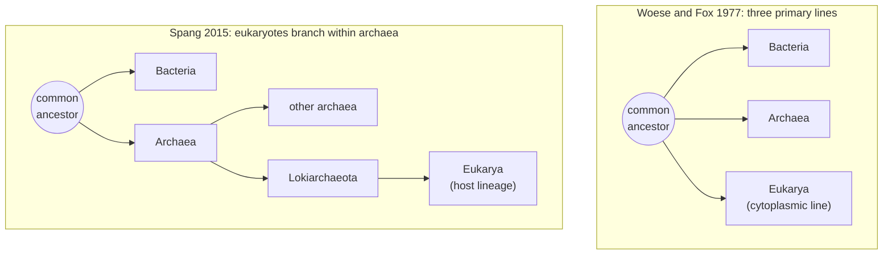

---
aliases:
  - Archaeon
  - Archaebacteria
  - Domain Archaea
  - Archées
tags:
  - type/concept
  - domain/biology
  - domain/bioinformatics
  - level/L1
  - level/L2
  - level/L3
mastery: 0
prerequisites:
  - "[[Prokaryote]]"
  - "[[Bacteria]]"
  - "[[Ribosome]]"
related:
  - "[[Eukaryote]]"
  - "[[Tree of Life]]"
  - "[[16S Ribosomal RNA]]"
  - "[[Phylogenomics]]"
  - "[[Genetic Code]]"
  - "[[Metagenomics]]"
  - "[[Microbial Taxonomy]]"
projects: []
sources:
  - "[[Woese 1977 - Phylogenetic Structure of the Prokaryotic Domain]]"
  - "[[Biology 2e (OpenStax)]]"
  - "[[Microbiology (OpenStax)]]"
  - "[[Molecular Biology of the Cell (Alberts)]]"
  - "[[Spang 2015 - Complex Archaea That Bridge the Gap Between Prokaryotes and Eukaryotes]]"
  - "[[NCBI Genetic Codes]]"
  - "[[Yu 2010 - PSORTb 3.0]]"
---

# Archaea

> [!abstract]
> Archaea are prokaryotes that look like bacteria but form a domain of their own: their ribosomal RNA, their membrane lipids and their walls set them apart, and their machinery for copying and reading genes resembles that of eukaryotes.

## Definition

**Archaea** are single-celled prokaryotes ([[Prokaryote]]) that form one of the three domains of life. Comparing ribosomal RNA, Woese and Fox found that they (then called archaebacteria) make up a primary line of descent, as distinct from typical bacteria as from the line leading to the eukaryotic cytoplasm.[^woese] Their membrane lipids are branched isoprenoid chains linked to glycerol by ether bonds, and their cell walls contain no peptidoglycan.[^ospro]

## Why it matters

- **A domain discovered by sequence comparison.** Archaea were recognized from ribosomal RNA, not from their appearance,[^woese] the founding success of molecular phylogeny and of [[16S Ribosomal RNA]] surveys.
- **The origin of eukaryotes is a phylogenomic question.** Lokiarchaeota, known from a genome reconstructed from metagenomic data, branch with eukaryotes and encode many eukaryotic signature proteins ([[Phylogenomics]], [[Tree of Life]]).[^spang]
- **Annotation settings.** Archaeal genes are translated with NCBI table 11, shared with bacteria and plastids ([[Genetic Code]]),[^ncbi] and localization predictors have an archaeal mode with its own compartments.[^psortb]

## Core (L1)

### Same plan, different domain

Under the microscope an archaeon is a prokaryote: no nucleus, a nucleoid, 70S ribosomes in the cytoplasm ([[Prokaryote]]).[^os42][^alberts] The differences are molecular:

| Trait | Bacteria | Archaea | Eukarya |
|---|---|---|---|
| Nucleus, membrane-bound organelles[^os42] | no | no | yes |
| Cytosolic ribosomes[^alberts] | 70S | 70S | 80S |
| Membrane lipids[^ospro][^oslip] | fatty acids, ester bonds | isoprenoid chains, ether bonds | fatty acids, ester bonds |
| Peptidoglycan in the wall[^ospro][^m33][^micro] | yes | no | no |
| Replication, transcription, translation machinery[^alberts] | bacterial type | resembles eukaryotes | eukaryotic type |
| Metabolism and energy conversion[^alberts] | bacterial type | resembles bacteria | not compared here |

### Three lines of descent



The 1977 result is drawn here without a root position, as three lines from one ancestor;[^woese] the [[Tree of Life]] note discusses rooting. The right panel is a simplified reading of the 2015 analysis.[^spang]

**Where archaea live.** Archaea are found in essentially every habitat. Many are extremophiles (extreme heat or cold, high salinity), but not all: Crenarchaeota are thought to be among the most abundant microorganisms in the oceans. Methanogens produce methane by reducing carbon dioxide with hydrogen. No archaeon is currently known to cause an infectious disease.[^m46]

## Deeper (L2)

- **Membranes.** Ether bonds and branched isoprenoid chains replace the ester-linked fatty acids of bacteria;[^ospro] the [[Lipid Bilayer]] principle is the same, the chemistry different ([[Lipid]]).
- **Walls.** No peptidoglycan; some archaea have pseudopeptidoglycan, others walls of polysaccharides, glycoproteins or proteins.[^m33]
- **A mosaic genome.** Archaea resemble eukaryotes in their machinery for DNA replication, transcription and translation, and bacteria in their metabolism and energy conversion.[^alberts] Which domain an archaeon "looks like" depends on which genes are compared (Mathematical representation).
- **Diversity.** The microbiology text lists five major phyla (Crenarchaeota, Euryarchaeota, Korarchaeota, Nanoarchaeota, Thaumarchaeota);[^m46] names and ranks keep changing as genomes from uncultured lineages accumulate ([[Microbial Taxonomy]]).

## Advanced (L3)

**Two domains or three?** Spang and colleagues reconstructed a Lokiarchaeota genome from environmental metagenomic data. In their phylogenomic analyses, Lokiarchaeota form a monophyletic group with eukaryotes, and their genome encodes an expanded set of eukaryotic signature proteins, suggesting membrane-remodelling abilities. They read this as strong support for a eukaryotic host cell that evolved from a bona fide archaeon, already equipped with a genomic "starter kit" for eukaryotic complexity.[^spang] Add the bacterial origin of mitochondria ([[Mitochondrion]], [[Eukaryote]]),[^alberts] and the eukaryotic cell becomes a merger of an archaeal host and a bacterial endosymbiont. In that view, Archaea is not a group that excludes eukaryotes: only two primary domains remain.

**Why it is hard.** The answer depends on analysis choices that bioinformaticians make: which conserved genes to concatenate, which substitution models to use, how to treat genes moved by [[Horizontal Gene Transfer]], where to place the root of very deep branches ([[Phylogenomics]], [[Tree Rooting]]), and whether a genome assembled from a metagenome is free of sequences from other organisms ([[Metagenomic Binning]]).

## Mathematical representation

Describe each domain $d$ by a vector of $m$ discrete traits $x_d = (x_{d,1}, \dots, x_{d,m})$. The **simple matching similarity** between domains $d$ and $e$ over a set $T$ of traits is

$$s_T(d, e) = \frac{1}{|T|} \sum_{i \in T} \mathbf{1}[x_{d,i} = x_{e,i}],$$

where $\mathbf{1}[\cdot]$ is 1 when the condition holds and 0 otherwise. With $T$ = cell-plan traits, archaea match bacteria; with $T$ = information-machinery traits, they match eukaryotes. The similarity depends on $T$, which is why phylogeny uses aligned sequences of genes shared by all organisms instead of hand-picked characters ([[Phylogenetic Tree]]).

## Computational representation

```python
from itertools import combinations

# Character states per domain (sources in the note's table)
TRAITS = {
    #  trait                       (group,         Bacteria,    Archaea,      Eukarya)
    "nucleus":                     ("cell plan",   "absent",    "absent",     "present"),
    "membrane-bound organelles":   ("cell plan",   "absent",    "absent",     "present"),
    "ribosome (cytosol)":          ("cell plan",   "70S",       "70S",        "80S"),
    "replication machinery":       ("information", "B-type",    "E-type",     "E-type"),
    "transcription machinery":     ("information", "B-type",    "E-type",     "E-type"),
    "translation machinery":       ("information", "B-type",    "E-type",     "E-type"),
}
DOMAINS = ("Bacteria", "Archaea", "Eukarya")

def matching(d1: str, d2: str, group: str | None = None) -> float:
    """Fraction of traits (optionally of one group) in which two domains share a state."""
    i, j = DOMAINS.index(d1) + 1, DOMAINS.index(d2) + 1
    rows = [row for row in TRAITS.values() if group in (None, row[0])]
    return sum(row[i] == row[j] for row in rows) / len(rows)

for group in ("cell plan", "information", None):
    print(group or "all", {f"{a[:4]}-{b[:4]}": round(matching(a, b, group), 2)
                           for a, b in combinations(DOMAINS, 2)})
```

```text
cell plan {'Bact-Arch': 1.0, 'Bact-Euka': 0.0, 'Arch-Euka': 0.0}
information {'Bact-Arch': 0.0, 'Bact-Euka': 0.0, 'Arch-Euka': 1.0}
all {'Bact-Arch': 0.5, 'Bact-Euka': 0.0, 'Arch-Euka': 0.5}
```

"E-type" codes "resembles the eukaryotic machinery", a coarse summary of a detailed comparison.[^alberts] Pooling all traits gives a tie: counting characters cannot settle the question that sequence phylogeny settled.

## Worked example

> [!example] Placing an unknown prokaryote
> An isolate from a hot spring has no nucleus. Its membrane lipids contain ether bonds, and no peptidoglycan is found in its wall.
> 1. **No nucleus**: a prokaryote, bacterium or archaeon ([[Prokaryote]]).
> 2. **Ether-linked lipids, no peptidoglycan**: archaeal envelope chemistry.[^ospro]
> 3. **Confirmation by sequence**: its 16S rRNA gene should be closest to archaeal sequences, the criterion that defined the domain.[^woese]
> 4. **Annotation**: translate its genes with NCBI table 11[^ncbi] and predict localizations in archaeal mode.[^psortb] The hot spring is a hint, not evidence: archaea live in ordinary habitats too.[^m46]

## Common misconceptions

> [!warning] "Archaea are extremophile bacteria"
> They are a separate domain,[^woese] and many live in ordinary environments such as the open ocean.[^m46]

> [!warning] "Archaea are older than bacteria"
> Living archaea are not the ancestors of bacteria. Both domains descend from the same common ancestor, so living archaea and living bacteria have evolved for the same length of time ([[Tree of Life]]).

## Exercises

> [!question] Exercise 1 (L1)
> Give two features archaea share with bacteria, two that distinguish them from bacteria, and one they share with eukaryotes.

> [!success]- Solution
> Shared with bacteria: no nucleus, 70S ribosomes. Distinct from bacteria: ether-linked isoprenoid lipids, no peptidoglycan. Shared with eukaryotes: machinery for replication, transcription and translation that resembles the eukaryotic one.

> [!question] Exercise 2 (L2, Python)
> Invented best hits for the genes of a hypothetical archaeal genome: translation genes give 34 eukaryotic and 2 bacterial best hits, transcription genes 18 and 2, metabolic genes 9 and 41. Compute the eukaryotic fraction per category and interpret.

> [!success]- Solution
> ```python
> from collections import Counter
>
> BEST_HITS = [("translation", "Eukarya")] * 34 + [("translation", "Bacteria")] * 2 \
>     + [("transcription", "Eukarya")] * 18 + [("transcription", "Bacteria")] * 2 \
>     + [("metabolism", "Bacteria")] * 41 + [("metabolism", "Eukarya")] * 9
> table = Counter(BEST_HITS)
> for category in ("translation", "transcription", "metabolism"):
>     n_b, n_e = table[(category, "Bacteria")], table[(category, "Eukarya")]
>     print(category, n_b, n_e, round(n_e / (n_b + n_e), 2))
> ```
> ```text
> translation 2 34 0.94
> transcription 2 18 0.9
> metabolism 41 9 0.18
> ```
> The invented pattern reproduces the mosaic:[^alberts] informational genes look eukaryotic, metabolic genes bacterial. A best hit ([[BLAST]]) is not a phylogeny, but such a split is the first sign of mixed ancestry or [[Horizontal Gene Transfer]].

> [!question] Exercise 3 (L3)
> Write the two hypotheses of the diagram in [[Newick Format]], with leaves `Bacteria`, `Eukarya`, `Lokiarchaeota` and `OtherArchaea`. In which one is "Archaea" a group that contains all its descendants?

> [!success]- Solution
> Three primary lines (unresolved): `(Bacteria,(Lokiarchaeota,OtherArchaea),Eukarya);`. Eukaryotes within archaea: `(Bacteria,(OtherArchaea,(Lokiarchaeota,Eukarya)));`. In the first, the archaeal leaves form a clade on their own. In the second, the smallest clade containing all archaea also contains Eukarya, so "Archaea" without eukaryotes is no longer a complete group of descendants: the domain status of archaea depends on the topology, which is why the 2015 result reopened the question.[^spang] "Prokaryote", likewise, names a cell plan rather than a branch ([[Prokaryote#Advanced (L3)]]).

## Mastery checklist

- [ ] 1 Recognized: I can say that archaea are prokaryotes forming a separate domain, found by rRNA comparison.
- [ ] 2 Understood: I can explain the trait table: what archaea share with bacteria and with eukaryotes.
- [ ] 3 Practiced: I can compute trait similarities and write competing trees in Newick.
- [ ] 4 Applied: I annotated a real archaeal genome with the right genetic code and localization mode, and examined its best-hit domains.
- [ ] 5 Explained: I can explain the two-domain versus three-domain debate and the phylogenomic choices it depends on.

## References

[^woese]: [[Woese 1977 - Phylogenetic Structure of the Prokaryotic Domain]], *PNAS* 74:5088-5090.
[^ospro]: [[Biology 2e (OpenStax)]], chapter "Prokaryotes: Bacteria and Archaea" (structure of prokaryotes: archaeal membrane lipids and cell walls, compared with bacteria).
[^os42]: [[Biology 2e (OpenStax)]], section 4.2 "Prokaryotic Cells" (no nucleus or membrane-bound organelles; nucleoid).
[^oslip]: [[Biology 2e (OpenStax)]], Unit 1 "The Chemistry of Life" (phospholipids built from fatty acids and glycerol).
[^micro]: [[Microbiology (OpenStax)]] (eukaryotic cell walls, where present, lack peptidoglycan).
[^m33]: [[Microbiology (OpenStax)]], section 3.3 "Unique Characteristics of Prokaryotic Cells" (peptidoglycan in bacteria; archaeal cell walls without peptidoglycan, some with pseudopeptidoglycan, others with polysaccharides, glycoproteins or proteins).
[^m46]: [[Microbiology (OpenStax)]], section 4.6 "Archaea" (habitats and extremophiles, the five major phyla, Crenarchaeota in the oceans, methanogens, no known archaeal pathogens).
[^alberts]: [[Molecular Biology of the Cell (Alberts)]], 4th ed. (2002): ch. 1 "Cells and Genomes", section "The Diversity of Genomes and the Tree of Life" (archaea compared with bacteria and eukaryotes); treatment of ribosomes (70S and 80S); ch. 14 "Energy Conversion: Mitochondria and Chloroplasts" (bacterial origin of mitochondria).
[^spang]: [[Spang 2015 - Complex Archaea That Bridge the Gap Between Prokaryotes and Eukaryotes]], *Nature* 521:173-179.
[^ncbi]: [[NCBI Genetic Codes]], translation table 11 (bacterial, archaeal and plant plastid code).
[^psortb]: [[Yu 2010 - PSORTb 3.0]], *Bioinformatics* 26(13):1608-1615 (archaeal localization sites).
