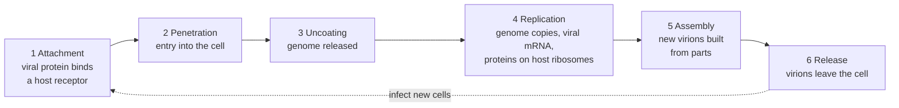

---
aliases:
  - Viruses
  - Virion
  - Viral Particle
  - Virus (biologie)
tags:
  - type/concept
  - domain/biology
  - domain/bioinformatics
  - level/L1
  - level/L2
  - level/L3
mastery: 0
prerequisites:
  - "[[Cell]]"
  - "[[Nucleic Acid]]"
  - "[[Central Dogma]]"
  - "[[Microorganism]]"
related:
  - "[[Bacteriophage]]"
  - "[[Baltimore Classification]]"
  - "[[Reverse Transcription]]"
  - "[[Pathogen]]"
  - "[[Poisson Distribution]]"
  - "[[Metagenomics]]"
  - "[[Horizontal Gene Transfer]]"
projects: []
sources:
  - "[[Biology 2e (OpenStax)]]"
  - "[[Microbiology (OpenStax)]]"
  - "[[Molecular Biology of the Cell (Alberts)]]"
  - "[[Sanger 1977 - DNA Sequencing with Chain-Terminating Inhibitors]]"
---

# Virus

> [!abstract]
> A virus is a genome wrapped in a protein shell, sometimes inside a borrowed membrane, that can only multiply by taking over a living cell: it has no metabolism and no ribosomes of its own, so it is not a cell.

## Definition

A **virus** is an acellular infectious agent that replicates only inside a host cell, using the cell's machinery.[^osvir][^m13] A complete viral particle, the **virion**, consists of a nucleic acid genome (DNA or RNA), a protein coat called the **capsid**, and in some viruses an outer **envelope** of protein and phospholipid membrane derived from the host cell.[^os211]

## Why it matters

- **Genome type sets the analysis route.** Viral genomes can be DNA or RNA, single- or double-stranded.[^os211] Sequencing reads DNA,[^sanger] so an RNA genome is first copied into DNA ([[Reverse Transcription]]),[^alberts] the same step that [[RNA Sequencing]] uses.
- **Viral genomes opened the sequencing era.** The chain-termination method was demonstrated on the DNA of bacteriophage φX174 ([[Sanger Sequencing]]).[^sanger]
- **Invisible to rRNA surveys.** Without ribosomes of their own,[^osvir] viruses carry no rRNA gene, so [[16S Ribosomal RNA]] surveys miss them; they are found in [[Metagenomics]] data by other features of their sequences.
- **Viruses write into genomes.** Retroviruses copy their RNA genome into DNA that is inserted into a host chromosome,[^alberts] so viral sequences can appear inside host genome data ([[Horizontal Gene Transfer]]).

## Core (L1)

### Structure

| Part[^os211][^os212] | Made of | Present in |
|---|---|---|
| Genome | DNA or RNA, single- or double-stranded | every virus |
| Capsid | protein subunits (capsomeres) | every virus |
| Envelope | host-derived lipid membrane with viral glycoproteins | enveloped viruses only |

By shape, viruses are **filamentous** (long cylinders, such as tobacco mosaic virus), **isometric** (roughly spherical, such as poliovirus or herpesviruses), **enveloped** (such as HIV) or **head-and-tail** (many bacteriophages).[^os211] A typical virus measures about 100 nm, ten times smaller than a typical bacterium,[^m13] below the 0.2 µm resolution of light microscopes: viruses are imaged by electron microscopy ([[Microscopy]]).[^alberts-mic]

### The replication cycle



Most productive infections follow these six steps.[^os212] Attachment is specific: the match between viral attachment proteins and host receptors decides which hosts, and which cells within a host, a virus can infect.[^os212]

### Why a virus is not a cell

| Property of cells ([[Cell]]) | Virus |
|---|---|
| Plasma membrane enclosing a cytoplasm | none; an envelope, when present, is borrowed from the host[^os211] |
| Own metabolism | none[^osvir] |
| Ribosomes, protein synthesis | uses the host's[^osvir] |
| Division of a parent cell | none: new virions are assembled from separately made parts[^os212] |

## Deeper (L2)

### Genomes and the Baltimore classification (preview)

The most widely used classification, the **Baltimore classification**, groups viruses by how they produce their mRNA, which follows from the type of genome.[^os211] Full treatment in [[Baltimore Classification]]:

| Group | Genome | Route to mRNA | Example |
|---|---|---|---|
| I | double-stranded DNA | transcription, as in the host | herpes simplex virus |
| II | single-stranded DNA | made double-stranded, then transcribed | canine parvovirus |
| III | double-stranded RNA | transcribed from the RNA genome | rotavirus |
| IV | single-stranded RNA, + sense | the genome itself serves as mRNA | poliovirus |
| V | single-stranded RNA, − sense | mRNA copied from the genome | influenza virus |
| VI | single-stranded RNA, reverse-transcribing | RNA → DNA, integrated, then transcribed | HIV |
| VII | double-stranded DNA, reverse-transcribing | via an RNA intermediate | hepatitis B virus |

"+ sense" means the same sequence as mRNA, "− sense" its complement.[^os211] Copying RNA from an RNA template is a step that host cells do not perform for their own genes, so RNA viruses of groups III to V must bring or encode the enzyme (an RNA-dependent RNA polymerase), and groups VI and VII a reverse transcriptase ([[Central Dogma]]).[^alberts]

**Bacteriophages: lytic and lysogenic.** Viruses of bacteria (**bacteriophages**) either multiply and burst the cell (**lytic cycle**) or insert their genome into the bacterial chromosome and are copied with it until induced (**lysogenic cycle**).[^os212] Phages that carry bacterial DNA between cells are a route of [[Horizontal Gene Transfer]] ([[Bacteriophage]]).

## Advanced (L3)

- **Counting infections.** If virions attach to cells at random and independently, the number of virions per cell follows a [[Poisson Distribution]] (Mathematical representation). Infection experiments choose the virion-to-cell ratio with this model: a low ratio gives mostly single infections, a high ratio infects nearly every cell.

## Mathematical representation

**Random infection.** $V$ virions attach to $C$ cells, each virion independently choosing one cell uniformly. The number $K$ of virions in a given cell is binomial, $K \sim \mathrm{Bin}(V, 1/C)$; for large $C$ with $m = V/C$ fixed it tends to the Poisson distribution

$$P(K = k) = \frac{e^{-m} m^k}{k!}, \qquad k = 0, 1, 2, \dots$$

Fractions of cells: uninfected $P(0) = e^{-m}$; infected $1 - e^{-m}$; infected by exactly one virion $m e^{-m}$; by several $1 - e^{-m} - m e^{-m}$. To infect a fraction $f$ of cells, solve $1 - e^{-m} = f$:

$$m = -\ln(1 - f).$$

**Amplification.** With burst size $b$ (virions released per infected cell), each new virion starting a new cycle and hosts not limiting, $n$ cycles give $N_n = N_0 b^n$, so reaching $N$ virions from one takes $n = \log N / \log b$ cycles: the mathematics of [[Bacterial Growth]] with a much larger factor per generation ([[Exponential Function]], [[Logarithm]]).

## Computational representation

```python
import math
import random

def baltimore_group(nucleic_acid: str, strands: int, sense: str = "",
                    reverse_transcribed: bool = False) -> str:
    """Baltimore group from genome type and replication strategy (preview)."""
    if nucleic_acid == "DNA":
        if reverse_transcribed:
            return "VII"
        return "I" if strands == 2 else "II"
    if strands == 2:
        return "III"
    if reverse_transcribed:
        return "VI"
    return "IV" if sense == "+" else "V"

VIRUSES = {  # name: (nucleic acid, strands, sense, reverse transcription)
    "herpes simplex virus": ("DNA", 2, "", False),
    "canine parvovirus": ("DNA", 1, "", False),
    "rotavirus": ("RNA", 2, "", False),
    "poliovirus": ("RNA", 1, "+", False),
    "influenza virus": ("RNA", 1, "-", False),
    "HIV": ("RNA", 1, "+", True),
    "hepatitis B virus": ("DNA", 2, "", True),
}
for name, genome in VIRUSES.items():
    print(f"{name:22s} {baltimore_group(*genome)}")

def poisson(k: int, m: float) -> float:
    """P(a cell receives k virions) when virions attach at random, mean m per cell."""
    return math.exp(-m) * m ** k / math.factorial(k)

print("m     none   one    several")
for m in (0.1, 1, 3, 5):
    p0, p1 = poisson(0, m), poisson(1, m)
    print(f"{m:<5} {p0:.3f}  {p1:.3f}  {1 - p0 - p1:.3f}")

random.seed(1)                      # simulation: 10,000 virions on 10,000 cells
hits = [0] * 10_000
for _ in range(10_000):
    hits[random.randrange(10_000)] += 1
print(sum(h == 0 for h in hits) / 10_000, round(math.log(100), 2))
```

```text
herpes simplex virus   I
canine parvovirus      II
rotavirus              III
poliovirus             IV
influenza virus        V
HIV                    VI
hepatitis B virus      VII
m     none   one    several
0.1   0.905  0.090  0.005
1     0.368  0.368  0.264
3     0.050  0.149  0.801
5     0.007  0.034  0.960
0.368 4.61
```

The simulation (one virion per cell on average) leaves 36.8% of cells uninfected, as $e^{-1}$ predicts. The last number is the ratio needed to infect 99% of cells.

## Worked example

> [!example] How many virions per cell?
> An experiment needs at least 99% of 10⁶ cultured cells infected.
> 1. **Model**: random attachment, $P(\text{uninfected}) = e^{-m}$.
> 2. **Condition**: $e^{-m} \le 0.01 \Rightarrow m \ge \ln 100 \approx 4.61$, so about $4.6 \times 10^6$ infectious virions.
> 3. **Cost**: at $m = 4.61$, most infected cells carry several virions ($1 - e^{-m} - m e^{-m} \approx 0.94$).
> 4. **Alternative**: at $m = 1$, only 63.2% of cells are infected: 36.8% of all cells by exactly one virion, 26.4% by several. Single infection and full coverage cannot both be had: the model forces a choice.

## Common misconceptions

> [!warning] "Viruses are very small bacteria"
> Bacteria are cells with metabolism and ribosomes; viruses have neither and multiply only inside a host cell.[^osvir]

> [!warning] "The envelope is made by the virus"
> The envelope's membrane comes from the host cell; the virus contributes the glycoproteins embedded in it.[^os211][^os212]

> [!warning] "A virus reproduces by dividing"
> New virions are assembled from genomes and proteins made separately in the infected cell.[^os212]

## Exercises

> [!question] Exercise 1 (L1)
> Put in order: assembly, attachment, release, uncoating, penetration, replication. Which step determines the host range, and why?

> [!success]- Solution
> Attachment, penetration, uncoating, replication, assembly, release. Attachment determines host range: a virus can only enter cells whose surface receptors its attachment proteins recognize.[^os212]

> [!question] Exercise 2 (L2)
> Give the Baltimore group of: (a) a single-stranded + sense RNA genome copied into DNA by a reverse transcriptase; (b) a single-stranded − sense RNA genome; (c) a double-stranded DNA genome. Which of the three can be sequenced without a reverse transcription step?

> [!success]- Solution
> (a) VI (like HIV); (b) V (like influenza virus); (c) I. Only (c) is DNA: (a) and (b) are RNA genomes and must first be copied into DNA (cDNA) to be sequenced as DNA.

> [!question] Exercise 3 (L3, Python)
> Using `poisson` from the code above, find the virion-to-cell ratio that infects 95% of cells, and, at $m = 0.1$, the fraction of infected cells that received exactly one virion. Why do experiments that need one viral genome per cell use a low ratio?

> [!success]- Solution
> ```python
> m95 = math.log(20)                          # 1 - e^(-m) = 0.95  =>  m = ln 20
> print(round(m95, 2), round(1 - poisson(0, m95), 3))
> infected = 1 - poisson(0, 0.1)
> print(round(poisson(1, 0.1) / infected, 3))
> ```
> ```text
> 3.0 0.95
> 0.951
> ```
> $m = \ln 20 \approx 3.0$. At $m = 0.1$, 95.1% of infected cells carry exactly one virion, so each infected cell is likely to reflect a single viral genome, at the price of leaving about 90% of cells uninfected.

> [!question] Exercise 4 (L3)
> A virus releases $b = 100$ virions per infected cell (invented value). With unlimited host cells, how many cycles take one virion to at least $10^8$ virions? What stops this in reality?

> [!success]- Solution
> $n = \log 10^8 / \log 100 = 8 / 2 = 4$ cycles ($100^4 = 10^8$). Growth stops when uninfected host cells run out, as resources stop [[Bacterial Growth]]: the exponential holds only while its input is unlimited.

## Mastery checklist

- [ ] 1 Recognized: I can name the parts of a virion, the six steps of infection, and why a virus is not a cell.
- [ ] 2 Understood: I can explain host range, the envelope's origin, lytic versus lysogenic cycles, and the Baltimore logic.
- [ ] 3 Practiced: I can assign Baltimore groups and compute infection fractions with the Poisson model.
- [ ] 4 Applied: I chose a sequencing route (with or without reverse transcription) for a real viral genome from its Baltimore group.
- [ ] 5 Explained: I can teach why viruses escape rRNA surveys, how retroviruses leave sequences in host genomes, and the limits of the random-infection model.

## References

[^os211]: [[Biology 2e (OpenStax)]], section 21.1 "Viral Evolution, Morphology, and Classification" (virion: nucleic acid, capsid of capsomeres, host-derived envelope; filamentous, isometric, enveloped and head-and-tail viruses; DNA and RNA genomes; the Baltimore classification by mode of mRNA production).
[^os212]: [[Biology 2e (OpenStax)]], section 21.2 "Virus Infections and Hosts" (attachment, penetration, uncoating, replication, assembly, release; receptor specificity and host range; lytic and lysogenic cycles of bacteriophages).
[^osvir]: [[Biology 2e (OpenStax)]], chapter "Viruses" (viruses as acellular entities, without a metabolism of their own, that replicate only inside host cells using the host's machinery to make their proteins).
[^m13]: [[Microbiology (OpenStax)]], section 1.3 "Types of Microorganisms" (viruses as acellular microorganisms; typical virus about 100 nm, typical bacterium about 1 µm).
[^alberts-mic]: [[Molecular Biology of the Cell (Alberts)]], 4th ed. (2002), treatment of microscopy (0.2 µm resolution limit of light microscopes).
[^alberts]: [[Molecular Biology of the Cell (Alberts)]], 4th ed. (2002), treatment of viruses and retroviruses (RNA-dependent RNA polymerases, reverse transcriptase, integration of retroviral DNA into the host chromosome).
[^sanger]: [[Sanger 1977 - DNA Sequencing with Chain-Terminating Inhibitors]], *PNAS* 74:5463-5467.
