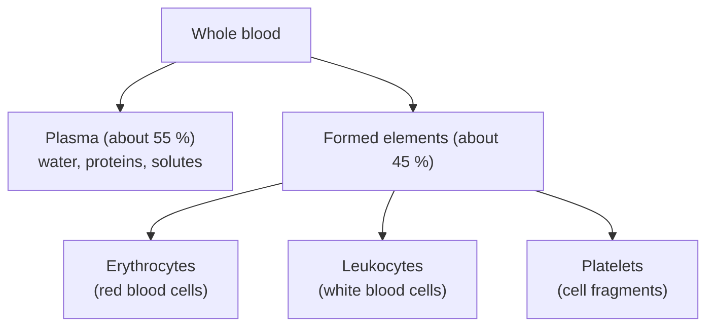

---
aliases:
  - Sang
  - Whole Blood
  - Complete Blood Count
  - CBC
tags:
  - type/concept
  - domain/biology
  - domain/bioinformatics
  - level/L1
  - level/L2
  - level/L3
mastery: 0
prerequisites:
  - "[[Tissue]]"
  - "[[Homeostasis]]"
  - "[[Cell]]"
related:
  - "[[Hematopoiesis]]"
  - "[[Immune System]]"
  - "[[Lymphocyte]]"
  - "[[Cell-Type Deconvolution]]"
  - "[[Flow Cytometry]]"
projects: []
sources:
  - "[[Anatomy and Physiology 2e (OpenStax)]]"
  - "[[Abbas 2009 - Deconvolution of Blood Microarray Data Identifies Cellular Activation Patterns in Systemic Lupus Erythematosus]]"
  - "[[ClinVar]]"
---

# Blood

> [!abstract]
> Blood is a fluid tissue made of cells and cell fragments floating in plasma; it carries gases, nutrients, hormones and immune cells, and a routine blood count measures how many of each cell type it contains.

## Definition

**Blood** is a fluid connective tissue made of **formed elements** (erythrocytes, leukocytes and platelets) suspended in a liquid extracellular matrix, the **plasma**. It transports nutrients, gases and wastes, defends the body against infection, and helps regulate pH, temperature and other internal conditions.[^ap18]

## Why it matters

- **The most sampled human tissue.** Clinical lab values, genotyping DNA, blood transcriptomes, and plasma or serum for [[Proteomics]] and [[Metabolomics]] all start from a blood draw.
- **Where genomic DNA comes from.** Mature erythrocytes and platelets have no nucleus,[^ap18] so genomic DNA extracted from blood comes from the leukocytes.
- **Bulk blood is a mixture.** A blood expression profile sums the contributions of its cell types; Abbas et al. showed that it can be deconvolved into immune cell-type contributions, and used this to find cell-type-specific activation in lupus ([[Cell-Type Deconvolution]]).[^abbas]
- **Cells defined by markers.** Blood cell types are distinguished by surface proteins and expression profiles, the basis of [[Flow Cytometry]], [[Single-Cell RNA Sequencing]] and [[Cell Type Annotation]] ([[Immune System]]).

## Core (L1)

**Composition.** In a centrifuged tube, blood separates into three layers: plasma on top (about 55 % of the volume), a thin "buffy coat" of leukocytes and platelets (less than 1 %), and packed erythrocytes at the bottom (about 45 %). The erythrocyte fraction is the **hematocrit**.[^ap18]

**Plasma** is more than 90 % water; the rest is mostly plasma proteins (albumin, globulins, fibrinogen) plus glucose, lipids, electrolytes and dissolved gases.[^ap18] **Serum** is the fluid left after blood has clotted: plasma without its clotting proteins.[^ap]



| Formed element | Structure | Main role[^ap18] |
|---|---|---|
| Erythrocyte | Biconcave disc, no nucleus, filled with hemoglobin | Carries oxygen (and some carbon dioxide) |
| Neutrophil | Granulocyte with a lobed nucleus | Phagocytosis of bacteria; first responder |
| Eosinophil | Granulocyte | Defense against parasites; allergy |
| Basophil | Granulocyte | Releases histamine in inflammation |
| Monocyte | Agranulocyte | Becomes a macrophage in tissues |
| Lymphocyte | Agranulocyte | Specific (adaptive) immunity: B, T and NK cells ([[Lymphocyte]]) |
| Platelet | Fragment of a megakaryocyte, no nucleus | Clotting |

Neutrophils are the most common leukocytes (50 to 70 % of them) and basophils the rarest (under 1 %).[^ap18] All formed elements derive from hematopoietic stem cells in the red bone marrow ([[Hematopoiesis]]).[^ap18]

**What a routine blood count measures.** A complete blood count (CBC) reports the erythrocyte, leukocyte and platelet counts per volume of blood, the hemoglobin concentration and the hematocrit, the red-cell indices computed from them (MCV, mean cell volume; MCH, mean hemoglobin per cell; MCHC, mean hemoglobin concentration inside red cells), and often a **differential** giving the share of each leukocyte type.[^ap]

## Deeper (L2)

- **Reading the indices.** A low hemoglobin concentration defines anemia; the indices help classify its cause, for example small red cells (low MCV) in iron deficiency.[^ap]
- **Relative versus absolute counts.** A differential is a set of percentages that sum to 100: if lymphocytes fall, the neutrophil percentage rises even if the number of neutrophils does not. Interpret absolute counts (see Worked example).
- **Blood groups.** Erythrocytes carry surface antigens (ABO, Rh), and plasma can contain antibodies against the antigens a person lacks, which is why transfusions must be matched.[^ap18] The ABO alleles are a classic case of codominance ([[Dominance]]).
- **One base, one disease.** The sickle-cell allele of the β-globin gene *HBB* (ClinVar variation 15333) is a single missense change; heterozygotes have sickle-cell trait, homozygotes sickle-cell anemia ([[Missense Mutation]]).[^clinvar] The altered hemoglobin deforms erythrocytes into a sickle shape.[^ap]

## Advanced (L3)

- **Deconvolution.** Writing a bulk profile as a weighted sum of cell-type profiles turns composition estimation into a linear system; Abbas et al. validated this on blood samples and on mixtures of immune cell lines.[^abbas] Single-cell references have since made the signature matrices richer ([[Cell-Type Deconvolution]]).
- **Plasma or serum?** Clotting removes fibrinogen and other clotting proteins from serum, so proteomic and metabolomic results depend on which fluid was collected; record it in the metadata.
- **Reference intervals and multiplicity.** Each analyte is compared with an interval; the more analytes in a panel, the more likely at least one healthy value falls outside by chance (Exercise 4, [[Hypothesis Testing]]).

## Mathematical representation

Let $V_b$ be a blood volume, $V_r$ the volume of its erythrocytes, $N_r$ the erythrocyte count per litre, $[\mathrm{Hb}]$ the hemoglobin concentration (g/L) and $N_w$ the leukocyte count per litre.

- Hematocrit: $H = V_r / V_b$ (dimensionless).
- Mean cell volume: $\mathrm{MCV} = H / N_r$ (litres per cell; $\times 10^{15}$ for fL).
- Mean cell hemoglobin: $\mathrm{MCH} = [\mathrm{Hb}] / N_r$ (grams per cell; $\times 10^{12}$ for pg).
- Mean cell hemoglobin concentration: $\mathrm{MCHC} = [\mathrm{Hb}] / H = \mathrm{MCH}/\mathrm{MCV}$.
- Absolute count of leukocyte type $i$ with differential fraction $p_i$ ($\sum_i p_i = 1$): $N_i = p_i N_w$.
- Units: $1\ \mu\mathrm{L} = 10^{-6}$ L, so $10^9/\mathrm{L} = 10^3/\mu\mathrm{L}$.
- Mixture: for genes $g$ and cell types $c$, bulk expression $b_g = \sum_c S_{gc} f_c$, i.e. $\mathbf{b} = S\mathbf{f}$ with signature matrix $S$ and fractions $\mathbf{f}$ ([[System of Linear Equations]]).

## Computational representation

```python
# Invented complete blood count of one hypothetical adult, SI units
cbc = {
    "rbc_per_L": 5.0e12,    # erythrocyte count
    "hb_g_per_L": 150.0,    # hemoglobin concentration
    "hct": 0.45,            # hematocrit: fraction of blood volume occupied by erythrocytes
    "wbc_per_L": 7.0e9,     # leukocyte count
    "plt_per_L": 250e9,     # platelet count
}
differential = {"neutrophil": 0.60, "lymphocyte": 0.30, "monocyte": 0.06,
                "eosinophil": 0.03, "basophil": 0.01}   # fractions of leukocytes (invented)

mcv_fL = cbc["hct"] / cbc["rbc_per_L"] * 1e15          # litres per cell -> femtolitres
mch_pg = cbc["hb_g_per_L"] / cbc["rbc_per_L"] * 1e12   # grams per cell -> picograms
mchc = cbc["hb_g_per_L"] / cbc["hct"]                  # g of hemoglobin per L of erythrocytes
print(f"MCV {mcv_fL:.0f} fL, MCH {mch_pg:.0f} pg, MCHC {mchc:.0f} g/L")

assert abs(sum(differential.values()) - 1) < 1e-9
for cell, frac in differential.items():
    per_L = frac * cbc["wbc_per_L"]
    print(f"{cell:<10} {per_L / 1e9:5.2f} x 10^9/L = {per_L * 1e-6:5.0f} per uL")
```

```text
MCV 90 fL, MCH 30 pg, MCHC 333 g/L
neutrophil  4.20 x 10^9/L =  4200 per uL
lymphocyte  2.10 x 10^9/L =  2100 per uL
monocyte    0.42 x 10^9/L =   420 per uL
eosinophil  0.21 x 10^9/L =   210 per uL
basophil    0.07 x 10^9/L =    70 per uL
```

## Worked example

> [!example] Relative versus absolute counts (invented values)
> 1. Sample A: leukocytes $7.0 	imes 10^9$/L with 60 % neutrophils, so $0.60 	imes 7.0 = 4.2 	imes 10^9$ neutrophils/L.
> 2. Sample B: $3.5 	imes 10^9$/L with 80 % neutrophils, so $0.80 	imes 3.5 = 2.8 	imes 10^9$/L.
> 3. B has the higher percentage but fewer neutrophils: its other leukocytes fell from $2.8$ to $0.7 	imes 10^9$/L.
> 4. Rule: convert every differential to absolute counts before comparing samples.

## Common misconceptions

> [!warning] "Red blood cells give the DNA in a blood sample"
> Mature erythrocytes have no nucleus; the genomic DNA comes from leukocytes.

> [!warning] "A higher percentage means more cells"
> Differential percentages are relative: compute absolute counts before concluding that a cell type increased.

## Exercises

> [!question] Exercise 1 (L1)
> Name the formed element that: (a) carries oxygen; (b) is the most common leukocyte; (c) is a cell fragment involved in clotting; (d) becomes a macrophage in tissues.

> [!success]- Solution
> (a) erythrocyte; (b) neutrophil; (c) platelet; (d) monocyte.

> [!question] Exercise 2 (L2)
> Compute MCV, MCH and MCHC for $N_r = 4.0 \times 10^{12}$/L, $[\mathrm{Hb}] = 100$ g/L, $H = 0.30$ (invented). How do the cells compare with the code example?

> [!success]- Solution
> MCV $= 0.30 / 4.0 \times 10^{12} = 7.5 \times 10^{-14}$ L $= 75$ fL; MCH $= 100 / 4.0 \times 10^{12} = 25$ pg; MCHC $= 100 / 0.30 \approx 333$ g/L. The cells are smaller (75 vs 90 fL) and carry less hemoglobin each, at the same concentration inside the cell; with low hemoglobin, this pattern points to an anemia with small red cells.

> [!question] Exercise 3 (L3, Python)
> Two marker genes have the invented signature (neutrophil, lymphocyte): gene 1 = (100, 5), gene 2 = (2, 80). A two-cell-type mixture reads (71.5, 25.4). Solve $\mathbf{b} = S\mathbf{f}$ for the fractions.

> [!success]- Solution
> ```python
> S = [[100.0, 5.0], [2.0, 80.0]]
> bulk = [71.5, 25.4]
> det = S[0][0] * S[1][1] - S[0][1] * S[1][0]
> f_neu = (bulk[0] * S[1][1] - S[0][1] * bulk[1]) / det
> f_lym = (S[0][0] * bulk[1] - S[1][0] * bulk[0]) / det
> print(round(f_neu, 3), round(f_lym, 3))   # 0.7 0.3
> ```
>
> Cramer's rule gives 70 % neutrophil and 30 % lymphocyte signal. Real deconvolution uses many genes and least squares with non-negative fractions, but the principle is this linear system.[^abbas]

> [!question] Exercise 4 (L3)
> Suppose each of 20 independent analytes uses a reference interval containing 95 % of healthy values. What is the probability that a healthy person has at least one value flagged?

> [!success]- Solution
> $1 - 0.95^{20} \approx 1 - 0.358 = 0.64$. Most healthy people get at least one flag on a large panel: an isolated, mild out-of-range value is weak evidence, the same multiplicity problem as in [[Hypothesis Testing]].

## Mastery checklist

- [ ] 1 Recognized: I can name the components of blood and the main leukocyte types.
- [ ] 2 Understood: I can explain the role of each formed element and what each CBC measurement means.
- [ ] 3 Practiced: I can compute red-cell indices and absolute counts and convert units in Python.
- [ ] 4 Applied: I can read a real CBC report and a blood expression dataset, accounting for composition.
- [ ] 5 Explained: I can teach why bulk blood data need deconvolution, why percentages mislead, and why large panels produce false flags.

## References

[^ap18]: [[Anatomy and Physiology 2e (OpenStax)]], ch. 18 "The Cardiovascular System: Blood" (functions and composition of blood, plasma, formed elements, leukocyte types, blood groups).
[^ap]: [[Anatomy and Physiology 2e (OpenStax)]] (serum, the complete blood count, anemia and sickle-cell disease).
[^abbas]: [[Abbas 2009 - Deconvolution of Blood Microarray Data Identifies Cellular Activation Patterns in Systemic Lupus Erythematosus]], *PLoS ONE* 4(7):e6098.
[^clinvar]: [[ClinVar]], variation 15333, `NM_000518.5(HBB):c.20A>T (p.Glu7Val)`.
