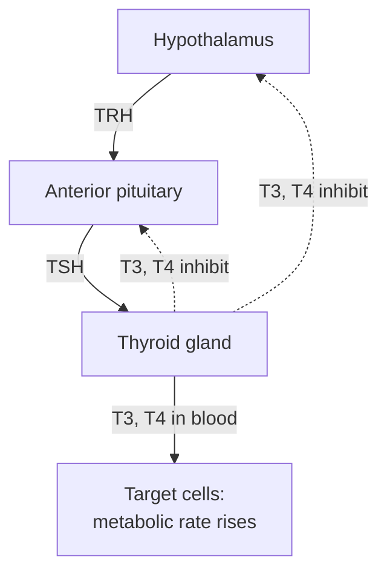

---
aliases:
  - Système endocrinien
  - Hormone
  - Endocrine Gland
tags:
  - type/concept
  - domain/biology
  - domain/mathematics
  - level/L1
  - level/L2
  - level/L3
mastery: 0
prerequisites:
  - "[[Homeostasis]]"
  - "[[Cell Signaling]]"
  - "[[Gene Expression]]"
related:
  - "[[Nervous System]]"
  - "[[Transcription Factor]]"
  - "[[Compartmental Model]]"
projects: []
sources:
  - "[[Anatomy and Physiology 2e (OpenStax)]]"
  - "[[Biology 2e (OpenStax)]]"
  - "[[Molecular Biology of the Cell (Alberts)]]"
---

# Endocrine System

> [!abstract]
> The endocrine system controls the body with hormones: chemical messages released into the blood by glands, read only by the distant cells that carry a matching receptor, and kept in range by feedback loops.

## Definition

The **endocrine system** is the set of glands and secretory cells that release **hormones** into the blood. A hormone is a long-range chemical signal ([[Cell Signaling]]) carried by the blood to distant **target cells**, which respond only if they express a receptor for it.[^ap][^alberts][^bio7] Endocrine glands are ductless; exocrine glands, by contrast, release their products through ducts onto a surface (sweat, digestive enzymes).[^ap]

## Why it matters

- **Clinical hormone values come in loops.** A hormone level is meaningful only next to the signal that controls it (TSH with thyroid hormone, insulin with glucose); feedback logic is the key to reading them ([[Homeostasis]]).
- **Hormones change gene expression.** Steroid and thyroid hormone receptors are [[Transcription Factor|transcription factors]]: a hormone exposure leaves a transcriptional signature in RNA-seq data, and receptor binding sites can be mapped with [[ChIP-Seq]].[^alberts]
- **Cell-type-specific genes.** Hormone genes are textbook cases of restricted expression: insulin is made by the beta cells of the pancreatic islets ([[Tissue]]).[^ap]

## Core (L1)

**Three chemical classes.**[^ap]

| Class | Examples | Solubility | Receptor |
|---|---|---|---|
| Amino acid-derived (amines) | Epinephrine, thyroid hormones (T3, T4), melatonin | Mostly water-soluble (thyroid hormones: lipid-soluble) | Cell surface (thyroid hormones: inside the cell) |
| Peptide and protein | Insulin, glucagon, growth hormone, ADH | Water-soluble | Cell surface |
| Lipid-derived (steroids) | Cortisol, aldosterone, testosterone, estrogens | Lipid-soluble | Inside the cell |

Lipid-soluble hormones cross the plasma membrane and bind intracellular receptors that regulate transcription; water-soluble hormones bind surface receptors that trigger second messengers such as cyclic AMP inside the cell.[^ap][^alberts]

**Main glands.**[^ap]

| Gland | Main hormones | Main effects |
|---|---|---|
| Hypothalamus | Releasing and inhibiting hormones (TRH, CRH, ...) | Controls the anterior pituitary |
| Pituitary, anterior | TSH, ACTH, GH, FSH, LH, prolactin | Controls thyroid, adrenal cortex, gonads; growth; milk |
| Pituitary, posterior | ADH, oxytocin (made in the hypothalamus) | Water retention; uterine contraction, milk release |
| Thyroid | T3, T4; calcitonin | Metabolic rate; calcium |
| Parathyroids | Parathyroid hormone (PTH) | Raises blood calcium |
| Adrenal cortex | Cortisol, aldosterone | Stress response, glucose; sodium and water balance |
| Adrenal medulla | Epinephrine, norepinephrine | Fight-or-flight response |
| Pancreatic islets | Insulin (beta cells), glucagon (alpha cells) | Lower and raise blood glucose |
| Gonads | Testosterone; estrogens, progesterone | Reproduction, secondary sex characteristics |
| Pineal gland | Melatonin | Sleep-wake cycle |

**Feedback axes.** Many hormones are controlled by a three-level cascade with negative feedback from the final hormone to the levels above it:[^ap]



The adrenal axis has the same shape: CRH → ACTH → cortisol, and cortisol inhibits CRH and ACTH release.[^ap]

## Deeper (L2)

- **The hypothalamus connects the two control systems.** It receives nervous input and controls the pituitary by hormones; posterior pituitary hormones are made by hypothalamic neurons ([[Nervous System]]).[^ap]
- **Same hormone, different responses.** The response depends on the receptor and signaling machinery of each target cell, so one hormone can act differently in different tissues; a cell that does not express the receptor ignores the hormone ([[Gene Expression]]).[^alberts]
- **Disorders** are excess or deficiency of a hormone, or of the response to it: diabetes mellitus is a lack of insulin (type 1) or of response to it (type 2).[^ap]

## Advanced (L3)

- **Kinetics shapes control.** A hormone with a short half-life lets its level follow secretion quickly; a long half-life smooths it. The feedback model below shows a second property: feedback **buffers** the hormone level against changes in its clearance.
- **Genomics of hormone action.** Nuclear receptors bind specific DNA sequences and regulate target genes; this links endocrinology to [[Sequence Motif|motif]] analysis and [[Gene Regulation]].[^alberts]

## Mathematical representation

Let $C(t)$ be the plasma concentration of a hormone, $V$ its distribution volume, $S$ the secretion rate (amount per time) and $k$ the clearance rate constant. A **one-compartment model** is

$$\frac{dC}{dt} = \frac{S}{V} - k\,C.$$

With constant $S$, $C$ approaches the steady state $C^* = S/(Vk)$ exponentially, with half-life $t_{1/2} = \ln 2 / k$.

**Negative feedback on secretion.** Let secretion fall as the hormone rises, $S(C) = S_{\max}/(1 + C/K)$, with $K$ the concentration that halves secretion. The steady state solves $S_{\max}/(1 + C^*/K) = V k C^*$. Implicit differentiation gives the sensitivity of the level to clearance:

$$\frac{\partial \ln C^*}{\partial \ln k} = -\,\frac{1 + C^*/K}{1 + 2C^*/K} \in \Big(-1, -\tfrac{1}{2}\Big].$$

Without feedback the sensitivity is $-1$ (doubling clearance halves the level); with feedback its magnitude is always smaller.

## Computational representation

```python
import math
S_MAX, K, V = 10.0, 1.0, 1.0   # invented: maximal secretion rate, feedback constant, volume


def bisect(f, lo, hi, tol=1e-10):
    """Root of f in [lo, hi], assuming a sign change."""
    while hi - lo > tol:
        mid = (lo + hi) / 2
        if f(lo) * f(mid) <= 0:
            hi = mid
        else:
            lo = mid
    return (lo + hi) / 2

def closed_loop(k):
    """Steady state of dC/dt = S(C)/V - k C with S(C) = S_MAX / (1 + C/K)."""
    return bisect(lambda c: S_MAX / (1 + c / K) - V * k * c, 0.0, 100.0)


c_base = closed_loop(1.0)
s_base = S_MAX / (1 + c_base / K)   # secretion rate at baseline
for k in (1.0, 2.0):
    print(f"k={k}: half-life {math.log(2) / k:.2f}, "
          f"fixed secretion C*={s_base / (V * k):.2f}, with feedback C*={closed_loop(k):.2f}")
```

```text
k=1.0: half-life 0.69, fixed secretion C*=2.70, with feedback C*=2.70
k=2.0: half-life 0.35, fixed secretion C*=1.35, with feedback C*=1.79
```

## Worked example

> [!example] Predicting the thyroid axis with the loop model
> 1. **Thyroid failure**: T3 and T4 fall. Less negative feedback reaches the hypothalamus and pituitary, so TRH and TSH **rise**. Prediction: low T4, high TSH.
> 2. **Pituitary failure**: TSH falls, so the thyroid is under-stimulated. Prediction: low TSH, low T4.
> 3. **Excess T4 taken as a pill**: high T4 suppresses TRH and TSH. Prediction: high T4, low TSH. The pair (TSH, T4) separates the three cases; one value could not.

## Common misconceptions

> [!warning] "A hormone acts on every cell it reaches"
> It reaches almost every cell through the blood, but only cells expressing its receptor respond.

> [!warning] "A high hormone level means an overactive gland"
> It can mean the opposite: a failing target gland removes feedback, so the controlling hormone (such as TSH) rises.

## Exercises

> [!question] Exercise 1 (L1)
> Give the gland that secretes: (a) insulin; (b) cortisol; (c) TSH; (d) melatonin; (e) parathyroid hormone.

> [!success]- Solution
> (a) pancreatic islets (beta cells); (b) adrenal cortex; (c) anterior pituitary; (d) pineal gland; (e) parathyroid glands.

> [!question] Exercise 2 (L2)
> Using the adrenal axis (CRH → ACTH → cortisol, with cortisol inhibiting CRH and ACTH), predict ACTH and cortisol when (a) the adrenal cortex fails; (b) a patient takes high doses of a cortisol-like drug.

> [!success]- Solution
> (a) Cortisol falls, feedback weakens, ACTH rises: low cortisol, high ACTH. (b) The drug acts like cortisol on the hypothalamus and pituitary, so CRH and ACTH fall and the patient's own adrenal cortex is under-stimulated: low ACTH, low endogenous cortisol.

> [!question] Exercise 3 (L3, Python)
> With `closed_loop`, `s_base`, `V` and `K` from the code above, compare the steady state with and without feedback for $k = 1, 2, 4$, and check the sensitivity formula at each point.

> [!success]- Solution
> ```python
> for k in (1.0, 2.0, 4.0):
>     c = closed_loop(k)
>     print(f"k={k}: fixed secretion {s_base / (V * k):.2f}, with feedback {c:.2f}, "
>           f"sensitivity {-(1 + c / K) / (1 + 2 * c / K):.2f}")
> # k=1.0: fixed secretion 2.70, with feedback 2.70, sensitivity -0.58
> # k=2.0: fixed secretion 1.35, with feedback 1.79, sensitivity -0.61
> # k=4.0: fixed secretion 0.68, with feedback 1.16, sensitivity -0.65
> ```
>
> Quadrupling clearance divides the level by 4 without feedback but only by about 2.3 with it. The sensitivity moves toward $-1$ as $C^*/K$ falls: feedback buffers best when the hormone sits well above $K$, where secretion responds strongly.

## Mastery checklist

- [ ] 1 Recognized: I can define a hormone and name the main glands and their hormones.
- [ ] 2 Understood: I can explain the three hormone classes, where their receptors are, and how a feedback axis works.
- [ ] 3 Practiced: I can solve the one-compartment model, compute half-lives and simulate feedback on secretion.
- [ ] 4 Applied: I can interpret paired hormone measurements and hormone-response signatures in expression data.
- [ ] 5 Explained: I can teach why feedback buffers hormone levels and how axis measurements localize a failure.

## References

[^ap]: [[Anatomy and Physiology 2e (OpenStax)]], endocrine system chapter: hormones and their classes, the hypothalamus and pituitary, thyroid, parathyroid, adrenal and pineal glands, gonads, the endocrine pancreas and diabetes.
[^bio7]: [[Biology 2e (OpenStax)]], Unit 7 "Animal Structure and Function".
[^alberts]: [[Molecular Biology of the Cell (Alberts)]], 4th ed. (2002), treatment of forms of intercellular signaling, nuclear receptors, cell-surface receptors and second messengers.
