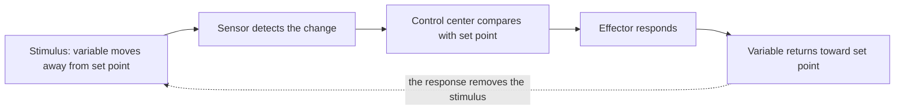

---
aliases:
  - Homéostasie
  - Homeostatic Control
  - Physiological Regulation
tags:
  - type/concept
  - domain/biology
  - domain/mathematics
  - level/L1
  - level/L2
  - level/L3
mastery: 0
prerequisites:
  - "[[Cell]]"
  - "[[Cell Signaling]]"
  - "[[Exponential Function]]"
related:
  - "[[Feedback Loop]]"
  - "[[Organ System]]"
  - "[[Nervous System]]"
  - "[[Endocrine System]]"
  - "[[Blood]]"
  - "[[Ordinary Differential Equation]]"
  - "[[Fixed Point]]"
projects: []
sources:
  - "[[Anatomy and Physiology 2e (OpenStax)]]"
  - "[[Biology 2e (OpenStax)]]"
  - "[[MIT 8.591J - Systems Biology]]"
  - "[[Nonlinear Dynamics and Chaos (Strogatz)]]"
---

# Homeostasis

> [!abstract]
> Homeostasis is the body's way of keeping variables such as temperature or blood glucose inside a narrow range, mostly by negative feedback: a deviation triggers a response that cancels it.

## Definition

**Homeostasis** is the maintenance of a relatively stable internal environment. Each regulated variable fluctuates around a **set point** within a **normal range**, and **negative feedback** reverses any deviation from the set point.[^ap15][^bio7]

## Why it matters

- **Clinical values are homeostatic variables.** A blood test reads regulated quantities against their normal range; a value far outside it means a control loop is failing or overwhelmed ([[Blood]]).[^ap15]
- **The same logic works inside cells.** A transcription factor that represses its own gene is negative feedback at the molecular level; systems biology models it with the equations below ([[Feedback Loop]], [[Gene Regulatory Network]]).[^mit]
- **Models.** A set point is a stable [[Fixed Point]] of an [[Ordinary Differential Equation]]; hormone and drug kinetics use the same tools ([[Compartmental Model]]).[^strogatz]

## Core (L1)

A negative feedback loop has three components:[^ap15]

1. a **sensor** (receptor) that monitors the variable and reports to the control center;
2. a **control center** that compares the value with the normal range and activates an effector when the deviation is too large;
3. an **effector** that changes the variable back toward the set point.



**Body temperature.** The set point is about 37 °C.[^ap15] When the body heats up, temperature-sensitive nerve cells in the skin and brain signal the temperature-regulating center in the brain, which activates sweat glands and dilates skin blood vessels so heat is lost; cooling triggers the opposite responses, such as shivering and constriction of skin vessels.[^ap15][^ap]

**Blood glucose.** After a meal, glucose rises; beta cells of the pancreatic islets release **insulin**, which promotes glucose uptake and storage. When glucose falls, alpha cells release **glucagon**, which mobilizes stored glucose from the liver. Two antagonistic hormones push the same variable in opposite directions.[^ap] See [[Endocrine System]].

**Positive feedback** amplifies a change instead of reversing it. It suits processes that must run to completion and then stop, such as childbirth (contractions stimulate oxytocin release, which strengthens contractions) and blood clotting.[^ap15]

| | Negative feedback | Positive feedback |
|---|---|---|
| Response to a deviation | Opposes it | Reinforces it |
| Result | Stability around a set point | Rapid, self-amplifying change |

## Deeper (L2)

- **A range, not a value.** A loop can only correct a deviation after the sensor detects it, so the variable fluctuates within its normal range rather than sitting exactly at the set point.[^ap15]
- **Two controllers.** The nervous system gives fast, brief corrections; hormones act more slowly and for longer. Most variables are under both ([[Nervous System]], [[Endocrine System]]).[^ap]
- **Movable set points.** In fever, the body's temperature set point is raised, so the loop defends a higher value.[^ap]
- **Failure.** Diabetes mellitus is a failure of glucose regulation: too little insulin (type 1) or poor response to it (type 2).[^ap]

## Advanced (L3)

- **Perfect adaptation needs integral feedback.** A loop whose correction is proportional to the current error leaves an offset under a constant load. A loop that also accumulates the error over time returns exactly to the set point (derivation below). This is a mathematical requirement of the linear model, and a reason to look for "memory" in any system that adapts perfectly.
- **Stability.** Negative feedback makes a set point stable when, after linearization, the restoring slope is negative.[^strogatz] With delays or several stages in the loop, the same feedback can overshoot and oscillate (Exercise 3).

## Mathematical representation

Let $x(t)$ be the regulated variable, $x^*$ its set point, $e = x - x^*$ the error, $d$ a constant load (disturbance) and $k > 0$ the feedback gain. **Proportional negative feedback**:

$$\frac{dx}{dt} = d - k\,(x - x^*) \quad\Longrightarrow\quad x(t) = x^* + \frac{d}{k} + \Big(x_0 - x^* - \frac{d}{k}\Big)e^{-kt}.$$

A deviation decays exponentially with half-time $t_{1/2} = \ln 2 / k$, and the steady state keeps an offset $d/k$. **Positive feedback** reverses the sign: $\dot e = +k e$ gives $e(t) = e_0 e^{kt}$, which grows without bound until something else stops it.

**Integral feedback** adds the accumulated error $I(t) = \int_0^t e(s)\,ds$:

$$\frac{de}{dt} = d - k e - k_i I, \qquad \frac{dI}{dt} = e.$$

At a steady state both derivatives vanish; $\dot I = 0$ forces $e = 0$ whatever $d$: zero offset. **Stability**: for $\dot x = f(x)$ with $f(x^*) = 0$, the set point is stable if $f'(x^*) < 0$; here $f'(x^*) = -k$.[^strogatz]

## Computational representation

```python
import math

def simulate(k, d=0.0, ki=0.0, e0=0.0, dt=0.0001, t_end=20.0):
    """Error e = x - x_set at t_end; Euler steps of de/dt = d - k*e - ki*I, dI/dt = e (toy units)."""
    e, integral = e0, 0.0
    for _ in range(round(t_end / dt)):
        e, integral = e + (d - k * e - ki * integral) * dt, integral + e * dt
    return e

k, d = 2.0, 1.0   # invented: gain 2 per hour, heat load 1 degree C per hour
print("proportional offset:", round(simulate(k, d), 4), "theory:", d / k)
print("with integral feedback:", round(simulate(k, d, ki=1.0), 4))
print("half-time ln2/k:", round(math.log(2) / k, 3), "h")
print("positive feedback, e0 = 0.1, after 3 h:", round(simulate(-k, e0=0.1, t_end=3.0), 1),
      "theory:", round(0.1 * math.exp(k * 3.0), 1))
```

```text
proportional offset: 0.5 theory: 0.5
with integral feedback: 0.0
half-time ln2/k: 0.347 h
positive feedback, e0 = 0.1, after 3 h: 40.3 theory: 40.3
```

## Worked example

> [!example] Reading a heat load through the model (invented numbers)
> A body under a sustained heat load $d = 1$ °C/h has a proportional loop with gain $k = 2$ /h.
> 1. **Components.** Sensor: thermosensitive nerve cells; control center: the brain's temperature center; effectors: sweat glands and skin vessels.
> 2. **Offset.** At steady state $0 = d - k e$, so $e = d/k = 0.5$ °C above the set point.
> 3. **Speed.** A deviation halves every $\ln 2 / 2 \approx 0.35$ h.

## Common misconceptions

> [!warning] "Homeostasis means constant values"
> Regulated variables fluctuate within a normal range, and set points themselves can move (fever). Homeostasis is dynamic stability.

> [!warning] "Negative feedback is harmful"
> "Negative" is the sign of the response relative to the deviation, not a judgment. Negative feedback is what keeps variables stable.

## Exercises

> [!question] Exercise 1 (L1)
> A person steps into the cold. Name the sensor, control center and effectors of the response, and say why it is negative feedback. Then classify oxytocin release during labor and insulin release after a meal.

> [!success]- Solution
> Sensors: temperature-sensitive nerve cells in the skin and brain. Control center: the temperature-regulating center in the brain. Effectors: skin blood vessels (constrict, reducing heat loss) and skeletal muscles (shivering, producing heat). The response opposes the fall in temperature, hence negative feedback. Oxytocin during labor is positive feedback (contractions cause more oxytocin, which strengthens contractions); insulin after a meal is negative feedback (it lowers the glucose that triggered it).

> [!question] Exercise 2 (L2)
> In the proportional model with load $d = 1$, compare gains $k = 1, 2, 4$: steady-state offset and half-time. What does doubling the gain do?

> [!success]- Solution
> Offset $d/k$ = 1, 0.5, 0.25; half-time $\ln 2 / k$ = 0.693, 0.347, 0.173. `simulate(gain, d)` from the code above reproduces the offsets (1.0, 0.5, 0.25). Doubling the gain halves both: a stronger loop is faster and more accurate, but never exact while the load persists.

> [!question] Exercise 3 (L3, Python)
> Differentiate the integral-feedback system to get one equation for $e$. With $k = 2$, find for which $k_i$ the error oscillates, then simulate a step load $d = 1$ for $k_i = 1$ and $k_i = 4$ and report the maximum, minimum and final error.

> [!success]- Solution
> Differentiating $\dot e = d - k e - k_i I$ (with $d$ constant) gives $\ddot e + k \dot e + k_i e = 0$, with roots $r = \big(-k \pm \sqrt{k^2 - 4k_i}\big)/2$. The error oscillates when $k^2 < 4k_i$, here $k_i > 1$.
>
> ```python
> def trajectory(k, ki, d=1.0, dt=0.0001, t_end=10.0):
>     e, integral, out = 0.0, 0.0, []
>     for _ in range(round(t_end / dt)):
>         e, integral = e + (d - k * e - ki * integral) * dt, integral + e * dt
>         out.append(e)
>     return out
>
> for ki in (1.0, 4.0):
>     traj = trajectory(2.0, ki)
>     print(f"ki={ki}: max {max(traj):.3f}, min {min(traj):.3f}, final {traj[-1]:.4f}")
> # ki=1.0: max 0.368, min 0.000, final 0.0005
> # ki=4.0: max 0.273, min -0.045, final -0.0000
> ```
>
> With $k_i = 1$ (critically damped, $e = t e^{-t}$) the error rises to $1/e \approx 0.368$ and returns to 0 without crossing it. With $k_i = 4$ the peak is smaller but the error undershoots below zero: stronger integral action buys accuracy at the cost of oscillation.

## Mastery checklist

- [ ] 1 Recognized: I can define homeostasis, set point and normal range, and name the three components of a feedback loop.
- [ ] 2 Understood: I can explain thermoregulation and glucose regulation as negative feedback, and why childbirth and clotting use positive feedback.
- [ ] 3 Practiced: I can solve the proportional model, compute offsets and half-times, and simulate feedback loops in Python.
- [ ] 4 Applied: I can read a set of clinical lab values as the state of control loops, and recognize feedback in a gene network model.
- [ ] 5 Explained: I can teach why proportional feedback leaves an offset, why perfect adaptation requires integral feedback, and how gain trades speed against oscillation.

## References

[^ap15]: [[Anatomy and Physiology 2e (OpenStax)]], section 1.5 "Homeostasis" (set point, normal range, sensor, control center, effector, negative and positive feedback).
[^ap]: [[Anatomy and Physiology 2e (OpenStax)]], treatment of thermoregulation, the endocrine pancreas and diabetes, and nervous versus endocrine control.
[^bio7]: [[Biology 2e (OpenStax)]], Unit 7 "Animal Structure and Function".
[^mit]: [[MIT 8.591J - Systems Biology]], lecture "Autoregulation, Feedback and Bistability".
[^strogatz]: [[Nonlinear Dynamics and Chaos (Strogatz)]], one-dimensional flows: fixed points and linear stability analysis.
