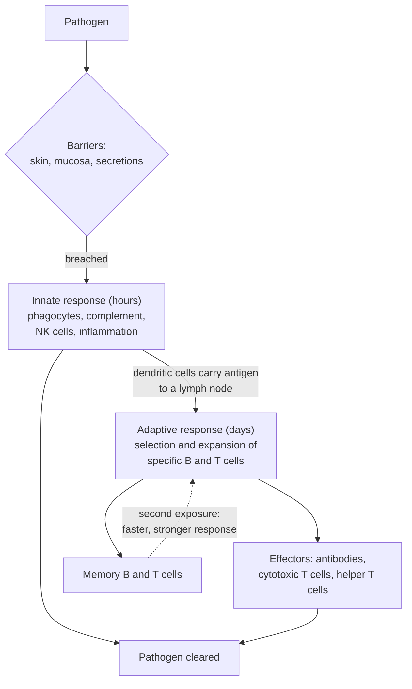

---
aliases:
  - Système immunitaire
  - Immunity
  - Immunité
  - Host Defense
tags:
  - type/concept
  - domain/biology
  - domain/bioinformatics
  - level/L1
  - level/L2
  - level/L3
mastery: 0
prerequisites:
  - "[[Blood]]"
  - "[[Tissue]]"
  - "[[Cell Signaling]]"
related:
  - "[[Innate Immunity]]"
  - "[[Adaptive Immunity]]"
  - "[[Lymphocyte]]"
  - "[[Antibody]]"
  - "[[Major Histocompatibility Complex]]"
  - "[[Immune Repertoire]]"
  - "[[Hematopoiesis]]"
  - "[[Pathogen]]"
  - "[[Flow Cytometry]]"
projects: []
sources:
  - "[[Janeway's Immunobiology (Murphy)]]"
  - "[[Anatomy and Physiology 2e (OpenStax)]]"
  - "[[Biology 2e (OpenStax)]]"
  - "[[Abbas 2009 - Deconvolution of Blood Microarray Data Identifies Cellular Activation Patterns in Systemic Lupus Erythematosus]]"
---

# Immune System

> [!abstract]
> The immune system defends the body in three layers: barriers that keep microbes out, innate defenses that attack any intruder within hours, and adaptive defenses that, over days, build cells and antibodies specific to one pathogen and remember it.

## Definition

The **immune system** is the set of cells, molecules, tissues and organs that protect the body against [[Pathogen|pathogens]] and other threats. It acts in three layers: **physical and chemical barriers**; **innate immunity**, fast and directed at features shared by many microbes; and **adaptive immunity**, slower, specific to individual antigens, and with **memory**.[^jw][^ap][^bio7]

## Why it matters

- **Immune receptors are sequence data.** B and T cell receptors are assembled by somatic recombination of gene segments, so each person carries a vast, individual repertoire that sequencing can read ([[V(D)J Recombination]], [[Immune Repertoire]], [[T Cell Receptor]], [[Antibody]]).[^jw]
- **HLA genes are highly polymorphic.** The MHC molecules that present peptides to T cells vary between people, which matters for transplantation, disease association and neoantigen prediction in cancer immunotherapy ([[Major Histocompatibility Complex]], [[Drug Discovery]]).[^jw]
- **Cell types defined by markers.** Immune cells are classified by surface proteins (CD markers), the basis of [[Flow Cytometry]] and of [[Cell Type Annotation]] in [[Single-Cell RNA Sequencing]] of blood.[^jw]
- **Blood as a readout.** Bulk blood expression mixes immune cell types; Abbas et al. deconvolved it and found expansion and activation of monocytes, NK cells and helper T cells underlying part of the interferon signature in systemic lupus erythematosus ([[Cell-Type Deconvolution]]).[^abbas]
- **Time matters.** Innate and adaptive phases unfold over hours to days, so infection and vaccination studies are time-course designs ([[Experimental Design]]).

## Core (L1)

### Three layers of defense

| Layer | Speed | Main components | Specificity | Memory |
|---|---|---|---|---|
| Barriers | Always present | Skin, mucous membranes, secretions with antimicrobial substances | None | No |
| Innate | Immediate to hours | Phagocytes (neutrophils, macrophages), complement proteins, NK cells, inflammation | Shared microbial features | No |
| Adaptive | Days | B cells and antibodies, helper and cytotoxic T cells | Individual antigens | Yes |

Sources for the table: [^jw][^ap].

In a first infection, the response unfolds in three phases: immediate innate immunity (0 to 4 hours, preformed molecules and resident cells), an early induced innate response (4 to 96 hours, recruitment and activation of effector cells), and the adaptive response (after about 96 hours, once rare antigen-specific lymphocytes have been activated and have multiplied).[^jw]



### Cells

All immune cells derive from hematopoietic stem cells in the bone marrow ([[Hematopoiesis]]) and many circulate as leukocytes in [[Blood]].[^jw][^ap]

| Cell | Defense | Role | Typical marker |
|---|---|---|---|
| Neutrophil | Innate | Most abundant phagocyte; first to arrive | |
| Macrophage (from monocytes) | Innate | Phagocytosis; signals inflammation; presents antigen | CD14 (monocytes) |
| Dendritic cell | Innate → adaptive | Captures antigen and presents it to naive T cells | |
| Mast cell | Innate | Releases histamine; inflammation, allergy | |
| Natural killer (NK) cell | Innate | Kills infected and tumor cells | CD56 |
| B cell | Adaptive | Makes antibodies (as a plasma cell) | CD19 |
| Helper T cell | Adaptive | Coordinates B cells, macrophages and cytotoxic T cells | CD4 |
| Cytotoxic T cell | Adaptive | Kills infected cells | CD8 |

Sources for the table: [^jw][^ap]. See [[Lymphocyte]].

### Organs

- **Primary lymphoid organs**, where lymphocytes develop: the **bone marrow** (B cells) and the **thymus** (T cells).[^jw]
- **Secondary lymphoid organs**, where mature lymphocytes meet antigens: **lymph nodes** (filtering lymph), the **spleen** (filtering blood) and **mucosa-associated lymphoid tissue** such as the tonsils and the Peyer's patches of the gut.[^jw][^ap]
- Lymphatic vessels collect fluid from tissues and carry it, with antigens and cells, through the lymph nodes back to the blood ([[Organ System]]).[^ap]

## Deeper (L2)

**Innate recognition.** Innate cells carry pattern recognition receptors, such as the Toll-like receptors, that detect molecules common to groups of microbes and absent from host cells (for example bacterial cell-wall components).[^jw] **Complement** is a set of plasma proteins that, once activated on a microbial surface, coat it for phagocytosis, attract phagocytes and can perforate its membrane.[^jw] **Inflammation** dilates local vessels and makes them leaky, bringing fluid, proteins and neutrophils to the site: hence redness, heat, swelling and pain.[^ap] See [[Innate Immunity]].

**Adaptive recognition.** Each lymphocyte carries receptors of a single specificity.[^jw]

- B cell receptors and their secreted form, **antibodies**, bind intact antigens ([[Antibody]]).
- T cell receptors bind short **peptides presented by MHC molecules** on cell surfaces ([[T Cell Receptor]]): **MHC class I**, on almost all nucleated cells, presents peptides from inside the cell (such as viral proteins) to **CD8** cytotoxic T cells; **MHC class II**, on antigen-presenting cells, presents peptides from captured material to **CD4** helper T cells ([[Major Histocompatibility Complex]]).

**Clonal selection and memory.** An antigen activates only the rare lymphocytes whose receptor fits it; these proliferate into a clone of effector cells (antibody-secreting plasma cells, effector T cells). Most die once the pathogen is cleared, but some persist as **memory cells**, so a second exposure gives a faster and stronger response. Vaccination exploits this by inducing memory without the disease.[^jw][^ap] See [[Adaptive Immunity]].

**Humoral and cell-mediated immunity.** Antibodies act in body fluids (humoral immunity) against extracellular pathogens and toxins; cytotoxic T cells kill infected cells (cell-mediated immunity), reaching pathogens hidden inside cells.[^ap]

## Advanced (L3)

- **Diversity from a finite genome.** Receptor genes are assembled in each developing lymphocyte by recombining gene segments, with extra diversity added at the junctions; B cells further mutate their receptors during a response. Repertoire sequencing reads these rearranged genes, and clonal expansion appears as many copies of the same sequence ([[V(D)J Recombination]], [[Immune Repertoire]]).[^jw]
- **Tolerance.** Developing lymphocytes that recognize self strongly are eliminated or inactivated; when tolerance fails, the result is autoimmunity, as in systemic lupus erythematosus.[^jw]
- **Failure modes.** Immunodeficiency (too little response), hypersensitivity and allergy (excessive response to harmless antigens) and autoimmunity (response to self) are the three ways the system fails.[^jw]
- **Data layers.** One immune state can be read as cell counts (CBC, flow cytometry), cell states (single-cell RNA-seq), receptor sequences (repertoires), HLA genotypes, and serum antibodies; integrating them is the domain of computational immunology.

## Mathematical representation

The adaptive delay is mostly the time a rare clone needs to multiply. Model a responding clone as growing exponentially with doubling time $\tau$ from $N_0$ precursor cells:

$$N(t) = N_0\, 2^{t/\tau}, \qquad t_{\text{th}} = \tau \log_2 \frac{N_{\text{th}}}{N_0},$$

where $t_{\text{th}}$ is the time to reach an effective size $N_{\text{th}}$. Memory raises $N_0$; multiplying $N_0$ by a factor $m$ shortens the response by $\tau \log_2 m$. This ignores the activation lag, cell death and competition, so it explains the direction of the effect, not its exact size.

## Computational representation

```python
import math


def time_to_threshold(n0, threshold, doubling_h):
    """Hours of exponential expansion for a clone to grow from n0 to threshold cells."""
    return doubling_h * math.log2(threshold / n0)


threshold, doubling = 1e7, 8.0   # invented, illustrative values
for label, n0 in (("primary (naive precursors)", 1e2), ("secondary (memory cells)", 1e4)):
    t = time_to_threshold(n0, threshold, doubling)
    print(f"{label}: {t:.0f} h = {t / 24:.1f} days")
```

```text
primary (naive precursors): 133 h = 5.5 days
secondary (memory cells): 80 h = 3.3 days
```

With these invented numbers, a hundredfold larger starting clone saves about two days, the right order of magnitude to see why a primary adaptive response takes days.

## Worked example

> [!example] A splinter, from minutes to weeks
> 1. **Barrier breached**: bacteria enter through the skin with the splinter.
> 2. **Hours 0 to 4**: complement proteins coat the bacteria; resident macrophages engulf some and release signals.
> 3. **Hours to days**: inflammation brings neutrophils from the blood; the site becomes red, warm and swollen. Most small infections end here.
> 4. **Days**: dendritic cells carry bacterial antigens to the nearest lymph node; matching helper T cells and B cells are selected and multiply; plasma cells secrete antibodies that coat the remaining bacteria.
> 5. **Weeks later**: effector cells die back; memory B and T cells remain, ready for a faster response to the same bacteria.
>
> The phases follow the three-phase timeline of a first infection.[^jw]

## Common misconceptions

> [!warning] "Innate immunity is primitive and unimportant"
> It controls most infections on its own, and adaptive responses need it: dendritic cells and innate signals are what activate naive T cells.

> [!warning] "White blood cells are one cell type"
> "Leukocyte" covers granulocytes, monocytes and the lymphocyte families, with opposite roles in some cases; a total count hides them ([[Blood]]).

> [!warning] "Antibodies kill pathogens directly"
> Antibodies mostly bind and mark: they neutralize, and they recruit complement and phagocytes that do the destruction.

> [!warning] "T cells recognize whole pathogens"
> T cell receptors recognize short peptides presented by MHC molecules, which is why HLA genotype shapes what each person's T cells can see.

## Exercises

> [!question] Exercise 1 (L1)
> Classify each as barrier, innate or adaptive: (a) skin; (b) a neutrophil engulfing bacteria; (c) an antibody against a viral protein; (d) complement; (e) a cytotoxic T cell killing a virus-infected cell; (f) mucus in the airways.

> [!success]- Solution
> (a) barrier; (b) innate; (c) adaptive; (d) innate; (e) adaptive; (f) barrier.

> [!question] Exercise 2 (L1)
> Sort into primary and secondary lymphoid organs: thymus, lymph node, spleen, bone marrow, tonsil.

> [!success]- Solution
> Primary (lymphocyte development): thymus, bone marrow. Secondary (meeting antigens): lymph node, spleen, tonsil.

> [!question] Exercise 3 (L2)
> A liver cell is infected by a virus. Which MHC class presents the viral peptides, and which T cell recognizes them? Why would an antibody be of little use against the virus inside this cell?

> [!success]- Solution
> The viral proteins are made inside the cell, so their peptides are presented on MHC class I and recognized by CD8 cytotoxic T cells, which kill the cell. Antibodies act in body fluids: they can neutralize virus particles outside cells but cannot reach virus inside a cell.

> [!question] Exercise 4 (L2)
> Explain why a vaccinated person usually clears an infection before symptoms develop, using clonal selection and memory.

> [!success]- Solution
> Vaccination selected and expanded the clones specific to the pathogen's antigens and left memory cells. On infection, memory cells are far more numerous than naive precursors and are activated faster, so effective numbers of antibodies and effector T cells are reached in less time, before the pathogen multiplies enough to cause disease.

> [!question] Exercise 5 (L3, Python)
> The invented table below gives the mean log-expression of four marker genes in four clusters of blood cells. Assign each cluster the cell type of its highest marker (CD3E: T cells; CD19: B cells; CD14: monocytes; NCAM1, encoding CD56: NK cells). What makes this approach fragile?

> [!success]- Solution
> ```python
> MARKERS = {"T cell": "CD3E", "B cell": "CD19", "monocyte": "CD14", "NK cell": "NCAM1"}
> clusters = {  # invented mean log-expression of marker genes per cluster
>     0: {"CD3E": 2.1, "CD19": 0.0, "CD14": 0.1, "NCAM1": 0.2},
>     1: {"CD3E": 0.1, "CD19": 1.8, "CD14": 0.0, "NCAM1": 0.0},
>     2: {"CD3E": 0.0, "CD19": 0.1, "CD14": 2.5, "NCAM1": 0.1},
>     3: {"CD3E": 0.3, "CD19": 0.0, "CD14": 0.1, "NCAM1": 1.6},
> }
> for cluster, expr in clusters.items():
>     print(cluster, max(MARKERS, key=lambda cell: expr[MARKERS[cell]]))
> # 0 T cell
> # 1 B cell
> # 2 monocyte
> # 3 NK cell
> ```
>
> One marker per type ignores co-expression (cluster 3 shows some CD3E), dropouts in single-cell data, and cell types without a listed marker, which get forced into the nearest label. Real annotation combines several markers, reference datasets and a "none of these" option ([[Cell Type Annotation]]).

> [!question] Exercise 6 (L3)
> In the clonal expansion model with $\tau = 8$ h, by what factor must memory raise the starting clone size to shorten the response by two days?

> [!success]- Solution
> The time saved is $\tau \log_2 m = 48$ h, so $\log_2 m = 6$ and $m = 2^6 = 64$. A 64-fold larger starting population saves two days; the logarithm explains why large changes in clone size give moderate changes in timing.

## Mastery checklist

- [ ] 1 Recognized: I can name the three layers of defense, the main immune cells and the lymphoid organs.
- [ ] 2 Understood: I can explain innate versus adaptive immunity, MHC class I versus II presentation, clonal selection and memory.
- [ ] 3 Practiced: I can model clonal expansion and annotate toy immune clusters from markers in Python.
- [ ] 4 Applied: I can read a blood single-cell or flow cytometry dataset in terms of immune cell types and states.
- [ ] 5 Explained: I can teach how receptor diversity, HLA polymorphism and memory connect immunology to sequence data.

## References

[^jw]: [[Janeway's Immunobiology (Murphy)]], 10th ed. (2022): innate immunity and its three-phase timeline, antigen recognition by B and T cells, MHC presentation, lymphoid organs, clonal selection and memory, tolerance and failures of the immune system.
[^ap]: [[Anatomy and Physiology 2e (OpenStax)]], lymphatic and immune system: barrier defenses, innate and adaptive responses, inflammation, lymphoid organs, humoral and cell-mediated immunity, vaccination.
[^bio7]: [[Biology 2e (OpenStax)]], Unit 7 "Animal Structure and Function".
[^abbas]: [[Abbas 2009 - Deconvolution of Blood Microarray Data Identifies Cellular Activation Patterns in Systemic Lupus Erythematosus]], *PLoS ONE* 4(7):e6098.
