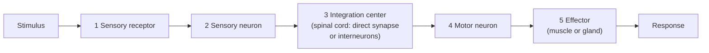

---
aliases:
  - Système nerveux
  - Central Nervous System
  - Peripheral Nervous System
  - CNS
  - PNS
  - Reflex Arc
tags:
  - type/concept
  - domain/biology
  - level/L1
  - level/L2
  - level/L3
mastery: 0
prerequisites:
  - "[[Tissue]]"
  - "[[Homeostasis]]"
  - "[[Cell Membrane]]"
related:
  - "[[Neuron]]"
  - "[[Membrane Potential]]"
  - "[[Endocrine System]]"
  - "[[Organ System]]"
  - "[[Cell Signaling]]"
  - "[[Cell Type Annotation]]"
projects: []
sources:
  - "[[Anatomy and Physiology 2e (OpenStax)]]"
  - "[[Biology 2e (OpenStax)]]"
  - "[[GTEx Portal]]"
---

# Nervous System

> [!abstract]
> The nervous system senses changes, decides on a response and commands muscles and glands through fast electrical signals; the brain and spinal cord form its center, and nerves connect them to the rest of the body.

## Definition

The **nervous system** is the organ system that detects internal and external changes (sensory input), processes them (integration) and triggers responses (motor output) through networks of [[Neuron|neurons]]. It has two anatomical divisions: the **central nervous system** (CNS: brain and spinal cord) and the **peripheral nervous system** (PNS: everything else, chiefly nerves and ganglia), which connects the CNS to the rest of the body.[^ap][^bio7]

## Why it matters

- **Brain data are post-mortem and regional.** Tissue atlases such as [[GTEx Portal|GTEx]] sample several brain regions as separate tissues, all from post-mortem donors;[^gtex] region and sampling conditions are major covariates.
- **Two cell families.** Nervous tissue mixes neurons and glial cells ([[Tissue]]); bulk brain expression is a mixture, and single-cell studies must separate them ([[Single-Cell RNA Sequencing]], [[Cell Type Annotation]]).
- **Electrical signaling** rests on ion gradients across the [[Cell Membrane]] ([[Membrane Potential]]); the genes for channels and receptors are what connects nervous physiology to sequence data.
- **A graph by nature.** Neural circuits are directed networks of cells; the reflex arc below is the shortest path from sensor to effector ([[Graph]]).

## Core (L1)

**Divisions.** The CNS integrates; the PNS carries information to it and from it.[^ap]

| Division | Part | Role |
|---|---|---|
| Sensory (afferent) | PNS | Carries signals from receptors to the CNS |
| Integration | CNS (brain, spinal cord) | Processes input, decides on output |
| Somatic motor | PNS | Controls skeletal muscles; voluntary movement |
| Autonomic motor | PNS | Controls cardiac muscle, smooth muscle and glands; involuntary |

The **autonomic** system has a **sympathetic** division ("fight or flight") and a **parasympathetic** division ("rest and digest"), which often act on the same organs in opposite directions. The **enteric** nervous system in the wall of the gut is often grouped with it.[^ap]

**Cells.** Neurons transmit signals; glial cells support them, for example by wrapping axons in myelin. Regions rich in neuron cell bodies form **gray matter**; tracts of myelinated axons form **white matter**.[^ap]

**The reflex arc.** A reflex is a fast, automatic response that does not need the brain's decision. Its pathway has five parts:[^ap]



- The **stretch reflex** (knee-jerk, or patellar, reflex) is **monosynaptic**: the sensory neuron synapses directly on the motor neuron in the spinal cord.[^ap]
- The **withdrawal reflex** (pulling a hand from a hot object) is **polysynaptic**: interneurons in the spinal cord relay and distribute the signal.[^ap]

## Deeper (L2)

- **Speed.** Neurons signal by action potentials; myelin makes conduction much faster than in unmyelinated axons ([[Neuron]]).[^ap]
- **Chemical synapses.** Between neurons and at the neuromuscular junction, signals cross by neurotransmitter release; acetylcholine is the transmitter at the neuromuscular junction of skeletal muscle.[^ap] Each synapse adds a delay, so arcs with fewer synapses respond faster.
- **Nervous versus endocrine control.** Nervous signals are fast, targeted and brief; hormones are slower, widespread and longer-lasting. The hypothalamus links the two ([[Endocrine System]]).[^ap]
- **Protection of the CNS.** The blood-brain barrier restricts which substances pass from blood into brain tissue, a constraint for drugs aimed at the brain ([[Drug Discovery]]).[^ap]

## Advanced (L3)

- **Feedback everywhere.** The autonomic system runs many homeostatic loops (heart rate, blood pressure, digestion) without conscious control; the reflex arc is the simplest sensor → controller → effector loop of [[Homeostasis]].[^ap]
- **From anatomy to data.** Brain-region labels in an atlas are anatomical; within each region, single-cell data reveal many neuron and glial types. Compare datasets at matching regions and cell types, not at "brain" level.[^gtex]
- **Circuits as computation.** Polysynaptic circuits can combine, inhibit and route signals; network models of neurons are a meeting point of physiology, graph theory and machine learning.

## Mathematical representation

A reflex arc is a directed path of segments $i = 1, \dots, m$ with lengths $L_i$ and conduction velocities $v_i$, plus $n$ synapses (counting the neuromuscular junction), each with delay $\delta$. A first-order model of the **reflex latency** is

$$T = \sum_{i=1}^{m} \frac{L_i}{v_i} + n\,\delta.$$

This is a model of travel time only (receptor activation and muscle contraction add more); the values below are illustrative, not measurements.

## Computational representation

```python
# Reflex latency = conduction time along each segment + synaptic delays (illustrative values, not measurements)
def latency_ms(segments, n_synapses, synaptic_delay_ms=1.0):
    """segments: list of (name, length in m, conduction velocity in m/s)."""
    conduction_ms = sum(length / velocity for _, length, velocity in segments) * 1000
    return conduction_ms + n_synapses * synaptic_delay_ms

stretch = [("sensory axon", 0.5, 60.0), ("motor axon", 0.5, 60.0)]
withdrawal = [("sensory axon", 0.5, 30.0), ("interneuron", 0.002, 1.0), ("motor axon", 0.5, 60.0)]
print("stretch (1 central synapse + neuromuscular junction):", round(latency_ms(stretch, 2), 1), "ms")
print("withdrawal (2 central synapses + neuromuscular junction):", round(latency_ms(withdrawal, 3), 1), "ms")
```

```text
stretch (1 central synapse + neuromuscular junction): 18.7 ms
withdrawal (2 central synapses + neuromuscular junction): 30.0 ms
```

## Worked example

> [!example] Tracing the knee-jerk reflex
> 1. **Stimulus**: a tap on the patellar tendon stretches the quadriceps muscle.
> 2. **Receptor and sensory neuron**: stretch receptors in the muscle fire; the sensory neuron carries the signal into the spinal cord through a spinal nerve (PNS → CNS).
> 3. **Integration**: in the spinal cord, the sensory neuron synapses directly on a motor neuron (one central synapse: monosynaptic).
> 4. **Motor neuron and effector**: the motor neuron leaves through the spinal nerve to the quadriceps, which contracts (somatic motor output).
> 5. **Response**: the leg kicks, before the brain registers the tap. Because each part is tested, the reflex is a quick check of the whole arc.[^ap]

## Common misconceptions

> [!warning] "Reflexes are controlled by the brain"
> Many reflexes are integrated in the spinal cord; the brain is informed but does not decide the response.

> [!warning] "The nervous system is made of neurons"
> Glial cells are a large part of nervous tissue and are essential (myelin, support, protection).

> [!warning] "Autonomic means independent of the CNS"
> Autonomic pathways are part of the nervous system and are controlled by CNS centers; "autonomic" means involuntary, not disconnected.

## Exercises

> [!question] Exercise 1 (L1)
> CNS or PNS? (a) spinal cord; (b) a spinal nerve; (c) a ganglion; (d) cerebellum.

> [!success]- Solution
> (a) CNS; (b) PNS; (c) PNS (a cluster of neuron cell bodies outside the CNS); (d) CNS (part of the brain).

> [!question] Exercise 2 (L1)
> Classify as somatic or autonomic: (a) raising a hand; (b) heart rate rising when frightened; (c) secretion of digestive juices; (d) the knee-jerk reflex.

> [!success]- Solution
> (a) somatic; (b) autonomic (sympathetic); (c) autonomic (parasympathetic, with the enteric system); (d) somatic: an involuntary reflex, but its effector is skeletal muscle.

> [!question] Exercise 3 (L2, Python)
> With `latency_ms` from the code above, compute the stretch-reflex latency for a path twice as long (1 m each way at 60 m/s), then for the original path with slow fibers at 1 m/s. What does this say about myelin?

> [!success]- Solution
> ```python
> print(round(latency_ms([("sensory axon", 1.0, 60.0), ("motor axon", 1.0, 60.0)], 2), 1))     # 35.3 ms
> print(round(latency_ms([("sensory axon", 0.5, 1.0), ("motor axon", 0.5, 1.0)], 2) / 1000, 2))  # 1.0 s
> ```
>
> Longer limbs add conduction time proportionally. Dropping to 1 m/s turns a reflex of about 19 ms into one of about a second: in this model, fast (myelinated) conduction is what makes long-distance reflexes protective.

> [!question] Exercise 4 (L3)
> A patient has no knee-jerk reflex on the right, yet feels the tap on that knee normally and can extend the leg voluntarily. Which part of the arc is the most likely site of the problem? Reason component by component.

> [!success]- Solution
> Feeling the tap means the receptor and sensory neuron carry the signal to the CNS. Voluntary extension means the motor neuron, the neuromuscular junction and the quadriceps work. What remains is the integration step: the reflex synapse between the sensory and motor neurons at that spinal level (or a branch of the sensory fibers feeding it). A clinical answer needs more tests; the exercise is about using the arc as a diagnostic model.

## Mastery checklist

- [ ] 1 Recognized: I can name the CNS and PNS components and the five parts of a reflex arc.
- [ ] 2 Understood: I can explain sensory, integrative and motor functions, somatic versus autonomic control, and mono- versus polysynaptic reflexes.
- [ ] 3 Practiced: I can compute reflex latencies from a path model and reason about which parameter dominates.
- [ ] 4 Applied: I can handle brain-region labels and neuron versus glia composition when analyzing an expression atlas.
- [ ] 5 Explained: I can teach how the nervous system implements homeostatic loops and how it complements the endocrine system.

## References

[^ap]: [[Anatomy and Physiology 2e (OpenStax)]], nervous system chapters: organization of the nervous system, nervous tissue, the autonomic nervous system, reflexes and the neurological exam.
[^bio7]: [[Biology 2e (OpenStax)]], Unit 7 "Animal Structure and Function".
[^gtex]: [[GTEx Portal]], V8 release (tissues including several brain regions, from post-mortem donors).
