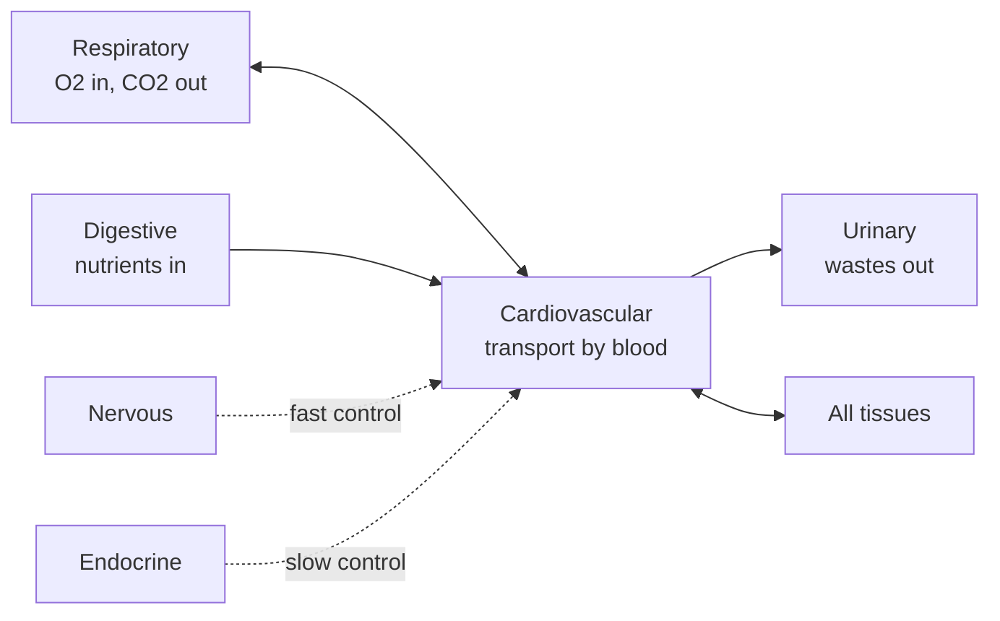

---
aliases:
  - Organ Systems
  - Body System
  - Système d'organes
  - Appareil (physiologie)
tags:
  - type/concept
  - domain/biology
  - level/L1
  - level/L2
mastery: 0
prerequisites:
  - "[[Tissue]]"
  - "[[Homeostasis]]"
related:
  - "[[Blood]]"
  - "[[Nervous System]]"
  - "[[Endocrine System]]"
  - "[[Immune System]]"
  - "[[Binary Relation]]"
  - "[[Biological Ontology]]"
projects: []
sources:
  - "[[Anatomy and Physiology 2e (OpenStax)]]"
  - "[[Biology 2e (OpenStax)]]"
  - "[[GTEx Portal]]"
---

# Organ System

> [!abstract]
> An organ system is a team of organs that together perform one of the body's major functions, such as moving blood, exchanging gases or defending against pathogens; the human body is usually described with eleven of them.

## Definition

An **organ system** is a group of organs that work together to perform major functions or meet physiological needs of the body. It is one of the levels of structural organization: chemical, cellular, [[Tissue|tissue]], organ, organ system, organism.[^ap12][^bio7]

## Why it matters

- **Metadata at the right resolution.** Biomedical samples are labelled by tissue or organ; [[GTEx Portal|GTEx]] alone has 54 tissue labels.[^gtex] Grouping them by organ system is a common coarse layer for summaries and figures, and the grouping is a modelling choice to document ([[Biological Ontology]]).
- **Reading a dataset's biology.** Knowing which system an organ serves tells you what to expect in its expression profile: secretory genes in glands, contractile genes in muscle, immune genes in lymphoid organs.
- **Most systems meet in the blood.** Hormones, nutrients, waste and immune cells all travel in [[Blood]], which is why blood is the most practical window on the whole body.[^ap18]

## Core (L1)

The eleven organ systems, each with example organs and major functions:[^ap12]

| System | Example organs | Major functions |
|---|---|---|
| Integumentary | Skin, hair, nails | Encloses internal structures; site of many sensory receptors |
| Skeletal | Bones, cartilage, joints | Supports the body; enables movement with the muscular system |
| Muscular | Skeletal muscles, tendons | Enables movement; helps maintain body temperature |
| Nervous | Brain, spinal cord, peripheral nerves | Detects and processes sensory information; activates responses ([[Nervous System]]) |
| Endocrine | Pituitary, thyroid, pancreas, adrenal glands, testes, ovaries | Secretes hormones; regulates body processes ([[Endocrine System]]) |
| Cardiovascular | Heart, blood vessels | Delivers oxygen and nutrients to tissues; equalizes temperature ([[Blood]]) |
| Lymphatic | Thymus, lymph nodes, spleen, lymphatic vessels | Returns fluid to the blood; defends against pathogens ([[Immune System]]) |
| Respiratory | Nasal passages, trachea, lungs | Delivers oxygen to the blood; removes carbon dioxide |
| Digestive | Stomach, liver, gallbladder, small and large intestine | Processes food for use by the body; removes waste from undigested food |
| Urinary | Kidneys, urinary bladder | Controls water balance; removes wastes from the blood and excretes them |
| Reproductive | Testes, epididymis; ovaries, uterus, mammary glands | Produces sex hormones and gametes; supports the embryo and fetus; produces milk |

**Organs serve several systems.** Assigning organs to systems is imprecise: most organs contribute to more than one system.[^ap12] The pancreas releases hormones (endocrine) and digestive enzymes (digestive); the testes and ovaries make both gametes and sex hormones; bone marrow, inside the skeleton, produces blood cells.[^ap]

**Systems work together.** Delivering oxygen needs the respiratory system (gas exchange in the lungs) and the cardiovascular system (transport by blood). Two systems coordinate all the others: the nervous system by fast electrical signals and the endocrine system by slower hormonal signals, both maintaining [[Homeostasis]].[^ap]



## Deeper (L2)

- **The immune system is distributed.** It is not one of the eleven systems in this scheme: its cells develop in bone marrow and thymus, patrol in blood and lymph, gather in lymph nodes and spleen, and act at barriers such as skin and mucosa. Textbooks treat it with the lymphatic system ([[Immune System]]).[^ap]
- **Classification is a convention.** The list of systems is a way of grouping organs, and other references may group them differently; compare datasets and textbooks at the organ level.
- **Systems and tissue atlases.** A system groups organs, an organ groups tissues, and a sampled "tissue" in an atlas is often a sub-region of an organ (several brain regions, for example), so the same organ can appear under several labels.[^gtex]

## Mathematical representation

Organ systems are a classification, not a quantity: the honest formal object is a many-to-many [[Binary Relation]] $R \subseteq \mathcal{O} \times \mathcal{S}$ between organs $\mathcal{O}$ and systems $\mathcal{S}$, where $(o, s) \in R$ means organ $o$ contributes to system $s$. It is not a function from organs to systems, because some organs relate to several systems.

## Computational representation

Store the relation as a dictionary from system to organs and invert it to find organs shared by several systems:

```python
from collections import defaultdict

SYSTEMS = {  # example organs per system (a subset)
    "integumentary": ["skin", "hair", "nails"],
    "skeletal": ["bones", "cartilage", "joints"],
    "muscular": ["skeletal muscles", "tendons"],
    "nervous": ["brain", "spinal cord", "peripheral nerves"],
    "endocrine": ["pituitary gland", "thyroid gland", "pancreas", "adrenal glands", "testes", "ovaries"],
    "cardiovascular": ["heart", "blood vessels"],
    "lymphatic": ["thymus", "lymph nodes", "spleen", "lymphatic vessels"],
    "respiratory": ["nasal passages", "trachea", "lungs"],
    "digestive": ["stomach", "liver", "gallbladder", "pancreas", "small intestine", "large intestine"],
    "urinary": ["kidneys", "urinary bladder"],
    "reproductive": ["testes", "epididymis", "ovaries", "uterus", "mammary glands"],
}

organ_to_systems = defaultdict(list)
for system, organs in SYSTEMS.items():
    for organ in organs:
        organ_to_systems[organ].append(system)

print(len(SYSTEMS), "systems,", len(organ_to_systems), "organs")
print({organ: systems for organ, systems in organ_to_systems.items() if len(systems) > 1})
```

```text
11 systems, 36 organs
{'pancreas': ['endocrine', 'digestive'], 'testes': ['endocrine', 'reproductive'], 'ovaries': ['endocrine', 'reproductive']}
```

A sample table then needs a list of systems per label, not a single column, or a documented rule for choosing one.

## Worked example

> [!example] Following an oxygen molecule
> 1. **Respiratory**: air passes the nasal passages and trachea; oxygen crosses into the blood in the lungs.
> 2. **Cardiovascular**: the heart pumps oxygenated blood through the vessels to every tissue.
> 3. **Tissues**: cells use oxygen and release carbon dioxide, which returns by the same route and is exhaled.
> 4. **Control**: the nervous system adjusts breathing and heart rate, closing the loop ([[Homeostasis]]).
>
> One function, at least three systems: physiology is organized by systems, but functions cut across them.

## Common misconceptions

> [!warning] "Each organ belongs to exactly one system"
> Most organs contribute to several systems; the pancreas and the gonads are the clearest cases.

> [!warning] "The immune system is a set of organs like the others"
> Its key components are cells that circulate and settle throughout the body; its organs (thymus, lymph nodes, spleen) are only part of it.

## Exercises

> [!question] Exercise 1 (L1)
> Give the system of: (a) kidneys; (b) thyroid gland; (c) spleen; (d) trachea; (e) tendons.

> [!success]- Solution
> (a) urinary; (b) endocrine; (c) lymphatic; (d) respiratory; (e) muscular.

> [!question] Exercise 2 (L1)
> Which two systems coordinate the others, and how do their signals differ?

> [!success]- Solution
> The nervous system (fast, brief electrical signals along nerves) and the endocrine system (slower, longer-lasting hormones carried by the blood).

> [!question] Exercise 3 (L2)
> Explain why the pancreas appears twice in the code output, and what this implies for a sample table with one "system" column.

> [!success]- Solution
> The pancreas has an endocrine part (islets releasing insulin and glucagon) and an exocrine part (digestive enzymes), so it relates to two systems. A single column forces an arbitrary choice; store a list of systems or a documented primary system.

> [!question] Exercise 4 (L2, Python)
> Extend the code: map the invented sample labels `["Whole Blood", "Spleen", "Thyroid", "Pancreas", "Testis", "Skin"]` to systems with a dictionary from label to organ, and print the labels that map to more than one system.

> [!success]- Solution
> ```python
> label_to_organ = {"Whole Blood": "blood vessels", "Spleen": "spleen", "Thyroid": "thyroid gland",
>                   "Pancreas": "pancreas", "Testis": "testes", "Skin": "skin"}
> for label, organ in label_to_organ.items():
>     systems = organ_to_systems[organ]
>     if len(systems) > 1:
>         print(label, systems)
> # Pancreas ['endocrine', 'digestive']
> # Testis ['endocrine', 'reproductive']
> ```
>
> "Whole Blood" is the weak point: mapping it to "blood vessels" (cardiovascular) hides that blood also carries the immune system's cells. Mapping rules are decisions; write them down.

## Mastery checklist

- [ ] 1 Recognized: I can list the eleven organ systems.
- [ ] 2 Understood: I can give each system's main organs and functions, and explain why organs belong to several systems.
- [ ] 3 Practiced: I can represent the organ-system relation in code and query it.
- [ ] 4 Applied: I can group the tissue labels of a real atlas into systems with documented rules.
- [ ] 5 Explained: I can teach how systems cooperate in one function (oxygen delivery) and why the classification is a convention.

## References

[^ap12]: [[Anatomy and Physiology 2e (OpenStax)]], section 1.2 "Structural Organization of the Human Body" (levels of organization; the eleven organ systems with example organs and functions).
[^ap]: [[Anatomy and Physiology 2e (OpenStax)]], treatment of the pancreas, gonads and bone marrow, of nervous versus endocrine control, and of the lymphatic and immune system.
[^ap18]: [[Anatomy and Physiology 2e (OpenStax)]], ch. 18 "The Cardiovascular System: Blood" (functions of blood).
[^bio7]: [[Biology 2e (OpenStax)]], Unit 7 "Animal Structure and Function".
[^gtex]: [[GTEx Portal]], V8 release (54 tissues).
