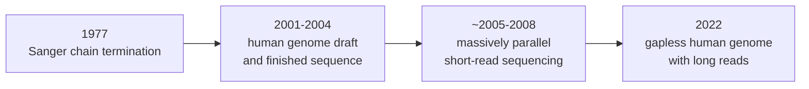

---
aliases:
  - Sequencing
  - Sequencing Technology
  - Sequencing Generations
  - Séquençage de l'ADN
tags:
  - type/concept
  - domain/biology
  - domain/bioinformatics
  - level/L1
  - level/L2
  - level/L3
mastery: 0
prerequisites:
  - "[[DNA]]"
  - "[[DNA Replication]]"
  - "[[Polymerase Chain Reaction]]"
  - "[[Gel Electrophoresis]]"
related:
  - "[[Sanger Sequencing]]"
  - "[[Next-Generation Sequencing]]"
  - "[[Long-Read Sequencing]]"
  - "[[Sequencing Read]]"
  - "[[Phred Quality Score]]"
  - "[[FASTQ Format]]"
  - "[[Sequencing Coverage]]"
  - "[[Shotgun Sequencing]]"
  - "[[Genome Assembly]]"
  - "[[Sequencing Cost Trend]]"
  - "[[Whole-Genome Sequencing]]"
projects:
  - "[[10-genomic-pipeline]]"
sources:
  - "[[Biology 2e (OpenStax)]]"
  - "[[Molecular Biology of the Cell (Alberts)]]"
  - "[[MIT 7.91J - Foundations of Computational and Systems Biology]]"
  - "[[Sanger 1977 - DNA Sequencing with Chain-Terminating Inhibitors]]"
  - "[[Shendure 2008 - Next-Generation DNA Sequencing]]"
  - "[[NHGRI DNA Sequencing Costs]]"
  - "[[Lander 2001 - Initial Sequencing and Analysis of the Human Genome]]"
  - "[[IHGSC 2004 - Finishing the Euchromatic Sequence of the Human Genome]]"
  - "[[Nurk 2022 - The Complete Sequence of a Human Genome]]"
  - "[[Cock 2010 - The Sanger FASTQ File Format]]"
  - "[[Lander 1988 - Genomic Mapping by Fingerprinting Random Clones]]"
---

# DNA Sequencing

> [!abstract]
> DNA sequencing reads the order of the bases A, C, G and T along a DNA molecule; each generation of technology has traded read length, accuracy and throughput differently, and those trade-offs shape every analysis downstream.

## Definition

**DNA sequencing** is the determination of the order of nucleotides in a DNA molecule.[^os17][^alberts] A sequencer does not read a chromosome end to end: it reads many fragments, each output as a **read** (a string over {A, C, G, T}, often with a quality value per base), which software then places on a reference or assembles ([[Sequencing Read]], [[Read Mapping]], [[Genome Assembly]]).

## Why it matters

- **It is the source of most bioinformatics data.** Genomes, variants, expression ([[RNA Sequencing]]), methylation and chromatin assays are all read out by sequencing, then stored as [[FASTQ Format|FASTQ]] reads with per-base qualities.[^cock]
- **The technology fixes the error model.** Read length decides which repeats can be resolved; the error profile decides how variants are called and how reads are corrected ([[Base Calling]], [[Variant Calling]]).
- **Cost shapes study design.** The falling cost per base, tracked by NHGRI since 2001, turned genome sequencing from a decade-long project into a routine assay ([[Sequencing Cost Trend]]).[^nhgri]

## Core (L1)

**Most methods read bases while a polymerase copies the template.** They watch a DNA polymerase copy a template, one base at a time, and identify each added base ([[DNA Replication]]).[^shendure] Three generations are usually distinguished:[^mit791][^shendure]



| Generation | Principle | Reads per run | Read length | Strength |
|---|---|---|---|---|
| First: [[Sanger Sequencing]] | Chain termination by dideoxynucleotides, fragments separated by size[^sanger] | one read per reaction (per capillary when automated) | long | very accurate single reads; suits one clone or one PCR product at a time |
| Second: [[Next-Generation Sequencing]] | Many immobilized fragments sequenced in parallel by cycles of enzymatic extension and imaging[^shendure] | millions in parallel | short | throughput and cost per base |
| Third: [[Long-Read Sequencing]] | Long single molecules (nanopore, single-molecule real-time sequencing) | depends on platform | long to very long | spans repeats that short reads cannot place[^nurk] |

Read length, per-base accuracy and throughput (bases per run) are the three axes of comparison. The numerical values change with each instrument release, so they are compared in the platform notes and checked against current specifications, not memorized.

**Milestones.** Sanger and colleagues published chain termination in 1977.[^sanger] The public human genome project used a hierarchical, clone-based shotgun strategy (draft 2001);[^lander] its finished euchromatic sequence (2004) had 2.85 billion nucleotides, 341 gaps and about one error per 100,000 bases.[^ihgsc] Massively parallel platforms cut the cost of sequencing by more than two orders of magnitude within three years.[^shendure] Long reads closed the remaining gaps, about 8 % of the genome, in 2022.[^nurk]

## Deeper (L2)

**Shotgun logic.** Because reads are much shorter than chromosomes, a genome is broken into random fragments, each fragment is read, and overlaps or a reference reassemble the whole ([[Shotgun Sequencing]]).[^lander] Each position must be read several times: the mean **depth** $c = NL/G$ ($N$ reads of length $L$ on a genome of $G$ bp) and the fraction of the genome covered follow from treating read starts as random, the model of Lander and Waterman.[^lander88] See [[Sequencing Coverage]] and [[Lander-Waterman Model]].

**Quality values.** Each base call carries a Phred quality $Q = -10 \log_{10} p$, where $p$ is the estimated probability that the call is wrong: Q20 means a 1 % error probability, Q30 0.1 %.[^cock] Summing $p$ along a read gives its expected number of errors ([[Phred Quality Score]]).

**Repeats and read length.** A read can be placed uniquely only if it contains sequence found once in the genome. A repeat longer than the reads leaves the reads inside it unplaceable, which fragments assemblies; this is why long reads completed the centromeric satellite arrays, recent segmental duplications and acrocentric short arms that remained unfinished in the human reference.[^nurk] See [[Genome Assembly]].

## Advanced (L3)

- **Choosing a technology is an optimization**: depth, read length and per-base accuracy compete for a fixed budget. Variant calling in unique sequence favours cheap, accurate short reads at high depth; assembly and structural variants favour long reads ([[Whole-Genome Sequencing]], [[Variant Calling]]).
- **New bottlenecks.** After costs fell, the limiting steps moved to library preparation, data analysis and experimental design, as anticipated in 2008;[^shendure] the NHGRI curve counts production costs only, not analysis, storage or interpretation.[^nhgri]
- **Sequencing as counting.** Many assays use reads as counters rather than to learn a sequence: reads per gene measure expression, reads per region measure binding or copy number ([[RNA Sequencing]], [[Copy Number Variation]]). The sequence is then a tag, and the statistics of counts take over.

## Mathematical representation

- A read is a pair $(r, q)$: bases $r \in \{A, C, G, T, N\}^L$ and Phred qualities $q \in \mathbb{N}^L$, with error probabilities $p_i = 10^{-q_i/10}$.[^cock]
- **Expected errors** in a read: $E = \sum_{i=1}^{L} p_i$. A read of 150 bases at uniform Q30 has $E = 0.15$.
- **Depth**: $c = NL/G$. **Reads needed** for a target depth: $N = cG/L$.
- **Uncovered fraction** under uniform random read starts: the number of reads covering a base is approximately Poisson with mean $c$, so $P(\text{0 reads}) = e^{-c}$ ([[Poisson Distribution]]).[^lander88]
- **Throughput** of a run = reads × read length, in bases.

## Computational representation

Reads arrive as [[FASTQ Format]] records: a header, the bases, a separator and one quality character per base, encoded as Phred + 33.[^cock]

```python
import math

# One FASTQ record (invented read): header, bases, separator, qualities (Phred + 33)
record = """@read_001
ACGTTGCAAGGCTTACGATCGGATTACAGT
+
IIIIIIIIIIIIIIIIIIHHHHGGFF@@:5"""
header, bases, _, quals = record.splitlines()
q = [ord(ch) - 33 for ch in quals]                 # Phred scores
p = [10 ** (-qi / 10) for qi in q]                 # error probabilities
print(len(bases), q[:3], q[-3:])
print("expected errors:", round(sum(p), 4), " min Q:", min(q))


def reads_for_coverage(genome_bp: float, read_len: int, depth: float) -> float:
    """Number of reads N such that N * L / G = depth."""
    return depth * genome_bp / read_len


G = 3.055e9                      # human genome, bp
for L in (150, 800, 15_000):     # illustrative read lengths
    print(L, f"{reads_for_coverage(G, L, 30):.3g} reads for 30x")
for c in (1, 5, 10, 30):
    print(c, f"uncovered fraction e^-c = {math.exp(-c):.2g}", f"bases uncovered = {G * math.exp(-c):.3g}")
```

```text
30 [40, 40, 40] [31, 25, 20]
expected errors: 0.0178  min Q: 20
150 6.11e+08 reads for 30x
800 1.15e+08 reads for 30x
15000 6.11e+06 reads for 30x
1 uncovered fraction e^-c = 0.37 bases uncovered = 1.12e+09
5 uncovered fraction e^-c = 0.0067 bases uncovered = 2.06e+07
10 uncovered fraction e^-c = 4.5e-05 bases uncovered = 1.39e+05
30 uncovered fraction e^-c = 9.4e-14 bases uncovered = 0.000286
```

The quality string is invented but shaped like many real reads, with quality falling toward the 3' end. The genome size is that of the T2T human assembly.[^nurk] The Poisson numbers are a best case: real coverage is uneven, so real gaps are more frequent ([[Sequencing Coverage]]).

## Worked example

> [!example] Planning a 30× human genome (illustrative read lengths)
> 1. **Bases needed**: $c \times G = 30 \times 3.055 \times 10^9 \approx 9.2 \times 10^{10}$ bases, whatever the technology.
> 2. **Reads needed**: $6.1 \times 10^8$ reads of 150 bases, or $6.1 \times 10^6$ reads of 15,000 bases: a hundred times fewer reads for the same bases.
> 3. **Breadth**: at 30× the uniform model predicts essentially no uncovered base ($e^{-30} \approx 10^{-13}$); at 5× it predicts about 20 Mb uncovered.
> 4. **Repeats**: an (invented) 6 kb repeat present twice cannot be crossed by any 150-base read, so reads inside it map to both copies; a 15 kb read that spans the repeat and its unique flanks places it.
> 5. **Errors**: at uniform Q30, each 150-base read carries 0.15 expected errors; depth lets the consensus outvote them.

## Common misconceptions

> [!warning] "A sequencer reads a genome from one end to the other"
> It reads fragments. The genome is reconstructed computationally, by mapping or assembly, and the reconstruction is only as good as the reads' length and accuracy allow.[^lander][^nurk]

> [!warning] "Newer generations replaced the older ones"
> Each generation is used where its trade-off fits: Sanger reads still check individual clones and PCR products, short reads dominate counting and resequencing, long reads resolve repeats and structure.

> [!warning] "A finished genome has no errors and no gaps"
> The 2004 "finished" human euchromatin still had 341 gaps and about one error per 100,000 bases;[^ihgsc] about 8 % of the genome remained unfinished until 2022.[^nurk] Reference genomes are versioned, improving models ([[Reference Genome]]).

## Exercises

> [!question] Exercise 1 (L1)
> Define DNA sequencing, then name the three axes along which sequencing technologies are compared and one strength of each generation.

> [!success]- Solution
> Determining the order of nucleotides in DNA. Axes: read length, per-base accuracy, throughput. Sanger: very accurate long reads, one at a time. Massively parallel short-read sequencing: throughput and cost per base. Long-read sequencing: reads that span repeats.

> [!question] Exercise 2 (L1)
> Convert Q10, Q20, Q30 and Q40 into error probabilities, and give the expected number of errors in a 150-base read at each uniform quality.

> [!success]- Solution
> $p = 10^{-Q/10}$: 0.1, 0.01, 0.001, 0.0001. Expected errors $150p$: 15, 1.5, 0.15, 0.015. A Q10 read is mostly useless; Q30 is good for most purposes.

> [!question] Exercise 3 (L2)
> The finished human euchromatic sequence of 2004 contained 2.85 billion nucleotides at about one error per 100,000 bases.[^ihgsc] How many errors does that represent? Why could it still be called "finished"?

> [!success]- Solution
> $2.85 \times 10^9 / 10^5 = 2.85 \times 10^4$, about 28,500 errors. That is 99.999 % accuracy, above what most analyses need; "finished" was an operational standard, not perfection, and the remaining gaps were in regions the technology of the time could not resolve.[^nurk]

> [!question] Exercise 4 (L2, Python)
> With the code above, how many 800-base reads give 10× depth on a 4,639,221 bp *E. coli* genome? What fraction of bases does the uniform model leave uncovered?

> [!success]- Solution
> $N = 10 \times 4{,}639{,}221 / 800 \approx 57{,}990$ reads, and $e^{-10} \approx 4.5 \times 10^{-5}$ of bases, about 210 bases, uncovered. Real coverage is uneven (GC bias, repeats), so the model underestimates gaps ([[Sequencing Coverage]]).[^lander88]

> [!question] Exercise 5 (L3)
> A team must choose between (a) short accurate reads at 30× and (b) long reads at 30× with a higher per-base error rate, for (i) calling single-base variants in a known human gene panel, (ii) assembling a new plant genome rich in repeats. Argue each choice.

> [!success]- Solution
> (i) Short reads: the regions are mostly unique, a reference exists, and per-base accuracy with high depth gives confident single-base calls cheaply. (ii) Long reads: repeats longer than short reads fragment an assembly, and only reads that span them can place them; their errors are corrected by depth and consensus, or by combining with accurate reads. The general rule: read length buys the structure, accuracy and depth buy the bases.

## Mastery checklist

- [ ] 1 Recognized: I can define sequencing and name the three generations.
- [ ] 2 Understood: I can explain shotgun logic, quality scores, depth and why read length matters for repeats.
- [ ] 3 Practiced: I can parse a FASTQ record, compute expected errors and plan the number of reads for a target depth.
- [ ] 4 Applied: in [[10-genomic-pipeline]], I read the run statistics of a real dataset (read count, length, qualities, depth) and judged whether it fits the question.
- [ ] 5 Explained: I can argue which technology fits a given question, and what the NHGRI cost curve does and does not measure.

## References

[^os17]: [[Biology 2e (OpenStax)]], ch. 17 "Biotechnology and Genomics".
[^alberts]: [[Molecular Biology of the Cell (Alberts)]], 4th ed. (2002), methods for manipulating DNA (DNA sequencing).
[^mit791]: [[MIT 7.91J - Foundations of Computational and Systems Biology]], lecture 1 (DNA sequencing technologies).
[^sanger]: [[Sanger 1977 - DNA Sequencing with Chain-Terminating Inhibitors]], *PNAS*.
[^shendure]: [[Shendure 2008 - Next-Generation DNA Sequencing]], *Nature Biotechnology* (shared principle of the new platforms, cost reduction, challenges).
[^nhgri]: [[NHGRI DNA Sequencing Costs]], cost per megabase and per genome since 2001.
[^lander]: [[Lander 2001 - Initial Sequencing and Analysis of the Human Genome]], *Nature*, sequencing strategy.
[^ihgsc]: [[IHGSC 2004 - Finishing the Euchromatic Sequence of the Human Genome]], *Nature*.
[^nurk]: [[Nurk 2022 - The Complete Sequence of a Human Genome]], *Science*.
[^cock]: [[Cock 2010 - The Sanger FASTQ File Format]], *Nucleic Acids Research*.
[^lander88]: [[Lander 1988 - Genomic Mapping by Fingerprinting Random Clones]], *Genomics*.
