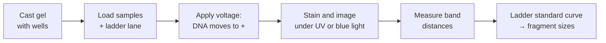

---
aliases:
  - Agarose Gel Electrophoresis
  - DNA Gel Electrophoresis
  - DNA Ladder
  - Électrophorèse sur gel
tags:
  - type/technique
  - domain/biology
  - domain/physics
  - domain/bioinformatics
  - level/L1
  - level/L2
mastery: 0
prerequisites:
  - "[[DNA]]"
  - "[[Nucleic Acid]]"
  - "[[Restriction Enzyme]]"
  - "[[Logarithm]]"
  - "[[Electric Field]]"
related:
  - "[[Electrophoretic Mobility]]"
  - "[[Polymerase Chain Reaction]]"
  - "[[Sanger Sequencing]]"
  - "[[Linear Regression]]"
  - "[[Nucleic Acid Hybridization]]"
  - "[[Sequencing Library Preparation]]"
projects: []
sources:
  - "[[Biology 2e (OpenStax)]]"
  - "[[Microbiology (OpenStax)]]"
  - "[[Molecular Biology of the Cell (Alberts)]]"
  - "[[Lee 2012 - Agarose Gel Electrophoresis for the Separation of DNA Fragments]]"
---

# Gel Electrophoresis

> [!abstract]
> Gel electrophoresis pulls DNA or RNA fragments through a porous gel with an electric field; short fragments travel farther than long ones, so a ladder of known sizes run alongside turns band positions into fragment lengths.

## Purpose

Separate nucleic acid fragments by length, to check the product of a [[Polymerase Chain Reaction|PCR]] or a [[Restriction Enzyme|restriction digest]], estimate fragment sizes, and recover a fragment of the right size for [[Molecular Cloning]].[^os17][^micro12]

## Why it matters

- **The first quality control of most wet-lab steps.** A PCR or a digest is accepted when its bands match the sizes predicted from the sequence: the prediction is computational ([[Restriction Enzyme#Computational representation]]).
- **Size selection** of fragments shapes sequencing libraries and their insert-size distribution ([[Sequencing Library Preparation]]).
- **Size separation is how Sanger sequencing reads bases**: fragments differing by one nucleotide are separated by electrophoresis, today in capillaries ([[Sanger Sequencing]]).
- **Reading a gel is a calibration problem**: fitting a standard curve to the ladder and inverting it, the same logic as a qPCR standard curve ([[Linear Regression]]).

## Principle

- **Charge.** The phosphate backbone of DNA and RNA is negatively charged, so in an electric field the fragments migrate toward the positive electrode (anode).[^lee][^os17]
- **Sieving.** Charge grows with length, so all fragments have about the same charge-to-mass ratio; what separates them is the gel, a network of polymer bundles whose pores slow long molecules more than short ones.[^lee] The leading model is **biased reptation**: the front end of the molecule snakes forward through the pores and pulls the rest behind it.[^lee]
- **Gels.** Agarose, a polysaccharide extracted from seaweed, resolves fragments from about 100 bp to 25 kb.[^lee] Polyacrylamide gels resolve short fragments finely enough to separate molecules differing by a single nucleotide, the basis of sequencing gels.[^alberts]
- **Detection.** DNA is invisible in the gel until stained with a dye, such as ethidium bromide, that fluoresces under ultraviolet light when bound to DNA.[^alberts]

## Protocol overview



## Core (L1)

![[gel-electrophoresis-ladder-reading.svg]]

**Reading a gel.** Wells are at the cathode end; each lane is one sample. A **ladder** (size marker) is a mixture of fragments of known lengths run in its own lane.[^lee][^micro12] A sample band is sized by comparing its distance from the well with the ladder bands around it: a band between the 1,500 bp and 1,000 bp ladder bands is between 1,000 and 1,500 bp long.

**What a band is.** A band is a population of molecules of the same length, not one molecule. Two different fragments of equal length co-migrate in one band, which is then brighter because it holds more DNA.

**Controls.** A lane with all reagents but no template ("no-template control") must stay empty: a band there means that some template DNA contaminated the reagents ([[Polymerase Chain Reaction]]).

## Deeper (L2)

**Distance versus size.** Plotting distance from the well against $\log_{10}$ of fragment size gives a roughly straight line, with distance decreasing as size increases.[^lee] The line bends at the extremes of the gel's range, where large fragments are crowded together (the invented ladder below shows its largest residual at 10 kb). Sizing is therefore reliable only between ladder bands, never by extrapolation.

**What shifts band positions.** Besides size, migration depends on agarose concentration, DNA conformation, applied voltage, the presence of ethidium bromide, the type of agarose and the buffer.[^lee] Conformation matters most in practice: an uncut plasmid contains several forms (supercoiled, nicked circular, linear) of the same length that migrate differently, so it cannot be sized against a linear ladder.[^lee]

**Physics.** At constant field, the drift velocity of a fragment is its mobility times the field ([[Electrophoretic Mobility]]); the gel makes the mobility size-dependent. Diffusion broadens each band over time ([[Diffusion]]).

## Data produced

A gel image (fluorescence intensity per pixel), from which each lane gives an intensity profile along the migration axis. Peaks of the profile are bands: their positions give sizes, their areas relative amounts.

## Analysis

Band detection on lane profiles, a standard curve from the ladder, and conversion of each distance to a size. Automated fragment analyzers and capillary sequencers output the same information as electropherograms (signal versus time) instead of images ([[Sanger Sequencing]]).

## Mathematical representation

- The ladder gives pairs $(L_i, d_i)$: size $L_i$ in bp and distance $d_i$ from the well. Within the resolving range, $d \approx a + b \log_{10} L$ with slope $b < 0$ (mm per tenfold change in size).
- Least squares gives $a, b$ ([[Linear Regression]]); a band at distance $d$ is then sized by inverting the line: $\hat{L} = 10^{(d - a)/b}$.
- **Local interpolation** uses only the two ladder bands that bracket $d$, $d_j \le d \le d_{j+1}$:
$$\log_{10} \hat{L} = \log_{10} L_j + \frac{d - d_j}{d_{j+1} - d_j}\left(\log_{10} L_{j+1} - \log_{10} L_j\right),$$
which follows the curvature of the real relation.
- **Precision.** An error $\delta d$ on a distance gives $\delta(\log_{10} \hat{L}) = \delta d / |b|$, a relative size error of $10^{\delta d/|b|} - 1$. A longer run spreads the bands (larger $|b|$) and sizes more precisely.

## Computational representation

```python
import math

# Invented ladder: (size in bp, migration distance in mm from the well)
LADDER = [(10000, 12.0), (6000, 16.5), (4000, 20.5), (3000, 23.5), (2000, 28.0),
          (1500, 31.0), (1000, 35.5), (700, 39.5), (500, 43.0), (300, 48.5)]


def fit_log_linear(ladder):
    """Least-squares fit of d = a + b * log10(size); returns (a, b)."""
    xs = [math.log10(s) for s, _ in ladder]
    ys = [d for _, d in ladder]
    n = len(xs)
    mx, my = sum(xs) / n, sum(ys) / n
    b = sum((x - mx) * (y - my) for x, y in zip(xs, ys)) / sum((x - mx) ** 2 for x in xs)
    return my - b * mx, b


def size_from_fit(d, a, b):
    return 10 ** ((d - a) / b)


def size_by_interpolation(d, ladder):
    """Interpolate log10(size) linearly between the two ladder bands that bracket d."""
    bands = sorted(ladder, key=lambda sd: sd[1])          # by distance
    if not bands[0][1] <= d <= bands[-1][1]:
        raise ValueError("band outside the ladder: do not extrapolate")
    for (s1, d1), (s2, d2) in zip(bands, bands[1:]):
        if d1 <= d <= d2:
            t = (d - d1) / (d2 - d1)
            return 10 ** (math.log10(s1) + t * (math.log10(s2) - math.log10(s1)))


a, b = fit_log_linear(LADDER)
print(f"d = {a:.2f} + ({b:.2f}) log10(size)")
residuals = [round(d - (a + b * math.log10(s)), 2) for s, d in LADDER]
print("residuals (mm):", residuals)
for d in (34.0, 25.0, 14.0, 41.0):
    print(d, round(size_from_fit(d, a, b)), round(size_by_interpolation(d, LADDER)))
try:
    size_by_interpolation(55.0, LADDER)
except ValueError as e:
    print(55.0, e)
```

```text
d = 108.55 + (-24.34) log10(size)
residuals (mm): [0.81, -0.09, -0.38, -0.42, -0.21, -0.25, -0.03, 0.2, 0.14, 0.24]
34.0 1156 1145
25.0 2709 2621
14.0 7669 7969
41.0 596 606
55.0 band outside the ladder: do not extrapolate
```

The ladder values are invented but shaped like a real gel: the fit is good in the middle and worst at 10 kb, where large fragments crowd together.

## Worked example

> [!example] Sizing the bands of lane A (figure above, invented data)
> 1. **Measure.** Lane A has bands at 14.0, 25.0 and 34.0 mm from the well.
> 2. **Bracket.** 34.0 mm lies between the 1,500 bp (31.0 mm) and 1,000 bp (35.5 mm) bands; 25.0 mm between 3,000 bp (23.5) and 2,000 bp (28.0); 14.0 mm between 10,000 bp (12.0) and 6,000 bp (16.5).
> 3. **Interpolate in log space.** For 34.0 mm: $t = (34.0 - 31.0)/(35.5 - 31.0) = 0.667$, $\log_{10}\hat{L} = 3.176 + 0.667 \times (3.000 - 3.176) = 3.059$, $\hat{L} \approx 1{,}145$ bp. The global fit gives 1,156 bp: the methods agree within 1 %.
> 4. **Judge the top band.** At 14.0 mm the two methods give 7,669 and 7,969 bp, a 4 % gap, because the line bends there. Report "about 8 kb".
> 5. **Interpret.** If lane A is a complete digest of a single circular molecule, its size is the sum of fragments: about $1.15 + 2.6 + 8.0 \approx 11.8$ kb.

## Limitations and biases

> [!warning] What a gel cannot tell you
> - Fragments of similar length merge into one band; the resolving power depends on gel type and run length.
> - Sizes come from a calibration, valid only for linear double-stranded DNA within the ladder range: plasmid forms, single-stranded or structured RNA, and DNA bound to proteins migrate differently.[^lee]
> - A band at the right size proves the size, not the sequence. Sequencing checks the bases ([[Sanger Sequencing]]).

## Common misconceptions

> [!warning] "Bigger fragments carry more charge, so they move faster"
> Charge and mass both scale with length, so the force per unit mass is about the same for all fragments. The gel's pores, not the charge, make long fragments slower.[^lee]

> [!warning] "Distance is inversely proportional to size"
> Distance falls approximately linearly with the **logarithm** of size, over a limited range.[^lee] Interpolating linearly in base pairs, rather than in $\log_{10}$ of base pairs, gives biased sizes.

> [!warning] "One band means one molecule species"
> Equal-length fragments co-migrate. The two 12 bp fragments of the double digest in [[Restriction Enzyme#Worked example]] form a single band.

## History and variants

- **Blots.** Fragments separated on a gel can be transferred to a membrane and detected by hybridization with a labelled probe: Southern blots for DNA, Northern blots for RNA ([[Nucleic Acid Hybridization]]).[^alberts]
- **Sequencing gels and capillaries.** Sanger's 1977 method read sequences from fragments separated on acrylamide gels; automated sequencers moved the separation into capillaries ([[Sanger Sequencing]]).[^sanger]

## Exercises

> [!question] Exercise 1 (L1)
> Explain, in two sentences, why DNA moves toward the positive electrode and why its speed depends on its length.

> [!success]- Solution
> The phosphate groups of the backbone are negatively charged, so the field pulls DNA toward the anode. Because charge is proportional to length, the force per unit mass is about the same for every fragment; the pores of the gel slow long molecules more, so short fragments travel farther in the same time.

> [!question] Exercise 2 (L1)
> Using the ladder of the figure, a band runs at 41.0 mm. Between which ladder bands is it, and what is its approximate size? Is a 700 bp expected PCR product plausible?

> [!success]- Solution
> Between 700 bp (39.5 mm) and 500 bp (43.0 mm). The code gives about 600 bp (596 by fit, 606 by interpolation). A 700 bp product would run at 39.5 mm, 1.5 mm higher: the band is probably not the expected product, or the gel is distorted. Rerun with the expected product's template as a positive control.

> [!question] Exercise 3 (L2, Python)
> A circular plasmid digested with EcoRI + BamHI gives 2,200, 1,500 and 1,300 bp ([[Restriction Enzyme#Exercises|Restriction Enzyme, Exercise 2]]). With the fitted line, predict the distance of each band. Are the two smaller bands resolved if each band is about 1 mm wide?

> [!success]- Solution
> ```python
> for s in (2200, 1500, 1300):
>     print(s, round(a + b * math.log10(s), 1))
> ```
> ```text
> 2200 27.2
> 1500 31.2
> 1300 32.8
> ```
> The 1,500 and 1,300 bp bands are 1.6 mm apart, centre to centre: resolved, but only just. A longer run (larger $|b|$) would separate them better.

> [!question] Exercise 4 (L2)
> With the fitted slope $b = -24.34$ mm per decade, what relative size error comes from a distance error of 0.5 mm, and of 1 mm? What if a longer run doubles $|b|$?

> [!success]- Solution
> Relative error $= 10^{\delta d/|b|} - 1$: $10^{0.5/24.34} - 1 = 4.8\%$ and $10^{1/24.34} - 1 = 9.9\%$. Doubling $|b|$ gives $10^{0.5/48.68} - 1 = 2.4\%$. Gel sizes are estimates to a few percent, which is why a gel confirms a predicted size but cannot distinguish, say, 1,000 from 1,030 bp.

## Mastery checklist

- [ ] 1 Recognized: I can say what a gel separates and why a ladder is loaded.
- [ ] 2 Understood: I can explain charge, sieving, the log-linear relation and why plasmid forms or RNA break the calibration.
- [ ] 3 Practiced: I can fit a ladder, size bands by fit and by log interpolation, and estimate the precision.
- [ ] 4 Applied: I sized the bands of a real gel image (my own or a published one) and compared them with fragments predicted from the sequence.
- [ ] 5 Explained: I can explain what a gel proves and what it does not, and when to switch to capillary analysis or sequencing.

## References

[^os17]: [[Biology 2e (OpenStax)]], ch. 17 "Biotechnology and Genomics".
[^micro12]: [[Microbiology (OpenStax)]], ch. 12 "Modern Applications of Microbial Genetics".
[^alberts]: [[Molecular Biology of the Cell (Alberts)]], 4th ed. (2002), methods for manipulating DNA (gel electrophoresis, staining, blotting).
[^lee]: [[Lee 2012 - Agarose Gel Electrophoresis for the Separation of DNA Fragments]], *Journal of Visualized Experiments*, abstract and protocol.
[^sanger]: [[Sanger 1977 - DNA Sequencing with Chain-Terminating Inhibitors]], *PNAS*.
