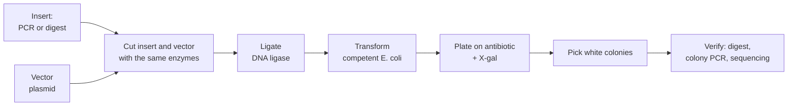

---
aliases:
  - Gene Cloning
  - DNA Cloning
  - Recombinant DNA
  - Recombinant DNA Technology
  - Clonage moléculaire
tags:
  - type/technique
  - domain/biology
  - domain/bioinformatics
  - level/L1
  - level/L2
mastery: 0
prerequisites:
  - "[[Restriction Enzyme]]"
  - "[[Plasmid]]"
  - "[[Polymerase Chain Reaction]]"
  - "[[Gene]]"
related:
  - "[[Gel Electrophoresis]]"
  - "[[Sanger Sequencing]]"
  - "[[Horizontal Gene Transfer]]"
  - "[[Operon]]"
  - "[[Reverse Transcription]]"
  - "[[Shotgun Sequencing]]"
  - "[[Gene Expression]]"
projects: []
sources:
  - "[[Biology 2e (OpenStax)]]"
  - "[[Microbiology (OpenStax)]]"
  - "[[Molecular Biology of the Cell (Alberts)]]"
  - "[[Molecular Cell Biology (Lodish)]]"
  - "[[MIT 7.01SC - Fundamentals of Biology]]"
  - "[[Lander 2001 - Initial Sequencing and Analysis of the Human Genome]]"
---

# Molecular Cloning

> [!abstract]
> Molecular cloning puts a DNA fragment into a vector, usually a plasmid, and lets bacteria copy it: every colony that grows on the selective plate carries identical copies of one recombinant molecule.

## Purpose

Isolate one DNA fragment and propagate it in unlimited identical copies, to sequence it, study it, or express the protein it encodes.[^os17][^alberts][^lodish] Recombinant DNA techniques are the core of introductory courses on biotechnology.[^mit701]

## Why it matters

- **Constructs are designed in silico.** Choosing enzymes that cut the vector once and the insert never, adding sites with PCR primers, predicting the recombinant sequence and its diagnostic digest: all are string computations done before any pipetting (Computational representation).
- **Plasmid maps and annotated construct files** (GenBank records of vectors and inserts) are bioinformatics data: features, coordinates on a circular molecule, sites ([[GenBank Format]]).
- **Genome projects were built on clones**: the public human genome was sequenced by a hierarchical, clone-based shotgun strategy ([[Shotgun Sequencing]]).[^lander]

## Principle

1. **Cut**: vector and insert are cut with the same restriction enzyme(s), so they carry complementary sticky ends ([[Restriction Enzyme]]).[^os17]
2. **Join**: the ends anneal and **DNA ligase** seals the backbones, producing a recombinant plasmid.[^os17][^alberts]
3. **Transform**: the ligation mixture is introduced into bacteria made competent to take up DNA.[^micro12]
4. **Select**: on a plate with the antibiotic, only cells that received a plasmid carrying the resistance gene form colonies.[^os17][^micro12]
5. **Screen**: blue-white screening tells plasmids with an insert from empty ones (Core).[^os17][^micro12]

A **vector** needs an origin of replication (so it is copied in the host), a selectable marker (usually an antibiotic resistance gene) and a multiple cloning site (MCS): a short stretch with several unique restriction sites.[^os17][^micro12]

![[cloning-vector-blue-white.svg]]

## Protocol overview



## Core (L1)

**Blue-white screening.** The MCS sits inside a fragment of the *lacZ* gene, which encodes β-galactosidase. An intact gene makes an enzyme that cleaves the colourless substrate X-gal into a blue product: colonies with an empty vector are blue. An insert in the MCS disrupts *lacZ*: colonies with a recombinant plasmid are white.[^os17][^micro12] The *lac* genes come from the classic bacterial [[Operon]].

**Reading a plate.**

| Colony | Plasmid | Meaning |
|---|---|---|
| none | none | cell did not take up a plasmid, killed by the antibiotic |
| blue | vector closed on itself | no insert |
| white | vector + insert | candidate clone, to verify |

**One colony, one clone.** A colony grows from a single transformed cell, so all its cells carry copies of the same plasmid molecule; picking a colony isolates one recombinant out of the mixture.[^os17]

**Directional cloning.** Cutting with two different enzymes gives two incompatible ends: the insert can enter in one orientation only, and the vector cannot close on itself. With a single enzyme, the insert enters in either orientation, and empty vectors re-close easily (Exercise 4).

## Deeper (L2)

- **Adding sites by PCR.** If the gene lacks convenient sites, PCR primers can carry the restriction sites as 5' tails, outside the region that anneals; the product then has the sites at its ends ([[Polymerase Chain Reaction]]).
- **The insert must survive the enzymes.** An enzyme that also cuts inside the insert would cut it in pieces: enzyme choice is a set intersection between "cuts the vector once, in the MCS" and "never cuts the insert" (code below).
- **Verification.** A white colony can still be wrong: a different fragment, a deletion, or a PCR error in the insert. Clones are checked by a diagnostic digest ([[Gel Electrophoresis]]) and finally by [[Sanger Sequencing]] of the insert.
- **Applications.** Expression vectors make bacteria produce a foreign protein, such as human insulin; cDNA made by reverse transcriptase from mRNA can be cloned to capture expressed genes without their introns ([[Reverse Transcription]], [[Gene Expression]]).[^micro12][^alberts] Bacteria also take up DNA naturally, by transformation, one route of [[Horizontal Gene Transfer]].[^micro12]

## Data produced

Clones (colonies, then purified plasmid DNA) and their verification data: digest patterns, sequencing reads of the insert. In silico, an annotated sequence file of the construct, with feature coordinates on a circular molecule.

## Analysis

Construct design (enzyme choice, primer tails), prediction of the recombinant sequence and its digests ([[Restriction Enzyme#Computational representation]]), and alignment of the insert's sequencing reads to the designed sequence ([[Sequence Alignment]]).

## Mathematical representation

- A circular vector $V$ of length $n$ with a cut set $C_e(V)$ for enzyme $e$. Usable enzymes for an insert region $I$: $\{e : |C_e(V)| = 1,\ C_e(V) \subset \mathrm{MCS},\ C_e(I) = \varnothing\}$.
- Directional cloning with cuts $v_1 < v_2$ in the vector and $i_1 < i_2$ in the insert: the recombinant is $V[0, v_1) \cdot X[i_1, i_2) \cdot V[v_2, n)$, of length $n - (v_2 - v_1) + (i_2 - i_1)$. Joining top strands at the cut coordinates reconstitutes both sites.
- Non-directional cloning: each insert enters in one of two orientations with probability $1/2$ (no preference), so among $k$ verified recombinants the probability of at least one correct orientation is $1 - 2^{-k}$.

## Computational representation

```python
COMPLEMENT = str.maketrans("ACGT", "TGCA")
ENZYMES = {"EcoRI": ("GAATTC", 1), "BamHI": ("GGATCC", 1),
           "HindIII": ("AAGCTT", 1), "PstI": ("CTGCAG", 5)}   # site, top-strand cut offset

def reverse_complement(seq: str) -> str:
    return seq.translate(COMPLEMENT)[::-1]

def cuts(seq: str, enzyme: str) -> list[int]:
    """Top-strand cut coordinates of a palindromic site."""
    site, offset = ENZYMES[enzyme]
    out, i = [], seq.find(site)
    while i != -1:
        out.append(i + offset)
        i = seq.find(site, i + 1)
    return out

def usable_enzymes(vector: str, mcs: tuple[int, int], keep: str) -> list[str]:
    """Enzymes that cut the vector exactly once, inside the MCS, and never inside `keep`."""
    ok = []
    for name in ENZYMES:
        v = cuts(vector, name)
        if len(v) == 1 and mcs[0] <= v[0] < mcs[1] and not cuts(keep, name):
            ok.append(name)
    return ok

def ligate(vector: str, insert: str, left: str, right: str) -> str:
    """Directional cloning: keep the vector outside its left..right cuts, insert in between."""
    v1, v2 = cuts(vector, left)[0], cuts(vector, right)[0]
    i1, i2 = cuts(insert, left)[0], cuts(insert, right)[0]
    return vector[:v1] + insert[i1:i2] + vector[v2:]

# Toy circular vector (invented, real ones are thousands of bp): backbone, MCS, backbone
left_bb, mcs, right_bb = "TTGACCTGCAGTTAC", "GAATTCATGGATCCTAAAGCTT", "CGTACCATGACTGCAGTCA"
vector = left_bb + mcs + right_bb
mcs_span = (len(left_bb), len(left_bb) + len(mcs))
# Gene of interest (invented) with an internal BamHI site
gene = "ATGGCTAGCGGATCCTTAGCAGTGCGTAAA"
# PCR adds sites in 5' primer tails: EcoRI before the gene, HindIII after it
product = "CG" + "GAATTC" + gene + "AAGCTT" + "GC"
print("vector", len(vector), "insert", len(product))
for name in ENZYMES:
    print(f"{name:8} vector cuts {cuts(vector, name)}  insert cuts {cuts(product, name)}")
print("usable:", usable_enzymes(vector, mcs_span, gene))

recombinant = ligate(vector, product, "EcoRI", "HindIII")
print(len(recombinant), recombinant)
# Check: EcoRI + HindIII digest of the circular recombinant releases the insert
c = sorted(cuts(recombinant, "EcoRI") + cuts(recombinant, "HindIII"))
print(c, [c[1] - c[0], len(recombinant) - c[1] + c[0]])
print(gene in recombinant, reverse_complement(gene) in recombinant)
```

```text
vector 56 insert 46
EcoRI    vector cuts [16]  insert cuts [3]
BamHI    vector cuts [24]  insert cuts [18]
HindIII  vector cuts [32]  insert cuts [39]
PstI     vector cuts [10, 52]  insert cuts []
usable: ['EcoRI', 'HindIII']
76 TTGACCTGCAGTTACGAATTCATGGCTAGCGGATCCTTAGCAGTGCGTAAAAAGCTTCGTACCATGACTGCAGTCA
[16, 52] [36, 40]
True False
```

Cut offsets are those of [[Restriction Enzyme#Core (L1)]]. The last line confirms the gene sits in the recombinant in the designed orientation.

## Worked example

> [!example] Choosing enzymes for the toy construct (invented sequences)
> 1. **Vector**: EcoRI, BamHI and HindIII each cut once, inside the MCS; PstI cuts twice in the backbone and would destroy the vector: excluded.
> 2. **Gene**: contains a BamHI site (`GGATCC` at gene position 9): BamHI would cut the insert: excluded.
> 3. **Design**: EcoRI and HindIII, added by PCR as primer tails on each side of the gene. Two different ends make the cloning directional.
> 4. **Ligation product**: $56 - (32 - 16) + (39 - 3) = 76$ bp; both sites are reconstituted at the junctions.
> 5. **Verification plan**: EcoRI + HindIII digest should release a 36 bp insert from a 40 bp backbone (on a real vector: an insert band plus a large vector band), then sequence across both junctions.

## Limitations and biases

> [!warning] What can go wrong
> - Empty vectors that re-close give background colonies; blue-white screening flags them only if the MCS sits in *lacZ*.[^os17]
> - White is necessary, not sufficient: wrong or mutated inserts also give white colonies. Sequencing is the only full check.
> - A digest checks fragment sizes, not bases: an insert with a point mutation from PCR gives the same pattern ([[Polymerase Chain Reaction#Advanced (L3)]]).

## Common misconceptions

> [!warning] "The antibiotic selects recombinant plasmids"
> It selects cells that contain **a** plasmid. Empty vectors carry the resistance gene too; telling them apart is the job of screening (blue-white) and verification.[^os17][^micro12]

> [!warning] "Cloning means copying an organism"
> Molecular cloning copies a DNA molecule. The word comes from the clone of identical cells that grows from one transformed bacterium, each carrying the same recombinant plasmid.[^os17]

> [!warning] "Any enzyme in the MCS will do"
> The enzyme must also be absent from the insert, and from the rest of the vector. Checking this is a sequence search, done before ordering primers.

## History and variants

- **Libraries.** Cloning many fragments at once gives a library: genomic libraries (fragments of a genome) or cDNA libraries (copies of mRNAs).[^alberts] Large-insert clones were the units of the hierarchical shotgun strategy of the public human genome project ([[Shotgun Sequencing]]).[^lander]

## Exercises

> [!question] Exercise 1 (L1)
> Give the role of each vector element: origin of replication, antibiotic resistance gene, multiple cloning site, *lacZ* fragment.

> [!success]- Solution
> The origin lets the plasmid be copied in the host, so it is inherited by every cell of the colony. The resistance gene lets only plasmid-carrying cells grow on the antibiotic (selection). The MCS offers unique sites where the insert can go. The *lacZ* fragment around the MCS reports whether an insert disrupted it (blue = empty, white = insert).[^os17][^micro12]

> [!question] Exercise 2 (L1)
> After transformation you see (a) no colonies at all, (b) only blue colonies, (c) many white and a few blue colonies. Interpret each plate.

> [!success]- Solution
> (a) No cell took up a plasmid (or the cells were not viable): check competent cells and the antibiotic. (b) Plasmids got in but none carries an insert: the insert was not ligated (wrong ends, insert cut internally, ligation failed). (c) The expected result: white colonies are candidate recombinants, blue ones re-closed empty vectors.

> [!question] Exercise 3 (L2)
> Why does directional cloning with EcoRI + HindIII give fewer empty-vector colonies than cloning with EcoRI alone?

> [!success]- Solution
> With EcoRI alone, the two ends of the cut vector are complementary (`AATT` overhangs), so the vector re-closes on itself easily. With EcoRI + HindIII the two vector ends carry incompatible overhangs (`AATT` and `AGCT`), so the vector closes efficiently only by capturing an insert with both ends.

> [!question] Exercise 4 (L2, Python)
> Clone the toy gene with EcoRI at both ends (single-enzyme cloning). Build both orientations and show that a BamHI digest distinguishes them (one BamHI site is in the MCS, one inside the gene). How many verified recombinants must you pick to have at least a 95 % chance of one in the correct orientation?

> [!success]- Solution
> ```python
> fwd_ins = "GAATTC" + gene + "GAATTC"
> v = cuts(vector, "EcoRI")[0]
> for name, ins in (("forward", fwd_ins), ("reverse", reverse_complement(fwd_ins))):
>     i1, i2 = cuts(ins, "EcoRI")
>     rec = vector[:v] + ins[i1:i2] + vector[v:]
>     # diagnostic digest with BamHI (vector MCS site + internal gene site)
>     bc = sorted(cuts(rec, "BamHI"))
>     print(name, len(rec), bc, [bc[1] - bc[0], len(rec) - bc[1] + bc[0]])
>
> k = 1
> while 1 - 0.5 ** k < 0.95:
>     k += 1
> print(k, round(1 - 0.5 ** k, 4))
> ```
> ```text
> forward 92 [31, 60] [29, 63]
> reverse 92 [37, 60] [23, 69]
> 5 0.9688
> ```
> The two orientations give different BamHI fragments (29 + 63 vs 23 + 69 bp), because the internal site moves relative to the MCS site when the insert flips. With probability 1/2 per clone, 5 clones give $1 - 2^{-5} = 0.969 \ge 0.95$.

## Mastery checklist

- [ ] 1 Recognized: I can list the steps cut, ligate, transform, select, screen, verify.
- [ ] 2 Understood: I can explain each vector element, blue-white screening, and directional vs single-enzyme cloning.
- [ ] 3 Practiced: I can choose enzymes, predict a recombinant sequence and design a diagnostic digest in code.
- [ ] 4 Applied: I designed a construct on a real vector sequence from GenBank, with primers carrying restriction sites, and checked it against the gene sequence.
- [ ] 5 Explained: I can explain why white colonies still need sequencing, and how design choices (one or two enzymes, primer tails, screening) change what grows on the plate.

## References

[^os17]: [[Biology 2e (OpenStax)]], ch. 17 "Biotechnology and Genomics" (molecular cloning, plasmids, blue-white screening).
[^micro12]: [[Microbiology (OpenStax)]], ch. 12 "Modern Applications of Microbial Genetics" (tools of genetic engineering, transformation, blue-white screening, recombinant proteins).
[^alberts]: [[Molecular Biology of the Cell (Alberts)]], 4th ed. (2002), methods for manipulating DNA (DNA cloning, ligase, genomic and cDNA libraries).
[^lodish]: [[Molecular Cell Biology (Lodish)]], 4th ed. (2000), recombinant DNA.
[^mit701]: [[MIT 7.01SC - Fundamentals of Biology]], recombinant DNA unit.
[^lander]: [[Lander 2001 - Initial Sequencing and Analysis of the Human Genome]], *Nature*, sequencing strategy.
