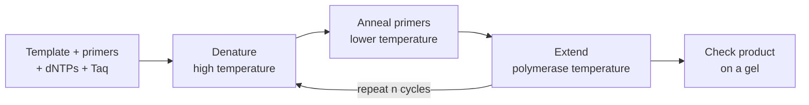

---
aliases:
  - PCR
  - Primer
  - Primer Design
  - Taq Polymerase
  - Réaction en chaîne par polymérase
tags:
  - type/technique
  - domain/biology
  - domain/bioinformatics
  - level/L1
  - level/L2
  - level/L3
mastery: 0
prerequisites:
  - "[[DNA Replication]]"
  - "[[Base Pairing]]"
  - "[[Reverse Complement]]"
  - "[[GC Content]]"
  - "[[Exponential Function]]"
related:
  - "[[Gel Electrophoresis]]"
  - "[[Molecular Cloning]]"
  - "[[Sanger Sequencing]]"
  - "[[Quantitative Polymerase Chain Reaction]]"
  - "[[Reverse Transcription]]"
  - "[[Sequencing Library Preparation]]"
  - "[[Amplicon Sequencing]]"
  - "[[Exact Pattern Matching]]"
  - "[[Exponential Growth]]"
projects: []
sources:
  - "[[Biology 2e (OpenStax)]]"
  - "[[Microbiology (OpenStax)]]"
  - "[[Molecular Biology of the Cell (Alberts)]]"
  - "[[Biochemistry (Berg)]]"
  - "[[Saiki 1988 - Primer-Directed Enzymatic Amplification of DNA]]"
  - "[[Untergasser 2012 - Primer3 New Capabilities and Interfaces]]"
  - "[[Nurk 2022 - The Complete Sequence of a Human Genome]]"
  - "[[Lander 2001 - Initial Sequencing and Analysis of the Human Genome]]"
---

# Polymerase Chain Reaction

> [!abstract]
> PCR copies one chosen stretch of DNA again and again in a tube: two short primers mark its ends, and cycles of heating and cooling let a heat-stable polymerase double it each cycle, turning a few molecules into billions.

## Purpose

Amplify a specific DNA segment, defined by two primers, from a complex sample (a genome, a tissue, a trace), to detect it, clone it, sequence it or measure it.[^os17][^micro12][^saiki]

## Why it matters

- **Most sequencing data passes through PCR**: Sanger reactions start from amplified templates, sequencing libraries are usually amplified, and amplicon panels are pure PCR ([[Sanger Sequencing]], [[Sequencing Library Preparation]], [[Amplicon Sequencing]]). Its artifacts become data artifacts.
- **Primer design is a computational task**: checking length, composition, uniqueness in the genome and complementarity between primers is string processing ([[Exact Pattern Matching]], [[Reverse Complement]]); tools such as Primer3 automate it with thermodynamic models.[^primer3]
- **Quantitative PCR** turns the exponential growth into a measurement of starting quantity ([[Quantitative Polymerase Chain Reaction]]).

## Principle

PCR is [[DNA Replication]] made cyclic.[^saiki][^alberts] A reaction contains the template DNA, two **primers** (short single-stranded oligonucleotides complementary to the two ends of the target, on opposite strands), the four dNTPs and a heat-stable DNA polymerase. Each cycle has three steps:[^os17][^saiki]

1. **Denaturation**: heating separates the two strands of every duplex.
2. **Annealing**: cooling lets each primer pair with its complementary site.
3. **Extension**: the polymerase extends each primer 5' → 3' from its 3'-OH, copying the template.

The polymerase, Taq, comes from the thermophilic bacterium *Thermus aquaticus* and survives the denaturation step, so it is added once rather than every cycle.[^os17][^saiki] Because each new strand starts at a primer and can serve as template for the other primer, the region between the primers is copied exponentially.

## Protocol overview



The exact temperatures depend on the polymerase and on the primers' melting temperatures; the number of cycles $n$ depends on the starting amount.

## Core (L1)

**Where the primers go.** Both primers are written 5' → 3'. The forward primer is a copy of the top strand at the left end of the target; the reverse primer is the [[Reverse Complement]] of the top strand at the right end.[^os17] Toy template (invented):

```text
                                           3'-ACCTTAGCAGTTCCGAATGC-5'  reverse primer
                                              ||||||||||||||||||||
top     5'-GATTACAGGCTTCAGCTAGTCCGATTG...TTACCTGGAATCGTCAAGGCTTACGTA-3'
bottom  3'-CTAATGTCCGAAGTCGATCAGGCTAAC...AATGGACCTTAGCAGTTCCGAATGCAT-5'
                ||||||||||||||||||||
             5'-CAGGCTTCAGCTAGTCCGAT-3'  forward primer
```

Each primer points its 3' end toward the other: extension from both sides covers the target. The product runs from the 5' end of one primer to the 5' end of the other, primers included.

**Doubling.** In the ideal case each cycle doubles the target: $N_n = N_0\,2^n$, or $N_0(1+\varepsilon)^n$ with efficiency $\varepsilon$ (derived and computed in [[DNA Replication#Mathematical representation]]). Taq PCR amplified single-copy genomic sequences more than 10 million-fold, amplified segments up to 2,000 bp, and detected a target present once in $10^5$ cells.[^saiki]

**What makes a usable primer pair** (each criterion follows from the mechanism):

| Criterion | Reason |
|---|---|
| Long enough to be unique in the genome | A primer that also matches elsewhere amplifies other products (Exercise 5) |
| Similar melting temperatures for the two primers | One annealing temperature must suit both |
| Moderate GC content | Melting temperature rises with GC content;[^berg] extremes make annealing too weak or too permissive |
| No complementarity at the 3' ends, with itself or the partner | The polymerase extends any paired 3' end, making primer dimers ([[Base Pairing#Advanced (L3)]]) |
| No internal hairpin | A primer folded on itself cannot anneal |

## Deeper (L2)

**Why the product has fixed ends.** In cycle 1 the primers copy the original strands into "long" strands that start at a primer but run past the other site. Only when a long strand is itself copied does a strand appear that starts and ends at the primers. From one duplex, after $n$ ideal cycles there are 2 original strands, $2n$ long strands and $2^{n+1} - 2n - 2$ exact-length strands, of which $2^n - 2n$ duplexes are exact on both strands (computed below). After 30 cycles, exact products are more than 99.9999 % of the duplexes: the gel shows one band of the predicted length.

**Specificity and temperature.** A primer binds its exact site most stably, but at low temperature it also binds sites with mismatches. Running the reaction at higher temperatures, which a thermostable enzyme allows, improved specificity, yield, sensitivity and product length compared with earlier PCR.[^saiki] Design tools predict melting temperature with thermodynamic (nearest-neighbour) models, which account for the stacking of adjacent base pairs rather than only counting G and C, and score the risk of hairpins and dimers the same way.[^primer3] See [[DNA#Deeper (L2)]] for stacking.

**Variants.** RT-PCR first copies RNA into cDNA with reverse transcriptase ([[Reverse Transcription]]), so RNA can be amplified.[^os17] Quantitative PCR follows the product in real time ([[Quantitative Polymerase Chain Reaction]]).

## Advanced (L3)

- **Errors accumulate over cycles.** If the polymerase misincorporates with probability $\mu$ per base per copy, half the strands are new copies at each cycle, so the per-base error frequency of a strand grows by $\mu/2$ per cycle: about $n\mu/2$ after $n$ cycles, or about $n\mu L$ errors per double-stranded product of length $L$. Few cycles and proofreading polymerases limit this ([[DNA Replication#Deeper (L2)]] for proofreading).
- **Amplification is not neutral.** Any efficiency difference between templates is raised to the power $n$: two templates amplified at $\varepsilon = 0.95$ and $0.90$ change their ratio by $(1.95/1.90)^{30} \approx 2.2$ in 30 cycles. The consequences for sequencing data are treated in [[Sequencing Library Preparation]], [[Duplicate Read]] and [[Amplicon Sequencing]].

## Data produced

An amplified product, checked by its size on a gel ([[Gel Electrophoresis]]) and often by [[Sanger Sequencing]]; in silico, a primer pair, its binding sites and the predicted product length.

## Mathematical representation

- Template top strand $T$ of length $n$; forward primer $f = T[i..i+k_f)$; reverse primer $r = \mathrm{rc}(T[j..j+k_r))$ with $j > i$. Product length $\ell = j + k_r - i$.
- Strand counts per ideal cycle (from one duplex): original $O_n = 2$, long $L_n = L_{n-1} + O_{n-1} = 2n$, exact $E_n = E_{n-1} + L_{n-1} + E_{n-1}$, which solves to $E_n = 2^{n+1} - 2n - 2$. Exact duplexes after cycle $n$: $E_{n-1} = 2^n - 2n$.
- **Chance binding.** Under the random model with uniform bases, a given $k$-mer is expected $2G/4^k$ times in a genome of $G$ bp, counting both strands. For the human genome, $G \approx 3.055 \times 10^9$ bp:[^nurk] $k = 16$ gives about 1.4 chance sites, $k = 20$ about 0.006 (Exercise 5). Real genomes are full of repeats,[^lander] so uniqueness must be checked by search, not assumed.

## Computational representation

```python
COMPLEMENT = str.maketrans("ACGT", "TGCA")

def reverse_complement(seq: str) -> str:
    return seq.translate(COMPLEMENT)[::-1]

def gc_fraction(seq: str) -> float:
    return (seq.count("G") + seq.count("C")) / len(seq)

def binding_sites(template: str, primer: str) -> list[tuple[int, str]]:
    """Exact sites on the top strand ('+') or bottom strand ('-'), top-strand 0-based starts."""
    hits = []
    for strand, word in (("+", primer), ("-", reverse_complement(primer))):
        i = template.find(word)
        while i != -1:
            hits.append((i, strand))
            i = template.find(word, i + 1)
    return hits

def three_prime_pairs(a: str, b: str, k: int = 4) -> bool:
    """True if the last k bases of primer a can pair with some k-window of primer b."""
    return a[-k:] in reverse_complement(b)

def check_pair(template, fwd, rev, length=(18, 25), gc=(0.40, 0.60), max_gc_gap=0.10):
    """Illustrative design checks (thresholds chosen for this note, not a standard)."""
    report = {}
    for name, p in (("fwd", fwd), ("rev", rev)):
        report[name] = {
            "len_ok": length[0] <= len(p) <= length[1],
            "gc": round(gc_fraction(p), 2),
            "gc_ok": gc[0] <= gc_fraction(p) <= gc[1],
            "sites": binding_sites(template, p),
            "3'_self": three_prime_pairs(p, p),
        }
    report["gc_gap_ok"] = abs(gc_fraction(fwd) - gc_fraction(rev)) <= max_gc_gap
    report["3'_dimer"] = three_prime_pairs(fwd, rev) or three_prime_pairs(rev, fwd)
    (f_start, f_strand), (r_start, r_strand) = report["fwd"]["sites"][0], report["rev"]["sites"][0]
    if f_strand == "+" and r_strand == "-" and r_start > f_start:
        report["product_bp"] = r_start + len(rev) - f_start
    return report


template = ("GATTACAGGCTTCAGCTAGTCCGATTGCAGTTCGAAGCTGACCTTAGCAAGTCC"
            "GGTATCACTGGAAGCTTCGCATGACGTTACCTGGAATCGTCAAGGCTTACGTA")   # invented, 107 bp
fwd = template[5:25]                       # first 20 nt of the target, as written
rev = reverse_complement(template[85:105])  # reverse complement of the last 20 nt
print(len(template), fwd, rev)
for key, value in check_pair(template, fwd, rev).items():
    print(key, value)

# Ideal cycles from one double-stranded template: count strands by kind
def cycle_counts(n_cycles: int):
    original, long_, exact = 2, 0, 0
    rows = []
    for n in range(1, n_cycles + 1):
        exact_duplexes = exact          # exact strands copied this cycle pair with exact templates
        # original -> long copy; long -> exact copy; exact -> exact copy
        long_, exact = long_ + original, exact + long_ + exact
        rows.append((n, original, long_, exact, exact_duplexes, 2 ** n - 2 * n))
    return rows

for row in cycle_counts(5):
    print(row)
n = 30
print(n, 2 ** n - 2 * n, round((2 ** n - 2 * n) / 2 ** n, 9))
```

```text
107 CAGGCTTCAGCTAGTCCGAT CGTAAGCCTTGACGATTCCA
fwd {'len_ok': True, 'gc': 0.55, 'gc_ok': True, 'sites': [(5, '+')], "3'_self": False}
rev {'len_ok': True, 'gc': 0.5, 'gc_ok': True, 'sites': [(85, '-')], "3'_self": False}
gc_gap_ok True
3'_dimer False
product_bp 100
(1, 2, 2, 0, 0, 0)
(2, 2, 4, 2, 0, 0)
(3, 2, 6, 8, 2, 2)
(4, 2, 8, 22, 8, 8)
(5, 2, 10, 52, 22, 22)
30 1073741764 0.999999944
```

Each row is (cycle, original, long, exact strands, exact duplexes simulated, $2^n - 2n$): the simulation matches the formula. A real design also checks the genome, not just the template, and estimates melting temperatures thermodynamically (Primer3).[^primer3]

## Worked example

> [!example] Designing and checking the toy pair
> 1. **Target**: positions 5 to 104 of the 107 bp invented template.
> 2. **Forward primer** = top strand 5..24: `CAGGCTTCAGCTAGTCCGAT` (20 nt, GC 0.55).
> 3. **Reverse primer** = reverse complement of top strand 85..104 (`TGGAATCGTCAAGGCTTACG`): `CGTAAGCCTTGACGATTCCA` (20 nt, GC 0.50).
> 4. **Checks**: each primer has exactly one site, on the expected strand; GC values differ by 0.05, so their melting temperatures should be close; no 3' end 4-mer pairs with itself or the partner.
> 5. **Expected product**: $85 + 20 - 5 = 100$ bp, one band near 100 bp on a gel next to a ladder ([[Gel Electrophoresis]]).

## Limitations and biases

> [!warning] What PCR distorts
> - Any difference in efficiency between templates is amplified exponentially, so relative amounts in a mixture are not preserved (L3 above).
> - Polymerase errors are copied into later cycles (L3 above); products used for cloning or variant detection need verification by sequencing.
> - Mispriming and primer dimers create extra bands; a single contaminating molecule is amplified like the target, hence the no-template control ([[Gel Electrophoresis#Core (L1)]]).
> - PCR needs known sequence at both ends of the target: it cannot amplify what nobody has sequenced around.

## Common misconceptions

> [!warning] "The reverse primer is the complement of the end of the target"
> It is the **reverse** complement. Written as the plain complement, it would be read 3' → 5' and could not be synthesized or extended as written ([[Reverse Complement]]).

> [!warning] "After n cycles there are exactly 2ⁿ copies of the target"
> Only in the ideal case; with efficiency $\varepsilon < 1$ the factor per cycle is $1 + \varepsilon$ ([[DNA Replication#Mathematical representation]]). And during the first cycles most new strands are longer than the target (Deeper section).

> [!warning] "Longer primers are always better"
> Length beyond uniqueness adds little specificity but raises melting temperature, and a longer primer has more chances to fold or pair with its partner. The goal is a unique, well-matched pair, not maximal length.

## History and variants

> [!info] From Klenow to Taq
> PCR was first described with the Klenow fragment of *E. coli* DNA polymerase, which is destroyed at denaturation temperature and had to be added at every cycle. Saiki and colleagues' 1988 switch to the heat-stable polymerase of *Thermus aquaticus* made PCR simple, automatable and more specific. Kary Mullis, a co-author, received the 1993 Nobel Prize in Chemistry for inventing PCR.[^saiki]

## Exercises

> [!question] Exercise 1 (L1)
> Name the three steps of a PCR cycle, what happens to the DNA in each, and why a polymerase from a hot-spring bacterium made PCR practical.

> [!success]- Solution
> Denaturation (strands separate), annealing (primers pair with their sites), extension (polymerase extends primers 5' → 3'). Denaturation needs heat that destroys ordinary polymerases; Taq from *Thermus aquaticus* survives it, so it is added once instead of every cycle.[^saiki]

> [!question] Exercise 2 (L1)
> A target reads (top strand, invented) `5'-ATGCCGTTAGCATCGGATCA ... TTCGAGGCATACCGTTAGCA-3'`. Write a 20-nt forward and reverse primer, both 5' → 3'.

> [!success]- Solution
> Forward = first 20 bases of the top strand: `ATGCCGTTAGCATCGGATCA`. Reverse = reverse complement of the last 20: `TGCTAACGGTATGCCTCGAA`. Check: `reverse_complement("TGCTAACGGTATGCCTCGAA")` returns `TTCGAGGCATACCGTTAGCA`.

> [!question] Exercise 3 (L2, Python)
> With `three_prime_pairs`, test the invented pair `AGTCCGATTGCAGTTCGGCC` / `TTACGATCCAGGTAGGCCGA`, including each primer against itself. Explain the result.

> [!success]- Solution
> ```python
> bad_fwd, bad_rev = "AGTCCGATTGCAGTTCGGCC", "TTACGATCCAGGTAGGCCGA"
> print(three_prime_pairs(bad_fwd, bad_rev), three_prime_pairs(bad_rev, bad_fwd), three_prime_pairs(bad_fwd, bad_fwd))
> print(bad_fwd[-4:], reverse_complement(bad_fwd), reverse_complement(bad_rev))
> ```
> ```text
> True True True
> GGCC GGCCGAACTGCAATCGGACT TCGGCCTACCTGGATCGTAA
> ```
> The forward 3' end `GGCC` is a reverse palindrome, so two forward primers pair with each other by their 3' ends; it also pairs inside the reverse primer, whose 3' end `CCGA` pairs inside the forward primer. The polymerase would extend these duplexes into short primer-dimer products that compete with the target. Redesign at least the forward primer's 3' end.

> [!question] Exercise 4 (L2)
> Starting from one duplex, how many exact-length duplexes exist after 3, 4 and 10 ideal cycles? Why is the first exact duplex only produced in cycle 3?

> [!success]- Solution
> $2^n - 2n$: 2, 8 and $1024 - 20 = 1004$. Cycle 1 makes long strands from the originals; cycle 2 makes the first exact strands, but by copying long strands, so they sit in exact/long duplexes; cycle 3 is the first in which an exact strand serves as template, giving a duplex exact on both strands.

> [!question] Exercise 5 (L3, Python)
> Under the uniform random model, how many chance sites does a $k$-mer have in the human genome ($G = 3.055 \times 10^9$ bp, both strands) for $k$ = 12, 16, 18, 20, 22? Then, with an illustrative error rate $\mu = 10^{-5}$ or $10^{-4}$ per base per copy, estimate errors per 500 bp duplex after 30 cycles.

> [!success]- Solution
> ```python
> G = 3.055e9
> for k in (12, 16, 18, 20, 22):
>     print(k, f"{2 * G / 4 ** k:.3g}")
> for mu in (1e-5, 1e-4):
>     print(mu, round(500 * 30 * mu, 3))
> ```
> ```text
> 12 364
> 16 1.42
> 18 0.0889
> 20 0.00556
> 22 0.000347
> 1e-05 0.15
> 0.0001 1.5
> ```
> Around 18 to 20 nt, a random primer is expected to be unique, which is why primers have that length; repeats break the model, so a genome search is still needed. With $\mu = 10^{-4}$, a typical product would carry about one error: clones made from PCR products must be sequenced, and high-fidelity enzymes matter for cloning.

## Mastery checklist

- [ ] 1 Recognized: I can name the reagents and the three steps of a cycle.
- [ ] 2 Understood: I can explain primer orientation, exponential amplification, why the product has fixed ends and why Taq made PCR practical.
- [ ] 3 Practiced: I can design a primer pair by hand and check it in code (sites, composition, 3' complementarity, product size).
- [ ] 4 Applied: I designed primers for a real gene from a reference sequence, checked them with Primer3 and searched the genome for off-target sites.
- [ ] 5 Explained: I can explain PCR's biases (efficiency, errors, contamination) and how they appear in sequencing data.

## References

[^os17]: [[Biology 2e (OpenStax)]], ch. 17 "Biotechnology and Genomics" (PCR, primers, Taq polymerase, RT-PCR).
[^micro12]: [[Microbiology (OpenStax)]], ch. 12 "Modern Applications of Microbial Genetics".
[^alberts]: [[Molecular Biology of the Cell (Alberts)]], 4th ed. (2002), methods for manipulating DNA (PCR).
[^berg]: [[Biochemistry (Berg)]], 5th ed. (2002).
[^saiki]: [[Saiki 1988 - Primer-Directed Enzymatic Amplification of DNA]], *Science* 239:487-491, abstract and method; history from the source note.
[^primer3]: [[Untergasser 2012 - Primer3 New Capabilities and Interfaces]], *Nucleic Acids Research*, abstract.
[^nurk]: [[Nurk 2022 - The Complete Sequence of a Human Genome]], *Science*.
[^lander]: [[Lander 2001 - Initial Sequencing and Analysis of the Human Genome]], *Nature*, repeats.
