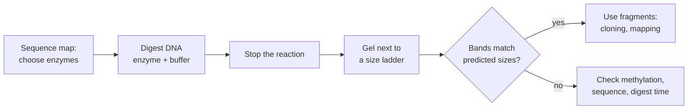

---
aliases:
  - Restriction Endonuclease
  - Restriction Nuclease
  - Restriction Site
  - Restriction Digest
  - Enzyme de restriction
tags:
  - type/technique
  - domain/biology
  - domain/bioinformatics
  - level/L1
  - level/L2
mastery: 0
prerequisites:
  - "[[DNA]]"
  - "[[Base Pairing]]"
  - "[[Reverse Complement]]"
  - "[[Enzyme]]"
related:
  - "[[Gel Electrophoresis]]"
  - "[[Molecular Cloning]]"
  - "[[Sequence Motif]]"
  - "[[Exact Pattern Matching]]"
  - "[[Bacteriophage]]"
  - "[[DNA Methylation]]"
  - "[[Single Nucleotide Polymorphism]]"
  - "[[Geometric Distribution]]"
projects: []
sources:
  - "[[Biology 2e (OpenStax)]]"
  - "[[Microbiology (OpenStax)]]"
  - "[[Molecular Biology of the Cell (Alberts)]]"
  - "[[REBASE]]"
  - "[[NobelPrize.org]]"
  - "[[Blattner 1997 - The Complete Genome Sequence of Escherichia coli K-12]]"
---

# Restriction Enzyme

> [!abstract]
> A restriction enzyme is a bacterial nuclease that recognizes a short DNA sequence, often a reverse palindrome, and cuts both strands at a fixed position in it: the molecular scissors of recombinant DNA.

## Purpose

Cut DNA reproducibly at known sequences, to produce defined fragments for [[Molecular Cloning]], to check or map a DNA molecule by the sizes of its fragments on a gel ([[Gel Electrophoresis]]), and to detect sequence differences that create or destroy a site.[^os17][^micro12]

## Why it matters

- **Site finding is string search.** Locating restriction sites is [[Exact Pattern Matching]] of a [[Sequence Motif]] on both strands; a palindromic site needs only one strand ([[Reverse Complement]]).
- **In silico digest.** From a sequence and a list of enzymes, code predicts the fragment sizes, hence the bands expected on a gel. Comparing prediction and gel is how a construct is verified before sequencing.
- **Choosing enzymes is a design problem**: an enzyme must cut the vector where wanted and never inside the insert, which is checked computationally ([[Molecular Cloning]]).
- **Curated data.** Recognition and cleavage sites come from [[REBASE]], the reference database that restriction-site software relies on.[^rebase]

## Principle

- **Biological role.** Bacteria make restriction enzymes to destroy foreign DNA, such as that of infecting [[Bacteriophage|phages]]. The cell protects its own DNA by methylating the same sites with a matching methyltransferase: together they form a **restriction-modification system**.[^alberts][^rebase]
- **Recognition.** Each enzyme binds one specific short sequence (6 base pairs for the enzymes in the table below). Many sites are **reverse palindromes** (equal to their own reverse complement, like `GAATTC`), recognized by enzymes acting as symmetric dimers.[^alberts][^os17]
- **Cutting.** The enzyme hydrolyzes one phosphodiester bond in each strand. A **staggered** cut leaves short single-stranded overhangs, **sticky ends**, that can re-pair with any end made by the same enzyme; a cut straight across leaves **blunt ends**.[^os17][^alberts]

![[restriction-enzyme-cut-ends.svg]]

## Protocol overview



## Core (L1)

**Notation.** A caret marks the cut on the top strand, read 5' → 3'. For a palindromic site the bottom-strand cut is the mirror image, so one caret describes both.[^rebase]

| Enzyme | Site and cut | Ends left |
|---|---|---|
| EcoRI | `G^AATTC` | 5' overhang `AATT`[^os17][^alberts] |
| BamHI | `G^GATCC` | 5' overhang `GATC`[^rebase] |
| HindIII | `A^AGCTT` | 5' overhang `AGCT`[^rebase] |
| SmaI | `CCC^GGG` | blunt[^rebase] |
| PstI | `CTGCA^G` | 3' overhang `TGCA`[^rebase] |

**Sticky ends are generic.** Any two `AATT` overhangs pair, whatever DNA they come from: this is what lets a fragment cut by EcoRI be joined into a vector cut by EcoRI ([[Molecular Cloning]]).[^os17]

**Counting fragments.** $m$ cuts in a **linear** molecule give $m + 1$ fragments; in a **circular** molecule (a plasmid) they give $m$, and a single cut only linearizes it.

## Deeper (L2)

- **Expected frequency.** In random sequence with independent bases of probabilities $p_b$, a site $s$ starts at a given position with probability $q = \prod_i p_{s_i}$: $4^{-4} = 1/256$ for a 4-base site and $4^{-6} = 1/4096$ for a 6-base site at uniform composition ([[Reverse Complement#Mathematical representation]] counts the palindromic k-mers). Composition shifts these rates: an AT-rich site is rare in a GC-rich genome (Exercise 3). The spacing between sites is then approximately geometric with mean $1/q$ ([[Geometric Distribution]]), so a digest gives a broad spread of fragment sizes.
- **Methylation sensitivity.** Methylation of a site, the very mechanism that protects the host, can block cutting by some enzymes; REBASE records this sensitivity for each enzyme.[^rebase] A plasmid prepared from a bacterial strain that methylates a site may therefore resist digestion ([[DNA Methylation]]).
- **Polymorphic sites.** A single-base variant inside a site abolishes cutting, which changes the fragment pattern: restriction fragment length polymorphisms (RFLPs) were early genetic markers ([[Single Nucleotide Polymorphism]]).[^micro12][^os17]
- **Restriction mapping.** Fragment sizes from single and double digests constrain the order of the sites; the map is a combinatorial puzzle with symmetric solutions (Exercise 4). Mapping genomes with restriction enzymes is part of what the 1978 Nobel Prize recognized.[^nobel]

## Data produced

Cut coordinates and fragment lengths, observed as bands on a gel; sticky ends add an overhang sequence, which matters for ligation. Downstream analysis compares predicted and observed sizes ([[Gel Electrophoresis#Computational representation]]).

## Mathematical representation

- A site is a word $s \in \Sigma^k$ with a cut offset $c$ ($0 \le c \le k$) on the top strand. If $s = \mathrm{rc}(s)$, the bottom-strand cut is at offset $k - c$ in top-strand coordinates. The overhang has length $|k - 2c|$: a **5' overhang** if $c < k/2$, **blunt** if $c = k/2$, a **3' overhang** if $c > k/2$. EcoRI: $k = 6$, $c = 1$, overhang of 4 bases, 5'.
- With sorted cut coordinates $0 < x_1 < \dots < x_m < n$ in a sequence of length $n$, the linear fragments are $x_1, x_2 - x_1, \dots, n - x_m$ ($m + 1$ values summing to $n$). For a circular molecule, replace the two end pieces by the single piece $n - x_m + x_1$ ($m$ values).
- Expected number of sites in random sequence: $E = (n - k + 1)\,q$.

## Computational representation

A digest is a both-strand search followed by a cumulative difference. Cut offsets below are taken from REBASE.[^rebase]

```python
COMPLEMENT = str.maketrans("ACGT", "TGCA")

def reverse_complement(seq: str) -> str:
    return seq.translate(COMPLEMENT)[::-1]

# name: (recognition site 5'->3', cut offset on the top strand after site start)
ENZYMES = {
    "EcoRI": ("GAATTC", 1),    # G^AATTC
    "BamHI": ("GGATCC", 1),    # G^GATCC
    "HindIII": ("AAGCTT", 1),  # A^AGCTT
    "SmaI": ("CCCGGG", 3),     # CCC^GGG
    "PstI": ("CTGCAG", 5),     # CTGCA^G
}

def end_type(site: str, cut: int) -> str:
    """Overhang left by a palindromic site cut at `cut` on the top strand."""
    k = len(site)
    if 2 * cut == k:
        return "blunt"
    kind = "5'" if 2 * cut < k else "3'"
    lo, hi = sorted((cut, k - cut))
    return f"{kind} overhang {site[lo:hi]}"

def find_sites(seq: str, site: str) -> list[int]:
    """0-based starts of every occurrence on either strand (overlaps included)."""
    hits = set()
    for pattern in {site, reverse_complement(site)}:
        i = seq.find(pattern)
        while i != -1:
            hits.add(i)
            i = seq.find(pattern, i + 1)
    return sorted(hits)

def cut_positions(seq: str, names: list[str]) -> list[int]:
    """Top-strand cut coordinates (a cut at p separates seq[:p] from seq[p:])."""
    cuts = set()
    for name in names:
        site, cut = ENZYMES[name]
        cuts.update(i + cut for i in find_sites(seq, site))
    return sorted(cuts)

def digest(seq: str, names: list[str], circular: bool = False) -> list[int]:
    """Fragment lengths, largest first, as a gel would order them."""
    cuts, n = cut_positions(seq, names), len(seq)
    if not cuts:
        return [n]
    if circular:
        sizes = [b - a for a, b in zip(cuts, cuts[1:])] + [n - cuts[-1] + cuts[0]]
    else:
        bounds = [0] + cuts + [n]
        sizes = [b - a for a, b in zip(bounds, bounds[1:])]
    return sorted(sizes, reverse=True)

for name, (site, cut) in ENZYMES.items():
    print(f"{name:8} {site} palindrome={site == reverse_complement(site)} {end_type(site, cut)}")

toy = "TTGAATTCAGCCATGGATCCGTTAACGAATTCTTAAGCTTGCCCGGGTA"  # invented, 49 bp
print(len(toy), find_sites(toy, "GAATTC"), cut_positions(toy, ["EcoRI"]))
for combo in (["EcoRI"], ["BamHI"], ["EcoRI", "BamHI"], ["EcoRI", "BamHI", "HindIII", "SmaI"]):
    print(combo, digest(toy, combo), digest(toy, combo, circular=True))
```

```text
EcoRI    GAATTC palindrome=True 5' overhang AATT
BamHI    GGATCC palindrome=True 5' overhang GATC
HindIII  AAGCTT palindrome=True 5' overhang AGCT
SmaI     CCCGGG palindrome=True blunt
PstI     CTGCAG palindrome=True 3' overhang TGCA
49 [2, 26] [3, 27]
['EcoRI'] [24, 22, 3] [25, 24]
['BamHI'] [34, 15] [49]
['EcoRI', 'BamHI'] [22, 12, 12, 3] [25, 12, 12]
['EcoRI', 'BamHI', 'HindIII', 'SmaI'] [12, 12, 9, 8, 5, 3] [12, 12, 9, 8, 8]
```

Searching both `site` and its reverse complement in a set makes the function correct for non-palindromic sites too, while a palindrome is reported once.

## Worked example

> [!example] EcoRI + BamHI double digest of a toy sequence (invented)
> ```text
>           0         1         2         3         4
>           0123456789012345678901234567890123456789012345678
>           TTGAATTCAGCCATGGATCCGTTAACGAATTCTTAAGCTTGCCCGGGTA
> EcoRI       ======                  ======
> BamHI                   ======
> cut before   ^           ^           ^
> ```
> 1. **Find sites.** `GAATTC` starts at 2 and 26, `GGATCC` at 14 (0-based). Both are palindromes, so the bottom strand adds nothing.
> 2. **Place cuts.** Both enzymes cut after the first base: cuts at 3, 15 and 27.
> 3. **Linear fragments.** $3, 15 - 3, 27 - 15, 49 - 27$ = 3, 12, 12, 22 bp. The two 12 bp fragments co-migrate: a gel shows **three** bands, one of double intensity.
> 4. **If the molecule were circular**, the end pieces 22 and 3 would be one 25 bp fragment: 25, 12, 12.

## Limitations and biases

> [!warning] What a digest does not tell you
> - Fragments of equal or similar length are not resolved on a gel, and very short fragments may run off or stay invisible ([[Gel Electrophoresis]]).
> - Methylation can block a site, so "no cut" does not prove "no site".[^rebase]
> - Fragment sizes test the arrangement of sites, not the sequence between them: two different inserts of the same length give the same pattern. Only sequencing checks the bases ([[Sanger Sequencing]]).

## Common misconceptions

> [!warning] "Restriction enzymes cut both strands at the same place"
> Many make staggered cuts, several bases apart on the two strands, and the resulting overhangs are the whole point of sticky-end cloning. Only some, like SmaI, cut straight across.[^os17][^rebase]

> [!warning] "Sticky ends only re-pair with the end they were cut from"
> An `AATT` overhang pairs with every other `AATT` overhang. Fragments from different organisms, cut with the same enzyme, can be joined: this is the basis of recombinant DNA.[^os17]

> [!warning] "A palindromic site must be counted on each strand"
> A reverse palindrome occupies the same interval on both strands: it is one site, cut once on each strand. Counting it twice doubles the number of cuts.

## History and variants

> [!info] Molecular scissors
> The 1978 Nobel Prize in Physiology or Medicine went to Werner Arber, Daniel Nathans and Hamilton O. Smith "for the discovery of restriction enzymes and their application to problems of molecular genetics". Arber postulated enzymes that recognize specific sequences; Smith showed with a purified enzyme that it cuts DNA in the middle of a specific symmetrical sequence; Nathans used restriction enzymes to construct genetic maps.[^nobel] REBASE grew from the collection of enzymes kept by Richard J. Roberts since before 1980.[^rebase]

## Exercises

> [!question] Exercise 1 (L1)
> HindIII cuts `A^AGCTT`. Draw both strands of the site after cutting, name the type of end and write the overhang 5' → 3'.

> [!success]- Solution
> Top `5'-A` | `AGCTT-3'`; bottom (mirror cut) `3'-TTCGA` | `A-5'`. Left piece: top `A`, bottom `TTCGA` (3' → 5'); right piece: top `AGCTT`, bottom `A`. Each piece carries a single-stranded 5' extension `AGCT`: a **5' overhang** of 4 bases. Check: $k = 6$, $c = 1 < 3$.

> [!question] Exercise 2 (L1)
> A 5,000 bp plasmid has EcoRI sites cutting at positions 1,000 and 3,200 and a BamHI site cutting at 4,500. Give the fragments for EcoRI alone, BamHI alone and both. How would the answer change if the same DNA were linear?

> [!success]- Solution
> Circular: EcoRI gives $3200 - 1000 = 2200$ and $5000 - 3200 + 1000 = 2800$; BamHI gives one linear 5,000 bp molecule; both give 2200, 1300 and $5000 - 4500 + 1000 = 1500$. Linear: EcoRI gives 1000, 2200, 1800; BamHI gives 4500, 500; both give 1000, 2200, 1300, 500.

> [!question] Exercise 3 (L2, Python)
> The *E. coli* K-12 genome has 4,639,221 bp.[^blattner] Under the random model, how many sites do you expect for `GAATTC`, `CCCGGG` and the 8-base site `GCGGCCGC`, at 50 % and at 70 % GC?

> [!success]- Solution
> ```python
> def site_probability(site: str, gc: float) -> float:
>     p = {"G": gc / 2, "C": gc / 2, "A": (1 - gc) / 2, "T": (1 - gc) / 2}
>     prob = 1.0
>     for b in site:
>         prob *= p[b]
>     return prob
>
> n = 4_639_221
> for site in ("GAATTC", "CCCGGG", "GCGGCCGC"):
>     for gc in (0.5, 0.7):
>         q = site_probability(site, gc)
>         print(site, gc, round((n - len(site) + 1) * q, 1), round(1 / q))
> ```
> ```text
> GAATTC 0.5 1132.6 4096
> GAATTC 0.7 287.7 16125
> CCCGGG 0.5 1132.6 4096
> CCCGGG 0.7 8528.1 544
> GCGGCCGC 0.5 70.8 65536
> GCGGCCGC 0.7 1044.7 4441
> ```
> At uniform composition each 6-base site is expected about 1,100 times (mean spacing 4,096 bp); at 70 % GC the AT-rich EcoRI site becomes about four times rarer and a GC-only site about 7.5 times more frequent. A real genome is not a random sequence, so its counts can differ from these values: the model sets a baseline, it does not replace a scan.

> [!question] Exercise 4 (L2)
> A 10 kb linear molecule gives 3 kb + 7 kb with enzyme A, 2 kb + 8 kb with enzyme B and 1 + 2 + 7 kb with both (invented data). Place the two sites. Is the map unique?

> [!success]- Solution
> A cuts at 3 or 7 kb from the left end; B at 2 or 8 kb. Test the four combinations:
> ```python
> L = 10_000
> AB = [1000, 2000, 7000]  # double digest
> for a in (3000, 7000):
>     for b in (2000, 8000):
>         bounds = [0] + sorted({a, b}) + [L]
>         frags = sorted(y - x for x, y in zip(bounds, bounds[1:]))
>         print(a, b, frags, frags == sorted(AB))
> ```
> ```text
> 3000 2000 [1000, 2000, 7000] True
> 3000 8000 [2000, 3000, 5000] False
> 7000 2000 [2000, 3000, 5000] False
> 7000 8000 [1000, 2000, 7000] True
> ```
> Two maps fit (B at 2, A at 3; or A at 7, B at 8), and they are mirror images: fragment sizes never fix the left-right orientation of a linear map. A third enzyme, or a site at a known end, breaks the symmetry.

## Mastery checklist

- [ ] 1 Recognized: I can say what a restriction enzyme does and read `G^AATTC`.
- [ ] 2 Understood: I can explain restriction-modification, palindromic sites, sticky vs blunt ends and why sticky ends from different DNAs join.
- [ ] 3 Practiced: I can implement a both-strand site finder and an in silico digest for linear and circular DNA, and solve a two-enzyme map.
- [ ] 4 Applied: I predicted the digest of a real plasmid sequence downloaded from GenBank and compared it with a gel image or a published map.
- [ ] 5 Explained: I can explain why a digest can fail (methylation, unresolved bands) and what fragment sizes cannot tell about a sequence.

## References

[^os17]: [[Biology 2e (OpenStax)]], ch. 17 "Biotechnology and Genomics".
[^micro12]: [[Microbiology (OpenStax)]], ch. 12 "Modern Applications of Microbial Genetics".
[^alberts]: [[Molecular Biology of the Cell (Alberts)]], 4th ed. (2002), methods for manipulating DNA (restriction nucleases) and restriction-modification in bacteria.
[^rebase]: [[REBASE]], recognition and cleavage sites, restriction-modification systems and methylation sensitivity; cut positions of BamHI, HindIII, SmaI and PstI cross-checked against New England Biolabs' chart of recognition specificities.
[^nobel]: [[NobelPrize.org]], Nobel Prize in Physiology or Medicine 1978, press release.
[^blattner]: [[Blattner 1997 - The Complete Genome Sequence of Escherichia coli K-12]], *Science*.
