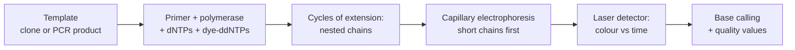

---
aliases:
  - Chain-Termination Sequencing
  - Dideoxy Sequencing
  - Sanger Method
  - Chromatogram
  - Séquençage Sanger
tags:
  - type/technique
  - domain/biology
  - domain/bioinformatics
  - level/L1
  - level/L2
  - level/L3
mastery: 0
prerequisites:
  - "[[DNA Sequencing]]"
  - "[[DNA Replication]]"
  - "[[Nucleotide]]"
  - "[[Gel Electrophoresis]]"
  - "[[Polymerase Chain Reaction]]"
related:
  - "[[Next-Generation Sequencing]]"
  - "[[Base Calling]]"
  - "[[Phred Quality Score]]"
  - "[[FASTQ Format]]"
  - "[[IUPAC Nucleotide Code]]"
  - "[[Geometric Distribution]]"
  - "[[Molecular Cloning]]"
  - "[[Genotype]]"
projects: []
sources:
  - "[[Sanger 1977 - DNA Sequencing with Chain-Terminating Inhibitors]]"
  - "[[Biology 2e (OpenStax)]]"
  - "[[Molecular Biology of the Cell (Alberts)]]"
  - "[[Cock 2010 - The Sanger FASTQ File Format]]"
  - "[[Lander 2001 - Initial Sequencing and Analysis of the Human Genome]]"
  - "[[Lee 2012 - Agarose Gel Electrophoresis for the Separation of DNA Fragments]]"
---

# Sanger Sequencing

> [!abstract]
> Sanger sequencing copies a template with a DNA polymerase in the presence of a few chain-stopping dideoxynucleotides, producing fragments that end at every position; sorting them by length reads the sequence one base per fragment size.

## Purpose

Determine the base sequence of one DNA template, such as a cloned insert or a PCR product, as a single long, accurate read.[^sanger][^os17]

## Why it matters

- **It is the conceptual ancestor of sequencing by synthesis**: a primer, a polymerase, labelled nucleotides and a signal per added base ([[DNA Sequencing]], [[Next-Generation Sequencing]]).[^sanger]
- **Its output is a signal that software turns into bases**: the chromatogram (trace) is the first base-calling problem, and the Phred quality score now used in every [[FASTQ Format|FASTQ]] file is defined on it ($Q = -10 \log_{10} p$).[^cock]
- **One template, one read** suits verifying a single clone or PCR product ([[Molecular Cloning]], [[Polymerase Chain Reaction]]); a mixture of two templates shows up as double peaks, which is how heterozygous sites appear (Core).

## Principle

- **Chain termination.** A DNA polymerase extends a primer annealed to a single-stranded template ([[DNA Replication]]). The reaction contains the four normal dNTPs and a small amount of 2',3'-dideoxynucleotides (ddNTPs). A ddNTP is incorporated like a normal nucleotide but lacks the 3'-OH needed to attach the next one, so the chain stops.[^sanger][^os17][^alberts]
- **A nested set.** Because incorporation of a ddNTP is random, the product is a population of chains ending at every position of the sequence; a chain ending with ddA marks an A at that position of the new strand.[^os17][^alberts]
- **Size separation.** Electrophoresis separates the chains by length with single-nucleotide resolution; reading terminal bases from the shortest to the longest chain gives the sequence 5' → 3' ([[Gel Electrophoresis]]).[^alberts]
- **Original vs automated.** In the 1977 method, four reactions each received one ddNTP and ran in four adjacent gel lanes.[^sanger][^alberts] Automated sequencing labels each ddNTP with a different fluorescent dye, runs one reaction in a capillary, and a laser-excited detector records the colour of each chain as it passes.[^os17][^alberts]

## Protocol overview



## Core (L1)

**Reading a four-lane gel.** Toy strand made by the polymerase (invented): `5'-ACGTTAGC-3'`. Each lane holds the chains ending with one ddNTP; length 1 is at the bottom:

```text
      ddA ddC ddG ddT
  8        -
  7            -
  6    -
  5                -
  4                -
  3            -
  2        -
  1    -
```

Read from the bottom up: A, C, G, T, T, A, G, C, so the new strand is `5'-ACGTTAGC-3'`. The template is its complement, `3'-TGCAATCG-5'`, written 5' → 3' as `GCTAACGT` ([[Reverse Complement]]).

**Reading a chromatogram.** In an automated run, one peak per position arrives at the detector, shortest chains first, coloured by the terminal base.[^os17] The base caller places a base under each peak:

![[sanger-chromatogram-heterozygous.svg]]

- Peaks should be evenly spaced and single.
- **Two overlapping peaks of about half height** at one position mean that the sample contains two templates differing there: in a diploid PCR product, a heterozygous site, reported with an [[IUPAC Nucleotide Code]] (`R` = A or G) ([[Genotype]]).
- Peak heights shrink along the read: fewer chains survive to long lengths (Deeper), so the end of a read is less reliable.

## Deeper (L2)

**The ddNTP ratio is a trade-off.** If each position terminates a growing chain with probability $f$, the fraction of chains reaching length $k$ is $(1 - f)^k$. Much ddNTP gives strong short fragments but almost no long ones; little ddNTP gives long reads with a weak signal (Exercise 3).

**Resolution falls with length.** With distance roughly linear in $\log(\text{size})$,[^lee] chains of length $n$ and $n + 1$ are separated by $|b| \log_{10}\frac{n+1}{n} \approx \frac{|b|}{n \ln 10}$: the gap between neighbouring peaks shrinks like $1/n$, so peaks blur together late in the read. Signal decay and loss of resolution together set the read length.

**Which strand is read.** The read is the strand synthesized from the primer, so it starts just after the primer and is complementary to the template. Sequencing a PCR product from both primers gives two reads, one per strand, whose overlap is checked after reverse-complementing one of them.

**Genome sequencing with Sanger reads.** The public human genome project sequenced large-insert clones by a hierarchical shotgun strategy and assembled the reads.[^lander] Sanger shared half of the 1980 Nobel Prize in Chemistry with Walter Gilbert for determining base sequences in nucleic acids.[^sanger]

## Advanced (L3)

- **Base calling is inference.** The caller must locate peaks, correct dye-specific mobility and spacing, and decide between overlapping signals; each call gets an error probability, reported as a Phred quality $Q = -10 \log_{10} p$.[^cock] The same logic, with other signals, drives [[Base Calling]] in later platforms.
- **Mixed signals are ambiguous by nature.** A double peak may be a heterozygous site, a contaminating template or a sequencing artifact. Confirming it on the reverse-strand read, or in a second sample, separates biology from noise; the threshold used to report a second peak trades missed heterozygotes against false ones (Exercise 5).

## Data produced

A trace file (four fluorescence channels sampled over time, with peak positions and calls) and the derived read: bases plus one quality per base, convertible to FASTQ.[^cock]

## Analysis

Trimming low-quality ends, aligning the read to the expected sequence (design of a clone, reference of a gene) to find differences ([[Sequence Alignment]]), and inspecting the trace at every difference before trusting it.

## Mathematical representation

- New strand $s = s_1 \dots s_L$; termination probability $f_b$ for base $b$ (set by the ddNTP/dNTP ratio). A chain stops at position $i$ with probability
$$P(\text{length} = i) = f_{s_i} \prod_{j < i} (1 - f_{s_j}).$$
- With equal $f$ for all bases, the length is geometric with mean $1/f$ ([[Geometric Distribution]]): $P(\text{length} = i) = f(1 - f)^{i - 1}$, and $P(\text{length} > k) = (1 - f)^k$.
- A peak at position $i$ has height proportional to $P(\text{length} = i)$, coloured by $s_i$. For a 1:1 mixture of templates $s$ and $s'$, the heights add, so a position where $s_i \ne s'_i$ shows two peaks of about half height.

## Computational representation

The simulation below draws chain lengths for a 1:1 mixture of two alleles, sorts them by length as electrophoresis would, and calls a base per length.

```python
import random
from collections import Counter

IUPAC_PAIR = {frozenset("AG"): "R", frozenset("CT"): "Y", frozenset("CG"): "S",
              frozenset("AT"): "W", frozenset("GT"): "K", frozenset("AC"): "M"}


def sanger_fragments(new_strand: str, f: float, n_molecules: int, rng) -> Counter:
    """(length, terminal base) of chains, each stopped by a ddNTP with probability f per position."""
    counts = Counter()
    for _ in range(n_molecules):
        for i, base in enumerate(new_strand, start=1):
            if rng.random() < f:
                counts[(i, base)] += 1
                break
    return counts


def call_bases(counts: Counter, length: int, ratio: float = 0.3) -> str:
    """Order fragments by length (electrophoresis); the dye of each peak gives the base.
    A second dye above `ratio` of the main peak is reported as a two-base IUPAC code."""
    read = []
    for i in range(1, length + 1):
        peaks = sorted(((n, b) for (j, b), n in counts.items() if j == i), reverse=True)
        if not peaks:
            read.append("N")
        elif len(peaks) > 1 and peaks[1][0] >= ratio * peaks[0][0]:
            read.append(IUPAC_PAIR[frozenset((peaks[0][1], peaks[1][1]))])
        else:
            read.append(peaks[0][1])
    return "".join(read)


rng = random.Random(1)
allele1 = "TACGGATCCAGATGACCATGCTTA"   # invented strand made by the polymerase, 5'->3'
allele2 = allele1[:11] + "G" + allele1[12:]   # heterozygous site at position 12 (A/G)
f = 0.05
counts = sanger_fragments(allele1, f, 20_000, rng) + sanger_fragments(allele2, f, 20_000, rng)
print(call_bases(counts, len(allele1)))
signal = [sum(n for (j, _), n in counts.items() if j == i) for i in (1, 12, 24)]
print("molecules ending at 1, 12, 24:", signal)
print("expected:", [round(40_000 * f * (1 - f) ** (i - 1)) for i in (1, 12, 24)])
print("position 12:", {b: n for (j, b), n in counts.items() if j == 12})
```

```text
TACGGATCCAGRTGACCATGCTTA
molecules ending at 1, 12, 24: [1945, 1168, 611]
expected: [2000, 1138, 615]
position 12: {'A': 557, 'G': 611}
```

The simulated signal follows the geometric law, and the heterozygous site is called `R`. The figure above is drawn from these counts.

## Worked example

> [!example] From a trace to a genotype (figure above, invented data)
> 1. **Call the clean peaks**: positions 1 to 11 read `TACGGATCCAG`, one dominant colour each.
> 2. **Position 12**: an A (green) and a G peak of similar height (557 and 611 chains), each about half the height expected for a single base there (1,138): two templates in equal amounts, called `R`.
> 3. **Interpret**: if the template is a PCR product from a diploid individual, the genotype at this site is A/G, heterozygous. Confirm on the reverse read, where it must appear as `Y` (C or T) at the complementary position.
> 4. **Judge the end**: by position 24 the signal is down to about 30 % of position 1 (611 vs 1,945); in a real read, the late positions get lower qualities and are trimmed.

## Limitations and biases

> [!warning] What a Sanger read cannot do
> - One template per reaction: throughput is tiny compared with massively parallel sequencing ([[Next-Generation Sequencing]]).[^sanger]
> - A mixture gives superimposed traces: a minor variant present in a small fraction of molecules hides under the main peak.
> - Read length is limited by signal decay and loss of resolution, so the end of a read carries the least reliable calls.

## Common misconceptions

> [!warning] "The read is the sequence of the template strand"
> The read is the newly synthesized strand, complementary to the template. Written 5' → 3', it equals the reverse complement of the template written 5' → 3'.

> [!warning] "ddNTPs stop the polymerase because they cannot pair"
> ddNTPs pair and are incorporated normally; what they lack is the 3'-OH, so no further nucleotide can be joined to them.[^sanger][^alberts]

> [!warning] "A double peak is a sequencing error"
> It can be noise, but a clean pair of half-height peaks is usually a real mixture of two templates, such as a heterozygous site. Discarding it as error misses variants; checking the other strand settles it.

## History and variants

> [!info] From radioactive lanes to capillaries
> Sanger, Nicklen and Coulson (1977) introduced dideoxy chain terminators, applied them to bacteriophage φX174 DNA, and found the method faster and more accurate than their earlier "plus and minus" method.[^sanger] Fluorescent dye terminators and capillary electrophoresis automated it,[^os17][^alberts] and in that form it produced the reference human genome.[^lander]

## Exercises

> [!question] Exercise 1 (L1)
> Why does incorporation of a ddNTP end the chain? What happens to the length of the fragments if the ddNTP concentration is doubled?

> [!success]- Solution
> A ddNTP lacks the 3'-OH group on which the polymerase would attach the next nucleotide, so no phosphodiester bond can follow.[^sanger] Doubling the ddNTP raises the termination probability per position $f$, so chains are shorter on average (mean $1/f$): the read loses its long end.

> [!question] Exercise 2 (L1)
> A four-lane gel shows, from the bottom: ddG, ddG, ddT, ddA, ddC, ddT. Write the synthesized strand and the template, both 5' → 3'.

> [!success]- Solution
> Synthesized strand: `5'-GGTACT-3'`. The template is its complement, `3'-CCATGA-5'`, written 5' → 3': `AGTACC`. Check: `reverse_complement("GGTACT")` is `AGTACC`.

> [!question] Exercise 3 (L2, Python)
> For a uniform termination probability $f = 0.01$ and $f = 0.002$, compute the fraction of chains longer than 100, 500 and 1,000 bases. Which setting suits a long read, and at what cost?

> [!success]- Solution
> ```python
> for f in (0.01, 0.002):
>     print(f, [f"{(1 - f) ** k:.2g}" for k in (100, 500, 1000)])
> ```
> ```text
> 0.01 ['0.37', '0.0066', '4.3e-05']
> 0.002 ['0.82', '0.37', '0.14']
> ```
> At $f = 0.01$ almost nothing reaches 1,000 bases; at $f = 0.002$, 14 % of chains do. But the signal per position is proportional to $f(1-f)^{i-1}$, about five times weaker at the start for $f = 0.002$: long reads need more template or a more sensitive detector.

> [!question] Exercise 4 (L2)
> A trace shows a clean pair of half-height peaks, C and T, at one position of the forward read. What do you expect at that position of the reverse read, and what would make you doubt a heterozygous call?

> [!success]- Solution
> The reverse read covers the complementary strand: G and A peaks (IUPAC `R`) at the matching position. Doubt it if the reverse read shows a single peak, if the double peak sits in a noisy region (late in the read, after the quality drops), or if many positions show double peaks (a mixture of templates rather than one variant).

> [!question] Exercise 5 (L3, Python)
> In `call_bases`, the parameter `ratio` sets when a second peak is reported. Run the simulation with `ratio = 0.9` and with `ratio = 0.05` and explain the trade-off. Why would no single value be right for every experiment?

> [!success]- Solution
> Both runs print `TACGGATCCAGRTGACCATGCTTA`: the simulation has no background noise, and the site at position 12 (557 vs 611 chains, ratio 0.91) passes even the 0.9 threshold, only just. A slightly unequal mixture would fail it and be called as a single base: missed heterozygotes. With `ratio = 0.05`, any small background peak in a real trace would become an ambiguity code: false heterozygotes in noisy positions. The right threshold depends on the expected mixture (1:1 for a diploid germline sample, much lower for a tumour or a pooled sample) and on the noise level, which is why real callers estimate an error probability per call instead of applying one cut-off ([[Base Calling]], [[Phred Quality Score]]).

## Mastery checklist

- [ ] 1 Recognized: I can say what a ddNTP is and what a chromatogram shows.
- [ ] 2 Understood: I can explain chain termination, the nested set, size separation, and which strand the read represents.
- [ ] 3 Practiced: I can read a four-lane gel and a chromatogram, simulate a Sanger ladder and call bases including a heterozygous site.
- [ ] 4 Applied: I opened a real trace file of a clone or PCR product, trimmed it by quality and aligned it to the expected sequence.
- [ ] 5 Explained: I can explain the ddNTP trade-off, why reads end, and how to tell a real double peak from noise.

## References

[^sanger]: [[Sanger 1977 - DNA Sequencing with Chain-Terminating Inhibitors]], *PNAS* 74(12):5463-5467 (principle, φX174, comparison with the plus and minus method); Nobel Prize and later history from the source note.
[^os17]: [[Biology 2e (OpenStax)]], ch. 17 "Biotechnology and Genomics" (dideoxy chain termination, fluorescent ddNTPs).
[^alberts]: [[Molecular Biology of the Cell (Alberts)]], 4th ed. (2002), methods for manipulating DNA (dideoxy sequencing, automated sequencing).
[^cock]: [[Cock 2010 - The Sanger FASTQ File Format]], *Nucleic Acids Research* (Phred qualities).
[^lander]: [[Lander 2001 - Initial Sequencing and Analysis of the Human Genome]], *Nature*, sequencing strategy.
[^lee]: [[Lee 2012 - Agarose Gel Electrophoresis for the Separation of DNA Fragments]], *Journal of Visualized Experiments*, log-linear migration.
