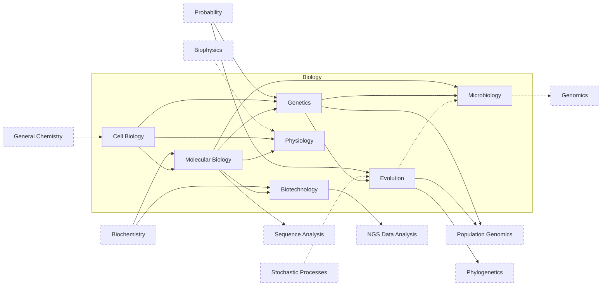

---
aliases:
  - Biologie
  - Life Sciences
tags:
  - type/moc
  - domain/biology
  - level/L1
  - level/L2
  - level/L3
prerequisites:
  - "[[General Chemistry]]"
projects:
  - "[[01-dna-engine]]"
  - "[[02-sequence-translation]]"
  - "[[03-genome-diff]]"
  - "[[06-mutation-lab]]"
  - "[[07-evolution-simulator]]"
  - "[[08-phylogenetic-engine]]"
  - "[[09-genome-browser]]"
  - "[[10-genomic-pipeline]]"
  - "[[bio-core]]"
  - "[[bio-simulation]]"
sources:
  - "[[Biology 2e (OpenStax)]]"
  - "[[Molecular Biology of the Cell (Alberts)]]"
  - "[[An Introduction to Genetic Analysis (Griffiths)]]"
  - "[[Evolution (Futuyma)]]"
  - "[[Principles of Population Genetics (Hartl)]]"
  - "[[MIT 7.01SC - Fundamentals of Biology]]"
  - "[[MIT 7.016 - Introductory Biology]]"
  - "[[MIT 7.03 - Genetics]]"
  - "[[MIT 6.047 - Computational Biology]]"
  - "[[MIT - Course 7 Biology]]"
  - "[[MIT - Course 6-7 Computer Science and Molecular Biology]]"
  - "[[Carnegie Mellon University - BS Computational Biology]]"
  - "[[UC San Diego - BS Bioinformatics]]"
  - "[[Tsinghua University - BS Biological Sciences]]"
  - "[[University of Cambridge - Natural Sciences Tripos]]"
  - "[[Université Paris-Saclay - Licence Double Diplôme Informatique Sciences de la Vie]]"
  - "[[Sorbonne Université - Licence Sciences de la Vie]]"
---

# Biology

> [!abstract]
> The life-science pillar of the curriculum: the cell, the flow of genetic information, heredity and evolution, the microbial and physiological context of biomedical data, and the techniques that produce the data.

## Why it matters for bioinformatics

- Bioinformatics models biology. Every format, algorithm and statistic of the field encodes a biological fact: strand orientation in a FASTA file, the [[Genetic Code]] in a translation table, [[Common Descent]] in a [[Substitution Matrix]], the [[Wright-Fisher Model]] under [[Coalescent Theory]].
- The biology decides whether a result makes sense. A variant caller, a differential expression test or a phylogeny can be statistically valid and biologically absurd; only domain knowledge catches it.
- Programs built for computational biology keep the same biology core as pure biology majors: cell and molecular biology, genetics and biochemistry.[^core]

## Target level and weight

- **Target: L3** ([[Curriculum]]). Biology is one of the four disciplines taken to L3 or beyond, with [[Probability and Statistics]], [[Algorithms]] and [[Bioinformatics]].
- **Weight: 172 concepts.** [[Molecular Biology]], [[Genetics]] and [[Evolution]] carry the most (27 to 35 concepts each), because sequence analysis, genomics and population genomics rest on them. [[Microbiology]], [[Physiology]] and [[Biotechnology]] are lighter (17 to 18 each) and oriented to what a bioinformatician meets: microbial diversity for metagenomics, immunology and human physiology for biomedical data, data-generating techniques for quality control.
- Both molecular and organismal-evolutionary biology are kept, as in licences that split their L3 majors between the two.[^split]

## Subdomains

| Subdomain | Curriculum stage | Target | Concepts (L1 / L2 / L3) | Scope |
|---|---|---|---|---|
| [[Cell Biology]] | 1 | L3 | 24 (13 / 6 / 5) | Cell plan and compartments, division, signaling, differentiation, cancer |
| [[Molecular Biology]] | 1, 2, 3 | L3 | 33 (17 / 11 / 5) | Nucleic acids, replication, transcription, translation, regulation, epigenetics, RNA biology |
| [[Genetics]] | 1, 2 | L3 | 35 (18 / 13 / 4) | Transmission, mutation classes, linkage, human genetics, genome-scale variation, quantitative genetics |
| [[Evolution]] | 2 | L3 | 27 (7 / 9 / 11) | Darwinian concepts, population genetics, molecular evolution, stochastic models, selection |
| [[Microbiology]] | 3 | L3 (light) | 18 (5 / 10 / 3) | Microbial diversity and genetics, taxonomy from sequence, pathogens, resistance, microbiome |
| [[Physiology]] | 3 | L3 (light) | 17 (7 / 6 / 4) | Human organ systems for biomedical data, immunology for immunogenomics |
| [[Biotechnology]] | 3 | L3 | 18 (6 / 7 / 5) | PCR, cloning, sequencing generations, arrays, cytometry, mass spectrometry, genome editing |

> [!tip] Stages and levels
> The "Curriculum stage" column is where the [[Curriculum]] studies each subdomain in earnest. Inside a subdomain MOC, section headings follow the level of the concepts, so an L1 section can be read earlier when a sibling subdomain or a Lab project needs it: the L1 part of [[Evolution]] in Stage 1, as first-year programs do;[^y1] the L1 part of [[Biotechnology]] (PCR, Sanger sequencing) next to Stage 1 [[Molecular Biology]]; the L3 parts of [[Genetics]] and [[Evolution]] in Stage 3, with [[Population Genomics]] and [[07-evolution-simulator]].

## Dependencies

Solid arrows: required before. Dashed arrows: helpful. Dashed boxes: other domains.

## Cross-domain prerequisites

- [[General Chemistry]], before [[Cell Biology]]: bonds, water, acids and bases.
- [[Biochemistry]], L1 notes in parallel with Stage 1, the rest in Stage 2: [[Amino Acid]], [[Protein]], [[Enzyme]], [[Metabolism]], [[ATP]].
- [[Probability]], before Stage 2 of [[Genetics]] and [[Evolution]]: [[Conditional Probability]], [[Binomial Distribution]].
- [[Stochastic Processes]], before Stage 3 of [[Evolution]]: [[Markov Chain]].
- [[Biophysics]], with [[Physiology]]: [[Membrane Potential]], [[Diffusion]].
- [[Programming]]: Python, to implement each concept in the Lab.

## Reference courses

| Course | Institution | Level | Covers |
|---|---|---|---|
| [[MIT 7.01SC - Fundamentals of Biology]] | MIT | L1 | Biochemistry, molecular biology, genetics, recombinant DNA; built for self-study |
| [[MIT 7.016 - Introductory Biology]] | MIT | L1 | The same core in a more recent run, with chemical biology and therapeutics |
| [[MIT 7.03 - Genetics]] | MIT | L2 | Genetic analysis, variation, population genetics, gene regulation, human genetics |
| [[MIT 6.047 - Computational Biology]] | MIT | L3 | Where this biology is used: genomes, networks, evolution |

## Reference books

- [[Biology 2e (OpenStax)]]: the free L1 pass over the whole domain (Units 1 to 4; Unit 7 for physiology).
- [[Molecular Biology of the Cell (Alberts)]]: the L2 to L3 reference for cell and molecular biology.
- [[An Introduction to Genetic Analysis (Griffiths)]]: genetics through problems.
- [[Evolution (Futuyma)]]: evolutionary biology from processes to genomes.
- [[Principles of Population Genetics (Hartl)]]: the mathematics of population genetics.

## Lab projects

| Project | Stage | Biology it implements |
|---|---|---|
| [[01-dna-engine]] | 1 | [[Nucleotide]], [[DNA]], [[Base Pairing]] |
| [[02-sequence-translation]] | 1 | [[Central Dogma]], [[Transcription]], [[Genetic Code]], [[Open Reading Frame]], [[Translation]] |
| [[03-genome-diff]] | 2 | [[Mutation]], [[Single Nucleotide Polymorphism]], [[Indel]] |
| [[06-mutation-lab]] | 2 | [[Silent Mutation]], [[Missense Mutation]], [[Nonsense Mutation]], [[Frameshift Mutation]] |
| [[07-evolution-simulator]] | 3 | [[Natural Selection]], [[Genetic Drift]], [[Fitness]], [[Wright-Fisher Model]] |
| [[08-phylogenetic-engine]] | 3 | [[Common Descent]] |
| [[09-genome-browser]] | 3 | [[Genome]] |
| [[10-genomic-pipeline]] | 3 | [[Next-Generation Sequencing]] |

The libraries [[bio-core]] (typed [[DNA]], [[RNA]], [[Gene]], [[Mutation]]) and [[bio-simulation]] (populations, selection, drift) carry this biology across projects.

## References

[^core]: [[MIT - Course 6-7 Computer Science and Molecular Biology]] requires the same biology foundation (7.03 Genetics, 7.05 General Biochemistry, 7.06 Cell Biology) as [[MIT - Course 7 Biology]]; [[Carnegie Mellon University - BS Computational Biology]] requires modern biology, 03-221 (genomes, evolution and disease), biochemistry and cell biology; [[UC San Diego - BS Bioinformatics]] requires BICD 100 Genetics and BIMM 100 Molecular Biology; [[Tsinghua University - BS Biological Sciences]] requires cell biology, molecular biology, genetics and physiology. The comparison is in [[Curriculum Benchmark]].
[^split]: [[Sorbonne Université - Licence Sciences de la Vie]]: L3 majors MOrga (from the molecule to the organism) and OBEE (organisms, biodiversity, ecology, evolution).
[^y1]: [[Université Paris-Saclay - Licence Double Diplôme Informatique Sciences de la Vie]], L1 units "Biology 1: unity, diversity and evolution of living things" and "Biology 2: from molecule to organism"; [[University of Cambridge - Natural Sciences Tripos]], Part IA subjects Biology of Cells, Evolution and Behaviour, Physiology of Organisms.
