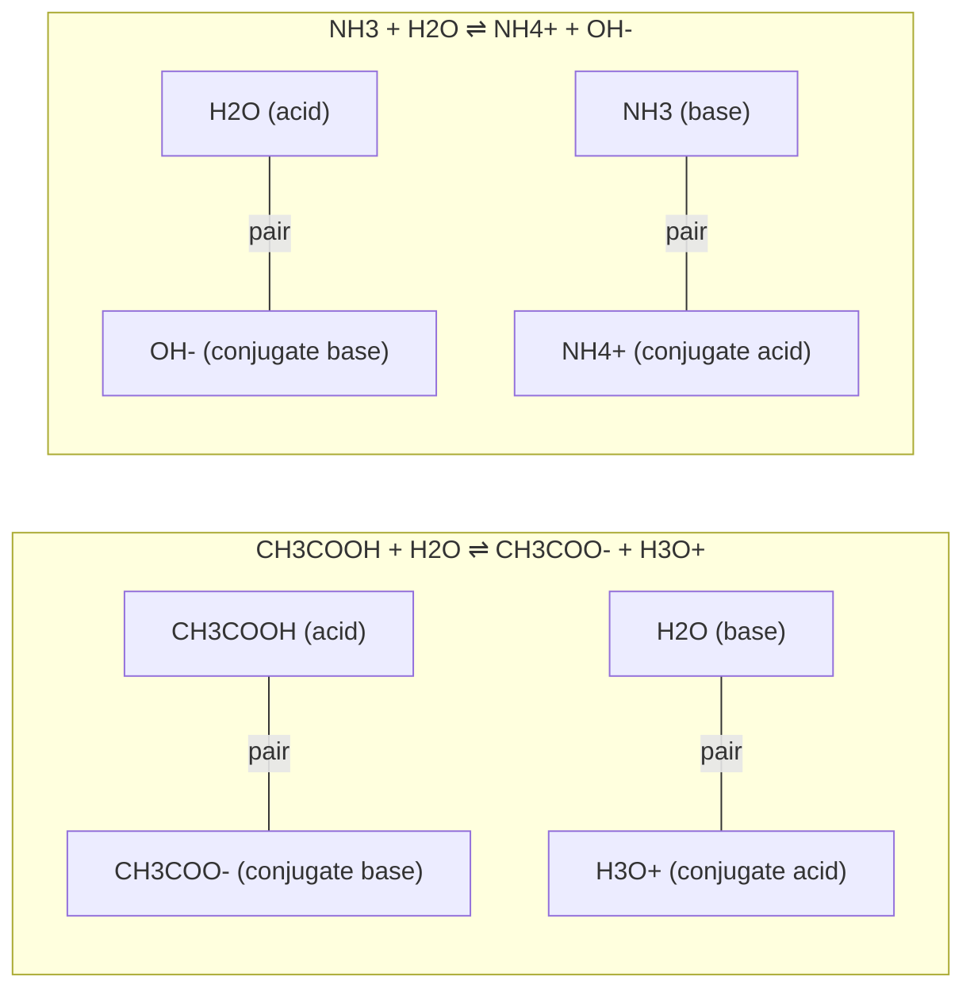

---
aliases:
  - Brønsted-Lowry Acid
  - Conjugate Acid-Base Pair
  - Proton Transfer
  - Strong and Weak Acids
  - Réaction acide-base
tags:
  - type/concept
  - domain/chemistry
  - domain/biology
  - level/L1
  - level/L2
mastery: 0
prerequisites:
  - "[[Water]]"
  - "[[Covalent Bond]]"
  - "[[Electronegativity]]"
  - "[[Aqueous Solution]]"
related:
  - "[[pH]]"
  - "[[Acid-Base Equilibrium]]"
  - "[[Henderson-Hasselbalch Equation]]"
  - "[[Buffer Solution]]"
  - "[[Amino Acid]]"
projects: []
sources:
  - "[[Chemistry 2e (OpenStax)]]"
  - "[[Biochemistry (Berg)]]"
  - "[[OpenSMILES Specification]]"
---

# Acid-Base Reaction

> [!abstract]
> An acid-base reaction moves a proton (H⁺) from an acid to a base; knowing who gives and who takes it tells you the charge of every carboxyl, amino group and phosphate in a cell.

## Definition

In the **Brønsted-Lowry** definition, an **acid** is a proton (H⁺) donor, a **base** a proton acceptor, and an **acid-base reaction** transfers a proton from one species to another.[^c4][^c14] An acid that has given up its proton becomes its **conjugate base**; a base that has accepted one becomes its **conjugate acid**; the two members of a **conjugate pair** differ by one H⁺. A **strong acid** is completely ionized in water, a **weak acid** only partly.[^c14]

## Why it matters

- **Charge states.** Whether a group carries its proton decides its charge, and charge decides solubility, migration in a gel and binding ([[Aqueous Solution]], [[Gel Electrophoresis]]).
- **Enzyme mechanisms.** Side chains such as histidine pass protons to and from substrates: general acid-base catalysis is one of the main catalytic strategies of [[Enzyme|enzymes]].[^berg]
- **Files and models.** SMILES writes charges in bracket atoms, so acetic acid `CC(=O)O` and acetate `CC(=O)[O-]` are different strings;[^smiles] metabolic models fix one protonation state per metabolite and balance protons explicitly ([[Stoichiometry#Advanced (L3)]]).
- **Gateway to pH.** The quantitative treatment is in [[Physical Chemistry]]: [[pH]], [[Acid-Base Equilibrium]], [[Henderson-Hasselbalch Equation]], [[Buffer Solution]].

## Core (L1)

### Proton transfer

In water a proton is carried by a water molecule as the hydronium ion H₃O⁺.[^c14] Water can play both roles:



Water is **amphiprotic**: a base toward acetic acid, an acid toward ammonia, and both toward itself in autoionization, $\mathrm{2\,H_2O \rightleftharpoons H_3O^+ + OH^-}$.[^c14]

| Acid | Conjugate base | Where in biology |
|---|---|---|
| R-COOH | R-COO⁻ | Asp and Glu side chains, C-terminus, fatty acids |
| R-NH₃⁺ | R-NH₂ | Lys side chain, N-terminus |
| His side chain, protonated | His side chain (imidazole) | enzyme active sites |
| H₂PO₄⁻ | HPO₄²⁻ | phosphate buffers, phosphorylated metabolites |

### Strong and weak

**Strong acids** ionize completely in water: HCl, HBr, HI, HNO₃, HClO₄ and H₂SO₄ (first proton); group 1 hydroxides (NaOH, KOH) are **strong bases**. Acetic acid, ammonia and most acids and bases of biology are **weak**.[^c14] Neutralizing a strong acid with a strong base is the transfer $\mathrm{H_3O^+ + OH^- \to 2\,H_2O}$, the other ions being spectators.[^c4]

### Bio: amino acids and nucleic acids

In neutral solution an amino acid is a **zwitterion**, –NH₃⁺ and –COO⁻. Asp and Glu side chains are negative, Lys and Arg positive; the histidine side chain has a $\mathrm{p}K_a$ near 6, close to neutral pH, so it can donate or accept a proton and often shuttles protons in active sites. Each phosphodiester group of DNA and RNA carries one negative charge at neutral pH: nucleic acids are polyanions.[^berg]

## Deeper (L2)

**Which way the proton goes.** The stronger an acid, the weaker its conjugate base, and a proton-transfer equilibrium favors the **weaker acid and weaker base**. Strength is measured by the ionization constant $K_a$ (larger is stronger), or $\mathrm{p}K_a = -\log_{10} K_a$ (smaller is stronger).[^c14] At 25 °C: CH₃COOH $1.8 \times 10^{-5}$, H₂PO₄⁻ $6.2 \times 10^{-8}$, NH₄⁺ $5.6 \times 10^{-10}$.[^c14]

**Structure decides strength.** H-A is a stronger acid when the H-A bond is weaker or more polar and when A⁻ holds its negative charge more stably, on an electronegative atom or spread over several atoms ([[Electronegativity]]).[^c14] A carboxylate shares its charge between two oxygens ([[Resonance (Chemistry)]]), which is why carboxylic acids are acids while alcohols barely are.

**Polyprotic acids.** Phosphoric acid loses three protons in succession, H₃PO₄ → H₂PO₄⁻ → HPO₄²⁻ → PO₄³⁻, each step with a smaller $K_a$: removing a proton from an already negative ion is harder.[^c14] With $\mathrm{p}K_a \approx 7.2$ for the second step, H₂PO₄⁻ and HPO₄²⁻ coexist near neutral pH, which makes phosphate a buffer there ([[Buffer Solution]]).

**Lewis acids.** A Lewis acid accepts an electron pair and a Lewis base donates one.[^lewis] Every Brønsted base is a Lewis base, but Lewis acids include species without protons, such as metal cations: metal-ion catalysis in enzymes is Lewis acidity at work ([[Coordination Complex]]).[^berg]

## Mathematical representation

- $K_a = [\mathrm{H_3O^+}][\mathrm{A^-}] / [\mathrm{HA}]$; $K_w = [\mathrm{H_3O^+}][\mathrm{OH^-}] = 1.0 \times 10^{-14}$ at 25 °C.[^c14]
- Adding the ionizations of a conjugate pair gives water's autoionization: $K_a K_b = K_w$, $\mathrm{p}K_a + \mathrm{p}K_b = 14$ at 25 °C.
- For $\mathrm{HA + B \rightleftharpoons A^- + HB^+}$, subtracting the ionization of HB⁺ from that of HA: $K = K_a(\mathrm{HA}) / K_a(\mathrm{HB^+})$, larger than 1 exactly when HA is the stronger acid.

## Computational representation

```python
import math

KA = {"CH3COOH": 1.8e-5, "H2PO4-": 6.2e-8, "NH4+": 5.6e-10}   # 25 °C, Chemistry 2e


def transfer_constant(acid: str, conjugate_acid_of_base: str) -> float:
    """K of acid + base <=> conjugate base + conjugate acid: Ka(acid) / Ka(conjugate acid)."""
    return KA[acid] / KA[conjugate_acid_of_base]


for acid, other in [("H2PO4-", "NH4+"), ("CH3COOH", "NH4+"), ("NH4+", "H2PO4-")]:
    k = transfer_constant(acid, other)
    side = "products" if k > 1 else "reactants"
    print(f"{acid:8s} gives H+ to the base of {other:7s} K = {k:9.3g}  {side} favored")
print({a: round(-math.log10(k), 2) for a, k in KA.items()})

# Side-chain charges near pH 7 (qualitative: Asp, Glu deprotonated; Lys, Arg protonated;
# His mostly neutral); N-terminal -NH3+ (+1) and C-terminal -COO- (-1) cancel.
SIDE_CHAIN_CHARGE = {"D": -1, "E": -1, "K": +1, "R": +1}


def net_charge_near_ph7(peptide: str) -> int:
    return sum(SIDE_CHAIN_CHARGE.get(aa, 0) for aa in peptide.upper())
```

```text
H2PO4-   gives H+ to the base of NH4+    K =       111  products favored
CH3COOH  gives H+ to the base of NH4+    K =  3.21e+04  products favored
NH4+     gives H+ to the base of H2PO4-  K =   0.00903  reactants favored
{'CH3COOH': 4.74, 'H2PO4-': 7.21, 'NH4+': 9.25}
```

`net_charge_near_ph7` (used in Exercise 3) counts integer charges, a first approximation: each group is a population of molecules, partly protonated, and the average charge at a given pH needs the $\mathrm{p}K_a$ values ([[Henderson-Hasselbalch Equation]]).

## Worked example

> [!example] Phosphate meets ammonia
> 1. **Roles**: in $\mathrm{H_2PO_4^- + NH_3}$, H₂PO₄⁻ has a proton to give and NH₃ a lone pair to take it.
> 2. **Products and pairs**: $\mathrm{HPO_4^{2-} + NH_4^+}$; pairs H₂PO₄⁻/HPO₄²⁻ and NH₄⁺/NH₃.
> 3. **Compare the acids**: H₂PO₄⁻ ($6.2 \times 10^{-8}$) is stronger than NH₄⁺ ($5.6 \times 10^{-10}$).[^c14]
> 4. **Direction**: $K \approx 110 > 1$ (first line of the output): products are favored, on the side of the weaker acid.

## Common misconceptions

> [!warning] "Strong means concentrated"
> Strength is the fraction ionized: 0.001 M HCl is a dilute strong acid, 1 M acetic acid a concentrated weak one.

> [!warning] "The conjugate base of a weak acid is a strong base"
> Acetate is weak: $K_b = 10^{-14} / 1.8 \times 10^{-5} \approx 5.6 \times 10^{-10}$. Only conjugate bases of extremely weak acids, such as OH⁻ from water, are strong.

## Exercises

> [!question] Exercise 1 (L1)
> Name the acid, the base and the two conjugate pairs: (a) HSO₄⁻ + H₂O ⇌ SO₄²⁻ + H₃O⁺; (b) NH₄⁺ + OH⁻ → NH₃ + H₂O; (c) HCO₃⁻ + H₃O⁺ ⇌ H₂CO₃ + H₂O.

> [!success]- Solution
> (a) Acid HSO₄⁻, base H₂O; pairs HSO₄⁻/SO₄²⁻, H₃O⁺/H₂O. (b) Acid NH₄⁺, base OH⁻; pairs NH₄⁺/NH₃, H₂O/OH⁻. (c) Acid H₃O⁺, base HCO₃⁻; pairs H₃O⁺/H₂O, H₂CO₃/HCO₃⁻. HSO₄⁻ is an acid in (a), HCO₃⁻ a base in (c): anions such as these, and water, are amphiprotic. Note too that OH⁻ is only one base among many: NH₃ and HPO₄²⁻ accept protons without containing hydroxide.

> [!question] Exercise 2 (L2)
> Predict the direction of CH₃COOH + NH₃ ⇌ CH₃COO⁻ + NH₄⁺ and estimate $K$.

> [!success]- Solution
> $K = 1.8 \times 10^{-5} / 5.6 \times 10^{-10} \approx 3.2 \times 10^4$ (second line of the output): essentially complete to the right, toward the weaker acid NH₄⁺.

> [!question] Exercise 3 (L2, Python)
> Compute the charge near pH 7 of a peptide containing each amino acid once, and of the His tag `GSHHHHHH`. Extend the function for a pH well below 6, where histidines are protonated.

> [!success]- Solution
> ```python
> def net_charge(peptide: str, his_protonated: bool = False) -> int:
>     extra = peptide.upper().count("H") if his_protonated else 0
>     return net_charge_near_ph7(peptide) + extra
>
> print(net_charge("ACDEFGHIKLMNPQRSTVWY"), net_charge("GSHHHHHH"), net_charge("GSHHHHHH", his_protonated=True))
> # 0 0 6
> ```
> The tag goes from 0 to +6: histidine is the residue whose charge is most sensitive to pH near neutrality, as its $\mathrm{p}K_a$ near 6 predicts.[^berg]

> [!question] Exercise 4 (L2)
> Explain why DNA is negatively charged at neutral pH whatever its sequence, and why its charge is proportional to its length.

> [!success]- Solution
> Each phosphodiester group keeps one strongly acidic OH, deprotonated at neutral pH, so it carries one negative charge,[^berg] and there is one phosphate per nucleotide. Charge per unit mass is nearly constant, so DNA migrates toward the positive electrode and a gel separates fragments by size ([[Gel Electrophoresis]]).

## Mastery checklist

- [ ] 1 Recognized: I can define Brønsted acid, base and conjugate pair, and name the strong acids.
- [ ] 2 Understood: I can explain why water is amphiprotic, why strong is not concentrated, and which way a proton transfer goes.
- [ ] 3 Practiced: I can identify conjugate pairs, predict direction from $K_a$, and compute qualitative peptide charges in Python.
- [ ] 4 Applied: I checked the protonation states written in a real SMILES string, structure file or metabolic model.
- [ ] 5 Explained: I can teach how structure sets acid strength, how Lewis acidity extends the picture to metal ions, and why integer charges are an approximation.

## References

[^c4]: [[Chemistry 2e (OpenStax)]], ch. 4 "Stoichiometry of Chemical Reactions", section 4.2 "Classifying Chemical Reactions" (acid-base reactions as proton transfer, neutralization).
[^c14]: [[Chemistry 2e (OpenStax)]], ch. 14 "Acid-Base Equilibria" (Brønsted-Lowry acids and bases, conjugate pairs, amphiprotic water and autoionization, hydronium, strong and weak acids and bases, relative strengths and $K_a$, molecular structure and strength, polyprotic acids) and its table of ionization constants; section numbers not verified.
[^lewis]: [[Chemistry 2e (OpenStax)]], treatment of Lewis acids and bases; section not verified.
[^berg]: [[Biochemistry (Berg)]], 5th ed. (2002), treatment of amino acid ionization (zwitterions, typical $\mathrm{p}K_a$ values, histidine near 6), the negatively charged backbone of nucleic acids, and catalytic strategies (general acid-base and metal-ion catalysis).
[^smiles]: [[OpenSMILES Specification]], bracket atoms (charge).
