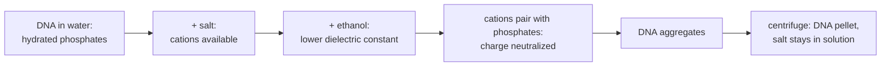

---
aliases:
  - Electrolyte
  - Solubility
  - Precipitation Reaction
  - Ionic Strength
  - Solution aqueuse
tags:
  - type/concept
  - domain/chemistry
  - domain/biology
  - level/L1
  - level/L2
mastery: 0
prerequisites:
  - "[[Water]]"
  - "[[Ionic Bond]]"
  - "[[Intermolecular Force]]"
  - "[[Molar Concentration]]"
related:
  - "[[Hydrophobic Effect]]"
  - "[[Acid-Base Reaction]]"
  - "[[Buffer Solution]]"
  - "[[Dielectric Constant]]"
  - "[[Debye Length]]"
projects: []
sources:
  - "[[Chemistry 2e (OpenStax)]]"
  - "[[Biochemistry (Berg)]]"
  - "[[IUPAC Gold Book]]"
  - "[[Green 2016 - Precipitation of DNA with Ethanol]]"
---

# Aqueous Solution

> [!abstract]
> An aqueous solution is anything dissolved in water; whether a substance dissolves, whether it splits into ions and whether it falls back out as a solid decides how buffers behave and how DNA is purified.

## Definition

A **solution** is a homogeneous mixture of a **solvent** (the major component) and dissolved **solutes**; in an **aqueous** solution the solvent is water. An **electrolyte** dissolves in water to give ions, by dissociating (ionic compounds) or by reacting with water (acids, bases); a **non-electrolyte** dissolves as intact molecules. **Solubility** is the maximum concentration of a solute at equilibrium under given conditions, reached in a **saturated** solution.[^c11] A **precipitation reaction** forms an insoluble solid, the **precipitate**, from dissolved reactants.[^c4]

## Why it matters

- **Every sample is an aqueous solution.** Buffers, reaction mixes and media are lists of solute concentrations ([[Molar Concentration]]); whether each solute is an electrolyte decides how many particles and how much charge it adds.
- **DNA purification is a solubility switch.** DNA dissolves in water because its backbone is charged; salt plus ethanol makes it insoluble, so it can be pelleted, washed and redissolved.[^green]
- **Salt is a parameter.** Electrostatic interactions depend on the medium,[^berg] and ionic strength summarizes a buffer's ions in one number: methods report the full salt composition, and electrostatic models take it as input ([[Debye Length]]).

## Core (L1)

### Why things dissolve

Dissolving trades solute-solute and solvent-solvent attractions for solute-solvent ones; a substance dissolves well when the new attractions are comparable to those broken.[^c11] Water is polar and hydrogen-bonds ([[Water]], [[Intermolecular Force]]), so ionic compounds dissolve when ion-dipole attractions compensate the lattice (water turns its partially negative oxygen toward cations, its partially positive hydrogens toward anions; [[Ionic Bond]]), polar molecules such as sugars and ethanol dissolve, and nonpolar chains do not. This is **"like dissolves like"**;[^c11] its biological face is the [[Hydrophobic Effect]].

| Class | In water | Examples |
|---|---|---|
| Strong electrolyte | completely ionized | soluble salts (NaCl, KCl, MgCl₂), strong acids (HCl) |
| Weak electrolyte | partly ionized | weak acids and bases (acetic acid, ammonia) |
| Non-electrolyte | intact molecules | glucose, sucrose, ethanol |

Classes after Chemistry 2e.[^c11] Strength is the **fraction ionized**, not the concentration ([[Acid-Base Reaction]]).

### Precipitation

Mixing silver nitrate and sodium chloride solutions forms solid AgCl. Writing strong electrolytes as ions shows what reacts: Na⁺ and NO₃⁻ are unchanged **spectator ions**, and the **net ionic equation** is[^c4]

$$\mathrm{Ag^+(aq) + Cl^-(aq) \to AgCl(s)}.$$

Solubility guidelines predict the product (selection):[^c4]

| Usually soluble | Exceptions |
|---|---|
| Salts of group 1 cations and ammonium; nitrates; acetates | rare |
| Chlorides, bromides, iodides | Ag⁺, Pb²⁺, Hg₂²⁺ |
| Sulfates | Ba²⁺, Pb²⁺ and a few others |
| **Usually insoluble**: carbonates, phosphates, hydroxides, sulfides | salts of group 1 cations and ammonium |

### Bio: ethanol precipitation of DNA

Each backbone phosphate carries a negative charge,[^berg] so DNA is a hydrated polyanion and dissolves readily ([[DNA]]). To recover it, a salt and ethanol are added, the precipitate is collected by [[Centrifugation]], washed with aqueous ethanol and redissolved in buffer.[^green] Why it works follows from Coulomb's law (qualitative mechanism):



The energy of two charges is divided by the dielectric constant of the medium, about 80 for water:[^berg] water keeps cations and phosphates apart. Ethanol, less polar, lowers the dielectric constant of the mixture ([[Dielectric Constant]]); cation-phosphate attraction wins, the backbone is neutralized and DNA is no longer "like" its solvent.

## Deeper (L2)

**Solubility as an equilibrium.** A saturated solution of a slightly soluble salt $\mathrm{M_pX_q}$ is in dynamic equilibrium with the solid, with **solubility product** $K_{sp} = [\mathrm{M}]^p [\mathrm{X}]^q$. If the ion product $Q$ of a mixture exceeds $K_{sp}$, a precipitate forms; adding an ion the salt already contains lowers its solubility (**common-ion effect**).[^ceq] The equilibrium machinery is in [[Chemical Equilibrium]].

**Particles versus charge.** Colligative properties such as [[Osmotic Pressure]] count dissolved particles: 1 mol of NaCl gives up to 2 mol of ions, a little less in practice because ions partly pair.[^c11] Electrostatics instead depends on the **ionic strength** $I = \frac{1}{2} \sum_i c_i z_i^2$, summed over ions of concentration $c_i$ and charge number $z_i$.[^iupac] The square weights multivalent ions: MgSO₄ gives as many particles as NaCl but four times the ionic strength (computed below). How a buffer's ions screen charges is the subject of [[Debye Length]].

## Mathematical representation

- Solute $s$ at concentration $c_s$ releases $\nu_{s,i}$ ions $i$ per formula unit: $c_i = \sum_s \nu_{s,i} c_s$, with electroneutrality $\sum_i z_i c_i = 0$.
- $I_c = \frac{1}{2} \sum_i c_i z_i^2$;[^iupac] ideal particle concentration $\sum_s n_s c_s$ ($n_s$ ions per formula unit, 1 for a non-electrolyte).

## Computational representation

```python
# Charges of the ions one formula unit releases in water (strong electrolytes dissociate fully)
IONS = {"NaCl": [+1, -1], "KCl": [+1, -1], "MgCl2": [+2, -1, -1], "MgSO4": [+2, -2],
        "Na2HPO4": [+1, +1, -2], "KH2PO4": [+1, -1], "glucose": []}   # glucose: non-electrolyte


def ionic_strength(recipe: dict[str, float]) -> float:
    """I = 1/2 sum c_i z_i^2 for a recipe {solute: mol/L}."""
    return 0.5 * sum(c * z ** 2 for s, c in recipe.items() for z in IONS[s])


def particles(recipe: dict[str, float]) -> float:
    """Dissolved particles (mol/L), ideal: its ions, or one molecule for a non-electrolyte."""
    return sum(c * (len(IONS[s]) or 1) for s, c in recipe.items())


PBS_LIKE = {"NaCl": 0.137, "KCl": 0.0027, "Na2HPO4": 0.010, "KH2PO4": 0.0018}   # illustrative
for name, recipe in [("NaCl 100 mM", {"NaCl": 0.1}), ("MgCl2 100 mM", {"MgCl2": 0.1}),
                     ("MgSO4 100 mM", {"MgSO4": 0.1}), ("glucose 100 mM", {"glucose": 0.1}),
                     ("PBS-like", PBS_LIKE)]:
    print(f"{name:15s} I = {ionic_strength(recipe):.4f} M   particles = {particles(recipe):.4f} M")
```

```text
NaCl 100 mM     I = 0.1000 M   particles = 0.2000 M
MgCl2 100 mM    I = 0.3000 M   particles = 0.3000 M
MgSO4 100 mM    I = 0.4000 M   particles = 0.2000 M
glucose 100 mM  I = 0.0000 M   particles = 0.1000 M
PBS-like        I = 0.1715 M   particles = 0.3130 M
```

## Worked example

> [!example] Ionic strength of a phosphate-buffered saline (illustrative recipe)
> 137 mM NaCl, 2.7 mM KCl, 10 mM Na₂HPO₄, 1.8 mM KH₂PO₄, all strong electrolytes.
> 1. **Ions**: Na⁺ $0.137 + 2 \times 0.010 = 0.157$ M; K⁺ 0.0045 M; Cl⁻ 0.1397 M; HPO₄²⁻ 0.010 M; H₂PO₄⁻ 0.0018 M. Check: positive charge 0.1615 M, negative $0.1397 + 0.020 + 0.0018 = 0.1615$ M.
> 2. **Sum** $c_i z_i^2 = 0.157 + 0.0045 + 0.1397 + 4 \times 0.010 + 0.0018 = 0.343$, so $I = 0.1715$ M.
> 3. **Read it**: NaCl supplies 80 % of $I$; 10 mM Na₂HPO₄ supplies 0.030 M, three times its molarity, because of the divalent anion. Adjusting the pH shifts the HPO₄²⁻/H₂PO₄⁻ ratio ([[Buffer Solution]]), so the exact $I$ depends slightly on pH.

## Common misconceptions

> [!warning] "Insoluble means nothing dissolves"
> Every salt dissolves a little; "insoluble" means a very small $K_{sp}$. A precipitate forms only when the ion product exceeds it.

> [!warning] "Ethanol damages DNA to make it precipitate"
> Ethanol changes the solvent, not the molecule: the pellet redissolves in buffer.[^green]

## Exercises

> [!question] Exercise 1 (L1)
> Classify as strong, weak or non-electrolyte: KCl, glucose, acetic acid, HCl, ethanol, ammonia, MgSO₄, urea.

> [!success]- Solution
> Strong: KCl, HCl, MgSO₄. Weak: acetic acid, ammonia. Non-electrolytes: glucose, ethanol, urea: they dissolve well but remain molecules, so dissolving is not ionizing.

> [!question] Exercise 2 (L2)
> Compute the ionic strength and particle concentration of 50 mM NaCl + 10 mM MgCl₂. Per mole, which salt contributes more to each?

> [!success]- Solution
> Na⁺ 0.05, Mg²⁺ 0.01, Cl⁻ 0.07 M. $I = \frac{1}{2}(0.05 + 4 \times 0.01 + 0.07) = 0.08$ M; particles $0.13$ M (`ionic_strength` and `particles` agree). Per mole, MgCl₂ adds 3 particles against 2 and ionic strength 3 against 1: the divalent cation dominates electrostatics.

> [!question] Exercise 3 (L2, Python)
> A protocol (illustrative volumes) adds 10 µL of salt solution to 100 µL of DNA, then 2.5 volumes of ethanol relative to the 110 µL. Write a function giving the final ethanol fraction (v/v, ignoring volume contraction); compare with 1 volume.

> [!success]- Solution
> ```python
> def ethanol_fraction(v_sample: float, v_salt: float, volumes: float) -> float:
>     v_eth = volumes * (v_sample + v_salt)
>     return v_eth / (v_sample + v_salt + v_eth)
>
> print(round(ethanol_fraction(100, 10, 2.5), 3), round(ethanol_fraction(100, 10, 1.0), 3))
> # 0.714 0.5
> ```
> About 71 % against 50 %: with fewer volumes the dielectric constant drops much less, so the protocol's ratio should not be cut.

> [!question] Exercise 4 (L2)
> Why is the pellet washed with aqueous ethanol rather than water, and why does it redissolve in a low-salt buffer?

> [!success]- Solution
> The wash must remove salt without redissolving DNA: small ions stay soluble in aqueous ethanol, while its low dielectric constant keeps DNA paired with counterions. In buffer the dielectric constant returns to that of water, counterions leave the phosphates, the backbone is charged and hydrated again, and DNA dissolves.

## Mastery checklist

- [ ] 1 Recognized: I can define solution, electrolyte, solubility and precipitate.
- [ ] 2 Understood: I can explain "like dissolves like" with intermolecular forces, and why DNA precipitates in salt plus ethanol.
- [ ] 3 Practiced: I can write net ionic equations, predict precipitates, and compute ionic strength by hand and in Python.
- [ ] 4 Applied: I computed the ionic strength of the buffers of a real protocol and identified the components that dominate it.
- [ ] 5 Explained: I can teach the difference between osmotic (particle) and electrostatic (ionic strength) effects of salt, and the limits of complete-dissociation arithmetic.

## References

[^c11]: [[Chemistry 2e (OpenStax)]], ch. 11 "Solutions and Colloids", sections 11.1 "The Dissolution Process", 11.2 "Electrolytes" and 11.3 "Solubility"; colligative properties of electrolytes in the same chapter (section not verified).
[^c4]: [[Chemistry 2e (OpenStax)]], ch. 4 "Stoichiometry of Chemical Reactions": ionic and net ionic equations, and section 4.2 "Classifying Chemical Reactions" (precipitation reactions, solubility guidelines).
[^ceq]: [[Chemistry 2e (OpenStax)]], treatment of solubility equilibria (solubility product, common-ion effect); chapter not verified.
[^iupac]: [[IUPAC Gold Book]], entry "ionic strength" (I03180).
[^berg]: [[Biochemistry (Berg)]], 5th ed. (2002), treatment of electrostatic interactions (Coulomb's law with a dielectric constant, about 80 for water) and of the negatively charged phosphate backbone of nucleic acids.
[^green]: [[Green 2016 - Precipitation of DNA with Ethanol]], *Cold Spring Harbor Protocols*.
