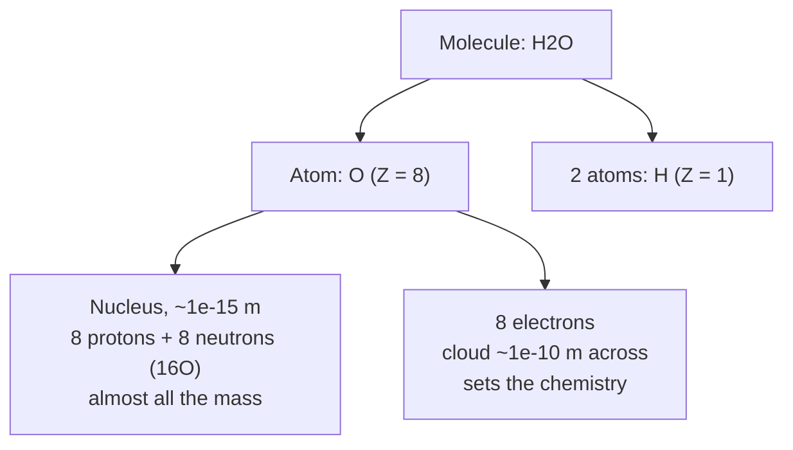

---
aliases:
  - Atome
  - Atomic Structure
  - Subatomic Particle
tags:
  - type/concept
  - domain/chemistry
  - domain/physics
  - level/L1
  - level/L2
mastery: 0
prerequisites:
  - "[[Exponential Function]]"
  - "[[Electric Charge]]"
related:
  - "[[Isotope]]"
  - "[[Atomic Orbital]]"
  - "[[Electron Configuration]]"
  - "[[Periodic Table]]"
  - "[[Molecule]]"
  - "[[Ionic Bond]]"
projects: []
sources:
  - "[[Chemistry 2e (OpenStax)]]"
  - "[[MIT 5.111SC - Principles of Chemical Science]]"
  - "[[Biology 2e (OpenStax)]]"
  - "[[Biochemistry (Berg)]]"
  - "[[NIST Atomic Weights and Isotopic Compositions]]"
  - "[[RCSB Protein Data Bank]]"
---

# Atom

> [!abstract]
> An atom is a tiny positive nucleus of protons and neutrons surrounded by electrons; the number of protons decides which element it is, and six elements (C, H, N, O, P, S) build almost all of a cell's molecules.

## Definition

An **atom** is the smallest unit of an element that keeps the chemical identity of that element. It consists of a **nucleus**, which contains positively charged **protons** and uncharged **neutrons**, surrounded by negatively charged **electrons**. The nucleus holds nearly all the mass but only a minute fraction of the volume: an atom is about $10^{-10}$ m across, its nucleus about $10^{-15}$ m.[^c2e23]

## Why it matters

- **Formulas are atom counts.** Every molecular formula in a database (a metabolite in [[KEGG]], a residue in a protein) is a multiset of atoms; its mass, the quantity measured by [[Mass Spectrometry]], is a sum over atoms ([[Molecule]], [[Isotope]], [[Monoisotopic Mass]]).
- **Structures are atom lists.** A macromolecular structure file is a table of atoms, each with an element and 3D coordinates ([[PDB Format]]).[^rcsb] Distances, contacts and hydrogen bonds are computed between these atoms.
- **Element composition is a label.** Nucleic acids contain phosphorus and proteins contain sulfur (in Cys and Met), which is what makes element-specific labeling of one class of molecule possible ([[Isotope]], [[Radioactive Decay]]).[^berg]

## Core (L1)

**The three particles.**[^c2e23]

| Particle | Location | Charge (units of $e$) | Mass (amu) |
|---|---|---:|---:|
| proton | nucleus | +1 | 1.00727 |
| neutron | nucleus | 0 | 1.00866 |
| electron | outside the nucleus | −1 | 0.00055 |

The **atomic mass unit** (amu, u, or dalton, Da) is defined as 1/12 of the mass of one carbon-12 atom; biochemists give molecular masses in daltons (a protein of 50 kDa).[^c2e23][^berg] A proton or a neutron weighs about 1 u, an electron about 1800 times less, so the mass of an atom is essentially that of its nucleus.

**Two counts identify an atom.**[^c2e23]

- **Atomic number** $Z$: the number of protons. It defines the element: every carbon atom has $Z = 6$. A neutral atom also has $Z$ electrons.
- **Mass number** $A$: the number of protons plus neutrons. Atoms of one element with different $A$ are [[Isotope|isotopes]], written $^{A}_{Z}\text{X}$ or simply $^{A}\text{X}$: $^{12}\text{C}$ (6 p, 6 n) and $^{13}\text{C}$ (6 p, 7 n).
- An atom that gains or loses electrons becomes an **ion**, with charge = protons − electrons: a cation (Na⁺, Mg²⁺) or an anion (Cl⁻).



**The elements of life.** Oxygen, carbon, hydrogen and nitrogen are common to all living organisms and make up about 96% of the human body.[^bio2e] Add **phosphorus** (the phosphate backbone of [[DNA]] and [[RNA]], ATP, phospholipids) and **sulfur** (the side chains of cysteine and methionine) and you have the six elements, C, H, N, O, P, S, of nearly every biomolecule.[^berg] Their atomic numbers are 1 (H), 6 (C), 7 (N), 8 (O), 15 (P) and 16 (S); their most abundant isotopes are $^{1}$H, $^{12}$C, $^{14}$N, $^{16}$O, $^{31}$P (the only stable one) and $^{32}$S.[^nist] Metal ions (Na⁺, K⁺, Mg²⁺, Ca²⁺, Zn²⁺, Fe) are few but essential ([[Ionic Bond]], [[Coordination Complex]]).

## Deeper (L2)

- **Chemistry is electrons.** Nuclei do not change in chemical reactions; atoms bond, ionize and react through their outer electrons. Where those electrons are is described by [[Atomic Orbital|orbitals]] and their filling by the [[Electron Configuration]], which explains the bonding patterns of C, N and O.[^5111][^c2e23]
- **Size scales.** The ratio of diameters, $10^{-10}/10^{-15} = 10^{5}$, means the nucleus occupies about $10^{-15}$ of the atom's volume. What gives an atom its size, and what touches when two molecules meet, is the electron cloud.
- **Masses are not counts.** A mass number is an integer; a measured atomic mass is not (12C is exactly 12 u by definition, 13C is 13.00335 u).[^nist] The difference, and the averaging over isotopes that gives the "atomic weight" printed in tables, is the subject of [[Isotope]].

## Mathematical representation

For an atom or ion of element X:

$$A = Z + N, \qquad q = Z - n_e,$$

where $Z$ is the number of protons, $N$ the number of neutrons, $A$ the mass number, $n_e$ the number of electrons and $q$ the net charge in units of the elementary charge $e$ ([[Electric Charge]]). For a molecule with $k_i$ atoms of element $i$ and net charge $q$, the electron count is $n_e = \sum_i k_i Z_i - q$, and the **nominal mass** (the sum of mass numbers of the most abundant isotopes) is $\sum_i k_i A_i$, an integer approximation of the real mass ([[Monoisotopic Mass]]).

## Computational representation

A molecular formula string is parsed into a dictionary `{element: count}`; per-element constants ($Z$, isotope mass numbers) live in lookup tables.

```python
import re

# Atomic number Z, and mass number A of the most abundant isotope.
Z = {"H": 1, "C": 6, "N": 7, "O": 8, "P": 15, "S": 16}
A_MAJOR = {"H": 1, "C": 12, "N": 14, "O": 16, "P": 31, "S": 32}

def parse_formula(formula: str) -> dict[str, int]:
    """'C3H7NO2' -> {'C': 3, 'H': 7, 'N': 1, 'O': 2} (no parentheses)."""
    counts: dict[str, int] = {}
    for symbol, n in re.findall(r"([A-Z][a-z]?)(\d*)", formula):
        counts[symbol] = counts.get(symbol, 0) + (int(n) if n else 1)
    return counts

def particles(formula: str, charge: int = 0) -> tuple[int, int, int]:
    """Protons, neutrons (major isotopes) and electrons of a molecule or ion."""
    atoms = parse_formula(formula)
    protons = sum(Z[el] * k for el, k in atoms.items())
    neutrons = sum((A_MAJOR[el] - Z[el]) * k for el, k in atoms.items())
    return protons, neutrons, protons - charge

for name, formula, q in [("water", "H2O", 0), ("phosphate", "PO4", -3),
                         ("alanine", "C3H7NO2", 0)]:
    p, n, e = particles(formula, q)
    print(f"{name:9} {formula:8} p={p:2} n={n:2} e={e:2} A_total={p + n}")
```

```text
water     H2O      p=10 n= 8 e=10 A_total=18
phosphate PO4      p=47 n=48 e=50 A_total=95
alanine   C3H7NO2  p=48 n=41 e=48 A_total=89
```

The nominal mass of alanine (89) matches its tabulated molecular weight to the integer, but the measured mass is not 89 exactly ([[Isotope]]).

## Worked example

> [!example] The phosphate ion, PO₄³⁻
> 1. **Protons.** P has $Z = 15$, O has $Z = 8$: $15 + 4 \times 8 = 47$.
> 2. **Electrons.** Charge $-3$ means 3 more electrons than protons: $47 + 3 = 50$.
> 3. **Neutrons** (major isotopes $^{31}$P, $^{16}$O): $(31 - 15) + 4 \times (16 - 8) = 16 + 32 = 48$.
> 4. **Nominal mass**: $47 + 48 = 95$. The 3 extra electrons add only about $3 \times 0.00055 = 0.0017$ u, which is why mass spectrometry can ignore electrons in a first approximation but not in an exact calculation ([[Monoisotopic Mass]]).

## Common misconceptions

> [!warning] "Electrons orbit the nucleus like planets"
> The planetary picture (the Bohr model) was abandoned: an electron has no trajectory, only a probability of being found in each region, described by an [[Atomic Orbital|orbital]].[^c2e6]

> [!warning] "The mass number is the atomic mass"
> The mass number is an integer count of nucleons. The atomic mass of an isotope is a measured, non-integer quantity, and the atomic weight of an element is an average over its isotopes ([[Isotope]]).[^nist]

## Exercises

> [!question] Exercise 1 (L1)
> Give $Z$, the number of neutrons and the number of electrons of a neutral $^{31}$P atom and a neutral $^{32}$S atom.

> [!success]- Solution
> P: $Z = 15$, $N = 31 - 15 = 16$, 15 electrons. S: $Z = 16$, $N = 32 - 16 = 16$, 16 electrons. Same neutron count, different elements: only $Z$ matters.

> [!question] Exercise 2 (L2)
> Show that H₂O, NH₃, CH₄, NH₄⁺ and OH⁻ all have the same number of electrons, and say why this matters for their shapes.

> [!success]- Solution
> H₂O: $2 + 8 = 10$. NH₃: $7 + 3 = 10$. CH₄: $6 + 4 = 10$. NH₄⁺: $7 + 4 - 1 = 10$. OH⁻: $8 + 1 + 1 = 10$. All are **isoelectronic** with neon: a central atom with 8 valence electrons in four pairs, which is why their geometries derive from the same tetrahedron ([[Molecular Geometry]]). `particles(f, q)[2]` returns 10 for all five.

> [!question] Exercise 3 (L3, Python)
> Formulas often contain groups: `Ca(OH)2`, `(CH3)3N`. Write `parse_nested(formula)` with a stack, then compute the nominal mass of cysteine, C₃H₇NO₂S.[^berg]

> [!success]- Solution
> ```python
> import re
>
> A_MAJOR = {"H": 1, "C": 12, "N": 14, "O": 16, "P": 31, "S": 32}
>
> def parse_nested(formula: str) -> dict[str, int]:
>     """Formula with parentheses, e.g. 'Ca(OH)2' or '(CH3)3N'."""
>     stack: list[dict[str, int]] = [{}]
>     for m in re.finditer(r"\(|\)(\d*)|([A-Z][a-z]?)(\d*)", formula):
>         if m.group(0) == "(":
>             stack.append({})
>         elif m.group(0).startswith(")"):
>             group, k = stack.pop(), int(m.group(1) or 1)
>             for el, n in group.items():
>                 stack[-1][el] = stack[-1].get(el, 0) + n * k
>         else:
>             el, n = m.group(2), int(m.group(3) or 1)
>             stack[-1][el] = stack[-1].get(el, 0) + n
>     return stack[0]
>
> print(parse_nested("Ca(OH)2"), parse_nested("(CH3)3N"))
> atoms = parse_nested("C3H7NO2S")
> print(sum(A_MAJOR[e] * k for e, k in atoms.items()))
> ```
> Output: `{'Ca': 1, 'O': 2, 'H': 2} {'C': 3, 'H': 9, 'N': 1}`, then `121`. Each `(` opens a new counter; each `)k` multiplies the group by $k$ and merges it into the enclosing one, the same stack discipline as parsing nested parentheses in any language.

## Mastery checklist

- [ ] 1 Recognized: I can name the three particles, their charges and where they sit.
- [ ] 2 Understood: I can explain atomic number, mass number, ions and why the nucleus holds the mass but the electrons hold the chemistry.
- [ ] 3 Practiced: I can count protons, neutrons and electrons of any atom, ion or small molecule, by hand and with a formula parser.
- [ ] 4 Applied: I parsed real molecular formulas (metabolites, amino acids) and used element counts to compute masses.
- [ ] 5 Explained: I can explain why C, H, N, O, P and S dominate biomolecules and why nominal mass is only an approximation.

## References

[^c2e23]: [[Chemistry 2e (OpenStax)]], ch. 2 "Atoms, Molecules, and Ions", §2.3 "Atomic Structure and Symbolism" (Table 2.1 "Properties of Subatomic Particles").
[^c2e6]: [[Chemistry 2e (OpenStax)]], ch. 6, §6.3 "Development of Quantum Theory".
[^5111]: [[MIT 5.111SC - Principles of Chemical Science]], Unit I "The Atom".
[^bio2e]: [[Biology 2e (OpenStax)]], Unit 1 "The Chemistry of Life".
[^berg]: [[Biochemistry (Berg)]], 5th ed. (2002).
[^nist]: [[NIST Atomic Weights and Isotopic Compositions]], relative atomic masses and isotopic compositions of H, C, N, O, P, S.
[^rcsb]: [[RCSB Protein Data Bank]].
