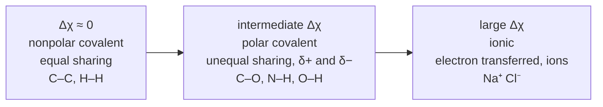

---
aliases:
  - Chemical Bonding
  - Bond
  - Liaison chimique
tags:
  - type/concept
  - domain/chemistry
  - domain/biology
  - level/L1
  - level/L2
mastery: 0
prerequisites:
  - "[[Atom]]"
  - "[[Electron Configuration]]"
  - "[[Electronegativity]]"
  - "[[Potential Energy]]"
related:
  - "[[Ionic Bond]]"
  - "[[Covalent Bond]]"
  - "[[Molecule]]"
  - "[[Lewis Structure]]"
  - "[[Intermolecular Force]]"
  - "[[Hydrogen Bond]]"
  - "[[Molecular Orbital Theory]]"
  - "[[Boltzmann Distribution]]"
  - "[[Enthalpy]]"
projects: []
sources:
  - "[[Chemistry 2e (OpenStax)]]"
  - "[[MIT 5.111SC - Principles of Chemical Science]]"
  - "[[Molecular Biology of the Cell (Alberts)]]"
  - "[[Physical Biology of the Cell (Phillips)]]"
  - "[[Lehninger Principles of Biochemistry (Nelson)]]"
---

# Chemical Bond

> [!abstract]
> Atoms stay together when, together, they have less energy than apart; where the bonding electrons sit, shared or transferred, places each bond somewhere between purely covalent and ionic.

## Definition

A **chemical bond** is an attraction that holds atoms together, produced by a rearrangement of their valence electrons: transferred from one atom to the other (**ionic bond**) or shared between them (**covalent bond**).[^chem2e][^5111] It forms because the bonded atoms have a lower energy than the separated ones; the energy needed to break it is the **bond energy**.[^chem2e]

## Why it matters

- **Strong versus weak decides what "the molecule" is.** A sequence in a FASTA file is a chain of covalent bonds; the fold of a protein and the pairing of DNA strands are many weak non-covalent interactions ([[Intermolecular Force]], [[Hydrogen Bond]]). In water the two differ by one to two orders of magnitude in energy.[^alberts]
- **Thermal energy sets what is reversible.** At 37 °C covalent bonds do not break by thermal motion, while non-covalent contacts break and re-form constantly: binding and unbinding, folding and strand separation are possible without destroying the chain (see Deeper).
- **Polarity predicts interactions.** Placing each bond on the ionic-covalent scale tells which groups carry partial charges: the polar O–H and N–H groups are the hydrogen-bond donors of proteins and nucleic acids ([[Electronegativity]]).
- **Energy bookkeeping.** Bond and interaction energies are what [[Force Field|force fields]] and [[Molecular Docking|docking]] scores later try to compute.

## Core (L1)

### Why atoms bond: lower energy

![[h2-bond-potential-energy-curve.svg]]

Follow the energy of two hydrogen atoms as they approach.[^chem2e]

1. **Far apart**, they do not interact: call this energy zero.
2. **Closer**, each electron is attracted by both nuclei and the energy falls.
3. **Too close**, the repulsion between the nuclei (and between the electrons) dominates and the energy rises steeply.

The minimum, at 74 pm, is the **bond length** of H₂; its depth, 436 kJ/mol, is the H–H **bond energy**, the energy needed to separate one mole of H–H bonds into atoms. Breaking a bond always costs energy; forming it releases the same amount.[^chem2e] A bonded arrangement exists because it is lower in energy than the separated atoms; why sharing electrons lowers the energy is the subject of [[Molecular Orbital Theory]].

### The ionic-covalent continuum

What happens to the bonding electrons depends on how strongly each atom pulls them, its [[Electronegativity]] $\chi$.[^chem2e][^5111]



With the Pauling values tabulated in Chemistry 2e (H 2.1, C 2.5, N 3.0, O 3.5, S 2.5, Na 0.9, K 0.8, Cl 3.0),[^chem2e] the bonds of biology spread over the whole scale:

| Bond | Δχ | Character | Where |
|---|---:|---|---|
| C–C | 0.0 | nonpolar covalent | carbon skeletons |
| C–H, S–H | 0.4 | nearly nonpolar | hydrocarbon chains, the thiol of Cys |
| C–N | 0.5 | weakly polar | protein backbone |
| N–H | 0.9 | polar covalent | amide and amino groups |
| C–O | 1.0 | polar covalent | sugars, alcohols |
| O–H | 1.4 | polar covalent | water, Ser, Thr, Tyr, sugars |
| Na–Cl, K–Cl | 2.1, 2.2 | ionic | salts ([[Ionic Bond]]) |

Covalent and ionic are the two ends of one scale, not two boxes: cut-offs on Δχ are rough guides with exceptions.[^chem2e]

### Strong bonds and weak interactions

Alberts compares the bonds that matter in cells (kcal/mol in the source; kJ/mol computed with 1 kcal = 4.184 kJ):[^alberts]

| Bond type | Length (nm) | Strength in vacuum | Strength in water |
|---|---:|---:|---:|
| covalent | 0.15 | 90 (377 kJ/mol) | 90 (377 kJ/mol) |
| ionic | 0.25 | 80 (335) | 3 (12.6) |
| hydrogen | 0.30 | 4 (16.7) | 1 (4.2) |
| van der Waals attraction (per atom) | 0.35 | 0.1 (0.4) | 0.1 (0.4) |

Two lessons: covalent bonds are much stronger than the others, and water weakens ionic and hydrogen bonds, because water molecules compete for the charges ([[Ionic Bond#Deeper (L2)]], [[Water]]).[^alberts]

## Deeper (L2)

### Bond energy against thermal energy

The thermal energy per mole at absolute temperature $T$ is of order $RT$, with $R = 8.314$ J mol⁻¹ K⁻¹:[^gas] 2.58 kJ/mol at 37 °C. The Boltzmann factor $e^{-\Delta E/RT}$ gives the relative weight of a state $\Delta E$ higher in energy ([[Boltzmann Distribution]]).[^pboc] With the strengths in water above (computed below):

| In water | $\Delta E$ (kJ/mol) | $\Delta E / RT$ | $e^{-\Delta E/RT}$ |
|---|---:|---:|---:|
| covalent | 376.6 | 146 | 4 × 10⁻⁶⁴ |
| ionic | 12.6 | 4.9 | 8 × 10⁻³ |
| hydrogen | 4.2 | 1.6 | 0.2 |
| van der Waals | 0.4 | 0.2 | 0.85 |

Thermal motion never breaks a covalent bond: in a cell, that takes a chemical reaction, usually catalysed by an enzyme ([[Hydrolysis]], [[Enzyme]]). A single non-covalent contact is weak, and structures held by such contacts are stable only because they combine many of them.[^alberts] The factor ignores entropy; the full balance is a free energy ([[Gibbs Free Energy]]).

### Bond energies are averages

Tabulated bond energies (C–H, C–C, ...) are averages over many molecules: one particular bond's energy depends on the rest of its molecule, so enthalpies estimated from bond energies are approximate ([[Covalent Bond#Deeper (L2)]], [[Enthalpy]]).[^chem2e]

## Mathematical representation

- $E(r)$: potential energy of two atoms at distance $r$, with $E(\infty) = 0$. Bond length $r_0 = \arg\min_r E(r)$; bond energy $D = E(\infty) - E(r_0) = -E(r_0) > 0$.
- Near $r_0$, $E'(r_0) = 0$ and a Taylor expansion gives $E(r) \approx -D + \tfrac{1}{2} k (r - r_0)^2$, with $k = E''(r_0) > 0$: a spring of stiffness $k$ ([[Harmonic Oscillator]]). The parabola never levels off, so this approximation cannot describe breaking.
- Polarity: $\Delta\chi = |\chi_A - \chi_B|$, $\chi$ the Pauling electronegativity; the bonding electrons shift toward the atom of larger $\chi$, which carries the partial charge $\delta-$.
- Thermal comparison: $w = e^{-\Delta E/RT}$, with $\Delta E$ in J/mol, $R$ the gas constant, $T$ in kelvin.

## Computational representation

```python
import math

# Pauling electronegativities as tabulated in Chemistry 2e (one decimal)
EN = {"H": 2.1, "C": 2.5, "N": 3.0, "O": 3.5, "S": 2.5, "Na": 0.9, "K": 0.8, "Cl": 3.0}


def delta_en(a: str, b: str) -> float:
    return round(abs(EN[a] - EN[b]), 1)


bonds = [("C", "C"), ("C", "H"), ("S", "H"), ("C", "N"), ("N", "H"),
         ("C", "O"), ("O", "H"), ("Na", "Cl"), ("K", "Cl")]
for a, b in sorted(bonds, key=lambda p: delta_en(*p)):
    pulled = "nobody (equal sharing)" if EN[a] == EN[b] else max(a, b, key=EN.get)
    print(f"{a + '-' + b:6} ΔEN = {delta_en(a, b):.1f}   electrons pulled toward {pulled}")

R, KCAL = 8.314, 4.184                       # J/(mol K); kJ per kcal
IN_WATER = {"covalent": 90, "ionic": 3, "hydrogen": 1, "van der Waals": 0.1}  # kcal/mol
rt = R * 310.15 / 1000                       # kJ/mol at 37 °C
print(f"RT at 37 °C = {rt:.2f} kJ/mol")
for name, kcal in IN_WATER.items():
    e = kcal * KCAL
    print(f"{name:14}{e:7.1f} kJ/mol = {e / rt:6.1f} RT   exp(-E/RT) = {math.exp(-e / rt):.1e}")
```

```text
C-C    ΔEN = 0.0   electrons pulled toward nobody (equal sharing)
C-H    ΔEN = 0.4   electrons pulled toward C
S-H    ΔEN = 0.4   electrons pulled toward S
C-N    ΔEN = 0.5   electrons pulled toward N
N-H    ΔEN = 0.9   electrons pulled toward N
C-O    ΔEN = 1.0   electrons pulled toward O
O-H    ΔEN = 1.4   electrons pulled toward O
Na-Cl  ΔEN = 2.1   electrons pulled toward Cl
K-Cl   ΔEN = 2.2   electrons pulled toward Cl
RT at 37 °C = 2.58 kJ/mol
covalent        376.6 kJ/mol =  146.0 RT   exp(-E/RT) = 3.8e-64
ionic            12.6 kJ/mol =    4.9 RT   exp(-E/RT) = 7.7e-03
hydrogen          4.2 kJ/mol =    1.6 RT   exp(-E/RT) = 2.0e-01
van der Waals     0.4 kJ/mol =    0.2 RT   exp(-E/RT) = 8.5e-01
```

## Worked example

> [!example] The bonds of serine
> Serine is HO–CH₂–CH(NH₂)–COOH ([[Amino Acid]]). Place each bond on the scale and find the hydrogen-bond donors.
>
> 1. **Nonpolar**: C–C (Δχ = 0) and C–H (0.4), the carbon skeleton.
> 2. **Polar**: C–N (0.5), C–O and C=O (1.0), N–H (0.9), O–H (1.4).
> 3. **Partial charges**: in each polar bond, O or N carries δ−, its partner δ+.
> 4. **Donors**: hydrogens bonded to N or O are the hydrogen-bond donors; hydrogens on C are not ([[Hydrogen Bond]]).[^alberts]
> 5. **Ionic?** Every bond inside serine is covalent. At pH 7 its amino and carboxyl groups are ionized (–NH₃⁺, –COO⁻), and these charges interact with ions and water around them ([[Ionic Bond]]).

## Common misconceptions

> [!warning] "Breaking a bond releases energy"
> Breaking a bond always costs energy; energy is released when bonds form.[^chem2e] The "high-energy bonds" of [[ATP]] are a shorthand: the free energy of ATP hydrolysis belongs to the whole reaction, products against reactants (charge repulsion, resonance and hydration), not to one bond that gives energy when broken.[^lehninger]

> [!warning] "Ionic and covalent are two separate kinds of bond"
> Bond character changes continuously with Δχ; any border is a convention.[^chem2e]

> [!warning] "Ionic bonds are the strongest bonds"
> In vacuum an ion pair rivals a covalent bond, but in water it drops from 80 to 3 kcal/mol, 30 times weaker than a covalent bond.[^alberts] In cells, ionic interactions are weak, reversible contacts.

> [!warning] "The closer the atoms, the stronger the bond"
> Below the bond length the energy rises (the repulsive wall). The bond length is a compromise between attraction and repulsion.

## Exercises

> [!question] Exercise 1 (L1)
> Rank by polarity C–H, O–H, Na–Cl, C–C, N–H and C–O, and classify each as nonpolar covalent, polar covalent or ionic.

> [!success]- Solution
> C–C (0.0) < C–H (0.4) < N–H (0.9) < C–O (1.0) < O–H (1.4) < Na–Cl (2.1). C–C is nonpolar, C–H nearly so; N–H, C–O and O–H are polar covalent; Na–Cl, a metal with a nonmetal, is ionic.

> [!question] Exercise 2 (L1)
> On the H₂ curve, describe the energy at 200 pm, 74 pm and 30 pm. How much energy does it take to dissociate 1 mol of H₂ (2.016 g) into atoms?

> [!success]- Solution
> At 200 pm, slightly below zero: weak attraction. At 74 pm, the minimum (−436 kJ/mol relative to free atoms): the bond. At 30 pm, above zero: repulsion wins. Dissociating 1 mol of H₂ costs the bond energy, 436 kJ.[^chem2e]

> [!question] Exercise 3 (L2)
> From the bond-strength table, compute the vacuum/water strength ratio for ionic and hydrogen bonds. Why is the covalent bond unaffected?

> [!success]- Solution
> Ionic: 80/3 ≈ 27; hydrogen: 4/1 = 4. Both are attractions between charges or partial charges, which water molecules screen and compete for. A covalent bond is an electron pair shared between two nuclei; the solvent does not get in between.[^alberts]

> [!question] Exercise 4 (L2, Python)
> Compute $e^{-\Delta E/RT}$ at 37 °C and at 95 °C for a hydrogen bond in water (4.2 kJ/mol) and a covalent bond (376.6 kJ/mol). What can heating change, and what not?

> [!success]- Solution
> ```python
> for t_celsius in (37, 95):
>     rt = R * (t_celsius + 273.15) / 1000
>     print(f"{t_celsius} °C: RT = {rt:.2f} kJ/mol, hydrogen bond {math.exp(-4.2 / rt):.2f}, "
>           f"covalent {math.exp(-376.6 / rt):.0e}")
> # 37 °C: RT = 2.58 kJ/mol, hydrogen bond 0.20, covalent 4e-64
> # 95 °C: RT = 3.06 kJ/mol, hydrogen bond 0.25, covalent 4e-54
> ```
> The covalent factor stays negligible: heating never breaks the backbone of a DNA strand or a protein. The weight of the broken state of each non-covalent contact rises, and a structure held by many cooperative contacts (a DNA duplex, a folded protein) can come apart. The real transition is set by free energy, including entropy, so this is an order-of-magnitude argument only.

> [!question] Exercise 5 (L2)
> Near its minimum, model the H₂ curve as $E(r) \approx -D + \tfrac12 k (r - r_0)^2$ with an assumed $k = 0.35$ kJ mol⁻¹ pm⁻². What energy does a 10 pm stretch cost? Why does the model fail for large stretches?

> [!success]- Solution
> $\Delta E = \tfrac12 \times 0.35 \times 10^2 = 17.5$ kJ/mol, small next to $D = 436$ kJ/mol. A parabola grows without limit, whereas the real curve levels off at zero: a spring never breaks, a bond does. The harmonic model is valid only for small vibrations.

## Mastery checklist

- [ ] 1 Recognized: I can say that a bond forms because it lowers the energy, and name ionic and covalent bonds.
- [ ] 2 Understood: I can read a potential energy curve (bond length, bond energy, repulsive wall) and place a bond on the ionic-covalent scale from Δχ.
- [ ] 3 Practiced: I can classify the bonds of a biomolecule, find its hydrogen-bond donors, and compare bond strengths with $RT$ in Python.
- [ ] 4 Applied: I can explain, for a real structure or protocol, which interactions heat, salt or a solvent can disrupt and which bonds stay intact.
- [ ] 5 Explained: I can teach why bond character is a continuum, why water weakens ionic and hydrogen bonds, and the limits of bond-energy and harmonic models.

## References

[^chem2e]: [[Chemistry 2e (OpenStax)]], ch. 7 "Chemical Bonding and Molecular Geometry", §7.1 "Ionic Bonding", §7.2 "Covalent Bonding" (electronegativity, Pauling values, bond polarity, the H₂ potential energy curve) and §7.5 "Strengths of Ionic and Covalent Bonds" (bond energies as averages, H–H 436 kJ/mol).
[^5111]: [[MIT 5.111SC - Principles of Chemical Science]], Unit II "Chemical Bonding & Structure", Lecture 9 "Periodic Table; Ionic and Covalent Bonds".
[^alberts]: [[Molecular Biology of the Cell (Alberts)]], 4th ed. (2002), treatment of cell chemistry: table of covalent and noncovalent bonds (length, strength in vacuum and in water), hydrogen bonds between H attached to O or N and another electronegative atom, many weak bonds acting together.
[^gas]: [[Chemistry 2e (OpenStax)]], treatment of the ideal gas law (gas constant $R$).
[^pboc]: [[Physical Biology of the Cell (Phillips)]], treatment of statistical mechanics (Boltzmann distribution, thermal energy scale).
[^lehninger]: [[Lehninger Principles of Biochemistry (Nelson)]], 8th ed. (2021), treatment of phosphoryl group transfers and ATP (why the free energy of ATP hydrolysis is large).
